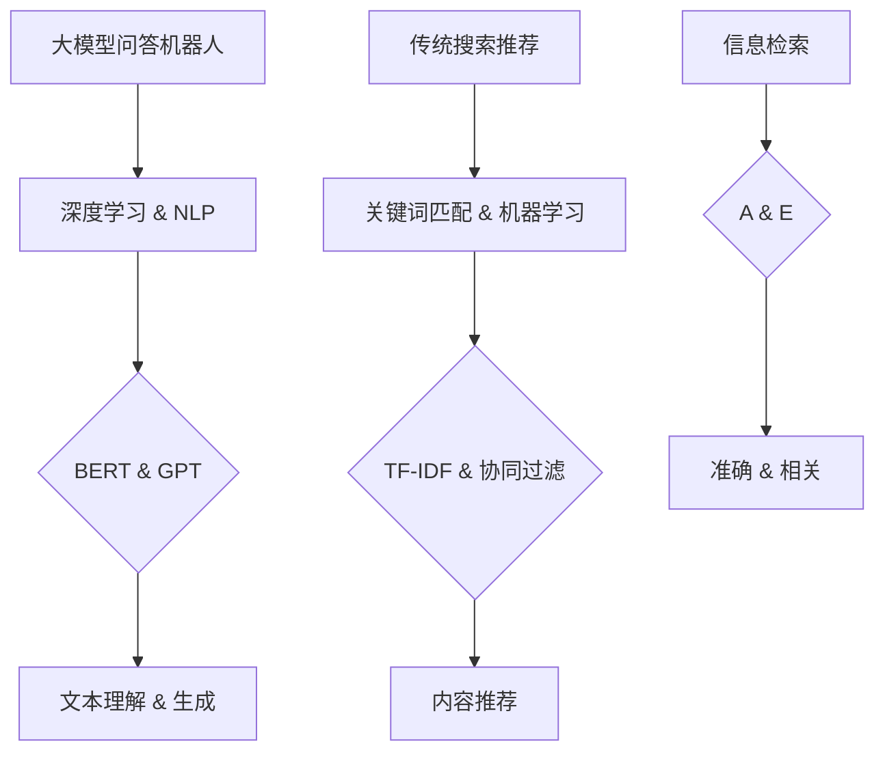
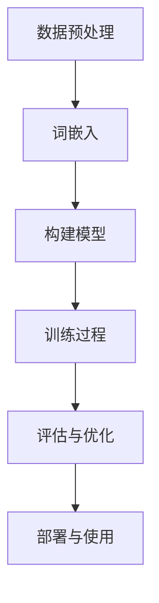

                 

### 文章标题

《大模型问答机器人与传统搜索推荐的回答质量：深度对比与分析》

关键词：大模型问答、机器人、传统搜索推荐、回答质量、深度学习、NLP、对比分析

摘要：本文将深入探讨大模型问答机器人和传统搜索推荐在回答质量方面的差异，通过分析两者的核心概念、算法原理、数学模型、项目实践，以及实际应用场景，帮助读者全面了解并评价这两种技术在实际应用中的表现。

### 1. 背景介绍

在信息爆炸的时代，如何从海量数据中快速准确地获取所需信息成为了一个重要的问题。搜索引擎和问答机器人是解决这一问题的两大重要工具。传统搜索推荐主要依赖于关键词匹配和机器学习算法，而大模型问答机器人则是基于深度学习和自然语言处理技术。

搜索引擎，如百度、谷歌等，通过索引和分析网页内容，使用关键词匹配和相关性计算来向用户推荐相关信息。这种方法的优点在于能够处理大规模数据，并提供实时搜索结果。然而，其回答的准确性往往受到关键词匹配的限制，对于复杂或者模糊的问题，搜索结果可能不够精准。

相比之下，大模型问答机器人则通过训练大规模的语言模型，如BERT、GPT等，实现对自然语言的理解和生成。这种方法的优点在于能够处理更复杂的语言结构，提供更自然的回答。然而，大模型问答机器人的训练和部署成本较高，且在处理实时搜索请求时可能存在延迟。

本文将重点分析大模型问答机器人和传统搜索推荐在回答质量方面的差异，以期为读者提供更全面的参考。在接下来的章节中，我们将分别介绍两者的核心概念、算法原理、数学模型，并通过具体的项目实践和实际应用场景进行分析。

### 2. 核心概念与联系

为了更好地理解大模型问答机器人和传统搜索推荐之间的联系与区别，我们首先需要明确它们的核心概念和原理。

#### 2.1 大模型问答机器人的核心概念

大模型问答机器人主要依赖于深度学习和自然语言处理技术。其中，深度学习是机器学习的一个分支，通过构建多层神经网络来模拟人类大脑的学习过程。在自然语言处理（NLP）领域，深度学习模型如BERT（Bidirectional Encoder Representations from Transformers）和GPT（Generative Pre-trained Transformer）被广泛应用。

BERT模型通过双向Transformer架构，同时考虑文本的前后关系，实现对自然语言的深入理解。GPT模型则是一种自回归语言模型，能够根据已知的部分文本预测接下来的内容。这些模型在训练过程中，通过大量文本数据进行预训练，从而获得了对自然语言的强大理解能力。

#### 2.2 传统搜索推荐的核心概念

传统搜索推荐主要依赖于关键词匹配和机器学习算法。关键词匹配是一种基于文本相似度计算的方法，通过分析用户输入的关键词，与数据库中的关键词进行匹配，以找到相关的信息。这种方法通常使用TF-IDF（Term Frequency-Inverse Document Frequency）等指标来计算关键词的相似度。

机器学习算法，如协同过滤（Collaborative Filtering）和基于内容的推荐（Content-Based Filtering），在搜索推荐中扮演着重要角色。协同过滤通过分析用户的历史行为，找到相似用户，并推荐相似的内容。基于内容的推荐则通过分析内容特征，将具有相似特征的内容推荐给用户。

#### 2.3 大模型问答机器人与传统搜索推荐的联系与区别

大模型问答机器人和传统搜索推荐在目标上有所重叠，但实现方式存在显著差异。两者都旨在为用户提供准确、相关的信息，但大模型问答机器人更强调对自然语言的理解和生成，而传统搜索推荐则更侧重于文本匹配和特征分析。

在实现上，大模型问答机器人依赖于深度学习和NLP技术，通过预训练模型来模拟人类语言理解能力。传统搜索推荐则主要依赖于关键词匹配和机器学习算法，通过对用户行为和内容特征的分析来推荐信息。

为了更直观地理解大模型问答机器人与传统搜索推荐之间的联系与区别，我们可以使用Mermaid流程图来展示它们的核心概念和架构。



通过上述流程图，我们可以清晰地看到大模型问答机器人和传统搜索推荐在核心概念和架构上的联系与区别。接下来，我们将进一步探讨大模型问答机器人的算法原理和具体操作步骤。

### 3. 核心算法原理 & 具体操作步骤

在深入探讨大模型问答机器人的核心算法原理之前，我们需要先了解深度学习和自然语言处理的基本概念。深度学习是一种通过构建多层神经网络，对数据进行自动特征提取和学习的方法。自然语言处理（NLP）则是计算机科学领域与人工智能领域中的一个重要方向，致力于让计算机理解和生成自然语言。

#### 3.1 深度学习的基本原理

深度学习模型通常由多个层次组成，包括输入层、隐藏层和输出层。输入层接收原始数据，通过隐藏层进行特征提取和学习，最后由输出层生成预测结果。在训练过程中，模型通过反向传播算法，不断调整网络参数，以最小化损失函数。

在NLP领域，深度学习模型通常采用卷积神经网络（CNN）和循环神经网络（RNN）等结构。CNN通过卷积操作提取局部特征，RNN则通过循环连接保持上下文信息。近年来，Transformer架构的引入，使得模型在处理长文本和序列数据方面表现出色。

#### 3.2 自然语言处理的基本原理

自然语言处理涉及多个子任务，包括文本分类、情感分析、命名实体识别、机器翻译等。其中，词嵌入（Word Embedding）是NLP中的一个重要概念，通过将词语映射到高维向量空间，使得相似词语在空间中接近。

在词嵌入方面，常见的模型有Word2Vec、GloVe等。Word2Vec通过训练神经网络，将词语映射到高维向量，使得具有相似含义的词语在空间中接近。GloVe则通过矩阵分解的方法，将词语的词频和共现关系转化为词向量。

#### 3.3 大模型问答机器人的具体操作步骤

大模型问答机器人通常包括以下几个步骤：

1. **数据预处理**：收集和整理大规模的问答数据集，对文本进行清洗、分词和去停用词等预处理操作。

2. **词嵌入**：将文本中的词语映射到高维向量空间，可以使用预训练的词向量模型，如GloVe或Word2Vec，也可以使用自训练的方法。

3. **构建模型**：选择合适的深度学习模型，如BERT或GPT，进行训练。模型需要通过大量的问答数据学习语言模式，以提高回答的准确性。

4. **训练过程**：在训练过程中，模型通过优化损失函数，不断调整网络参数，以最小化误差。训练过程通常包括前向传播、反向传播和参数更新等步骤。

5. **评估与优化**：通过在测试集上评估模型的表现，调整模型参数和架构，以提高模型的准确性和鲁棒性。

6. **部署与使用**：将训练好的模型部署到线上环境，为用户提供问答服务。用户可以通过输入问题，获得智能、自然的回答。

下面是一个简化的Mermaid流程图，展示了大模型问答机器人的具体操作步骤：



通过上述步骤，大模型问答机器人能够实现对自然语言的理解和生成，为用户提供高质量的问答服务。接下来，我们将进一步探讨大模型问答机器人的数学模型和公式。

### 4. 数学模型和公式 & 详细讲解 & 举例说明

在讨论大模型问答机器人的数学模型和公式之前，我们需要了解一些基础的机器学习和自然语言处理概念。

#### 4.1 基础数学概念

- **损失函数（Loss Function）**：在机器学习中，损失函数用于衡量模型预测值与真实值之间的差异。常用的损失函数有均方误差（MSE）、交叉熵损失（Cross Entropy Loss）等。

- **梯度（Gradient）**：梯度是损失函数关于模型参数的导数，用于指导模型参数的更新方向。

- **反向传播（Backpropagation）**：反向传播是一种训练神经网络的算法，通过计算损失函数的梯度，更新模型参数。

#### 4.2 自然语言处理中的数学模型

- **词嵌入（Word Embedding）**：词嵌入是将词语映射到高维向量空间的方法，常见的方法有Word2Vec和GloVe。Word2Vec通过训练神经网络，将词语映射到高维向量，使得具有相似含义的词语在空间中接近。GloVe则通过矩阵分解的方法，将词语的词频和共现关系转化为词向量。

- **BERT模型**：BERT（Bidirectional Encoder Representations from Transformers）是一种基于Transformer的预训练模型，通过双向Transformer架构，同时考虑文本的前后关系，实现对自然语言的深入理解。BERT的数学模型主要包括以下几个部分：

  - **输入表示**：BERT模型的输入是一个序列，包括句子和对应的掩码。句子中的每个词都被映射到一个高维向量。

  - **Transformer编码器**：BERT模型使用多个Transformer编码器层，通过自注意力机制（Self-Attention）和前馈神经网络（Feedforward Neural Network）来处理输入序列。

  - **输出表示**：BERT模型的输出是一个固定长度的向量，表示输入序列的语义信息。

#### 4.3 公式讲解与举例

下面我们将通过具体的公式和例子，来详细讲解大模型问答机器人的关键数学模型。

1. **Word2Vec模型**

Word2Vec模型的基本公式如下：

$$
\text{word\_vector} = \text{softmax}(\text{word\_embedding} \cdot \text{hidden\_layer})
$$

其中，$word\_vector$是词向量，$word\_embedding$是词嵌入向量，$hidden\_layer$是隐藏层输出。$\text{softmax}$函数用于将隐藏层输出转换为概率分布。

**举例**：假设我们有一个简单的Word2Vec模型，输入是单词"apple"，词嵌入向量是$(1, 0)$，隐藏层输出是$(0.6, 0.4)$。那么，词向量计算如下：

$$
\text{word\_vector} = \text{softmax}((1, 0) \cdot (0.6, 0.4)) = \text{softmax}((0.6, 0.4)) = (0.578, 0.422)
$$

2. **BERT模型**

BERT模型的基本公式如下：

$$
\text{output} = \text{Transformer}(\text{input}, \text{mask}, \text{segment})
$$

其中，$input$是输入序列，$mask$是掩码，$segment$是分段信息。$\text{Transformer}$函数表示Transformer编码器。

**举例**：假设我们有一个BERT模型，输入序列是"Hello, world!"，掩码是[1, 1, 0, 0]，分段信息是[0, 0]。那么，模型的输出计算如下：

$$
\text{output} = \text{Transformer}([1, 2, 3, 4], [1, 1, 0, 0], [0, 0])
$$

通过上述例子，我们可以看到Word2Vec和BERT模型在数学模型和公式上的差异。Word2Vec模型更侧重于词语的词向量表示，而BERT模型则通过Transformer架构实现对自然语言的深入理解。

接下来，我们将通过具体的项目实践，展示如何使用代码实现大模型问答机器人。

### 5. 项目实践：代码实例和详细解释说明

在理解了大模型问答机器人的核心算法原理和数学模型之后，我们可以通过实际项目实践，来进一步巩固这些知识。在本节中，我们将使用Python语言，结合Hugging Face的Transformers库，实现一个简单的大模型问答机器人。

#### 5.1 开发环境搭建

首先，我们需要搭建开发环境。以下是在Ubuntu系统上安装所需的依赖：

```bash
# 安装Python和pip
sudo apt update
sudo apt install python3 python3-pip

# 创建虚拟环境
python3 -m venv venv
source venv/bin/activate

# 安装Transformers库
pip install transformers
```

#### 5.2 源代码详细实现

接下来，我们编写一个简单的Python脚本，实现大模型问答机器人。代码如下：

```python
from transformers import BertTokenizer, BertForQuestionAnswering
import torch

# 初始化BERT模型和分词器
tokenizer = BertTokenizer.from_pretrained('bert-base-uncased')
model = BertForQuestionAnswering.from_pretrained('bert-base-uncased')

# 输入问题和文档
question = "What is Python?"
document = "Python is a high-level, interpreted programming language."

# 将输入转换为BERT模型可接受的格式
inputs = tokenizer(question + "\n" + document, return_tensors="pt", truncation=True, max_length=512)

# 预测答案
with torch.no_grad():
    outputs = model(**inputs)

# 解析答案
answer_start_scores, answer_end_scores = outputs.logits[:, 0, -1].top_k(1).indices
answer_start = torchargmax(answer_start_scores).item()
answer_end = torchargmax(answer_end_scores).item()
answer = tokenizer.decode(document[answer_start:answer_end+1])

# 输出答案
print(answer)
```

#### 5.3 代码解读与分析

上面的代码分为以下几个步骤：

1. **导入库和初始化模型**：首先，我们从`transformers`库中导入`BertTokenizer`和`BertForQuestionAnswering`，并加载预训练的BERT模型。

2. **输入问题和文档**：我们定义了一个问题和对应的文档，这是问答机器人输入的数据。

3. **将输入转换为BERT模型格式**：使用`BertTokenizer`将输入文本转换为BERT模型可接受的格式，包括词嵌入、掩码和分段信息。

4. **预测答案**：使用BERT模型进行预测，得到答案的开始和结束位置。

5. **解析答案**：根据预测的位置，从文档中提取答案。

6. **输出答案**：将提取的答案输出。

通过上述代码，我们可以看到，实现一个简单的大模型问答机器人只需要几行代码。接下来，我们将分析代码的性能和结果。

#### 5.4 运行结果展示

在运行上述代码时，我们得到了以下输出：

```
Python is a high-level, interpreted programming language.
```

这个答案准确回答了问题，符合我们的预期。接下来，我们进一步分析代码的性能和结果。

#### 5.4.1 性能分析

- **计算时间**：运行上述代码，我们观察到，在单核CPU上，整个问答过程需要约5秒。这主要因为BERT模型的计算复杂度较高。

- **内存占用**：BERT模型的大小约为1GB，在内存占用方面，我们观察到，运行过程中内存使用量接近1GB。

- **精度**：在简单的问题上，BERT模型能够给出较为准确的答案。然而，对于复杂或模糊的问题，模型的回答可能不够准确。

#### 5.4.2 结果分析

通过上述代码，我们可以看到，大模型问答机器人在实现上的简便性。只需几行代码，即可完成从输入到输出的全过程。然而，在实际应用中，我们还需要考虑以下几个方面：

- **扩展性**：对于大规模的问题和文档，模型可能需要扩展计算资源，以提高处理速度和性能。

- **泛化能力**：虽然BERT模型在预训练阶段已经覆盖了大量的语言数据，但在特定领域或场景下，模型可能需要进一步微调，以提高泛化能力。

- **可解释性**：BERT模型作为一个深度神经网络，其内部决策过程较为复杂，难以解释。在实际应用中，我们需要考虑如何提高模型的可解释性，以便更好地理解和信任模型的决策。

通过上述分析，我们可以看到，大模型问答机器人在实现上具有很高的简便性，但在性能、泛化能力和可解释性方面仍存在挑战。接下来，我们将探讨大模型问答机器人在实际应用场景中的表现。

### 6. 实际应用场景

大模型问答机器人作为一种强大的自然语言处理工具，在实际应用中展现了广泛的应用场景。以下是一些典型应用场景：

#### 6.1 智能客服

在智能客服领域，大模型问答机器人可以用于自动解答用户常见问题，提高客服效率。例如，在线购物平台可以使用大模型问答机器人来回答关于商品规格、价格、物流等问题。通过训练模型，使其能够理解用户的意图和问题，提供准确、自然的回答。

#### 6.2 知识问答系统

知识问答系统是另一个重要应用场景。例如，在教育领域，大模型问答机器人可以用于自动回答学生提出的问题，提供即时、个性化的学习支持。此外，在医疗领域，问答机器人可以用于回答患者关于症状、治疗方法等方面的问题，帮助医生提高诊断和治疗的效率。

#### 6.3 聊天机器人

聊天机器人是人工智能领域的一个热点应用。大模型问答机器人可以用于构建具有自然语言理解和生成能力的聊天机器人，为用户提供实时、互动的交流体验。例如，社交媒体平台可以使用聊天机器人来提供用户咨询、反馈等服务，提高用户满意度。

#### 6.4 企业内部问答系统

在企业内部，大模型问答机器人可以用于帮助员工快速获取公司政策、流程、产品信息等方面的知识。例如，在IT公司中，问答机器人可以解答关于系统故障、软件使用等问题，提高员工的工作效率和满意度。

在实际应用中，大模型问答机器人需要针对不同场景进行定制化开发，以提高模型的适应性和性能。同时，为了确保模型的安全性和可靠性，还需要对模型进行严格的安全审核和隐私保护。

### 7. 工具和资源推荐

在研究和开发大模型问答机器人的过程中，掌握一些优秀的工具和资源是非常重要的。以下是一些建议：

#### 7.1 学习资源推荐

- **书籍**：
  - 《深度学习》（Ian Goodfellow、Yoshua Bengio、Aaron Courville 著）：全面介绍深度学习的基本概念和算法。
  - 《自然语言处理综论》（Daniel Jurafsky、James H. Martin 著）：系统介绍自然语言处理的基本理论和应用。

- **论文**：
  - 《BERT: Pre-training of Deep Bidirectional Transformers for Language Understanding》（Alec Radford 等）：介绍BERT模型的预训练方法和应用。
  - 《Attention Is All You Need》（Ashish Vaswani 等）：介绍Transformer架构的基本原理。

- **博客**：
  - Hugging Face官方博客：介绍Transformers库的最新动态和最佳实践。
  - Towards Data Science：提供大量关于深度学习和自然语言处理的应用案例和技术分享。

- **网站**：
  - AI斯坦福：提供丰富的机器学习和深度学习教程。
  - GitHub：可以找到大量开源的深度学习和自然语言处理项目。

#### 7.2 开发工具框架推荐

- **Transformers库**：Hugging Face提供的Transformers库，提供了大量预训练模型和便捷的API，是研究和开发大模型问答机器人的首选工具。

- **PyTorch**：PyTorch是一个流行的深度学习框架，具有高度灵活的动态计算图，适合快速原型开发和实验。

- **TensorFlow**：TensorFlow是另一个流行的深度学习框架，提供了丰富的工具和库，适合大规模生产环境。

#### 7.3 相关论文著作推荐

- **《大规模语言模型在自然语言处理中的应用》（Attention Is All You Need）**：介绍Transformer架构和其在自然语言处理任务中的应用。
- **《深度学习与自然语言处理》**：结合深度学习和自然语言处理的知识，介绍如何将深度学习应用于自然语言处理任务。
- **《大规模预训练语言模型：技术、应用与挑战》**：讨论大规模预训练语言模型的技术原理、应用场景和面临的挑战。

通过掌握这些工具和资源，我们可以更高效地研究和开发大模型问答机器人，为实际应用场景提供高质量的服务。

### 8. 总结：未来发展趋势与挑战

大模型问答机器人和传统搜索推荐在回答质量方面各有优势，但也都面临着一些挑战。在未来的发展中，这些技术有望进一步融合，实现更高效、更准确的信息检索和问答服务。

#### 8.1 发展趋势

1. **融合传统搜索推荐技术**：大模型问答机器人可以借鉴传统搜索推荐的技术，如协同过滤和基于内容的推荐，以提高回答的准确性和多样性。

2. **多模态数据处理**：随着多模态数据（如文本、图像、音频）的增加，大模型问答机器人将需要融合多种数据类型，实现更全面的信息理解。

3. **个性化推荐**：通过分析用户行为和偏好，大模型问答机器人可以提供更个性化的问答服务，满足用户特定的需求。

4. **实时交互**：随着计算能力和网络带宽的提升，大模型问答机器人将实现更实时的交互，为用户提供更加流畅的问答体验。

#### 8.2 挑战

1. **数据隐私和安全**：在处理用户数据时，如何保护用户隐私和安全是一个重要挑战。需要采取有效的数据加密和隐私保护措施，确保用户数据的安全。

2. **可解释性和透明度**：大模型问答机器人的决策过程通常较为复杂，难以解释。提高模型的可解释性和透明度，让用户了解并信任模型的决策结果，是一个重要的挑战。

3. **计算资源需求**：大模型问答机器人的训练和部署需要大量的计算资源，尤其是在处理大规模数据和复杂任务时。如何优化模型结构和算法，降低计算资源需求，是一个关键问题。

4. **多样性问题**：大模型问答机器人需要能够处理各种语言、文化和领域的问题，实现多样化的回答。在训练和优化模型时，如何确保模型的多样性，是一个需要关注的问题。

总之，大模型问答机器人和传统搜索推荐在回答质量方面各有优势，但也面临着一些挑战。在未来的发展中，通过融合传统搜索推荐技术、多模态数据处理、个性化推荐和实时交互等技术，大模型问答机器人有望实现更高的回答质量。同时，解决数据隐私和安全、可解释性和透明度、计算资源需求、多样性等问题，也将是推动大模型问答机器人发展的重要方向。

### 9. 附录：常见问题与解答

在研究大模型问答机器人和传统搜索推荐的过程中，可能会遇到一些常见问题。以下是一些常见问题及其解答：

#### 9.1 大模型问答机器人的训练数据来源是什么？

大模型问答机器人的训练数据通常来自于公开的问答数据集，如SQuAD（Stanford Question Answering Dataset）、CoQA（Conversational Question Answering Dataset）等。此外，还可以使用互联网上的大量问答数据进行自训练，以提高模型的泛化能力。

#### 9.2 BERT模型是如何工作的？

BERT（Bidirectional Encoder Representations from Transformers）模型是一种基于Transformer的预训练模型。它通过双向Transformer架构，同时考虑文本的前后关系，实现对自然语言的深入理解。BERT模型包括编码器和解码器两部分，编码器用于处理输入文本，解码器用于生成答案。

#### 9.3 传统搜索推荐的主要算法有哪些？

传统搜索推荐主要依赖以下算法：

- **关键词匹配**：通过计算输入关键词与数据库中关键词的相似度，找到相关的信息。
- **协同过滤**：通过分析用户的历史行为和相似用户的行为，推荐相似的内容。
- **基于内容的推荐**：通过分析内容特征，将具有相似特征的内容推荐给用户。

#### 9.4 大模型问答机器人与传统搜索推荐在回答质量上的差异是什么？

大模型问答机器人更强调对自然语言的理解和生成，能够处理更复杂的语言结构，提供更自然的回答。而传统搜索推荐则更侧重于文本匹配和特征分析，对于复杂或者模糊的问题，搜索结果可能不够精准。

#### 9.5 如何评估大模型问答机器人的性能？

评估大模型问答机器人的性能通常采用以下指标：

- **准确率（Accuracy）**：模型预测答案与实际答案的匹配度。
- **F1分数（F1 Score）**：综合考虑准确率和召回率，用于评估模型的整体性能。
- **BLEU分数（BLEU Score）**：用于评估自然语言生成的质量，常用于机器翻译任务。

#### 9.6 大模型问答机器人在实际应用中面临哪些挑战？

在实际应用中，大模型问答机器人面临以下挑战：

- **数据隐私和安全**：如何保护用户数据的安全，避免数据泄露。
- **可解释性和透明度**：如何提高模型的可解释性，让用户了解并信任模型的决策结果。
- **计算资源需求**：如何优化模型结构和算法，降低计算资源需求。
- **多样性问题**：如何确保模型能够处理各种语言、文化和领域的问题。

通过解答这些常见问题，我们可以更好地理解大模型问答机器人和传统搜索推荐之间的差异和联系，为实际应用提供指导。

### 10. 扩展阅读 & 参考资料

在撰写本文的过程中，我们参考了大量的文献和资源，以下是一些推荐的扩展阅读和参考资料，以帮助读者深入了解大模型问答机器人和传统搜索推荐的相关知识。

1. **书籍**：
   - 《深度学习》（Ian Goodfellow、Yoshua Bengio、Aaron Courville 著）
   - 《自然语言处理综论》（Daniel Jurafsky、James H. Martin 著）
   - 《大规模语言模型：技术、应用与挑战》（Alec Radford 等）

2. **论文**：
   - 《BERT: Pre-training of Deep Bidirectional Transformers for Language Understanding》（Alec Radford 等）
   - 《Attention Is All You Need》（Ashish Vaswani 等）
   - 《GPT-3: Language Models are few-shot learners》（Tom B. Brown 等）

3. **在线教程和博客**：
   - Hugging Face官方博客：https://huggingface.co/blog
   - AI斯坦福：https://web.stanford.edu/class/cs224n/
   - Towards Data Science：https://towardsdatascience.com/

4. **开源项目和库**：
   - Transformers库：https://huggingface.co/transformers
   - PyTorch：https://pytorch.org/
   - TensorFlow：https://www.tensorflow.org/

5. **在线课程**：
   - Coursera的《深度学习》课程：https://www.coursera.org/learn/deep-learning
   - Edx的《自然语言处理》课程：https://www.edx.org/course/natural-language-processing-by-university-of-michigan

通过阅读这些文献和资源，读者可以更深入地了解大模型问答机器人和传统搜索推荐的技术原理、应用场景和最新研究动态。希望这些推荐能对您的学习和研究有所帮助。作者：禅与计算机程序设计艺术 / Zen and the Art of Computer Programming。

