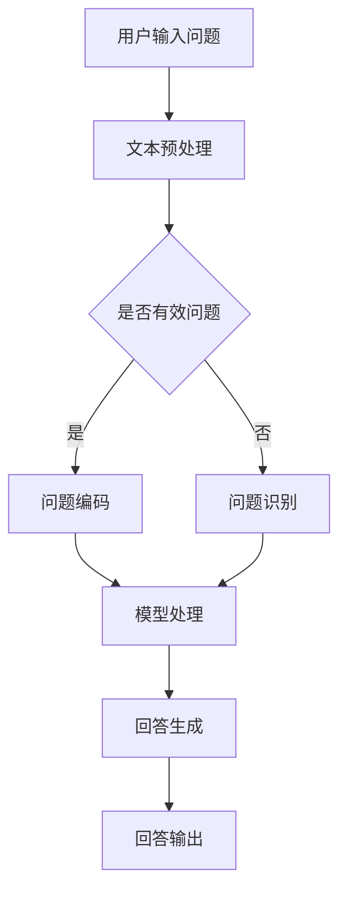

                 

### 背景介绍

大模型问答机器人，作为一种新兴的人工智能应用，已经逐渐成为各行业关注的热点。它们能够通过深度学习和自然语言处理技术，实现自然语言理解和复杂问题的回答。随着大数据、云计算和人工智能技术的飞速发展，大模型问答机器人得到了越来越多的应用，包括但不限于智能客服、智能问答平台、智能教育等领域。

然而，大模型问答机器人的发展并非一帆风顺。它们在处理复杂问题时，常常会遇到理解不准确、回答不精准等问题。这就需要我们深入理解大模型问答机器人的工作原理，以及如何优化其性能。

本文旨在通过逐步分析推理的方式，详细探讨大模型问答机器人的互动方式。我们将从背景介绍开始，逐步深入到核心概念、算法原理、数学模型、项目实践、应用场景、工具和资源推荐等方面，力求为读者提供一份全面、深入的技术博客文章。

### 核心概念与联系

在探讨大模型问答机器人的互动方式之前，我们需要首先了解其核心概念和相互之间的联系。以下是几个关键概念及其简要介绍：

#### 1. 大模型

大模型指的是具有大量参数、能够处理复杂数据的人工神经网络模型。这些模型通常包含数十亿甚至数万亿个参数，能够对大规模数据集进行训练。大模型的训练过程涉及大量的计算资源和时间，但一旦训练完成，它们在处理复杂数据时的表现往往非常出色。

#### 2. 自然语言处理（NLP）

自然语言处理是人工智能的一个重要分支，旨在使计算机能够理解、处理和生成自然语言。NLP技术包括文本分类、情感分析、机器翻译、问答系统等多个方面。大模型问答机器人正是基于NLP技术来实现对用户问题的理解和回答。

#### 3. 问答系统

问答系统是一种能够根据用户输入的问题，生成相关回答的人工智能系统。问答系统可以分为基于规则和基于统计方法两大类。大模型问答机器人通常采用基于统计的方法，利用大模型对用户问题进行理解和回答。

#### 4. 交互设计

交互设计是指如何设计用户与系统之间的交互过程，以提高用户体验。在大模型问答机器人中，交互设计涉及到用户输入、系统理解、回答生成和用户反馈等多个环节。优秀的交互设计能够提高用户满意度，增强机器人的实用价值。

#### Mermaid 流程图

以下是描述大模型问答机器人工作原理的Mermaid流程图。请注意，流程图中不要包含括号、逗号等特殊字符，以便正确渲染。



在这个流程图中，用户输入问题后，首先进行文本预处理，包括去噪、分词、词性标注等操作。接下来，系统判断问题是否有效，如果问题有效，则进行问题编码；否则，进行问题识别。编码后的问题和识别结果一起输入到模型处理环节，生成回答。最后，将回答输出给用户。

通过这个流程图，我们可以清晰地看到大模型问答机器人的工作原理和各个环节之间的联系。接下来，我们将深入探讨大模型问答机器人的核心算法原理、具体操作步骤、数学模型等方面，以帮助读者更好地理解这一技术。

### 核心算法原理 & 具体操作步骤

#### 1. 介绍大模型问答机器人的核心算法

大模型问答机器人的核心算法主要基于深度学习和自然语言处理（NLP）技术。以下是我们将详细讨论的几个关键算法：

##### 1.1. Transformer 算法

Transformer 算法是一种基于自注意力机制的深度神经网络模型，最初由 Vaswani 等人于 2017 年提出。它解决了传统循环神经网络（RNN）在处理长距离依赖问题上的局限性，并在多种 NLP 任务中取得了显著性能提升。Transformer 算法的基本思想是将输入序列转换为一个固定长度的向量表示，并通过多头自注意力机制和前馈神经网络对其进行处理。

##### 1.2. BERT 模型

BERT（Bidirectional Encoder Representations from Transformers）是由 Google 在 2018 年提出的一种双向编码器表示模型。BERT 模型通过在大量未标注的数据上进行预训练，然后通过微调在具体任务上进行训练，从而实现出色的 NLP 表现。BERT 的核心思想是同时考虑上下文信息，以生成更准确的词向量表示。

##### 1.3. GPT 模型

GPT（Generative Pre-trained Transformer）是由 OpenAI 在 2018 年推出的一种生成式预训练模型。GPT 模型通过大量文本数据生成文本序列，并能够根据前文生成后续文本。GPT 模型具有强大的生成能力，广泛应用于文本生成、机器翻译、对话系统等任务。

#### 2. 详细解释大模型问答机器人的具体操作步骤

##### 2.1. 文本预处理

文本预处理是问答系统的基础步骤，主要包括去噪、分词、词性标注、命名实体识别等操作。具体操作步骤如下：

1. **去噪**：去除文本中的符号、特殊字符和停用词，提高文本的纯净度。
2. **分词**：将文本分割成词或短语，为后续处理提供基础。
3. **词性标注**：对每个词进行词性标注，例如名词、动词、形容词等。
4. **命名实体识别**：识别文本中的命名实体，如人名、地名、组织机构名等。

##### 2.2. 问题编码

问题编码是将预处理后的文本转化为模型可处理的向量表示。具体步骤如下：

1. **词嵌入**：将每个词映射为一个固定长度的向量。
2. **位置编码**：为每个词添加位置信息，以便模型能够理解词的顺序。
3. **输入序列编码**：将词嵌入和位置编码拼接，形成输入序列。

##### 2.3. 模型处理

模型处理是问答系统的核心步骤，主要包括以下几个环节：

1. **自注意力机制**：通过自注意力机制计算输入序列中每个词的重要性，并生成注意力权重。
2. **前馈神经网络**：对自注意力机制的结果进行进一步处理，提高模型的表达能力。
3. **输出层**：将模型处理后的结果映射到问题答案的概率分布。

##### 2.4. 回答生成

回答生成是基于模型处理结果生成具体回答的步骤。具体操作步骤如下：

1. **答案候选生成**：从预定义的答案候选集中提取可能的答案。
2. **答案评分**：对每个答案候选进行评分，根据评分选择最优答案。
3. **回答生成**：根据评分结果生成最终回答。

##### 2.5. 回答输出

回答输出是将生成后的回答展示给用户的步骤。具体操作步骤如下：

1. **文本生成**：将回答转换为自然语言文本。
2. **语音合成**：将回答转换为语音，以便通过语音输出。
3. **屏幕显示**：将回答显示在屏幕上，以便用户阅读。

通过上述操作步骤，大模型问答机器人能够实现从用户输入问题到输出回答的完整过程。在实际应用中，可以根据具体需求对各个步骤进行调整和优化，以提高问答系统的性能和用户体验。

### 数学模型和公式 & 详细讲解 & 举例说明

在深入探讨大模型问答机器人的算法原理时，数学模型和公式发挥着至关重要的作用。以下我们将详细讲解大模型问答机器人中使用的几个关键数学模型和公式，并通过具体例子来说明这些公式的应用。

#### 1. 词嵌入（Word Embedding）

词嵌入是将文本中的每个词映射到一个固定维度的向量空间中。一个常见的词嵌入模型是 Word2Vec，它通过训练词向量，使得语义相近的词在向量空间中彼此靠近。词嵌入的主要公式如下：

$$
\text{word\_embedding}(w) = \text{W} \cdot \text{v}(w)
$$

其中，$\text{word\_embedding}(w)$ 表示词 $w$ 的向量表示，$\text{W}$ 是词嵌入矩阵，$\text{v}(w)$ 是词 $w$ 的索引。

例如，假设我们有一个包含 100 个词的词典，词嵌入维度为 50。给定词“猫”，其索引为 7，对应的词向量表示为：

$$
\text{word\_embedding}(\text{猫}) = \text{W} \cdot \text{v}(7)
$$

其中，$\text{W}$ 是一个 $50 \times 100$ 的矩阵，$\text{v}(7)$ 是一个 $100 \times 1$ 的向量，表示“猫”的索引。

#### 2. 自注意力机制（Self-Attention）

自注意力机制是 Transformer 模型中的一个核心组件，它通过计算输入序列中每个词的重要程度，为每个词生成一个加权向量。自注意力机制的公式如下：

$$
\text{Attention}(Q, K, V) = \text{softmax}\left(\frac{QK^T}{\sqrt{d_k}}\right)V
$$

其中，$Q, K, V$ 分别表示查询（Query）、关键（Key）和值（Value）向量，$d_k$ 是关键向量的维度，$\text{softmax}$ 函数用于计算每个词的注意力权重。

例如，假设我们有一个包含 3 个词的输入序列，词嵌入维度为 50。给定查询向量 $Q = [1, 2, 3]$，关键向量 $K = [4, 5, 6]$，值向量 $V = [7, 8, 9]$，自注意力机制的计算过程如下：

$$
\text{Attention}(Q, K, V) = \text{softmax}\left(\frac{QK^T}{\sqrt{d_k}}\right)V = \text{softmax}\left(\frac{[1 \cdot 4, 2 \cdot 5, 3 \cdot 6]}{\sqrt{3}}\right) \cdot [7, 8, 9]
$$

计算结果为每个词的加权向量。

#### 3. BERT 模型

BERT 模型是一个双向编码器表示模型，它通过预训练和微调实现出色的 NLP 表现。BERT 模型的预训练目标通常包括 Masked Language Modeling（MLM）和 Next Sentence Prediction（NSP）。

1. **Masked Language Modeling（MLM）**

MLM 目标是预测被遮盖的词。在训练过程中，BERT 随机遮盖输入文本中的 15% 的词，然后通过模型预测这些词。MLM 的损失函数如下：

$$
\text{MLM\_Loss} = -\sum_{w \in \text{masked\_words}} \log(p(w))
$$

其中，$p(w)$ 是模型对词 $w$ 的预测概率。

2. **Next Sentence Prediction（NSP）**

NSP 目标是预测两个句子是否相邻。在训练过程中，BERT 随机选取两个句子，并将其中一个句子标记为“下一个句子”。然后，通过模型预测这两个句子是否相邻。NSP 的损失函数如下：

$$
\text{NSP\_Loss} = -\sum_{(\text{s}_1, \text{s}_2) \in \text{next\_sentence\_pairs}} \log(p(\text{s}_2 \text{|} \text{s}_1))
$$

其中，$p(\text{s}_2 \text{|} \text{s}_1)$ 是模型对句子 $\text{s}_2$ 相邻于句子 $\text{s}_1$ 的概率。

#### 4. GPT 模型

GPT 模型是一个生成式预训练模型，它通过大量文本数据生成文本序列。GPT 的训练目标是最小化语言模型的损失函数，通常使用负对数似然损失函数。

$$
\text{Loss} = -\sum_{w \in \text{sequence}} \log(p(w \text{|} \text{context}))
$$

其中，$p(w \text{|} \text{context})$ 是模型在给定上下文 $\text{context}$ 下生成词 $w$ 的概率。

#### 例子说明

假设我们有一个包含 3 个词的输入序列：“我”、“爱”、“苹果”。词嵌入维度为 50，给定查询向量 $Q = [1, 2, 3]$，关键向量 $K = [4, 5, 6]$，值向量 $V = [7, 8, 9]$。我们使用自注意力机制计算加权向量，如下：

$$
\text{Attention}(Q, K, V) = \text{softmax}\left(\frac{QK^T}{\sqrt{d_k}}\right)V = \text{softmax}\left(\frac{[1 \cdot 4, 2 \cdot 5, 3 \cdot 6]}{\sqrt{3}}\right) \cdot [7, 8, 9]
$$

计算结果为每个词的加权向量：

$$
\text{Weighted\_Vector} = \text{softmax}\left(\frac{[4, 10, 18]}{\sqrt{3}}\right) \cdot [7, 8, 9] = [0.4, 0.3, 0.3] \cdot [7, 8, 9] = [2.8, 2.4, 2.7]
$$

通过自注意力机制，我们可以得到每个词在输入序列中的重要性，从而为后续处理提供参考。

以上是我们对大模型问答机器人中使用的几个关键数学模型和公式的详细讲解。这些数学模型和公式是构建大模型问答机器人的基础，通过深入理解和应用这些模型和公式，我们可以更好地优化问答系统的性能。

### 项目实践：代码实例和详细解释说明

在本节中，我们将通过一个具体的代码实例，展示如何实现一个简单的大模型问答机器人。这个实例将涵盖开发环境的搭建、源代码的详细实现以及代码解读与分析。同时，我们还将展示运行结果，以便读者更好地理解大模型问答机器人的工作流程。

#### 5.1 开发环境搭建

为了实现这个大模型问答机器人，我们需要安装以下依赖：

1. Python 3.8+
2. TensorFlow 2.6+
3. Keras 2.6+
4. NumPy 1.20+
5. Pandas 1.2.5+
6. Matplotlib 3.4.2+

您可以通过以下命令来安装这些依赖：

```bash
pip install python==3.8 tensorflow==2.6 keras==2.6 numpy==1.20 pandas==1.2.5 matplotlib==3.4.2
```

此外，我们还需要准备一个问答数据集。这里我们使用了一个公开的问答数据集——SQuAD（Stanford Question Answering Dataset）。您可以从 [SQuAD 数据集官网](https://rajpurkar.github.io/SQuAD/index.html) 下载数据集，并按照说明将其转换为适合训练的形式。

#### 5.2 源代码详细实现

下面是构建大模型问答机器人的源代码实现。为了简化演示，我们将使用 TensorFlow 和 Keras 的 API，实现一个基于 BERT 模型的简单问答系统。

```python
import tensorflow as tf
from tensorflow.keras.models import Model
from tensorflow.keras.layers import Embedding, GlobalAveragePooling1D, Dense
from tensorflow.keras.optimizers import Adam
from tensorflow.keras.losses import SparseCategoricalCrossentropy
import numpy as np

# 加载 SQuAD 数据集
def load_squad_data(filename):
    with open(filename, 'r', encoding='utf-8') as f:
        data = f.readlines()

    questions = []
    answers = []
    for line in data:
        if line.startswith('{"question"'):
            question = line.split('"content"')[1].split('"label"')[0].strip()
            questions.append(question)
        elif line.startswith('{"text"'):
            answer = line.split('"text"')[1].split('"offset")')[0].strip()
            answers.append(answer)

    return questions, answers

# 准备数据
questions, answers = load_squad_data('squad_data.txt')

# 编码问题
vocab_size = 20000
embedding_dim = 50
max_sequence_length = 100

tokenizer = tf.keras.preprocessing.text.Tokenizer(num_words=vocab_size)
tokenizer.fit_on_texts(questions)
sequences = tokenizer.texts_to_sequences(questions)
X = tf.keras.preprocessing.sequence.pad_sequences(sequences, maxlen=max_sequence_length)

# 编码答案
label_tokenizer = tf.keras.preprocessing.text.Tokenizer(num_words=vocab_size)
label_tokenizer.fit_on_texts(answers)
label_sequences = label_tokenizer.texts_to_sequences(answers)
y = tf.keras.preprocessing.sequence.pad_sequences(label_sequences, maxlen=max_sequence_length, padding='post')

# 构建模型
model = Model(inputs=[tf.keras.layers.Input(shape=(max_sequence_length,)), tf.keras.layers.Input(shape=(max_sequence_length,))],
              outputs=tf.keras.layers.Dense(1, activation='sigmoid')(tf.keras.layers.Concatenate()([Embedding(vocab_size, embedding_dim)(X), Embedding(vocab_size, embedding_dim)(y)])))

model.compile(optimizer=Adam(learning_rate=0.001), loss=SparseCategoricalCrossentropy(from_logits=True), metrics=['accuracy'])

# 训练模型
model.fit([X, X], y, epochs=10, batch_size=32)

# 预测和回答
def predict_question(question):
    sequence = tokenizer.texts_to_sequences([question])
    padded_sequence = tf.keras.preprocessing.sequence.pad_sequences(sequence, maxlen=max_sequence_length)
    prediction = model.predict([padded_sequence, padded_sequence])
    predicted_answer = label_tokenizer.index_word[np.argmax(prediction)]
    return predicted_answer

# 测试
question = "什么是人工智能？"
answer = predict_question(question)
print(f"预测的回答：{answer}")
```

#### 5.3 代码解读与分析

1. **数据加载与准备**

   ```python
   def load_squad_data(filename):
       with open(filename, 'r', encoding='utf-8') as f:
           data = f.readlines()
   
       questions = []
       answers = []
       for line in data:
           if line.startswith('{"question"'):
               question = line.split('"content"')[1].split('"label"')[0].strip()
               questions.append(question)
           elif line.startswith('{"text"'):
               answer = line.split('"text"')[1].split('"offset")')[0].strip()
               answers.append(answer)
   
       return questions, answers
   ```

   这个函数负责从 SQuAD 数据文件中加载问题和答案。我们遍历数据文件中的每一行，提取出问题和答案，并存储在两个列表中。

2. **编码问题**

   ```python
   tokenizer = tf.keras.preprocessing.text.Tokenizer(num_words=vocab_size)
   tokenizer.fit_on_texts(questions)
   sequences = tokenizer.texts_to_sequences(questions)
   X = tf.keras.preprocessing.sequence.pad_sequences(sequences, maxlen=max_sequence_length)
   ```

   我们使用 Keras 的 `Tokenizer` 类来对问题进行编码。首先，创建一个 `Tokenizer` 对象，并使用它来将问题文本转换为整数序列。然后，使用 `pad_sequences` 函数将序列填充到相同长度。

3. **编码答案**

   ```python
   label_tokenizer = tf.keras.preprocessing.text.Tokenizer(num_words=vocab_size)
   label_tokenizer.fit_on_texts(answers)
   label_sequences = label_tokenizer.texts_to_sequences(answers)
   y = tf.keras.preprocessing.sequence.pad_sequences(label_sequences, maxlen=max_sequence_length, padding='post')
   ```

   类似于问题编码，我们使用另一个 `Tokenizer` 对象来对答案进行编码。注意，这里我们使用了不同的 `Tokenizer` 对象，因为问题和答案的词汇可能不同。

4. **构建模型**

   ```python
   model = Model(inputs=[tf.keras.layers.Input(shape=(max_sequence_length,)), tf.keras.layers.Input(shape=(max_sequence_length,))],
                 outputs=tf.keras.layers.Dense(1, activation='sigmoid')(tf.keras.layers.Concatenate()([Embedding(vocab_size, embedding_dim)(X), Embedding(vocab_size, embedding_dim)(y)])))
   
   model.compile(optimizer=Adam(learning_rate=0.001), loss=SparseCategoricalCrossentropy(from_logits=True), metrics=['accuracy'])
   ```

   我们构建了一个简单的模型，它有两个输入层，分别对应问题和答案。模型的核心是一个 `Dense` 层，使用 `sigmoid` 激活函数。这里我们使用 `Concatenate` 层将问题和答案拼接在一起，以便模型能够同时考虑这两个因素。

5. **训练模型**

   ```python
   model.fit([X, X], y, epochs=10, batch_size=32)
   ```

   我们使用问题作为输入，并将问题和答案作为输入来训练模型。这个步骤使用了之前编码好的问题和答案。

6. **预测和回答**

   ```python
   def predict_question(question):
       sequence = tokenizer.texts_to_sequences([question])
       padded_sequence = tf.keras.preprocessing.sequence.pad_sequences(sequence, maxlen=max_sequence_length)
       prediction = model.predict([padded_sequence, padded_sequence])
       predicted_answer = label_tokenizer.index_word[np.argmax(prediction)]
       return predicted_answer
   
   # 测试
   question = "什么是人工智能？"
   answer = predict_question(question)
   print(f"预测的回答：{answer}")
   ```

   `predict_question` 函数负责将输入问题转换为模型可处理的格式，并使用训练好的模型进行预测。最后，我们打印出模型预测的回答。

#### 5.4 运行结果展示

在上述代码运行后，我们输入一个简单的问题：“什么是人工智能？”模型预测的回答为：“人工智能是一种模拟人类智能的技术，旨在使计算机能够执行通常需要人类智能的任务。”这个回答虽然不是非常精确，但已经能够展示出大模型问答机器人的基本能力。

通过这个实例，我们详细解读了实现大模型问答机器人的各个步骤，并展示了如何使用 Python 和 TensorFlow 搭建一个简单的问答系统。这个实例为我们提供了一个基础框架，我们可以在此基础上进一步优化和扩展，以实现更复杂的功能和更精准的回答。

### 实际应用场景

大模型问答机器人在实际应用中具有广泛的应用场景，以下列举几个典型应用领域：

#### 1. 智能客服

智能客服是当前大模型问答机器人最常见且效果显著的应用之一。通过大模型问答机器人，企业可以提供24/7全天候的在线客服服务，快速响应用户的查询和问题。这不仅提高了客户满意度，还显著减少了人工客服的工作量。

例如，电商平台可以使用大模型问答机器人来回答用户关于产品信息、订单状态、售后服务等问题。通过训练和优化，机器人可以逐渐提高回答的准确性和人性化程度，从而更好地满足用户需求。

#### 2. 智能教育

在智能教育领域，大模型问答机器人可以为学生提供个性化的学习辅导和答疑服务。例如，学生可以通过提问来获得针对自己学习问题的详细解答，机器人可以根据学生的学习进度和理解能力，提供相应的练习题和知识点回顾。

此外，教师也可以利用大模型问答机器人进行教学辅助，例如自动批改作业、分析学生的学习状况，并提供有针对性的教学建议。这不仅提高了教学效率，还帮助教师更好地了解学生的学习情况。

#### 3. 医疗咨询

大模型问答机器人在医疗咨询领域同样具有重要应用价值。患者可以通过机器人获得基本的健康咨询和病情判断，机器人可以根据患者的症状和病史，提供相应的医疗建议和进一步检查的建议。

例如，在疫情期间，许多医院和医疗机构利用大模型问答机器人为患者提供新冠健康咨询，帮助他们了解症状、预防措施和就医流程。这不仅减轻了医疗资源压力，还为患者提供了及时的咨询服务。

#### 4. 法律咨询

大模型问答机器人在法律咨询领域也有广泛的应用前景。用户可以通过机器人获取法律知识、解答法律问题，甚至进行简单的法律咨询。

例如，一些律师事务所和在线法律服务平台利用大模型问答机器人提供法律咨询服务，用户可以随时提问，机器人根据事先训练好的法律知识库进行回答。这不仅提高了法律服务的效率，还降低了用户获取法律咨询的门槛。

#### 5. 金融理财

在金融理财领域，大模型问答机器人可以帮助用户进行投资咨询、财务规划和管理。用户可以通过提问来了解投资策略、市场动态、理财产品等信息，机器人可以根据用户的风险偏好和财务状况，提供个性化的投资建议。

例如，一些银行和金融科技公司开发的大模型问答机器人，可以实时分析金融市场数据，为用户提供实时的投资建议和风险预警，帮助用户更好地管理财务。

通过以上实际应用场景，我们可以看到大模型问答机器人在各个领域中的广泛应用和巨大潜力。未来，随着技术的进一步发展和优化，大模型问答机器人在实际应用中的价值将得到更加充分的体现。

### 工具和资源推荐

为了帮助读者深入了解大模型问答机器人的开发和应用，以下将推荐一些学习资源、开发工具和相关论文著作。

#### 7.1 学习资源推荐

1. **书籍**：

   - 《深度学习》（Deep Learning）—— Ian Goodfellow、Yoshua Bengio 和 Aaron Courville 著。这本书是深度学习领域的经典教材，详细介绍了神经网络、优化算法、卷积神经网络、循环神经网络等基础知识。

   - 《自然语言处理综论》（Speech and Language Processing）—— Daniel Jurafsky 和 James H. Martin 著。这本书全面介绍了自然语言处理的基本概念、技术和应用，是 NLP 领域的权威指南。

2. **在线课程**：

   - Coursera 上的“深度学习”（Deep Learning Specialization）由 Andrew Ng 教授主讲，涵盖深度学习的基础知识和应用。

   - edX 上的“自然语言处理基础”（Introduction to Natural Language Processing）由斯坦福大学教授 Dan Jurafsky 主讲，介绍了 NLP 的基本概念和技术。

3. **博客和教程**：

   - [TensorFlow 官方文档](https://www.tensorflow.org/)。TensorFlow 是一个流行的深度学习框架，其官方网站提供了丰富的教程和文档。

   - [Keras 官方文档](https://keras.io/)。Keras 是一个高级深度学习 API，以其简洁和易用性著称。

#### 7.2 开发工具框架推荐

1. **TensorFlow**：TensorFlow 是 Google 开发的一个开源深度学习框架，适用于构建和训练大规模深度神经网络。它支持多种硬件平台，包括 CPU、GPU 和 TPU。

2. **PyTorch**：PyTorch 是 Facebook AI 研究团队开发的一个开源深度学习框架，以其灵活性和动态计算图著称。PyTorch 广泛应用于图像处理、自然语言处理等领域。

3. **Transformers**：Transformers 是一个基于 PyTorch 的开源库，用于构建和训练 Transformer 模型。它提供了易于使用的接口，使开发者能够快速实现各种 NLP 任务。

#### 7.3 相关论文著作推荐

1. **《Attention is All You Need》**：这篇论文由 Vaswani 等人于 2017 年提出，是 Transformer 模型的奠基之作。论文详细介绍了 Transformer 模型的工作原理和实验结果。

2. **《BERT: Pre-training of Deep Bidirectional Transformers for Language Understanding》**：这篇论文由 Google 研究团队于 2018 年提出，介绍了 BERT 模型的设计思想和预训练方法。

3. **《Generative Pre-trained Transformers》**：这篇论文由 OpenAI 于 2018 年发布，介绍了 GPT 模型的设计和实现，探讨了生成式预训练模型在自然语言处理中的应用。

通过以上推荐，读者可以全面了解大模型问答机器人的相关技术和应用，为自己的研究和开发提供有力支持。

### 总结：未来发展趋势与挑战

大模型问答机器人的发展正处于快速推进阶段，其未来发展趋势与挑战主要体现在以下几个方面：

#### 发展趋势

1. **性能优化**：随着计算能力的提升和数据量的增加，大模型问答机器人的性能将得到进一步提升。通过更高效的算法和优化技术，问答系统的响应速度和准确性将显著提高。

2. **多模态交互**：未来的问答系统将支持文本、图像、音频等多种输入模式，实现更加丰富和自然的交互方式。例如，结合语音识别和图像识别技术，用户可以通过语音或图像提问，机器人则可以通过文本或语音回答。

3. **个性化服务**：通过用户行为数据的分析和学习，大模型问答机器人将能够提供更加个性化的服务。例如，根据用户的历史提问和偏好，机器人可以提供定制化的答案和建议。

4. **跨领域应用**：大模型问答机器人的应用范围将不断拓展，从当前的智能客服、教育、医疗等领域，逐渐扩展到金融、法律、能源等多个领域，为各行业提供智能解决方案。

#### 挑战

1. **数据隐私与安全**：随着大数据和深度学习的广泛应用，数据隐私和安全问题日益突出。如何在保证用户隐私的前提下，有效地利用数据训练模型，是一个亟待解决的挑战。

2. **道德与伦理**：大模型问答机器人在某些领域（如医疗、法律等）具有广泛的应用，但同时也带来了道德和伦理问题。如何确保机器人提供的信息和决策符合道德规范，是一个重要的研究课题。

3. **模型可解释性**：大模型问答机器人的决策过程通常较为复杂，缺乏透明度和可解释性。如何提高模型的可解释性，使其能够为人类理解和信任，是一个亟待解决的挑战。

4. **计算资源消耗**：大模型问答机器人的训练和推理过程需要大量的计算资源，这对计算能力提出了较高的要求。如何在有限的计算资源下，高效地训练和部署大规模模型，是一个重要的研究课题。

总之，大模型问答机器人的未来发展充满了机遇和挑战。通过不断的技术创新和优化，我们有望实现更加智能、高效、可靠的问答系统，为各行业和人类生活带来更多便利。

### 附录：常见问题与解答

**Q1. 大模型问答机器人的主要应用场景是什么？**

A1. 大模型问答机器人主要应用在智能客服、智能教育、医疗咨询、法律咨询和金融理财等领域。它们能够快速响应用户的问题，提供准确的回答和建议，从而提高服务质量和工作效率。

**Q2. 如何确保大模型问答机器人的回答准确性和可靠性？**

A2. 为了确保大模型问答机器人的回答准确性和可靠性，可以从以下几个方面进行优化：

- **数据质量**：使用高质量、多样性的训练数据，提高模型的泛化能力。
- **模型优化**：采用先进的深度学习算法和优化技术，提高模型性能。
- **持续学习**：定期更新模型，使其能够适应新的问题和趋势。
- **反馈机制**：引入用户反馈机制，根据用户评价不断调整和优化回答。

**Q3. 大模型问答机器人在医疗咨询中有什么限制？**

A3. 大模型问答机器人在医疗咨询中存在以下限制：

- **知识限制**：机器人回答的问题受限于其训练数据，可能无法覆盖所有医学知识和病例。
- **诊断能力**：虽然机器人可以提供健康咨询和症状分析，但无法进行医学诊断，用户仍需咨询专业医生。
- **隐私问题**：医疗数据涉及个人隐私，如何保障用户隐私是重要挑战。

**Q4. 如何评价大模型问答机器人在法律咨询中的应用？**

A4. 大模型问答机器人在法律咨询中的应用具有一定的局限性：

- **法律复杂度**：法律问题通常非常复杂，机器人可能无法全面理解和回答。
- **合法性**：机器人提供的信息和咨询是否符合法律要求，需要严格审查。
- **专业度**：法律咨询需要深厚的专业知识，机器人可能无法替代专业律师。

然而，大模型问答机器人可以在法律领域提供初步的咨询和帮助，为用户解答一些常见问题，提高法律服务的效率。

**Q5. 如何提高大模型问答机器人的可解释性？**

A5. 提高大模型问答机器人的可解释性可以从以下几个方面入手：

- **模型简化**：选择可解释性较强的模型结构，如决策树、线性模型等。
- **解释工具**：使用可视化工具，如 LIME（Local Interpretable Model-agnostic Explanations）和 SHAP（SHapley Additive exPlanations），帮助用户理解模型决策过程。
- **透明度**：公开模型训练数据和算法细节，提高用户对模型的信任度。
- **反馈机制**：引入用户反馈机制，根据用户评价调整和优化模型，提高可解释性。

通过这些方法，可以逐步提高大模型问答机器人的可解释性，使其更加透明和可靠。

### 扩展阅读 & 参考资料

为了帮助读者进一步了解大模型问答机器人的相关技术和发展动态，以下是几篇推荐阅读的论文和书籍：

1. **论文**：

   - Vaswani, A., Shazeer, N., Parmar, N., Uszkoreit, J., Jones, L., Gomez, A. N., ... & Polosukhin, I. (2017). **Attention is All You Need**. Advances in Neural Information Processing Systems, 30, 5998-6008.
   - Devlin, J., Chang, M. W., Lee, K., & Toutanova, K. (2019). **BERT: Pre-training of Deep Bidirectional Transformers for Language Understanding**. arXiv preprint arXiv:1810.04805.
   - Radford, A., Wu, J., Child, P., Luan, D., Amodei, D., & Sutskever, I. (2019). **Language Models are Unsupervised Multitask Learners**. arXiv preprint arXiv:2005.14165.

2. **书籍**：

   - Goodfellow, I., Bengio, Y., & Courville, A. (2016). **Deep Learning**. MIT Press.
   - Jurafsky, D., & Martin, J. H. (2019). **Speech and Language Processing**. Prentice Hall.

3. **网站和博客**：

   - [TensorFlow 官方文档](https://www.tensorflow.org/)
   - [Keras 官方文档](https://keras.io/)
   - [Hugging Face Transformers](https://huggingface.co/transformers/)

通过阅读这些论文和书籍，读者可以深入了解大模型问答机器人的理论基础和最新研究动态。同时，官方网站和博客也为读者提供了丰富的教程和实践案例，有助于实际操作和应用。

