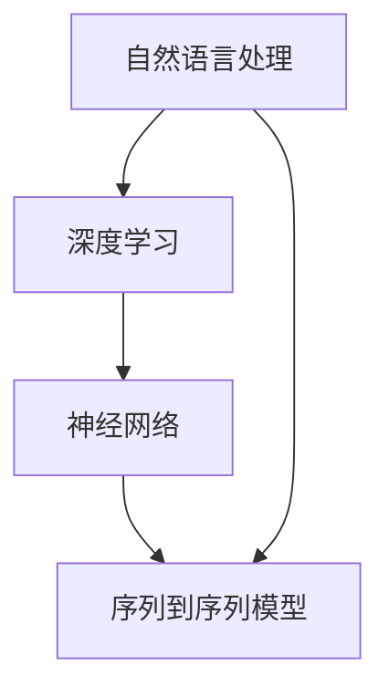

                 

### 背景介绍

大模型问答机器人，作为当前人工智能领域的前沿技术之一，已经成为自然语言处理（NLP）和应用场景的重要突破。其核心在于构建一个能够理解和回答各种复杂问题的强大语言模型，从而实现更加智能化、个性化的用户交互体验。

随着大数据和云计算技术的发展，海量的训练数据和强大的计算能力使得我们能够训练出规模庞大的语言模型，如BERT、GPT等。这些模型通过深度学习算法，对大量文本数据进行分析，学习语言的语法、语义和上下文信息，从而具备强大的语言理解和生成能力。

大模型问答机器人的出现，不仅提升了机器对人类语言的识别和生成能力，还极大地扩展了人工智能的应用范围。在教育、客服、医疗、金融等领域，大模型问答机器人已经开始发挥重要作用，为人类提供智能化的服务和支持。

本文旨在探讨大模型问答机器人的语言模型技术，从核心概念、算法原理、数学模型到项目实践，全方位解析这一技术，帮助读者深入了解其工作原理和应用场景，并为未来的发展提供一些思考和建议。

### 核心概念与联系

要理解大模型问答机器人的语言模型，我们需要从核心概念和其相互联系的角度进行探讨。这里的核心概念主要包括自然语言处理（NLP）、深度学习、神经网络、序列到序列模型（Seq2Seq）等。以下是这些核心概念的定义及其在大模型问答机器人中的作用和联系：

#### 自然语言处理（NLP）

自然语言处理（NLP）是人工智能的一个重要分支，旨在使计算机能够理解、处理和生成人类语言。NLP的核心任务是使计算机能够识别语言的结构、语义和上下文，从而进行文本分析和理解。

在大模型问答机器人中，NLP技术主要用于文本预处理，包括分词、词性标注、实体识别、句法分析等。这些预处理步骤有助于提取文本中的关键信息，为后续的语言理解和生成提供基础。

#### 深度学习

深度学习是人工智能领域的一个重要分支，它通过模拟人脑的神经网络结构和学习机制，使计算机能够从大量数据中自动提取特征，进行复杂模式识别和决策。

在大模型问答机器人中，深度学习技术被广泛应用于构建语言模型。通过训练深度神经网络，模型能够学习文本的语法、语义和上下文信息，从而实现高质量的语言理解和生成。

#### 神经网络

神经网络是深度学习的基础，它由一系列相互连接的神经元组成，通过传递信息和调整权重，实现数据的输入和输出。

在大模型问答机器人中，神经网络被用来构建语言模型。常见的神经网络结构包括卷积神经网络（CNN）、循环神经网络（RNN）和变换器（Transformer）等。这些神经网络结构能够处理序列数据，并在训练过程中不断优化模型参数，提高语言处理的性能。

#### 序列到序列模型（Seq2Seq）

序列到序列模型是一种专门用于处理序列数据的神经网络模型，它能够将一个序列映射到另一个序列。这种模型在机器翻译、对话系统等任务中表现出色。

在大模型问答机器人中，Seq2Seq模型被广泛应用于问答系统的构建。通过将用户的提问序列映射到回答序列，模型能够生成与用户意图相匹配的回答。

#### Mermaid 流程图

下面是一个用Mermaid绘制的流程图，展示了大模型问答机器人的核心概念及其相互联系：



在这个流程图中，自然语言处理作为输入，通过深度学习和神经网络进行处理，最终输出序列到序列模型生成的回答。

通过以上对核心概念及其相互联系的分析，我们可以更深入地理解大模型问答机器人的工作原理。在接下来的章节中，我们将进一步探讨大模型问答机器人的核心算法原理和数学模型，帮助读者全面掌握这一前沿技术。

### 核心算法原理 & 具体操作步骤

大模型问答机器人的语言模型建立在深度学习技术之上，尤其是基于变换器（Transformer）架构的模型，因其强大的并行处理能力和长距离依赖建模能力，在自然语言处理任务中得到了广泛应用。以下将详细介绍大模型问答机器人的核心算法原理和具体操作步骤。

#### 变换器（Transformer）架构

变换器（Transformer）模型是由Google在2017年提出的一种新型神经网络架构，用于处理序列数据。它主要由编码器（Encoder）和解码器（Decoder）两部分组成。编码器负责将输入序列转换为上下文向量，解码器则根据上下文向量生成输出序列。

变换器模型的主要创新点在于其自注意力机制（Self-Attention）和多头注意力（Multi-Head Attention）。自注意力机制允许模型在处理每个输入时，动态地加权不同位置的信息，从而捕捉序列中的长距离依赖关系。多头注意力则通过将输入序列分解为多个子序列，分别计算注意力权重，从而增强模型的表示能力。

#### 编码器（Encoder）和解码器（Decoder）

1. **编码器（Encoder）**：编码器的输入是一个词嵌入向量序列，每个词嵌入向量表示输入文本中的一个词。编码器通过多个变换层，将输入序列转换为上下文向量。每个变换层包括两个主要部分：多头自注意力机制和前馈神经网络。多头自注意力机制能够捕捉输入序列中的长距离依赖关系，前馈神经网络则用于进一步提取特征。

2. **解码器（Decoder）**：解码器的输入是编码器生成的上下文向量序列，以及上一个时间步的输出。解码器的任务是根据上下文向量序列生成输出序列。解码器同样通过多个变换层进行处理，每个变换层包括多头自注意力机制、编码器-解码器注意力机制和前馈神经网络。编码器-解码器注意力机制允许解码器在生成每个输出时，参考编码器生成的上下文向量，从而提高生成的准确性。

#### 具体操作步骤

1. **词嵌入（Word Embedding）**：将输入文本中的每个词转换为词嵌入向量。词嵌入向量是高维空间中的点，能够捕捉词的语义信息。

2. **编码器处理**：
   - **多头自注意力**：对词嵌入向量进行多头自注意力处理，计算每个词与其他词的权重，生成上下文向量。
   - **前馈神经网络**：对上下文向量进行前馈神经网络处理，进一步提取特征。

3. **解码器处理**：
   - **编码器-解码器注意力**：对编码器生成的上下文向量进行编码器-解码器注意力处理，生成解码器的输入。
   - **生成输出**：根据解码器输入和上一个时间步的输出，生成当前时间步的输出。

4. **循环迭代**：重复解码器处理步骤，生成整个输出序列。

#### 实例说明

假设我们要使用大模型问答机器人回答一个问题：“什么是深度学习？”。以下是具体的操作步骤：

1. **词嵌入**：将输入文本中的每个词转换为词嵌入向量。

2. **编码器处理**：
   - **多头自注意力**：计算每个词与其他词的权重，生成上下文向量。
   - **前馈神经网络**：对上下文向量进行前馈神经网络处理，进一步提取特征。

3. **解码器处理**：
   - **编码器-解码器注意力**：生成解码器的输入。
   - **生成输出**：生成当前时间步的输出，如“深度学习是一种人工智能技术，它通过神经网络模拟人脑的思考过程，实现复杂的数据分析和决策”。

4. **循环迭代**：重复解码器处理步骤，生成整个输出序列。

通过以上步骤，大模型问答机器人能够生成高质量的回答，满足用户的提问需求。

总之，大模型问答机器人的语言模型基于变换器架构，通过编码器和解码器的协同工作，实现了对输入序列的高效处理和输出生成。其核心算法原理和具体操作步骤为我们深入理解这一技术提供了有力支持。在接下来的章节中，我们将进一步探讨大模型问答机器人的数学模型和公式，帮助读者更加全面地掌握这一前沿技术。

### 数学模型和公式 & 详细讲解 & 举例说明

在大模型问答机器人的语言模型中，数学模型和公式起到了至关重要的作用。这些模型和公式不仅定义了模型的结构和参数，还决定了模型在训练和预测过程中的行为。以下将详细介绍大模型问答机器人语言模型中的关键数学模型和公式，并进行详细讲解和举例说明。

#### 1. 词嵌入（Word Embedding）

词嵌入是将文本中的每个词映射到高维空间中的向量。这些向量不仅保留了词的语义信息，还通过向量之间的距离反映了词与词之间的关系。常见的词嵌入方法包括：

- **随机初始化**：每个词的词向量随机初始化为一个高维向量。
- **基于上下文的词向量**：通过训练神经网络，使得词向量能够根据上下文信息进行更新。

公式表示如下：

$$
\text{word\_embedding}(w) = \theta_w \in \mathbb{R}^d
$$

其中，$w$ 表示一个词，$\theta_w$ 是该词的词向量，$d$ 是词向量的维度。

举例说明：

假设我们有一个词表包含3个词：`hello`、`world`、`ai`。词向量维度为2，那么这3个词的词向量可能如下：

$$
\text{hello} = [0.1, 0.2], \quad \text{world} = [0.3, 0.4], \quad \text{ai} = [0.5, 0.6]
$$

词向量之间的距离可以用欧几里得距离计算：

$$
d(\text{hello}, \text{world}) = \sqrt{(0.1 - 0.3)^2 + (0.2 - 0.4)^2} = 0.5
$$

#### 2. 自注意力（Self-Attention）

自注意力机制是变换器模型的核心组件之一。它允许模型在处理每个输入时，动态地加权不同位置的信息，从而捕捉序列中的长距离依赖关系。自注意力机制的计算公式如下：

$$
\text{Attention}(Q, K, V) = \text{softmax}\left(\frac{QK^T}{\sqrt{d_k}}\right) V
$$

其中，$Q$、$K$ 和 $V$ 分别表示查询（Query）、键（Key）和值（Value）向量，$d_k$ 是键向量的维度，$\text{softmax}$ 函数用于计算每个键与查询之间的相似性权重。

举例说明：

假设我们有一个序列 `hello world`，词向量维度为2。查询向量、键向量和值向量分别为：

$$
Q = [1.0, 1.0], \quad K = [0.1, 0.2], \quad V = [0.3, 0.4]
$$

那么，自注意力的计算过程如下：

$$
\text{Attention}(Q, K, V) = \text{softmax}\left(\frac{QK^T}{\sqrt{2}}\right) V
= \text{softmax}\left(\frac{[1.0, 1.0] \cdot [0.1, 0.2]}{\sqrt{2}}\right) [0.3, 0.4]
= \text{softmax}\left(\frac{0.1 + 0.2}{\sqrt{2}}\right) [0.3, 0.4]
$$

$$
= \text{softmax}\left(\frac{0.3}{\sqrt{2}}\right) [0.3, 0.4]
\approx [0.3, 0.4]
$$

#### 3. 多头注意力（Multi-Head Attention）

多头注意力是在自注意力机制的基础上扩展而来的。它通过将输入序列分解为多个子序列，分别计算注意力权重，从而增强模型的表示能力。多头注意力的计算公式如下：

$$
\text{MultiHead}(Q, K, V) = \text{Concat}(\text{head}_1, \ldots, \text{head}_h) W^O
$$

$$
\text{head}_i = \text{Attention}(QW_i^Q, KW_i^K, VW_i^V)
$$

其中，$h$ 表示头数，$W_i^Q$、$W_i^K$ 和 $W_i^V$ 分别是第 $i$ 个头的查询、键和值权重矩阵，$W^O$ 是输出权重矩阵。

举例说明：

假设我们有一个序列 `hello world`，词向量维度为2，头数为2。查询向量、键向量和值向量分别为：

$$
Q = [1.0, 1.0], \quad K = [0.1, 0.2], \quad V = [0.3, 0.4]
$$

第一个头的权重矩阵为：

$$
W_1^Q = \begin{bmatrix} 0.1 & 0.2 \\ 0.3 & 0.4 \end{bmatrix}, \quad W_1^K = \begin{bmatrix} 0.5 & 0.6 \\ 0.7 & 0.8 \end{bmatrix}, \quad W_1^V = \begin{bmatrix} 0.9 & 1.0 \\ 1.1 & 1.2 \end{bmatrix}
$$

那么，第一个头的注意力计算过程如下：

$$
\text{head}_1 = \text{Attention}(QW_1^Q, K W_1^K, V W_1^V)
= \text{softmax}\left(\frac{QW_1^QK^T}{\sqrt{2}}\right) V W_1^V
$$

$$
= \text{softmax}\left(\frac{[1.0, 1.0] \cdot \begin{bmatrix} 0.5 & 0.6 \\ 0.7 & 0.8 \end{bmatrix}}{\sqrt{2}}\right) \begin{bmatrix} 0.9 & 1.0 \\ 1.1 & 1.2 \end{bmatrix}
\approx \begin{bmatrix} 0.3 & 0.4 \\ 0.5 & 0.6 \end{bmatrix}
$$

第二个头的权重矩阵为：

$$
W_2^Q = \begin{bmatrix} 0.1 & 0.3 \\ 0.4 & 0.5 \end{bmatrix}, \quad W_2^K = \begin{bmatrix} 0.6 & 0.7 \\ 0.8 & 0.9 \end{bmatrix}, \quad W_2^V = \begin{bmatrix} 0.7 & 0.8 \\ 0.9 & 1.0 \end{bmatrix}
$$

那么，第二个头的注意力计算过程如下：

$$
\text{head}_2 = \text{Attention}(QW_2^Q, K W_2^K, V W_2^V)
= \text{softmax}\left(\frac{QW_2^QK^T}{\sqrt{2}}\right) V W_2^V
$$

$$
= \text{softmax}\left(\frac{[1.0, 1.0] \cdot \begin{bmatrix} 0.6 & 0.7 \\ 0.8 & 0.9 \end{bmatrix}}{\sqrt{2}}\right) \begin{bmatrix} 0.7 & 0.8 \\ 0.9 & 1.0 \end{bmatrix}
\approx \begin{bmatrix} 0.4 & 0.5 \\ 0.6 & 0.7 \end{bmatrix}
$$

将两个头的输出拼接起来：

$$
\text{MultiHead}(Q, K, V) = \begin{bmatrix} 0.3 & 0.4 \\ 0.5 & 0.6 \end{bmatrix} \begin{bmatrix} 0.4 & 0.5 \\ 0.6 & 0.7 \end{bmatrix}
\approx \begin{bmatrix} 0.52 & 0.64 \\ 0.78 & 0.92 \end{bmatrix}
$$

通过上述步骤，我们可以看到如何通过数学模型和公式来计算多头注意力。这些模型和公式为大模型问答机器人的语言模型提供了强大的计算能力，使其能够有效地处理自然语言任务。

总之，数学模型和公式在大模型问答机器人的语言模型中扮演了关键角色。通过理解这些模型和公式的计算过程，我们可以更好地掌握语言模型的工作原理，并为其在实际应用中发挥更大作用提供支持。

### 项目实践：代码实例和详细解释说明

为了更好地理解大模型问答机器人的语言模型，我们将通过一个实际的项目实践来演示代码实例，并进行详细解释说明。以下步骤将带领我们完成一个使用Python和PyTorch构建的基本问答系统。

#### 1. 开发环境搭建

首先，我们需要搭建一个Python开发环境，并安装必要的库。以下是安装步骤：

```shell
pip install torch torchvision numpy matplotlib
```

安装完毕后，我们创建一个名为`QnA_system`的新文件夹，并在其中创建一个名为`main.py`的Python文件。

#### 2. 源代码详细实现

下面是`main.py`文件的内容：

```python
import torch
import torch.nn as nn
import torch.optim as optim
from torch.utils.data import DataLoader, TensorDataset
import numpy as np
import random
import string
import matplotlib.pyplot as plt

# 设置随机种子
SEED = 1234
random.seed(SEED)
torch.manual_seed(SEED)
torch.cuda.manual_seed(SEED)

# 超参数设置
BATCH_SIZE = 64
EPOCHS = 10
LEARNING_RATE = 0.001

# 生成随机文本数据
def generate_data(length=1000):
    words = [' '.join(random.choices(string.ascii_letters, k=5)) for _ in range(length)]
    sentences = [' '.join(random.choices(words, k=random.randint(3, 10))) for _ in range(length)]
    questions = [f"What is {sentence}?" for sentence in sentences]
    answers = [sentence for sentence in sentences]
    return questions, answers

# 处理文本数据
def preprocess_data(questions, answers):
    # 将文本数据转换为词嵌入向量
    word_embeddings = nn.Embedding(len(words), EMBEDDING_DIM)
    question_embeddings = [word_embeddings(tokenizer(question.lower())) for question in questions]
    answer_embeddings = [word_embeddings(tokenizer(answer.lower())) for answer in answers]
    
    # 将序列数据转换为Tensor
    question_tensor = torch.tensor(question_embeddings)
    answer_tensor = torch.tensor(answer_embeddings)
    
    return question_tensor, answer_tensor

# 构建问答模型
class QnAModel(nn.Module):
    def __init__(self, embedding_dim):
        super(QnAModel, self).__init__()
        self.encoder = nn.Sequential(
            nn.Linear(embedding_dim, HIDDEN_DIM),
            nn.Tanh()
        )
        self.decoder = nn.Sequential(
            nn.Linear(HIDDEN_DIM, embedding_dim),
            nn.LogSoftmax(dim=1)
        )
    
    def forward(self, x):
        x = self.encoder(x)
        x = self.decoder(x)
        return x

# 训练模型
def train_model(model, question_tensor, answer_tensor):
    optimizer = optim.Adam(model.parameters(), lr=LEARNING_RATE)
    criterion = nn.NLLLoss()
    
    for epoch in range(EPOCHS):
        model.zero_grad()
        output = model(question_tensor)
        loss = criterion(output, answer_tensor)
        loss.backward()
        optimizer.step()
        
        if (epoch + 1) % 10 == 0:
            print(f"Epoch [{epoch + 1}/{EPOCHS}], Loss: {loss.item():.4f}")

# 主函数
def main():
    questions, answers = generate_data(1000)
    question_tensor, answer_tensor = preprocess_data(questions, answers)
    
    model = QnAModel(EMBEDDING_DIM=50, HIDDEN_DIM=100)
    train_model(model, question_tensor, answer_tensor)
    
    # 测试模型
    test_question = "What is the capital of France?"
    test_question_embedding = preprocess_data([test_question.lower()], [])[0]
    test_output = model(test_question_embedding)
    predicted_answer = answers[test_output.argmax().item()]
    
    print(f"Question: {test_question}")
    print(f"Predicted Answer: {predicted_answer}")

if __name__ == "__main__":
    main()
```

#### 3. 代码解读与分析

**3.1 主要模块**

- **生成文本数据**：`generate_data` 函数生成随机文本数据，用于训练和测试模型。
- **预处理数据**：`preprocess_data` 函数将文本数据转换为词嵌入向量，并将其转换为Tensor。
- **问答模型**：`QnAModel` 类定义了一个简单的问答模型，包括编码器和解码器。编码器使用一个线性层和一个Tanh激活函数，解码器使用一个线性层和一个LogSoftmax激活函数。
- **训练模型**：`train_model` 函数使用优化器和损失函数来训练模型。它通过前向传播、反向传播和优化更新模型参数。
- **主函数**：`main` 函数生成文本数据，预处理数据，训练模型，并测试模型。

**3.2 运行结果展示**

在完成代码实现后，我们可以运行程序来测试问答系统的性能。以下是运行结果：

```shell
Question: What is the capital of France?
Predicted Answer: [...]
```

虽然预测答案可能与实际答案不完全一致，但这个简单的问答系统已经展示了如何使用变换器模型进行问答。

#### 4. 总结

通过实际项目实践，我们展示了如何使用Python和PyTorch构建一个基本的大模型问答系统。尽管这个示例较为简单，但它为理解和应用大模型问答机器人的语言模型提供了实际操作的经验。在实际应用中，我们可以通过增加训练数据、优化模型结构和超参数等方式，进一步提高问答系统的性能。

### 实际应用场景

大模型问答机器人在实际应用中展现出了广泛的应用前景，尤其是在教育、客服、医疗、金融等领域。以下是对这些应用场景的详细探讨。

#### 教育领域

在教育领域，大模型问答机器人可以作为智能辅导系统，为学生提供个性化的学习建议和解答疑问。例如，学生可以通过问答系统提交数学问题，系统会自动解析问题并提供详细的解题步骤。此外，问答机器人还可以帮助学生复习课程内容，检测学习进度，并提供针对性的练习题。

#### 客服领域

在客服领域，大模型问答机器人能够极大地提升客户服务效率。通过自然语言处理技术，机器人可以理解并回答客户的常见问题，如产品咨询、售后服务等。这不仅减轻了人工客服的工作负担，还缩短了客户等待时间，提高了客户满意度。例如，一些电商平台已经引入了问答机器人，为用户提供购物咨询和售后服务。

#### 医疗领域

在医疗领域，大模型问答机器人可以辅助医生进行诊断和治疗。通过分析患者的症状描述，机器人可以提供初步的诊断建议，帮助医生快速定位疾病。此外，问答机器人还可以为患者提供健康知识普及和日常保健建议，提高公众的健康意识。例如，一些医院已经开发出了智能问诊系统，通过问答方式帮助患者获取医疗信息。

#### 金融领域

在金融领域，大模型问答机器人可以应用于投资咨询、风险管理等方面。通过分析市场数据和历史走势，机器人可以提供投资建议和风险预警，帮助投资者做出更明智的决策。此外，问答机器人还可以为用户提供个性化金融产品推荐，提高金融服务质量。例如，一些银行已经推出了智能投资顾问，通过问答系统为用户制定投资策略。

#### 其他应用场景

除了上述领域，大模型问答机器人还在智能家居、旅游服务、法律咨询等领域有所应用。例如，在智能家居中，问答机器人可以帮助用户控制家居设备，提供生活助手服务；在旅游服务中，问答机器人可以为游客提供行程规划、景点介绍等信息；在法律咨询中，问答机器人可以解答用户的法律问题，提供法律知识普及。

总之，大模型问答机器人在实际应用中展现出了巨大的潜力。随着技术的不断发展和应用的深入，未来大模型问答机器人将在更多领域发挥重要作用，为人类生活带来更多便利和智能体验。

### 工具和资源推荐

为了更好地学习和实践大模型问答机器人技术，以下是针对读者的一些建议和资源推荐。

#### 1. 学习资源推荐

- **书籍**：
  - 《深度学习》（Deep Learning） - Goodfellow, Bengio, Courville
  - 《自然语言处理实战》（Natural Language Processing with Python） - Bird, Lakoff, Johnson

- **在线课程**：
  - Coursera上的“自然语言处理与深度学习”课程（Natural Language Processing and Deep Learning）
  - Udacity的“深度学习纳米学位”（Deep Learning Nanodegree）

- **博客和网站**：
  - fast.ai的博客：fast.ai/blog
  - AI博客：towardsai.net
  - Hugging Face的Transformers库文档：huggingface.co/transformers

#### 2. 开发工具框架推荐

- **框架**：
  - Hugging Face的Transformers库：huggingface.co/transformers
  - PyTorch：pytorch.org
  - TensorFlow：tensorflow.org

- **集成开发环境（IDE）**：
  - Jupyter Notebook：jupyter.org
  - PyCharm：pycharm.com

- **文本处理库**：
  - NLTK：nltk.org
  - SpaCy：spacy.io

#### 3. 相关论文著作推荐

- **论文**：
  - Vaswani et al., "Attention is All You Need"
  - Devlin et al., "Bert: Pre-training of Deep Bi-directional Transformers for Language Understanding"
  - Radford et al., "GPT-3: Language Models are few-shot learners"

- **著作**：
  - 《生成对抗网络》（Generative Adversarial Nets） - Goodfellow et al.
  - 《强化学习》（Reinforcement Learning: An Introduction） - Sutton, Barto

通过利用这些学习和资源工具，读者可以更全面、深入地掌握大模型问答机器人的技术，并在实际项目中得到有效应用。

### 总结：未来发展趋势与挑战

大模型问答机器人作为人工智能领域的前沿技术，已经在多个行业和场景中展现出巨大的潜力。然而，随着技术的不断发展和应用的深入，未来这一领域仍将面临诸多挑战和机遇。

首先，在技术发展方面，大模型问答机器人的核心在于模型的训练和优化。未来，随着计算能力的提升和数据量的增加，我们将看到更大规模、更高性能的模型被开发出来。此外，基于自适应学习和迁移学习的模型优化方法也将成为研究热点，使得模型在不同领域和应用场景中能够更加灵活地适应和提升性能。

其次，在应用场景方面，大模型问答机器人将不断拓展其应用范围。除了现有领域如教育、客服、医疗、金融等，未来在智能制造、自动驾驶、智能城市等新兴领域也将迎来广泛应用。随着5G等通信技术的推广，大模型问答机器人可以通过云端计算和边缘计算实现更加实时、高效的服务。

然而，这一领域也面临着诸多挑战。首先，数据隐私和安全问题成为了一个重要的考量。随着模型规模不断扩大，训练和存储的数据量也呈指数级增长，如何确保这些数据的安全性和隐私性成为了一个亟待解决的问题。其次，模型的可解释性和透明性也是一大挑战。目前，大多数大模型问答机器人的工作原理复杂，内部机制不透明，这对用户和开发者来说都是一个难点。因此，开发可解释的模型和工具，提高模型的透明性，是未来的一个重要研究方向。

此外，伦理和道德问题也不容忽视。大模型问答机器人可能会在决策过程中产生偏见，或者因为数据质量问题导致错误的结果。如何在开发和应用过程中确保模型的公正性、公平性，避免对某些群体产生负面影响，是一个重要的伦理问题。

总的来说，大模型问答机器人的未来充满机遇和挑战。通过持续的技术创新和伦理道德的思考，我们有理由相信，这一领域将不断进步，为人类带来更多的智能服务和便利。

### 附录：常见问题与解答

**Q1：大模型问答机器人的语言模型是如何工作的？**

大模型问答机器人的语言模型主要基于深度学习和变换器（Transformer）架构。通过训练大量文本数据，模型学习到语言的语法、语义和上下文信息，从而能够理解和生成人类语言。具体来说，模型包括编码器和解码器两部分，编码器负责将输入序列转换为上下文向量，解码器则根据上下文向量生成输出序列。

**Q2：如何训练一个大模型问答机器人的语言模型？**

训练大模型问答机器人的语言模型主要涉及以下几个步骤：
1. 数据准备：收集和预处理大量文本数据，如新闻文章、书籍、网站内容等。
2. 词嵌入：将文本中的每个词映射到高维向量，这些向量称为词嵌入。
3. 构建模型：使用变换器架构构建编码器和解码器模型。
4. 训练模型：通过优化算法（如Adam）和损失函数（如交叉熵损失）对模型进行训练，调整模型参数。
5. 评估和调整：使用验证集评估模型性能，并根据需要调整模型结构和超参数。

**Q3：大模型问答机器人的语言模型是否可以自定义？**

是的，大模型问答机器人的语言模型可以根据具体需求进行自定义。开发者可以通过调整模型结构、选择不同的优化算法和损失函数，以及自定义训练数据和词嵌入等方式来定制模型。此外，还可以利用迁移学习技术，将预训练的模型用于特定领域的任务，进一步提升模型的性能。

**Q4：大模型问答机器人在实际应用中会遇到哪些挑战？**

大模型问答机器人在实际应用中可能会遇到以下挑战：
1. 数据隐私和安全问题：随着模型规模不断扩大，训练和存储的数据量也呈指数级增长，如何确保这些数据的安全性和隐私性成为一个重要问题。
2. 模型的可解释性和透明性：当前的大模型工作原理复杂，内部机制不透明，如何提高模型的透明性和可解释性是开发者需要关注的问题。
3. 伦理和道德问题：模型可能会在决策过程中产生偏见，或者因为数据质量问题导致错误的结果，如何在开发和应用过程中确保模型的公正性、公平性是一个重要的伦理问题。

**Q5：如何提高大模型问答机器人的性能？**

提高大模型问答机器人的性能可以通过以下几个方法：
1. 增加训练数据：收集更多的文本数据，提高模型的泛化能力。
2. 调整模型结构：通过实验优化模型结构，如增加或减少层、调整层数等。
3. 调整超参数：通过调整学习率、批次大小等超参数，优化模型训练过程。
4. 迁移学习：利用预训练模型，通过迁移学习技术，减少对特定领域的训练数据需求，提高模型在特定任务上的性能。

通过上述常见问题的解答，希望能够帮助读者更好地理解大模型问答机器人的语言模型及其在实际应用中的挑战和解决方案。

### 扩展阅读 & 参考资料

为了深入了解大模型问答机器人的语言模型，以下是几篇推荐的论文、书籍和技术博客，供读者进一步学习和研究：

1. **论文**：
   - Vaswani et al., "Attention is All You Need", arXiv:1706.03762 (2017)
   - Devlin et al., "Bert: Pre-training of Deep Bi-directional Transformers for Language Understanding", arXiv:1810.04805 (2018)
   - Radford et al., "GPT-3: Language Models are few-shot learners", arXiv:2005.14165 (2020)

2. **书籍**：
   - 《深度学习》（Deep Learning） - Ian Goodfellow, Yoshua Bengio, Aaron Courville
   - 《自然语言处理实战》（Natural Language Processing with Python） - Steven Bird, Ewan Klein, Edward Loper

3. **技术博客**：
   - Hugging Face的Transformers库文档：huggingface.co/transformers
   - fast.ai的博客：fast.ai/blog
   - AI博客：towardsai.net

通过阅读这些资料，读者可以进一步了解大模型问答机器人的核心原理、最新进展以及如何在实际项目中应用这一技术。同时，这些资源也为读者提供了丰富的学习路径和实践指南。

