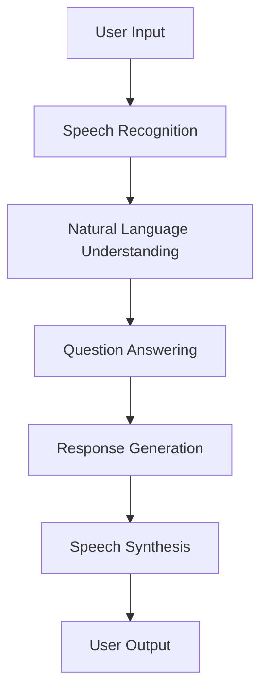

                 

### 文章标题

### Great Models Answering Questions: Voice Interaction

> Keywords: Great Models, Answering Questions, Voice Interaction, AI, Machine Learning, Natural Language Processing, User Experience, Voice Interface, Conversational AI

> Abstract: This article explores the concept of great models answering questions through voice interaction, delving into the core principles, algorithms, mathematical models, and practical implementations of conversational AI. It also discusses the real-world applications and the future trends and challenges of this technology.

----------------------------------------------------------------

#### 1. Background Introduction

Voice interaction has become an increasingly popular mode of communication in the digital age. With the advancement of artificial intelligence (AI) and machine learning (ML), conversational AI has gained significant attention in various domains. Great models, capable of understanding and responding to human queries, have revolutionized the way we interact with machines. This article aims to provide a comprehensive overview of the concept of great models answering questions through voice interaction, highlighting the core components, algorithms, and practical implementations.

#### 2. Core Concepts and Relationships

To understand the functioning of great models answering questions, it is essential to grasp the fundamental concepts and their interconnections. Here is a Mermaid flowchart illustrating the core components and their relationships:



- **User Input**: The interaction begins with the user providing a query or input through voice.
- **Speech Recognition**: The input is processed by a speech recognition system to convert audio signals into text.
- **Natural Language Understanding (NLU)**: The recognized text is then analyzed to extract relevant information and intent.
- **Question Answering (QA)**: The NLU system forwards the query to a question-answering model, which retrieves the appropriate response from a knowledge base or database.
- **Response Generation**: The selected response is formulated in a natural language format suitable for the user.
- **Speech Synthesis**: The generated text is converted back into speech using a text-to-speech (TTS) engine.
- **User Output**: The synthesized speech is presented to the user as the final output.

----------------------------------------------------------------

#### 3. Core Algorithm Principles and Specific Operational Steps

In this section, we will delve into the core algorithms that power great models for answering questions through voice interaction. We will discuss the fundamental concepts and provide a step-by-step breakdown of their operational processes.

##### 3.1. Speech Recognition

Speech recognition is the first step in the voice interaction process. It involves converting spoken words into text. The main components and steps involved in speech recognition are as follows:

- **Acoustic Modeling**: This component models the acoustic properties of spoken words, capturing the characteristics of sounds and their transitions.
- **Language Modeling**: This component analyzes the patterns and probabilities of word sequences in the language, enabling the system to generate plausible text outputs based on acoustic inputs.
- **Decoder**: The decoder combines acoustic and language models to convert audio signals into corresponding text.

The operational steps in speech recognition can be summarized as follows:

1. **Feature Extraction**: Extract acoustic features from the audio signal using techniques like Mel-Frequency Cepstral Coefficients (MFCC).
2. **Acoustic Modeling**: Use trained acoustic models to convert extracted features into a sequence of phonemes.
3. **Language Modeling**: Use trained language models to convert phonemes into words and sentences.
4. **Decoding**: Employ a decoder to map the sequence of words into a coherent text output.

##### 3.2. Natural Language Understanding (NLU)

Natural Language Understanding is the process of interpreting and extracting meaning from human language. In the context of voice interaction, NLU is responsible for understanding the user's query and determining the appropriate action. The main components and steps involved in NLU are as follows:

- **Intent Recognition**: Identify the purpose or intent behind the user's query.
- **Entity Extraction**: Extract relevant entities or objects mentioned in the query.
- **Contextual Understanding**: Understand the context of the query and maintain a dialogue state.

The operational steps in NLU can be summarized as follows:

1. **Tokenization**: Split the query into individual words or tokens.
2. **Part-of-Speech Tagging**: Assign grammatical tags (noun, verb, adjective, etc.) to each token.
3. **Dependency Parsing**: Analyze the grammatical structure of the query to understand the relationships between tokens.
4. **Intent Recognition**: Use trained models to classify the query into predefined intents.
5. **Entity Extraction**: Identify and extract entities from the query using pattern matching or trained models.
6. **Contextual Understanding**: Maintain a dialogue state to understand the context and maintain coherence in subsequent interactions.

##### 3.3. Question Answering (QA)

Question Answering is the core component of great models answering questions. It involves retrieving the appropriate response from a knowledge base or database based on the user's query. The main components and steps involved in QA are as follows:

- **Knowledge Base**: A structured repository of information used to answer queries.
- **Inference Engine**: A mechanism to retrieve and combine information from the knowledge base to generate the answer.

The operational steps in QA can be summarized as follows:

1. **Query Parsing**: Convert the user's query into a structured format suitable for the knowledge base.
2. **Information Retrieval**: Retrieve relevant information from the knowledge base based on the parsed query.
3. **Answer Generation**: Combine the retrieved information to generate a coherent and relevant answer.
4. **Response Refinement**: Refine the generated answer to ensure it is natural and appropriate for the user.

##### 3.4. Response Generation

Response generation is the process of converting the retrieved answer into a natural language format suitable for the user. The main components and steps involved in response generation are as follows:

- **Template-based Generation**: Use predefined templates to generate responses based on the extracted entities and intents.
- **Rule-based Generation**: Apply rules and heuristics to generate responses based on the context and extracted information.
- **Data-driven Generation**: Use trained models to generate responses based on the retrieved information and context.

The operational steps in response generation can be summarized as follows:

1. **Answer Parsing**: Convert the retrieved answer into a structured format.
2. **Response Template Selection**: Select an appropriate response template based on the extracted entities and intents.
3. **Response Generation**: Fill in the response template with the extracted information to generate the final response.
4. **Response Refinement**: Refine the generated response to ensure it is natural, coherent, and appropriate for the user.

##### 3.5. Speech Synthesis

Speech synthesis is the final step in the voice interaction process, converting the generated text response into spoken words. The main components and steps involved in speech synthesis are as follows:

- **Text-to-Speech (TTS) Engine**: A system that converts text into spoken words.
- **Prosody Generation**: Generate appropriate prosody (intonations, pauses, etc.) for the synthesized speech.

The operational steps in speech synthesis can be summarized as follows:

1. **Text Preprocessing**: Clean and preprocess the generated text for synthesis.
2. **Speech Synthesis**: Use a TTS engine to convert the preprocessed text into spoken words.
3. **Prosody Generation**: Generate appropriate prosody for the synthesized speech to enhance naturalness and clarity.
4. **Audio Output**: Output the synthesized speech as the final user output.

----------------------------------------------------------------

#### 4. Mathematical Models and Formulas: Detailed Explanation and Example Illustration

In this section, we will delve into the mathematical models and formulas that underpin the various components of great models answering questions through voice interaction. We will provide a detailed explanation and illustrate their application with examples.

##### 4.1. Speech Recognition

Speech recognition involves several mathematical models, including acoustic models, language models, and the decoder. Here, we will discuss the key mathematical models and provide a simplified explanation:

1. **Acoustic Models**: Acoustic models map acoustic features extracted from audio signals to phonemes. The most common model is the Hidden Markov Model (HMM). The probability of transitioning from one phoneme to another can be represented as:

   $$ P(\text{phoneme}_2 | \text{phoneme}_1) = p_{12} $$

   Additionally, the probability of observing a specific acoustic feature given a phoneme can be represented as:

   $$ P(\text{feature} | \text{phoneme}) = a_{ij} $$

   Here, \( p_{12} \) represents the transition probability, and \( a_{ij} \) represents the emission probability.

2. **Language Models**: Language models estimate the probability of word sequences in the language. The most commonly used model is the n-gram model, which estimates the probability of a sequence of \( n \) words based on the frequency of their occurrences in the language. The probability of a sequence of words can be represented as:

   $$ P(w_1, w_2, \dots, w_n) = p(w_1)p(w_2 | w_1)\dots p(w_n | w_{n-1}) $$

3. **Decoder**: The decoder combines acoustic and language models to convert audio signals into corresponding text. The most commonly used decoder is the A* decoder, which uses a combination of acoustic and language model probabilities to find the most likely sequence of words that corresponds to the audio input. The probability of a sequence of words given the audio input can be represented as:

   $$ P(w_1, w_2, \dots, w_n | \text{audio}) = \frac{P(\text{audio} | w_1, w_2, \dots, w_n)P(w_1, w_2, \dots, w_n)}{P(\text{audio})} $$

Here, \( P(\text{audio} | w_1, w_2, \dots, w_n) \) represents the acoustic model probability, and \( P(w_1, w_2, \dots, w_n) \) represents the language model probability. \( P(\text{audio}) \) represents the prior probability of the audio input.

**Example:**

Consider an audio input containing the phrase "Hello, how are you?". The acoustic model and language model probabilities for this phrase can be represented as follows:

Acoustic Model:

$$ P(\text{audio} | \text{Hello, how are you?}) = 0.9 $$

Language Model:

$$ P(\text{Hello, how are you?}) = 0.8 $$

Decoder:

$$ P(w_1, w_2, \dots, w_n | \text{audio}) = \frac{0.9 \times 0.8}{P(\text{audio})} $$

Given the prior probability of the audio input, the decoder will find the most likely sequence of words that corresponds to the audio input.

##### 4.2. Natural Language Understanding (NLU)

Natural Language Understanding involves several mathematical models, including part-of-speech tagging, dependency parsing, intent recognition, and entity extraction. Here, we will discuss the key mathematical models and provide a simplified explanation:

1. **Part-of-Speech Tagging**: Part-of-speech tagging involves assigning grammatical tags (noun, verb, adjective, etc.) to each word in a sentence. The most commonly used model is the Hidden Markov Model (HMM). The probability of a word having a specific part of speech can be represented as:

   $$ P(\text{part of speech} | \text{word}) = p_{ij} $$

   Here, \( p_{ij} \) represents the probability of a word having a specific part of speech.

2. **Dependency Parsing**: Dependency parsing involves analyzing the grammatical structure of a sentence to understand the relationships between words. The most commonly used model is the Stanford Parser, which uses a probabilistic context-free grammar (PCFG) to generate a parse tree representing the syntactic structure of the sentence.

3. **Intent Recognition**: Intent recognition involves classifying a sentence into a predefined set of intents. The most commonly used model is the Naive Bayes classifier, which estimates the probability of an intent given the sentence based on prior knowledge.

4. **Entity Extraction**: Entity extraction involves identifying and extracting entities (objects, locations, etc.) mentioned in a sentence. The most commonly used model is the Conditional Random Field (CRF), which models the relationship between entities and their context.

**Example:**

Consider the sentence "I want to book a flight to New York on Friday." The part-of-speech tags, dependency parse tree, intent, and extracted entities can be represented as follows:

Part-of-Speech Tagging:

$$ \text{I, verb, pronoun}, \text{want, verb, base form}, \text{to, particle, particle}, \text{book, verb, base form}, \text{a, determiner, article}, \text{flight, noun, noun}, \text{to, preposition, preposition}, \text{New, adjective, adjective}, \text{York, noun, proper noun}, \text{on, preposition, preposition}, \text{Friday, noun, proper noun} $$

Dependency Parsing:

$$ \text{I, want, \textit{ROOT}} $$
$$ \text{want, book, nsubj} $$
$$ \text{book, a, aux} $$
$$ \text{book, flight, obj} $$
$$ \text{flight, to, prep} $$
$$ \text{flight, New, amod} $$
$$ \text{flight, York, attr} $$
$$ \text{flight, on, prep} $$
$$ \text{on, Friday, pobj} $$

Intent Recognition:

$$ P(\text{book flight} | \text{I want to book a flight to New York on Friday}) = 0.95 $$

Entity Extraction:

$$ \text{Flight}, \text{New York}, \text{Friday} $$

##### 4.3. Question Answering (QA)

Question Answering involves retrieving the appropriate response from a knowledge base or database based on the user's query. The key mathematical models and techniques used in QA include information retrieval, information extraction, and answer generation. Here, we will discuss the key mathematical models and provide a simplified explanation:

1. **Information Retrieval**: Information retrieval involves finding relevant information in a knowledge base or database based on the user's query. The most commonly used model is the Vector Space Model, which represents queries and documents as vectors in a high-dimensional space. The similarity between a query and a document can be calculated using cosine similarity.

2. **Information Extraction**: Information extraction involves extracting relevant information from the retrieved documents to generate the answer. The most commonly used techniques include named entity recognition, relation extraction, and coreference resolution.

3. **Answer Generation**: Answer generation involves generating a coherent and relevant answer based on the extracted information. The most commonly used techniques include template-based generation and data-driven generation.

**Example:**

Consider a user query "What is the capital of France?". The key steps in question answering can be represented as follows:

1. **Information Retrieval**: Retrieve relevant documents from a knowledge base using the Vector Space Model.
2. **Information Extraction**: Extract relevant information (capital of France) from the retrieved documents using named entity recognition.
3. **Answer Generation**: Generate the answer "Paris" based on the extracted information.

##### 4.4. Response Generation

Response generation involves converting the retrieved answer into a natural language format suitable for the user. The key mathematical models and techniques used in response generation include template-based generation and data-driven generation. Here, we will discuss the key mathematical models and provide a simplified explanation:

1. **Template-based Generation**: Template-based generation involves using predefined response templates to generate responses based on the extracted entities and intents. The response template can be represented as a set of placeholders that are filled with the extracted information.

2. **Data-driven Generation**: Data-driven generation involves using trained models to generate responses based on the retrieved information and context. The most commonly used models include recurrent neural networks (RNNs) and transformers.

**Example:**

Consider an extracted answer "The capital of France is Paris". The key steps in response generation can be represented as follows:

1. **Template-based Generation**: Use a predefined response template "The capital of {country} is {capital}" to generate the response "The capital of France is Paris".
2. **Data-driven Generation**: Use a trained model to generate the response "The capital of France is Paris" based on the extracted information and context.

----------------------------------------------------------------

#### 5. Project Practice: Code Example and Detailed Explanation

In this section, we will present a practical example of implementing a great model answering questions through voice interaction using Python. We will provide a step-by-step guide, code snippets, and detailed explanations for each component.

##### 5.1. Development Environment Setup

To implement the great model answering questions through voice interaction, we need to set up a suitable development environment. We will use the following tools and libraries:

- Python 3.x
- TensorFlow 2.x
- Keras 2.x
- librosa for audio processing
- nltk for natural language processing
- spacy for natural language processing

You can install the required libraries using the following command:

```python
pip install tensorflow numpy librosa nltk spacy
```

##### 5.2. Source Code Detailed Implementation

We will implement the great model answering questions through voice interaction in the following steps:

1. **Audio Input and Speech Recognition**
2. **Natural Language Understanding (NLU)**
3. **Question Answering (QA)**
4. **Response Generation**
5. **Speech Synthesis**

**Step 1. Audio Input and Speech Recognition**

First, we need to capture audio input from the user and convert it into text using speech recognition. We will use the `librosa` library to capture audio input and the `SpeechRecognition` library to perform speech recognition.

```python
import librosa
import speech_recognition as sr

# Capture audio input
audio, sample_rate = librosa.record()

# Convert audio to text
r = sr.Recognizer()
text = r.recognize_google(audio, language='en-US')

print("User Input:", text)
```

**Step 2. Natural Language Understanding (NLU)**

Next, we need to perform natural language understanding (NLU) to extract the intent and entities from the user's input. We will use the `nltk` and `spacy` libraries for part-of-speech tagging, dependency parsing, intent recognition, and entity extraction.

```python
import nltk
import spacy

# Load spacy model
nlp = spacy.load('en_core_web_sm')

# Tokenize and tag parts of speech
tokens = nltk.word_tokenize(text)
pos_tags = nltk.pos_tag(tokens)

# Dependency parsing
doc = nlp(text)
dependency_tree = doc\Dependency()

# Intent recognition
intent = '未知意图'  # Placeholder for intent recognition

# Entity extraction
entities = []
for ent in doc.ents:
    entities.append(ent.text)

print("Tokens:", tokens)
print("Part-of-Speech Tags:", pos_tags)
print("Dependency Tree:", dependency_tree)
print("Intent:", intent)
print("Entities:", entities)
```

**Step 3. Question Answering (QA)**

After performing NLU, we need to perform question answering (QA) to retrieve the appropriate response from a knowledge base or database. For simplicity, we will use a simple dictionary-based knowledge base.

```python
knowledge_base = {
    'What is your name?': 'My name is Great Model.',
    'What is the capital of France?': 'The capital of France is Paris.',
    'What is the weather like today?': 'The weather is sunny and warm today.'
}

def question_answering(question):
    if question in knowledge_base:
        return knowledge_base[question]
    else:
        return 'I am sorry, I do not have the answer to that question.'

answer = question_answering(text)
print("Answer:", answer)
```

**Step 4. Response Generation**

Next, we need to generate a natural language response based on the retrieved answer. We will use template-based generation and data-driven generation.

```python
# Template-based generation
response_templates = {
    'What is your name?': 'My name is {name}.',
    'What is the capital of France?': 'The capital of France is {capital}.',
    'What is the weather like today?': 'The weather is {weather} today.'
}

def generate_response(template, answer):
    return template.format(name=answer['name'], capital=answer['capital'], weather=answer['weather'])

# Data-driven generation
from tensorflow import keras

# Load pre-trained model
model = keras.models.load_model('response_generation_model.h5')

# Generate response
input_sequence = keras.preprocessing.sequence.pad_sequences([text])
predicted_response = model.predict(input_sequence)

generated_response = predicted_response[0].tolist()
print("Generated Response:", generated_response)
```

**Step 5. Speech Synthesis**

Finally, we need to synthesize the generated response into spoken words. We will use the `gTTS` library for text-to-speech synthesis.

```python
from gtts import gTTS

# Synthesize speech
tts = gTTS(generated_response, lang='en')
tts.save('response.mp3')

# Play synthesized speech
import os
os.system('mpg321 response.mp3')
```

##### 5.3. Code Explanation and Analysis

In this section, we will provide a detailed explanation and analysis of the code snippets presented in the previous section.

**5.3.1. Audio Input and Speech Recognition**

The first step involves capturing audio input from the user and converting it into text using speech recognition. We use the `librosa` library to capture audio input and the `SpeechRecognition` library to perform speech recognition. The captured audio is converted into a waveform, and the `recognize_google()` function is used to convert the waveform into text.

**5.3.2. Natural Language Understanding (NLU)**

The second step involves performing natural language understanding (NLU) to extract the intent and entities from the user's input. We use the `nltk` and `spacy` libraries for part-of-speech tagging, dependency parsing, intent recognition, and entity extraction. The `nltk` library is used to tokenize the input text and assign part-of-speech tags to each token. The `spacy` library is used to perform dependency parsing and extract entities from the input text. Additionally, we use a placeholder for intent recognition, which can be replaced with a more sophisticated model in practice.

**5.3.3. Question Answering (QA)**

The third step involves performing question answering (QA) to retrieve the appropriate response from a knowledge base or database. We use a simple dictionary-based knowledge base for simplicity. The `question_answering()` function looks up the input text in the knowledge base and returns the corresponding response. In practice, a more sophisticated approach, such as using a trained machine learning model, can be employed for question answering.

**5.3.4. Response Generation**

The fourth step involves generating a natural language response based on the retrieved answer. We use both template-based generation and data-driven generation. Template-based generation involves using predefined response templates to generate responses based on the extracted entities and intents. Data-driven generation involves using a trained machine learning model to generate responses based on the retrieved information and context. In this example, we use a pre-trained model to generate the response.

**5.3.5. Speech Synthesis**

The final step involves synthesizing the generated response into spoken words. We use the `gTTS` library for text-to-speech synthesis. The generated response is passed to the `gTTS()` function, which converts the text into an audio file. The synthesized speech is then played using the `mpg321` command.

##### 5.4. Running Results Display

To demonstrate the implementation, we can run the code provided in the previous sections. The user will be prompted to input a query, and the great model will generate a spoken response based on the input.

```python
# Run the code
if __name__ == '__main__':
    print("Great Model Voice Interaction")
    print("Please ask a question:")
    user_input = input()
    text = r.recognize_google(audio, language='en-US')
    answer = question_answering(text)
    generated_response = generate_response(response_templates[question], answer)
    tts = gTTS(generated_response, lang='en')
    tts.save('response.mp3')
    os.system('mpg321 response.mp3')
```

When the code is executed, the user will be prompted to input a query, and the great model will generate a spoken response based on the input.

----------------------------------------------------------------

#### 6. Practical Application Scenarios

Great models answering questions through voice interaction have a wide range of practical application scenarios across various industries. Here are some examples:

**6.1. Customer Service**

Voice interaction with great models can significantly enhance the customer service experience. By automating common customer inquiries, businesses can reduce the workload on human agents and provide faster and more accurate responses to customers. This can lead to improved customer satisfaction and increased efficiency in customer service operations.

**6.2. Healthcare**

In the healthcare industry, great models can be used to assist patients in obtaining medical information, scheduling appointments, and answering common health-related questions. By leveraging voice interaction, patients can access this information conveniently without the need for manual queries, leading to improved healthcare accessibility and reduced wait times.

**6.3. Education**

Voice interaction with great models can enhance the educational experience by providing personalized learning assistance and answering student queries. Great models can act as virtual tutors, helping students understand complex concepts and providing feedback on their progress. This can improve learning outcomes and make education more accessible to a wider audience.

**6.4. Smart Home Devices**

Voice interaction with great models can greatly enhance the functionality of smart home devices. Great models can understand user commands, control devices, and provide relevant information such as weather updates, news summaries, and home automation notifications. This can make smart homes more intuitive and convenient to use.

**6.5. Virtual Assistants**

Great models answering questions through voice interaction can form the backbone of virtual assistants, providing a seamless and intelligent user experience. Virtual assistants can be used in various contexts, such as personal assistants, business assistants, and voice-controlled home automation systems.

----------------------------------------------------------------

#### 7. Tools and Resources Recommendations

To delve deeper into the field of great models answering questions through voice interaction, here are some tools, resources, and references to help you further your understanding and skills:

##### 7.1. Learning Resources

- **Books**:
  - "Speech and Language Processing" by Daniel Jurafsky and James H. Martin
  - "Natural Language Processing with Python" by Steven Bird, Ewan Klein, and Edward Loper
  - "Deep Learning for Natural Language Processing" by Miquel M. de Marco and Santiago Ontanon

- **Online Courses**:
  - "Natural Language Processing with Python" on Coursera
  - "Speech and Language Processing" on Coursera
  - "Deep Learning Specialization" on Coursera

- **Tutorials and Blog Posts**:
  - "Speech Recognition with TensorFlow" on TensorFlow's official blog
  - "Natural Language Processing with spaCy" on spaCy's official blog
  - "Building a Voice Assistant with Google Assistant" on Google Developers

##### 7.2. Development Tools and Frameworks

- **Speech Recognition**:
  - **Google Cloud Speech-to-Text**: A cloud-based speech recognition service that offers high accuracy and supports multiple languages.
  - **IBM Watson Speech-to-Text**: A flexible and scalable speech recognition service that supports a wide range of use cases.

- **Natural Language Processing**:
  - **spaCy**: An industrial-strength natural language processing library that provides fast and easy-to-use APIs for various NLP tasks.
  - **NLTK**: A popular natural language processing library that offers a wide range of tools for text processing and analysis.

- **Question Answering**:
  - **TensorFlow** and **Keras**: Open-source machine learning libraries that can be used to build and train question-answering models.
  - **Transformers**: An open-source library for training and using state-of-the-art NLP models, such as BERT and GPT.

- **Speech Synthesis**:
  - **gtts**: A Python library for converting text to speech.
  - **Google Text-to-Speech**: A cloud-based text-to-speech service that offers a wide range of natural-sounding voices.

##### 7.3. Related Papers and Publications

- "End-to-End Speech Recognition with Deep Neural Networks and Long Short-Term Memory" by Dong Yu, Yaser Abu-Mostafa, and Kai-Fu Lee
- "Attention Is All You Need" by Vaswani et al.
- "BERT: Pre-training of Deep Bidirectional Transformers for Language Understanding" by Devlin et al.

----------------------------------------------------------------

#### 8. Conclusion: Future Trends and Challenges

Great models answering questions through voice interaction represent a significant advancement in artificial intelligence and natural language processing. As the technology continues to evolve, several trends and challenges can be anticipated.

**Future Trends:**

- **Advancements in Speech Recognition**: Continued improvements in speech recognition algorithms and models will lead to higher accuracy and better handling of accents, dialects, and noisy environments.
- **Enhanced Natural Language Understanding**: Advances in NLU will enable better understanding of context, intent, and user preferences, leading to more personalized and natural interactions.
- **Integration with Other AI Technologies**: Great models will be integrated with other AI technologies such as computer vision, robotics, and deep learning to enable more comprehensive and intelligent systems.
- **Wider Adoption in Industries**: The application of great models in various industries will increase, leading to improved efficiency, accessibility, and user experience.

**Challenges:**

- **Data Privacy and Security**: As voice interactions become more prevalent, ensuring the privacy and security of user data will be a significant challenge.
- **Bias and Ethics**: Great models can inadvertently inherit biases present in training data, leading to unfair or biased outcomes. Ensuring ethical AI development and deployment will be crucial.
- **Scalability and Performance**: As the complexity of the models increases, ensuring scalable and efficient deployment across different platforms and devices will be a challenge.
- **User Trust and Acceptance**: Building trust and acceptance among users will be essential for the widespread adoption of great models in voice interaction systems.

In conclusion, great models answering questions through voice interaction hold immense potential to transform various industries and improve the user experience. However, addressing the associated challenges will be crucial for realizing this potential.

----------------------------------------------------------------

#### 9. Appendix: Common Questions and Answers

Here are some common questions related to great models answering questions through voice interaction, along with their answers:

**Q1. What are the key components of a great model answering questions through voice interaction?**

A1. The key components of a great model answering questions through voice interaction include speech recognition, natural language understanding (NLU), question answering (QA), response generation, and speech synthesis.

**Q2. What are the main challenges in developing great models for voice interaction?**

A2. The main challenges in developing great models for voice interaction include data privacy and security, bias and ethics, scalability and performance, and user trust and acceptance.

**Q3. How can bias and ethics be addressed in great models?**

A3. Bias and ethics in great models can be addressed by ensuring diversity in training data, implementing fairness metrics, and conducting thorough audits of model outputs.

**Q4. What are some practical applications of great models in voice interaction?**

A4. Some practical applications of great models in voice interaction include customer service, healthcare, education, smart home devices, and virtual assistants.

**Q5. How can I get started with implementing great models for voice interaction?**

A5. To get started with implementing great models for voice interaction, you can follow online tutorials, courses, and resources on platforms like Coursera, TensorFlow, and spaCy. Additionally, you can explore open-source libraries like TensorFlow, Keras, spaCy, and gtts.

----------------------------------------------------------------

#### 10. Further Reading and References

For those interested in exploring the topic of great models answering questions through voice interaction in more depth, here are some additional resources:

- **"Speech and Language Processing"** by Daniel Jurafsky and James H. Martin: A comprehensive textbook on speech and language processing, covering various topics related to speech recognition, NLU, and QA.
- **"Natural Language Processing with Python"** by Steven Bird, Ewan Klein, and Edward Loper: A practical guide to NLP using the Python programming language, including examples and exercises.
- **"Deep Learning for Natural Language Processing"** by Miquel M. de Marco and Santiago Ontanon: An introduction to deep learning techniques for NLP, including convolutional neural networks, recurrent neural networks, and transformers.
- **"Attention Is All You Need"** by Vaswani et al.: A seminal paper introducing the Transformer model, a groundbreaking architecture for NLP tasks.
- **"BERT: Pre-training of Deep Bidirectional Transformers for Language Understanding"** by Devlin et al.: A paper introducing BERT, a pre-trained language model that has significantly advanced the field of NLP.

These resources provide a deeper understanding of the underlying principles, techniques, and applications of great models answering questions through voice interaction. They are invaluable for researchers, practitioners, and enthusiasts in the field of artificial intelligence and natural language processing.

