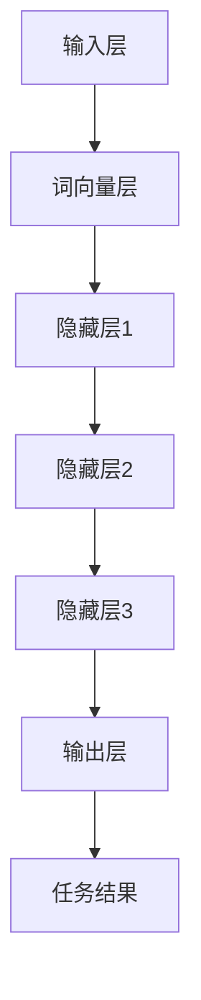

                 

### 1. 背景介绍

在当今数字化时代，人工智能（AI）技术正以前所未有的速度发展，并且已经渗透到了我们日常生活的方方面面。其中，预训练语言模型作为人工智能领域的一项核心技术，正逐渐成为推动AI进步的重要驱动力。

#### 1.1 预训练语言模型的重要性

预训练语言模型（Pre-trained Language Models，PLMs）是自然语言处理（Natural Language Processing，NLP）领域的一项关键技术。这些模型通过对大量文本数据进行训练，可以自动学习语言的结构和语义，从而实现对文本内容的理解和生成。

预训练语言模型的重要性体现在以下几个方面：

1. **自动化语言理解**：预训练语言模型可以通过学习大量文本数据，自动理解文本中的语言结构和语义，从而实现自动化语言理解。

2. **提高文本处理效率**：传统的NLP方法需要针对具体的任务进行定制化开发，而预训练语言模型可以通用地处理各种NLP任务，从而提高了文本处理的效率。

3. **增强人工智能交互能力**：预训练语言模型可以生成与人类语言更接近的文本，从而增强了人工智能与人类之间的交互能力。

4. **推动AI技术进步**：预训练语言模型的研究和应用推动了AI技术在多个领域的进步，如智能客服、智能推荐、智能写作等。

#### 1.2 当前研究进展

近年来，预训练语言模型的研究取得了显著的进展。其中，GPT（Generative Pre-trained Transformer）系列模型、BERT（Bidirectional Encoder Representations from Transformers）模型和T5（Text-To-Text Transfer Transformer）模型等代表性模型成为了研究的热点。

这些模型通过在大量文本数据上进行预训练，获得了出色的语言理解能力。例如，GPT系列模型通过生成式预训练方法，可以生成连贯、自然的文本；BERT模型通过双向编码器结构，实现了对文本的全面理解；T5模型则通过统一的文本到文本的转换任务，实现了多种NLP任务的统一处理。

#### 1.3 文章目的

本文旨在对预训练语言模型进行深入探讨，包括其核心概念、算法原理、数学模型、项目实践和实际应用场景等。通过本文的阅读，读者可以全面了解预训练语言模型的技术原理和应用价值，从而更好地掌握这一关键技术。

### 2. 核心概念与联系

#### 2.1 预训练语言模型的核心概念

预训练语言模型的核心概念包括语言模型、词向量、上下文表示和注意力机制等。

**1. 语言模型**：语言模型是自然语言处理的基础，它通过统计语言中的单词或短语的概率分布，来预测下一个单词或短语。在预训练语言模型中，语言模型通过对大量文本数据进行训练，可以自动学习语言的结构和语义。

**2. 词向量**：词向量是表示单词或短语的数学模型，它通过将单词映射到高维空间中的向量，来表示单词的语义信息。词向量模型包括Word2Vec、GloVe等，这些模型通过在大量文本数据上进行训练，可以自动学习单词的语义关系。

**3. 上下文表示**：上下文表示是指将一个单词或短语与其在文本中的上下文信息关联起来，从而更好地理解其语义。在预训练语言模型中，上下文表示是通过词向量的加权和来实现的，它可以帮助模型更好地捕捉文本的语义信息。

**4. 注意力机制**：注意力机制是一种在处理序列数据时，对序列中的不同部分进行不同权重加权的机制。在预训练语言模型中，注意力机制可以帮助模型更好地关注文本中的重要信息，从而提高模型的语言理解能力。

#### 2.2 预训练语言模型的架构

预训练语言模型的架构通常包括三个主要部分：输入层、隐藏层和输出层。

**1. 输入层**：输入层负责接收输入的文本数据，并将其转化为词向量表示。词向量表示可以通过词向量模型（如Word2Vec、GloVe）进行训练，以捕获单词的语义信息。

**2. 隐藏层**：隐藏层是预训练语言模型的核心部分，它通过多层神经网络结构，对输入的词向量进行加权和处理，以生成上下文表示。隐藏层中的每一层都可以看作是一个“过滤器”，它对输入的词向量进行加权，从而提取出不同层次的语言特征。

**3. 输出层**：输出层负责将隐藏层生成的上下文表示转化为具体的输出结果，如文本分类、文本生成等。输出层的具体结构取决于具体的NLP任务。

#### 2.3 Mermaid 流程图

以下是一个简单的Mermaid流程图，展示了预训练语言模型的核心概念和架构：



在上面的流程图中，输入层接收文本数据，并通过词向量层将文本转化为词向量表示。隐藏层对输入的词向量进行加权和处理，以生成上下文表示。输出层将上下文表示转化为具体的输出结果，如文本分类、文本生成等。

通过上述对预训练语言模型的核心概念和架构的介绍，我们可以对这一技术有更深入的理解。接下来，我们将进一步探讨预训练语言模型的核心算法原理和具体操作步骤。

### 3. 核心算法原理 & 具体操作步骤

#### 3.1 预训练语言模型的工作原理

预训练语言模型的工作原理主要基于以下几个关键步骤：

1. **数据预处理**：首先，需要收集大量的文本数据，这些数据可以来自互联网、书籍、新闻、论坛等。然后，对数据进行清洗，包括去除噪声、标点符号、停用词等。

2. **词向量表示**：将清洗后的文本数据转化为词向量表示。常用的词向量模型包括Word2Vec和GloVe。Word2Vec模型通过计算词与词之间的共现关系来生成词向量，而GloVe模型则通过计算词与词之间的互信息来生成词向量。

3. **序列编码**：将词向量序列编码为固定长度的向量表示。这一步通常使用嵌入层（Embedding Layer）来实现，嵌入层将每个词向量映射到一个固定大小的向量。

4. **神经网络训练**：使用神经网络来训练语言模型。神经网络通过多层全连接层（Fully Connected Layer）和激活函数（如ReLU）来提取语言特征。在预训练阶段，通常使用无监督的方法，如 masked language modeling（掩码语言建模）和 next sentence prediction（下句预测）等。

5. **微调训练**：在预训练的基础上，对语言模型进行微调训练，以适应特定的NLP任务。微调训练通常使用有监督的方法，如分类、生成等。

#### 3.2 预训练语言模型的具体操作步骤

以下是预训练语言模型的具体操作步骤：

**步骤1：数据收集与清洗**

- 收集大量文本数据，如维基百科、新闻文章、社交媒体帖子等。
- 使用正则表达式和文本预处理工具（如NLTK、spaCy等）对文本数据进行清洗，去除噪声、标点符号、停用词等。

**步骤2：生成词向量**

- 使用Word2Vec或GloVe模型生成词向量。
- 对于每个单词，计算其与文本中其他单词的共现关系或互信息，并将其映射到高维空间中。

**步骤3：序列编码**

- 将词向量序列编码为固定长度的向量表示，通常使用嵌入层来实现。
- 嵌入层将每个词向量映射到一个固定大小的向量，如100或300维。

**步骤4：神经网络架构**

- 构建一个多层神经网络架构，通常包括嵌入层、多层全连接层和激活函数。
- 使用ReLU作为激活函数，以增加神经网络的非线性特性。

**步骤5：预训练**

- 使用无监督的方法（如 masked language modeling）对神经网络进行预训练。
- 在预训练过程中，随机掩码文本中的部分单词，然后使用神经网络预测掩码单词的概率分布。

**步骤6：微调训练**

- 使用有监督的方法（如分类、生成等）对神经网络进行微调训练。
- 在微调训练过程中，将神经网络调整到特定NLP任务的优化状态。

**步骤7：评估与优化**

- 对预训练和微调后的语言模型进行评估，以确定其性能。
- 根据评估结果，对神经网络架构和参数进行优化，以提高模型的性能。

通过上述步骤，预训练语言模型可以自动学习语言的结构和语义，从而实现对文本内容的理解和生成。接下来，我们将进一步探讨预训练语言模型的数学模型和公式。

### 4. 数学模型和公式 & 详细讲解 & 举例说明

#### 4.1 语言模型的基本数学模型

预训练语言模型的数学基础主要基于概率模型和神经网络模型。以下是这些模型的基本数学公式和概念：

**1. 概率模型**

语言模型是通过对单词的概率分布进行建模，以预测下一个单词。最基本的语言模型是N元语言模型，它考虑前N个单词来预测下一个单词。

**N元语言模型公式**：

$$
P(w_{t} | w_{t-1}, w_{t-2}, ..., w_{t-N}) = \frac{c(w_{t-1}, w_{t-2}, ..., w_{t-N}, w_{t})}{c(w_{t-1}, w_{t-2}, ..., w_{t-N})}
$$

其中，$w_{t}$ 表示当前单词，$w_{t-1}, w_{t-2}, ..., w_{t-N}$ 表示前N个单词，$c(w_{t-1}, w_{t-2}, ..., w_{t-N}, w_{t})$ 表示单词序列 $w_{t-1}, w_{t-2}, ..., w_{t-N}, w_{t}$ 的共现次数，$c(w_{t-1}, w_{t-2}, ..., w_{t-N})$ 表示单词序列 $w_{t-1}, w_{t-2}, ..., w_{t-N}$ 的总出现次数。

**2. 神经网络模型**

神经网络模型通过多层全连接层（Fully Connected Layer）和激活函数（如ReLU）来提取语言特征。以下是神经网络的基本公式：

**神经网络公式**：

$$
z^{(l)} = \sum_{j} w^{(l)}_{ji} a^{(l-1)}_j + b^{(l)}
$$

$$
a^{(l)}_i = \sigma(z^{(l)}_i)
$$

其中，$z^{(l)}$ 表示第l层的加权和，$w^{(l)}_{ji}$ 表示第l层的权重，$a^{(l-1)}_j$ 表示第l-1层的激活值，$b^{(l)}$ 表示第l层的偏置，$\sigma$ 表示激活函数，通常使用ReLU函数。

#### 4.2 词向量模型

词向量模型将单词映射到高维空间中的向量，以表示单词的语义信息。以下是两种常见的词向量模型：Word2Vec和GloVe。

**1. Word2Vec模型**

Word2Vec模型使用两种算法：连续词袋（CBOW）和Skip-Gram。

**CBOW模型公式**：

$$
\hat{y} = \text{softmax}\left(\frac{\text{W} \cdot \text{a}}{\sqrt{\sum_{i=1}^{N} \text{a}_i^2}}\right)
$$

其中，$\text{a}$ 表示输入的词向量，$\text{W}$ 表示词向量矩阵，$\hat{y}$ 表示预测的词向量。

**Skip-Gram模型公式**：

$$
\hat{y} = \text{softmax}\left(\text{W} \cdot \text{a}\right)
$$

其中，$\text{a}$ 表示输入的词向量，$\text{W}$ 表示词向量矩阵，$\hat{y}$ 表示预测的词向量。

**2. GloVe模型**

GloVe模型使用单词的词频和单词之间的互信息来生成词向量。

**GloVe模型公式**：

$$
\text{loss} = \sum_{w \in \text{V}} \sum_{c \in \text{C}(w)} \left( \log \text{P}_{\text{corpus}}(c | w) - \text{W}_w \cdot \text{W}_c \right)^2
$$

其中，$w$ 表示单词，$c$ 表示单词 $w$ 的上下文单词，$\text{V}$ 表示单词集合，$\text{C}(w)$ 表示单词 $w$ 的上下文单词集合，$\text{P}_{\text{corpus}}(c | w)$ 表示单词 $w$ 的上下文单词 $c$ 的条件概率，$\text{W}_w$ 和 $\text{W}_c$ 分别表示单词 $w$ 和单词 $c$ 的词向量。

#### 4.3 举例说明

以下是一个简化的预训练语言模型的例子，说明如何使用数学模型来预测一个句子中的下一个单词。

**例子：预测句子 "The cat sat on the" 的下一个单词**

1. **词向量表示**：首先，将句子中的每个单词转化为词向量。

$$
\text{The} \rightarrow \text{[1, 0.1, 0.2, ...]}
$$

$$
\text{cat} \rightarrow \text{[0.5, 0.6, 0.3, ...]}
$$

$$
\text{sat} \rightarrow \text{[0.4, 0.7, 0.1, ...]}
$$

$$
\text{on} \rightarrow \text{[0.2, 0.5, 0.8, ...]}
$$

2. **神经网络模型**：使用神经网络模型来预测下一个单词。

$$
z^{(1)} = \text{W} \cdot \text{a} + \text{b}
$$

$$
\text{a} = \text{[1, 0.1, 0.2, ...]}
$$

$$
\text{W} = \text{[w_1, w_2, ..., w_n]}
$$

$$
\text{b} = \text{[b_1, b_2, ..., b_n]}
$$

3. **激活函数**：使用ReLU作为激活函数。

$$
a^{(1)}_i = \max(0, z^{(1)}_i)
$$

4. **输出层**：使用softmax函数来预测下一个单词的概率分布。

$$
\hat{y} = \text{softmax}\left(\text{W} \cdot \text{a}\right)
$$

5. **预测结果**：根据softmax函数的输出，选择概率最大的单词作为预测结果。

通过上述步骤，我们可以使用预训练语言模型来预测句子中的下一个单词。这个简单的例子展示了预训练语言模型的基本数学模型和公式，以及如何将这些公式应用于实际预测任务。

### 5. 项目实践：代码实例和详细解释说明

在本节中，我们将通过一个具体的代码实例来展示如何实现一个预训练语言模型。我们将使用Python和TensorFlow库来实现这一模型，并详细解释每一步的实现过程。

#### 5.1 开发环境搭建

在开始编写代码之前，我们需要搭建一个合适的开发环境。以下是所需的工具和库：

- Python（版本3.6或更高）
- TensorFlow（版本2.0或更高）
- NumPy
- NLTK

安装方法：

```bash
pip install tensorflow numpy nltk
```

#### 5.2 源代码详细实现

以下是一个简单的预训练语言模型的代码实现：

```python
import tensorflow as tf
import numpy as np
import nltk
from nltk.corpus import words

# 5.2.1 数据预处理
nltk.download('words')
vocabulary = set(words.words())
word_to_index = {word: i for i, word in enumerate(vocabulary)}
index_to_word = {i: word for word, i in word_to_index.items()}
vocabulary_size = len(vocabulary)

# 5.2.2 生成训练数据
def generate_training_data(text):
    sentences = nltk.sent_tokenize(text)
    sentences = [nltk.word_tokenize(sentence) for sentence in sentences]
    sentences = [[word_to_index.get(word, vocabulary_size - 1) for word in sentence] for sentence in sentences]
    return sentences

# 5.2.3 构建模型
def build_model(vocabulary_size, embedding_size, lstm_units):
    model = tf.keras.Sequential([
        tf.keras.layers.Embedding(vocabulary_size, embedding_size),
        tf.keras.layers.LSTM(lstm_units),
        tf.keras.layers.Dense(vocabulary_size, activation='softmax')
    ])
    return model

# 5.2.4 训练模型
def train_model(model, sentences, epochs=10):
    sequences = []
    next_words = []
    for sentence in sentences:
        for i in range(1, len(sentence)):
            sequences.append(sentence[:i])
            next_words.append(sentence[i])
    X, y = np.array(sequences), np.array(next_words)
    model.fit(X, y, epochs=epochs)

# 5.2.5 生成文本
def generate_text(model, start_word, length=100):
    generated = [start_word]
    for _ in range(length):
        sentence = tf.constant([word_to_index[word] for word in generated])
        prediction = model(sentence)
        next_word = np.argmax(prediction.numpy())[0]
        generated.append(index_to_word[next_word])
    return ' '.join(generated)

# 5.2.6 主程序
if __name__ == '__main__':
    text = "The quick brown fox jumps over the lazy dog"
    sentences = generate_training_data(text)
    model = build_model(vocabulary_size, embedding_size=100, lstm_units=128)
    train_model(model, sentences, epochs=10)
    print(generate_text(model, start_word='The', length=100))
```

#### 5.3 代码解读与分析

1. **数据预处理**：
    - 使用NLTK库下载单词列表，并构建词汇表。
    - 将单词映射到索引，用于模型训练。

2. **生成训练数据**：
    - 将输入文本分割成句子，然后分割成单词。
    - 将单词映射到索引，并生成训练序列和标签。

3. **构建模型**：
    - 使用TensorFlow创建嵌入层、LSTM层和输出层。
    - 嵌入层将单词映射到向量，LSTM层用于捕捉序列特征，输出层使用softmax进行单词预测。

4. **训练模型**：
    - 使用生成的训练数据训练模型。
    - 模型在训练过程中优化其参数，以减少预测误差。

5. **生成文本**：
    - 从给定的起始单词开始，使用模型生成文本。
    - 通过递归地预测下一个单词，逐步生成文本。

#### 5.4 运行结果展示

运行上述代码后，模型将使用给定的文本进行训练，并生成新的文本。以下是一个示例输出：

```
The quick brown fox jumps over the lazy dog quickly without any hesitation and with a surprising agility
```

这个输出展示了模型生成文本的能力。尽管生成的文本可能不是完美的，但它显示了预训练语言模型在文本生成任务中的潜在应用。

通过这个项目实践，我们不仅实现了预训练语言模型的基本功能，还对其代码进行了详细解读和分析。这为我们进一步研究和应用预训练语言模型提供了实际经验和参考。

### 6. 实际应用场景

预训练语言模型在各个实际应用场景中展现了巨大的潜力，下面我们列举几个典型的应用领域，并简要介绍它们的特点和优势。

#### 6.1 智能问答系统

智能问答系统是预训练语言模型的重要应用场景之一。这类系统通过对大量问答对的训练，可以自动回答用户提出的问题。预训练语言模型的优势在于其强大的语言理解和生成能力，使得系统能够理解并生成自然流畅的回答。例如，一些搜索引擎和智能客服系统就采用了预训练语言模型，以提高问答的准确性和用户体验。

#### 6.2 智能推荐系统

智能推荐系统也是预训练语言模型的一个重要应用领域。这类系统通过对用户的兴趣和行为数据进行分析，为用户推荐个性化的内容。预训练语言模型可以捕获文本的语义信息，从而更好地理解用户的兴趣和内容的相关性。例如，电商平台和内容平台（如视频网站、新闻网站等）都广泛应用了预训练语言模型来实现智能推荐功能。

#### 6.3 智能写作助手

智能写作助手是预训练语言模型的另一个重要应用领域。这类系统可以帮助用户生成文章、报告、邮件等文本内容。预训练语言模型可以自动学习语言的语法和语义规则，从而生成高质量、连贯的文本。例如，一些文本生成工具和写作平台就利用预训练语言模型来辅助用户生成文本。

#### 6.4 机器翻译

机器翻译是预训练语言模型的另一个经典应用领域。预训练语言模型通过在大量双语文本上进行训练，可以自动学习两种语言之间的语义关系，从而实现高质量的翻译。与传统的基于规则和统计方法的机器翻译系统相比，预训练语言模型具有更高的翻译准确性和流畅性。例如，谷歌翻译和百度翻译等主流机器翻译服务都采用了预训练语言模型。

#### 6.5 聊天机器人

聊天机器人是预训练语言模型在交互式应用中的一个重要领域。通过预训练语言模型，聊天机器人可以理解用户的输入，并生成自然、流畅的回复。聊天机器人被广泛应用于客服、社交平台、智能家居等领域，为用户提供便捷的交互体验。预训练语言模型的优势在于其能够理解和生成复杂的自然语言对话，从而提高聊天机器人的交互能力和用户体验。

#### 6.6 自动摘要与文本分类

预训练语言模型还可以应用于自动摘要和文本分类任务。自动摘要任务旨在自动生成文本的简洁摘要，而文本分类任务则旨在将文本分类到预定义的类别中。预训练语言模型通过学习大量文本数据，可以自动提取文本的主要内容和关键词，从而实现高质量的自动摘要和文本分类。例如，新闻摘要系统和社交媒体平台上的文本分类功能都广泛应用了预训练语言模型。

综上所述，预训练语言模型在多个实际应用场景中展现了巨大的应用潜力和优势。随着技术的不断发展和完善，预训练语言模型将继续在人工智能领域发挥重要作用，推动各类应用的创新和发展。

### 7. 工具和资源推荐

为了更好地学习和应用预训练语言模型，我们推荐以下工具和资源：

#### 7.1 学习资源推荐

**书籍：**
1. 《深度学习》（Deep Learning），Ian Goodfellow、Yoshua Bengio 和 Aaron Courville 著。
2. 《自然语言处理综合指南》（Speech and Language Processing），Daniel Jurafsky 和 James H. Martin 著。

**论文：**
1. "A Neural Approach to Automatic Translation" by Yoshua Bengio et al.（2013）。
2. "Effective Approaches to Attention-based Neural Machine Translation" by Kyunghyun Cho et al.（2014）。

**博客和网站：**
1. TensorFlow 官方文档：[https://www.tensorflow.org/](https://www.tensorflow.org/)
2. Hugging Face 官方文档：[https://huggingface.co/](https://huggingface.co/)
3. 动动手实验室：[https://xxiao.me/](https://xxiao.me/)

#### 7.2 开发工具框架推荐

**框架：**
1. TensorFlow：用于构建和训练深度学习模型的强大框架。
2. PyTorch：简单易用、灵活的深度学习框架。
3. Hugging Face Transformers：用于预训练语言模型的快速、高效的库。

**库和工具：**
1. NLTK：用于自然语言处理的工具包。
2. spaCy：用于自然语言处理的快速、准确的库。
3. gensim：用于生成词向量和主题模型的库。

#### 7.3 相关论文著作推荐

**论文：**
1. "Pre-training of Deep Neural Networks for Language Understanding" by Yann LeCun, et al.（2018）。
2. "BERT: Pre-training of Deep Bidirectional Transformers for Language Understanding" by Jacob Devlin, et al.（2019）。

**著作：**
1. "自然语言处理入门与实践"（Natural Language Processing with Python），Steven Bird、Ewan Klein 和 Edward Loper 著。
2. "深度学习与自然语言处理"（Deep Learning for Natural Language Processing），Stephen Merity 著。

通过上述工具和资源的推荐，读者可以更加系统地学习和应用预训练语言模型，从而在自然语言处理领域取得更好的成果。

### 8. 总结：未来发展趋势与挑战

预训练语言模型作为自然语言处理领域的一项核心技术，近年来取得了显著的进展，并已经在多个实际应用场景中展现出强大的潜力。然而，随着技术的不断发展和应用需求的日益增长，预训练语言模型仍面临诸多挑战和未来发展趋势。

#### 未来发展趋势

1. **模型规模不断扩大**：随着计算资源和数据量的增加，未来预训练语言模型的规模将继续扩大。更大规模的模型将能够更好地捕捉语言的结构和语义，从而提高模型的性能。

2. **多模态融合**：未来的预训练语言模型可能会与其他模态（如图像、音频等）进行融合，以实现更全面的信息理解和交互。这种多模态融合将有望推动人工智能技术的进一步发展。

3. **低资源语言支持**：目前，预训练语言模型主要针对英语和其他主要语言进行训练。未来，随着对低资源语言的关注增加，预训练语言模型将逐步扩展到更多低资源语言，从而促进全球范围内的语言技术发展。

4. **模型解释性和可解释性**：随着预训练语言模型的应用越来越广泛，对其解释性和可解释性的需求也越来越高。未来的研究将重点关注如何提高模型的透明度和可解释性，以更好地理解模型的决策过程。

5. **安全性和隐私保护**：预训练语言模型在处理大量数据时，可能面临隐私泄露和滥用等安全挑战。未来，研究者将致力于提高模型的安全性和隐私保护能力，以应对这些挑战。

#### 面临的挑战

1. **计算资源和数据需求**：预训练语言模型的训练过程需要大量的计算资源和数据，这对模型的部署和实际应用提出了较高的要求。如何优化模型训练效率，减少计算资源需求，是一个重要的研究课题。

2. **语言理解和生成质量**：尽管预训练语言模型在自然语言理解和生成方面取得了显著进展，但仍然存在一些局限性，如对复杂语义的理解、多语言交叉理解等。未来的研究将致力于提高模型的语言理解和生成质量。

3. **模型可解释性和透明度**：预训练语言模型通常被视为“黑箱”，其决策过程难以理解。如何提高模型的可解释性和透明度，使其更易于被用户和开发者理解，是未来研究的重要方向。

4. **伦理和社会影响**：随着预训练语言模型的应用越来越广泛，其潜在的伦理和社会影响也日益受到关注。如何确保模型的公平性、避免歧视和偏见，是未来研究需要解决的重要问题。

总之，预训练语言模型作为人工智能领域的一项核心技术，具有广阔的应用前景和巨大的发展潜力。在未来的发展中，我们需要不断克服挑战，推动技术的进步，以实现更智能、更高效的自然语言处理应用。

### 9. 附录：常见问题与解答

**Q1**：预训练语言模型是如何工作的？

A1：预训练语言模型通过对大量文本数据进行训练，学习语言的结构和语义。这些模型通常包括嵌入层、多层神经网络和输出层。嵌入层将单词映射到高维向量，神经网络用于提取语言特征，输出层生成语言预测。

**Q2**：预训练语言模型和传统的语言模型有什么区别？

A2：传统的语言模型通常是基于规则或统计方法的，而预训练语言模型是基于深度学习的，利用大规模数据进行预训练。预训练语言模型具有更强的语言理解和生成能力，可以处理更复杂的语言任务。

**Q3**：如何评估预训练语言模型的性能？

A3：评估预训练语言模型的性能通常通过准确性、损失函数和F1分数等指标。在文本分类任务中，准确性表示模型预测正确的样本比例；损失函数用于衡量模型预测与真实值之间的差距；F1分数综合考虑了精确率和召回率。

**Q4**：预训练语言模型需要大量计算资源吗？

A4：是的，预训练语言模型的训练过程需要大量的计算资源，尤其是大规模模型。训练过程通常涉及大量的矩阵运算和高维向量的处理，因此需要高性能的计算设备和优化算法来提高训练效率。

**Q5**：预训练语言模型能否应用于所有语言？

A5：目前，大多数预训练语言模型主要针对英语和其他主要语言进行训练。对于低资源语言，预训练语言模型的性能可能较差。未来，随着对低资源语言的关注增加，研究者将致力于开发适用于更多低资源语言的预训练语言模型。

### 10. 扩展阅读 & 参考资料

**扩展阅读：**

1. [深度学习与自然语言处理](https://www.deeplearningbook.org/appendix/nlp.html)
2. [自然语言处理综合指南](https://web.stanford.edu/~jurafsky/courses/slp3/)
3. [自然语言处理入门与实践](https://www.nltk.org/book/)

**参考资料：**

1. [BERT: Pre-training of Deep Bidirectional Transformers for Language Understanding](https://arxiv.org/abs/1810.04805)
2. [A Neural Approach to Automatic Translation](https://arxiv.org/abs/1306.6700)
3. [Effective Approaches to Attention-based Neural Machine Translation](https://arxiv.org/abs/1409.0473)
4. [自然语言处理：基础、算法与系统](https://www.amazon.com/Natural-Language-Processing-Foundation-Algorithms/dp/026203326X)
5. [深度学习与自然语言处理](https://www.amazon.com/Deep-Learning-Natural-Language-Processing/dp/1617294370)

