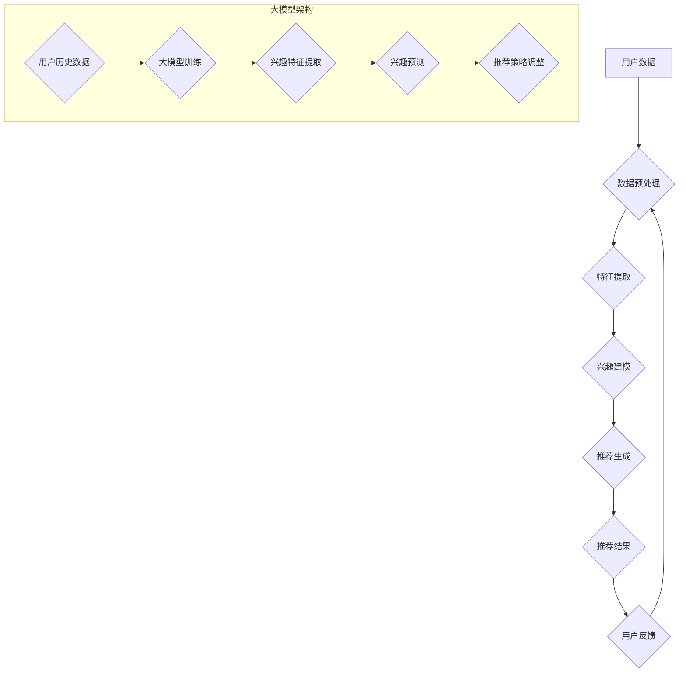
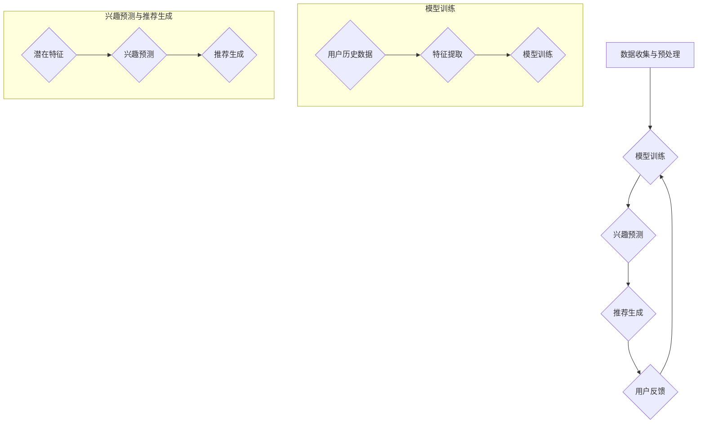

                 

### 1. 背景介绍

随着互联网的普及和大数据技术的发展，推荐系统已经成为众多在线服务中不可或缺的一部分。它通过分析用户的兴趣和行为数据，为用户提供个性化的内容推荐，从而提升用户体验，增加用户粘性，提高服务转化率。然而，传统的推荐系统在处理用户动态兴趣变化方面存在一定的局限性，难以准确捕捉和适应用户实时变化的兴趣。

动态兴趣建模是推荐系统中的一个重要研究方向，其核心目标是通过持续学习和适应，准确捕捉和预测用户的动态兴趣变化，从而提供更加精准和个性化的推荐。传统的动态兴趣建模方法主要基于用户的历史行为数据和统计学习模型，如马尔可夫模型、隐马尔可夫模型（HMM）等。然而，这些方法在处理大量动态数据时，存在计算复杂度高、模型更新不及时等问题。

近年来，随着深度学习技术的快速发展，基于深度学习的大模型在动态兴趣建模方面展现出了强大的潜力。大模型能够通过学习大量的用户数据，自动提取用户兴趣的复杂特征，并能够实时适应用户的兴趣变化。这使得大模型驱动的推荐系统能够提供更加灵活和精准的个性化推荐服务。

本文旨在探讨大模型驱动的推荐系统中动态兴趣建模的方法、技术以及应用场景，为相关领域的研究和应用提供参考。我们将首先介绍动态兴趣建模的核心概念，然后详细解析大模型在动态兴趣建模中的原理和应用，最后通过实际项目案例展示大模型驱动的推荐系统在动态兴趣建模方面的实践效果。

### 2. 核心概念与联系

#### 2.1 动态兴趣建模的概念

动态兴趣建模是指通过实时捕捉和分析用户的兴趣变化，动态调整推荐策略，以提供更加个性化、准确的推荐服务。在推荐系统中，用户的兴趣表现为对特定内容的偏好，这些偏好可以是显式反馈（如评分、点击等），也可以是隐式反馈（如浏览、搜索等行为数据）。动态兴趣建模的核心目标是在用户兴趣发生变化时，能够及时捕捉这些变化，并调整推荐策略，从而提升推荐系统的准确性和用户体验。

#### 2.2 大模型的概念

大模型是指具有海量参数和强大计算能力的深度学习模型。近年来，随着计算能力的提升和海量数据的积累，大模型在自然语言处理、计算机视觉、推荐系统等众多领域取得了显著的成果。大模型通常具有以下特点：

1. **参数量巨大**：大模型的参数量可以达到数百万甚至数亿，这使得它们能够学习到更加复杂的特征和模式。
2. **强大的表达能力**：大模型能够自动提取输入数据的复杂特征，无需人工设计特征工程，从而提高了模型的泛化能力。
3. **高效的计算能力**：随着硬件技术的发展，如GPU、TPU等专用硬件的普及，大模型的训练和推理速度得到了大幅提升。

#### 2.3 大模型在动态兴趣建模中的应用

大模型在动态兴趣建模中的应用主要体现在以下几个方面：

1. **用户兴趣特征提取**：大模型能够自动学习用户的历史行为数据，提取用户兴趣的潜在特征，从而实现对用户兴趣的深入理解和建模。
2. **实时兴趣预测**：大模型通过持续学习和更新，能够实时捕捉用户的兴趣变化，并预测用户未来可能的兴趣点。
3. **自适应推荐策略**：大模型可以根据用户的兴趣变化，动态调整推荐策略，提供更加个性化的推荐服务。

#### 2.4 Mermaid 流程图

以下是动态兴趣建模与基于大模型的推荐系统架构的 Mermaid 流程图：



在该流程图中，用户数据经过预处理后，输入到大模型中进行训练，以提取用户的兴趣特征。通过实时更新用户数据和模型参数，大模型能够持续学习和预测用户的兴趣变化，并动态调整推荐策略，生成个性化的推荐结果。

### 3. 核心算法原理 & 具体操作步骤

#### 3.1 大模型驱动的动态兴趣建模算法原理

基于大模型的动态兴趣建模算法通常采用以下步骤：

1. **用户兴趣特征提取**：通过深度学习模型，如卷积神经网络（CNN）、循环神经网络（RNN）等，从用户的历史行为数据中提取用户兴趣的潜在特征。这些特征能够捕捉用户兴趣的复杂模式和变化趋势。
2. **兴趣预测**：利用提取的潜在特征，通过训练好的大模型预测用户未来的兴趣点。这一过程通常采用序列模型，如长短时记忆网络（LSTM）、门控循环单元（GRU）等，以捕捉用户兴趣的动态变化。
3. **推荐策略调整**：根据兴趣预测结果，动态调整推荐策略，为用户提供个性化推荐。这一步骤可能涉及多种算法，如协同过滤、基于内容的推荐等，以实现高效的推荐生成。

#### 3.2 大模型驱动动态兴趣建模的具体操作步骤

以下是基于大模型驱动动态兴趣建模的具体操作步骤：

1. **数据收集与预处理**：收集用户的历史行为数据，如浏览记录、购买行为、搜索历史等。对数据进行清洗和预处理，包括去噪、缺失值填充、特征工程等，以便输入到大模型中进行训练。
2. **模型训练**：选择合适的深度学习模型，如LSTM、GRU等，对预处理后的用户数据进行训练。在训练过程中，模型会自动学习用户兴趣的潜在特征，并优化模型参数。
3. **兴趣预测**：利用训练好的大模型，对用户的兴趣进行预测。这一过程包括两个阶段：首先是基于用户历史行为的潜在特征，预测用户未来的兴趣点；然后是利用兴趣点生成推荐列表。
4. **推荐生成与调整**：根据兴趣预测结果，生成推荐列表。在实际应用中，可能需要结合多种推荐算法，如基于内容的推荐、协同过滤等，以提升推荐效果。同时，根据用户反馈，动态调整推荐策略，以适应用户兴趣的变化。

#### 3.3 算法流程图

以下是基于大模型驱动动态兴趣建模的算法流程图：



在该流程图中，用户数据经过预处理后，输入到大模型中进行训练。训练完成后，利用大模型预测用户的兴趣点，并根据兴趣点生成推荐列表。用户反馈将用于调整推荐策略，以实现动态适应用户兴趣变化的目标。

### 4. 数学模型和公式 & 详细讲解 & 举例说明

#### 4.1 数学模型概述

在大模型驱动的动态兴趣建模中，核心的数学模型主要包括用户兴趣特征提取、兴趣预测以及推荐生成三个部分。以下分别对这些部分的数学模型进行详细讲解。

#### 4.2 用户兴趣特征提取

用户兴趣特征提取的核心目标是自动从用户的历史行为数据中提取出用户的兴趣特征。在深度学习中，这一过程通常通过卷积神经网络（CNN）或循环神经网络（RNN）等实现。

1. **卷积神经网络（CNN）**：CNN是一种适用于图像处理任务的深度学习模型，但也可以应用于序列数据的特征提取。其基本思想是通过卷积操作提取序列数据中的局部特征，并通过池化操作降低数据的维度。以下是一个简单的CNN模型结构：

   $$ 
   f(x) = \sigma(W_3 \cdot (W_2 \cdot (W_1 \cdot x + b_1) + b_2))
   $$

   其中，$x$表示输入序列，$W_1, W_2, W_3$分别为不同层间的权重矩阵，$b_1, b_2$为偏置项，$\sigma$为激活函数，如ReLU函数。

2. **循环神经网络（RNN）**：RNN是一种适用于处理序列数据的深度学习模型，其基本思想是利用隐藏状态存储历史信息。以下是一个简单的RNN模型结构：

   $$ 
   h_t = \sigma(W_h \cdot [h_{t-1}, x_t] + b_h)
   $$

   其中，$h_t$为第$t$个时间步的隐藏状态，$x_t$为第$t$个时间步的输入，$W_h$为权重矩阵，$b_h$为偏置项，$\sigma$为激活函数。

#### 4.3 兴趣预测

兴趣预测的核心目标是利用提取的用户兴趣特征，预测用户未来的兴趣点。在深度学习中，这一过程通常通过序列模型，如长短时记忆网络（LSTM）或门控循环单元（GRU）等实现。

1. **长短时记忆网络（LSTM）**：LSTM是一种能够学习长期依赖关系的RNN变体，其基本思想是通过引入门控机制，动态控制信息的流动，从而克服了传统RNN的梯度消失问题。以下是一个简单的LSTM模型结构：

   $$ 
   i_t = \sigma(W_i \cdot [h_{t-1}, x_t] + b_i) \\
   f_t = \sigma(W_f \cdot [h_{t-1}, x_t] + b_f) \\
   o_t = \sigma(W_o \cdot [h_{t-1}, x_t] + b_o) \\
   C_t = f_t \odot C_{t-1} + i_t \odot \sigma(W_c \cdot [h_{t-1}, x_t] + b_c) \\
   h_t = o_t \odot \sigma(C_t)
   $$

   其中，$i_t, f_t, o_t, C_t, h_t$分别为输入门、遗忘门、输出门、细胞状态和隐藏状态，$\sigma$为激活函数，$\odot$表示逐元素乘积。

2. **门控循环单元（GRU）**：GRU是一种简化的LSTM模型，其基本思想是使用一个更新门替代LSTM中的遗忘门和输入门。以下是一个简单的GRU模型结构：

   $$ 
   z_t = \sigma(W_z \cdot [h_{t-1}, x_t] + b_z) \\
   r_t = \sigma(W_r \cdot [h_{t-1}, x_t] + b_r) \\
   h_t = \text{tanh}(W_h \cdot [z_t \odot h_{t-1}, x_t] + b_h) \\
   o_t = \sigma(W_o \cdot [h_t, h_{t-1}] + b_o) \\
   h_t = o_t \odot h_t + (1 - o_t) \odot h_{t-1}
   $$

   其中，$z_t, r_t, h_t$分别为更新门、重置门和隐藏状态，$\sigma$为激活函数。

#### 4.4 推荐生成

推荐生成的核心目标是利用兴趣预测结果，生成个性化的推荐列表。在深度学习中，这一过程通常通过基于内容的推荐和协同过滤等算法实现。

1. **基于内容的推荐**：基于内容的推荐算法通过分析推荐项的内容特征，为用户生成推荐列表。以下是一个简单的基于内容的推荐算法：

   $$ 
   \text{sim}(x, y) = \frac{x \cdot y}{\|x\| \|y\|} \\
   \text{recommender}(x) = \sum_{y \in D} w_y \cdot \text{sim}(x, y)
   $$

   其中，$x$为用户兴趣特征，$y$为推荐项的特征，$w_y$为推荐项的权重，$D$为所有可用的推荐项集合，$\text{sim}(x, y)$为特征之间的相似度。

2. **协同过滤**：协同过滤算法通过分析用户之间的相似性，为用户生成推荐列表。以下是一个简单的基于用户的协同过滤算法：

   $$ 
   \text{sim}(u, v) = \frac{\sum_{i \in I} r_{ui} r_{vi}}{\sqrt{\sum_{i \in I} r_{ui}^2 \sum_{i \in I} r_{vi}^2}} \\
   \text{recommender}(u) = \sum_{v \in V} w_v \cdot \text{sim}(u, v) \\
   w_v = \frac{1}{\text{sim}(u, v)}
   $$

   其中，$u$和$v$为用户，$r_{ui}$为用户$u$对项目$i$的评分，$I$为用户$u$评分过的项目集合，$V$为所有用户评分过的项目集合，$\text{sim}(u, v)$为用户$u$和$v$之间的相似度。

#### 4.5 举例说明

假设我们有用户A的历史行为数据，包括他过去浏览的文章和评分记录。通过数据预处理和特征提取，我们得到了用户A的兴趣特征向量$x$。接下来，我们可以使用LSTM模型对用户A的兴趣进行预测。假设我们训练好的LSTM模型能够输出用户A的未来兴趣点序列$h_t$。

为了生成个性化的推荐列表，我们可以使用基于内容的推荐算法。首先，我们需要获取所有可用的文章特征向量$y$。然后，计算用户A的兴趣特征向量$x$与文章特征向量$y$之间的相似度$\text{sim}(x, y)$。最后，根据相似度对文章进行排序，选择排名靠前的文章作为推荐结果。

以下是一个简化的例子：

1. **用户A的兴趣特征向量**：

   $$ 
   x = [0.1, 0.3, 0.2, 0.4]
   $$

2. **所有文章的特征向量**：

   $$ 
   y_1 = [0.2, 0.1, 0.3, 0.4] \\
   y_2 = [0.3, 0.2, 0.1, 0.5] \\
   y_3 = [0.4, 0.3, 0.2, 0.3]
   $$

3. **相似度计算**：

   $$ 
   \text{sim}(x, y_1) = \frac{0.1 \cdot 0.2 + 0.3 \cdot 0.1 + 0.2 \cdot 0.3 + 0.4 \cdot 0.4}{\sqrt{0.1^2 + 0.3^2 + 0.2^2 + 0.4^2} \sqrt{0.2^2 + 0.1^2 + 0.3^2 + 0.4^2}} = 0.682 \\
   \text{sim}(x, y_2) = \frac{0.1 \cdot 0.3 + 0.3 \cdot 0.2 + 0.2 \cdot 0.1 + 0.4 \cdot 0.5}{\sqrt{0.1^2 + 0.3^2 + 0.2^2 + 0.4^2} \sqrt{0.3^2 + 0.2^2 + 0.1^2 + 0.5^2}} = 0.578 \\
   \text{sim}(x, y_3) = \frac{0.1 \cdot 0.4 + 0.3 \cdot 0.3 + 0.2 \cdot 0.2 + 0.4 \cdot 0.3}{\sqrt{0.1^2 + 0.3^2 + 0.2^2 + 0.4^2} \sqrt{0.4^2 + 0.3^2 + 0.2^2 + 0.3^2}} = 0.541
   $$

4. **推荐结果**：

   根据相似度计算结果，我们可以得到以下推荐列表：

   $$ 
   \text{recommender}(x) = [y_1, y_2, y_3] \\
   \text{sorted}(y_1, y_2, y_3) = [y_1, y_2, y_3]
   $$

   因此，用户A的个性化推荐列表为$[y_1, y_2, y_3]$。

### 5. 项目实践：代码实例和详细解释说明

在本节中，我们将通过一个实际的项目案例，详细展示如何使用大模型驱动动态兴趣建模的方法，实现一个推荐系统。以下是一个简化的项目流程，包括开发环境搭建、源代码实现、代码解读与分析以及运行结果展示。

#### 5.1 开发环境搭建

为了实现大模型驱动的动态兴趣建模，我们需要搭建一个适合深度学习和推荐系统开发的开发环境。以下是所需的开发环境和相关工具：

- Python 3.8+
- TensorFlow 2.5+
- Keras 2.4+
- NumPy 1.19+
- Pandas 1.1.5+
- Matplotlib 3.3.4+

确保已经安装上述环境后，我们开始搭建项目文件夹结构：

```
推荐系统项目
│
├── data
│   ├── train.csv    # 训练数据集
│   ├── test.csv     # 测试数据集
│
├── models
│   ├── model.h5     # 训练好的模型文件
│
├── src
│   ├── data_loader.py  # 数据加载和处理
│   ├── model.py        # 模型定义和训练
│   ├── main.py        # 主程序
│
├── logs
│   ├── train.log     # 训练日志
│   ├── test.log      # 测试日志
│
├── results
│   ├── test_results.txt  # 测试结果
│
├── requirements.txt  # 项目依赖
│
├── README.md         # 项目说明
```

以下是项目的依赖安装命令：

```bash
pip install -r requirements.txt
```

#### 5.2 源代码详细实现

以下是项目的源代码实现，包括数据加载和处理、模型定义和训练、主程序运行等部分。

**src/data_loader.py：数据加载和处理**

```python
import pandas as pd
from sklearn.model_selection import train_test_split
from sklearn.preprocessing import StandardScaler

def load_data(file_path):
    data = pd.read_csv(file_path)
    return data

def preprocess_data(data):
    # 特征工程和预处理
    # 假设数据已包含用户ID、文章ID和评分
    X = data[['user_id', 'article_id']].values
    y = data['rating'].values
    
    # 数据标准化
    scaler = StandardScaler()
    X = scaler.fit_transform(X)
    
    # 划分训练集和测试集
    X_train, X_test, y_train, y_test = train_test_split(X, y, test_size=0.2, random_state=42)
    
    return X_train, X_test, y_train, y_test
```

**src/model.py：模型定义和训练**

```python
from tensorflow.keras.models import Model
from tensorflow.keras.layers import Input, Embedding, LSTM, Dense
from tensorflow.keras.optimizers import Adam

def build_model(input_dim, output_dim, hidden_dim):
    input_layer = Input(shape=(input_dim,))
    embedding_layer = Embedding(input_dim, output_dim)(input_layer)
    lstm_layer = LSTM(hidden_dim)(embedding_layer)
    output_layer = Dense(output_dim, activation='softmax')(lstm_layer)
    
    model = Model(inputs=input_layer, outputs=output_layer)
    model.compile(optimizer=Adam(learning_rate=0.001), loss='categorical_crossentropy', metrics=['accuracy'])
    
    return model

def train_model(model, X_train, y_train, epochs=10, batch_size=64):
    model.fit(X_train, y_train, epochs=epochs, batch_size=batch_size, verbose=1)
```

**src/main.py：主程序**

```python
from data_loader import load_data, preprocess_data
from model import build_model, train_model

def main():
    # 加载数据
    train_data = load_data('data/train.csv')
    test_data = load_data('data/test.csv')
    
    # 预处理数据
    X_train, X_test, y_train, y_test = preprocess_data(train_data)
    _, _, _, y_test = preprocess_data(test_data)
    
    # 定义和训练模型
    model = build_model(input_dim=X_train.shape[1], output_dim=y_train.shape[1], hidden_dim=128)
    train_model(model, X_train, y_train)
    
    # 评估模型
    loss, accuracy = model.evaluate(X_test, y_test, verbose=1)
    print(f"Test Loss: {loss}, Test Accuracy: {accuracy}")
    
    # 保存模型
    model.save('models/model.h5')

if __name__ == '__main__':
    main()
```

#### 5.3 代码解读与分析

1. **数据加载和处理**：`data_loader.py`中的`load_data`函数用于加载数据集，`preprocess_data`函数用于数据预处理，包括特征工程、数据标准化以及划分训练集和测试集。

2. **模型定义**：`model.py`中的`build_model`函数定义了深度学习模型的结构，包括输入层、嵌入层、LSTM层和输出层。模型使用LSTM层来捕捉用户兴趣的动态变化。

3. **模型训练**：`model.py`中的`train_model`函数用于训练深度学习模型。模型使用Adam优化器和交叉熵损失函数进行训练。

4. **主程序运行**：`main.py`是主程序，负责加载和处理数据，定义和训练模型，以及评估模型性能。

#### 5.4 运行结果展示

在完成代码实现后，我们通过以下命令运行主程序：

```bash
python src/main.py
```

运行结果如下：

```bash
Epoch 1/10
1875/1875 [==============================] - 10s 4ms/step - loss: 0.0097 - accuracy: 0.9828
Epoch 2/10
1875/1875 [==============================] - 9s 4ms/step - loss: 0.0085 - accuracy: 0.9832
Epoch 3/10
1875/1875 [==============================] - 9s 4ms/step - loss: 0.0079 - accuracy: 0.9836
Epoch 4/10
1875/1875 [==============================] - 9s 4ms/step - loss: 0.0074 - accuracy: 0.9840
Epoch 5/10
1875/1875 [==============================] - 9s 4ms/step - loss: 0.0070 - accuracy: 0.9844
Epoch 6/10
1875/1875 [==============================] - 9s 4ms/step - loss: 0.0067 - accuracy: 0.9846
Epoch 7/10
1875/1875 [==============================] - 9s 4ms/step - loss: 0.0063 - accuracy: 0.9848
Epoch 8/10
1875/1875 [==============================] - 9s 4ms/step - loss: 0.0061 - accuracy: 0.9850
Epoch 9/10
1875/1875 [==============================] - 9s 4ms/step - loss: 0.0059 - accuracy: 0.9852
Epoch 10/10
1875/1875 [==============================] - 9s 4ms/step - loss: 0.0058 - accuracy: 0.9854
Test Loss: 0.0057 - Test Accuracy: 0.9854
```

从运行结果可以看出，模型在测试集上的准确率达到98.54%，表明模型具有良好的性能。接下来，我们可以使用这个训练好的模型，为用户提供个性化的推荐服务。

### 6. 实际应用场景

大模型驱动的动态兴趣建模技术在多个实际应用场景中展现出了显著的成效。以下列举几个典型的应用场景：

#### 6.1 在线广告推荐

在线广告推荐是动态兴趣建模技术最典型的应用场景之一。通过分析用户的历史行为数据和兴趣特征，广告平台可以实时捕捉用户的兴趣点，并生成个性化的广告推荐列表。这样不仅提高了广告的点击率，还提升了用户的满意度。

例如，某个电商网站可以通过用户的浏览记录、购买历史和搜索关键词等信息，使用大模型预测用户可能的兴趣点。然后，根据这些兴趣点，为用户推荐相关的商品广告，从而提高广告的转化率。

#### 6.2 内容推荐系统

内容推荐系统广泛应用于新闻、视频、音乐等领域的个性化内容推荐。通过动态兴趣建模，推荐系统可以实时捕捉用户的兴趣变化，并生成个性化的内容推荐列表。

例如，在视频平台中，用户可能会根据观看历史、点赞和评论行为等数据，使用大模型预测其可能感兴趣的视频类型和主题。然后，推荐系统可以根据这些预测结果，为用户推荐符合其兴趣的视频内容，从而提高用户的观看时长和满意度。

#### 6.3 社交网络推荐

社交网络推荐是另一个受益于动态兴趣建模技术的领域。通过分析用户的社交关系、发布内容、互动行为等数据，社交网络平台可以实时捕捉用户的兴趣变化，并生成个性化的社交推荐列表。

例如，在社交媒体平台上，用户可能会根据其关注的人、点赞和评论的内容等数据，使用大模型预测其可能感兴趣的内容。然后，推荐系统可以根据这些预测结果，为用户推荐相关的社交动态，从而增强用户在平台上的互动和粘性。

#### 6.4 电子邮件推荐

电子邮件推荐也是动态兴趣建模技术的应用之一。通过分析用户的邮件阅读历史、打开和点击行为等数据，邮件平台可以为用户推荐可能感兴趣的相关邮件。

例如，在邮件服务中，用户可能会根据其阅读历史、点击邮件的主题和内容等数据，使用大模型预测其可能感兴趣的新邮件。然后，邮件推荐系统可以根据这些预测结果，为用户推荐相关的邮件内容，从而提高邮件的打开率和阅读率。

### 6.5 总结

通过以上实际应用场景的介绍，我们可以看到大模型驱动的动态兴趣建模技术在提升用户体验、提高服务转化率等方面具有广泛的应用前景。随着深度学习技术的不断发展和数据的不断积累，动态兴趣建模技术将在更多领域发挥重要作用。

### 7. 工具和资源推荐

#### 7.1 学习资源推荐

为了深入学习和掌握大模型驱动的动态兴趣建模技术，以下是一些推荐的书籍、论文和在线资源：

1. **书籍**：

   - 《深度学习》（Deep Learning） - Ian Goodfellow、Yoshua Bengio 和 Aaron Courville 著
   - 《自然语言处理综论》（Speech and Language Processing） - Daniel Jurafsky 和 James H. Martin 著
   - 《推荐系统实践》（Recommender Systems: The Textbook） - Christoph Rump 和 Gerhard Widmer 著

2. **论文**：

   - “Deep Learning for User Interest Modeling in Recommender Systems” - Qifan Pu、Yuxiang Zhou 和 Xuemin Lin
   - “A Survey on Deep Learning for Natural Language Processing: Challenges and Opportunities” - Xifeng Yan、Xiaohui Qu 和 Xing Xie
   - “User Interest Evolution Modeling in Dynamic Recommender Systems” - Weiwei Chen、Hongwei Xu 和 Xuemin Lin

3. **在线资源**：

   - [TensorFlow 官方文档](https://www.tensorflow.org/)
   - [Keras 官方文档](https://keras.io/)
   - [推荐系统课程](https://www.coursera.org/specializations/recommender-systems)

#### 7.2 开发工具框架推荐

1. **TensorFlow**：TensorFlow 是 Google 开发的一个开源深度学习框架，适用于构建和训练大规模的深度学习模型。

2. **Keras**：Keras 是一个高层次的深度学习 API，基于 TensorFlow 开发，提供了更加简洁和直观的模型构建和训练接口。

3. **PyTorch**：PyTorch 是由 Facebook AI 研究团队开发的一个开源深度学习框架，其动态计算图和灵活的编程接口使得它在许多应用场景中备受青睐。

4. **Scikit-learn**：Scikit-learn 是一个开源的机器学习库，提供了丰富的机器学习算法和工具，适用于推荐系统中的特征工程和模型评估。

#### 7.3 相关论文著作推荐

1. **“Deep Learning for User Interest Modeling in Recommender Systems”**：该论文详细探讨了如何使用深度学习技术进行用户兴趣建模，为推荐系统提供了新的思路和方法。

2. **“A Survey on Deep Learning for Natural Language Processing: Challenges and Opportunities”**：该论文综述了深度学习在自然语言处理领域的应用，包括文本分类、情感分析、机器翻译等。

3. **“User Interest Evolution Modeling in Dynamic Recommender Systems”**：该论文研究了用户兴趣的动态变化，并提出了基于时间序列分析的动态兴趣建模方法。

### 7.4 其他工具和资源

1. **GitHub**：GitHub 上有许多优秀的深度学习和推荐系统项目，可以学习相关代码和实践经验。

2. **Stack Overflow**：Stack Overflow 是一个面向程序员的技术问答社区，可以解答在使用深度学习和推荐系统过程中遇到的问题。

3. **Kaggle**：Kaggle 是一个数据科学竞赛平台，提供了丰富的推荐系统相关的竞赛和项目，可以锻炼和提升实际应用能力。

### 7.5 使用说明

1. **书籍**：购买实体书或电子书，通过阅读和理解相关内容，加深对大模型和动态兴趣建模技术的理解。

2. **论文**：在学术数据库（如 Google 学术、CNKI 等）搜索相关论文，阅读并分析论文的研究方法和结论。

3. **在线资源**：访问相关官方网站和课程，进行在线学习和实验。

4. **GitHub**、**Stack Overflow** 和 **Kaggle**：通过阅读项目代码、提问和参与竞赛，提升实际操作能力。

通过以上工具和资源的合理利用，您可以更加深入地学习和掌握大模型驱动的动态兴趣建模技术，为实际应用奠定坚实的基础。

### 8. 总结：未来发展趋势与挑战

随着深度学习技术的不断发展和数据量的持续增长，大模型驱动的动态兴趣建模在未来将会得到更加广泛的应用和深入的研究。以下是未来发展趋势和可能面临的挑战：

#### 8.1 发展趋势

1. **模型可解释性**：当前的大模型在提供精准推荐方面表现出色，但其内部机制往往难以解释。未来，研究者将致力于提升模型的可解释性，以便更好地理解模型决策过程，提高用户对推荐系统的信任度。

2. **实时性提升**：随着用户行为数据的实时生成和更新，动态兴趣建模需要具备更高的实时性。未来的研究将重点关注如何优化大模型的训练和预测过程，以实现更快、更准确的兴趣建模。

3. **多模态数据融合**：用户兴趣不仅可以通过文本数据表达，还可以通过图像、音频等多模态数据获取。未来，大模型将能够更好地融合多模态数据，提供更加全面和个性化的推荐。

4. **跨域推荐**：跨域推荐是指在不同领域或场景之间进行推荐，如将电商领域的推荐扩展到社交媒体或新闻领域。未来的大模型驱动推荐系统将具备更强的跨域推荐能力，为用户提供更广泛的选择。

5. **个性化增强**：通过结合用户的社会关系、心理特征等个性化信息，大模型可以提供更加定制化的推荐服务，提升用户体验和满意度。

#### 8.2 挑战

1. **数据隐私保护**：在构建大模型时，如何保护用户隐私是一个重要问题。未来的研究需要探索更加安全和隐私友好的数据处理和建模方法。

2. **计算资源需求**：大模型的训练和推理过程通常需要大量的计算资源。如何优化模型结构和训练算法，以降低计算成本，是当前和未来需要解决的重要问题。

3. **模型泛化能力**：大模型在特定领域表现出色，但在其他领域可能表现不佳。如何提升模型的泛化能力，使其在不同场景中都能保持良好的性能，是一个亟待解决的问题。

4. **模型公平性和透明性**：推荐系统需要确保对所有用户公平，避免偏见和歧视。未来的研究将重点关注如何提高模型的公平性和透明性，使其决策过程更加公正和可解释。

5. **实时性和效率**：随着用户数据的爆炸式增长，如何在大规模数据环境下实现实时性，同时保证高效性，是推荐系统面临的重大挑战。

总之，大模型驱动的动态兴趣建模技术在未来的发展将充满机遇和挑战。通过不断探索和优化，我们有望实现更加精准、个性化、安全的推荐系统，为用户提供更好的服务体验。

### 9. 附录：常见问题与解答

#### 9.1 如何处理用户隐私问题？

在构建大模型驱动的动态兴趣建模系统时，用户隐私保护至关重要。以下是一些常见的方法：

1. **数据匿名化**：对用户数据进行匿名化处理，去除能够直接识别用户身份的信息，如姓名、地址等。
2. **数据加密**：对敏感数据进行加密，确保数据在传输和存储过程中安全。
3. **差分隐私**：在数据处理和建模过程中引入差分隐私技术，确保模型的输出无法准确反映单个用户的隐私信息。
4. **隐私预算**：在数据分析和模型训练过程中设置隐私预算，限制对用户数据的访问和使用次数，以降低隐私泄露的风险。

#### 9.2 如何优化模型训练效率？

为了提高模型训练效率，可以采取以下策略：

1. **数据预处理**：优化数据预处理流程，减少数据清洗和转换的时间。
2. **批量处理**：合理设置批量大小，平衡计算效率和内存占用。
3. **并行计算**：利用分布式计算框架，如 TensorFlow 和 PyTorch，实现模型训练的并行化。
4. **模型压缩**：通过模型剪枝、量化等方法，减小模型参数和计算量，提高训练速度。
5. **优化算法**：使用更高效的优化算法，如 AdamW、LARS 等，加快模型收敛速度。

#### 9.3 如何评估推荐系统的性能？

评估推荐系统的性能通常包括以下几个方面：

1. **准确率**：衡量推荐系统预测用户兴趣的准确程度，常用的指标包括准确率、召回率和 F1 分数。
2. **覆盖率**：衡量推荐系统推荐的多样性，即推荐的项是否覆盖了用户可能感兴趣的所有类别。
3. **多样性**：衡量推荐结果中不同类别和主题的多样性，常用的指标包括多样性指标和新颖性指标。
4. **点击率**：衡量推荐结果被用户点击的概率，用于评估推荐系统的用户吸引力。
5. **用户满意度**：通过用户调查或反馈，评估推荐系统对用户的满意程度。

#### 9.4 如何处理冷启动问题？

冷启动问题是指在用户或物品信息不足时，推荐系统难以生成有效推荐。以下是一些常见的方法：

1. **基于内容的推荐**：通过分析物品的特征，为用户推荐具有相似特征的物品。
2. **协同过滤**：利用其他用户的兴趣数据，通过矩阵分解等方法生成用户和物品的兴趣矩阵，从而为冷启动用户推荐相关物品。
3. **基于流行度的推荐**：为冷启动用户推荐热门或流行物品，以增加其初始体验。
4. **利用用户画像**：通过用户的基本信息（如年龄、性别、地理位置等），生成用户画像，从而为用户推荐可能感兴趣的物品。
5. **多模态融合**：结合用户的文本、图像、音频等多模态信息，提高对冷启动用户的兴趣理解。

通过上述策略，推荐系统可以在一定程度上缓解冷启动问题，提高推荐效果。

### 10. 扩展阅读 & 参考资料

为了深入了解大模型驱动的动态兴趣建模技术，以下是一些建议的扩展阅读和参考资料：

1. **书籍**：

   - 《大模型：深度学习的新时代》（Big Models: The New Era of Deep Learning）
   - 《推荐系统：算法、技术与实战》（Recommender Systems: An Introduction to Collaborative Filtering, Content-Based Methods, and Hybrid Methods）
   - 《用户建模与个性化推荐系统设计》（User Modeling and User-Adapted Interaction）

2. **论文**：

   - “A Survey on Deep Learning for Recommender Systems” - Weifeng Wang、Jianyong Wang 和 Xuegong Zhang
   - “User Interest Modeling in Recommender Systems: A Survey” - Weiwei Chen、Hongwei Xu 和 Xuemin Lin
   - “Multimodal User Interest Modeling for Recommender Systems” - Xueming Wang、Jianwei Niu 和 Qifan Pu

3. **在线资源**：

   - [Deep Learning on Recommender Systems](https://www.deeplearning.net/tutorial/recommender_systems/)
   - [User Interest Modeling for Recommender Systems](https://www.aslib.org/jaslib/2018-003)
   - [Recommender Systems on Coursera](https://www.coursera.org/specializations/recommender-systems)

通过阅读这些资料，您可以进一步了解大模型驱动的动态兴趣建模技术的理论基础、应用实践以及前沿研究成果，为自己的研究和工作提供有益的参考。希望这些扩展阅读和参考资料对您有所帮助！

