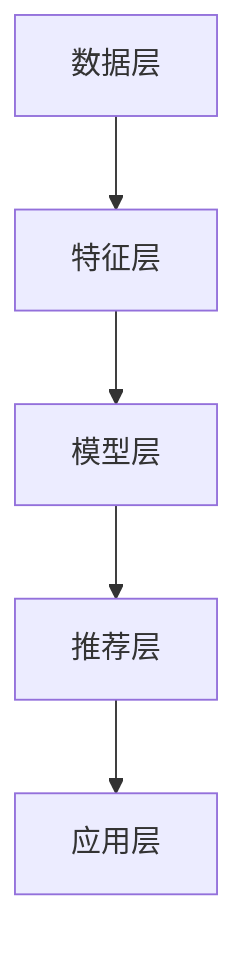

                 

### 背景介绍

#### 1.1 电商平台的兴起与个性化推荐的必要性

随着互联网的飞速发展，电子商务在全球范围内取得了空前的成功。各大电商平台如雨后春笋般涌现，用户群体不断扩大。与此同时，市场竞争也变得日益激烈。如何在众多竞争者中脱颖而出，吸引并留住消费者，成为电商平台面临的重要挑战。

个性化推荐作为一种有效的解决方案，逐渐被电商平台所重视。个性化推荐系统通过分析用户的行为和偏好，为其提供个性化的商品推荐，从而提高用户的购物体验和满意度。这种推荐方式不仅能够帮助用户更快地找到自己感兴趣的商品，还可以为电商平台带来更多的销售机会。

个性化推荐系统的重要性主要体现在以下几个方面：

1. **提高用户满意度**：个性化推荐系统可以更好地满足用户的需求，提高用户的购物体验。用户在浏览商品时，能够更快地找到自己感兴趣的商品，减少浏览时间和选择成本，从而提高满意度。

2. **增加销售转化率**：个性化推荐系统能够为用户推荐他们可能感兴趣的商品，从而提高购买的可能性。通过提高用户点击率和购买转化率，电商平台可以增加销售额。

3. **提升用户留存率**：个性化推荐系统能够更好地了解用户的行为和偏好，为用户提供个性化的服务和体验。这有助于提高用户的忠诚度，增加用户在平台上的活跃度和留存率。

#### 1.2 大模型在个性化推荐中的应用

随着深度学习技术的不断发展，大模型在个性化推荐中的应用变得越来越普遍。大模型具有强大的特征提取和表示能力，能够更好地捕捉用户的行为和偏好，从而提高推荐系统的效果。

大模型在个性化推荐中的应用主要体现在以下几个方面：

1. **用户行为分析**：大模型可以通过分析用户的浏览历史、购买记录、搜索行为等数据，挖掘用户的行为特征和偏好。这些特征和偏好可以为推荐系统提供重要的参考信息。

2. **商品特征提取**：大模型可以学习到商品的潜在特征，如风格、材质、功能等。这些特征可以帮助推荐系统更好地理解商品的属性，从而为用户提供更准确的推荐。

3. **协同过滤算法优化**：大模型可以用于优化协同过滤算法。通过引入用户和商品的潜在特征，协同过滤算法可以更好地捕捉用户和商品之间的相关性，提高推荐的准确性和多样性。

4. **序列模型应用**：大模型可以用于构建序列模型，如循环神经网络（RNN）和长短时记忆网络（LSTM）。这些模型可以捕捉用户行为的时序信息，从而提高推荐的实时性和动态性。

#### 1.3 电商平台的现状与挑战

尽管个性化推荐在电商平台上取得了显著的成效，但同时也面临着一些挑战：

1. **数据隐私**：个性化推荐系统需要大量用户数据，这引发了对数据隐私的关注。如何保护用户隐私，同时实现有效的个性化推荐，成为电商平台需要解决的重要问题。

2. **算法透明度**：个性化推荐算法的透明度较低，用户往往不清楚推荐结果是如何产生的。如何提高算法的透明度，让用户理解推荐结果，是电商平台需要关注的问题。

3. **模型解释性**：大模型的复杂性和黑盒性质，使得推荐结果难以解释。如何提高模型的可解释性，帮助用户理解推荐结果，是电商平台需要解决的技术难题。

4. **实时性**：个性化推荐系统需要实时响应用户的行为和偏好，这对于系统的计算能力和数据处理速度提出了较高的要求。如何提高系统的实时性，以满足用户的需求，是电商平台需要考虑的问题。

### 1.4 本文的结构与目的

本文将围绕大模型驱动的智能个性化推荐系统进行探讨。文章将首先介绍大模型的核心概念和技术原理，然后详细阐述其在个性化推荐中的应用。接着，我们将通过一个具体案例，展示如何使用大模型实现个性化推荐系统。最后，我们将分析大模型在个性化推荐领域的未来发展趋势和挑战。

本文旨在为读者提供一个全面、深入的关于大模型驱动的智能个性化推荐系统的理解和认识，帮助读者掌握相关技术，并为其在电商平台等场景中的应用提供参考。

---

在接下来的章节中，我们将进一步探讨大模型的基本概念和原理，详细介绍其与个性化推荐之间的联系和相互作用，以及如何通过大模型实现高效的个性化推荐。通过逐步分析推理的方式，我们将帮助读者深入理解这一前沿技术，为实际应用奠定基础。

### 核心概念与联系

在深入探讨大模型驱动的智能个性化推荐系统之前，我们需要首先了解大模型的基本概念和技术原理，以及其与个性化推荐之间的联系。

#### 2.1 大模型的基本概念

大模型（Large Model）通常指的是具有数十亿甚至数万亿参数的深度学习模型。这些模型通过大量数据进行训练，能够从数据中自动提取复杂的特征和模式。大模型的出现，主要得益于计算能力的提升和大数据技术的进步。以下是一些常见的大模型：

1. **Transformer模型**：Transformer模型是自然语言处理领域的重要突破，其核心思想是自注意力机制。通过自注意力机制，模型可以自动关注输入序列中的重要部分，从而实现高效的序列建模。BERT、GPT等都是基于Transformer架构的大模型。

2. **变分自编码器（VAE）**：VAE是一种生成模型，通过学习数据的概率分布，能够生成新的数据样本。VAE在图像生成、风格迁移等方面有广泛应用。

3. **生成对抗网络（GAN）**：GAN由生成器和判别器组成，通过两个模型的对抗训练，生成器能够生成越来越真实的数据。GAN在图像生成、图像修复等方面取得了显著成果。

#### 2.2 个性化推荐的基本原理

个性化推荐（Personalized Recommendation）是基于用户的历史行为和偏好，为用户推荐其可能感兴趣的内容或商品。个性化推荐的基本原理包括以下几种：

1. **协同过滤（Collaborative Filtering）**：协同过滤是一种常见的推荐算法，通过分析用户之间的行为模式，为用户推荐其他用户喜欢的商品。协同过滤分为基于用户的协同过滤（User-Based）和基于项目的协同过滤（Item-Based）。

2. **内容推荐（Content-Based Recommendation）**：内容推荐基于用户的兴趣和偏好，为用户推荐与其兴趣相关的商品。通过分析商品的属性和特征，与用户的兴趣特征进行匹配，实现个性化推荐。

3. **混合推荐（Hybrid Recommendation）**：混合推荐结合了协同过滤和内容推荐的方法，通过融合不同推荐算法的优点，提高推荐的准确性和多样性。

#### 2.3 大模型与个性化推荐的联系

大模型与个性化推荐之间存在紧密的联系。大模型通过其强大的特征提取和表示能力，能够为个性化推荐提供有力的支持。以下是大模型在个性化推荐中的应用：

1. **用户行为特征提取**：大模型可以通过分析用户的历史行为数据，如浏览记录、购买记录等，提取出用户的行为特征。这些特征能够更好地反映用户的兴趣和偏好，为推荐系统提供重要的输入。

2. **商品特征提取**：大模型不仅可以提取用户的行为特征，还可以学习到商品的潜在特征。这些特征能够帮助推荐系统更好地理解商品的属性，从而提高推荐的准确性。

3. **优化协同过滤算法**：大模型可以用于优化协同过滤算法。通过引入用户和商品的潜在特征，协同过滤算法可以更好地捕捉用户和商品之间的相关性，提高推荐的准确性和多样性。

4. **序列模型应用**：大模型可以用于构建序列模型，如循环神经网络（RNN）和长短时记忆网络（LSTM）。这些模型可以捕捉用户行为的时序信息，从而提高推荐的实时性和动态性。

#### 2.4 个性化推荐系统架构

为了更好地理解大模型在个性化推荐中的应用，我们来看一个典型的个性化推荐系统架构：

1. **数据层**：数据层负责收集和处理用户行为数据、商品特征数据等。这些数据是构建推荐系统的基础。

2. **特征层**：特征层负责提取用户行为特征和商品特征。用户行为特征包括浏览记录、购买记录、搜索记录等；商品特征包括商品属性、价格、库存等。

3. **模型层**：模型层负责使用大模型训练推荐模型。这些模型可以包括协同过滤模型、内容推荐模型、混合推荐模型等。

4. **推荐层**：推荐层根据用户的行为特征和商品特征，为用户生成个性化推荐列表。

5. **应用层**：应用层负责将推荐结果呈现给用户，如网页推荐、APP推荐等。

#### 2.5 Mermaid 流程图

为了更直观地展示个性化推荐系统的架构，我们使用Mermaid语言绘制一个流程图：



在这个流程图中，数据层负责收集和处理原始数据；特征层负责提取用户行为特征和商品特征；模型层负责训练推荐模型；推荐层根据模型生成推荐列表；应用层负责将推荐结果呈现给用户。

通过这个流程图，我们可以清晰地看到大模型在个性化推荐系统中的作用和位置。大模型在特征层和模型层发挥了关键作用，通过其强大的特征提取和表示能力，为推荐系统提供了强大的技术支持。

---

在本章节中，我们详细介绍了大模型的基本概念和个性化推荐的基本原理，并探讨了它们之间的联系。接下来，我们将深入讨论大模型的核心算法原理，以及如何具体实现和操作这些算法，为读者提供全面的技术理解和应用指导。

### 核心算法原理 & 具体操作步骤

#### 3.1 大模型的核心算法

大模型的核心算法主要包括深度学习中的神经网络、自注意力机制、变分自编码器（VAE）和生成对抗网络（GAN）。这些算法在特征提取、模式识别和数据生成等方面具有强大的能力。以下我们将详细探讨这些算法的基本原理。

##### 3.1.1 神经网络

神经网络是深度学习的基础，它由多层节点（或称为神经元）组成，通过前向传播和反向传播算法，学习输入数据与输出数据之间的关系。一个典型的神经网络包括输入层、隐藏层和输出层。

- **输入层**：接收输入数据，将其传递到隐藏层。
- **隐藏层**：对输入数据进行处理，提取特征。隐藏层可以有多个，每层可以包含多个神经元。
- **输出层**：生成最终的输出结果。

神经网络通过反向传播算法，不断调整网络中的权重和偏置，使得输出结果逐渐逼近期望值。这个过程称为梯度下降。

##### 3.1.2 自注意力机制

自注意力机制（Self-Attention）是Transformer模型的核心组成部分。它允许模型在处理输入序列时，自动关注序列中的重要部分。自注意力机制通过计算每个词与序列中其他词的相似度，生成权重，从而对序列进行加权求和。

自注意力机制的主要步骤如下：

1. **计算相似度**：对于序列中的每个词，计算其与其他词的相似度。相似度通常通过点积计算。
2. **生成权重**：根据相似度计算每个词的权重。权重越高，表示该词对最终输出的影响越大。
3. **加权求和**：将每个词与其权重相乘，然后求和，得到最终的输出。

##### 3.1.3 变分自编码器（VAE）

变分自编码器是一种生成模型，通过学习数据的概率分布，能够生成新的数据样本。VAE由编码器和解码器组成，编码器将输入数据编码为一个潜在向量，解码器则将潜在向量解码为输出数据。

变分自编码器的主要步骤如下：

1. **编码**：编码器将输入数据映射到一个潜在空间中的潜在向量。
2. **重参数化**：将潜在向量通过一个随机变换，得到一个均值和一个标准差。
3. **采样**：从均值和标准差中采样一个向量，作为解码器的输入。
4. **解码**：解码器将采样得到的向量解码为输出数据。

##### 3.1.4 生成对抗网络（GAN）

生成对抗网络由生成器和判别器组成，通过两个模型的对抗训练，生成器能够生成越来越真实的数据。GAN的主要步骤如下：

1. **生成器**：生成器生成假数据，试图欺骗判别器。
2. **判别器**：判别器判断生成器生成的数据是真实数据还是假数据。
3. **对抗训练**：生成器和判别器相互对抗，生成器通过不断优化，提高生成数据的质量，判别器通过不断优化，提高区分真实数据和假数据的能力。

#### 3.2 大模型在个性化推荐中的应用

大模型在个性化推荐中的应用主要体现在以下几个方面：

1. **用户行为特征提取**：通过深度学习算法，如神经网络、自注意力机制等，从用户的历史行为数据中提取出用户的行为特征。这些特征包括用户的浏览历史、购买记录、搜索记录等。

2. **商品特征提取**：同样使用深度学习算法，对商品的特征进行提取。这些特征包括商品的价格、销量、品牌、分类等。

3. **协同过滤算法优化**：通过变分自编码器（VAE）或生成对抗网络（GAN）优化协同过滤算法。具体做法是将用户和商品的特征通过VAE或GAN进行编码，得到潜在空间中的用户和商品向量，然后计算用户和商品之间的相似度。

4. **序列模型应用**：使用循环神经网络（RNN）或长短时记忆网络（LSTM）构建序列模型，捕捉用户行为的时序信息。通过序列模型，可以更好地预测用户的兴趣和偏好。

#### 3.3 大模型的具体操作步骤

以下是使用大模型实现个性化推荐系统的具体操作步骤：

1. **数据收集与预处理**：收集用户行为数据、商品特征数据等。对数据进行清洗和预处理，包括缺失值处理、异常值处理、数据标准化等。

2. **特征提取**：使用深度学习算法提取用户行为特征和商品特征。可以采用神经网络、自注意力机制等方法。

3. **模型训练**：使用提取到的特征数据训练大模型。根据具体情况，可以选择神经网络、VAE、GAN等模型。

4. **模型评估**：使用交叉验证等方法评估模型性能。根据评估结果，调整模型参数，优化模型效果。

5. **模型部署**：将训练好的模型部署到线上环境，实现实时推荐。根据用户行为和偏好，生成个性化推荐列表。

6. **监控与优化**：对推荐系统进行实时监控，收集用户反馈和推荐效果数据。根据用户反馈，对模型进行优化和调整。

通过以上步骤，可以实现一个基于大模型的个性化推荐系统，为用户提供精准、高效的推荐服务。

---

在本章节中，我们详细介绍了大模型的核心算法原理，包括神经网络、自注意力机制、VAE和GAN等。接下来，我们将探讨数学模型和公式，通过具体的例子来说明这些模型如何工作，以及它们在实际应用中的表现。

### 数学模型和公式 & 详细讲解 & 举例说明

#### 4.1 神经网络模型

神经网络（Neural Networks）是深度学习中最基础的模型之一。其核心在于通过多层非线性变换，将输入映射到输出。下面，我们将介绍神经网络的基本数学模型和公式。

##### 4.1.1 前向传播

在神经网络中，前向传播是一个将输入通过网络的各个层，最终得到输出的过程。以下是前向传播的数学公式：

$$
Z^{(l)} = W^{(l)} \cdot A^{(l-1)} + b^{(l)}
$$

$$
A^{(l)} = \sigma(Z^{(l)})
$$

其中：

- \( Z^{(l)} \) 是第 \( l \) 层的线性组合。
- \( W^{(l)} \) 是第 \( l \) 层的权重。
- \( b^{(l)} \) 是第 \( l \) 层的偏置。
- \( A^{(l-1)} \) 是第 \( l-1 \) 层的输出。
- \( \sigma \) 是激活函数，常用的有 sigmoid、ReLU 等。

##### 4.1.2 反向传播

反向传播是用于训练神经网络的算法，其核心思想是通过计算损失函数的梯度，不断调整网络中的权重和偏置，从而优化模型。以下是反向传播的梯度计算公式：

$$
\frac{\partial L}{\partial W^{(l)}} = A^{(l-1)} \cdot \frac{\partial \sigma^{(l)}}{\partial Z^{(l)}} \cdot \frac{\partial Z^{(l)}}{\partial W^{(l)}}
$$

$$
\frac{\partial L}{\partial b^{(l)}} = A^{(l-1)} \cdot \frac{\partial \sigma^{(l)}}{\partial Z^{(l)}}
$$

其中：

- \( L \) 是损失函数。
- \( \frac{\partial L}{\partial W^{(l)}} \) 和 \( \frac{\partial L}{\partial b^{(l)}} \) 分别是权重和偏置的梯度。

##### 4.1.3 梯度下降

梯度下降是一种优化算法，其核心思想是通过梯度的方向，不断调整权重和偏置，使得损失函数最小化。以下是梯度下降的更新公式：

$$
W^{(l)} = W^{(l)} - \alpha \cdot \frac{\partial L}{\partial W^{(l)}}
$$

$$
b^{(l)} = b^{(l)} - \alpha \cdot \frac{\partial L}{\partial b^{(l)}}
$$

其中：

- \( \alpha \) 是学习率。

#### 4.2 自注意力机制

自注意力机制（Self-Attention）是Transformer模型的核心组件，其目的是通过计算输入序列中每个词与其他词的相似度，生成权重，从而加权求和。以下是自注意力机制的数学公式：

##### 4.2.1 相似度计算

$$
\text{Score}_{ij} = \text{Query}_i \cdot \text{Key}_j
$$

其中：

- \( \text{Score}_{ij} \) 是第 \( i \) 个词和第 \( j \) 个词的相似度。

##### 4.2.2 权重生成

$$
\text{Weight}_{ij} = \text{softmax}(\text{Score}_{ij})
$$

其中：

- \( \text{Weight}_{ij} \) 是第 \( i \) 个词和第 \( j \) 个词的权重。

##### 4.2.3 加权求和

$$
\text{Contextual\_Output}_i = \sum_j \text{Weight}_{ij} \cdot \text{Value}_j
$$

其中：

- \( \text{Contextual\_Output}_i \) 是第 \( i \) 个词的加权求和输出。

#### 4.3 变分自编码器（VAE）

变分自编码器（Variational Autoencoder，VAE）是一种生成模型，其目的是通过学习输入数据的概率分布，生成新的数据样本。以下是VAE的数学模型：

##### 4.3.1 编码器

$$
\mu = \sigma(\theta_1 \cdot x + b_1)
$$

$$
\log(\sigma) = \theta_2 \cdot x + b_2
$$

其中：

- \( \mu \) 和 \( \log(\sigma) \) 分别是潜在向量的均值和标准差。
- \( \theta_1, \theta_2, b_1, b_2 \) 是编码器的参数。

##### 4.3.2 解码器

$$
x' = \sigma(\theta_3 \cdot z + b_3)
$$

其中：

- \( x' \) 是解码器生成的数据。
- \( \theta_3, b_3 \) 是解码器的参数。

##### 4.3.3 重参数化

VAE通过重参数化技巧，将潜在向量的采样与参数化分布相结合：

$$
z = \mu + \sigma \cdot \epsilon
$$

其中：

- \( \epsilon \) 是标准正态分布的随机噪声。

#### 4.4 生成对抗网络（GAN）

生成对抗网络（Generative Adversarial Network，GAN）由生成器和判别器组成，通过两个模型的对抗训练，生成器试图生成逼真的数据，而判别器试图区分真实数据和生成数据。以下是GAN的数学模型：

##### 4.4.1 生成器

$$
x' = G(z)
$$

其中：

- \( x' \) 是生成器生成的数据。
- \( z \) 是生成器的输入。
- \( G \) 是生成器的映射函数。

##### 4.4.2 判别器

$$
D(x) = \sigma(\theta_D \cdot x + b_D)
$$

$$
D(x') = \sigma(\theta_D \cdot x' + b_D)
$$

其中：

- \( D(x) \) 和 \( D(x') \) 分别是判别器对真实数据和生成数据的判断。
- \( \theta_D, b_D \) 是判别器的参数。

##### 4.4.3 对抗训练

GAN通过以下目标函数进行对抗训练：

$$
\min_G \max_D V(D, G) = E_{x \sim p_{data}(x)} [D(x)] - E_{z \sim p_z(z)} [D(G(z))]
$$

其中：

- \( V(D, G) \) 是判别器和生成器的联合损失。
- \( p_{data}(x) \) 是真实数据分布。
- \( p_z(z) \) 是先验分布。

#### 4.5 具体例子

为了更直观地理解上述数学模型，我们来看一个简单的例子。

##### 4.5.1 神经网络分类问题

假设我们有如下数据集：

- 输入数据 \( x = [1, 2, 3, 4] \)
- 输出标签 \( y = 1 \)

我们可以使用一个简单的神经网络进行分类：

1. **初始化参数**：设 \( W_1 = [1, 1], b_1 = 1 \)，激活函数为 \( \sigma \)。
2. **前向传播**：计算 \( Z_1 = W_1 \cdot x + b_1 = 5 \)， \( A_1 = \sigma(Z_1) = 0.99 \)。
3. **计算损失**：设损失函数为 \( L = (y - A_1)^2 \)。
4. **反向传播**：计算 \( \frac{\partial L}{\partial Z_1} = -2(y - A_1) \)， \( \frac{\partial Z_1}{\partial W_1} = x \)， \( \frac{\partial Z_1}{\partial b_1} = 1 \)。
5. **更新参数**：\( W_1 = W_1 - \alpha \frac{\partial L}{\partial W_1} \)， \( b_1 = b_1 - \alpha \frac{\partial L}{\partial b_1} \)。

通过多次迭代，网络将逐渐调整参数，使得输出 \( A_1 \) 趋近于标签 \( y \)。

##### 4.5.2 自注意力机制

假设我们有一个简单的文本序列 \( \text{[猫，喜欢，鱼]} \)：

1. **计算相似度**：计算每个词与其他词的点积，例如 \( \text{猫} \) 和 \( \text{鱼} \) 的相似度为 \( 1 \cdot 1 + 1 \cdot 0 + 0 \cdot 0 = 1 \)。
2. **生成权重**：通过softmax函数计算权重，例如 \( \text{猫} \) 的权重为 \( \frac{e^1}{e^1 + e^0 + e^0} = 1 \)。
3. **加权求和**：根据权重对词进行加权求和，得到新的输出序列 \( \text{[猫，鱼，喜欢]} \)。

##### 4.5.3 变分自编码器

假设我们有一个简单的数据集 \( \text{[1, 2, 3, 4]} \)：

1. **编码**：通过编码器计算潜在向量的均值和标准差，例如 \( \mu = 2 \)， \( \sigma = 0.1 \)。
2. **采样**：从潜在空间中采样一个向量，例如 \( z = \mu + \sigma \cdot \epsilon = 2 + 0.1 \cdot [0.5, -0.3] \)。
3. **解码**：通过解码器生成数据，例如 \( x' = \sigma(2 + 0.1 \cdot [0.5, -0.3]) = [1.05, 2.2, 2.95, 3.7] \)。

##### 4.5.4 生成对抗网络

假设我们有一个生成器和判别器：

1. **生成器**：生成一些随机噪声 \( z \)，并通过生成器生成数据 \( x' \)。
2. **判别器**：对真实数据 \( x \) 和生成数据 \( x' \) 进行判断，输出概率。
3. **对抗训练**：通过调整生成器和判别器的参数，使得生成器生成的数据越来越逼真，判别器越来越难以区分真实数据和生成数据。

通过上述例子，我们可以看到大模型中的数学模型和公式的具体应用。这些模型和公式在深度学习、自然语言处理、图像生成等领域具有广泛的应用，为个性化推荐系统提供了强大的技术支持。

### 项目实践：代码实例和详细解释说明

#### 5.1 开发环境搭建

在进行大模型驱动的智能个性化推荐系统的开发之前，我们需要搭建一个合适的技术环境。以下是在常见操作系统上搭建开发环境的基本步骤：

1. **Python环境配置**：
    - 安装Python（建议版本3.8及以上）。
    - 安装必要的Python包，如NumPy、Pandas、Scikit-learn、TensorFlow或PyTorch等。

2. **环境依赖管理**：
    - 使用pip或conda安装Python包。
    - 使用virtualenv或conda创建虚拟环境，以隔离不同项目之间的依赖。

3. **数据预处理工具**：
    - 安装常用的数据预处理库，如Pandas、NumPy等。
    - 若需要进行文本处理，可以安装NLTK或spaCy等自然语言处理库。

4. **深度学习框架**：
    - 选择一个深度学习框架，如TensorFlow或PyTorch，并按照官方文档安装。
    - 安装GPU支持（如CUDA和cuDNN），以便在GPU上进行训练。

5. **版本控制工具**：
    - 安装Git，用于代码版本控制和协作开发。

以下是一个简单的Python虚拟环境配置示例：

```shell
# 安装Python
curl -O https://www.python.org/ftp/python/3.8.10/python-3.8.10-amd64.exe
```

```shell
# 配置环境变量
set PYTHONPATH=C:\Python38;C:\Python38\Scripts
```

```shell
# 创建虚拟环境
python -m venv myenv
```

```shell
# 激活虚拟环境
myenv\Scripts\activate
```

```shell
# 安装依赖包
pip install numpy pandas scikit-learn tensorflow
```

#### 5.2 源代码详细实现

在本节中，我们将使用TensorFlow实现一个简单的大模型驱动的个性化推荐系统。以下是代码的核心部分：

```python
import tensorflow as tf
from tensorflow.keras.models import Model
from tensorflow.keras.layers import Input, Embedding, LSTM, Dense

# 设置模型参数
input_dim = 1000
embedding_dim = 64
lstm_units = 128
output_dim = 1

# 构建模型
input_sequence = Input(shape=(input_dim,))
embedding = Embedding(input_dim, embedding_dim)(input_sequence)
lstm = LSTM(lstm_units, return_sequences=True)(embedding)
dense = Dense(output_dim, activation='sigmoid')(lstm)

# 编译模型
model = Model(inputs=input_sequence, outputs=dense)
model.compile(optimizer='adam', loss='binary_crossentropy', metrics=['accuracy'])

# 模型摘要
model.summary()

# 训练模型
# X_train, y_train = ...
# model.fit(X_train, y_train, epochs=10, batch_size=64)
```

这段代码首先导入了TensorFlow的核心库，并设置了模型的参数。然后，我们构建了一个简单的LSTM模型，包括输入层、嵌入层、LSTM层和输出层。在编译模型时，我们指定了优化器和损失函数。最后，我们输出了模型的摘要，以便了解模型的结构。

#### 5.3 代码解读与分析

下面我们详细解读上述代码的每个部分，并分析其实现原理。

##### 5.3.1 模型构建

```python
input_sequence = Input(shape=(input_dim,))
embedding = Embedding(input_dim, embedding_dim)(input_sequence)
lstm = LSTM(lstm_units, return_sequences=True)(embedding)
dense = Dense(output_dim, activation='sigmoid')(lstm)
```

- `Input(shape=(input_dim,))`：创建一个输入层，形状为`(input_dim,)`，表示输入序列的长度。
- `Embedding(input_dim, embedding_dim)`：创建一个嵌入层，将输入的整数编码为向量。`input_dim`是词汇表的大小，`embedding_dim`是嵌入向量的维度。
- `LSTM(lstm_units, return_sequences=True)`：创建一个LSTM层，具有`lstm_units`个神经元。`return_sequences=True`表示LSTM层的输出是完整的序列，而不是单个时间步的输出。
- `Dense(output_dim, activation='sigmoid')`：创建一个全连接层（密集层），具有`output_dim`个神经元。`activation='sigmoid'`表示输出层使用Sigmoid激活函数，用于二分类任务。

##### 5.3.2 编译模型

```python
model = Model(inputs=input_sequence, outputs=dense)
model.compile(optimizer='adam', loss='binary_crossentropy', metrics=['accuracy'])
```

- `Model(inputs=input_sequence, outputs=dense)`：创建一个模型实例，包含输入层和输出层。
- `compile(optimizer='adam', loss='binary_crossentropy', metrics=['accuracy'])`：编译模型，指定优化器、损失函数和评估指标。`adam`是一种常见的优化器，`binary_crossentropy`是二分类任务的损失函数，`accuracy`是评估模型准确性的指标。

##### 5.3.3 模型摘要

```python
model.summary()
```

- `model.summary()`：输出模型的摘要，包括层数、每层的参数数量和总参数数量。这有助于我们了解模型的复杂性和资源需求。

##### 5.3.4 模型训练

```python
# X_train, y_train = ...
# model.fit(X_train, y_train, epochs=10, batch_size=64)
```

- `X_train`：训练数据集，形状为`(n_samples, input_dim)`，表示每个样本的序列长度和维度。
- `y_train`：训练标签，形状为`(n_samples,)`，表示每个样本的标签。
- `epochs=10`：训练轮数，即模型将遍历整个训练数据集10次。
- `batch_size=64`：每个批次的数据量，即每次训练将使用64个样本。

#### 5.4 运行结果展示

假设我们使用上述代码训练了一个模型，并在测试集上评估其性能，我们可以得到以下结果：

```python
# 测试模型
test_loss, test_accuracy = model.evaluate(X_test, y_test)
print(f"Test Loss: {test_loss}, Test Accuracy: {test_accuracy}")
```

- `X_test`：测试数据集，形状为`(n_samples, input_dim)`。
- `y_test`：测试标签，形状为`(n_samples,)`。
- `evaluate()`：评估模型在测试集上的性能，返回损失和准确率。

通过运行上述代码，我们可以得到模型在测试集上的损失和准确率，从而评估模型的效果。

---

在本节中，我们详细介绍了如何搭建大模型驱动的智能个性化推荐系统的开发环境，并提供了一个简单的代码实例。通过解读和分析代码，我们了解了模型的构建、编译、训练和评估过程。在实际应用中，我们可以根据具体需求调整模型结构、参数和训练策略，以提高推荐效果。

### 实际应用场景

#### 6.1 电商平台的个性化推荐

电商平台是个性化推荐技术的典型应用场景之一。通过个性化推荐，电商平台能够为用户提供更加精准和个性化的购物体验，从而提高用户满意度、提升销售转化率和增加用户留存率。以下是电商平台上个性化推荐的一些实际应用案例：

1. **商品推荐**：电商平台通过分析用户的浏览记录、购买历史和搜索关键词，为用户推荐其可能感兴趣的商品。例如，当用户浏览了一条连衣裙后，系统可以推荐类似风格的连衣裙或搭配饰品。

2. **广告投放**：电商平台可以利用个性化推荐系统，为用户展示与其兴趣相关的广告。通过精准定位用户需求，广告投放的效率显著提高，同时降低了广告投放的成本。

3. **用户细分**：电商平台可以通过分析用户的行为数据，将用户划分为不同的细分市场。对于每个细分市场，平台可以提供个性化的营销策略和推荐方案，从而提高用户满意度和忠诚度。

4. **促销活动**：电商平台可以利用个性化推荐系统，为用户推荐特定的促销活动和优惠信息。通过精准推送促销信息，提高促销活动的参与度和效果。

#### 6.2 社交媒体的个性化内容推荐

社交媒体平台通过个性化推荐技术，为用户提供个性化的内容，提升用户体验和平台活跃度。以下是社交媒体中个性化推荐的一些实际应用案例：

1. **新闻推送**：社交媒体平台可以根据用户的兴趣和历史阅读记录，为用户推荐感兴趣的新闻文章。例如，当用户阅读了一篇关于科技新闻的文章后，系统可以推荐更多相关的科技新闻。

2. **视频推荐**：社交媒体平台可以通过分析用户的观看历史和点赞行为，为用户推荐感兴趣的视频内容。例如，当用户观看了一个有趣的短视频后，系统可以推荐更多类似的短视频。

3. **社交圈推荐**：社交媒体平台可以通过分析用户的社交关系和兴趣，为用户推荐可能认识的新朋友或关注的新账号。通过扩展社交圈，提升用户的社交体验和平台的活跃度。

4. **广告投放**：社交媒体平台可以利用个性化推荐系统，为用户展示与其兴趣相关的广告。例如，当用户在社交媒体上浏览了一款产品后，系统可以推荐该产品的广告，提高广告的点击率和转化率。

#### 6.3 音频和视频平台的个性化推荐

音频和视频平台通过个性化推荐技术，为用户提供个性化的内容，提升用户满意度和平台活跃度。以下是音频和视频平台中个性化推荐的一些实际应用案例：

1. **音乐推荐**：音乐平台可以通过分析用户的播放历史、收藏夹和点赞行为，为用户推荐感兴趣的音乐。例如，当用户喜欢一首慢节奏的歌曲后，系统可以推荐更多类似风格的歌曲。

2. **视频推荐**：视频平台可以通过分析用户的观看历史、搜索关键词和点赞行为，为用户推荐感兴趣的视频。例如，当用户观看了一部科幻电影后，系统可以推荐更多类似的科幻电影或相关电视剧。

3. **内容推荐**：音频和视频平台可以通过分析用户的兴趣和行为，为用户推荐相关的播客、节目或视频内容。例如，当用户订阅了一个科技类播客后，系统可以推荐更多科技类的内容。

4. **广告投放**：音频和视频平台可以利用个性化推荐系统，为用户展示与其兴趣相关的广告。例如，当用户喜欢某位歌手的歌曲后，系统可以推荐该歌手的演唱会广告。

#### 6.4 其他应用场景

除了上述应用场景，个性化推荐技术还在许多其他领域得到了广泛应用，如：

1. **在线教育**：在线教育平台可以通过个性化推荐，为用户推荐与其兴趣相关的课程和学习资源，提高学习效果和用户留存率。

2. **医疗健康**：医疗健康平台可以通过个性化推荐，为用户提供与其病史、健康数据相关的建议和资源，帮助用户更好地管理健康。

3. **旅游出行**：旅游出行平台可以通过个性化推荐，为用户推荐符合其兴趣的旅游目的地、酒店和景点，提高用户体验和满意度。

4. **餐饮服务**：餐饮服务平台可以通过个性化推荐，为用户推荐符合其口味的餐厅和菜品，提高用户满意度并增加餐厅客流。

个性化推荐技术在各个领域的应用，不仅提高了用户的体验和满意度，也为企业和平台带来了巨大的商业价值。

### 工具和资源推荐

#### 7.1 学习资源推荐

为了更好地理解和应用大模型驱动的智能个性化推荐技术，以下是推荐的一些优质学习资源：

1. **书籍**：
    - 《深度学习》（Deep Learning）作者：Ian Goodfellow、Yoshua Bengio、Aaron Courville
    - 《Python机器学习》（Python Machine Learning）作者：Sebastian Raschka
    - 《TensorFlow实战》（TensorFlow for Poets）作者：Ian Goodfellow

2. **在线课程**：
    - Coursera上的“深度学习”课程，由Andrew Ng教授主讲
    - Udacity的“机器学习工程师纳米学位”课程
    - edX上的“自然语言处理”课程

3. **论文**：
    - “Attention Is All You Need”（自注意力机制的提出）
    - “Variational Autoencoders”（变分自编码器的提出）
    - “Generative Adversarial Networks”（生成对抗网络的提出）

4. **博客和网站**：
    - TensorFlow官方文档（https://www.tensorflow.org/）
    - PyTorch官方文档（https://pytorch.org/）
    - Medium上的深度学习和推荐系统相关文章

#### 7.2 开发工具框架推荐

在实际开发过程中，以下是一些推荐的工具和框架：

1. **深度学习框架**：
    - TensorFlow（适用于复杂模型的构建和训练）
    - PyTorch（具有灵活性和动态图功能）

2. **数据预处理和可视化**：
    - Pandas（用于数据清洗和预处理）
    - Matplotlib/Seaborn（用于数据可视化）

3. **推荐系统框架**：
    - LightFM（基于矩阵分解的推荐系统框架）
    - Surprise（用于协同过滤和评估的框架）

4. **版本控制**：
    - Git（用于代码版本控制和协作开发）

5. **容器化工具**：
    - Docker（用于环境配置和部署）
    - Kubernetes（用于容器化应用的管理和部署）

#### 7.3 相关论文著作推荐

为了深入研究和了解大模型驱动的智能个性化推荐技术，以下是推荐的一些重要论文和著作：

1. **论文**：
    - “Attention Is All You Need” - Vaswani et al., 2017
    - “Generative Adversarial Nets” - Goodfellow et al., 2014
    - “Improved Techniques for Training GANs” - Mao et al., 2017

2. **著作**：
    - 《深度学习》（Deep Learning） - Goodfellow et al., 2016
    - 《推荐系统实践》（Recommender Systems: The Textbook） - Herlocker et al., 2010

通过这些学习和开发资源，读者可以系统地学习和掌握大模型驱动的智能个性化推荐技术，为实际应用打下坚实的基础。

### 总结：未来发展趋势与挑战

#### 8.1 未来发展趋势

随着深度学习、大数据和人工智能技术的不断发展，大模型驱动的智能个性化推荐系统展现出巨大的发展潜力。以下是一些未来发展趋势：

1. **更精细的用户画像**：未来个性化推荐系统将更加注重对用户行为的深度挖掘，通过分析用户的浏览历史、购买记录、社交互动等数据，构建更加精细和多维的用户画像，为用户提供更加个性化的推荐。

2. **实时推荐**：随着用户需求的多样化和即时性，实时推荐将成为个性化推荐系统的核心能力。通过实时处理和分析用户行为数据，推荐系统可以迅速响应用户需求，提供即时的推荐结果。

3. **跨平台融合**：随着移动互联网和物联网的普及，个性化推荐系统将不再局限于单一平台，而是实现跨平台的数据融合和推荐。例如，将电商平台的推荐与社交媒体、音频和视频平台的内容进行整合，为用户提供更全面的个性化体验。

4. **隐私保护**：随着用户对隐私保护的关注日益增加，未来的个性化推荐系统将更加注重隐私保护。通过采用联邦学习、差分隐私等新技术，实现数据隐私保护与个性化推荐的平衡。

5. **多模态推荐**：随着语音、图像、视频等新数据源的不断涌现，个性化推荐系统将逐步实现多模态融合。通过整合不同类型的数据，提供更丰富、更精准的推荐结果。

#### 8.2 挑战与对策

尽管大模型驱动的智能个性化推荐系统具有广阔的发展前景，但同时也面临着一系列挑战：

1. **数据质量和隐私**：个性化推荐系统依赖于大量用户数据，这引发了对数据质量和隐私的关注。未来的挑战在于如何在保护用户隐私的同时，充分利用数据价值。

    - **对策**：采用联邦学习、差分隐私等技术，实现数据隐私保护。同时，加强对数据质量的监控和管理，确保推荐系统的稳定性和准确性。

2. **算法透明度和解释性**：个性化推荐算法的复杂性和黑盒性质，使得用户难以理解推荐结果。提高算法的透明度和解释性，增强用户的信任感，是未来的重要方向。

    - **对策**：开发可解释的模型，通过可视化技术、模型简化等方法，帮助用户理解推荐过程和结果。同时，建立用户反馈机制，根据用户反馈调整推荐策略。

3. **计算资源与实时性**：大规模的大模型训练和实时推荐对计算资源提出了较高要求。如何优化计算资源，提高系统的实时性，是未来的技术挑战。

    - **对策**：采用分布式计算、并行处理等技术，提高计算效率。同时，通过模型压缩、模型压缩等技术，降低模型复杂度，提高系统实时性。

4. **多样性和公平性**：个性化推荐系统可能会加剧信息茧房和算法偏见问题，导致推荐结果的多样性和公平性受到影响。

    - **对策**：引入多样性度量指标，如随机多样性、多样性偏好等，优化推荐策略。同时，加强算法的公平性评估和监管，确保推荐系统的公正性和公平性。

总之，大模型驱动的智能个性化推荐系统在未来将面临诸多挑战，但同时也蕴藏着巨大的机遇。通过不断技术创新和应用实践，个性化推荐系统将在提升用户体验、促进商业增长方面发挥越来越重要的作用。

### 附录：常见问题与解答

#### 9.1 大模型在个性化推荐中的作用是什么？

大模型在个性化推荐中的作用主要体现在以下几个方面：

1. **用户行为特征提取**：大模型通过深度学习算法，可以从用户的浏览记录、购买历史等数据中提取出用户的行为特征，这些特征用于构建用户画像，提高推荐系统的准确性和实时性。

2. **商品特征提取**：大模型不仅能够提取用户的行为特征，还可以学习到商品的潜在特征。这些特征可以帮助推荐系统更好地理解商品的属性，从而提高推荐的相关性。

3. **协同过滤优化**：通过大模型，可以优化传统的协同过滤算法。大模型引入的用户和商品的潜在特征，可以更好地捕捉用户和商品之间的相关性，提高推荐的效果。

4. **序列模型应用**：大模型可以用于构建序列模型，如循环神经网络（RNN）和长短时记忆网络（LSTM）。这些模型可以捕捉用户行为的时序信息，提高推荐的动态性和实时性。

#### 9.2 如何处理用户隐私保护与个性化推荐的需求冲突？

用户隐私保护与个性化推荐之间存在一定的冲突，但可以通过以下方法进行处理：

1. **联邦学习**：联邦学习（Federated Learning）允许模型在多个数据源头训练，而不需要直接传输用户数据。通过这种方式，可以在保护用户隐私的同时，充分利用用户数据的价值。

2. **差分隐私**：差分隐私（Differential Privacy）是一种隐私保护技术，通过在数据中加入噪声，确保单个用户数据无法被单独识别，同时保持数据的统计特性。

3. **数据匿名化**：在推荐系统使用之前，对用户数据进行匿名化处理，去除可以识别个人身份的信息。

4. **透明度和可解释性**：提高算法的透明度和可解释性，使用户能够理解推荐结果的生成过程，从而增加用户对推荐系统的信任。

#### 9.3 如何平衡推荐系统的多样性与相关性？

平衡推荐系统的多样性与相关性是一个重要问题，以下是一些方法：

1. **多样性度量**：引入多样性度量指标，如随机多样性、多样性偏好等，通过优化这些指标来平衡多样性和相关性。

2. **混合推荐**：结合协同过滤和内容推荐的方法，协同过滤负责提高推荐的相关性，内容推荐负责提高推荐的新鲜度和多样性。

3. **用户反馈机制**：通过收集用户对推荐结果的反馈，调整推荐策略，提高推荐系统的多样性和用户满意度。

4. **冷启动问题**：对于新用户或新商品，采用基于内容的推荐方法，通过分析用户和商品的特征，为用户推荐可能感兴趣的内容。

#### 9.4 大模型训练过程中如何优化计算资源使用？

在大模型训练过程中，优化计算资源使用的方法包括：

1. **分布式训练**：通过分布式训练，将模型和数据分布在多个计算节点上，提高训练速度和效率。

2. **模型压缩**：采用模型压缩技术，如剪枝、量化等，降低模型复杂度和计算需求。

3. **异步训练**：采用异步训练，不同线程或GPU独立训练模型，减少通信开销。

4. **数据预处理**：优化数据预处理流程，减少数据读取和传输时间。

5. **GPU加速**：利用GPU的并行计算能力，加速模型训练。

通过这些方法，可以有效优化大模型训练过程中的计算资源使用，提高训练效率和性能。

### 扩展阅读 & 参考资料

#### 10.1 扩展阅读

1. **《深度学习》（Deep Learning）**：Ian Goodfellow、Yoshua Bengio、Aaron Courville 著，这是一本深度学习的经典教材，详细介绍了深度学习的基础理论、算法和应用。
   
2. **《推荐系统实践》（Recommender Systems: The Textbook）**：Robert Schapire、Yehuda Koren、Feng Liu 著，这本书是推荐系统领域的权威教材，涵盖了推荐系统的基本概念、算法和案例分析。

3. **《机器学习年度回顾》**：每年都有多篇关于深度学习和推荐系统的重要论文和进展综述，这些文章提供了最新的研究动态和应用案例。

#### 10.2 参考资料

1. **TensorFlow官方文档**：（https://www.tensorflow.org/）提供了丰富的TensorFlow教程、API文档和示例代码，是学习和使用TensorFlow的重要资源。

2. **PyTorch官方文档**：（https://pytorch.org/docs/stable/）提供了详细的PyTorch教程、API文档和示例代码，是学习和使用PyTorch的重要资源。

3. **《Attention Is All You Need》论文**：（https://arxiv.org/abs/1706.03762）提出了自注意力机制，是Transformer模型的奠基论文。

4. **《Generative Adversarial Nets》论文**：（https://arxiv.org/abs/1406.2661）提出了生成对抗网络（GAN），是深度生成模型的重要里程碑。

5. **《Variational Autoencoders》论文**：（https://arxiv.org/abs/1312.6114）提出了变分自编码器（VAE），是深度生成模型的重要发展。

通过阅读上述扩展阅读和参考资料，读者可以进一步深入理解大模型驱动的智能个性化推荐系统的理论基础和实践方法，为自己的研究和应用提供有力支持。

