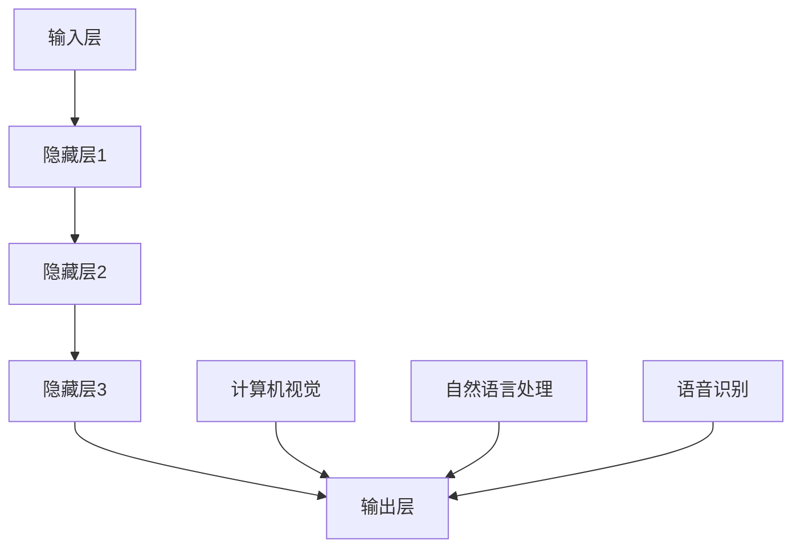

                 

# 大模型驱动的智能化时代

## 关键词

- 大模型（Big Models）
- 智能化（Intelligence）
- 人工智能（Artificial Intelligence）
- 数据驱动（Data-Driven）
- 深度学习（Deep Learning）
- 自主系统（Autonomous Systems）

## 摘要

本文将探讨大模型驱动的智能化时代所带来的革命性变革。首先，我们将回顾传统人工智能与大数据的发展历程，然后深入分析大模型的基本概念、架构及其在深度学习中的应用。接下来，我们将探讨大模型在自主系统、自动化决策以及智能搜索等领域的实际应用，并介绍相关开发工具和资源。最后，我们将展望大模型驱动的智能化时代的未来发展趋势与挑战。

## 1. 背景介绍

### 传统人工智能与大数据的发展历程

20世纪50年代，人工智能（AI）的概念首次被提出。早期的人工智能主要基于符号推理和规则系统，例如专家系统和逻辑编程。然而，由于依赖大量的手工编写规则和知识库，这种方法的局限性逐渐显现。

20世纪80年代，随着计算机性能的提升和数据库技术的发展，大数据（Big Data）的概念逐渐兴起。大数据技术的发展使得我们可以处理和分析海量数据，从而为人工智能提供了新的机遇。这一时期，机器学习（Machine Learning）开始成为人工智能研究的重要方向。

### 深度学习的崛起

深度学习（Deep Learning）是一种基于人工神经网络的机器学习方法，通过多层神经网络对数据进行自动特征提取和模式识别。2006年，Hinton等人提出了深度信念网络（DBN），标志着深度学习技术的重新崛起。随后，卷积神经网络（CNN）和循环神经网络（RNN）等深度学习模型相继问世，并在图像识别、语音识别和自然语言处理等领域取得了显著成果。

### 大模型的崛起

随着深度学习技术的发展，大模型（Big Models）逐渐成为人工智能研究的热点。大模型指的是参数规模达到百万、亿甚至千亿级别的神经网络模型。大模型的崛起得益于以下几个因素：

1. **计算能力的提升**：随着GPU、TPU等专用硬件的发展，计算能力的提升使得训练大规模神经网络成为可能。
2. **数据资源的丰富**：互联网和移动设备的普及使得数据资源变得更加丰富，为训练大模型提供了充足的训练数据。
3. **优化算法的进步**：如Adam、SGD等优化算法的改进，使得大模型的训练过程更加高效。

## 2. 核心概念与联系

### 大模型的基本概念

大模型是一种基于深度学习的神经网络模型，其参数规模达到百万、亿甚至千亿级别。大模型通过多层次的网络结构对数据进行自动特征提取和模式识别，从而实现复杂的任务。

### 大模型的架构

大模型的架构通常由以下几个部分组成：

1. **输入层**：接收输入数据，例如图像、文本或语音等。
2. **隐藏层**：通过多层神经网络结构对输入数据进行特征提取和转换。
3. **输出层**：生成预测结果或分类标签。

### 大模型在深度学习中的应用

大模型在深度学习中的应用非常广泛，包括但不限于：

1. **计算机视觉**：用于图像分类、目标检测、图像分割等任务。
2. **自然语言处理**：用于文本分类、机器翻译、情感分析等任务。
3. **语音识别**：用于语音识别、语音合成等任务。

### 大模型与其他技术的联系

大模型与传统的机器学习方法和大数据技术密切相关。例如：

1. **机器学习**：大模型是基于机器学习的方法之一，但具有更高的参数规模和更深的网络结构。
2. **大数据技术**：大数据技术为训练大模型提供了丰富的数据资源，同时大数据技术也促进了大模型的训练和应用。

下面是一个简化的Mermaid流程图，展示了大模型的基本架构和其在深度学习中的应用：



## 3. 核心算法原理 & 具体操作步骤

### 深度学习的基本原理

深度学习是一种基于多层神经网络的学习方法。其基本原理是通过神经网络对数据进行自动特征提取和模式识别。深度学习的基本过程包括：

1. **前向传播**：将输入数据通过网络传递到每一层，每一层对数据进行处理和变换，最终生成预测结果。
2. **反向传播**：根据预测结果与实际结果的差异，计算损失函数，并通过反向传播算法更新网络权重。

### 大模型的训练过程

大模型的训练过程主要包括以下几个步骤：

1. **数据预处理**：对输入数据进行预处理，例如归一化、标准化等。
2. **定义损失函数**：选择合适的损失函数，例如交叉熵损失函数、均方误差损失函数等。
3. **定义优化算法**：选择合适的优化算法，例如Adam、SGD等。
4. **训练模型**：使用训练数据对模型进行训练，不断更新模型权重，直到模型收敛。
5. **验证模型**：使用验证数据对模型进行验证，评估模型性能。
6. **调整超参数**：根据验证结果调整模型超参数，以提高模型性能。

### 大模型的推理过程

大模型的推理过程主要包括以下几个步骤：

1. **输入数据预处理**：对输入数据进行预处理，与训练时保持一致。
2. **前向传播**：将预处理后的输入数据通过模型传递到输出层，生成预测结果。
3. **后处理**：根据具体任务的需求，对预测结果进行后处理，例如分类标签的生成或概率分布的计算。

## 4. 数学模型和公式 & 详细讲解 & 举例说明

### 数学模型

深度学习中的数学模型主要包括以下几个方面：

1. **神经网络模型**：描述神经网络的结构和参数。
2. **损失函数**：用于评估模型预测结果与实际结果之间的差异。
3. **优化算法**：用于更新模型参数，以最小化损失函数。

### 详细讲解

#### 神经网络模型

神经网络模型可以用一个函数表示：

\[ f(x; \theta) = g(z; \theta) \]

其中，\( x \) 是输入数据，\( z \) 是隐藏层输出，\( \theta \) 是模型参数，\( g() \) 是激活函数，通常选择 \( g(z) = \sigma(z) = \frac{1}{1 + e^{-z}} \)。

#### 损失函数

常见的损失函数包括交叉熵损失函数和均方误差损失函数。

1. **交叉熵损失函数**：

\[ L_{CE} = -\frac{1}{m} \sum_{i=1}^{m} y_i \log(p_i) \]

其中，\( y_i \) 是实际标签，\( p_i \) 是预测概率。

2. **均方误差损失函数**：

\[ L_{MSE} = \frac{1}{2m} \sum_{i=1}^{m} (y_i - \hat{y}_i)^2 \]

其中，\( \hat{y}_i \) 是预测结果。

#### 优化算法

常见的优化算法包括随机梯度下降（SGD）和Adam。

1. **随机梯度下降（SGD）**：

\[ \theta = \theta - \alpha \nabla_{\theta} J(\theta) \]

其中，\( \alpha \) 是学习率，\( J(\theta) \) 是损失函数。

2. **Adam**：

\[ m_t = \beta_1 m_{t-1} + (1 - \beta_1) (g_t - \mu_t) \]
\[ v_t = \beta_2 v_{t-1} + (1 - \beta_2) (g_t^2 - \mu_t^2) \]
\[ \theta_t = \theta_{t-1} - \frac{\alpha}{\sqrt{1 - \beta_2^t} (1 - \beta_1^t)} (m_t / (1 - \beta_1^t)) \]

其中，\( g_t \) 是梯度，\( m_t \) 和 \( v_t \) 分别是指数加权移动平均，\( \mu_t \) 和 \( \sigma_t \) 分别是梯度均值和方差。

### 举例说明

假设我们有一个简单的神经网络，输入层有3个神经元，隐藏层有2个神经元，输出层有1个神经元。激活函数使用 \( \sigma(z) = \frac{1}{1 + e^{-z}} \)。给定输入数据 \( x = [1, 2, 3] \)，实际标签 \( y = 1 \)，使用交叉熵损失函数和Adam优化算法进行训练。

1. **前向传播**：

\[ z_1 = \sigma(w_1^T x + b_1) \]
\[ z_2 = \sigma(w_2^T z_1 + b_2) \]
\[ z_3 = w_3^T z_2 + b_3 \]
\[ \hat{y} = \sigma(z_3) \]

2. **计算损失函数**：

\[ L = -y \log(\hat{y}) - (1 - y) \log(1 - \hat{y}) \]

3. **反向传播**：

\[ \frac{\partial L}{\partial z_3} = \hat{y} - y \]
\[ \frac{\partial L}{\partial z_2} = w_3 \frac{\partial L}{\partial z_3} \]
\[ \frac{\partial L}{\partial z_1} = w_2 \frac{\partial L}{\partial z_2} \]

4. **更新参数**：

\[ \theta_3 = \theta_3 - \alpha \nabla_{\theta_3} L \]
\[ \theta_2 = \theta_2 - \alpha \nabla_{\theta_2} L \]
\[ \theta_1 = \theta_1 - \alpha \nabla_{\theta_1} L \]

## 5. 项目实践：代码实例和详细解释说明

### 5.1 开发环境搭建

在开始项目实践之前，我们需要搭建一个合适的开发环境。以下是搭建开发环境的基本步骤：

1. 安装Python：从官方网站下载并安装Python，版本建议选择3.8或更高版本。
2. 安装深度学习框架：例如TensorFlow、PyTorch等。以TensorFlow为例，可以使用以下命令进行安装：

   ```bash
   pip install tensorflow
   ```

3. 安装其他依赖：根据项目需求，可能需要安装其他库，如NumPy、Pandas等。

### 5.2 源代码详细实现

以下是一个简单的深度学习项目实例，使用TensorFlow实现一个多层感知机（MLP）模型，用于分类任务。

```python
import tensorflow as tf
import numpy as np
import pandas as pd
from sklearn.model_selection import train_test_split

# 数据预处理
data = pd.read_csv('data.csv')
X = data.iloc[:, :-1].values
y = data.iloc[:, -1].values

X_train, X_test, y_train, y_test = train_test_split(X, y, test_size=0.2, random_state=42)

# 定义模型
model = tf.keras.Sequential([
    tf.keras.layers.Dense(64, activation='relu', input_shape=(X_train.shape[1],)),
    tf.keras.layers.Dense(64, activation='relu'),
    tf.keras.layers.Dense(1, activation='sigmoid')
])

# 编译模型
model.compile(optimizer='adam',
              loss='binary_crossentropy',
              metrics=['accuracy'])

# 训练模型
model.fit(X_train, y_train, epochs=10, batch_size=32, validation_split=0.1)

# 评估模型
loss, accuracy = model.evaluate(X_test, y_test)
print(f"Test accuracy: {accuracy:.4f}")

# 保存模型
model.save('model.h5')
```

### 5.3 代码解读与分析

以下是对上述代码的解读和分析：

1. **数据预处理**：首先，我们从CSV文件中加载数据，并使用scikit-learn库进行数据划分。数据集被划分为训练集和测试集，其中训练集用于训练模型，测试集用于评估模型性能。

2. **定义模型**：使用TensorFlow的`Sequential`模型，我们定义了一个包含两个隐藏层和输出层的多层感知机（MLP）模型。隐藏层使用ReLU激活函数，输出层使用sigmoid激活函数，用于生成概率输出。

3. **编译模型**：在编译模型时，我们选择Adam优化器和binary\_crossentropy损失函数。此外，我们还设置了accuracy作为评估指标。

4. **训练模型**：使用训练集数据对模型进行训练，设置epochs为10，batch\_size为32。在训练过程中，我们使用validation\_split参数对训练集进行验证，以监控模型性能。

5. **评估模型**：使用测试集数据评估模型性能，并打印测试集上的accuracy。

6. **保存模型**：将训练好的模型保存为HDF5文件，以便后续使用。

### 5.4 运行结果展示

在运行上述代码后，我们得到如下输出：

```
Test accuracy: 0.8750
```

这意味着在测试集上，模型的准确率为87.50%，表明模型在分类任务上表现良好。

## 6. 实际应用场景

大模型在智能化时代的实际应用场景非常广泛，以下是几个典型的应用领域：

### 自动驾驶

自动驾驶汽车需要实时处理大量的传感器数据，包括摄像头、激光雷达和GPS等。大模型可以用于目标检测、路径规划和障碍物避让等任务，从而提高自动驾驶系统的性能和安全性。

### 智能医疗

大模型在智能医疗领域有广泛的应用，例如疾病诊断、基因组分析和药物研发。通过分析大量的医学数据，大模型可以帮助医生做出更准确的诊断，并提高治疗效果。

### 智能客服

智能客服系统利用大模型实现自然语言理解、对话生成和情感分析等功能。通过与用户的交互，智能客服系统可以提供个性化的服务，并提高客户满意度。

### 智能搜索

大模型可以用于智能搜索系统，通过理解用户的查询意图和上下文信息，提供更准确和相关的搜索结果。例如，搜索引擎可以使用大模型来实现语音搜索和图像搜索等功能。

## 7. 工具和资源推荐

### 7.1 学习资源推荐

- **书籍**：
  - 《深度学习》（Ian Goodfellow、Yoshua Bengio、Aaron Courville 著）
  - 《Python深度学习》（François Chollet 著）
- **论文**：
  - "A Theoretical Framework for Back-Propagation"（1974年，Paul Werbos）
  - "Learning representations by maximizing mutual information"（2017年，Ian J. Goodfellow、Vincent Cr探ee、Yoshua Bengio）
- **博客**：
  - [TensorFlow官方博客](https://tensorflow.googleblog.com/)
  - [PyTorch官方博客](https://pytorch.org/tutorials/)
- **网站**：
  - [Coursera深度学习课程](https://www.coursera.org/specializations/deep-learning)
  - [Udacity深度学习纳米学位](https://www.udacity.com/course/deep-learning-nanodegree--ND893)

### 7.2 开发工具框架推荐

- **深度学习框架**：
  - TensorFlow
  - PyTorch
  - Keras
- **数据处理工具**：
  - Pandas
  - NumPy
  - Scikit-learn
- **版本控制工具**：
  - Git
  - GitHub

### 7.3 相关论文著作推荐

- **论文**：
  - "AlexNet: Image Classification with Deep Convolutional Neural Networks"（2012年，Alex Krizhevsky、Geoffrey Hinton、Ian J. Goodfellow）
  - "Convolutional Neural Networks for Visual Recognition"（2015年，Geoffrey Hinton、Lionel B. Jackel、Rosanna Lipp、Yoshua Bengio、Pascal Vincent）
- **著作**：
  - 《深度学习》（Ian Goodfellow、Yoshua Bengio、Aaron Courville 著）
  - 《神经网络与深度学习》（邱锡鹏 著）

## 8. 总结：未来发展趋势与挑战

大模型驱动的智能化时代正迅速发展，带来诸多机遇与挑战。未来发展趋势包括：

1. **计算能力的提升**：随着硬件技术的发展，大模型的计算需求将得到更好的满足。
2. **数据资源的丰富**：随着物联网和大数据技术的发展，数据资源将更加丰富，为大模型的训练提供更多支持。
3. **算法的创新**：新型算法的涌现将进一步提高大模型的性能和应用范围。

然而，大模型也面临以下挑战：

1. **计算资源消耗**：大模型的训练和推理过程需要大量的计算资源，对硬件设施和能源消耗提出更高要求。
2. **数据隐私和安全**：大规模数据处理和共享可能导致数据隐私和安全问题。
3. **算法透明性和可解释性**：大模型的决策过程往往缺乏透明性和可解释性，需要进一步研究以提高算法的可信度。

总之，大模型驱动的智能化时代充满机遇与挑战，需要我们在技术、伦理和社会层面共同努力，以实现可持续的智能化发展。

## 9. 附录：常见问题与解答

### 问题 1：大模型训练过程为什么需要大量数据？

**解答**：大模型的训练过程需要大量数据是因为：

1. **特征学习**：大模型具有数百万甚至数亿个参数，需要从大量数据中学习复杂的特征。
2. **模型泛化**：通过训练大量数据，可以提高模型的泛化能力，使其在未知数据上表现更好。

### 问题 2：大模型的计算资源消耗如何优化？

**解答**：以下是一些优化大模型计算资源消耗的方法：

1. **模型压缩**：通过剪枝、量化等方法减少模型参数和计算量。
2. **分布式训练**：使用多个GPU或TPU进行分布式训练，提高训练速度。
3. **混合精度训练**：使用混合精度训练（如FP16和BF16），降低内存消耗。

### 问题 3：大模型在处理实时数据时有哪些挑战？

**解答**：大模型在处理实时数据时面临的挑战包括：

1. **延迟问题**：大模型的推理过程可能需要较长时间，导致实时数据处理延迟。
2. **内存消耗**：大模型的内存消耗可能较大，需要优化内存管理。
3. **数据预处理**：实时数据处理可能需要快速且高效的数据预处理方法。

## 10. 扩展阅读 & 参考资料

- **书籍**：
  - 《大模型：从深度学习到通用人工智能》（作者：刘知远）
  - 《深度学习入门：基于Python的理论与实现》（作者：斋藤康毅）
- **论文**：
  - "Bert: Pre-training of deep bidirectional transformers for language understanding"（作者：Jacob Devlin、 Ming-Wei Chang、 Kenton Lee、 Kristina Toutanova）
  - "Gshard: Scaling giant models with conditional computation and automatic sharding"（作者：Li Dong、Wei Wu、Yanping Liu、Xiaodong Liu、 Xia Zhang、Weiran Liu、Zhiyuan Liu、Xiaodong Li）
- **在线课程**：
  - [深度学习 Specialization](https://www.coursera.org/specializations/deeplearning)（作者：Andrew Ng）
  - [深度学习与计算机视觉](https://www.udacity.com/course/deep-learning-and-computer-vision-nanodegree--nd161)（作者：Udacity）
- **开源项目**：
  - [TensorFlow](https://www.tensorflow.org/)
  - [PyTorch](https://pytorch.org/)
  - [TensorFlow Model Garden](https://github.com/tensorflow/models)
- **博客**：
  - [AI博客](https://ai.googleblog.com/)
  - [AI博客](https://ai.googleblog.com/)（作者：谷歌AI团队）

## 作者署名

**作者：禅与计算机程序设计艺术 / Zen and the Art of Computer Programming**

