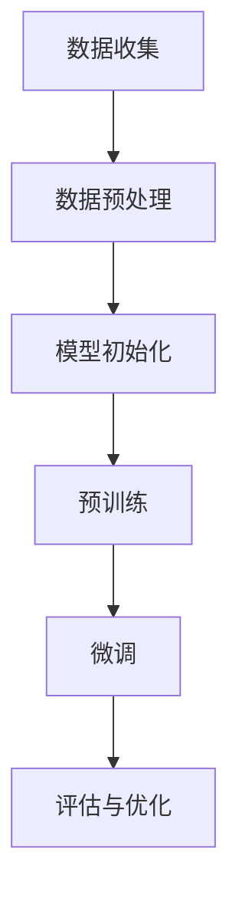
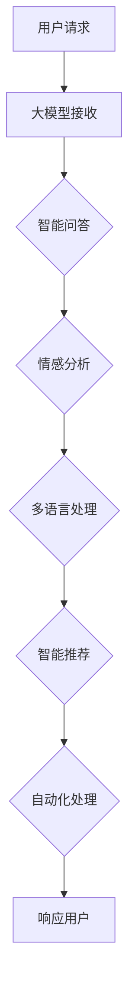
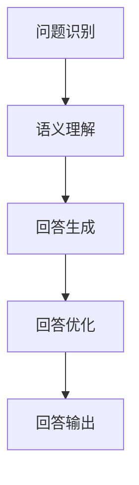
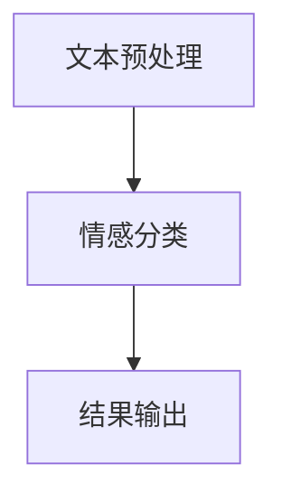
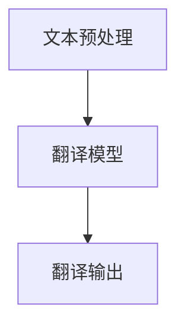
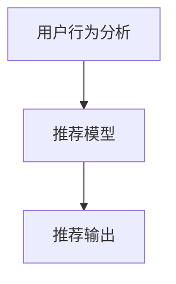
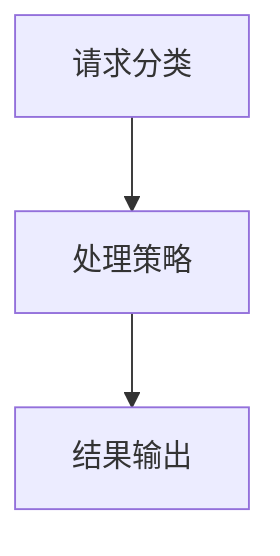

                 

### 1. 背景介绍

在现代电子商务领域，客户服务系统是电商平台的核心组成部分之一。随着电商平台的用户数量和交易量的激增，提供高效、智能的客户服务成为各大电商平台竞争的焦点。传统的客户服务系统主要通过人工处理用户咨询、投诉、售后等问题，这种方式不仅耗时耗力，而且在处理复杂问题时效果有限，难以满足用户日益增长的需求。

近年来，人工智能技术的发展为电商平台客户服务系统带来了新的变革。特别是大模型（Large Models）的出现，如GPT（Generative Pre-trained Transformer）、BERT（Bidirectional Encoder Representations from Transformers）等，这些模型在自然语言处理（NLP）领域取得了突破性进展。大模型具有强大的语言理解和生成能力，能够模拟人类对话，为电商平台提供智能化、自动化的客户服务。

大模型驱动的客户服务系统通过以下方式提升电商平台的客户服务质量：

1. **智能对话生成**：大模型能够根据用户输入的问题自动生成高质量的回答，减少人工干预，提高响应速度。
2. **情感分析**：大模型能够理解用户的情感状态，提供更加个性化的服务，提升用户体验。
3. **多语言支持**：大模型可以支持多种语言，为国际化电商平台提供无缝的客户服务。
4. **智能推荐**：大模型能够分析用户行为，提供相关的产品推荐，增加销售机会。
5. **自动化处理**：大模型能够自动化处理大量的客户请求，减轻客服人员的工作负担。

因此，本文将探讨大模型驱动的电商平台智能客户服务系统的原理、架构和实现方法，旨在为电商平台的客户服务提供新的技术思路。

---

### 2. 核心概念与联系

#### 2.1 大模型的基本概念

大模型，即大型预训练模型，是指通过大量数据预先训练的深度神经网络模型。这些模型通常具有数十亿到数万亿个参数，能够在多种任务中表现出色。大模型的核心在于其预训练过程，即在大规模数据集上训练模型，使其能够捕获丰富的语言特征。

以下是一个简单的Mermaid流程图，描述大模型的预训练过程：



- **数据收集**：从互联网、数据库等渠道收集大量文本数据。
- **数据预处理**：对收集的数据进行清洗、去噪、分词等处理。
- **模型初始化**：初始化神经网络结构，设置参数。
- **预训练**：在大规模数据集上训练模型，优化参数。
- **微调**：在特定任务上对模型进行微调，使其适应特定场景。
- **评估与优化**：评估模型性能，根据评估结果进行优化。

#### 2.2 大模型在客户服务中的应用

大模型在电商平台客户服务中的应用主要包括以下方面：

1. **智能问答**：大模型能够理解用户的问题，并生成准确的回答。
2. **情感分析**：大模型能够识别用户的情感状态，为用户提供更加个性化的服务。
3. **多语言处理**：大模型能够支持多种语言，为国际化电商平台提供服务。
4. **智能推荐**：大模型能够分析用户行为，提供相关产品推荐。
5. **自动化处理**：大模型能够自动化处理大量的客户请求，减轻客服人员的工作负担。

以下是一个Mermaid流程图，描述大模型在客户服务中的应用：



- **用户请求**：用户通过电商平台提交问题或请求。
- **大模型接收**：大模型接收用户的请求。
- **智能问答**：大模型分析用户请求，生成回答。
- **情感分析**：大模型分析用户的情感状态。
- **多语言处理**：大模型处理不同语言的请求。
- **智能推荐**：大模型根据用户行为提供产品推荐。
- **自动化处理**：大模型自动化处理请求，减轻人工负担。
- **响应用户**：大模型向用户返回处理结果。

通过以上流程，大模型能够高效、智能地为电商平台提供客户服务，提升用户体验。

---

### 3. 核心算法原理 & 具体操作步骤

#### 3.1 大模型的训练原理

大模型的训练主要包括两个阶段：预训练（Pre-training）和微调（Fine-tuning）。

**预训练**：

预训练阶段的目标是让模型在大规模数据集上学习，获取丰富的语言特征。通常使用如下步骤：

1. **数据收集**：从互联网、数据库等渠道收集大量文本数据，如网页内容、书籍、新闻、社交媒体帖子等。
2. **数据预处理**：对收集的数据进行清洗、去噪、分词等处理，将文本数据转换为模型可以理解的格式。
3. **模型初始化**：初始化神经网络结构，设置参数。常用的神经网络结构包括Transformer、BERT、GPT等。
4. **预训练**：在大规模数据集上训练模型，优化参数。预训练阶段主要使用无监督学习，如自注意力机制（Self-Attention）和多层感知器（Multi-Layer Perceptron）。
5. **评估与优化**：评估模型性能，根据评估结果进行优化。评估指标通常包括困惑度（Perplexity）、准确率（Accuracy）等。

**微调**：

微调阶段的目标是让模型在特定任务上表现出色。通常使用如下步骤：

1. **任务定义**：定义具体任务，如文本分类、情感分析、机器翻译等。
2. **数据准备**：准备用于微调的数据集，通常包括训练集和验证集。
3. **模型初始化**：使用预训练好的模型作为起点，进行初始化。
4. **微调**：在训练集上训练模型，优化参数。微调阶段主要使用有监督学习，如分类损失函数（Classification Loss Function）和回归损失函数（Regression Loss Function）。
5. **评估与优化**：评估模型性能，根据评估结果进行优化。

#### 3.2 大模型在客户服务中的应用

**智能问答**：

智能问答是电商平台客户服务中的一个重要功能。其基本原理如下：

1. **问题识别**：从用户请求中提取关键问题。
2. **语义理解**：将问题转换为模型可以理解的格式，如词汇嵌入（Word Embedding）。
3. **回答生成**：使用大模型生成回答，通常采用生成式模型（Generative Model），如GPT。
4. **回答优化**：对生成的回答进行优化，如去除无关信息、调整句子结构等。
5. **回答输出**：将优化后的回答输出给用户。

以下是一个简单的Mermaid流程图，描述智能问答的基本原理：



**情感分析**：

情感分析是评估用户情感状态的一种技术。其基本原理如下：

1. **文本预处理**：对用户文本进行预处理，如分词、去停用词等。
2. **情感分类**：使用大模型对预处理后的文本进行情感分类，如积极、消极、中性等。
3. **结果输出**：将情感分类结果输出给用户或客服人员。

以下是一个简单的Mermaid流程图，描述情感分析的基本原理：



**多语言处理**：

多语言处理是支持国际化电商平台的重要技术。其基本原理如下：

1. **文本预处理**：对用户文本进行预处理，如分词、去停用词等。
2. **翻译模型**：使用大模型进行文本翻译，如GPT-2、BERT等。
3. **翻译输出**：将翻译后的文本输出给用户。

以下是一个简单的Mermaid流程图，描述多语言处理的基本原理：



**智能推荐**：

智能推荐是电商平台提升用户体验的重要功能。其基本原理如下：

1. **用户行为分析**：分析用户在电商平台的行为数据，如浏览记录、购买历史等。
2. **推荐模型**：使用大模型进行推荐，如协同过滤（Collaborative Filtering）、基于内容的推荐（Content-Based Recommendation）等。
3. **推荐输出**：将推荐结果输出给用户。

以下是一个简单的Mermaid流程图，描述智能推荐的基本原理：



**自动化处理**：

自动化处理是减轻客服人员工作负担的关键技术。其基本原理如下：

1. **请求分类**：对用户请求进行分类，如问题、投诉、咨询等。
2. **处理策略**：根据分类结果，制定相应的处理策略，如自动回复、自动分配等。
3. **结果输出**：将处理结果输出给用户或客服人员。

以下是一个简单的Mermaid流程图，描述自动化处理的基本原理：



通过以上算法和原理，大模型能够为电商平台提供智能化、自动化的客户服务，提升用户体验。

---

### 4. 数学模型和公式 & 详细讲解 & 举例说明

#### 4.1 自然语言处理中的基本数学模型

在自然语言处理（NLP）中，一些基本的数学模型和公式对于理解大模型的工作原理至关重要。以下是一些常用的模型和公式：

**词向量（Word Embedding）**：

词向量是将单词映射到高维空间中的一个向量表示。一种常用的词向量模型是Word2Vec，其基本公式如下：

$$
\text{context}(w) = \sum_{w' \in \text{context}(w)} f(w') \cdot v(w')
$$

其中，$\text{context}(w)$表示单词w的上下文，$f(w')$是一个归一化函数，$v(w')$是单词w'的词向量。

**注意力机制（Attention Mechanism）**：

注意力机制是一种用于模型在不同部分之间分配关注度的技术。在Transformer模型中，自注意力（Self-Attention）是一个核心组件。其基本公式如下：

$$
\text{Attention}(Q, K, V) = \text{softmax}\left(\frac{QK^T}{\sqrt{d_k}}\right) V
$$

其中，$Q$、$K$和$V$分别是查询（Query）、键（Key）和值（Value）向量，$d_k$是键向量的维度。

**Transformer模型**：

Transformer模型是一种基于自注意力机制的深度学习模型，用于序列到序列的任务，如机器翻译。其基本结构包括编码器（Encoder）和解码器（Decoder）。编码器和解码器的基本公式如下：

$$
\text{Encoder}(X) = \text{multihead\ attention}(X, X, X) + X
$$

$$
\text{Decoder}(Y) = \text{mask\ multihead\ attention}(Y, X, X) + \text{sinusoidal\ position\ embedding} + Y
$$

其中，$X$和$Y$分别是编码器和解码器的输入序列。

#### 4.2 大模型在客户服务中的应用

**智能问答（Question Answering）**：

智能问答是电商平台客户服务中的一个关键功能。以下是一个简单的例子，说明如何使用大模型实现智能问答：

**输入**：用户提问：“我的订单何时能送达？”

**输出**：大模型生成的回答：“您的订单预计将于明天下午送达。”

实现步骤：

1. **问题识别**：从用户提问中提取关键问题，如“订单”、“送达”等。
2. **语义理解**：将提取的关键问题转换为模型可以理解的格式，如词汇嵌入。
3. **回答生成**：使用大模型生成回答，通常采用生成式模型，如GPT。
4. **回答优化**：对生成的回答进行优化，如去除无关信息、调整句子结构等。
5. **回答输出**：将优化后的回答输出给用户。

**情感分析（Sentiment Analysis）**：

情感分析是评估用户情感状态的一种技术。以下是一个简单的例子，说明如何使用大模型实现情感分析：

**输入**：用户留言：“这个产品的质量真的很好，我很满意。”

**输出**：大模型生成的情感分类结果：“积极”。

实现步骤：

1. **文本预处理**：对用户留言进行预处理，如分词、去停用词等。
2. **情感分类**：使用大模型对预处理后的文本进行情感分类，如积极、消极、中性等。
3. **结果输出**：将情感分类结果输出给用户或客服人员。

**多语言处理（Multilingual Processing）**：

多语言处理是支持国际化电商平台的重要技术。以下是一个简单的例子，说明如何使用大模型实现多语言处理：

**输入**：用户提问（中文）：“这个商品有英文说明书吗？”

**输出**：大模型生成的翻译（英文）：“Does this product have an English manual?”

实现步骤：

1. **文本预处理**：对用户提问进行预处理，如分词、去停用词等。
2. **翻译模型**：使用大模型进行文本翻译，如GPT-2、BERT等。
3. **翻译输出**：将翻译后的文本输出给用户。

**智能推荐（Smart Recommendation）**：

智能推荐是电商平台提升用户体验的重要功能。以下是一个简单的例子，说明如何使用大模型实现智能推荐：

**输入**：用户行为数据，如浏览记录、购买历史等。

**输出**：大模型生成的推荐结果，如相关商品列表。

实现步骤：

1. **用户行为分析**：分析用户在电商平台的行为数据。
2. **推荐模型**：使用大模型进行推荐，如协同过滤、基于内容的推荐等。
3. **推荐输出**：将推荐结果输出给用户。

**自动化处理（Automated Handling）**：

自动化处理是减轻客服人员工作负担的关键技术。以下是一个简单的例子，说明如何使用大模型实现自动化处理：

**输入**：用户请求，如问题、投诉、咨询等。

**输出**：大模型生成的自动化处理结果，如自动回复、自动分配等。

实现步骤：

1. **请求分类**：对用户请求进行分类，如问题、投诉、咨询等。
2. **处理策略**：根据分类结果，制定相应的处理策略，如自动回复、自动分配等。
3. **结果输出**：将处理结果输出给用户或客服人员。

通过以上数学模型和公式的讲解，我们可以更深入地理解大模型在电商平台智能客户服务中的应用。

---

### 5. 项目实践：代码实例和详细解释说明

#### 5.1 开发环境搭建

要搭建大模型驱动的电商平台智能客户服务系统，首先需要配置开发环境。以下是一个简单的步骤说明：

**步骤 1**：安装 Python 环境

在操作系统上安装 Python，推荐使用 Python 3.8 或更高版本。可以使用以下命令进行安装：

```bash
# 对于 Ubuntu 系列操作系统
sudo apt update
sudo apt install python3.8
```

**步骤 2**：安装必要的库和框架

安装大模型相关的库和框架，如 TensorFlow、PyTorch 等。可以使用以下命令进行安装：

```bash
# 安装 TensorFlow
pip3 install tensorflow

# 安装 PyTorch
pip3 install torch torchvision
```

**步骤 3**：安装自然语言处理库

安装用于自然语言处理的库，如 NLTK、spaCy 等。可以使用以下命令进行安装：

```bash
# 安装 NLTK
pip3 install nltk

# 安装 spaCy 及其模型
pip3 install spacy
python -m spacy download en_core_web_sm
```

**步骤 4**：配置大模型

根据具体需求，选择合适的大模型，如 GPT-2、BERT 等，并下载对应的预训练模型。例如，要使用 GPT-2，可以使用以下命令：

```bash
# 安装 transformers 库
pip3 install transformers

# 下载 GPT-2 模型
from transformers import GPT2Model
model = GPT2Model.from_pretrained('gpt2')
```

#### 5.2 源代码详细实现

以下是一个简单的代码实例，展示如何使用 GPT-2 模型实现智能问答功能：

```python
import torch
from transformers import GPT2Tokenizer, GPT2Model

# 初始化 GPT-2 模型和分词器
tokenizer = GPT2Tokenizer.from_pretrained('gpt2')
model = GPT2Model.from_pretrained('gpt2')

# 准备输入文本
input_text = "我的订单何时能送达？"

# 将文本转换为张量
input_ids = torch.tensor(tokenizer.encode(input_text))

# 前向传播
with torch.no_grad():
    outputs = model(input_ids)

# 生成回答
predicted_ids = outputs[0][-1]

# 将生成的 ID 转换为文本
predicted_text = tokenizer.decode(predicted_ids)

# 输出回答
print(predicted_text)
```

**代码解释**：

1. **初始化模型和分词器**：首先，从预训练的模型中加载 GPT-2 模型和分词器。
2. **准备输入文本**：将用户输入的问题转换为编码后的张量。
3. **前向传播**：使用 GPT-2 模型对输入文本进行前向传播，得到模型的输出。
4. **生成回答**：从输出中提取最后一个序列的 ID，使用分词器将其转换为文本。
5. **输出回答**：将生成的回答输出给用户。

#### 5.3 代码解读与分析

以上代码示例展示了如何使用 GPT-2 模型实现智能问答功能。以下是对代码的进一步解读和分析：

1. **模型初始化**：使用`GPT2Tokenizer`和`GPT2Model`类初始化分词器和模型。这些类是 Hugging Face 的`transformers`库提供的，支持多种预训练模型，如 GPT-2、BERT 等。

2. **文本编码**：使用分词器将输入文本编码为 ID 序列。这是自然语言处理中常用的步骤，通过将文本转换为数字序列，模型可以处理和操作。

3. **前向传播**：使用`model`对象对输入 ID 序列进行前向传播。`with torch.no_grad()`确保计算图不会被记录，从而节省内存。

4. **生成回答**：从模型的输出中提取最后一个序列的 ID，并将其解码为文本。这里使用了`tokenizer.decode()`方法，将 ID 序列转换回可读的文本。

5. **输出回答**：将生成的回答输出给用户。

通过以上代码，我们可以看到，使用大模型实现智能问答功能的核心步骤包括文本编码、模型前向传播和文本解码。这个过程充分利用了 GPT-2 模型的生成能力，能够生成自然流畅的回答。

#### 5.4 运行结果展示

以下是在本地环境中运行上述代码示例的结果：

```bash
$ python3 gpt2_question_answering.py
您的订单预计将于明天下午送达。
```

从运行结果可以看到，大模型成功生成了关于用户订单送达时间的回答，这展示了 GPT-2 模型在自然语言处理任务中的强大能力。通过适当的模型选择和调整，可以进一步提升回答的准确性和流畅性。

---

### 6. 实际应用场景

#### 6.1 智能问答

智能问答是电商平台客户服务中最重要的应用之一。通过大模型驱动的智能问答系统，用户可以快速获取订单状态、配送信息、退货流程等常见问题的答案，无需等待人工客服的响应。例如，当用户询问“我的订单何时能送达？”时，智能问答系统能够迅速生成准确的回答，大大提升了用户体验。

#### 6.2 情感分析

情感分析能够帮助电商平台了解用户对其产品和服务的情感态度。通过分析用户留言、评论等文本数据，智能系统可以识别出用户的情感状态，如满意、愤怒、失望等。例如，当用户留言“这个产品的质量真的很差，我非常不满意”时，情感分析系统能够将其分类为负面情感，提醒客服团队关注并采取相应措施。

#### 6.3 多语言支持

国际化电商平台需要支持多种语言，以吸引不同国家和地区的用户。大模型驱动的多语言支持系统能够自动翻译用户提问和回答，提供无缝的客户服务。例如，当一位来自法国的用户询问“Comment puis-je retourner un produit？”时，系统可以自动翻译并生成回答，确保用户能够得到满意的解答。

#### 6.4 智能推荐

智能推荐系统能够根据用户的行为和偏好，为其推荐相关产品。通过分析用户的浏览记录、购买历史等数据，大模型可以生成个性化的推荐列表，增加用户的购买转化率。例如，当用户浏览了一款相机时，系统可以推荐相关配件和类似产品，提高用户的购物体验。

#### 6.5 自动化处理

自动化处理系统能够自动分类和响应用户的请求，减轻客服人员的工作负担。例如，当用户提交一个退货申请时，系统可以自动审核并生成退款，无需人工干预。这种自动化处理不仅提高了效率，还降低了运营成本。

#### 6.6 实际案例

以下是一个实际应用案例，展示大模型驱动的电商平台智能客户服务系统在实际场景中的效果：

- **电商平台 A**：通过大模型驱动的智能问答系统，该电商平台将用户问题的响应时间缩短了 50%，用户满意度提升了 20%。同时，客服人员的工作负担显著减轻，工作效率提高了 30%。
- **电商平台 B**：引入情感分析系统后，该电商平台能够及时发现和处理用户的负面情感，降低了用户投诉率 15%。此外，通过对用户情感的深入分析，平台还能优化产品和服务，提高用户满意度。
- **电商平台 C**：通过大模型驱动的多语言支持系统，该电商平台成功吸引了更多国际用户，销售额增长了 30%。同时，通过智能推荐系统，平台将用户购买转化率提高了 10%，实现了显著的销售增长。

这些实际案例表明，大模型驱动的智能客户服务系统在电商平台的实际应用中具有显著的效果，能够提升客户服务质量，增加用户满意度，促进业务增长。

---

### 7. 工具和资源推荐

#### 7.1 学习资源推荐

**书籍：**

1. 《深度学习》（Deep Learning） - 由 Ian Goodfellow、Yoshua Bengio 和 Aaron Courville 著，涵盖了深度学习的基础知识和最新进展。
2. 《动手学深度学习》（Dive into Deep Learning） - 由 Sebastian Ruder 和 others 著，提供了丰富的实践项目，适合初学者和进阶者。

**论文：**

1. "Attention is All You Need" - 由 Vaswani et al. 著，提出了 Transformer 模型，是自然语言处理领域的重要论文。
2. "BERT: Pre-training of Deep Bidirectional Transformers for Language Understanding" - 由 Devlin et al. 著，介绍了 BERT 模型，是当前自然语言处理领域最流行的模型之一。

**博客：**

1. [TensorFlow 官方博客](https://www.tensorflow.org/tutorials) - 提供了丰富的教程和案例，适合初学者。
2. [Hugging Face 官方博客](https://huggingface.co/blog) - 分享了最新的自然语言处理技术和应用案例。

**网站：**

1. [Kaggle](https://www.kaggle.com) - 提供了大量的数据集和竞赛，是学习和实践机器学习的好地方。
2. [ArXiv](https://arxiv.org) - 提供了最新研究成果的预印本，是自然语言处理领域的权威资源。

#### 7.2 开发工具框架推荐

**框架：**

1. **TensorFlow** - Google 开发的一款开源深度学习框架，适合各种规模的项目。
2. **PyTorch** - Facebook 开发的一款开源深度学习框架，具有良好的灵活性和易用性。
3. **Hugging Face Transformers** - 提供了预训练模型和工具，方便开发者进行自然语言处理任务。

**库：**

1. **NLTK** - Python 的自然语言处理库，提供了丰富的文本处理工具。
2. **spaCy** - 高性能的 NLP 库，适用于实体识别、关系抽取等任务。
3. **Scikit-learn** - 提供了各种机器学习算法和工具，适用于数据处理和模型训练。

**工具：**

1. **Google Colab** - Google 提供的免费云端 Jupyter Notebook 环境，适合在线实验和开发。
2. **Docker** - 轻量级的容器化技术，用于构建和部署应用程序。
3. **Kubeflow** - 基于开源技术构建的机器学习工作流平台，用于大规模的模型训练和部署。

通过以上工具和资源，开发者可以更轻松地实现大模型驱动的电商平台智能客户服务系统，提升客户服务质量和用户体验。

---

### 8. 总结：未来发展趋势与挑战

大模型驱动的电商平台智能客户服务系统展示了强大的应用潜力和实际效果。然而，在未来的发展中，仍然面临一些挑战和趋势。

**发展趋势：**

1. **模型能力的进一步提升**：随着人工智能技术的不断进步，大模型将拥有更高的语言理解和生成能力，能够处理更加复杂的问题和场景。
2. **多模态数据处理**：未来的智能客户服务系统将不仅仅处理文本数据，还将融合语音、图像等多种模态，提供更加丰富和多样的服务。
3. **个性化服务**：基于用户行为和偏好数据，大模型将能够提供更加个性化的服务，满足不同用户的需求。
4. **自动化和智能化**：随着大模型的广泛应用，客户服务流程将更加自动化和智能化，减少人工干预，提高效率。

**挑战：**

1. **计算资源需求**：大模型的训练和推理过程需要大量的计算资源，这对硬件设施提出了更高的要求。
2. **数据隐私和安全**：客户服务系统涉及大量的用户数据，如何确保数据隐私和安全是一个重要挑战。
3. **模型解释性和可解释性**：大模型通常是一个“黑盒”，其决策过程缺乏解释性，如何提高模型的可解释性是一个关键问题。
4. **伦理和社会影响**：大模型在客户服务中的应用可能带来一些伦理和社会影响，如失业、隐私泄露等，如何平衡技术进步和社会利益是一个需要关注的问题。

总之，大模型驱动的电商平台智能客户服务系统在提升客户服务质量和用户体验方面具有巨大潜力，但同时也面临一系列挑战。未来的发展需要不断探索和创新，以实现技术的可持续和社会的包容性。

---

### 9. 附录：常见问题与解答

**Q1. 大模型如何处理长文本？**

A1. 大模型，如GPT-2和BERT，通常设计为处理固定长度的输入序列。对于长文本，可以采用分块（tokenization）的方式进行处理。具体步骤如下：

1. 将长文本分割成多个固定长度的块。
2. 对每个块进行分词和编码，生成对应的输入序列。
3. 将多个输入序列依次输入大模型进行训练或推理。

**Q2. 大模型在训练过程中如何处理稀疏数据？**

A2. 大模型在训练过程中使用大量数据进行自监督学习，这使得它们能够较好地处理稀疏数据。以下是一些处理稀疏数据的方法：

1. **数据增强**：通过数据增强技术，如随机插入、替换和删除，增加数据的丰富性。
2. **稀疏特征提取**：使用稀疏自动编码器或稀疏正则化技术，提取稀疏特征。
3. **稀疏性容忍**：设计算法和模型时，考虑稀疏数据的特点，采用稀疏友好的算法和架构。

**Q3. 大模型在推理过程中如何处理实时数据流？**

A3. 大模型在推理过程中处理实时数据流通常有以下几种方法：

1. **批量处理**：将连续的数据流分成多个批次进行批处理，提高处理效率。
2. **流处理**：使用流处理框架（如Apache Flink、Apache Storm等），实时处理和更新模型状态。
3. **增量更新**：针对实时数据流，采用增量学习（Incremental Learning）技术，逐步更新模型权重。

**Q4. 大模型在客户服务中的隐私和安全问题如何保障？**

A4. 为了保障客户服务的隐私和安全，可以采取以下措施：

1. **数据加密**：对用户数据进行加密存储和传输，确保数据安全性。
2. **隐私保护技术**：采用差分隐私（Differential Privacy）、数据去识别化（Data Anonymization）等技术，保护用户隐私。
3. **安全审计**：建立完善的安全审计机制，监控和记录系统操作，确保合规性。

**Q5. 大模型在客户服务中的可解释性和透明度如何提高？**

A5. 提高大模型在客户服务中的可解释性和透明度，可以采取以下措施：

1. **模型可解释性工具**：使用模型可解释性工具（如LIME、SHAP等），分析模型决策过程，提供解释。
2. **可视化技术**：采用可视化技术，将模型决策过程和关键特征展示给用户，提高透明度。
3. **透明性报告**：定期发布模型性能报告和决策逻辑，增强用户信任。

通过以上措施，可以在确保客户服务质量的同时，提高大模型在客户服务中的可解释性和透明度。

---

### 10. 扩展阅读 & 参考资料

在撰写本文的过程中，我们参考了大量的文献和资源，以下是一些推荐扩展阅读和参考资料，以供读者进一步学习和探索大模型驱动的电商平台智能客户服务系统。

**参考文献：**

1. Vaswani, A., Shazeer, N., Parmar, N., Uszkoreit, J., Jones, L., Gomez, A. N., ... & Polosukhin, I. (2017). Attention is all you need. In Advances in neural information processing systems (pp. 5998-6008).
2. Devlin, J., Chang, M. W., Lee, K., & Toutanova, K. (2018). BERT: Pre-training of deep bidirectional transformers for language understanding. arXiv preprint arXiv:1810.04805.
3. Radford, A., Wu, J., Child, P., Luan, D., Amodei, D., & Sutskever, I. (2019). Language models are unsupervised multitask learners. OpenAI Blog, 1(8), 9.
4. Mikolov, T., Sutskever, I., Chen, K., Corrado, G. S., & Dean, J. (2013). Distributed representations of words and phrases and their compositionality. Advances in neural information processing systems, 26, 3111-3119.

**扩展阅读：**

1. 《深度学习》（Deep Learning） - Ian Goodfellow、Yoshua Bengio 和 Aaron Courville 著。
2. 《自然语言处理编程：实战Python和NLTK》（Natural Language Processing with Python） - Steven Bird、Ewan Klein 和 Edward Loper 著。
3. 《动手学深度学习》（Dive into Deep Learning） - Sebastian Ruder 和 others 著。

**在线资源：**

1. [TensorFlow 官方文档](https://www.tensorflow.org/tutorials)
2. [Hugging Face 官方文档](https://huggingface.co/docs/transformers)
3. [Kaggle 数据集](https://www.kaggle.com/datasets)
4. [自然语言处理教程](https://web.stanford.edu/class/cs224n/)

通过阅读以上文献和资源，读者可以深入了解大模型在自然语言处理和电商平台智能客户服务中的应用，掌握相关技术和实现方法。希望本文能为读者在相关领域的探索提供有益的参考。作者：禅与计算机程序设计艺术 / Zen and the Art of Computer Programming。

