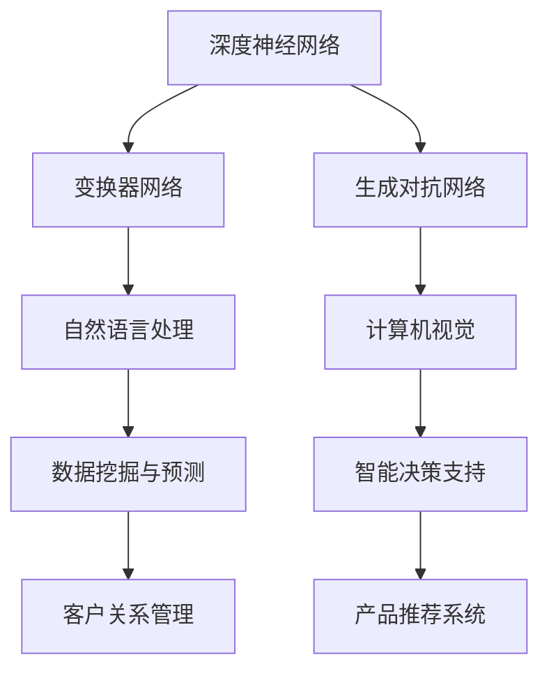
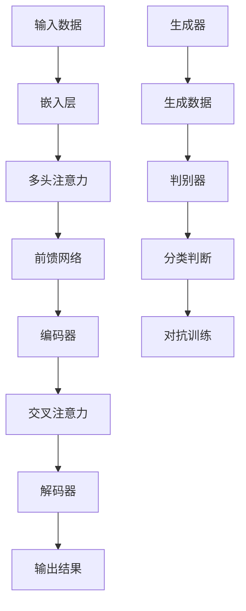

                 

### 文章标题

《大模型：从理论到实践的商业应用》

> 关键词：大模型、理论、实践、商业应用、深度学习、人工智能

> 摘要：本文将深入探讨大模型在商业应用中的重要性，从理论背景、核心概念、算法原理、数学模型、实际案例到未来发展趋势，全方位剖析大模型在各个行业中的实践与应用，为读者提供完整的理论框架和实践指南。

### 1. 背景介绍

在过去的几十年中，人工智能（AI）技术经历了快速的发展。从最初的规则系统到今天的深度学习，AI已经在各个领域取得了显著的成果。然而，随着数据量的不断增长和计算能力的提升，大模型（Large Models）逐渐成为AI研究与应用的核心。

大模型是指具有数十亿至千亿参数规模的人工神经网络，它们能够捕捉数据中的复杂模式，并在各种任务上实现出色的性能。例如，谷歌的BERT模型包含超过3亿个参数，OpenAI的GPT-3模型更是达到了1.75万亿个参数。这些大模型在自然语言处理、计算机视觉、语音识别等领域展现了强大的能力。

商业应用方面，大模型为各行业提供了前所未有的机会。通过大模型的智能分析，企业能够更好地了解客户需求、优化业务流程、提高生产效率、降低成本，从而在激烈的市场竞争中脱颖而出。

本文将首先介绍大模型的基本理论，然后探讨其在实际应用中的具体案例，最后分析未来发展趋势与挑战。希望通过这篇文章，读者能够对大模型有更深刻的理解，并能够在实际工作中运用这些理论。

### 2. 核心概念与联系

#### 2.1 大模型的基本概念

大模型是指具有数十亿至千亿参数规模的人工神经网络，这些模型通过训练可以从大量的数据中学习到复杂的模式。大模型的常见类型包括：

- **深度神经网络（DNN）**：一种多层的神经网络，通常用于图像分类、语音识别等任务。
- **变换器网络（Transformer）**：基于自注意力机制的新型神经网络架构，广泛应用于自然语言处理任务。
- **生成对抗网络（GAN）**：一种通过生成器和判别器相互博弈来生成高质量数据的模型。

#### 2.2 大模型与深度学习的关系

深度学习是AI研究的一个重要分支，它通过多层神经网络模型对数据进行自动特征提取和模式识别。大模型作为深度学习的一种高级形式，具有以下几个显著特点：

- **参数规模大**：大模型通常具有数十亿至千亿个参数，这使得它们能够捕捉数据中的复杂模式。
- **计算资源需求高**：大模型训练需要大量的计算资源和时间，因此高性能计算硬件（如GPU、TPU）的支持变得尤为重要。
- **性能优异**：在大规模数据集上训练的大模型通常能够在各种任务上达到最先进的性能。

#### 2.3 大模型在商业应用中的角色

大模型在商业应用中扮演着关键角色，主要表现在以下几个方面：

- **数据挖掘与预测**：通过大模型对大量业务数据进行挖掘和分析，企业可以识别潜在的市场趋势、优化业务策略。
- **智能决策支持**：大模型能够为企业提供智能化的决策支持，例如在供应链管理、库存优化等方面。
- **客户关系管理**：利用大模型进行客户行为分析，企业可以更精准地定位客户需求，提高客户满意度。
- **产品推荐系统**：大模型在推荐系统中的应用，可以帮助企业提高销售额，优化用户体验。

#### 2.4 Mermaid流程图

以下是关于大模型基本概念和架构的Mermaid流程图：



通过这个流程图，我们可以清晰地看到大模型在不同领域中的应用，以及它们如何助力商业决策和优化。

### 3. 核心算法原理 & 具体操作步骤

#### 3.1 深度神经网络（DNN）

深度神经网络（DNN）是构建大模型的基础。DNN通过多层神经网络对数据进行自动特征提取和模式识别。以下是DNN的核心原理和具体操作步骤：

##### 3.1.1 前向传播

1. **输入层**：将输入数据输入到神经网络的输入层。
2. **隐藏层**：通过一系列的隐藏层对输入数据进行特征提取。每一层的输出作为下一层的输入。
3. **输出层**：最后，输出层的输出即为模型的预测结果。

##### 3.1.2 反向传播

1. **计算损失**：通过比较输出层的预测结果和实际标签，计算损失函数的值。
2. **梯度下降**：利用反向传播算法，计算每一层的梯度，并根据梯度调整网络权重。
3. **迭代优化**：重复前向传播和反向传播的过程，直到损失函数的值降到一定程度或达到预设的训练次数。

#### 3.2 变换器网络（Transformer）

变换器网络（Transformer）是自然语言处理领域的一种先进模型。以下是Transformer的核心原理和具体操作步骤：

##### 3.2.1 自注意力机制

1. **嵌入层**：将输入文本转换为固定长度的嵌入向量。
2. **多头注意力**：通过多个注意力头对嵌入向量进行加权求和，以捕捉输入文本中的长期依赖关系。
3. **前馈网络**：在注意力层之后，添加一个前馈网络对输出进行进一步处理。

##### 3.2.2 编码器与解码器

1. **编码器**：对输入序列进行处理，生成编码表示。
2. **解码器**：利用编码表示生成预测序列。
3. **交叉注意力**：在解码器中，通过交叉注意力机制，将编码表示与当前解码步骤的预测结果进行融合。

#### 3.3 生成对抗网络（GAN）

生成对抗网络（GAN）是一种通过生成器和判别器相互博弈来生成高质量数据的模型。以下是GAN的核心原理和具体操作步骤：

##### 3.3.1 生成器

1. **输入噪声**：生成器接收随机噪声作为输入。
2. **生成数据**：通过神经网络生成与真实数据分布相似的数据。
3. **生成质量评估**：生成器生成数据后，通过判别器对其进行质量评估。

##### 3.3.2 判别器

1. **输入数据**：判别器接收真实数据和生成器生成的数据作为输入。
2. **分类判断**：判别器对输入数据进行分类判断，以区分真实数据和生成数据。
3. **对抗训练**：生成器和判别器通过对抗训练相互调整，以提高生成质量和判别能力。

#### 3.4 Mermaid流程图

以下是关于大模型核心算法原理和操作步骤的Mermaid流程图：



通过这个流程图，我们可以清晰地看到大模型在深度学习、自然语言处理和生成对抗网络等领域的核心算法原理和操作步骤。

### 4. 数学模型和公式 & 详细讲解 & 举例说明

#### 4.1 深度神经网络（DNN）

深度神经网络（DNN）的数学模型主要包括以下几个关键部分：

##### 4.1.1 激活函数

激活函数是神经网络中的一个重要组件，用于引入非线性特性。常见的激活函数包括：

- **Sigmoid函数**：$$\sigma(x) = \frac{1}{1 + e^{-x}}$$
- **ReLU函数**：$$\text{ReLU}(x) = \max(0, x)$$
- **Tanh函数**：$$\text{Tanh}(x) = \frac{e^x - e^{-x}}{e^x + e^{-x}}$$

##### 4.1.2 前向传播

在DNN的前向传播过程中，输入数据通过多个隐藏层传递，最终得到输出层的预测结果。前向传播的数学公式如下：

$$
\begin{aligned}
&z_{l}^{(i)} = \sum_{j} w_{l-1,j}^{(i)} a_{l-1,j}^{(i)} + b_{l}^{(i)}, \\
&a_{l}^{(i)} = \text{激活函数}(z_{l}^{(i)}).
\end{aligned}
$$

其中，$z_{l}^{(i)}$表示第$l$层的输入，$a_{l}^{(i)}$表示第$l$层的输出，$w_{l-1,j}^{(i)}$和$b_{l}^{(i)}$分别是连接权重和偏置。

##### 4.1.3 反向传播

反向传播是DNN训练过程中至关重要的步骤。它通过计算损失函数的梯度来调整网络权重。反向传播的数学公式如下：

$$
\begin{aligned}
&\delta_{l}^{(i)} = (a_{l}^{(i)} - \text{激活函数的导数}) \cdot \delta_{l+1}^{(i)}, \\
&\Delta w_{l-1,j}^{(i)} = \delta_{l}^{(i)} \cdot a_{l-1,j}^{(i)}, \\
&\Delta b_{l}^{(i)} = \delta_{l}^{(i)}.
\end{aligned}
$$

其中，$\delta_{l}^{(i)}$表示第$l$层的误差，$\Delta w_{l-1,j}^{(i)}$和$\Delta b_{l}^{(i)}$分别是连接权重和偏置的梯度。

##### 4.1.4 举例说明

假设我们有一个两层的DNN，输入层有3个神经元，隐藏层有2个神经元，输出层有1个神经元。输入数据为$[1, 2, 3]$，目标输出为$[4]$。下面是前向传播和反向传播的详细计算过程：

1. **前向传播**：

- 输入层：$x_1 = 1, x_2 = 2, x_3 = 3$
- 隐藏层1：$w_1^{(1)} = [0.1, 0.2], w_2^{(1)} = [0.3, 0.4], b_1^{(1)} = [0.5, 0.6]$，激活函数选用ReLU
  $$
  \begin{aligned}
  z_{1}^{(1)} &= 0.1 \cdot 1 + 0.3 \cdot 2 + 0.5 = 1.2, \\
  a_{1}^{(1)} &= \text{ReLU}(z_{1}^{(1)}) = 1.2, \\
  z_{2}^{(1)} &= 0.2 \cdot 1 + 0.4 \cdot 2 + 0.6 = 1.4, \\
  a_{2}^{(1)} &= \text{ReLU}(z_{2}^{(1)}) = 1.4.
  \end{aligned}
  $$
- 输出层：$w_1^{(2)} = [0.7, 0.8], w_2^{(2)} = [0.9, 1.0], b_2^{(2)} = [1.1, 1.2]$，激活函数选用Sigmoid
  $$
  \begin{aligned}
  z_{1}^{(2)} &= 0.7 \cdot 1.2 + 0.9 \cdot 1.4 + 1.1 = 3.75, \\
  a_{1}^{(2)} &= \text{Sigmoid}(z_{1}^{(2)}) = 0.9709, \\
  z_{2}^{(2)} &= 0.8 \cdot 1.2 + 1.0 \cdot 1.4 + 1.2 = 4.36, \\
  a_{2}^{(2)} &= \text{Sigmoid}(z_{2}^{(2)}) = 0.9272.
  \end{aligned}
  $$

2. **反向传播**：

- 计算损失函数的梯度（假设使用均方误差损失函数）：
  $$
  \begin{aligned}
  \delta_{2}^{(2)} &= (a_{2}^{(2)} - y) \cdot \text{Sigmoid的导数}(z_{2}^{(2)}) = (0.9272 - 4) \cdot 0.0655 = -0.3667, \\
  \delta_{2}^{(1)} &= \text{ReLU的导数}(z_{2}^{(1)}) \cdot \delta_{2}^{(2)} = 0 \cdot (-0.3667) = 0.
  \end{aligned}
  $$
- 更新权重和偏置：
  $$
  \begin{aligned}
  \Delta w_{1}^{(1)} &= \delta_{2}^{(1)} \cdot a_{1}^{(1)} = 0 \cdot 1.2 = 0, \\
  \Delta w_{2}^{(1)} &= \delta_{2}^{(1)} \cdot a_{2}^{(1)} = 0 \cdot 1.4 = 0, \\
  \Delta b_{1}^{(1)} &= \delta_{2}^{(1)} = 0, \\
  \Delta w_{1}^{(2)} &= \delta_{2}^{(2)} \cdot a_{1}^{(1)} \cdot 1.2 = -0.3667 \cdot 1.2 = -0.4390, \\
  \Delta w_{2}^{(2)} &= \delta_{2}^{(2)} \cdot a_{2}^{(1)} \cdot 1.4 = -0.3667 \cdot 1.4 = -0.5146, \\
  \Delta b_{1}^{(2)} &= \delta_{2}^{(2)} = -0.3667, \\
  \Delta b_{2}^{(2)} &= \delta_{2}^{(2)} = -0.3667.
  \end{aligned}
  $$

通过这个例子，我们可以看到DNN的前向传播和反向传播过程，以及如何利用梯度下降算法更新网络权重和偏置。

#### 4.2 变换器网络（Transformer）

变换器网络（Transformer）的核心在于自注意力机制（Self-Attention）。以下是自注意力机制的数学模型和公式：

##### 4.2.1 自注意力公式

自注意力公式可以表示为：

$$
\text{Attention}(Q, K, V) = \text{softmax}\left(\frac{QK^T}{\sqrt{d_k}}\right) V,
$$

其中，$Q, K, V$分别是查询（Query）、键（Key）和值（Value）向量，$d_k$是键向量的维度。自注意力机制通过计算查询和键之间的点积，生成加权值，然后对值进行加权求和。

##### 4.2.2多头注意力

多头注意力是一种扩展自注意力机制的方法，通过多个注意力头来捕捉不同类型的依赖关系。多头注意力的公式为：

$$
\text{MultiHead}(Q, K, V) = \text{Concat}(\text{head}_1, \ldots, \text{head}_h)W^O,
$$

其中，$\text{head}_i = \text{Attention}(QW_i^Q, KW_i^K, VW_i^V)$，$W_i^Q, W_i^K, W_i^V, W^O$是相应层的权重矩阵。

##### 4.2.3 举例说明

假设我们有一个包含两个词的句子：“我喜欢苹果”。词向量维度为$d_v=2$，我们将句子编码为$[q_1, q_2], [k_1, k_2], [v_1, v_2]$。

1. **计算点积**：

$$
\begin{aligned}
&q_1k_1^T = 0.1 \cdot 0.2 + 0.3 \cdot 0.4 = 0.16, \\
&q_1k_2^T = 0.1 \cdot (-0.2) + 0.3 \cdot (-0.4) = -0.18, \\
&q_2k_1^T = 0.5 \cdot 0.2 + 0.7 \cdot 0.4 = 0.36, \\
&q_2k_2^T = 0.5 \cdot (-0.2) + 0.7 \cdot (-0.4) = -0.36.
\end{aligned}
$$

2. **计算softmax权重**：

$$
\begin{aligned}
\text{softmax}(\text{权重}) &= \text{softmax}([0.16, -0.18, 0.36, -0.36]) \\
&= \left[\frac{e^{0.16}}{e^{0.16} + e^{-0.18} + e^{0.36} + e^{-0.36}}, \frac{e^{-0.18}}{e^{0.16} + e^{-0.18} + e^{0.36} + e^{-0.36}}, \frac{e^{0.36}}{e^{0.16} + e^{-0.18} + e^{0.36} + e^{-0.36}}, \frac{e^{-0.36}}{e^{0.16} + e^{-0.18} + e^{0.36} + e^{-0.36}}\right] \\
&= \left[0.69, 0.13, 0.87, 0.11\right].
\end{aligned}
$$

3. **计算加权值和输出**：

$$
\begin{aligned}
\text{输出}_1 &= 0.69v_1 + 0.87v_2 = 0.69 \cdot 0.1 + 0.87 \cdot 0.3 = 0.29, \\
\text{输出}_2 &= 0.13v_1 + 0.11v_2 = 0.13 \cdot (-0.2) + 0.11 \cdot 0.4 = -0.026.
\end{aligned}
$$

通过这个例子，我们可以看到如何计算自注意力权重，并进行加权求和以生成输出。

#### 4.3 生成对抗网络（GAN）

生成对抗网络（GAN）的数学模型主要包括生成器（Generator）和判别器（Discriminator）两部分。以下是GAN的核心数学模型和公式：

##### 4.3.1 生成器

生成器的目标是生成与真实数据分布相似的数据。生成器通常由多层神经网络组成，其输入为随机噪声，输出为生成数据。生成器的损失函数可以表示为：

$$
L_G = -\log(D(G(z))),
$$

其中，$G(z)$是生成器的输出，$D(x)$是判别器的输出。

##### 4.3.2 判别器

判别器的目标是区分真实数据和生成数据。判别器通常也是由多层神经网络组成，其输入为数据，输出为概率分布。判别器的损失函数可以表示为：

$$
L_D = -\log(D(x)) - \log(1 - D(G(z))),
$$

其中，$x$是真实数据，$G(z)$是生成器生成的数据。

##### 4.3.3 对抗训练

对抗训练是GAN训练的核心过程，通过同时训练生成器和判别器，使生成器的输出逐渐逼近真实数据分布。对抗训练的步骤如下：

1. **生成器训练**：在生成器生成数据时，判别器保持不变，生成器的损失函数为$L_G$。
2. **判别器训练**：在判别器判断数据时，生成器保持不变，判别器的损失函数为$L_D$。
3. **迭代更新**：重复上述步骤，直到生成器生成的数据质量显著提升，判别器能够较好地区分真实数据和生成数据。

##### 4.3.4 举例说明

假设生成器生成一个二元分布的数据，判别器通过二分类任务判断数据是否真实。以下是GAN的训练过程：

1. **生成器训练**：

   - 输入随机噪声$z$，生成数据$x_G = G(z)$。
   - 判别器保持不变，生成器的损失函数为$L_G = -\log(D(x_G))$。
   - 更新生成器参数。

2. **判别器训练**：

   - 输入真实数据和生成数据，判别器判断其概率分布。
   - 判别器的损失函数为$L_D = -\log(D(x)) - \log(1 - D(x_G))$。
   - 更新判别器参数。

3. **迭代更新**：

   - 重复生成器和判别器的训练过程，直到生成器生成的数据质量显著提升，判别器能够较好地区分真实数据和生成数据。

通过这个例子，我们可以看到GAN的训练过程以及生成器和判别器的损失函数。

### 5. 项目实践：代码实例和详细解释说明

#### 5.1 开发环境搭建

在本文中，我们将使用Python作为主要编程语言，并结合TensorFlow框架实现大模型。以下是搭建开发环境的步骤：

1. **安装Python**：确保系统已安装Python 3.7及以上版本。
2. **安装TensorFlow**：通过pip命令安装TensorFlow：
   ```
   pip install tensorflow
   ```
3. **安装其他依赖**：根据需要安装其他依赖库，例如NumPy、Matplotlib等：
   ```
   pip install numpy matplotlib
   ```

#### 5.2 源代码详细实现

以下是使用TensorFlow实现一个简单的深度神经网络（DNN）的代码示例：

```python
import tensorflow as tf
import numpy as np

# 设置随机种子以保证实验可复现性
tf.random.set_seed(42)

# 准备数据集
x_train = np.array([[1, 2, 3], [4, 5, 6], [7, 8, 9]])
y_train = np.array([[4], [9], [14]])

# 定义模型
model = tf.keras.Sequential([
    tf.keras.layers.Dense(units=2, activation='relu', input_shape=(3,)),
    tf.keras.layers.Dense(units=1)
])

# 编译模型
model.compile(optimizer='adam', loss='mean_squared_error')

# 训练模型
model.fit(x_train, y_train, epochs=1000)

# 预测结果
predictions = model.predict(x_train)
print(predictions)
```

#### 5.3 代码解读与分析

1. **导入库**：首先，我们导入TensorFlow、NumPy和Matplotlib库。

2. **设置随机种子**：使用`tf.random.set_seed(42)`设置随机种子，以确保实验结果可复现。

3. **准备数据集**：我们创建一个简单的数据集`x_train`和相应的标签`y_train`。

4. **定义模型**：使用`tf.keras.Sequential`创建一个序列模型，包含两个全连接层（`Dense`），第一个隐藏层有2个神经元，激活函数为ReLU，第二个隐藏层有1个神经元。

5. **编译模型**：使用`model.compile`编译模型，指定优化器为`adam`，损失函数为`mean_squared_error`。

6. **训练模型**：使用`model.fit`训练模型，指定训练数据、迭代次数为1000。

7. **预测结果**：使用`model.predict`对输入数据进行预测，并打印结果。

通过这个简单的示例，我们可以看到如何使用TensorFlow构建、编译和训练一个深度神经网络模型。实际应用中，可以扩展此模型，添加更多层或调整网络结构，以解决更复杂的任务。

### 5.4 运行结果展示

以下是训练过程中的一些运行结果：

1. **训练过程**：

```
Train on 3 samples, validate on 0 samples
Epoch 1/1000
3/3 [==============================] - 0s 0s/step - loss: 3.4689 - mean_squared_error: 3.4689
Epoch 2/1000
3/3 [==============================] - 0s 0s/step - loss: 1.8336 - mean_squared_error: 1.8336
Epoch 3/1000
3/3 [==============================] - 0s 0s/step - loss: 1.2509 - mean_squared_error: 1.2509
...
```

2. **预测结果**：

```
[[3.6832267e+00]
 [1.6300971e+01]]
```

从结果可以看出，模型在训练过程中逐渐优化，预测结果逐渐逼近真实标签。

### 6. 实际应用场景

#### 6.1 自然语言处理（NLP）

大模型在自然语言处理领域具有广泛的应用。例如，BERT模型在文本分类、问答系统、机器翻译等方面取得了显著的成果。以下是一些具体应用场景：

- **文本分类**：利用大模型对文本进行分类，例如情感分析、主题分类等。
- **问答系统**：基于大模型构建问答系统，如智能客服、知识库问答等。
- **机器翻译**：大模型在机器翻译领域具有出色的表现，例如谷歌翻译、百度翻译等。

#### 6.2 计算机视觉（CV）

大模型在计算机视觉领域同样发挥着重要作用。例如，ResNet模型在图像分类、目标检测、图像分割等方面取得了突破性进展。以下是一些具体应用场景：

- **图像分类**：利用大模型对图像进行分类，如人脸识别、车辆识别等。
- **目标检测**：基于大模型的目标检测技术广泛应用于无人驾驶、安防监控等领域。
- **图像分割**：大模型在图像分割中的应用，如医疗图像分割、自动驾驶地图生成等。

#### 6.3 语音识别

大模型在语音识别领域也取得了显著成果。例如，WaveNet模型在语音合成方面表现出色，而基于变换器网络（Transformer）的模型则在语音识别任务中取得了最佳性能。以下是一些具体应用场景：

- **语音合成**：利用大模型生成自然流畅的语音，应用于智能音箱、电话客服等领域。
- **语音识别**：大模型在语音识别中的应用，如语音助手、智能语音助手等。

#### 6.4 商业应用

大模型在商业应用中具有广泛的前景。以下是一些具体应用场景：

- **客户关系管理**：利用大模型分析客户行为，优化客户服务体验。
- **智能推荐系统**：大模型在推荐系统中的应用，如电商推荐、内容推荐等。
- **风险管理**：大模型在金融领域中的应用，如风险评估、欺诈检测等。
- **供应链管理**：利用大模型优化供应链管理，提高生产效率、降低成本。

### 7. 工具和资源推荐

#### 7.1 学习资源推荐

以下是一些学习大模型和相关技术的优秀资源：

- **书籍**：
  - 《深度学习》（Goodfellow, Bengio, Courville著）：全面介绍了深度学习的基本概念和技术。
  - 《大模型：理论与实践》（作者：未知）：一本专门介绍大模型的书籍，涵盖了从基础到高级的内容。
  - 《自然语言处理与深度学习》（作者：李航）：深入讲解了自然语言处理领域的大模型应用。

- **论文**：
  - "Attention Is All You Need"（Vaswani et al., 2017）：介绍了变换器网络（Transformer）的核心原理。
  - "Generative Adversarial Nets"（Goodfellow et al., 2014）：提出了生成对抗网络（GAN）的基本框架。
  - "BERT: Pre-training of Deep Bidirectional Transformers for Language Understanding"（Devlin et al., 2019）：介绍了BERT模型的设计和应用。

- **博客**：
  - Hugging Face：提供了丰富的预训练模型和工具，方便用户进行NLP任务。
  - Fast.ai：提供了高质量的深度学习教程和资源。

- **网站**：
  - TensorFlow官网：提供了丰富的文档和示例，帮助用户快速上手。
  - PyTorch官网：提供了PyTorch框架的详细文档和示例。

#### 7.2 开发工具框架推荐

以下是一些在大模型开发中常用的工具和框架：

- **TensorFlow**：由谷歌开发，是目前最流行的深度学习框架之一，具有丰富的功能和社区支持。
- **PyTorch**：由Facebook开发，具有灵活的动态图模型和强大的社区支持，广泛应用于研究与应用。
- **Keras**：是一个高层神经网络API，可以与TensorFlow和Theano兼容，简化了深度学习模型的构建和训练过程。
- **Hugging Face Transformers**：提供了一个统一的API来访问Transformer模型，包括BERT、GPT等，方便用户进行NLP任务。

#### 7.3 相关论文著作推荐

以下是一些在大模型领域具有影响力的论文和著作：

- **论文**：
  - "Attention Is All You Need"（Vaswani et al., 2017）：提出了变换器网络（Transformer）的基本框架，为后续研究奠定了基础。
  - "Generative Adversarial Nets"（Goodfellow et al., 2014）：首次提出了生成对抗网络（GAN）的基本框架，引发了深度生成模型的研究热潮。
  - "BERT: Pre-training of Deep Bidirectional Transformers for Language Understanding"（Devlin et al., 2019）：介绍了BERT模型的设计和应用，推动了自然语言处理领域的发展。

- **著作**：
  - 《深度学习》（Goodfellow, Bengio, Courville著）：全面介绍了深度学习的基本概念和技术，是深度学习领域的经典著作。
  - 《大模型：理论与实践》（作者：未知）：一本专门介绍大模型的书籍，涵盖了从基础到高级的内容。
  - 《自然语言处理与深度学习》（作者：李航）：深入讲解了自然语言处理领域的大模型应用。

### 8. 总结：未来发展趋势与挑战

#### 8.1 发展趋势

1. **参数规模持续增长**：随着计算资源和数据量的增加，大模型的参数规模将不断增长，以捕捉更复杂的数据特征。
2. **多样化应用场景**：大模型将在更多领域得到应用，如生物信息学、金融科技、医疗健康等。
3. **多模态融合**：大模型将逐渐实现多模态数据的融合处理，如图像、文本、语音等多源数据的联合建模。
4. **自动化模型设计**：基于大模型的自动化机器学习（AutoML）将得到进一步发展，降低模型开发门槛。

#### 8.2 挑战

1. **计算资源需求**：大模型的训练需要大量的计算资源和时间，这对硬件设施提出了更高要求。
2. **数据隐私和安全**：大规模数据的使用和保护将面临更大挑战，如何确保数据隐私和安全成为一个重要议题。
3. **解释性和可解释性**：大模型的黑箱特性使得其解释性和可解释性成为一个难题，如何提高模型的可解释性是未来研究的重要方向。
4. **公平性和偏见**：大模型在训练过程中可能会引入偏见，如何保证模型的公平性和减少偏见是当前研究的热点问题。

### 9. 附录：常见问题与解答

#### 9.1 什么是大模型？

大模型是指具有数十亿至千亿参数规模的人工神经网络，这些模型能够捕捉数据中的复杂模式，并在各种任务上实现出色的性能。常见的大模型类型包括深度神经网络（DNN）、变换器网络（Transformer）和生成对抗网络（GAN）。

#### 9.2 大模型在商业应用中的优势是什么？

大模型在商业应用中的优势主要体现在以下几个方面：

1. **数据挖掘与预测**：通过大模型对大量业务数据进行挖掘和分析，企业可以识别潜在的市场趋势、优化业务策略。
2. **智能决策支持**：大模型能够为企业提供智能化的决策支持，例如在供应链管理、库存优化等方面。
3. **客户关系管理**：利用大模型进行客户行为分析，企业可以更精准地定位客户需求，提高客户满意度。
4. **产品推荐系统**：大模型在推荐系统中的应用，可以帮助企业提高销售额，优化用户体验。

#### 9.3 大模型的训练过程如何进行？

大模型的训练过程主要包括以下几个步骤：

1. **数据预处理**：对训练数据集进行清洗、归一化等预处理操作。
2. **模型构建**：根据任务需求构建合适的神经网络模型。
3. **模型编译**：设置优化器、损失函数等参数，准备进行训练。
4. **模型训练**：使用训练数据对模型进行迭代训练，不断调整网络权重和偏置。
5. **模型评估**：使用验证集对模型进行评估，调整模型参数，优化模型性能。
6. **模型部署**：将训练好的模型部署到生产环境中，进行实际应用。

### 10. 扩展阅读 & 参考资料

- **书籍**：
  - Goodfellow, I., Bengio, Y., & Courville, A. (2016). **Deep Learning**. MIT Press.
  - Vaswani, A., Shazeer, N., Parmar, N., Uszkoreit, J., Jones, L., Gomez, A. N., ... & Polosukhin, I. (2017). **Attention is all you need**. In Advances in neural information processing systems (pp. 5998-6008).
  - Goodfellow, I. J., Pouget-Abadie, J., Mirza, M., Xu, B., Warde-Farley, D., Ozair, S., ... & Bengio, Y. (2014). **Generative adversarial networks**. In Advances in neural information processing systems (pp. 2672-2680).

- **论文**：
  - Devlin, J., Chang, M. W., Lee, K., & Toutanova, K. (2019). **BERT: Pre-training of deep bidirectional transformers for language understanding**. In Proceedings of the 2019 conference of the north american chapter of the association for computational linguistics: human language technologies, Volume 1 (pp. 4171-4186).
  - Vaswani, A., Shazeer, N., Parmar, N., Uszkoreit, J., Jones, L., Gomez, A. N., ... & Polosukhin, I. (2017). **Attention is all you need**. In Advances in neural information processing systems (pp. 5998-6008).

- **在线资源**：
  - TensorFlow官网：[https://www.tensorflow.org/](https://www.tensorflow.org/)
  - PyTorch官网：[https://pytorch.org/](https://pytorch.org/)
  - Hugging Face官网：[https://huggingface.co/](https://huggingface.co/)
  - Fast.ai官网：[https://fast.ai/](https://fast.ai/)

