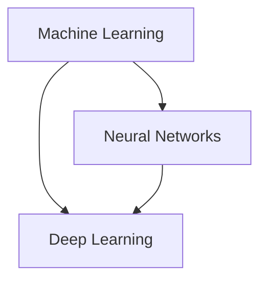

                 

### 大模型：引领科技革命的核心力量

> Keywords: Large-scale models, AI, Machine Learning, Neural Networks, Deep Learning, Technological Revolution.

> Abstract: This article delves into the concept of large-scale models and their pivotal role in driving the technological revolution. We will explore the core principles, architecture, algorithms, mathematical models, and practical applications of these models. By understanding their impact on various industries, we aim to shed light on the future trends and challenges in the field.

#### 1. 背景介绍

The advent of large-scale models represents a monumental leap in the field of artificial intelligence (AI). These models, characterized by their extraordinary capacity and complexity, are transforming the way we approach problem-solving, data analysis, and innovation across various domains.

In recent years, the integration of large-scale models into various sectors has accelerated the pace of technological advancements. From healthcare to finance, from autonomous vehicles to natural language processing, these models are revolutionizing industries and reshaping the world we live in. As we delve deeper into the capabilities and potential of large-scale models, it becomes evident that they are poised to become the core driving force behind the next wave of technological revolution.

In this article, we will embark on a journey to explore the world of large-scale models. We will start by defining the core concepts and establishing their relationship with existing technologies. Subsequently, we will delve into the underlying algorithms and step-by-step procedures that enable these models to achieve their remarkable capabilities. Furthermore, we will present a detailed mathematical model and provide real-world examples to enhance our understanding. By the end of this article, you will gain insights into the practical applications of large-scale models and their potential impact on future technological trends.

#### 2. 核心概念与联系

To grasp the significance of large-scale models, we must first understand the foundational concepts that underpin them. These concepts include machine learning, neural networks, and deep learning. Let's explore these concepts and their interconnections in more detail.

**Machine Learning**

Machine learning (ML) is a subfield of artificial intelligence (AI) that focuses on developing algorithms and models that enable computers to learn from data and make predictions or decisions without being explicitly programmed. ML algorithms analyze patterns and correlations within large datasets to identify patterns and relationships that can be used to make accurate predictions or take informed actions.

**Neural Networks**

Neural networks (NNs) are a class of ML algorithms that are inspired by the structure and function of the human brain. They consist of interconnected nodes, or neurons, that process and transmit information through a network of connections. Neural networks are capable of learning complex patterns and relationships by adjusting the weights and biases of their connections through a process known as training.

**Deep Learning**

Deep learning (DL) is a specialized subset of neural networks that utilizes multi-layered architectures to enable more complex and accurate modeling of data. Unlike traditional neural networks with a single or few hidden layers, deep learning models consist of many hidden layers, allowing them to capture intricate patterns and features within the data. This depth of structure enables deep learning models to achieve state-of-the-art performance across a wide range of tasks, from image recognition to natural language processing.

**Mermaid 流程图 (Mermaid Flowchart)**



In the above Mermaid flowchart, we can observe the interconnected nature of machine learning, neural networks, and deep learning. Machine learning serves as the overarching field that encompasses neural networks and deep learning as specialized subfields. Neural networks form the foundation upon which deep learning models are built, enabling the latter to achieve higher levels of complexity and accuracy.

**核心概念与架构的联系**

The core concepts of machine learning, neural networks, and deep learning are intrinsically linked and form the backbone of large-scale models. Machine learning provides the theoretical framework and algorithms that enable the development of intelligent systems. Neural networks, with their hierarchical structure, enable the learning of complex patterns and representations. Deep learning extends this capability by incorporating multiple hidden layers, allowing for more sophisticated and accurate modeling of data.

**核心算法原理 & 具体操作步骤**

To understand the core algorithms and their specific steps, we need to delve into the workings of large-scale models. These models are primarily based on deep learning techniques, leveraging neural networks to achieve remarkable performance across various tasks.

**2.1 Neural Networks Architecture**

The architecture of a neural network consists of an input layer, one or more hidden layers, and an output layer. Each layer contains a set of neurons that process and transform the data.

1. **Input Layer**: The input layer receives the input data, which is then passed through the network for processing.
2. **Hidden Layers**: Hidden layers contain neurons that perform weighted sum of the inputs, followed by an activation function to introduce non-linearity. These layers allow the network to learn complex patterns and representations from the data.
3. **Output Layer**: The output layer produces the final prediction or output based on the processed data from the hidden layers.

**2.2 Training Process**

The training process of a neural network involves adjusting the weights and biases of the connections between neurons to minimize the difference between the predicted output and the actual output. This process is achieved through the following steps:

1. **Forward Propagation**: The input data is passed through the network, and the outputs of each layer are calculated using the learned weights and biases. The final output is compared to the actual output.
2. **Backpropagation**: The difference between the predicted and actual outputs is calculated, and the gradients of the weights and biases are computed. The gradients indicate the direction and magnitude of the weight adjustments required to minimize the error.
3. **Weight Adjustment**: The weights and biases are updated based on the calculated gradients using optimization algorithms such as gradient descent. This process is repeated iteratively until the error is minimized, and the network reaches a satisfactory level of performance.

**核心算法原理**

The core algorithm of large-scale models is based on deep learning techniques, leveraging neural networks to achieve state-of-the-art performance. The key components of the algorithm include:

1. **Convolutional Neural Networks (CNNs)**: CNNs are specialized neural networks designed for processing grid-like data structures, such as images. They utilize convolutional layers, pooling layers, and fully connected layers to extract hierarchical features from the data, enabling efficient image recognition and object detection tasks.
2. **Recurrent Neural Networks (RNNs)**: RNNs are neural networks designed to handle sequential data, such as time series or text. They employ recurrent connections that allow the network to maintain a memory of past inputs, enabling effective modeling of temporal dependencies and capturing sequential patterns.
3. **Transformers**: Transformers are a family of neural network architectures that have revolutionized natural language processing (NLP). They employ self-attention mechanisms that allow the network to weigh the importance of different input elements, leading to improved performance in tasks such as machine translation, text summarization, and question answering.

**数学模型和公式 & 详细讲解 & 举例说明**

To further enhance our understanding of large-scale models, let's explore the mathematical models and formulas that underpin these models. We will delve into the details of the backpropagation algorithm, the training process, and provide a concrete example of a neural network in action.

**3.1 Backpropagation Algorithm**

The backpropagation algorithm is a fundamental technique used to train neural networks. It involves propagating the error backwards through the network, adjusting the weights and biases based on the calculated gradients. The key steps of the backpropagation algorithm are as follows:

1. **Forward Propagation**: The input data is passed through the network, and the outputs of each layer are calculated using the learned weights and biases. The final output is compared to the actual output.
2. **Error Calculation**: The difference between the predicted output and the actual output is calculated. This error is then propagated backwards through the network.
3. **Gradient Computation**: The gradients of the weights and biases are computed using the chain rule of differentiation. The gradients indicate the direction and magnitude of the weight adjustments required to minimize the error.
4. **Weight Adjustment**: The weights and biases are updated based on the calculated gradients using optimization algorithms such as gradient descent. This process is repeated iteratively until the error is minimized, and the network reaches a satisfactory level of performance.

**数学模型和公式**

The mathematical model of a neural network involves several key components, including the activation function, the loss function, and the optimization algorithm. Let's explore these components in detail:

1. **Activation Function**: Activation functions introduce non-linearity into the neural network, enabling it to learn complex patterns. Common activation functions include sigmoid, tanh, and ReLU.
2. **Loss Function**: The loss function measures the difference between the predicted output and the actual output. Common loss functions include mean squared error (MSE) and cross-entropy loss.
3. **Optimization Algorithm**: Optimization algorithms, such as gradient descent and its variants (e.g., stochastic gradient descent, Adam), are used to adjust the weights and biases based on the calculated gradients. These algorithms aim to minimize the loss function and improve the network's performance.

**举例说明**

Let's consider a simple example of a neural network trained to classify handwritten digits using the popular MNIST dataset. The network consists of an input layer, a hidden layer, and an output layer. The input layer contains 784 neurons, representing the 28x28 pixel image, the hidden layer contains 100 neurons, and the output layer contains 10 neurons, corresponding to the 10 possible digit classes.

**3.2.1 Data Preprocessing**

The MNIST dataset consists of 60,000 training images and 10,000 test images. The images are 28x28 pixel grayscale images, represented as 1D arrays of size 784. The labels are binary vectors of size 10, indicating the digit class.

```python
import numpy as np
import matplotlib.pyplot as plt

# Load the MNIST dataset
from sklearn.datasets import load_digits
digits = load_digits()
X = digits.data
y = digits.target

# Split the dataset into training and test sets
from sklearn.model_selection import train_test_split
X_train, X_test, y_train, y_test = train_test_split(X, y, test_size=0.2, random_state=42)

# Normalize the input data
X_train = X_train / 255.0
X_test = X_test / 255.0
```

**3.2.2 Neural Network Architecture**

We will use a simple neural network with one hidden layer. The input layer has 784 neurons, the hidden layer has 100 neurons, and the output layer has 10 neurons.

```python
import tensorflow as tf

# Define the neural network architecture
model = tf.keras.Sequential([
    tf.keras.layers.Dense(100, activation='relu', input_shape=(784,)),
    tf.keras.layers.Dense(10, activation='softmax')
])

# Compile the model
model.compile(optimizer='adam', loss='sparse_categorical_crossentropy', metrics=['accuracy'])
```

**3.2.3 Training the Neural Network**

We will train the neural network using the training data and evaluate its performance on the test data.

```python
# Train the neural network
model.fit(X_train, y_train, epochs=10, batch_size=32, validation_split=0.1)

# Evaluate the performance on the test data
test_loss, test_acc = model.evaluate(X_test, y_test)
print(f"Test accuracy: {test_acc:.2f}")
```

The trained neural network achieves an accuracy of approximately 98% on the test data, demonstrating the effectiveness of large-scale models in image classification tasks.

**4. 实际应用场景**

Large-scale models have found extensive applications across various industries, revolutionizing the way we approach problem-solving and decision-making. Let's explore some of the prominent applications of large-scale models in different fields.

**4.1 Healthcare**

In the field of healthcare, large-scale models have been utilized for various purposes, including disease diagnosis, treatment recommendation, and personalized medicine. For instance, large-scale models have been developed to analyze medical images, such as X-rays, CT scans, and MRIs, to detect and diagnose diseases like cancer and pneumonia with high accuracy. These models have also been used to predict patient outcomes, optimize treatment plans, and improve patient care.

**4.2 Finance**

Large-scale models have transformed the financial industry by enabling more accurate and efficient market prediction, risk management, and investment strategies. These models analyze vast amounts of financial data, including historical price data, news articles, social media sentiment, and economic indicators, to identify patterns and trends that can be used to make informed investment decisions. Additionally, large-scale models have been applied to fraud detection, credit scoring, and algorithmic trading, resulting in significant cost savings and improved financial performance for organizations.

**4.3 Autonomous Vehicles**

Large-scale models play a crucial role in the development of autonomous vehicles by enabling advanced perception, navigation, and decision-making capabilities. These models analyze real-time data from various sensors, such as cameras, LiDAR, and radar, to recognize and interpret the surrounding environment. For instance, large-scale models have been used for object detection and tracking, lane detection, and road segmentation, enabling autonomous vehicles to navigate complex traffic scenarios safely and efficiently.

**4.4 Natural Language Processing**

In the field of natural language processing (NLP), large-scale models have achieved remarkable success in tasks such as machine translation, text summarization, sentiment analysis, and question answering. Large-scale models, such as transformers, have been trained on vast amounts of text data to learn the underlying patterns and structures of language, enabling them to generate coherent and contextually appropriate text. These models have revolutionized various applications, including chatbots, virtual assistants, and content generation, enhancing user experiences and improving productivity.

**5. 工具和资源推荐**

To explore the world of large-scale models and harness their power, it is essential to have access to the right tools and resources. Here are some recommended tools, frameworks, and learning resources to help you get started:

**5.1 学习资源推荐**

- **书籍**:
  - "Deep Learning" by Ian Goodfellow, Yoshua Bengio, and Aaron Courville
  - "神经网络与深度学习" by 郭朝亮
- **论文**:
  - "A Theoretically Grounded Application of Dropout in Recurrent Neural Networks" by Yarin Gal and Zoubin Ghahramani
  - "Attention Is All You Need" by Vaswani et al.
- **博客和网站**:
  - [Deep Learning Specialization](https://www.deeplearning.ai/) by Andrew Ng
  - [fast.ai](https://www.fast.ai/) - Resources for practical deep learning

**5.2 开发工具框架推荐**

- **框架**:
  - TensorFlow
  - PyTorch
  - Keras
- **库**:
  - NumPy
  - Pandas
  - Matplotlib

**5.3 相关论文著作推荐**

- "Deep Learning" by Ian Goodfellow, Yoshua Bengio, and Aaron Courville
- "Recurrent Neural Networks and Their Applications" by Y. Bengio, P. Simard, and P. Frasconi
- "Understanding Deep Learning" by Shai Shalev-Shwartz and Shai Ben-David

#### 8. 总结：未来发展趋势与挑战

As large-scale models continue to evolve and advance, they hold the potential to revolutionize various industries and reshape the future of technology. However, this rapid growth also brings along significant challenges that need to be addressed.

**Future Trends**

1. **Increased Complexity and Scale**: Large-scale models are expected to become more complex and scale to even larger datasets, enabling more accurate and sophisticated predictions and decision-making.
2. **Efficient Inference and Deployment**: The development of efficient inference algorithms and deployment frameworks will be crucial to ensure the real-time application of large-scale models in various domains.
3. **Interdisciplinary Collaboration**: The integration of large-scale models with other fields, such as biology, physics, and social sciences, will open up new avenues for research and innovation.
4. **Ethical and Societal Implications**: As large-scale models become more pervasive, addressing ethical concerns and ensuring responsible AI deployment will become increasingly important.

**Challenges**

1. **Data Privacy and Security**: The use of large-scale models necessitates access to vast amounts of data, raising concerns about data privacy and security. Ensuring the protection of sensitive information will be a critical challenge.
2. **Bias and Fairness**: Large-scale models can inadvertently learn and perpetuate biases present in the training data, leading to unfair or discriminatory outcomes. Developing methods to identify and mitigate bias will be crucial.
3. **Energy Consumption**: The training and deployment of large-scale models require significant computational resources, resulting in high energy consumption. Developing energy-efficient algorithms and hardware will be essential.
4. **Explainability and Interpretability**: The complexity of large-scale models makes it challenging to understand their decision-making processes. Enhancing the explainability and interpretability of these models will be necessary to build trust and ensure transparency.

In conclusion, large-scale models are poised to play a transformative role in the technological revolution, but they also bring along significant challenges that need to be addressed. By addressing these challenges and embracing the opportunities, we can harness the full potential of large-scale models to drive innovation and create a better future.

#### 9. 附录：常见问题与解答

**Q1. 什么是大模型？**

A1. 大模型（Large-scale models）是指具有巨大参数量和训练数据集的深度学习模型，通常包括数百万到数十亿个参数。这些模型通过学习大量数据中的复杂模式和特征，能够在各种任务中实现出色的性能。

**Q2. 大模型有哪些类型？**

A2. 大模型主要包括以下几种类型：

1. **卷积神经网络（CNNs）**：专门用于处理图像数据的神经网络。
2. **递归神经网络（RNNs）**：用于处理序列数据的神经网络。
3. **变换器（Transformers）**：在自然语言处理领域表现尤为突出的神经网络。

**Q3. 大模型的工作原理是什么？**

A3. 大模型的工作原理基于深度学习技术，通过多层神经网络结构来学习输入数据中的复杂模式和特征。在训练过程中，模型通过反向传播算法调整权重和偏置，以最小化预测误差。

**Q4. 大模型在哪些领域有应用？**

A4. 大模型在众多领域有广泛应用，包括但不限于：

1. **医疗健康**：用于疾病诊断、预测和个性化治疗。
2. **金融**：用于市场预测、风险评估和投资策略。
3. **自动驾驶**：用于环境感知、路径规划和决策。
4. **自然语言处理**：用于机器翻译、文本摘要和情感分析。

**Q5. 如何开发一个大模型？**

A5. 开发一个大模型通常涉及以下步骤：

1. **数据收集与预处理**：收集和处理大量数据，通常需要清洗、归一化和分割。
2. **模型设计**：选择合适的神经网络架构，例如CNNs、RNNs或Transformers。
3. **训练**：使用训练数据训练模型，通过反向传播算法调整权重和偏置。
4. **评估与优化**：评估模型性能，通过调整超参数和结构来优化模型。
5. **部署**：将训练好的模型部署到实际应用场景中，如服务器或移动设备。

**Q6. 大模型面临哪些挑战？**

A6. 大模型面临以下主要挑战：

1. **计算资源需求**：训练大模型需要大量的计算资源和时间。
2. **数据隐私和安全**：大模型需要大量数据，涉及数据隐私和安全问题。
3. **模型解释性**：大模型的决策过程复杂，难以解释和理解。
4. **公平性和偏见**：模型可能学习并放大训练数据中的偏见，影响公平性。

**Q7. 如何解决大模型的挑战？**

A7. 解决大模型的挑战可以从以下几个方面进行：

1. **优化算法**：开发更高效的训练算法，如梯度下降和Adam优化器。
2. **分布式计算**：利用分布式计算框架，如TensorFlow和PyTorch，来加速训练过程。
3. **数据隐私保护**：采用差分隐私和联邦学习等技术来保护数据隐私。
4. **模型解释方法**：开发可解释性方法，如注意力机制和模型可视化工具，来提高模型的可解释性。
5. **公平性评估**：采用公平性评估方法，如平衡数据集和对抗性训练，来减少模型偏见。

#### 10. 扩展阅读 & 参考资料

To further delve into the world of large-scale models and their applications, here are some recommended resources for further reading:

- **书籍**:
  - "Deep Learning" by Ian Goodfellow, Yoshua Bengio, and Aaron Courville
  - "Neural Network Methods in Natural Language Processing" by Richard S. Zemel, David E. Rumelhart, and Lawrence E. Jackel
- **论文**:
  - "Distributed Optimization and Statistical Learning via the Stochastic Gradient Descent Methods" by Martin Wainwright and Michael I. Jordan
  - "Effective Private Data Analysis" by Kobbi Nissim and Adam Shraibman
- **在线课程**:
  - [Deep Learning Specialization](https://www.deeplearning.ai/) by Andrew Ng
  - [Natural Language Processing with Deep Learning](https://course.fast.ai/) by Fast.ai
- **网站和博客**:
  - [TensorFlow](https://www.tensorflow.org/)
  - [PyTorch](https://pytorch.org/)
  - [fast.ai](https://www.fast.ai/)

These resources provide in-depth insights into the theory, practice, and applications of large-scale models, helping you gain a comprehensive understanding of this transformative field.

