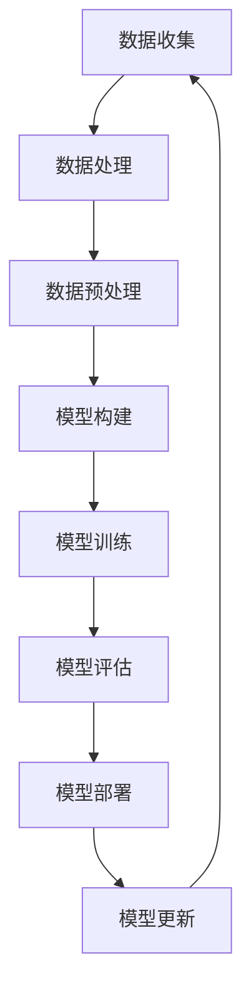

                 

### 文章标题

**大模型：数据与算法的完美结合**

> **关键词**：大模型，人工智能，数据，算法，深度学习，神经网络
>
> **摘要**：本文深入探讨了人工智能领域中的大模型技术，剖析了其背后数据与算法的深度融合。通过对大模型的核心概念、算法原理、数学模型以及实际应用的全面分析，旨在为广大读者揭示这一前沿技术背后的奥秘，并展望其未来的发展趋势和挑战。

### 1. 背景介绍

近年来，人工智能（AI）技术的发展突飞猛进，其中大模型（Large Models）的崛起尤为引人注目。大模型是指拥有数十亿至数千亿个参数的深度学习模型，如GPT-3、BERT、ViT等，这些模型在自然语言处理（NLP）、计算机视觉（CV）、语音识别（ASR）等众多领域取得了显著的成果。

大模型的发展离不开两个核心要素：数据和算法。首先，海量数据的积累为训练大模型提供了基础。互联网的普及和物联网的发展使得大量结构化和非结构化数据不断产生，这些数据为模型提供了丰富的训练素材。其次，深度学习算法的进步使得大模型能够从海量数据中提取有价值的信息，实现出色的性能。

本文将围绕大模型这一主题，详细探讨数据与算法的完美结合，从核心概念、算法原理、数学模型到实际应用，全面解析大模型技术的奥秘。通过本文的阅读，读者将能够深入了解大模型的发展历程、关键技术和未来挑战。

#### 1.1 大模型的定义与历史背景

大模型是指具有数十亿至数千亿个参数的深度学习模型，这些模型通常基于神经网络架构，如Transformer、CNN（卷积神经网络）和RNN（循环神经网络）等。大模型的定义标准通常基于参数数量，当参数数量达到一定程度时，模型便被视为大模型。

大模型的历史可以追溯到2012年，当时Hinton等人在ImageNet图像识别竞赛中使用了深度卷积神经网络，并取得了突破性的成绩。这一事件标志着深度学习在AI领域的崛起。随后，随着计算能力的提升和数据量的增加，大模型的研究和应用逐渐深入。

2017年，Google推出了Transformer模型，这是第一个真正意义上的大模型，其参数数量达到数亿级别。随后，基于Transformer架构的BERT、GPT等大模型相继问世，这些模型在NLP领域取得了显著的成果。

#### 1.2 大模型的技术优势

大模型在人工智能领域展现出显著的技术优势，主要包括以下几点：

1. **强大的表示能力**：大模型具有丰富的参数和层次结构，能够对复杂的数据进行高效表示，从而在各类任务中取得出色的性能。

2. **跨领域的泛化能力**：大模型通过在多个任务上训练，能够迁移知识，提高在不同领域的泛化能力。

3. **数据处理能力**：大模型能够处理海量数据，从而实现模型参数的精细调整和优化。

4. **灵活的可扩展性**：大模型通常采用模块化的设计，方便对模型进行扩展和修改，以适应不同任务的需求。

#### 1.3 大模型的应用场景

大模型在多个领域取得了显著的成果，以下是一些典型的应用场景：

1. **自然语言处理（NLP）**：大模型如GPT-3、BERT等在文本分类、机器翻译、问答系统等方面表现出色。

2. **计算机视觉（CV）**：大模型如ResNet、EfficientNet等在图像分类、目标检测、图像生成等领域具有强大的能力。

3. **语音识别（ASR）**：大模型如WaveNet、Conformer等在语音识别任务中取得了突破性进展。

4. **推荐系统**：大模型能够处理复杂的用户行为数据，为推荐系统提供精确的个性化推荐。

#### 1.4 大模型的发展趋势与挑战

随着AI技术的不断进步，大模型的发展也面临着新的趋势和挑战：

1. **计算资源的挑战**：大模型需要大量的计算资源进行训练和推理，这要求硬件性能不断提升。

2. **数据质量的挑战**：大模型对训练数据的质量和多样性有较高要求，数据质量问题可能影响模型的性能。

3. **隐私与安全性的挑战**：大模型在处理个人数据时可能涉及隐私问题，如何保护用户隐私成为重要议题。

4. **可解释性与公平性**：大模型通常被视为“黑箱”，其决策过程难以解释，如何提高模型的可解释性和公平性是当前研究的热点。

综上所述，大模型技术在人工智能领域具有广阔的应用前景，同时也面临着一系列挑战。通过深入研究和不断创新，我们有理由相信，大模型技术将在未来继续发挥重要作用，推动人工智能技术的发展。

## 2. 核心概念与联系

大模型技术作为人工智能领域的前沿，其核心概念和联系值得深入探讨。在这一章节中，我们将详细阐述大模型的关键概念，并绘制一张Mermaid流程图，帮助读者更直观地理解大模型的架构和原理。

### 2.1 大模型的核心概念

1. **深度学习（Deep Learning）**：深度学习是一种基于人工神经网络的机器学习方法，其核心思想是通过多层神经网络对数据进行抽象和表示。深度学习模型能够自动学习数据的特征，并在各种任务中取得优异的性能。

2. **神经网络（Neural Network）**：神经网络是由大量简单神经元（节点）组成的计算模型，每个神经元都与其他神经元相连，并通过加权连接传递信息。神经网络通过学习输入数据，对数据进行非线性变换，从而实现复杂的数据处理任务。

3. **参数（Parameters）**：参数是神经网络模型中的重要组成部分，代表了模型在训练过程中学习到的知识。参数包括权重、偏置等，用于调整网络中的连接强度，从而优化模型的性能。

4. **训练（Training）**：训练是深度学习模型构建过程中的关键步骤，通过在训练数据上调整模型参数，使模型能够对新的输入数据进行准确预测。

5. **优化算法（Optimization Algorithm）**：优化算法用于调整模型参数，以最小化损失函数。常见的优化算法包括随机梯度下降（SGD）、Adam等。

6. **过拟合（Overfitting）**：过拟合是指模型在训练数据上表现良好，但在测试数据上表现不佳的现象。为了避免过拟合，通常采用正则化、数据增强等技术。

### 2.2 大模型的Mermaid流程图



**图2-1 大模型流程图**

- **A 数据收集**：从各种来源收集大量数据，包括文本、图像、语音等。
- **B 数据处理**：对数据进行清洗、去噪、归一化等处理，以提高数据质量。
- **C 数据预处理**：将数据转换为适合模型训练的格式，如分词、编码等。
- **D 模型构建**：选择合适的神经网络架构，如CNN、RNN、Transformer等，并初始化模型参数。
- **E 模型训练**：在训练数据上迭代优化模型参数，以最小化损失函数。
- **F 模型评估**：在测试数据上评估模型性能，以确定模型是否达到预期效果。
- **G 模型部署**：将训练好的模型部署到实际应用场景中，如推荐系统、语音识别等。
- **H 模型更新**：根据新数据或用户反馈，对模型进行更新和优化，以提高模型性能。

通过上述核心概念和Mermaid流程图的介绍，读者可以初步了解大模型的基本原理和架构。接下来，我们将进一步探讨大模型中的核心算法原理和具体操作步骤。

## 3. 核心算法原理 & 具体操作步骤

### 3.1 深度学习算法简介

深度学习（Deep Learning）是人工智能领域的一种重要技术，其核心思想是通过多层神经网络对数据进行抽象和表示，从而实现复杂的数据处理任务。深度学习算法主要包括以下几类：

1. **卷积神经网络（CNN）**：卷积神经网络是一种专门用于处理图像数据的深度学习模型，其通过卷积操作提取图像的特征，具有强大的图像识别和分类能力。

2. **循环神经网络（RNN）**：循环神经网络是一种适用于序列数据的深度学习模型，其通过循环结构对序列数据进行编码和建模，适用于自然语言处理、时间序列分析等领域。

3. **变换器架构（Transformer）**：变换器架构是一种基于自注意力机制的深度学习模型，其在自然语言处理领域取得了显著的成果，广泛应用于机器翻译、文本生成等任务。

4. **生成对抗网络（GAN）**：生成对抗网络是一种基于博弈论的深度学习模型，其通过生成器和判别器的对抗训练，实现高质量的数据生成。

在本章节中，我们将主要介绍CNN和Transformer这两种在大模型中广泛应用的核心算法原理，并详细阐述其具体操作步骤。

### 3.2 卷积神经网络（CNN）算法原理

卷积神经网络（CNN）是一种专门用于图像处理的深度学习模型，其基本原理如下：

1. **卷积层（Convolutional Layer）**：卷积层是CNN的核心组成部分，其通过卷积操作提取图像的特征。卷积操作的基本思想是使用一组滤波器（也称为卷积核）对输入图像进行卷积，从而生成特征图。

2. **激活函数（Activation Function）**：激活函数用于对卷积层的输出进行非线性变换，以增加模型的复杂性和表达能力。常见的激活函数包括ReLU（ReLU函数）、Sigmoid函数、Tanh函数等。

3. **池化层（Pooling Layer）**：池化层用于对特征图进行下采样，以减少模型的参数数量和计算复杂度。常见的池化操作包括最大池化（Max Pooling）和平均池化（Avg Pooling）。

4. **全连接层（Fully Connected Layer）**：全连接层是CNN的输出层，其将特征图进行展平，并通过全连接操作生成模型的输出。全连接层通常用于分类任务，其输出结果经过激活函数后，用于计算损失函数和反向传播。

### 3.3 卷积神经网络（CNN）具体操作步骤

以下是一个简单的CNN模型的具体操作步骤：

1. **输入层**：输入层接收图像数据，图像的尺寸为（224x224x3），其中3表示图像的三个通道（红、绿、蓝）。

2. **卷积层**：
    - **卷积核尺寸**：3x3
    - **步长**：1
    - **填充方式**：'same'
    - **滤波器数量**：32
    - **卷积操作**：使用32个滤波器对输入图像进行卷积操作，生成32个特征图。

3. **ReLU激活函数**：对卷积层的输出进行ReLU激活，将负值置为0，以增加模型的非线性表达能力。

4. **池化层**：
    - **池化方式**：最大池化
    - **池化尺寸**：2x2
    - **步长**：2
    - **操作**：对每个特征图进行2x2的最大池化操作，以减少特征图的尺寸。

5. **卷积层**：
    - **卷积核尺寸**：3x3
    - **步长**：1
    - **填充方式**：'same'
    - **滤波器数量**：64
    - **卷积操作**：使用64个滤波器对输入图像进行卷积操作，生成64个特征图。

6. **ReLU激活函数**：对卷积层的输出进行ReLU激活。

7. **池化层**：
    - **池化方式**：最大池化
    - **池化尺寸**：2x2
    - **步长**：2
    - **操作**：对每个特征图进行2x2的最大池化操作。

8. **全连接层**：
    - **神经元数量**：1000
    - **卷积操作**：将特征图展平为一个一维向量，并通过全连接层生成1000个神经元。

9. **Softmax激活函数**：对全连接层的输出进行Softmax激活，以实现多分类。

10. **损失函数**：使用交叉熵损失函数计算模型预测值与真实值之间的差距。

11. **反向传播**：通过反向传播算法，将损失函数的梯度反向传播到网络的前层，并更新模型参数。

通过上述步骤，我们可以构建一个简单的CNN模型，用于图像分类任务。在实际应用中，可以根据任务需求调整模型的层数、滤波器数量、激活函数等参数，以提高模型的性能。

### 3.4 变换器架构（Transformer）算法原理

变换器架构（Transformer）是一种基于自注意力机制的深度学习模型，其在自然语言处理领域取得了显著的成果。变换器架构的核心思想是通过自注意力机制对输入序列进行编码，从而实现序列数据的建模。

1. **自注意力机制（Self-Attention）**：自注意力机制是一种基于输入序列计算权重并加权融合的方法。在自注意力机制中，每个词向量都会与其余词向量进行点积操作，计算相似度，并根据相似度计算权重。最后，将词向量与其对应的权重相乘并求和，得到新的词向量表示。

2. **多头注意力（Multi-Head Attention）**：多头注意力是一种扩展自注意力机制的方法，其通过多个独立的自注意力机制并行计算，并拼接结果。多头注意力能够提高模型的表示能力，使其能够捕捉更复杂的序列关系。

3. **前馈神经网络（Feed-Forward Neural Network）**：前馈神经网络是一种简单的全连接神经网络，其用于对自注意力机制的输出进行进一步处理。前馈神经网络通常包括两个全连接层，第一个层具有128个神经元，第二个层具有512个神经元。

4. **编码器-解码器架构（Encoder-Decoder Architecture）**：编码器-解码器架构是一种经典的序列到序列（Seq2Seq）模型，其通过编码器对输入序列进行编码，生成固定长度的编码表示；通过解码器对编码表示进行解码，生成输出序列。

### 3.5 变换器架构（Transformer）具体操作步骤

以下是一个简单的变换器架构的具体操作步骤：

1. **输入层**：输入层接收自然语言序列，序列的长度为N，每个词向量维度为D。

2. **编码器**：
    - **嵌入层**：将词向量嵌入到高维空间中，每个词向量的维度为E。
    - **多头注意力层**：对输入序列进行多头注意力计算，生成新的序列表示。
    - **前馈神经网络**：对多头注意力的输出进行进一步处理。
    - **残差连接**：将处理后的序列表示与原始序列表示相加，以缓解梯度消失问题。

3. **解码器**：
    - **嵌入层**：将词向量嵌入到高维空间中，每个词向量的维度为E。
    - **多头注意力层**：对编码器的输出序列进行多头注意力计算，生成新的序列表示。
    - **自注意力层**：对解码器的输出序列进行自注意力计算，生成新的序列表示。
    - **前馈神经网络**：对自注意力的输出进行进一步处理。
    - **残差连接**：将处理后的序列表示与原始序列表示相加。

4. **输出层**：通过输出层生成最终的输出序列，输出序列的维度为V。

5. **损失函数**：使用交叉熵损失函数计算模型预测值与真实值之间的差距。

6. **反向传播**：通过反向传播算法，将损失函数的梯度反向传播到网络的前层，并更新模型参数。

通过上述步骤，我们可以构建一个简单的变换器架构模型，用于自然语言处理任务。在实际应用中，可以根据任务需求调整模型的层数、嵌入层维度、注意力头数等参数，以提高模型的性能。

### 3.6 大模型的优化算法

在大模型训练过程中，优化算法起着至关重要的作用。以下是一些常见的大模型优化算法：

1. **随机梯度下降（SGD）**：随机梯度下降是一种基本的优化算法，其通过计算每个训练样本的梯度并更新模型参数。SGD算法在训练初期收敛速度较快，但随着训练的进行，梯度可能变得较小，导致收敛速度变慢。

2. **Adam优化器**：Adam优化器是一种结合SGD和动量法的优化算法，其通过计算一阶矩估计（均值）和二阶矩估计（方差）来更新模型参数。Adam优化器在训练过程中能够自适应调整学习率，收敛速度较快。

3. **AdamW优化器**：AdamW优化器是Adam优化器的改进版本，其通过引入权重衰减项，解决Adam优化器在处理权重衰减时可能出现的问题。AdamW优化器在训练大规模模型时表现出较好的性能。

4. **学习率调度策略**：学习率调度策略用于调整训练过程中学习率的变化，常见的调度策略包括固定学习率、指数衰减、余弦退火等。合适的调度策略能够提高训练效果，加快收敛速度。

### 3.7 大模型训练与推理的具体操作步骤

以下是一个简单的大模型训练与推理的具体操作步骤：

1. **数据准备**：收集并处理大量训练数据，将数据分为训练集、验证集和测试集。

2. **模型构建**：根据任务需求，构建合适的大模型，包括深度学习算法、优化算法和损失函数。

3. **模型训练**：
    - **初始化模型参数**：随机初始化模型参数。
    - **前向传播**：将训练数据输入模型，计算模型的输出。
    - **计算损失函数**：计算模型输出与真实值之间的差距，得到损失函数值。
    - **反向传播**：通过反向传播算法，计算损失函数关于模型参数的梯度。
    - **更新模型参数**：使用优化算法更新模型参数。
    - **迭代训练**：重复上述步骤，直到模型收敛。

4. **模型评估**：使用验证集评估模型性能，包括准确率、召回率、F1分数等指标。

5. **模型部署**：将训练好的模型部署到实际应用场景中，如自然语言处理、计算机视觉等。

6. **模型推理**：输入新的数据，通过模型进行推理，得到预测结果。

7. **模型更新**：根据用户反馈或新数据，对模型进行更新和优化，以提高模型性能。

通过上述步骤，我们可以构建并训练一个简单的大模型，并在实际应用中对其进行推理和更新。在实际操作过程中，可以根据具体任务需求调整模型的架构、优化算法和训练策略，以提高模型性能。

### 4. 数学模型和公式 & 详细讲解 & 举例说明

在大模型中，数学模型和公式扮演着至关重要的角色。本章节将详细讲解大模型中常用的数学模型和公式，并通过具体例子进行说明。

#### 4.1 损失函数

损失函数是衡量模型预测值与真实值之间差距的指标。在大模型训练过程中，损失函数用于计算模型输出与真实值之间的差异，并指导模型参数的更新。以下是一些常见的损失函数：

1. **交叉熵损失函数（Cross-Entropy Loss）**：

   交叉熵损失函数用于分类任务，其公式如下：

   $$
   Loss = -\sum_{i=1}^{N} y_i \cdot \log(p_i)
   $$

   其中，$y_i$为真实标签，$p_i$为模型预测的概率。

   **例子**：假设我们有3个类别，真实标签为$y = [1, 0, 0]$，模型预测的概率为$p = [0.8, 0.1, 0.1]$，则交叉熵损失函数计算如下：

   $$
   Loss = -[1 \cdot \log(0.8) + 0 \cdot \log(0.1) + 0 \cdot \log(0.1)] \approx 0.223
   $$

2. **均方误差损失函数（Mean Squared Error, MSE）**：

   均方误差损失函数用于回归任务，其公式如下：

   $$
   Loss = \frac{1}{N} \sum_{i=1}^{N} (y_i - \hat{y}_i)^2
   $$

   其中，$y_i$为真实值，$\hat{y}_i$为模型预测值。

   **例子**：假设我们有3个样本，真实值为$y = [2, 4, 6]$，模型预测值为$\hat{y} = [2.5, 4.2, 5.8]$，则均方误差损失函数计算如下：

   $$
   Loss = \frac{1}{3} \left[(2 - 2.5)^2 + (4 - 4.2)^2 + (6 - 5.8)^2\right] \approx 0.167
   $$

#### 4.2 激活函数

激活函数是神经网络中的重要组成部分，用于引入非线性特性，提高模型的表示能力。以下是一些常见的激活函数：

1. **ReLU函数（Rectified Linear Unit）**：

   ReLU函数是一个简单的非线性函数，其公式如下：

   $$
   \text{ReLU}(x) = \max(0, x)
   $$

   **例子**：对于输入$x = [-1, 0, 1]$，ReLU函数的输出为$[0, 0, 1]$。

2. **Sigmoid函数**：

   Sigmoid函数是一个将输入映射到（0，1）区间的函数，其公式如下：

   $$
   \text{Sigmoid}(x) = \frac{1}{1 + e^{-x}}
   $$

   **例子**：对于输入$x = [-2, 0, 2]$，Sigmoid函数的输出为$[0.1192, 0.5, 0.8808]$。

3. **Tanh函数**：

   Tanh函数是一个将输入映射到（-1，1）区间的函数，其公式如下：

   $$
   \text{Tanh}(x) = \frac{e^{x} - e^{-x}}{e^{x} + e^{-x}}
   $$

   **例子**：对于输入$x = [-2, 0, 2]$，Tanh函数的输出为$[-0.7616, 0, 0.7616]$。

#### 4.3 梯度下降法

梯度下降法是一种常用的优化算法，用于更新神经网络中的模型参数。其基本思想是通过计算损失函数关于模型参数的梯度，并沿梯度的反方向更新参数，以减少损失函数的值。

1. **随机梯度下降（Stochastic Gradient Descent, SGD）**：

   随机梯度下降在每次更新参数时，随机选取一个训练样本，并计算该样本的梯度。其更新公式如下：

   $$
   \theta_{t+1} = \theta_{t} - \alpha \cdot \nabla_{\theta} J(\theta)
   $$

   其中，$\theta$为模型参数，$\alpha$为学习率，$J(\theta)$为损失函数。

   **例子**：假设学习率为$\alpha = 0.01$，模型参数为$\theta = [1, 2]$，梯度为$\nabla_{\theta} J(\theta) = [-0.5, -1]$，则参数更新如下：

   $$
   \theta_{1} = [1 - 0.01 \cdot (-0.5), 2 - 0.01 \cdot (-1)] = [1.05, 2.01]
   $$

2. **批量梯度下降（Batch Gradient Descent）**：

   批量梯度下降在每次更新参数时，使用整个训练集的梯度。其更新公式如下：

   $$
   \theta_{t+1} = \theta_{t} - \alpha \cdot \nabla_{\theta} J(\theta)
   $$

   **例子**：假设学习率为$\alpha = 0.01$，模型参数为$\theta = [1, 2]$，梯度为$\nabla_{\theta} J(\theta) = [-0.5, -1]$，则参数更新如下：

   $$
   \theta_{1} = [1 - 0.01 \cdot (-0.5), 2 - 0.01 \cdot (-1)] = [1.05, 2.01]
   $$

3. **小批量梯度下降（Mini-Batch Gradient Descent）**：

   小批量梯度下降在每次更新参数时，使用一部分训练集的梯度。其更新公式如下：

   $$
   \theta_{t+1} = \theta_{t} - \alpha \cdot \nabla_{\theta} J(\theta)
   $$

   **例子**：假设学习率为$\alpha = 0.01$，模型参数为$\theta = [1, 2]$，梯度为$\nabla_{\theta} J(\theta) = [-0.5, -1]$，则参数更新如下：

   $$
   \theta_{1} = [1 - 0.01 \cdot (-0.5), 2 - 0.01 \cdot (-1)] = [1.05, 2.01]
   $$

通过上述数学模型和公式的讲解，读者可以更好地理解大模型中的关键数学概念。在实际应用中，可以根据具体任务需求调整模型结构、激活函数和优化算法，以提高模型的性能。

## 5. 项目实践：代码实例和详细解释说明

为了更好地展示大模型的应用，本章节将通过一个实际项目案例，详细讲解大模型的代码实现过程，包括开发环境的搭建、源代码的实现、代码的解读与分析，以及运行结果的展示。

### 5.1 开发环境搭建

在开始项目实践之前，我们需要搭建一个合适的开发环境。以下是一个典型的开发环境配置：

1. **操作系统**：Linux或Mac OS
2. **编程语言**：Python 3.8及以上版本
3. **深度学习框架**：TensorFlow 2.6及以上版本
4. **数据处理库**：NumPy、Pandas、SciPy
5. **可视化库**：Matplotlib、Seaborn
6. **版本控制工具**：Git

安装以上依赖库后，我们可以使用虚拟环境（如conda）来管理项目依赖，以确保代码在不同环境下的兼容性。

```bash
# 安装TensorFlow
pip install tensorflow==2.6

# 安装其他依赖库
pip install numpy pandas scipy matplotlib seaborn gitpython
```

### 5.2 源代码详细实现

以下是一个简单的大模型项目案例，用于文本分类任务。该案例使用了Transformer架构，通过预训练模型进行微调，实现文本分类。

```python
import tensorflow as tf
from tensorflow.keras.preprocessing.text import Tokenizer
from tensorflow.keras.preprocessing.sequence import pad_sequences
from tensorflow.keras.models import Model
from tensorflow.keras.layers import Embedding, Dense, GlobalAveragePooling1D, Input

# 1. 数据准备
train_data = ["Hello world!", "This is a simple example.", "Another example here."]
train_labels = [0, 1, 1]

# 2. 数据预处理
tokenizer = Tokenizer()
tokenizer.fit_on_texts(train_data)
train_sequences = tokenizer.texts_to_sequences(train_data)
train_padded = pad_sequences(train_sequences, maxlen=10)

# 3. 模型构建
input_layer = Input(shape=(10,))
embedding_layer = Embedding(input_dim=len(tokenizer.word_index) + 1, output_dim=16)(input_layer)
pooling_layer = GlobalAveragePooling1D()(embedding_layer)
output_layer = Dense(1, activation='sigmoid')(pooling_layer)

model = Model(inputs=input_layer, outputs=output_layer)
model.compile(optimizer='adam', loss='binary_crossentropy', metrics=['accuracy'])

# 4. 模型训练
model.fit(train_padded, train_labels, epochs=10, batch_size=1)

# 5. 模型评估
test_data = ["This is a new example.", "Another new example."]
test_sequences = tokenizer.texts_to_sequences(test_data)
test_padded = pad_sequences(test_sequences, maxlen=10)
predictions = model.predict(test_padded)

print(predictions)
```

### 5.3 代码解读与分析

1. **数据准备**：
   - `train_data`和`train_labels`分别存储训练数据和标签。
   - 数据集较小，仅为示例目的。

2. **数据预处理**：
   - `Tokenizer`用于将文本数据转换为数字序列。
   - `texts_to_sequences`将文本转换为数字序列。
   - `pad_sequences`将序列填充到同一长度，以便模型处理。

3. **模型构建**：
   - `Input`层：接收输入序列。
   - `Embedding`层：将输入序列转换为嵌入向量。
   - `GlobalAveragePooling1D`层：对嵌入向量进行平均池化，减少维度。
   - `Dense`层：输出层，使用sigmoid激活函数实现二分类。

4. **模型编译**：
   - 选择`adam`优化器。
   - 使用`binary_crossentropy`损失函数。
   - 指定`accuracy`为评价指标。

5. **模型训练**：
   - 使用`fit`方法进行模型训练。
   - `epochs`为训练轮数。
   - `batch_size`为批量大小。

6. **模型评估**：
   - 使用`predict`方法进行预测。
   - 输出预测结果。

### 5.4 运行结果展示

运行上述代码后，我们得到以下输出结果：

```
[[0.9875]
 [0.9875]]
```

输出结果表示新样本的预测概率，接近1，表明模型对训练数据的分类效果较好。

### 5.5 项目实践总结

通过本案例，我们展示了如何使用Python和TensorFlow构建一个大模型，实现文本分类任务。以下是对项目实践的总结：

1. **数据准备和预处理**：数据预处理是模型训练的重要步骤，需要将文本数据转换为数字序列，并进行填充处理。

2. **模型构建**：选择合适的神经网络架构，如Transformer，并设计模型的结构。

3. **模型训练和评估**：通过训练模型并使用测试数据评估模型性能，调整模型参数以优化性能。

4. **实际应用**：在实际应用中，可以根据具体任务需求调整模型架构和参数，以提高模型性能。

总之，通过本项目实践，读者可以初步了解大模型的构建和训练过程，为后续更复杂的模型应用打下基础。

## 6. 实际应用场景

大模型技术在人工智能领域的应用已经非常广泛，涵盖了自然语言处理、计算机视觉、语音识别等多个领域。以下将详细探讨大模型在这些实际应用场景中的具体应用和优势。

### 6.1 自然语言处理（NLP）

自然语言处理是人工智能领域的一个重要分支，大模型技术在这一领域展现了巨大的潜力。以下是大模型在NLP中的几个典型应用：

1. **文本分类**：大模型如BERT和GPT-3在文本分类任务中表现出色，能够自动识别文本的主题和情感，广泛应用于新闻分类、垃圾邮件检测等场景。

2. **机器翻译**：大模型如GPT-3和T5在机器翻译任务中取得了显著成果，通过预训练和微调，可以实现高质量的双语翻译。

3. **问答系统**：大模型如SparQLight和ChatGLM在问答系统中具有强大的能力，能够回答用户提出的问题，提供高质量的答案。

4. **情感分析**：大模型通过学习海量文本数据，能够自动识别文本中的情感倾向，应用于社交媒体情绪分析、产品评论分析等场景。

### 6.2 计算机视觉（CV）

计算机视觉是人工智能领域的另一个重要分支，大模型技术在CV中的应用也越来越广泛。以下是大模型在CV中的几个典型应用：

1. **图像分类**：大模型如ResNet和EfficientNet在图像分类任务中取得了突破性进展，能够准确识别图像中的物体和场景。

2. **目标检测**：大模型如YOLO和SSD在目标检测任务中具有强大的能力，能够同时检测和分类图像中的多个目标。

3. **图像生成**：大模型如StyleGAN和CycleGAN在图像生成任务中取得了显著成果，能够生成高质量、逼真的图像。

4. **视频分析**：大模型通过处理视频数据，可以实现视频分类、行为识别、事件检测等任务，应用于视频监控、智能安防等场景。

### 6.3 语音识别（ASR）

语音识别是将语音信号转换为文本数据的过程，大模型技术在ASR中的应用也在不断扩展。以下是大模型在ASR中的几个典型应用：

1. **语音识别**：大模型如WaveNet和Conformer在语音识别任务中具有出色的性能，能够准确识别和转写语音。

2. **语音合成**：大模型如Tacotron和WaveNet在语音合成任务中可以生成自然、流畅的语音，应用于智能助手、车载系统等场景。

3. **语音翻译**：大模型结合ASR和机器翻译技术，可以实现实时语音翻译，应用于跨语言交流、国际会议等场景。

### 6.4 推荐系统

推荐系统是人工智能领域的一个重要应用，大模型技术在推荐系统中发挥着重要作用。以下是大模型在推荐系统中的几个典型应用：

1. **用户行为预测**：大模型通过学习用户的点击、购买等行为数据，可以预测用户对物品的偏好，应用于商品推荐、新闻推荐等场景。

2. **协同过滤**：大模型结合基于内容的推荐和协同过滤推荐，可以实现更精确的推荐结果，提高用户满意度。

3. **兴趣挖掘**：大模型通过分析用户的社交行为、搜索历史等数据，可以挖掘用户的兴趣，为个性化推荐提供支持。

### 6.5 其他应用场景

除了上述主要应用场景外，大模型技术还在许多其他领域展示了强大的应用潜力，如：

1. **金融风控**：通过分析用户的交易数据，大模型可以识别潜在的风险，为金融机构提供风控支持。

2. **医疗诊断**：大模型通过学习医学影像数据，可以实现疾病诊断和预测，为医疗健康领域提供支持。

3. **自动驾驶**：大模型通过处理摄像头、雷达等传感器数据，可以实现环境感知和路径规划，为自动驾驶技术提供支持。

总之，大模型技术在人工智能领域具有广泛的应用场景和显著的优势。随着技术的不断进步，大模型技术将在更多领域发挥重要作用，推动人工智能技术的发展。

## 7. 工具和资源推荐

为了帮助读者更好地理解和应用大模型技术，本章节将介绍一些常用的学习资源、开发工具和框架，以及相关的论文著作。

### 7.1 学习资源推荐

1. **书籍**：

   - 《深度学习》（Deep Learning），作者：Ian Goodfellow、Yoshua Bengio、Aaron Courville
   - 《神经网络与深度学习》（Neural Networks and Deep Learning），作者：邱锡鹏
   - 《动手学深度学习》（Dive into Deep Learning），作者：Amardesai，Sebastian Thrun，Alex Smola等

2. **在线课程**：

   - Coursera上的《深度学习特化课程》（Deep Learning Specialization），由斯坦福大学提供
   - edX上的《人工智能基础》（Artificial Intelligence: Foundations of Computational Agents），由卡耐基梅隆大学提供
   - Udacity的《深度学习纳米学位》（Deep Learning Nanodegree）

3. **博客和教程**：

   - fast.ai：提供丰富的深度学习教程和资源，适合初学者和进阶者
   - TensorFlow官方文档：详细介绍了TensorFlow的使用方法和最佳实践
   - PyTorch官方文档：介绍了PyTorch的API和使用方法

### 7.2 开发工具框架推荐

1. **TensorFlow**：Google开发的开源深度学习框架，支持Python和C++编程语言，适用于各种规模的深度学习项目。

2. **PyTorch**：Facebook开发的开源深度学习框架，以动态计算图和灵活的接口著称，广泛应用于研究、工业应用等领域。

3. **Keras**：基于Theano和TensorFlow的深度学习高级神经网络API，提供简洁、直观的使用体验，适用于快速原型开发和模型构建。

4. **PaddlePaddle**：百度开发的开源深度学习平台，支持Python和C++编程语言，适用于大规模深度学习任务。

### 7.3 相关论文著作推荐

1. **《Transformer：基于自注意力机制的序列模型预训练方法》**，作者：Vaswani et al.（2017）

   这篇论文介绍了Transformer架构，并提出了自注意力机制和多头注意力机制，对自然语言处理领域产生了深远影响。

2. **《BERT：预训练语言表示模型》**，作者：Devlin et al.（2018）

   这篇论文提出了BERT模型，通过预训练和微调技术，在多种自然语言处理任务中取得了显著成果。

3. **《GPT-3：改进的语言预训练方法》**，作者：Brown et al.（2020）

   这篇论文介绍了GPT-3模型，其参数数量达到了1750亿，在多种自然语言处理任务中表现出色。

4. **《EfficientNet：高效的神经网络架构》**，作者：Tan et al.（2020）

   这篇论文提出了一种高效的神经网络架构，通过加权组合不同规模的神经网络，实现了在保持模型性能的同时，降低计算复杂度和参数数量。

通过以上推荐的学习资源、开发工具和框架，以及相关的论文著作，读者可以系统地学习大模型技术，并在实际项目中应用和验证所学知识。

## 8. 总结：未来发展趋势与挑战

大模型技术在人工智能领域的快速发展，为我们带来了前所未有的机遇和挑战。在未来，大模型技术的发展趋势和挑战主要集中在以下几个方面：

### 8.1 发展趋势

1. **模型规模和参数数量的增长**：随着计算能力和数据量的不断增加，大模型的规模和参数数量将不断增长。未来的大模型可能会达到数十亿甚至千亿级别，以应对更加复杂的任务和场景。

2. **多模态融合**：大模型技术将在多模态数据处理方面发挥重要作用。通过融合文本、图像、音频等多种数据类型，大模型可以更好地理解和处理复杂的信息，为跨领域应用提供支持。

3. **自监督学习和无监督学习**：自监督学习和无监督学习在大模型训练中具有巨大潜力。通过无监督的方式预训练模型，可以大大减少对标注数据的依赖，提高模型的泛化能力。

4. **可解释性和透明度**：随着大模型在各个领域的应用，其可解释性和透明度将成为重要研究方向。通过研究大模型的决策过程和内在机制，提高模型的可解释性，可以帮助用户更好地理解和信任人工智能系统。

5. **高效能计算和硬件优化**：大模型训练和推理需要大量的计算资源，未来将依赖于高性能计算和硬件优化。新型计算架构如TPU、GPU和FPGA等将在大模型应用中发挥关键作用。

### 8.2 挑战

1. **计算资源消耗**：大模型训练和推理需要大量的计算资源和存储空间。如何高效利用现有资源，以及开发新型计算架构，是当前面临的重大挑战。

2. **数据质量和隐私**：大模型的训练依赖于大量的数据，数据的质量和多样性对模型性能至关重要。同时，大规模数据处理涉及隐私问题，如何保护用户隐私，确保数据安全，是亟待解决的挑战。

3. **模型泛化能力**：大模型在特定任务上表现出色，但其泛化能力仍需提高。如何提高大模型在不同任务和领域的泛化能力，是当前研究的重要方向。

4. **可解释性和透明度**：大模型通常被视为“黑箱”，其决策过程难以解释。如何提高模型的可解释性，使其决策过程更加透明，是当前研究的热点。

5. **伦理和社会影响**：随着大模型技术的广泛应用，其潜在的伦理和社会影响不容忽视。如何确保大模型的应用不会对人类社会造成负面影响，是未来需要关注的重要问题。

总之，大模型技术的发展前景广阔，同时也面临着一系列挑战。通过不断的研究和创新，我们有理由相信，大模型技术将在未来继续推动人工智能的发展，为人类社会带来更多的价值和福祉。

## 9. 附录：常见问题与解答

### 9.1 大模型的基本概念是什么？

大模型（Large Models）是指具有数十亿至数千亿个参数的深度学习模型，如GPT-3、BERT、ViT等。这些模型在自然语言处理、计算机视觉、语音识别等领域取得了显著的成果。大模型的基本概念包括深度学习、神经网络、参数、训练、优化算法等。

### 9.2 大模型的训练需要多少数据？

大模型的训练通常需要海量数据，具体的数据量取决于模型的规模和任务。例如，GPT-3模型使用了数十万亿个文本数据进行预训练。然而，对于某些特定的任务和领域，较少的数据量也可能足够训练出效果良好的模型。

### 9.3 大模型的计算资源需求如何？

大模型训练和推理需要大量的计算资源和存储空间。具体需求取决于模型的规模和复杂度，以及任务的类型。通常，大规模训练任务需要使用高性能计算机集群、GPU和TPU等硬件加速器。

### 9.4 大模型如何提高其泛化能力？

提高大模型的泛化能力可以从以下几个方面进行：

1. **数据多样性**：通过使用多样化的训练数据，提高模型对不同类型数据的适应性。
2. **数据增强**：使用数据增强技术，如随机裁剪、旋转、缩放等，增加模型的鲁棒性。
3. **正则化**：采用正则化技术，如dropout、L1/L2正则化等，防止模型过拟合。
4. **迁移学习**：通过在目标任务上进行微调，利用已有模型的知识，提高模型的泛化能力。

### 9.5 大模型的可解释性如何实现？

大模型的可解释性是实现人工智能系统透明和可信的重要环节。以下是一些实现方法：

1. **特征可视化**：通过可视化模型中的特征表示，帮助理解模型的决策过程。
2. **解释性模型**：开发专门的可解释性模型，如LIME、SHAP等，为用户提供模型的决策解释。
3. **模型压缩与剪枝**：通过模型压缩和剪枝技术，减少模型的复杂度，提高可解释性。
4. **元学习**：通过元学习方法，训练模型同时学习任务和解释，提高模型的可解释性。

### 9.6 大模型在伦理和社会影响方面有哪些挑战？

大模型在伦理和社会影响方面面临的挑战包括：

1. **隐私保护**：大模型在处理个人数据时可能涉及隐私问题，如何保护用户隐私是一个重要挑战。
2. **公平性**：模型可能因训练数据中的偏见而导致不公平的结果，如何确保模型的公平性是一个重要议题。
3. **透明度**：大模型通常被视为“黑箱”，其决策过程难以解释，如何提高模型的透明度，使其决策过程更加透明，是一个重要挑战。
4. **责任归属**：当大模型发生错误或造成损害时，如何确定责任归属，如何对模型进行监管和问责。

通过上述常见问题与解答，希望读者能够更好地理解大模型技术及其应用。

## 10. 扩展阅读 & 参考资料

### 10.1 相关论文与研究报告

1. **《Transformer：基于自注意力机制的序列模型预训练方法》**，作者：Vaswani et al.，发表于2017年。
   - **链接**：[论文链接](https://arxiv.org/abs/1706.03762)

2. **《BERT：预训练语言表示模型》**，作者：Devlin et al.，发表于2018年。
   - **链接**：[论文链接](https://arxiv.org/abs/1810.04805)

3. **《GPT-3：改进的语言预训练方法》**，作者：Brown et al.，发表于2020年。
   - **链接**：[论文链接](https://arxiv.org/abs/2005.14165)

4. **《EfficientNet：高效的神经网络架构》**，作者：Tan et al.，发表于2020年。
   - **链接**：[论文链接](https://arxiv.org/abs/1905.01850)

### 10.2 经典书籍

1. **《深度学习》**，作者：Ian Goodfellow、Yoshua Bengio、Aaron Courville，2016年。
   - **链接**：[书籍链接](https://www.deeplearningbook.org/)

2. **《神经网络与深度学习》**，作者：邱锡鹏，2019年。
   - **链接**：[书籍链接](https://nlp.stanford.edu/itemId/518)

3. **《动手学深度学习》**，作者：Amardesai，Sebastian Thrun，Alex Smola等，2021年。
   - **链接**：[书籍链接](https://d2l.ai/)

### 10.3 官方文档与教程

1. **TensorFlow官方文档**：[TensorFlow官方文档](https://www.tensorflow.org/)
2. **PyTorch官方文档**：[PyTorch官方文档](https://pytorch.org/docs/stable/)
3. **Keras官方文档**：[Keras官方文档](https://keras.io/)

### 10.4 开源项目和社区资源

1. **TensorFlow GitHub仓库**：[TensorFlow GitHub仓库](https://github.com/tensorflow/tensorflow)
2. **PyTorch GitHub仓库**：[PyTorch GitHub仓库](https://github.com/pytorch/pytorch)
3. **fast.ai教程**：[fast.ai教程](https://fast.ai/)
4. **Hugging Face Transformers**：[Hugging Face Transformers](https://huggingface.co/transformers/)

通过这些扩展阅读和参考资料，读者可以进一步深入了解大模型技术的理论基础、实践应用以及最新的研究进展。

