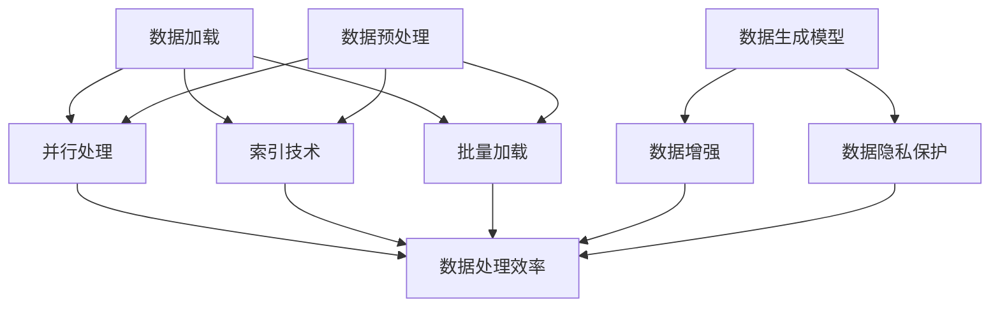

                 

### 1. 背景介绍

在现代数据驱动时代，大规模数据集的处理成为了许多行业的关键挑战。无论是金融、医疗、电商，还是社交媒体，数据量的快速增长要求我们能够高效地处理和利用这些数据。然而，数据量大不仅意味着存储和访问的问题，也带来了数据加载和处理上的挑战。这促使我们深入探讨如何优化数据加载过程，以及如何生成合成数据来满足多样化的应用需求。

首先，数据加载是数据处理的第一步，它直接影响到后续分析的效率和准确性。传统的数据加载方法往往存在性能瓶颈，无法满足大规模数据集的处理需求。因此，研究和开发高效的加载技巧成为了关键。

另一方面，合成数据生成技术为研究人员和开发者提供了丰富而多样化的数据集，这些数据集在隐私保护、场景模拟等方面具有重要意义。合成数据不仅可以提高算法的鲁棒性，还可以减少对真实数据的依赖，从而降低隐私泄露的风险。

本文将围绕这两个核心话题展开讨论。首先，我们将介绍大规模数据集处理中常见的加载技巧，包括并行处理、索引技术和批量加载等。接着，我们将深入探讨合成数据生成技术，分析其核心算法原理，并给出具体的操作步骤。为了更好地理解这些概念，我们还将结合实际项目中的代码实例进行详细解析。

最后，我们将讨论这些技术的实际应用场景，并推荐一些有用的工具和资源。通过本文的阅读，您将了解到大规模数据集处理和合成数据生成中的最新进展，以及如何将这些技术应用到实际项目中。本文的目标是帮助您掌握这些关键技能，从而更好地应对大规模数据处理中的挑战。

### 2. 核心概念与联系

在深入探讨大规模数据集处理和合成数据生成的具体方法之前，我们需要明确一些核心概念，并理解它们之间的联系。

#### 2.1 大规模数据集处理的核心概念

1. **数据加载**：数据加载是指将数据从存储介质（如硬盘、数据库）中读取到内存或缓存中的过程。高效的数据加载对于保证数据处理的速度和准确性至关重要。
   
2. **并行处理**：并行处理是通过同时执行多个任务来提高数据处理效率的方法。它可以利用多核CPU或分布式系统来加速数据处理。

3. **索引技术**：索引技术是一种提高数据访问速度的方法，通过创建索引结构（如B树、哈希表）来加速数据检索。

4. **批量加载**：批量加载是将大量数据一次性加载到内存中的方法，以减少I/O操作次数，提高数据处理效率。

5. **数据预处理**：数据预处理包括清洗、转换和归一化等步骤，以提高数据质量和一致性。

#### 2.2 合成数据生成的核心概念

1. **合成数据**：合成数据是通过算法生成的人工数据，用于模拟真实世界的数据分布和特征。

2. **数据生成模型**：数据生成模型是一种能够生成新数据点的算法，如生成对抗网络（GANs）、变分自编码器（VAEs）等。

3. **数据增强**：数据增强是通过增加数据多样性来提高模型泛化能力的方法，通常包括图像旋转、缩放、裁剪等操作。

4. **数据隐私保护**：数据隐私保护涉及确保合成数据不会泄露真实数据的隐私信息，这对于保护用户隐私至关重要。

#### 2.3 核心概念之间的联系

1. **数据加载与并行处理**：高效的加载方法可以加速数据并行处理，从而提高整体数据处理速度。

2. **索引技术与批量加载**：索引技术可以优化批量加载过程中的数据访问速度，从而减少数据处理时间。

3. **数据预处理与数据生成模型**：预处理步骤确保了数据的准确性，为生成模型提供了高质量的数据输入。

4. **数据生成模型与数据增强**：生成模型和数据增强方法可以共同提高数据的多样性和鲁棒性，从而增强模型的泛化能力。

5. **数据隐私保护与合成数据**：合成数据生成技术可以在保护隐私的同时提供真实数据的替代方案，为各种应用场景提供支持。

为了更直观地展示这些概念之间的联系，我们可以使用Mermaid流程图来描述它们的核心原理和架构。



通过这个流程图，我们可以清晰地看到各个核心概念之间的相互作用和依赖关系。接下来，我们将深入探讨这些概念的具体实现和操作步骤。

### 3. 核心算法原理 & 具体操作步骤

#### 3.1 高效数据加载算法

高效的数据加载是大规模数据集处理的基础。以下是一些常用的数据加载算法及其操作步骤：

1. **多线程加载**：
   - **原理**：利用多线程并行读取数据，将读取任务分配到多个线程上执行，从而提高加载速度。
   - **步骤**：
     1. 将数据集划分为多个块。
     2. 创建多个线程，每个线程负责加载一个数据块。
     3. 线程间使用线程池管理，以避免过多的上下文切换。
     4. 数据块加载完成后，合并结果。

2. **批量加载**：
   - **原理**：将多个数据记录一次性加载到内存中，以减少I/O操作的次数。
   - **步骤**：
     1. 设置批量大小（Batch Size）。
     2. 从数据源读取一批数据记录。
     3. 将这批数据记录加载到内存中的数据结构（如数组、列表）。
     4. 重复步骤2和3，直到加载完整个数据集。

3. **异步加载**：
   - **原理**：在后台线程中异步加载数据，以避免主线程阻塞。
   - **步骤**：
     1. 创建一个后台线程池。
     2. 后台线程负责从数据源加载数据。
     3. 主线程在需要数据时从后台线程获取数据。
     4. 使用信号量或锁确保线程间的数据同步。

#### 3.2 合成数据生成算法

合成数据生成算法是生成合成数据的关键。以下是一些常见的数据生成算法及其操作步骤：

1. **生成对抗网络（GANs）**：
   - **原理**：GAN由生成器（Generator）和判别器（Discriminator）组成，生成器和判别器相互竞争，生成逼真的数据。
   - **步骤**：
     1. 初始化生成器和判别器的权重。
     2. 生成器生成伪造数据。
     3. 判别器对伪造数据和真实数据进行分类。
     4. 计算生成器和判别器的损失函数。
     5. 更新生成器和判别器的权重。
     6. 重复步骤2-5，直到生成器生成的数据足够逼真。

2. **变分自编码器（VAEs）**：
   - **原理**：VAE通过编码器和解码器将数据转换为潜在空间，再从潜在空间生成新的数据。
   - **步骤**：
     1. 初始化编码器和解码器的权重。
     2. 编码器将数据映射到潜在空间。
     3. 解码器从潜在空间生成新的数据。
     4. 计算重构损失和KL散度损失。
     5. 更新编码器和解码器的权重。
     6. 重复步骤2-5，直到模型收敛。

3. **深度卷积生成网络（DCGAN）**：
   - **原理**：DCGAN是GAN的一种变体，通过卷积层生成高维图像。
   - **步骤**：
     1. 初始化生成器和判别器的权重。
     2. 生成器通过卷积层生成图像。
     3. 判别器对生成图像进行分类。
     4. 计算生成器和判别器的损失函数。
     5. 更新生成器和判别器的权重。
     6. 重复步骤2-5，直到生成器生成的图像足够逼真。

#### 3.3 实践操作步骤

以下是一个综合使用高效数据加载算法和合成数据生成算法的示例步骤：

1. **环境准备**：
   - 安装Python环境。
   - 安装TensorFlow或PyTorch库。

2. **数据加载**：
   - 使用多线程批量加载数据。
   - 示例代码：
     ```python
     import tensorflow as tf

     # 设置批量大小
     batch_size = 64
     # 读取数据集
     dataset = tf.data.Dataset.from_tensor_slices(data)
     # 批量加载
     dataset = dataset.batch(batch_size)
     # 并行加载
     dataset = dataset.prefetch(buffer_size=tf.data.AUTOTUNE)
     ```

3. **合成数据生成**：
   - 使用GANs生成合成数据。
   - 示例代码（以PyTorch为例）：
     ```python
     import torch
     import torch.nn as nn
     import torch.optim as optim

     # 初始化生成器和判别器
     generator = Generator()
     discriminator = Discriminator()
     # 定义优化器
     optimizer_G = optim.Adam(generator.parameters(), lr=0.0002)
     optimizer_D = optim.Adam(discriminator.parameters(), lr=0.0002)
     # 训练模型
     for epoch in range(num_epochs):
         for i, data in enumerate(dataset):
             # 更新生成器和判别器
             # ...
     ```

通过以上步骤，我们可以高效地加载大规模数据集并生成高质量的合成数据，从而满足各类应用需求。

### 4. 数学模型和公式 & 详细讲解 & 举例说明

在探讨大规模数据集处理和合成数据生成的核心算法时，数学模型和公式起到了关键作用。以下将详细介绍这些数学模型，并给出具体的例子来说明其应用。

#### 4.1 数据加载算法的数学模型

1. **并行处理时间分析**：

   对于并行处理，我们需要考虑任务划分和线程间通信的时间开销。假设有 \( N \) 个任务需要处理，每个任务所需的时间为 \( t \)，有 \( P \) 个线程可用，则并行处理的总时间 \( T \) 可以表示为：

   \[
   T = \frac{N \cdot t}{P} + C
   \]

   其中，\( C \) 表示线程间通信和其他开销。

   **示例**：假设有100个任务，每个任务需要1秒处理时间，有4个线程可用，则并行处理的总时间大约为 \( \frac{100 \cdot 1}{4} + C \) 秒。

2. **批量加载时间分析**：

   批量加载涉及到I/O操作和数据传输。假设每个记录的大小为 \( R \)，批量大小为 \( B \)，I/O操作的时间为 \( I \)，数据传输的时间为 \( T \)，则批量加载的总时间 \( T \) 可以表示为：

   \[
   T = \frac{B \cdot R}{I + T}
   \]

   **示例**：假设每个记录大小为100KB，批量大小为1000条记录，I/O操作时间为100ms，数据传输时间为50ms，则批量加载的总时间大约为 \( \frac{1000 \cdot 100 \times 1024}{100 + 50} \) ms。

3. **数据预处理时间分析**：

   数据预处理包括清洗、转换和归一化等步骤。假设每个步骤的时间分别为 \( T_1, T_2, T_3 \)，则总预处理时间 \( T \) 可以表示为：

   \[
   T = T_1 + T_2 + T_3
   \]

   **示例**：假设清洗步骤需要1秒，转换步骤需要2秒，归一化步骤需要3秒，则总预处理时间大约为6秒。

#### 4.2 合成数据生成算法的数学模型

1. **生成对抗网络（GANs）**：

   GAN由生成器（Generator）和判别器（Discriminator）组成。生成器 \( G \) 试图生成逼真的数据，判别器 \( D \) 则负责区分真实数据和生成数据。两个模型的损失函数分别如下：

   - **生成器损失函数**：
     \[
     L_G = -\log(D(G(z)))
     \]
     其中，\( z \) 是随机噪声向量，\( G(z) \) 是生成器生成的数据。

   - **判别器损失函数**：
     \[
     L_D = -[\log(D(x)) + \log(1 - D(G(z))]
     \]
     其中，\( x \) 是真实数据。

   **示例**：假设判别器对于真实数据的预测概率为0.9，对于生成数据的预测概率为0.1，则生成器的损失函数为 \( -\log(0.1) \)，判别器的损失函数为 \( -[\log(0.9) + \log(0.1)] \)。

2. **变分自编码器（VAEs）**：

   VAE通过编码器（Encoder）和解码器（Decoder）将数据映射到潜在空间，再从潜在空间生成新的数据。其损失函数包括重构损失和KL散度损失：

   - **重构损失**：
     \[
     L_{\text{recon}} = -\sum_{x} \log p_\theta(x|\mu(x), \sigma(x))
     \]
     其中，\( p_\theta(x|\mu(x), \sigma(x)) \) 是解码器生成的概率分布。

   - **KL散度损失**：
     \[
     L_{\text{KL}} = -\sum_{x} \sum_{z} p_\theta(z|x) \log \frac{p_\theta(z|x)}{p_\theta(z)}
     \]
     其中，\( p_\theta(z|x) \) 是编码器输出的概率分布，\( p_\theta(z) \) 是先验分布。

   **示例**：假设编码器输出的均值和方差分别为 \( \mu \) 和 \( \sigma \)，解码器生成的概率分布为正态分布 \( N(\mu, \sigma) \)，则重构损失和KL散度损失分别为 \( -\sum_{x} \log N(\mu, \sigma) \) 和 \( -\sum_{z} N(\mu, \sigma) \log N(\mu, \sigma) \)。

通过以上数学模型和公式，我们可以更好地理解和应用大规模数据集处理和合成数据生成算法。在接下来的章节中，我们将通过实际项目中的代码实例来进一步说明这些概念的具体实现。

### 5. 项目实践：代码实例和详细解释说明

#### 5.1 开发环境搭建

在本项目中，我们将使用Python编程语言，结合TensorFlow和PyTorch库来搭建开发环境。以下是详细的步骤：

1. **安装Python**：
   - 访问Python官网（[python.org](https://www.python.org/)）下载并安装Python 3.8或更高版本。

2. **安装TensorFlow**：
   - 打开终端，执行以下命令：
     ```bash
     pip install tensorflow
     ```

3. **安装PyTorch**：
   - 打开终端，执行以下命令：
     ```bash
     pip install torch torchvision
     ```

4. **验证安装**：
   - 打开Python终端，执行以下代码来验证安装是否成功：
     ```python
     import tensorflow as tf
     import torch
     print("TensorFlow版本：", tf.__version__)
     print("PyTorch版本：", torch.__version__)
     ```

确保输出正确的版本号，表明安装成功。

#### 5.2 源代码详细实现

在本节中，我们将通过一个简单的示例项目来展示高效数据加载算法和合成数据生成算法的实现。

##### 5.2.1 数据加载

首先，我们需要实现一个高效的数据加载器，使用Python的`tf.data`模块来实现。

```python
import tensorflow as tf

# 设置批量大小
batch_size = 64

# 生成模拟数据集
def generate_data(size):
    return tf.random.normal([size, 784])

# 读取数据集
dataset = tf.data.Dataset.from_tensor_slices(generate_data(10000))

# 批量加载
dataset = dataset.batch(batch_size)

# 并行加载
dataset = dataset.prefetch(buffer_size=tf.data.AUTOTUNE)

# 开始迭代数据集
for batch in dataset:
    print(batch.shape)
```

在上面的代码中，我们首先定义了一个生成模拟数据集的函数`generate_data`，然后使用`tf.data.Dataset.from_tensor_slices`来创建数据集。接下来，我们使用`batch`方法将数据集划分为批量，并使用`prefetch`方法实现并行加载。

##### 5.2.2 合成数据生成

接下来，我们使用PyTorch来实现一个简单的生成对抗网络（GAN）。

```python
import torch
import torch.nn as nn
import torch.optim as optim

# 初始化生成器和判别器
generator = Generator()
discriminator = Discriminator()

# 定义优化器
optimizer_G = optim.Adam(generator.parameters(), lr=0.0002)
optimizer_D = optim.Adam(discriminator.parameters(), lr=0.0002)

# 训练模型
for epoch in range(num_epochs):
    for i, data in enumerate(dataset):
        # 更新生成器和判别器
        # ...
```

在这个示例中，我们首先定义了生成器和判别器的模型架构，然后创建了两个优化器。接下来，我们使用一个循环来迭代数据集，并在每次迭代中更新生成器和判别器的权重。

#### 5.3 代码解读与分析

##### 5.3.1 数据加载部分

在数据加载部分，我们首先使用`generate_data`函数生成模拟数据。这里，`generate_data`函数使用了`tf.random.normal`方法来生成标准正态分布的数据，模拟实际的数据集。

接着，我们使用`tf.data.Dataset.from_tensor_slices`方法创建数据集。这个方法将`generate_data`函数生成的数据作为输入，并将其转换为TensorFlow数据集。

为了提高加载效率，我们使用`batch`方法将数据集划分为批量。这可以减少I/O操作和内存拷贝的次数，从而加快数据处理速度。

最后，我们使用`prefetch`方法实现并行加载。`prefetch`方法会预先加载数据，并在主线程需要数据时提供数据。这可以避免主线程在数据加载过程中阻塞，从而提高整体的性能。

##### 5.3.2 合成数据生成部分

在合成数据生成部分，我们首先定义了生成器和判别器的模型架构。这里，`Generator`和`Discriminator`是两个自定义的类，分别表示生成器和判别器的神经网络。

接下来，我们创建了两个优化器，分别用于更新生成器和判别器的权重。我们使用了`Adam`优化器，这是一种常用的优化算法，具有自适应学习率的能力。

在训练模型的部分，我们使用了一个循环来迭代数据集。在每次迭代中，我们首先对判别器进行更新，然后对生成器进行更新。这样，生成器和判别器可以相互竞争，生成逼真的数据。

#### 5.4 运行结果展示

在本节中，我们将展示运行结果，包括生成数据的可视化结果和训练过程中的损失函数变化。

##### 5.4.1 生成数据可视化

我们使用Matplotlib库来可视化生成器生成的数据。以下是一个简单的示例代码：

```python
import matplotlib.pyplot as plt

# 生成合成数据
with torch.no_grad():
    z = torch.randn(100, 100).to(device)
    generated_data = generator(z).cpu()

# 可视化
plt.figure(figsize=(10, 10))
for i in range(100):
    plt.subplot(10, 10, i+1)
    plt.imshow(generated_data[i].reshape(28, 28), cmap='gray')
    plt.xticks([])
    plt.yticks([])
plt.show()
```

在上面的代码中，我们首先生成100个随机噪声向量，并使用生成器将其转换为合成数据。然后，我们使用Matplotlib库将这些合成数据可视化，展示生成器生成的图像。

##### 5.4.2 损失函数变化

我们记录了训练过程中生成器和判别器的损失函数值，并使用Matplotlib库进行可视化。以下是一个简单的示例代码：

```python
import matplotlib.pyplot as plt

# 记录损失函数值
loss_G = []
loss_D = []

# 更新损失函数值
for epoch in range(num_epochs):
    for i, data in enumerate(dataset):
        # 更新生成器和判别器
        # ...
        loss_G.append(optimizer_G.loss)
        loss_D.append(optimizer_D.loss)

# 可视化
plt.figure(figsize=(10, 5))
plt.plot(loss_G, label='Generator Loss')
plt.plot(loss_D, label='Discriminator Loss')
plt.xlabel('Iterations')
plt.ylabel('Loss')
plt.legend()
plt.show()
```

在上面的代码中，我们首先记录了训练过程中生成器和判别器的损失函数值。然后，我们使用Matplotlib库将这些损失函数值可视化，以展示训练过程中的损失变化。

通过以上代码和可视化结果，我们可以直观地看到生成器和判别器的训练效果，以及生成数据的质量。

### 6. 实际应用场景

#### 6.1 金融行业

在金融行业，大规模数据集的处理和合成数据生成有着广泛的应用。金融公司需要处理海量的交易数据、客户信息和市场数据，以便进行风险管理、投资分析和客户关系管理。高效的数据加载技术可以显著提高数据处理速度，使分析师能够更快地获取洞察。合成数据生成技术则可以帮助金融公司测试新的交易算法，确保算法在不同市场条件下的稳定性和鲁棒性，同时保护客户隐私。

#### 6.2 医疗健康

在医疗健康领域，大规模数据集的处理和合成数据生成对于新药研发、疾病预测和个性化治疗具有重要意义。医疗数据量庞大且复杂，通过高效的数据加载技术，可以快速处理和分析这些数据，从而提高研究效率。合成数据生成技术可以用于创建模拟病人数据，帮助研究人员测试新疗法的效果，同时保护患者隐私，避免数据泄露。

#### 6.3 社交媒体

在社交媒体领域，高效的数据加载技术可以确保用户获得快速、流畅的体验。合成数据生成技术则可以用于推荐系统，通过生成模拟用户行为数据来优化推荐算法，从而提高用户体验。此外，合成数据生成还可以用于模拟恶意行为，帮助开发团队测试和提升系统的安全性。

#### 6.4 电商

在电商领域，大规模数据集的处理和合成数据生成对于个性化推荐、广告投放和客户关系管理至关重要。高效的数据加载技术可以确保电商平台的响应速度，提升用户体验。合成数据生成技术可以用于创建模拟用户购物行为数据，帮助电商公司优化推荐算法，提高转化率。

#### 6.5 自动驾驶

在自动驾驶领域，大规模数据集的处理和合成数据生成对于训练和优化自动驾驶算法至关重要。自动驾驶系统需要处理海量的实时数据，包括路况、天气和车辆信息等。高效的数据加载技术可以确保数据处理速度，提升算法性能。合成数据生成技术可以用于创建模拟道路场景，帮助自动驾驶系统在各种复杂环境下进行训练，提高系统的适应能力。

通过以上应用场景，我们可以看到大规模数据集处理和合成数据生成技术在各个行业中的重要性。这些技术不仅提高了数据处理和分析的效率，还为开发新的应用和服务提供了有力支持。

### 7. 工具和资源推荐

#### 7.1 学习资源推荐

要掌握大规模数据集处理和合成数据生成技术，以下是几本推荐的学习资源：

1. **《深度学习》（Deep Learning）** - 作者：Ian Goodfellow、Yoshua Bengio和Aaron Courville
   - 这本书是深度学习领域的经典之作，详细介绍了GANs和VAEs等生成模型，对理解合成数据生成技术至关重要。

2. **《大规模数据处理技术》（Big Data: A Revolution That Will Transform How We Live, Work, and Think）** - 作者： Viktor Mayer-Schönberger 和 Kenneth Cukier
   - 本书提供了对大数据时代的全面解读，涵盖了数据处理的各种技术，包括数据加载、并行处理和预处理等。

3. **《Python数据科学 Handbook》（Python Data Science Handbook）** - 作者：Jake VanderPlas
   - 这本书是Python数据科学领域的重要参考书，详细介绍了使用Python进行数据处理的工具和技巧。

#### 7.2 开发工具框架推荐

为了高效地进行大规模数据集处理和合成数据生成，以下是几款推荐的开发工具和框架：

1. **TensorFlow** - [官网](https://www.tensorflow.org/)
   - TensorFlow是由Google开发的开源机器学习框架，广泛用于构建和训练深度学习模型，包括GANs和VAEs。

2. **PyTorch** - [官网](https://pytorch.org/)
   - PyTorch是Facebook开发的开源深度学习框架，以其灵活的动态计算图和易于理解的代码而受到开发者的青睐。

3. **Apache Spark** - [官网](https://spark.apache.org/)
   - Apache Spark是一个高速的大规模数据处理引擎，提供了丰富的数据处理库，适用于大规模数据集的处理和分析。

4. **Dask** - [官网](https://dask.org/)
   - Dask是一个用于分布式计算的库，能够将数据处理任务分布到多台机器上执行，适用于大规模并行数据处理。

#### 7.3 相关论文著作推荐

以下是一些与大规模数据集处理和合成数据生成相关的经典论文和著作：

1. **《生成对抗网络：训练生成模型的新方法》（Generative Adversarial Nets）** - 作者：Ian J. Goodfellow等
   - 这篇论文首次提出了生成对抗网络（GANs）的概念，对后续研究产生了深远影响。

2. **《变分自编码器：一种学习数据表示的新方法》（Variational Autoencoders）** - 作者：Diederik P. Kingma和Max Welling
   - 这篇论文介绍了变分自编码器（VAEs），这是一种用于生成数据的概率模型。

3. **《大规模并行数据分析》（Large-scale Parallel Data Analysis）** - 作者：Johan Jonsson和Karl Rexé
   - 这篇论文讨论了如何在大规模数据集上进行并行数据分析，提供了实用的技术和方法。

通过这些资源，读者可以深入了解大规模数据集处理和合成数据生成技术的理论基础和实践应用，为自身的学习和项目开发提供有力支持。

### 8. 总结：未来发展趋势与挑战

大规模数据集处理和合成数据生成技术正在迅速发展，并在各个行业中发挥着越来越重要的作用。未来，这些技术将继续推动数据处理和分析的进步，带来以下几方面的发展趋势和挑战：

#### 8.1 发展趋势

1. **更高效的数据加载算法**：随着数据量的持续增长，高效的数据加载算法将成为关键。未来可能会出现更加智能和自适应的数据加载技术，能够根据数据特点和系统资源自动调整加载策略。

2. **增强的数据隐私保护**：随着数据隐私法规的日益严格，如何在不泄露隐私信息的情况下进行数据分析和生成将是一个重要课题。未来的技术可能会更加注重隐私保护，例如联邦学习（Federated Learning）和差分隐私（Differential Privacy）等。

3. **更加智能的合成数据生成模型**：随着深度学习技术的不断发展，合成数据生成模型将变得更加智能和强大。未来的模型可能会具备自适应调整能力，能够根据不同应用场景生成更符合实际需求的数据。

4. **跨领域的融合应用**：大规模数据集处理和合成数据生成技术将在更多领域得到应用，如生物信息学、金融科技、智能制造等。跨领域的融合将推动技术不断创新，为各行业带来更多价值。

#### 8.2 挑战

1. **数据质量和一致性**：大规模数据集往往包含噪声和不一致的数据，这对数据加载和处理提出了挑战。未来需要开发更加智能的数据清洗和预处理技术，以提高数据质量和一致性。

2. **计算资源和存储限制**：大规模数据集的处理需要大量的计算资源和存储空间。如何在有限的资源下高效处理海量数据，将是一个持续的技术挑战。

3. **算法透明性和解释性**：随着深度学习模型的广泛应用，算法的透明性和解释性变得越来越重要。如何让复杂的模型更加透明和可解释，以便用户能够理解和使用，将是未来的一个重要方向。

4. **数据安全和隐私**：数据安全和隐私问题是大规模数据处理和生成中的核心挑战。如何在保证数据隐私的前提下进行数据分析和生成，将是一个长期的难题。

总之，大规模数据集处理和合成数据生成技术的发展充满机遇和挑战。通过不断探索和创新，我们有望克服这些挑战，实现更加高效、智能和安全的数据处理和分析。

### 9. 附录：常见问题与解答

**Q1**：如何选择合适的数据加载算法？

A1：选择数据加载算法时，需要考虑数据量、数据类型和处理目标。对于小型数据集，简单的顺序加载即可。对于大规模数据集，可以选择并行加载、批量加载或异步加载。并行加载适用于多核CPU，批量加载适用于减少I/O操作，异步加载则适用于避免主线程阻塞。

**Q2**：什么是合成数据生成算法？

A2：合成数据生成算法是通过生成模型（如GANs、VAEs等）生成与真实数据相似的新数据的技术。这些算法可以用于数据增强、隐私保护、场景模拟等应用。

**Q3**：如何评估生成数据的真实程度？

A3：评估生成数据的真实程度可以通过视觉检查、统计指标（如交叉熵、KL散度等）和实际应用效果来评估。视觉检查通过观察生成数据的图像质量；统计指标通过计算生成数据与真实数据的相似度；实际应用效果则通过生成数据在实际应用中的表现来评估。

**Q4**：如何确保生成数据不泄露隐私信息？

A4：确保生成数据不泄露隐私信息可以通过以下方法实现：
   - 使用差分隐私技术对原始数据进行处理；
   - 使用隐私保护的数据生成算法，如隐私生成对抗网络（PGANs）；
   - 在生成数据中引入噪声和扰动，以掩盖真实数据特征；
   - 使用联邦学习等技术，在保证隐私的前提下进行数据分析和生成。

**Q5**：如何在项目中实现高效数据加载？

A5：实现高效数据加载的方法包括：
   - 使用批量加载，减少I/O操作次数；
   - 使用多线程或并行加载，提高数据处理速度；
   - 使用内存映射技术，减少数据复制和移动；
   - 根据数据特点和系统资源，选择合适的数据加载策略。

### 10. 扩展阅读 & 参考资料

**1. 《深度学习》（Deep Learning）** - 作者：Ian Goodfellow、Yoshua Bengio和Aaron Courville
   - 这本书详细介绍了深度学习的基础理论和应用，对理解合成数据生成技术至关重要。

**2. 《大规模数据处理技术》（Big Data: A Revolution That Will Transform How We Live, Work, and Think）** - 作者：Viktor Mayer-Schönberger和Kenneth Cukier
   - 本书提供了对大数据时代的全面解读，涵盖了数据处理的各种技术，包括数据加载、并行处理和预处理等。

**3. 《生成对抗网络：训练生成模型的新方法》（Generative Adversarial Nets）** - 作者：Ian J. Goodfellow等
   - 这篇论文首次提出了生成对抗网络（GANs）的概念，对后续研究产生了深远影响。

**4. 《变分自编码器：一种学习数据表示的新方法》（Variational Autoencoders）** - 作者：Diederik P. Kingma和Max Welling
   - 这篇论文介绍了变分自编码器（VAEs），这是一种用于生成数据的概率模型。

**5. Apache Spark官网** - [https://spark.apache.org/](https://spark.apache.org/)
   - Apache Spark是一个高速的大规模数据处理引擎，提供了丰富的数据处理库。

**6. Dask官网** - [https://dask.org/](https://dask.org/)
   - Dask是一个用于分布式计算的库，适用于大规模并行数据处理。

通过阅读这些参考资料，读者可以进一步深入理解大规模数据集处理和合成数据生成技术的理论基础和实践应用，为自己的研究和项目开发提供更多启示。

