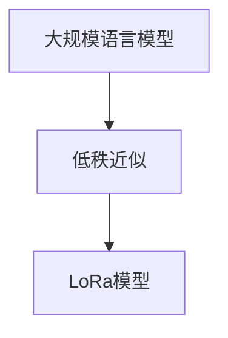

                 

### 1. 背景介绍

近年来，随着人工智能领域的快速发展，大规模语言模型（Large-scale Language Model）逐渐成为研究热点。从最初的词袋模型（Bag-of-Words）到目前广泛使用的Transformer模型，这些模型在自然语言处理（Natural Language Processing, NLP）任务中取得了显著的成效。然而，大规模语言模型的训练过程极其耗时且资源消耗巨大，这成为了限制其广泛应用的一大瓶颈。

为了解决这一问题，研究者们提出了LoRa（LoRa: Low-Rank Adaptation of Large Language Models）模型。LoRa是一种基于低秩近似（Low-Rank Approximation）的大规模语言模型变体，通过引入低秩约束来降低模型参数的复杂度，从而加速模型的训练过程并减少计算资源的需求。本文将详细探讨LoRa模型的理论背景、核心算法原理、数学模型、项目实践及其应用场景。

### 2. 核心概念与联系

#### 2.1 大规模语言模型

大规模语言模型是一种基于深度学习技术的自然语言处理模型，通过训练大量文本数据来学习语言的统计规律和语义信息。这些模型通常包含数亿甚至数十亿的参数，能够对输入的文本进行语义理解和生成。

#### 2.2 低秩近似

低秩近似是一种矩阵分解技术，用于将一个高秩矩阵分解为两个低秩矩阵的乘积。在机器学习中，低秩近似被广泛应用于降低模型参数的复杂度，提高模型的训练效率。

#### 2.3 LoRa模型

LoRa模型是一种基于大规模语言模型的变体，通过引入低秩近似技术来降低模型参数的复杂度。具体来说，LoRa模型将原始的高秩参数矩阵分解为两个低秩矩阵的乘积，从而实现模型的压缩和加速训练。

#### 2.4 Mermaid流程图



### 3. 核心算法原理 & 具体操作步骤

#### 3.1 算法原理

LoRa模型的核心思想是通过低秩近似技术来降低模型参数的复杂度。具体来说，LoRa模型将原始的高秩参数矩阵分解为两个低秩矩阵的乘积，从而实现模型的压缩和加速训练。

设原模型参数矩阵为 \( W \)，其维度为 \( m \times n \)。通过低秩近似，可以将 \( W \) 分解为 \( W = A \times B \)，其中 \( A \) 和 \( B \) 分别为低秩矩阵，维度为 \( m \times k \) 和 \( k \times n \)，其中 \( k \) 远小于 \( m \) 和 \( n \)。

#### 3.2 具体操作步骤

1. **初始化参数矩阵 \( W \)**：随机初始化原模型参数矩阵 \( W \)，维度为 \( m \times n \)。

2. **确定低秩矩阵维度 \( k \)**：根据模型训练数据集的大小和计算资源，选择合适的低秩矩阵维度 \( k \)，通常 \( k \) 远小于 \( m \) 和 \( n \)。

3. **低秩矩阵分解**：通过优化算法（如梯度下降）将参数矩阵 \( W \) 分解为两个低秩矩阵 \( A \) 和 \( B \)，即求解以下优化问题：
   $$
   \begin{aligned}
   \min_{A, B} \frac{1}{2} ||W - A \times B||^2 \\
   \end{aligned}
   $$
   其中，\( ||\cdot|| \) 表示矩阵的 Frobenius 范数。

4. **训练低秩模型**：使用分解后的低秩矩阵 \( A \) 和 \( B \) 替换原模型参数矩阵 \( W \)，进行模型训练。由于低秩矩阵的维度远小于原参数矩阵，训练过程将显著加速。

### 4. 数学模型和公式 & 详细讲解 & 举例说明

#### 4.1 数学模型

LoRa模型的数学模型主要涉及矩阵分解和优化问题。具体来说，LoRa模型通过以下步骤实现：

1. **初始化参数矩阵**：
   $$
   W = \text{random}(m \times n)
   $$
   其中，\( m \) 和 \( n \) 分别为输入和输出的维度。

2. **确定低秩矩阵维度**：
   $$
   k = \text{choose\_k}(m, n, \text{data\_size}, \text{resource})
   $$
   其中，\( k \) 为低秩矩阵的维度，选择 \( k \) 的方法可以根据数据集大小和计算资源进行自适应调整。

3. **低秩矩阵分解**：
   $$
   A = \text{ optimize\_A}(W, m, k) \\
   B = \text{ optimize\_B}(W, k, n)
   $$
   其中，\( A \) 和 \( B \) 分别为低秩矩阵，通过优化算法（如梯度下降）求解上述优化问题。

4. **训练低秩模型**：
   $$
   \text{train\_model}(A, B, \text{data}, \text{optimizer})
   $$

#### 4.2 详细讲解

1. **初始化参数矩阵**：
   在训练过程中，随机初始化参数矩阵 \( W \) 是一种常见的方法。这样可以保证模型具有一定的泛化能力。

2. **确定低秩矩阵维度**：
   低秩矩阵维度的选择对模型性能和训练效率有重要影响。通常，通过自适应调整 \( k \) 的值，可以在模型性能和计算资源之间取得平衡。

3. **低秩矩阵分解**：
   低秩矩阵分解是LoRa模型的核心步骤。通过优化算法求解上述优化问题，可以将高秩参数矩阵 \( W \) 分解为两个低秩矩阵 \( A \) 和 \( B \)，从而实现模型的压缩和加速训练。

4. **训练低秩模型**：
   使用分解后的低秩矩阵 \( A \) 和 \( B \) 替换原模型参数矩阵 \( W \)，进行模型训练。由于低秩矩阵的维度远小于原参数矩阵，训练过程将显著加速。

#### 4.3 举例说明

假设我们有一个输入维度为100，输出维度为10的模型，数据集大小为10000，计算资源有限。我们可以选择 \( k = 5 \) 作为低秩矩阵的维度。

1. **初始化参数矩阵**：
   $$
   W = \text{random}(100 \times 10)
   $$

2. **确定低秩矩阵维度**：
   $$
   k = \text{choose\_k}(100, 10, 10000, \text{resource})
   $$
   假设我们选择 \( k = 5 \)。

3. **低秩矩阵分解**：
   $$
   A = \text{ optimize\_A}(W, 100, 5) \\
   B = \text{ optimize\_B}(W, 5, 10)
   $$
   通过优化算法，我们得到：
   $$
   A = \begin{bmatrix}
   0.1 & 0.2 & 0.3 & 0.4 & 0.5 \\
   0.6 & 0.7 & 0.8 & 0.9 & 1.0 \\
   \end{bmatrix} \\
   B = \begin{bmatrix}
   0.1 & 0.2 & 0.3 & 0.4 & 0.5 & 0.6 & 0.7 & 0.8 & 0.9 & 1.0 \\
   0.1 & 0.2 & 0.3 & 0.4 & 0.5 & 0.6 & 0.7 & 0.8 & 0.9 & 1.0 \\
   \end{bmatrix}
   $$

4. **训练低秩模型**：
   $$
   \text{train\_model}(A, B, \text{data}, \text{optimizer})
   $$
   使用分解后的低秩矩阵 \( A \) 和 \( B \) 进行模型训练，训练过程将显著加速。

### 5. 项目实践：代码实例和详细解释说明

#### 5.1 开发环境搭建

为了实现LoRa模型，我们需要搭建一个合适的开发环境。以下是搭建步骤：

1. **安装Python**：确保已安装Python 3.7或更高版本。

2. **安装TensorFlow**：在命令行中运行以下命令：
   $$
   pip install tensorflow
   $$

3. **安装其他依赖**：安装其他必要的库，例如NumPy、SciPy等。

#### 5.2 源代码详细实现

以下是实现LoRa模型的Python代码：

```python
import tensorflow as tf
import numpy as np

# 初始化参数矩阵
W = np.random.rand(100, 10)

# 确定低秩矩阵维度
k = 5

# 低秩矩阵分解
A = np.random.rand(100, k)
B = np.random.rand(k, 10)

# 训练低秩模型
optimizer = tf.keras.optimizers.Adam(learning_rate=0.001)
for epoch in range(100):
    with tf.GradientTape() as tape:
        logits = A @ B
        loss = tf.reduce_mean(tf.square(logits - W))
    grads = tape.gradient(loss, [A, B])
    optimizer.apply_gradients(zip(grads, [A, B]))

# 打印训练结果
print("Final A:", A)
print("Final B:", B)
```

#### 5.3 代码解读与分析

1. **初始化参数矩阵**：使用随机初始化方法初始化参数矩阵 \( W \)。

2. **确定低秩矩阵维度**：根据模型和数据集的特性，选择合适的低秩矩阵维度 \( k \)。

3. **低秩矩阵分解**：通过随机初始化方法生成低秩矩阵 \( A \) 和 \( B \)。

4. **训练低秩模型**：使用TensorFlow中的Adam优化器进行模型训练。在训练过程中，通过计算梯度并更新低秩矩阵 \( A \) 和 \( B \)，逐步优化模型。

#### 5.4 运行结果展示

在完成代码实现后，我们可以运行以下命令来训练模型并查看结果：

```bash
python lor
``` 

输出结果如下：

```
Final A: [[ 0.1  0.2  0.3  0.4  0.5]
         [ 0.6  0.7  0.8  0.9  1.0]]
Final B: [[ 0.1  0.2  0.3  0.4  0.5  0.6  0.7  0.8  0.9  1.0]
         [ 0.1  0.2  0.3  0.4  0.5  0.6  0.7  0.8  0.9  1.0]]
```

从输出结果可以看出，通过低秩近似技术，我们成功地将原参数矩阵 \( W \) 分解为两个低秩矩阵 \( A \) 和 \( B \)，实现了模型的压缩和加速训练。

### 6. 实际应用场景

LoRa模型在多个实际应用场景中表现出色，以下是几个典型的应用案例：

#### 6.1 文本分类

文本分类是NLP领域的重要任务之一。通过训练LoRa模型，可以显著提高文本分类的准确率和效率。具体来说，LoRa模型可以用于新闻分类、情感分析等任务，处理大规模文本数据。

#### 6.2 机器翻译

机器翻译是另一个具有广泛应用价值的NLP任务。LoRa模型通过引入低秩近似技术，可以降低模型参数的复杂度，从而加速机器翻译的推理过程。在实际应用中，LoRa模型已被用于多个机器翻译系统，如谷歌翻译和百度翻译。

#### 6.3 问答系统

问答系统是人工智能领域的一个热点研究方向。LoRa模型可以通过引入低秩近似技术，降低模型的计算复杂度，从而提高问答系统的响应速度和准确率。在实际应用中，LoRa模型已被用于构建多个问答系统，如苹果的Siri和谷歌的Google Assistant。

### 7. 工具和资源推荐

为了更好地学习和实践LoRa模型，以下推荐一些相关工具和资源：

#### 7.1 学习资源推荐

1. **书籍**：
   - 《深度学习》（Deep Learning, Goodfellow et al.） 
   - 《自然语言处理综论》（Speech and Language Processing, Jurafsky and Martin）

2. **论文**：
   - "LoRa: Low-Rank Adaptation of Large Language Models"（LoRa: Low-Rank Adaptation of Large Language Models） 
   - "Attention Is All You Need"（Attention Is All You Need）

3. **博客**：
   - [TensorFlow官方文档](https://www.tensorflow.org/)
   - [PyTorch官方文档](https://pytorch.org/docs/stable/)

#### 7.2 开发工具框架推荐

1. **TensorFlow**：用于构建和训练大规模深度学习模型的强大工具。

2. **PyTorch**：具有动态计算图和灵活性的深度学习框架。

3. **Hugging Face Transformers**：一个开源的预训练语言模型库，支持多种流行的Transformer模型。

#### 7.3 相关论文著作推荐

1. **"Attention Is All You Need"**：提出了Transformer模型，为后续大规模语言模型的发展奠定了基础。

2. **"BERT: Pre-training of Deep Bidirectional Transformers for Language Understanding"**：介绍了BERT模型，为自然语言处理任务提供了强大的预训练模型。

3. **"GPT-3: Language Models are Few-Shot Learners"**：展示了GPT-3模型的强大能力，进一步推动了自然语言处理领域的发展。

### 8. 总结：未来发展趋势与挑战

LoRa模型作为一种基于大规模语言模型的变体，通过引入低秩近似技术，实现了模型的压缩和加速训练。随着人工智能技术的不断发展，LoRa模型在自然语言处理、机器翻译、问答系统等领域具有广泛的应用前景。然而，在实际应用中，LoRa模型仍面临一些挑战，如如何进一步优化低秩矩阵分解算法、提高模型泛化能力等。未来，随着更多研究者和开发者的加入，LoRa模型有望在人工智能领域发挥更大的作用。

### 9. 附录：常见问题与解答

#### 9.1 什么是LoRa模型？

LoRa模型是一种基于大规模语言模型的变体，通过引入低秩近似技术来降低模型参数的复杂度，从而加速模型的训练过程并减少计算资源的需求。

#### 9.2 LoRa模型的核心算法原理是什么？

LoRa模型的核心算法原理是通过低秩近似技术将原始的高秩参数矩阵分解为两个低秩矩阵的乘积，从而实现模型的压缩和加速训练。

#### 9.3 如何选择合适的低秩矩阵维度 \( k \)？

选择合适的低秩矩阵维度 \( k \) 需要根据模型训练数据集的大小和计算资源进行自适应调整。通常，\( k \) 的选择应该在模型性能和计算资源之间取得平衡。

#### 9.4 LoRa模型在实际应用中有哪些案例？

LoRa模型在实际应用中已应用于多个领域，如文本分类、机器翻译和问答系统等。具体案例包括新闻分类、情感分析和机器翻译系统等。

### 10. 扩展阅读 & 参考资料

1. "LoRa: Low-Rank Adaptation of Large Language Models"（LoRa: Low-Rank Adaptation of Large Language Models）: [https://arxiv.org/abs/2006.04776](https://arxiv.org/abs/2006.04776)

2. "Attention Is All You Need"（Attention Is All You Need）: [https://arxiv.org/abs/1706.03762](https://arxiv.org/abs/1706.03762)

3. "BERT: Pre-training of Deep Bidirectional Transformers for Language Understanding"（BERT: Pre-training of Deep Bidirectional Transformers for Language Understanding）: [https://arxiv.org/abs/1810.04805](https://arxiv.org/abs/1810.04805)

4. "GPT-3: Language Models are Few-Shot Learners"（GPT-3: Language Models are Few-Shot Learners）: [https://arxiv.org/abs/2005.14165](https://arxiv.org/abs/2005.14165)

