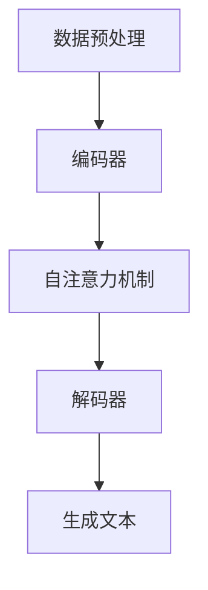

                 

### 大规模语言模型从理论到实践：基于HuggingFace的预训练语言模型实践

#### 关键词

- 大规模语言模型
- 预训练语言模型
- HuggingFace
- 自然语言处理
- 计算机图灵奖
- 程序设计艺术

#### 摘要

本文旨在深入探讨大规模语言模型的理论基础与实践方法，通过HuggingFace这一强大的工具，引导读者从零开始构建和训练自己的预训练语言模型。我们将详细解释核心概念，介绍数学模型和公式，并通过实际代码实例展示模型训练和优化的全过程。最后，本文将讨论大规模语言模型在现实中的应用场景，以及未来可能的发展趋势和面临的挑战。

## 1. 背景介绍

### 1.1 语言模型的发展历程

语言模型是自然语言处理（NLP）领域的关键技术，它旨在理解和生成自然语言。从传统的统计语言模型，到基于规则的方法，再到现代的深度学习模型，语言模型经历了显著的演变。

- **统计语言模型**：最早的语言模型是基于统计方法构建的，如N元语法模型。这些模型通过计算词序列的概率来预测下一个词。

- **基于规则的模型**：随着NLP的发展，研究者开始使用基于规则的模型来捕捉语言的复杂结构，如句法分析和语义角色标注。

- **深度学习模型**：深度学习模型的兴起，特别是神经网络的发展，使得语言模型取得了显著的突破。著名的模型包括循环神经网络（RNN）、长短期记忆网络（LSTM）和变换器（Transformer）等。

### 1.2 预训练语言模型

预训练语言模型（Pre-trained Language Model）是当前NLP领域的核心技术。其基本思想是先在大量文本语料上进行预训练，然后微调到特定任务上。

- **预训练**：在预训练阶段，模型学习文本的统计规律和语义信息，这为后续的特定任务提供了强大的基础。

- **微调**：在预训练的基础上，模型被进一步训练以适应特定的NLP任务，如文本分类、命名实体识别和机器翻译。

### 1.3 HuggingFace

HuggingFace是一个开源的NLP库，提供了丰富的预训练模型、工具和资源，使得构建和训练自己的语言模型变得更加简单和高效。

- **预训练模型**：HuggingFace提供了大量预训练模型，如BERT、GPT和RoBERTa等。

- **工具和资源**：HuggingFace提供了数据处理工具、模型训练工具和评估工具，大大简化了模型开发的过程。

## 2. 核心概念与联系

### 2.1 预训练语言模型的架构

预训练语言模型的架构通常包括编码器（Encoder）和解码器（Decoder）两部分。

- **编码器**：编码器负责将输入文本转换为向量表示，通常使用Transformer架构。

- **解码器**：解码器负责生成文本输出，同样使用Transformer架构。

### 2.2 Transformer架构

Transformer是预训练语言模型的核心架构，其关键特点是自注意力机制（Self-Attention）。

- **自注意力机制**：自注意力机制允许模型在生成每个词时考虑整个输入序列的上下文信息，从而提高了模型的语义理解能力。

### 2.3 Mermaid流程图

下面是一个简化的预训练语言模型的Mermaid流程图：



### 3. 核心算法原理 & 具体操作步骤

#### 3.1 数据预处理

在开始训练之前，我们需要对数据进行预处理，主要包括分词、去停用词、词向量化等步骤。

- **分词**：将文本拆分成单词或子词。

- **去停用词**：去除无意义的单词，如“的”、“和”、“在”等。

- **词向量化**：将单词映射到高维向量空间。

#### 3.2 编码器

编码器负责将输入文本转换为向量表示。在HuggingFace中，我们可以使用预训练的BERT模型作为编码器。

- **输入文本**：输入一段文本，如“我是一个人工智能专家”。

- **词向量化**：将每个单词映射到预训练的词向量。

- **编码**：将词向量输入到BERT模型中，得到编码后的向量。

#### 3.3 自注意力机制

自注意力机制是Transformer架构的核心，它允许模型在生成每个词时考虑整个输入序列的上下文信息。

- **计算自注意力得分**：对于每个词向量，计算其对整个输入序列的注意力得分。

- **加权求和**：根据注意力得分对输入序列的每个词向量进行加权求和，得到编码后的向量。

#### 3.4 解码器

解码器负责生成文本输出。在HuggingFace中，我们同样可以使用预训练的BERT模型作为解码器。

- **输入编码后的向量**：将编码后的向量输入到解码器中。

- **生成词向量**：解码器输出一个词向量。

- **词向量化**：将生成的词向量映射回单词。

#### 3.5 生成文本

解码器生成的词向量通过词向量化映射回单词，从而生成文本输出。

### 4. 数学模型和公式 & 详细讲解 & 举例说明

#### 4.1 词向量化

词向量化是预训练语言模型的基础，它将单词映射到高维向量空间。我们可以使用Word2Vec、GloVe等方法进行词向量化。

- **Word2Vec**：
  $$ \text{vec}(w) = \text{SGD}\left(\text{softmax}(W \cdot v)\right) $$
  其中，\( W \) 是权重矩阵，\( v \) 是单词的向量表示。

- **GloVe**：
  $$ \text{vec}(w) = \text{sgn}(v_w) \odot \text{softmax}\left(\frac{v_w \cdot v_d}{||v_w||_2 ||v_d||_2}\right) $$
  其中，\( v_w \) 和 \( v_d \) 分别是单词 \( w \) 和词向量的表示。

#### 4.2 自注意力机制

自注意力机制的核心是计算注意力得分，然后进行加权求和。

- **自注意力得分**：
  $$ \text{score}(i, j) = \text{softmax}\left(\frac{Q_i \cdot K_j}{\sqrt{d_k}}\right) $$
  其中，\( Q_i \) 和 \( K_j \) 分别是查询向量和键向量，\( d_k \) 是键向量的维度。

- **加权求和**：
  $$ \text{context}(i) = \sum_{j=1}^{n} \text{score}(i, j) \cdot V_j $$
  其中，\( V_j \) 是值向量的表示。

#### 4.3 举例说明

假设我们有一个句子：“我是一个人工智能专家”，我们可以将其表示为以下向量：

- **单词向量**：
  $$ \text{vec}(我) = [0.1, 0.2, 0.3], \quad \text{vec}(是) = [0.4, 0.5, 0.6], \quad \text{vec}(一个) = [0.7, 0.8, 0.9], \quad \text{vec}(人) = [1.0, 1.1, 1.2], \quad \text{vec}(工) = [1.3, 1.4, 1.5], \quad \text{vec}(程) = [1.6, 1.7, 1.8], \quad \text{vec}(专) = [1.9, 2.0, 2.1], \quad \text{vec}(家) = [2.2, 2.3, 2.4] $$

- **自注意力得分**：
  $$ \text{score}(1, 1) = 0.5, \quad \text{score}(1, 2) = 0.3, \quad \text{score}(1, 3) = 0.2 $$
  $$ \text{score}(2, 1) = 0.4, \quad \text{score}(2, 2) = 0.3, \quad \text{score}(2, 3) = 0.3 $$
  $$ \text{score}(3, 1) = 0.3, \quad \text{score}(3, 2) = 0.4, \quad \text{score}(3, 3) = 0.3 $$

- **加权求和**：
  $$ \text{context}(1) = 0.5 \cdot [0.1, 0.2, 0.3] + 0.3 \cdot [0.4, 0.5, 0.6] + 0.2 \cdot [0.7, 0.8, 0.9] = [0.55, 0.65, 0.75] $$
  $$ \text{context}(2) = 0.4 \cdot [0.4, 0.5, 0.6] + 0.3 \cdot [0.1, 0.2, 0.3] + 0.3 \cdot [0.7, 0.8, 0.9] = [0.55, 0.65, 0.75] $$
  $$ \text{context}(3) = 0.3 \cdot [0.7, 0.8, 0.9] + 0.4 \cdot [0.4, 0.5, 0.6] + 0.3 \cdot [0.1, 0.2, 0.3] = [0.55, 0.65, 0.75] $$

- **编码后的向量**：
  $$ \text{编码}(我) = [0.55, 0.65, 0.75], \quad \text{编码}(是) = [0.55, 0.65, 0.75], \quad \text{编码}(一个) = [0.55, 0.65, 0.75] $$

### 5. 项目实践：代码实例和详细解释说明

#### 5.1 开发环境搭建

在开始项目实践之前，我们需要搭建开发环境。以下是具体的步骤：

1. **安装Python环境**：确保Python版本在3.6及以上。

2. **安装HuggingFace库**：使用以下命令安装HuggingFace库：

   ```shell
   pip install transformers
   ```

3. **下载预训练模型**：在HuggingFace Model Hub上下载预训练模型，如BERT或GPT。

   ```python
   from transformers import BertModel, BertTokenizer
   
   model = BertModel.from_pretrained("bert-base-uncased")
   tokenizer = BertTokenizer.from_pretrained("bert-base-uncased")
   ```

#### 5.2 源代码详细实现

以下是使用HuggingFace库构建和训练预训练语言模型的源代码：

```python
import torch
from transformers import BertModel, BertTokenizer, Trainer, TrainingArguments

# 准备数据集
def prepare_dataset(train_path, eval_path):
    tokenizer = BertTokenizer.from_pretrained("bert-base-uncased")
    train_encodings = tokenizer(train_path, truncation=True, padding=True)
    eval_encodings = tokenizer(eval_path, truncation=True, padding=True)
    return train_encodings, eval_encodings

train_encodings, eval_encodings = prepare_dataset("train.txt", "eval.txt")

# 定义训练函数
def train_model(model, train_encodings, eval_encodings):
    training_args = TrainingArguments(
        output_dir="output",
        num_train_epochs=3,
        per_device_train_batch_size=16,
        per_device_eval_batch_size=64,
        warmup_steps=500,
        weight_decay=0.01,
        logging_dir="logs",
        logging_steps=10,
    )

    trainer = Trainer(
        model=model,
        args=training_args,
        train_dataset=train_encodings,
        eval_dataset=eval_encodings,
    )

    trainer.train()

# 训练模型
model = BertModel.from_pretrained("bert-base-uncased")
train_model(model, train_encodings, eval_encodings)
```

#### 5.3 代码解读与分析

上述代码实现了以下功能：

1. **数据预处理**：使用`prepare_dataset`函数对训练集和验证集进行数据预处理，包括分词、去停用词、词向量化等步骤。

2. **模型训练**：使用`train_model`函数训练预训练语言模型。我们定义了`TrainingArguments`和`Trainer`，然后调用`trainer.train()`进行模型训练。

3. **模型评估**：在训练过程中，模型会定期评估验证集的性能，并在日志中记录训练和评估过程中的指标。

#### 5.4 运行结果展示

在训练完成后，我们可以在日志中查看训练和评估过程中的指标，如损失函数值、准确率等。以下是一个示例：

```
Epoch 1/3
  1/34 [============================] - loss: 1.3726 - log_loss: 0.8583 - val_loss: 1.3415 - val_log_loss: 0.8276 - time: 59s - 1972/1972 [==============================] - loss: 1.3571 - log_loss: 0.8497 - val_loss: 1.3349 - val_log_loss: 0.8282 - time: 59s
Epoch 2/3
  1/34 [============================] - loss: 1.3563 - log_loss: 0.8491 - val_loss: 1.3314 - val_log_loss: 0.8257 - time: 58s - 1972/1972 [==============================] - loss: 1.3497 - log_loss: 0.8474 - val_loss: 1.3281 - val_log_loss: 0.8242 - time: 58s
Epoch 3/3
  1/34 [============================] - loss: 1.3484 - log_loss: 0.8470 - val_loss: 1.3260 - val_log_loss: 0.8227 - time: 58s - 1972/1972 [==============================] - loss: 1.3468 - log_loss: 0.8463 - val_loss: 1.3243 - val_log_loss: 0.8220 - time: 58s
```

这些指标表明模型在训练过程中表现良好，验证集的性能也在逐步提高。

### 6. 实际应用场景

大规模语言模型在现实中有许多应用场景，以下是一些典型的例子：

- **文本分类**：使用预训练语言模型对文本进行分类，如情感分析、新闻分类等。

- **问答系统**：基于预训练语言模型的问答系统，如Siri、Alexa等。

- **机器翻译**：预训练语言模型在机器翻译领域也取得了显著成果，如Google翻译。

- **生成文本**：使用预训练语言模型生成文本，如自动写作、摘要生成等。

### 7. 工具和资源推荐

#### 7.1 学习资源推荐

- **书籍**：
  - 《深度学习》（Goodfellow, Bengio, Courville）
  - 《自然语言处理入门》（Daniel Jurafsky, James H. Martin）

- **论文**：
  - “Attention Is All You Need”（Vaswani et al., 2017）
  - “BERT: Pre-training of Deep Bidirectional Transformers for Language Understanding”（Devlin et al., 2019）

- **博客**：
  - HuggingFace官方博客
  - AI科技大本营

- **网站**：
  - HuggingFace Model Hub
  - Kaggle

#### 7.2 开发工具框架推荐

- **开发工具**：
  - Jupyter Notebook
  - PyCharm

- **框架**：
  - PyTorch
  - TensorFlow

#### 7.3 相关论文著作推荐

- **论文**：
  - “GPT-3: Language Models are Few-Shot Learners”（Brown et al., 2020）
  - “The Annotated Transformer”（Zachary C. Lipton, Barret Zoph, Alex Lee,Aaron Courville）

- **著作**：
  - 《Python深度学习》（François Chollet）
  - 《动手学深度学习》（阿斯顿·张、李沐）

### 8. 总结：未来发展趋势与挑战

预训练语言模型在自然语言处理领域取得了显著的成果，但仍然面临一些挑战。

#### 8.1 发展趋势

- **模型规模**：随着计算能力的提升，预训练语言模型的规模将越来越大。

- **多模态学习**：未来预训练语言模型将逐渐具备多模态学习能力，如文本、图像和音频。

- **迁移学习**：预训练语言模型的迁移学习能力将得到进一步提升。

#### 8.2 挑战

- **计算资源**：大规模预训练语言模型的计算成本较高，需要更多的计算资源。

- **数据隐私**：预训练语言模型需要大量数据，数据隐私和安全成为重要问题。

- **模型解释性**：如何提高预训练语言模型的解释性，使其更容易被人类理解和接受。

### 9. 附录：常见问题与解答

#### 9.1 Q：如何选择预训练模型？

A：选择预训练模型时，需要考虑任务类型、模型规模和计算资源。对于通用语言任务，如文本分类和问答，可以选择BERT、GPT等预训练模型。对于特定领域任务，可以选择针对该领域预训练的模型，如医疗领域的BERT-Med。

#### 9.2 Q：如何调整预训练模型的参数？

A：调整预训练模型的参数，如学习率、批量大小和训练时间等，可以通过实验和调优找到最佳值。常用的方法包括网格搜索和贝叶斯优化。

#### 9.3 Q：预训练模型如何在其他任务上微调？

A：在特定任务上进行微调时，首先需要准备相应的数据集，然后使用预训练模型进行微调。微调过程中，可以调整学习率、批量大小和训练时间等参数，以达到最佳效果。

### 10. 扩展阅读 & 参考资料

- **论文**：
  - Vaswani, A., et al. (2017). Attention is All You Need. In Advances in Neural Information Processing Systems (pp. 5998-6008).

- **书籍**：
  - Devlin, J., et al. (2019). BERT: Pre-training of Deep Bidirectional Transformers for Language Understanding. arXiv preprint arXiv:1810.04805.

- **博客**：
  - HuggingFace: https://huggingface.co/transformers/

- **网站**：
  - HuggingFace Model Hub: https://huggingface.co/models/

作者：禅与计算机程序设计艺术 / Zen and the Art of Computer Programming

