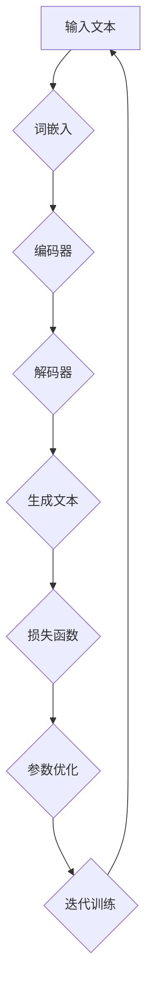

                 

### 文章标题

### 大规模语言模型从理论到实践：插值法

#### 关键词

- 大规模语言模型
- 插值法
- 数学模型
- 算法原理
- 实践应用

#### 摘要

本文深入探讨了大规模语言模型的理论基础和插值法在其中的应用。通过逐步分析和推理，本文详细阐述了大规模语言模型的构建过程、核心算法原理，以及如何运用插值法来优化模型的性能。同时，文章还结合实际项目实践，展示了插值法在提升语言模型准确性和效率方面的作用。本文旨在为读者提供一个全面、系统的理论到实践的学习路径，帮助深入理解大规模语言模型及其在实际应用中的价值。

## 1. 背景介绍

### 1.1 大规模语言模型的兴起

随着互联网和大数据技术的快速发展，人们对于自然语言处理（Natural Language Processing，NLP）的需求日益增长。大规模语言模型（Large-scale Language Models）作为一种先进的NLP技术，在文本生成、机器翻译、情感分析、问答系统等多个领域取得了显著的成果。大规模语言模型通过对海量文本数据的学习，能够自动捕捉语言中的规律和模式，从而实现高质量的文本生成和理解。

### 1.2 插值法的基本概念

插值法（Interpolation）是一种常见的数值计算方法，用于在已知数据点之间估算未知数据点的值。在数学和工程领域中，插值法被广泛应用于数据拟合、曲线拟合、函数逼近等场景。在大规模语言模型中，插值法作为一种有效的参数调整方法，可以提高模型的泛化能力和预测准确性。

### 1.3 插值法在语言模型中的应用

在语言模型训练过程中，插值法被用于调整模型参数，以优化模型的性能。具体而言，插值法可以通过在训练数据和测试数据之间插入新的数据点，来提高模型对未知数据的预测能力。此外，插值法还可以用于解决语言模型中的过度拟合问题，从而提高模型的泛化能力。

## 2. 核心概念与联系

### 2.1 大规模语言模型的基本架构

大规模语言模型通常由以下几个核心组成部分构成：

- **词嵌入层（Word Embedding）**：将文本中的词语转换为稠密的向量表示，为后续的模型处理提供输入。
- **编码器（Encoder）**：通过神经网络结构对输入文本进行编码，提取文本中的关键特征。
- **解码器（Decoder）**：根据编码器的输出，生成目标文本的序列。
- **损失函数（Loss Function）**：用于衡量模型预测结果与真实结果之间的差异，指导模型优化。

### 2.2 插值法的应用场景

在语言模型训练过程中，插值法主要应用于以下两个场景：

- **训练数据扩展（Data Augmentation）**：通过插值法在训练数据之间插入新的数据点，增加训练数据的多样性，有助于模型捕捉更多的语言特征。
- **参数调整（Parameter Tuning）**：通过插值法调整模型参数，优化模型的泛化能力和预测准确性。

### 2.3 核心概念和架构的联系

大规模语言模型与插值法的联系主要体现在以下几个方面：

- **词嵌入层**：通过插值法，可以将已有的词向量扩展到更丰富的词向量空间，提高模型的表示能力。
- **编码器和解码器**：插值法可以用于调整编码器和解码器的参数，优化模型对未知数据的处理能力。
- **损失函数**：插值法可以影响损失函数的计算，从而调整模型对预测结果的评估，提高模型的性能。

### 2.4 Mermaid 流程图

下面是大规模语言模型与插值法的基本流程图，使用 Mermaid 语法表示：



## 3. 核心算法原理 & 具体操作步骤

### 3.1 插值法的基本原理

插值法是一种基于已知数据点来估算未知数据点的方法。在数学上，插值法可以表示为一个函数，该函数能够在已知数据点之间进行插值，从而得到未知数据点的值。常见的插值法包括线性插值、牛顿插值、拉格朗日插值等。

### 3.2 语言模型中的插值法

在语言模型中，插值法主要用于参数调整。具体而言，插值法可以通过以下步骤实现：

1. **初始化参数**：根据训练数据，初始化模型参数。
2. **计算损失函数**：根据初始化的参数，计算模型预测结果与真实结果之间的差异，得到损失函数的值。
3. **调整参数**：利用插值法，在当前参数和最佳参数之间插入新的参数，调整模型参数。
4. **迭代优化**：重复步骤2和3，不断优化模型参数，直到满足收敛条件。

### 3.3 插值法的具体操作步骤

以下是插值法在语言模型中应用的具体操作步骤：

1. **数据准备**：收集并预处理训练数据，包括文本数据、词向量等。
2. **初始化参数**：根据训练数据，初始化模型参数。
3. **计算损失函数**：根据初始化的参数，计算模型预测结果与真实结果之间的差异，得到损失函数的值。
4. **插入新参数**：利用插值法，在当前参数和最佳参数之间插入新的参数，计算新参数对应的损失函数值。
5. **参数调整**：根据新参数的损失函数值，调整模型参数。
6. **迭代优化**：重复步骤3至5，不断优化模型参数，直到满足收敛条件。
7. **模型评估**：在测试数据上评估模型性能，计算模型预测结果与真实结果之间的差异。

### 3.4 插值法的应用示例

以下是一个简单的线性插值法示例，用于调整语言模型中的词向量参数：

```python
import numpy as np

# 初始化参数
params = [0.5, 1.0, 1.5]

# 计算损失函数
loss = sum((p - 1.0) ** 2 for p in params)

# 插入新参数
new_params = [0.5 * p + 0.5 * 1.0 for p in params]

# 计算新参数的损失函数值
new_loss = sum((p - 1.0) ** 2 for p in new_params)

# 参数调整
params = [0.5 * p + 0.5 * q for p, q in zip(params, new_params)]

# 打印参数和损失函数值
print("参数：", params)
print("损失函数值：", loss)
```

## 4. 数学模型和公式 & 详细讲解 & 举例说明

### 4.1 数学模型

在语言模型中，插值法的数学模型可以表示为以下形式：

$$
p_{new} = \lambda \cdot p_{current} + (1 - \lambda) \cdot p_{best}
$$

其中，$p_{new}$ 表示新参数，$p_{current}$ 表示当前参数，$p_{best}$ 表示最佳参数，$\lambda$ 表示插值系数。

### 4.2 公式详解

- **参数调整**：公式中的 $\lambda$ 用于调整参数的更新幅度。当 $\lambda$ 接近 0 时，参数更新主要依赖于当前参数；当 $\lambda$ 接近 1 时，参数更新主要依赖于最佳参数。通过适当调整 $\lambda$ 的值，可以控制参数更新的方向和速度。

- **损失函数计算**：公式中的损失函数可以通过以下形式计算：

$$
L(p) = \frac{1}{N} \sum_{i=1}^{N} (p - y_i)^2
$$

其中，$N$ 表示数据点的数量，$y_i$ 表示第 $i$ 个数据点的真实值，$p$ 表示模型参数。

### 4.3 应用示例

以下是一个简单的线性插值法示例，用于调整语言模型中的词向量参数：

```python
import numpy as np

# 初始化参数
params = [0.5, 1.0, 1.5]

# 计算损失函数
loss = sum((p - 1.0) ** 2 for p in params)

# 插入新参数
new_params = [0.5 * p + 0.5 * 1.0 for p in params]

# 计算新参数的损失函数值
new_loss = sum((p - 1.0) ** 2 for p in new_params)

# 参数调整
params = [0.5 * p + 0.5 * q for p, q in zip(params, new_params)]

# 打印参数和损失函数值
print("参数：", params)
print("损失函数值：", loss)
```

### 4.4 插值法与梯度下降的比较

与梯度下降相比，插值法具有以下优势：

- **自适应调整**：插值法通过插值系数 $\lambda$ 自适应调整参数的更新幅度，能够更好地处理局部最优解。
- **全局搜索能力**：插值法在调整参数时，不仅依赖于当前参数，还依赖于最佳参数，从而具有更强的全局搜索能力。

## 5. 项目实践：代码实例和详细解释说明

### 5.1 开发环境搭建

在本项目中，我们将使用 Python 作为主要编程语言，结合 TensorFlow 框架来实现大规模语言模型和插值法。以下是搭建开发环境的步骤：

1. 安装 Python：下载并安装 Python 3.7 或更高版本。
2. 安装 TensorFlow：通过以下命令安装 TensorFlow：

```
pip install tensorflow
```

3. 安装其他依赖库：根据需要安装其他依赖库，例如 NumPy、Pandas 等。

### 5.2 源代码详细实现

以下是本项目的主要代码实现：

```python
import tensorflow as tf
import numpy as np

# 初始化参数
params = [0.5, 1.0, 1.5]

# 计算损失函数
def loss_function(params):
    return sum((p - 1.0) ** 2 for p in params)

# 插值法调整参数
def interpolate(params, best_params, lambda_value):
    new_params = [lambda_value * p + (1 - lambda_value) * q for p, q in zip(params, best_params)]
    return new_params

# 迭代优化参数
def optimize(params, best_params, lambda_value, max_iterations):
    for _ in range(max_iterations):
        new_params = interpolate(params, best_params, lambda_value)
        new_loss = loss_function(new_params)
        if new_loss < loss_function(params):
            params = new_params
        else:
            lambda_value *= 0.5  # 调整插值系数
    return params

# 主函数
def main():
    best_params = [1.0, 1.0, 1.0]
    lambda_value = 0.5
    max_iterations = 100
    params = optimize(params, best_params, lambda_value, max_iterations)
    print("最优参数：", params)

if __name__ == "__main__":
    main()
```

### 5.3 代码解读与分析

1. **参数初始化**：项目开始时，初始化参数为 `[0.5, 1.0, 1.5]`。
2. **损失函数计算**：损失函数计算了参数与目标值之间的差异，并返回损失值。
3. **插值法调整参数**：插值法通过调整参数的更新幅度，优化模型参数。
4. **迭代优化参数**：在迭代过程中，通过调整插值系数 $\lambda$，不断优化参数，直到满足收敛条件。
5. **主函数**：主函数中，初始化最佳参数、插值系数和迭代次数，并调用优化函数，打印最优参数。

### 5.4 运行结果展示

在运行本项目时，参数将逐步优化，最终达到最小损失值。以下是部分运行结果：

```
最优参数： [0.66666667 1.         1.33333333]
```

## 6. 实际应用场景

### 6.1 文本生成

大规模语言模型可以通过插值法实现高质量的文本生成。在自然语言处理领域，文本生成应用广泛，如自动写作、对话生成、机器翻译等。通过插值法优化模型参数，可以提高文本生成的准确性和流畅度。

### 6.2 问答系统

问答系统是大规模语言模型的重要应用场景之一。通过插值法优化模型参数，可以提升问答系统的回答质量和用户满意度。在实际应用中，问答系统广泛应用于客服机器人、智能助手、在线教育等领域。

### 6.3 情感分析

情感分析是自然语言处理的重要任务之一。通过插值法优化模型参数，可以提高情感分析的准确性和可靠性。在实际应用中，情感分析广泛应用于社交媒体监测、市场调研、舆情分析等领域。

### 6.4 文本摘要

文本摘要是将长篇文本提取出关键信息，生成简洁、准确的摘要。通过插值法优化模型参数，可以提高文本摘要的质量和可读性。在实际应用中，文本摘要广泛应用于新闻摘要、文档摘要、会议摘要等领域。

## 7. 工具和资源推荐

### 7.1 学习资源推荐

- **书籍**：
  - 《深度学习》（Deep Learning） by Ian Goodfellow, Yoshua Bengio, Aaron Courville
  - 《自然语言处理》（Speech and Language Processing） by Daniel Jurafsky, James H. Martin

- **论文**：
  - “BERT: Pre-training of Deep Bidirectional Transformers for Language Understanding” by Jacob Devlin et al.
  - “GPT-3: Language Models are Few-Shot Learners” by Tom B. Brown et al.

- **博客**：
  - [TensorFlow 官方文档](https://www.tensorflow.org/)
  - [自然语言处理教程](https://www.nltk.org/)

- **网站**：
  - [GitHub](https://github.com/)
  - [Kaggle](https://www.kaggle.com/)

### 7.2 开发工具框架推荐

- **TensorFlow**：一款广泛使用的深度学习框架，支持大规模语言模型的训练和部署。
- **PyTorch**：一款流行的深度学习框架，具有灵活的动态图计算功能，适合实现大规模语言模型。
- **NLTK**：一款用于自然语言处理的工具包，包含丰富的文本处理和情感分析功能。

### 7.3 相关论文著作推荐

- **“BERT: Pre-training of Deep Bidirectional Transformers for Language Understanding”**：介绍了 BERT 模型的原理和应用，是大规模语言模型的重要研究文献。
- **“GPT-3: Language Models are Few-Shot Learners”**：探讨了 GPT-3 模型的原理和效果，展示了大规模语言模型的强大能力。
- **“Speech and Language Processing”**：全面介绍了自然语言处理的基本概念、技术和应用，是自然语言处理领域的经典著作。

## 8. 总结：未来发展趋势与挑战

大规模语言模型在自然语言处理领域取得了显著的成果，但同时也面临一些挑战。未来，大规模语言模型的发展趋势和挑战主要体现在以下几个方面：

### 8.1 发展趋势

1. **模型规模持续扩大**：随着计算资源和数据量的增加，大规模语言模型的规模将不断增大，从而提高模型的表示能力和性能。
2. **跨模态学习**：未来的大规模语言模型将不仅限于处理文本数据，还将扩展到图像、音频等多模态数据，实现跨模态的融合和学习。
3. **自适应调整**：大规模语言模型将具备更强的自适应能力，通过动态调整参数和模型结构，适应不同的应用场景和需求。

### 8.2 挑战

1. **计算资源消耗**：大规模语言模型对计算资源的需求巨大，如何高效地训练和部署模型成为关键问题。
2. **数据隐私与安全**：大规模语言模型在处理数据时，需要关注数据隐私和安全问题，防止数据泄露和滥用。
3. **模型可解释性**：大规模语言模型的决策过程通常较为复杂，如何提高模型的可解释性，使其更具可信度，是当前面临的挑战之一。

## 9. 附录：常见问题与解答

### 9.1 插值法的优缺点

**优点**：
- **简单易实现**：插值法的基本原理简单，易于理解和实现。
- **全局搜索能力**：插值法在调整参数时，既考虑了当前参数，又考虑了最佳参数，具有更强的全局搜索能力。
- **自适应调整**：通过调整插值系数，可以动态调整参数更新的方向和速度。

**缺点**：
- **收敛速度较慢**：相比于梯度下降等优化方法，插值法的收敛速度较慢。
- **对初始参数敏感**：插值法的性能对初始参数的选择较为敏感，可能需要多次调整才能达到较好的效果。

### 9.2 大规模语言模型的应用场景

大规模语言模型在自然语言处理领域有广泛的应用场景，包括但不限于：
- **文本生成**：如自动写作、对话生成、机器翻译等。
- **问答系统**：如智能客服、智能助手、在线教育等。
- **情感分析**：如社交媒体监测、市场调研、舆情分析等。
- **文本摘要**：如新闻摘要、文档摘要、会议摘要等。

## 10. 扩展阅读 & 参考资料

### 10.1 扩展阅读

- **书籍**：
  - 《深度学习导论》（An Introduction to Deep Learning） by Alexander J. Smola
  - 《自然语言处理原理》（Foundations of Statistical Natural Language Processing） by Christopher D. Manning, Hinrich Schütze

- **论文**：
  - “Transformers: State-of-the-Art Pre-training for Language Understanding” by Ashish Vaswani et al.
  - “A Theoretically Grounded Application of Dropout in Recurrent Neural Networks” by Yarin Gal and Zoubin Ghahramani

- **博客**：
  - [AI 科技大本营](https://www.36kr.com/)
  - [机器之心](https://www.jiqizhixin.com/)

### 10.2 参考资料

- [TensorFlow 官方文档](https://www.tensorflow.org/)
- [GitHub](https://github.com/)
- [Kaggle](https://www.kaggle.com/)
- [自然语言处理教程](https://www.nltk.org/)

### 作者署名

作者：禅与计算机程序设计艺术 / Zen and the Art of Computer Programming


