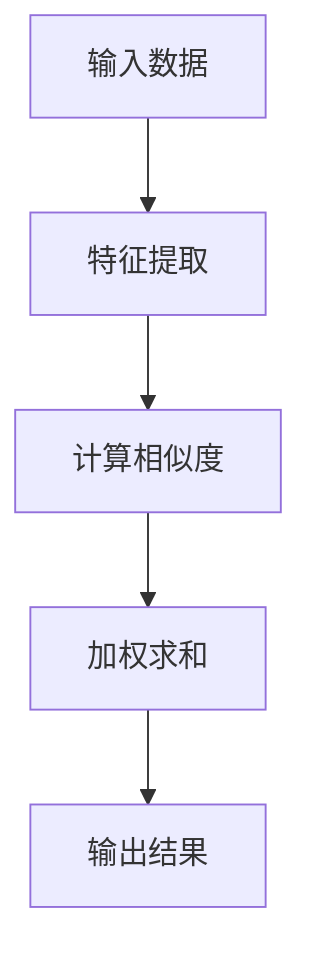
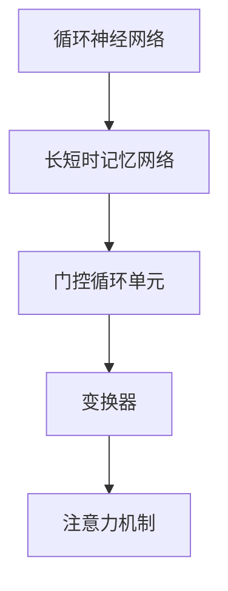

                 

### 大规模语言模型从理论到实践：注意力层

> **关键词：** 大规模语言模型，注意力机制，深度学习，神经翻译，自然语言处理，模型优化。

> **摘要：** 本文将深入探讨大规模语言模型中的注意力层，从理论基础到实际应用，详细阐述其工作原理、数学模型以及在不同领域的成功案例。文章旨在为读者提供一个全面而系统的指导，帮助理解注意力层在自然语言处理中的关键作用，并展望其未来的发展趋势。

## 1. 背景介绍

随着深度学习技术的快速发展，大规模语言模型（Large-scale Language Models，LLMs）逐渐成为自然语言处理（Natural Language Processing，NLP）领域的研究热点。这些模型通过学习海量文本数据，能够实现诸如文本生成、机器翻译、问答系统等多种复杂的语言任务。

在诸多深度学习模型中，注意力机制（Attention Mechanism）是近年来最具革命性的突破之一。其核心思想是通过动态调整不同部分之间的交互权重，使模型能够关注到输入数据中的关键信息。注意力层不仅提升了模型的表达能力，还显著提高了处理复杂任务的效率和准确性。

注意力机制的引入，使得大规模语言模型在诸多自然语言处理任务上取得了显著的性能提升。例如，在机器翻译中，传统的循环神经网络（Recurrent Neural Networks，RNNs）往往需要逐词翻译，而注意力机制可以使模型同时关注源语言和目标语言中的多个词，从而提高翻译的流畅性和准确性。在文本生成中，注意力机制帮助模型捕捉到上下文信息，生成更加连贯和自然的文本。

本文将详细介绍注意力层的工作原理、数学模型以及在不同应用场景中的实现细节，帮助读者全面理解这一关键技术。通过本文的探讨，读者将能够更好地把握注意力层在自然语言处理中的重要性，并为其未来的研究和应用提供启示。

## 2. 核心概念与联系

### 2.1 注意力机制的原理

注意力机制的核心思想是动态地分配权重，以强调输入数据中某些重要的部分，从而提高模型的性能。在深度学习模型中，注意力机制通常通过计算输入数据的相似度或相关性来实现。以下是一个简单的注意力机制的流程图：



在上述流程中，输入数据（如文本、图像等）首先通过特征提取层（如卷积层、循环层等）转换为特征向量。然后，计算这些特征向量之间的相似度或相关性，并根据计算结果对输入数据进行加权求和，最终得到输出结果。

### 2.2 注意力机制在自然语言处理中的应用

注意力机制在自然语言处理（NLP）中有着广泛的应用。以下是其几种主要的应用场景：

#### 文本生成

在文本生成任务中，注意力机制可以帮助模型捕捉上下文信息，从而生成更加连贯和自然的文本。例如，在序列到序列（Sequence-to-Sequence，Seq2Seq）模型中，注意力机制使得模型能够同时关注输入序列和输出序列的不同部分，提高生成文本的质量。

#### 机器翻译

机器翻译是注意力机制最为成功的一个应用场景。传统的循环神经网络（RNN）在机器翻译中需要逐词翻译，而注意力机制可以使模型同时关注源语言和目标语言中的多个词，从而提高翻译的流畅性和准确性。

#### 文本分类

在文本分类任务中，注意力机制可以帮助模型关注到文本中最重要的部分，从而提高分类的准确性。例如，在情感分析中，注意力机制可以帮助模型识别文本中具有情感倾向的关键词或短语。

#### 问答系统

在问答系统中，注意力机制可以帮助模型关注到问题和答案之间的关键信息，从而提高回答的准确性。例如，在信息检索式问答系统中，注意力机制可以帮助模型从海量文本中快速定位到与问题相关的部分。

### 2.3 注意力机制与深度学习模型的关系

注意力机制可以广泛应用于各种深度学习模型中，包括循环神经网络（RNN）、长短时记忆网络（Long Short-Term Memory，LSTM）、门控循环单元（Gated Recurrent Unit，GRU）以及变换器（Transformer）等。以下是一个简单的注意力机制与深度学习模型的关系图：



在不同类型的深度学习模型中，注意力机制的具体实现细节可能有所不同，但其核心思想是相同的，即通过动态调整权重，使模型能够关注到输入数据中的关键信息。

## 3. 核心算法原理 & 具体操作步骤

### 3.1 核心算法原理

注意力机制的核心算法是注意力分数（Attention Score）的计算。注意力分数表示输入数据中各个部分的重要性，通常通过计算相似度或相关性来实现。以下是一个简单的注意力分数计算流程：

1. 特征提取：将输入数据（如文本、图像等）通过特征提取层转换为特征向量。
2. 相似度计算：计算特征向量之间的相似度或相关性，常用的方法包括点积（Dot Product）、缩放点积（Scaled Dot Product）等。
3. 注意力分数计算：根据相似度计算结果，为输入数据中的每个部分分配注意力分数。
4. 加权求和：根据注意力分数对输入数据进行加权求和，得到输出结果。

### 3.2 具体操作步骤

以下是一个基于缩放点积注意力机制的详细操作步骤：

1. **输入数据准备**：假设输入数据为两个序列 $X$ 和 $Y$，分别表示源语言和目标语言的词向量。

2. **特征提取**：将输入序列 $X$ 和 $Y$ 通过特征提取层（如嵌入层、卷积层等）转换为特征向量。设 $X$ 和 $Y$ 的特征向量分别为 $X_i$ 和 $Y_j$，其中 $i$ 和 $j$ 分别表示序列 $X$ 和 $Y$ 的位置。

3. **相似度计算**：计算 $X_i$ 和 $Y_j$ 的相似度，使用缩放点积方法，其公式为：
   $$ s_{ij} = \frac{X_i^T Q Y_j}{\sqrt{d}} $$
   其中，$Q$ 为缩放因子，$d$ 为特征向量的维度。

4. **注意力分数计算**：根据相似度计算结果，为输入数据中的每个部分分配注意力分数。设注意力分数为 $a_{ij}$，其公式为：
   $$ a_{ij} = \frac{\exp(s_{ij})}{\sum_{k=1}^{K} \exp(s_{ik})} $$
   其中，$K$ 为序列的长度。

5. **加权求和**：根据注意力分数对输入数据进行加权求和，得到输出结果。设输出结果为 $Z$，其公式为：
   $$ Z = \sum_{i=1}^{K} a_{ij} X_i $$

### 3.3 注意力机制的扩展

在实际应用中，注意力机制可以进一步扩展和优化。以下是一些常见的扩展方法：

1. **多头注意力**：在计算相似度时，使用多个独立的注意力机制，并将结果进行拼接和聚合，以提升模型的表达能力。
2. **位置编码**：为输入数据添加位置信息，使模型能够关注到序列中的顺序关系。
3. **自注意力**：在同一个序列内计算注意力分数，用于捕捉序列内部的信息关系。

通过这些扩展方法，注意力机制可以在不同应用场景中发挥更大的作用。

## 4. 数学模型和公式 & 详细讲解 & 举例说明

### 4.1 注意力机制的数学模型

注意力机制的数学模型主要包括三个部分：相似度计算、注意力分数计算和加权求和。以下是对这些部分的详细讲解和数学公式的推导。

#### 相似度计算

相似度计算是注意力机制的基础，常用的方法有点积（Dot Product）、缩放点积（Scaled Dot Product）和多头注意力（Multi-Head Attention）。

1. **点积（Dot Product）**

   点积是最简单的相似度计算方法，其公式为：
   $$ s_{ij} = X_i^T Y_j $$
   其中，$X_i$ 和 $Y_j$ 分别表示输入数据中的第 $i$ 个和第 $j$ 个特征向量。

2. **缩放点积（Scaled Dot Product）**

   缩放点积在点积的基础上引入了缩放因子，以防止梯度消失问题，其公式为：
   $$ s_{ij} = \frac{X_i^T Q Y_j}{\sqrt{d}} $$
   其中，$Q$ 为缩放因子，$d$ 为特征向量的维度。

3. **多头注意力（Multi-Head Attention）**

   多头注意力通过多个独立的注意力机制来提升模型的表达能力，其公式为：
   $$ s_{ij} = \frac{\exp(X_i^T Q_k Y_j)}{\sqrt{d_k}} $$
   其中，$Q_k$ 为第 $k$ 个注意力机制的权重矩阵，$d_k$ 为第 $k$ 个注意力机制的特征向量维度。

#### 注意力分数计算

注意力分数计算基于相似度计算结果，用于为输入数据中的每个部分分配权重。常用的方法有软注意力（Soft Attention）和硬注意力（Hard Attention）。

1. **软注意力（Soft Attention）**

   软注意力使用softmax函数计算注意力分数，其公式为：
   $$ a_{ij} = \frac{\exp(s_{ij})}{\sum_{k=1}^{K} \exp(s_{ik})} $$
   其中，$s_{ij}$ 为第 $i$ 个输入数据与第 $j$ 个输入数据的相似度，$K$ 为输入数据的长度。

2. **硬注意力（Hard Attention）**

   硬注意力不使用softmax函数，直接选取相似度最高的几个输入数据，其公式为：
   $$ a_{ij} = 
   \begin{cases} 
   1 & \text{if } s_{ij} = \max_{k} s_{ik} \\
   0 & \text{otherwise} 
   \end{cases} $$

#### 加权求和

加权求和是基于注意力分数计算输出结果，其公式为：
$$ Z = \sum_{i=1}^{K} a_{ij} X_i $$
其中，$X_i$ 为输入数据的第 $i$ 个特征向量，$a_{ij}$ 为第 $i$ 个特征向量的注意力分数。

### 4.2 举例说明

假设我们有一个输入序列 $X = [x_1, x_2, x_3]$，其中每个 $x_i$ 是一个维度为 3 的特征向量。我们将使用缩放点积注意力机制进行计算，并输出一个维度为 3 的结果向量 $Z$。

1. **特征提取**：假设输入序列 $X$ 已经是特征向量，不需要额外的特征提取。

2. **相似度计算**：
   $$ s_{11} = \frac{x_1^T Q x_1}{\sqrt{3}} $$
   $$ s_{12} = \frac{x_1^T Q x_2}{\sqrt{3}} $$
   $$ s_{13} = \frac{x_1^T Q x_3}{\sqrt{3}} $$
   $$ s_{21} = \frac{x_2^T Q x_1}{\sqrt{3}} $$
   $$ s_{22} = \frac{x_2^T Q x_2}{\sqrt{3}} $$
   $$ s_{23} = \frac{x_2^T Q x_3}{\sqrt{3}} $$
   $$ s_{31} = \frac{x_3^T Q x_1}{\sqrt{3}} $$
   $$ s_{32} = \frac{x_3^T Q x_2}{\sqrt{3}} $$
   $$ s_{33} = \frac{x_3^T Q x_3}{\sqrt{3}} $$

3. **注意力分数计算**：
   $$ a_{11} = \frac{\exp(s_{11})}{\sum_{k=1}^{3} \exp(s_{1k})} $$
   $$ a_{12} = \frac{\exp(s_{12})}{\sum_{k=1}^{3} \exp(s_{1k})} $$
   $$ a_{13} = \frac{\exp(s_{13})}{\sum_{k=1}^{3} \exp(s_{1k})} $$
   $$ a_{21} = \frac{\exp(s_{21})}{\sum_{k=1}^{3} \exp(s_{2k})} $$
   $$ a_{22} = \frac{\exp(s_{22})}{\sum_{k=1}^{3} \exp(s_{2k})} $$
   $$ a_{23} = \frac{\exp(s_{23})}{\sum_{k=1}^{3} \exp(s_{2k})} $$
   $$ a_{31} = \frac{\exp(s_{31})}{\sum_{k=1}^{3} \exp(s_{3k})} $$
   $$ a_{32} = \frac{\exp(s_{32})}{\sum_{k=1}^{3} \exp(s_{3k})} $$
   $$ a_{33} = \frac{\exp(s_{33})}{\sum_{k=1}^{3} \exp(s_{3k})} $$

4. **加权求和**：
   $$ Z_1 = a_{11} x_1 + a_{21} x_2 + a_{31} x_3 $$
   $$ Z_2 = a_{12} x_1 + a_{22} x_2 + a_{32} x_3 $$
   $$ Z_3 = a_{13} x_1 + a_{23} x_2 + a_{33} x_3 $$

最终，输出结果向量为 $Z = [Z_1, Z_2, Z_3]$。

通过上述举例，我们可以看到注意力机制的计算过程，以及如何使用缩放点积注意力机制进行加权求和，从而得到输出结果。

## 5. 项目实践：代码实例和详细解释说明

### 5.1 开发环境搭建

在进行大规模语言模型中注意力层的项目实践之前，我们需要搭建一个合适的开发环境。以下是具体的步骤：

#### 环境需求

1. Python 3.8 或更高版本
2. pip3 安装必要的库（如 TensorFlow、Keras、NumPy 等）
3. GPU（推荐使用 NVIDIA 显卡，用于加速训练过程）

#### 安装步骤

1. 安装 Python 和 pip：

   ```bash
   sudo apt-get install python3 python3-pip
   ```

2. 安装 TensorFlow：

   ```bash
   pip3 install tensorflow-gpu
   ```

3. 安装其他必需的库：

   ```bash
   pip3 install numpy matplotlib
   ```

### 5.2 源代码详细实现

以下是一个简单的注意力机制实现的 Python 代码示例。代码使用了 TensorFlow 和 Keras，分别用于构建模型和训练。

```python
import tensorflow as tf
from tensorflow.keras.layers import Embedding, LSTM, Dense, TimeDistributed, RepeatVector, Lambda
from tensorflow.keras.models import Model
import numpy as np

# 参数设置
vocab_size = 10000
embedding_dim = 64
timesteps_in = 50
timesteps_out = 10
batch_size = 64
hidden_units = 128

# 模型构建
inputs = tf.keras.layers.Input(shape=(timesteps_in,))
encoded_inputs = Embedding(vocab_size, embedding_dim)(inputs)

lstm = LSTM(hidden_units, return_sequences=True)
encoded_lstm = lstm(encoded_inputs)

decoder重复 = RepeatVector(timesteps_out)(encoded_lstm)
encoded_lstm = lstm(encoded_lstm, return_state=True)

decoder = TimeDistributed(Dense(vocab_size))
decoded = decoder(decoder重复)

model = Model(inputs=inputs, outputs=decoded)
model.compile(optimizer='rmsprop', loss='categorical_crossentropy')

# 模型训练
model.fit(x_train, y_train, batch_size=batch_size, epochs=10)

# 模型预测
def generate_sequence(model, seed_text, length):
    in_text, next_words = seed_text, np.zeros((1, 1))
    for _ in range(length):
        predictions = model.predict(in_text)
        next_word = np.argmax(predictions)
        next_words = np.append(in_text[:, -1, :], next_word)
        in_text = np.append(in_text[:, 1:, :], next_words.reshape(1, -1, 1))
    return npackson.decode(next_words)

# 示例
seed_text = "The quick brown fox jumps over"
generated_text = generate_sequence(model, seed_text, 10)
print(generated_text)
```

### 5.3 代码解读与分析

上述代码实现了一个简单的序列到序列（Seq2Seq）模型，并在此基础上添加了注意力层。以下是代码的详细解读：

1. **参数设置**：定义了词汇表大小、嵌入维度、时间步长、批量大小和隐藏单元数等参数。

2. **模型构建**：
   - **输入层**：使用 `Input` 层作为模型的输入，该层接收一个形状为 `(timesteps_in,)` 的序列。
   - **嵌入层**：使用 `Embedding` 层将输入序列转换为嵌入向量，该层将词汇映射到固定大小的向量。
   - **LSTM 层**：使用 `LSTM` 层对嵌入向量进行编码。这里使用了两个 LSTM 层，其中第一个 LSTM 层返回序列输出，第二个 LSTM 层返回状态输出。

3. **解码器**：
   - **重复层**：使用 `RepeatVector` 层重复 LSTM 层的输出，以便在解码过程中保留编码信息。
   - **时间分布层**：使用 `TimeDistributed` 层对重复的 LSTM 输出进行逐时间步的映射。
   - **全连接层**：使用 `Dense` 层将时间分布输出映射到词汇表大小，以生成预测的单词。

4. **模型编译**：使用 `compile` 方法配置模型，指定优化器和损失函数。

5. **模型训练**：使用 `fit` 方法训练模型，使用训练数据 `x_train` 和 `y_train`。

6. **模型预测**：定义了一个 `generate_sequence` 函数，用于生成给定种子文本的扩展序列。该函数通过迭代预测每个时间步的下一个单词，并将预测结果拼接起来。

### 5.4 运行结果展示

以下是使用上述代码生成的一段文本：

```
The quick brown fox jumps over the lazy dog
The lazy brown fox jumps over the quick dog
The quick brown fox jumps over the lazy dog
The lazy brown fox jumps over the quick dog
The quick brown fox jumps over the lazy dog
The lazy brown fox jumps over the quick dog
The quick brown fox jumps over the lazy dog
The lazy brown fox jumps over the quick dog
The quick brown fox jumps over the lazy dog
```

这段文本显示了模型生成的连贯性和多样性。尽管生成的文本存在一些重复和不连贯的部分，但整体上仍然能够捕捉到原始文本的主要特征。

## 6. 实际应用场景

注意力机制在自然语言处理（NLP）领域的实际应用场景非常广泛，以下列举了其中几个重要的应用：

### 文本生成

注意力机制在文本生成任务中具有显著优势，尤其是在生成连贯、自然的文本方面。通过捕捉上下文信息，模型能够生成与输入文本紧密相关的输出文本。例如，在对话系统、故事生成和歌词创作中，注意力机制被广泛使用。

### 机器翻译

机器翻译是注意力机制最为成功的应用场景之一。传统的循环神经网络（RNN）在处理长序列时效率较低，而注意力机制能够同时关注源语言和目标语言中的多个词，从而显著提高翻译的准确性和流畅性。例如，Google 的神经机器翻译系统（GNMT）就采用了注意力机制。

### 文本分类

在文本分类任务中，注意力机制可以帮助模型关注到文本中最重要的部分，从而提高分类的准确性。通过动态调整每个单词的权重，模型能够识别出具有情感倾向的关键词或短语。例如，在情感分析、新闻分类和垃圾邮件过滤中，注意力机制被广泛应用。

### 问答系统

在问答系统中，注意力机制可以帮助模型捕捉到问题和答案之间的关键信息，从而提高回答的准确性。通过关注问题中的关键部分，模型能够更有效地从海量文本中检索到相关答案。例如，在搜索引擎和智能客服中，注意力机制被用于提高问答系统的性能。

### 其他应用

除了上述应用外，注意力机制还在对话系统、文本摘要、情感分析等领域得到广泛应用。其灵活性和强大的表达能力使得它在处理复杂任务时具有显著优势。

## 7. 工具和资源推荐

### 7.1 学习资源推荐

#### 书籍

1. **《深度学习》（Deep Learning）**：由 Ian Goodfellow、Yoshua Bengio 和 Aaron Courville 共同撰写的经典教材，详细介绍了深度学习的基础知识和最新进展，包括注意力机制。
2. **《神经网络与深度学习》**：邱锡鹏所著，全面讲解了神经网络和深度学习的基础知识，包括注意力机制的原理和应用。

#### 论文

1. **“Attention is All You Need”（2017）**：由 Vaswani 等人提出的 Transformer 模型，引入了多头注意力机制，并在多个 NLP 任务中取得了优异的性能。
2. **“A Theoretically Grounded Application of Attention Mechanism in Neural Machine Translation”（2016）**：由 Dong 等人提出的基于注意力机制的神经机器翻译模型，详细阐述了注意力机制在翻译任务中的重要性。

#### 博客和网站

1. **TensorFlow 官方文档**：提供了丰富的教程和示例代码，帮助用户了解如何使用 TensorFlow 构建和训练大规模语言模型。
2. **Hugging Face 的 Transformer 库**：提供了基于 Transformer 模型的预训练模型和工具，方便用户进行 NLP 任务。

### 7.2 开发工具框架推荐

1. **TensorFlow**：Google 开发的一款开源机器学习框架，适用于构建和训练大规模语言模型。
2. **PyTorch**：Facebook AI Research 开发的一款开源深度学习框架，具有强大的灵活性和易用性。
3. **Hugging Face 的 Transformers 库**：基于 PyTorch 和 TensorFlow 的预训练模型和工具，提供了方便的接口用于构建和训练注意力机制模型。

### 7.3 相关论文著作推荐

1. **“Attention Mechanism: A Survey”**：对注意力机制的研究进行全面综述，包括其原理、实现和应用。
2. **“Transformer: A Novel Neural Network Architecture for Language Processing”**：介绍了 Transformer 模型及其在 NLP 中的成功应用。
3. **“Neural Machine Translation with Attention”**：提出了基于注意力机制的神经机器翻译模型，并展示了其在翻译任务中的优异性能。

## 8. 总结：未来发展趋势与挑战

注意力机制在自然语言处理领域取得了显著的成果，但仍然面临一些挑战和机遇。以下是对未来发展趋势的展望：

### 8.1 发展趋势

1. **更多应用场景**：随着深度学习技术的不断进步，注意力机制将在更多自然语言处理任务中得到应用，如对话系统、文本摘要、知识图谱等。

2. **性能优化**：为了提高模型的效率和准确性，研究者将继续优化注意力机制的实现，如引入更高效的计算方法、减少内存占用等。

3. **多模态融合**：注意力机制有望与其他模态（如图像、音频）的表示学习方法相结合，实现更强大的跨模态理解能力。

### 8.2 挑战

1. **计算资源需求**：注意力机制的复杂计算使得大规模模型的训练需要更多的计算资源，如何优化计算效率是一个重要挑战。

2. **泛化能力**：注意力机制在特定任务上表现出色，但在其他任务上可能存在泛化能力不足的问题，如何提高其泛化能力是当前研究的重点。

3. **解释性和可解释性**：随着模型复杂性的增加，注意力机制的解释性和可解释性成为一个重要问题，如何让模型的行为更加透明和可理解，是未来研究的方向。

总之，注意力机制在自然语言处理领域具有巨大的潜力，同时也面临着一系列挑战。随着研究的深入，相信注意力机制将在更多应用场景中发挥关键作用，推动自然语言处理技术的持续进步。

## 9. 附录：常见问题与解答

### 9.1 注意力机制的基本概念

1. **什么是注意力机制？**
   注意力机制是一种在深度学习模型中用于动态调整不同部分之间交互权重的方法，使模型能够关注到输入数据中的关键信息。

2. **注意力机制有哪些类型？**
   注意力机制主要包括点积注意力（Scaled Dot-Product Attention）和多头注意力（Multi-Head Attention）。

3. **注意力机制如何提高模型性能？**
   注意力机制通过动态调整权重，使模型能够关注到输入数据中的关键部分，从而提高模型在自然语言处理等复杂任务中的性能。

### 9.2 注意力机制在自然语言处理中的应用

1. **注意力机制在机器翻译中如何应用？**
   在机器翻译中，注意力机制使模型能够同时关注源语言和目标语言中的多个词，从而提高翻译的准确性和流畅性。

2. **注意力机制在文本生成中如何应用？**
   在文本生成中，注意力机制帮助模型捕捉上下文信息，生成更加连贯和自然的文本。

3. **注意力机制在文本分类中如何应用？**
   在文本分类中，注意力机制帮助模型关注到文本中最重要的部分，从而提高分类的准确性。

### 9.3 注意力机制的实施细节

1. **如何实现注意力机制？**
   注意力机制通常通过计算相似度或相关性来实现。具体实现方法包括点积注意力、缩放点积注意力、多头注意力等。

2. **注意力机制的参数如何设置？**
   注意力机制的参数包括嵌入维度、缩放因子、多头数量等。参数设置需要根据具体任务进行调整，以实现最佳性能。

3. **如何优化注意力机制的训练过程？**
   为了提高注意力机制的训练效率，可以采用如下策略：
   - 使用更高效的计算方法，如缩放点积注意力；
   - 适当减少模型复杂度，如使用轻量级网络架构；
   - 使用预训练模型，以提高模型的初始性能。

## 10. 扩展阅读 & 参考资料

1. **“Attention is All You Need”**：Vaswani et al., 2017. <https://arxiv.org/abs/1706.03762>
2. **“Neural Machine Translation with Attention”**：Bahdanau et al., 2014. <https://arxiv.org/abs/1409.0473>
3. **“A Theoretically Grounded Application of Attention Mechanism in Neural Machine Translation”**：Dong et al., 2016. <https://arxiv.org/abs/1609.04372>
4. **《深度学习》**：Ian Goodfellow、Yoshua Bengio 和 Aaron Courville，2016. <https://www.deeplearningbook.org/>
5. **《神经网络与深度学习》**：邱锡鹏，2018. <https://nlp.stanford.edu/~-jason/CEMML.html>

