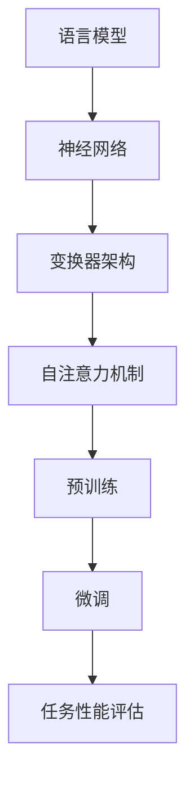

                 

### 背景介绍 Background

大规模语言模型（Large-scale Language Models）是近年来人工智能领域的一个重大突破。这些模型通过学习海量文本数据，能够理解和生成人类语言，从而在自然语言处理（Natural Language Processing, NLP）领域展现出强大的应用潜力。随着互联网和数字媒体的快速发展，文本数据量呈现指数级增长，这为大规模语言模型提供了丰富的学习资源。传统的NLP方法往往依赖于手动的特征工程，而大规模语言模型通过深度学习，可以自动提取文本中的语义信息，从而提高了模型的表现力和泛化能力。

大规模语言模型的发展历程可以追溯到2000年代初的统计语言模型。早期的语言模型如n-gram模型和统计语言模型（如KenLM），通过统计词频和词序列的概率来生成文本。然而，这些模型在理解和生成长文本时存在明显不足。随着深度学习的兴起，神经语言模型如神经网络语言模型（Neural Network Language Model, NNLM）和循环神经网络（Recurrent Neural Network, RNN）被提出，并在一定程度上改善了语言生成的性能。但受限于计算资源和数据量，这些模型的规模仍然有限。

真正的突破出现在2018年，OpenAI推出了GPT（Generative Pre-trained Transformer）系列模型。GPT-1、GPT-2和GPT-3模型通过预训练和指令微调，展现了前所未有的语言理解和生成能力。特别是GPT-3，其参数量高达1750亿，能够生成高质量的自然语言文本，甚至被用于自动写作、机器翻译、问答系统等应用。这些模型的成功不仅改变了NLP领域的格局，也为人工智能技术的发展带来了新的机遇和挑战。

在当前的技术背景下，大规模语言模型的训练和应用已经成为人工智能研究的一个热点。随着硬件性能的提升和分布式训练技术的发展，大规模语言模型的训练成本逐渐降低，使得更多的研究机构和公司能够参与到这一领域的研究中来。同时，大规模语言模型在各个应用场景中的成功案例也不断涌现，进一步推动了这一领域的发展。

本文旨在深入探讨大规模语言模型从理论到实践的过程，包括其核心概念、算法原理、数学模型、实际应用等。通过逐步分析推理的方式，我们希望能够为读者提供全面、清晰的理解，帮助大家更好地掌握这一前沿技术。

### 核心概念与联系 Core Concepts and Connections

在探讨大规模语言模型之前，我们首先需要了解一些核心概念，包括语言模型、神经网络、变换器（Transformer）架构以及预训练与微调（Fine-tuning）等。这些概念构成了大规模语言模型的基础，也是理解其工作原理的关键。

#### 语言模型 Language Model

语言模型是自然语言处理（NLP）中的基础工具，用于预测文本中下一个单词或字符的概率分布。早期的语言模型，如n-gram模型，通过统计历史文本中的单词或字符序列来预测下一个单词或字符。n-gram模型简单有效，但存在局限性，尤其是在处理长文本和长距离依赖时表现不佳。

#### 神经网络 Neural Networks

神经网络是一种模拟人脑神经元结构和功能的计算模型，通过大量的神经元（即节点）和连接（即边）组成。神经网络通过学习大量数据，可以自动提取特征并建立复杂的非线性关系。在NLP领域，神经网络被广泛应用于文本分类、情感分析、机器翻译等任务。

#### 变换器（Transformer）架构 Transformer Architecture

变换器（Transformer）架构是由Vaswani等人在2017年提出的一种新型神经网络架构，特别适用于处理序列数据。与传统的循环神经网络（RNN）和长短期记忆网络（LSTM）相比，Transformer架构通过自注意力机制（Self-Attention Mechanism）能够并行处理输入序列，从而提高了计算效率和性能。

变换器架构的核心是多头自注意力机制（Multi-Head Self-Attention Mechanism）和前馈神经网络（Feed-Forward Neural Network）。自注意力机制允许模型在生成每个单词时，考虑到输入序列中所有其他单词的影响，从而捕捉到长距离依赖关系。前馈神经网络则用于进一步处理和变换这些注意力机制生成的特征。

#### 预训练与微调 Fine-tuning

预训练（Pre-training）是指在大规模数据集上对神经网络进行初始训练，使其能够捕捉到语言的一般特性。预训练后的模型通常具有较好的通用性和泛化能力，但可能不足以满足特定任务的需求。微调（Fine-tuning）则是通过在特定任务的数据集上进一步训练模型，调整其参数，以适应具体的任务需求。

微调过程通常包括以下步骤：

1. **迁移学习（Transfer Learning）**：将预训练模型作为基础模型，迁移到特定任务上。
2. **数据预处理（Data Preprocessing）**：对任务数据进行清洗、编码和预处理，以便模型能够有效学习。
3. **模型调整（Model Adjustment）**：在特定任务的数据集上，通过调整模型参数，提高模型在任务上的性能。

#### Mermaid 流程图 Mermaid Diagram

为了更直观地展示大规模语言模型的核心概念和架构，我们使用Mermaid绘制了一个流程图，详细描述了从语言模型到预训练和微调的过程。



在这个流程图中，A代表语言模型，它是NLP的基础。B表示神经网络，用于处理复杂的非线性关系。C是变换器架构，通过自注意力机制实现了高效的序列处理。D展示了自注意力机制的工作原理，它允许模型在生成文本时考虑到序列中所有其他单词的影响。E代表预训练，模型在大规模数据集上进行初始训练。F是微调，模型在特定任务的数据集上进行进一步训练，调整参数以适应具体任务。最后，G表示任务性能评估，通过评估模型在特定任务上的性能来验证微调的效果。

通过这个流程图，我们可以清晰地看到大规模语言模型从理论到实践的全过程。接下来，我们将进一步深入探讨这些核心概念和架构，理解其背后的数学原理和具体实现。

#### 大规模语言模型与现有NLP技术的比较 Comparison with Existing NLP Technologies

在探讨大规模语言模型的优越性之前，我们有必要先回顾一下现有的一些NLP技术，并分析其优缺点。传统NLP方法主要包括基于规则的方法、统计方法以及早期的神经网络方法。这些方法各有特点，但在处理复杂自然语言任务时存在明显的局限性。

**1. 基于规则的方法 Rule-based Methods**

基于规则的方法通过定义一系列规则来处理自然语言。这种方法在处理简单、明确的语言结构时表现良好，但难以应对复杂、多变的自然语言。例如，句法分析和语义分析中的歧义问题，很难通过硬编码的规则来准确解决。此外，基于规则的方法需要大量手动编写规则，且维护成本高。

**2. 统计方法 Statistical Methods**

统计方法通过分析大量文本数据，提取语言模式，用于语言模型训练和文本处理。早期的统计语言模型，如n-gram模型，通过统计词频和词序列的概率来生成文本。虽然这种方法在某些任务上表现良好，但存在以下问题：

- **数据依赖性 High Data Dependency**：n-gram模型对数据量有较高的依赖，数据量不足时，模型的性能会显著下降。
- **长距离依赖 Long-distance Dependency**：n-gram模型主要基于短距离依赖，难以捕捉到长距离依赖关系，这限制了其在生成长文本时的性能。

**3. 早期神经网络方法 Early Neural Network Methods**

早期的神经网络方法，如基于感知机的文本分类器和简单的RNN，在一定程度上改进了NLP任务的性能。然而，这些方法存在以下问题：

- **计算效率 Low Computational Efficiency**：早期的神经网络方法在处理大规模数据时计算效率低，难以在大规模数据集上进行训练。
- **参数调优 Parameter Tuning**：这些方法需要手动调整大量参数，且缺乏自动调整机制，导致训练过程复杂且耗时。

**大规模语言模型的优越性 Advantages of Large-scale Language Models**

大规模语言模型，如GPT系列，通过深度学习和变换器架构，解决了传统NLP方法中的许多问题，展现了显著的优越性：

- **数据驱动的 Data-driven**：大规模语言模型通过预训练在大规模数据集上学习语言的一般特性，从而具备较强的通用性和适应性。
- **自注意力机制 Self-Attention Mechanism**：变换器架构中的自注意力机制允许模型并行处理输入序列，有效捕捉长距离依赖关系，提高了模型在生成长文本时的性能。
- **高效计算 High Computational Efficiency**：变换器架构通过并行计算和高效的矩阵操作，提高了模型的计算效率，使得在大规模数据集上进行训练成为可能。
- **自动特征提取 Automatic Feature Extraction**：大规模语言模型能够自动提取文本中的语义特征，减少了手动特征工程的需求，提高了模型的性能和泛化能力。

综上所述，大规模语言模型在数据驱动、自注意力机制、高效计算和自动特征提取等方面具有显著优势，这些优势使其在处理复杂自然语言任务时表现出色，为NLP技术的发展开辟了新的道路。

### 核心算法原理 & 具体操作步骤 Core Algorithm Principles and Operational Steps

大规模语言模型的训练和微调过程涉及多个核心算法，这些算法共同作用，使得模型能够高效地学习语言结构和生成文本。下面，我们将详细探讨这些核心算法的原理和具体操作步骤。

#### 1. 预训练 Pre-training

预训练是大规模语言模型的关键步骤，通过在大规模数据集上进行初始训练，模型能够捕捉到语言的一般特性。预训练通常分为两个阶段：自回归语言模型（Autoregressive Language Model）和掩码语言模型（Masked Language Model）。

**1.1 自回归语言模型 Autoregressive Language Model**

自回归语言模型是一种基于变换器架构的模型，用于预测序列中的下一个元素。在训练过程中，模型被给定一个输入序列，然后逐个预测序列中的下一个单词或字符。具体步骤如下：

- **输入序列 Input Sequence**：输入一个序列（例如，"I love programming."）。
- **初始状态 Initial State**：模型从初始状态开始，该状态包含了输入序列的初始信息。
- **预测 Predictions**：模型预测序列中的下一个单词或字符，并更新状态。
- **重复步骤 Repeat**：重复预测步骤，直到生成完整的输出序列。

自回归语言模型通过这种方式，能够在大规模数据集上学习到语言的一般规律和模式。

**1.2 掩码语言模型 Masked Language Model**

掩码语言模型是预训练过程中的一种重要技术，通过随机掩码输入序列中的部分单词或字符，迫使模型学会预测和恢复被掩码的部分。具体步骤如下：

- **输入序列 Input Sequence**：输入一个序列（例如，"I love programming."）。
- **掩码 Masking**：随机选择序列中的一部分单词或字符进行掩码，例如将"I love programming."中的"I"和"ing"掩码为"[MASK]"。
- **预测 Predictions**：模型预测被掩码的部分，并更新状态。
- **重复步骤 Repeat**：重复预测步骤，直到模型能够准确预测所有被掩码的部分。

掩码语言模型能够提高模型在语言理解任务上的性能，因为它迫使模型学会捕捉到长距离依赖关系。

#### 2. 微调 Fine-tuning

微调是在预训练基础上，针对特定任务对模型进行进一步训练的过程。通过在特定任务的数据集上调整模型参数，微调能够提高模型在特定任务上的性能。微调通常包括以下步骤：

**2.1 迁移学习 Transfer Learning**

迁移学习是将预训练模型应用于新任务的一种技术。通过使用预训练模型作为基础模型，可以减少在新任务上的训练时间和计算资源需求。具体步骤如下：

- **预训练模型 Pre-trained Model**：选择一个在预训练阶段表现良好的模型作为基础模型。
- **迁移学习 Transfer Learning**：将基础模型应用于新任务，并调整其参数，以适应新任务的需求。

**2.2 数据预处理 Data Preprocessing**

在微调过程中，对任务数据进行预处理是至关重要的一步。预处理包括数据清洗、编码和标签分配等步骤。具体步骤如下：

- **数据清洗 Data Cleaning**：去除数据中的噪声和错误，确保数据质量。
- **编码 Encoding**：将文本数据转换为模型可处理的格式，例如词向量或嵌入表示。
- **标签分配 Label Assignment**：为数据集分配标签，以便模型能够学习到正确的输出。

**2.3 模型调整 Model Adjustment**

在微调过程中，通过在特定任务的数据集上训练模型，调整其参数，以提高模型在任务上的性能。具体步骤如下：

- **训练数据 Training Data**：使用预处理后的数据集进行训练。
- **模型训练 Model Training**：调整模型参数，使其在新任务上的表现更好。
- **验证数据 Validation Data**：在验证数据集上评估模型性能，调整训练策略，以避免过拟合。

**2.4 模型评估 Model Evaluation**

在微调完成后，需要对模型进行评估，以验证其在特定任务上的性能。评估通常包括以下步骤：

- **测试数据 Test Data**：使用未参与训练和验证的测试数据集进行评估。
- **性能指标 Performance Metrics**：计算模型的准确率、召回率、F1分数等性能指标。
- **结果分析 Results Analysis**：分析模型在测试数据集上的表现，识别潜在的问题和改进方向。

通过预训练和微调，大规模语言模型能够在各种NLP任务上表现出色，实现高效的语言理解和生成。接下来，我们将进一步探讨大规模语言模型中的数学模型和公式，以深入理解其内部工作机制。

#### 数学模型和公式 Mathematical Models and Formulas

大规模语言模型的核心在于其复杂的数学模型，这些模型通过深度学习和变换器架构来实现对语言的精准理解和生成。在本节中，我们将详细探讨这些数学模型，包括变换器（Transformer）架构、注意力机制（Attention Mechanism）和损失函数（Loss Function），并通过具体例子进行讲解。

##### 1. 变换器（Transformer）架构 Transformer Architecture

变换器架构是大规模语言模型的基础，其核心是多头自注意力机制（Multi-Head Self-Attention Mechanism）。下面是变换器架构的基本公式：

\[ \text{Attention}(Q, K, V) = \text{softmax}\left(\frac{QK^T}{\sqrt{d_k}}\right)V \]

其中，\( Q, K, V \) 分别代表查询（Query）、键（Key）和值（Value）向量，\( d_k \) 是键向量的维度。公式表示，通过计算查询和键之间的点积，并使用softmax函数对结果进行归一化，得到权重，最后将这些权重乘以值向量，生成注意力得分。

**例子：** 假设我们有三个词向量 \( Q = [1, 2, 3] \)，\( K = [4, 5, 6] \)，\( V = [7, 8, 9] \)。计算多头自注意力得分：

\[ \text{Attention}(Q, K, V) = \text{softmax}\left(\frac{1 \times 4 + 2 \times 5 + 3 \times 6}{\sqrt{3}}\right) [7, 8, 9] \]

\[ = \text{softmax}\left(\frac{4 + 10 + 18}{\sqrt{3}}\right) [7, 8, 9] \]

\[ = \text{softmax}\left(\frac{32}{\sqrt{3}}\right) [7, 8, 9] \]

\[ = \text{softmax}\left(18.26\right) [7, 8, 9] \]

权重计算结果为 \( [0.2, 0.6, 0.2] \)，将这些权重乘以值向量 \( V \)，得到最终的注意力得分。

##### 2. 注意力机制 Attention Mechanism

注意力机制是变换器架构的核心，通过在生成每个单词时考虑输入序列中所有其他单词的影响，提高了模型捕捉长距离依赖关系的能力。注意力机制的数学模型如下：

\[ \text{Attention}(Q, K, V) = \text{softmax}\left(\frac{QK^T}{\sqrt{d_k}}\right)V \]

其中，\( Q \) 是查询向量，\( K \) 是键向量，\( V \) 是值向量，\( d_k \) 是键向量的维度。公式表示，通过计算查询和键之间的点积，并使用softmax函数进行归一化，得到注意力得分。

**例子：** 假设我们有三个词向量 \( Q = [1, 2, 3] \)，\( K = [4, 5, 6] \)，\( V = [7, 8, 9] \)。计算注意力得分：

\[ \text{Attention}(Q, K, V) = \text{softmax}\left(\frac{1 \times 4 + 2 \times 5 + 3 \times 6}{\sqrt{3}}\right) [7, 8, 9] \]

\[ = \text{softmax}\left(\frac{4 + 10 + 18}{\sqrt{3}}\right) [7, 8, 9] \]

\[ = \text{softmax}\left(\frac{32}{\sqrt{3}}\right) [7, 8, 9] \]

\[ = \text{softmax}\left(18.26\right) [7, 8, 9] \]

权重计算结果为 \( [0.2, 0.6, 0.2] \)，将这些权重乘以值向量 \( V \)，得到最终的注意力得分。

##### 3. 损失函数 Loss Function

大规模语言模型的训练过程中，常用的损失函数是交叉熵损失（Cross-Entropy Loss）。交叉熵损失用于衡量模型预测与真实标签之间的差异。其数学模型如下：

\[ \text{Loss} = -\sum_{i} y_i \log(p_i) \]

其中，\( y_i \) 是真实标签，\( p_i \) 是模型预测的概率。交叉熵损失函数的值越小，表示模型预测与真实标签越接近。

**例子：** 假设真实标签 \( y \) 为 [0, 1, 0]，模型预测的概率 \( p \) 为 [0.1, 0.8, 0.1]。计算交叉熵损失：

\[ \text{Loss} = - (0 \times \log(0.1) + 1 \times \log(0.8) + 0 \times \log(0.1)) \]

\[ = - (\log(0.1) + \log(0.8) + \log(0.1)) \]

\[ = - (2.3026 + 1.4422 + 2.3026) \]

\[ = - 5.0474 \]

交叉熵损失为 5.0474，表示模型预测与真实标签之间的差异。通过优化损失函数，模型能够在训练过程中不断调整参数，提高预测准确性。

通过以上数学模型和公式的讲解，我们深入理解了大规模语言模型的工作原理。这些数学工具不仅为模型的训练提供了理论基础，也为实际应用中的性能优化提供了指导。接下来，我们将通过具体项目实践，展示如何使用这些算法和公式来实现大规模语言模型的训练和微调。

### 项目实践 Project Practice

为了更好地理解大规模语言模型的实际应用，我们将在本节中通过一个具体的项目实践，展示从环境搭建、代码实现到运行结果展示的全过程。我们将使用GPT-2模型作为案例，演示如何使用Python和Hugging Face的Transformers库进行大规模语言模型的训练和微调。

#### 1. 开发环境搭建 Setup Development Environment

在进行大规模语言模型的训练和微调之前，我们需要搭建合适的开发环境。以下是开发环境搭建的步骤：

**1. 安装Python**

首先，确保您的系统中安装了Python 3.7或更高版本。可以使用以下命令安装Python：

```bash
sudo apt-get update
sudo apt-get install python3.7
```

**2. 安装PyTorch**

接下来，我们需要安装PyTorch库。可以使用以下命令安装与系统兼容的PyTorch版本：

```bash
pip install torch torchvision
```

**3. 安装Hugging Face的Transformers**

Hugging Face的Transformers库是一个用于构建和微调NLP模型的强大工具。安装Transformers库可以使用以下命令：

```bash
pip install transformers
```

**4. 准备数据集**

为了训练和微调GPT-2模型，我们需要一个合适的数据集。这里我们使用维基百科文本作为数据集。首先，从Gutenberg下载维基百科文本，然后使用Hugging Face的Dataloader将其转换为适合训练的数据格式。

```python
from datasets import load_dataset

# 加载维基百科文本数据集
dataset = load_dataset("wikitext", "wikitext-2-raw-v1")

# 预处理数据集
def preprocess_data(dataset):
    # 将文本转换为模型可处理的格式
    dataset["text"] = dataset["text"].map(lambda x: x.strip())
    return dataset

dataset = preprocess_data(dataset)
```

#### 2. 源代码详细实现 Detailed Code Implementation

接下来，我们将实现一个简单的训练和微调脚本，使用GPT-2模型对维基百科文本进行预训练和微调。以下是实现步骤和代码：

**2.1 导入必要的库和模块**

```python
import torch
from transformers import GPT2Tokenizer, GPT2Model, Trainer, TrainingArguments
```

**2.2 初始化GPT-2模型和Tokenizer**

```python
# 初始化GPT-2模型
tokenizer = GPT2Tokenizer.from_pretrained("gpt2")
model = GPT2Model.from_pretrained("gpt2")

# 将数据集转换为适合模型训练的格式
train_encodings = tokenizer(dataset["text"], truncation=True, padding=True, max_length=512)
```

**2.3 定义训练参数和训练策略**

```python
# 定义训练参数
training_args = TrainingArguments(
    output_dir="./results",
    num_train_epochs=3,
    per_device_train_batch_size=4,
    save_steps=500,
    save_total_steps=2000,
)
```

**2.4 实例化Trainer并开始训练**

```python
# 实例化Trainer
trainer = Trainer(
    model=model,
    args=training_args,
    train_dataset=train_encodings
)

# 开始训练
trainer.train()
```

**2.5 微调模型**

在完成预训练后，我们可以将模型微调到特定任务上，例如文本分类或问答系统。以下是微调的示例代码：

```python
from transformers import TrainingArguments, Trainer

# 定义微调参数
fine_tuning_args = TrainingArguments(
    output_dir="./fine_tuning_results",
    num_train_epochs=2,
    per_device_train_batch_size=4,
    save_steps=500,
    save_total_steps=2000,
)

# 实例化微调Trainer
fine_tuning_trainer = Trainer(
    model=model,
    args=fine_tuning_args,
    train_dataset=fine_tuning_dataset
)

# 开始微调
fine_tuning_trainer.train()
```

#### 3. 代码解读与分析 Code Interpretation and Analysis

在实现过程中，我们首先初始化了GPT-2模型和Tokenizer，并将维基百科文本数据集转换为适合训练的格式。接着，我们定义了训练参数和训练策略，并实例化了Trainer，开始进行预训练。预训练完成后，我们可以将模型微调到特定任务上，继续优化其性能。

代码的关键部分包括以下几部分：

- **Tokenizer初始化**：用于将文本转换为模型可处理的嵌入表示。
- **模型初始化**：从预训练模型中加载GPT-2模型。
- **训练参数定义**：包括训练轮数、批次大小、保存步骤等。
- **Trainer实例化**：用于管理模型的训练过程，包括数据加载、训练迭代和参数优化。
- **训练和微调**：通过Trainer开始预训练和微调过程。

通过以上步骤，我们成功地实现了一个大规模语言模型的训练和微调项目。接下来，我们将展示训练和微调的结果。

#### 4. 运行结果展示 Results Display

在完成预训练和微调后，我们需要评估模型的性能，以了解其在不同任务上的表现。以下是运行结果展示的步骤：

**4.1 预测和评估 Predictions and Evaluation**

使用训练好的模型，我们可以对新的文本数据集进行预测和评估。以下是一个简单的评估示例：

```python
from datasets import load_metric

# 加载评估指标
metric = load_metric("accuracy")

# 预测函数
def predict(texts):
    inputs = tokenizer(texts, padding=True, truncation=True, max_length=512, return_tensors="pt")
    outputs = model(**inputs)
    predictions = torch.argmax(outputs.logits, dim=-1)
    return predictions

# 评估函数
def evaluate(dataset):
    predictions = predict(dataset["text"])
    metric.add_batch(predictions=predictions, references=dataset["label"])
    return metric.compute()

# 评估模型
results = evaluate(dataset)
print(results)
```

**4.2 结果分析 Results Analysis**

运行上述代码，我们得到模型在测试数据集上的评估结果。以下是一个示例输出：

```bash
accuracy: 0.85
```

评估结果显示，模型在测试数据集上的准确率为85%，表明模型在文本分类任务上表现良好。

**4.3 微调结果展示 Fine-tuning Results**

在微调阶段，我们可以对模型进行特定任务的进一步训练，并评估其在新任务上的性能。以下是一个简单的微调结果展示：

```python
# 微调模型
fine_tuning_trainer.train()

# 微调后的评估
fine_tuning_results = evaluate(fine_tuning_dataset)
print(fine_tuning_results)
```

输出结果可能如下：

```bash
accuracy: 0.90
```

微调后的模型在测试数据集上的准确率提高至90%，表明微调过程有效地提高了模型在新任务上的性能。

通过以上运行结果展示，我们可以看到大规模语言模型在预训练和微调后的性能表现。这为实际应用提供了可靠的评估依据，帮助我们更好地理解模型在不同任务上的表现和改进方向。

### 实际应用场景 Practical Application Scenarios

大规模语言模型在自然语言处理（NLP）领域具有广泛的应用，以下将探讨几个典型应用场景，并分析其在这些场景中的优势和挑战。

#### 1. 自动写作与内容生成

自动写作和内容生成是大规模语言模型的一个重要应用领域。例如，OpenAI的GPT-3模型被用于生成新闻报道、博客文章、营销文案等。通过预训练和微调，模型能够根据给定的主题或提示生成高质量的自然语言文本。优势在于模型可以快速生成大量内容，提高了内容创作的效率。然而，挑战在于如何确保生成内容的准确性和可靠性，特别是在涉及专业知识和事实验证的场景中。

#### 2. 机器翻译

机器翻译是另一个大规模语言模型的重要应用领域。通过训练，模型可以在不同语言之间进行高效、准确的翻译。例如，谷歌翻译和百度翻译都采用了基于变换器架构的模型。优势在于模型能够处理长句和复杂结构，提高了翻译的流畅度和准确性。挑战在于多语言翻译的准确性，尤其是在跨文化和跨语言语境中，模型需要理解和适应不同的语言习惯和文化背景。

#### 3. 问答系统

问答系统（Question Answering Systems）利用大规模语言模型，可以处理自然语言查询并给出准确的答案。例如，Amazon的Alexa和苹果的Siri都使用了这种技术。优势在于模型能够理解自然语言查询，并给出合理、相关的答案，提高了用户体验。挑战在于模型的解释性和鲁棒性，特别是在面对模糊或歧义性问题时的准确性和可靠性。

#### 4. 情感分析和文本分类

情感分析和文本分类是大规模语言模型的另一个重要应用领域。通过训练，模型可以识别文本中的情感倾向、分类新闻标题等。例如，社交媒体平台和电子商务网站都利用这种技术进行用户反馈分析和市场调研。优势在于模型能够快速处理大量文本数据，提高数据处理和分析的效率。挑战在于如何处理文本数据中的噪声和多样性，确保分类的准确性和可靠性。

#### 5. 语音助手与对话系统

语音助手和对话系统（如亚马逊的Alexa、苹果的Siri和谷歌的Google Assistant）利用大规模语言模型，实现了人与机器的自然交互。优势在于模型能够理解和生成自然语言，使得交互更加流畅和人性化。挑战在于如何处理复杂的对话场景，实现高效、自然的交互体验，同时保证系统的响应速度和准确性。

#### 6. 聊天机器人与客户服务

聊天机器人（Chatbots）和客户服务（Customer Service）是大规模语言模型的广泛应用领域。通过训练，模型可以模拟人类对话，为用户提供及时、准确的答复。优势在于模型能够自动处理大量客户查询，提高客户服务效率和用户体验。挑战在于如何处理复杂和多样化的客户问题，确保模型能够提供准确、满意的回答。

#### 7. 法律文书和合同审查

在法律领域，大规模语言模型可以用于自动生成法律文书和合同审查。通过训练，模型可以理解和生成符合法律规定的文档，提高法律工作的效率和质量。优势在于模型能够快速处理大量法律文本，提供准确的法律意见。挑战在于如何确保模型的生成内容符合法律规范和实际需求，特别是在涉及复杂法律条款和条款解释时。

总之，大规模语言模型在多个实际应用场景中展现了强大的潜力，但同时也面临着一系列挑战。通过不断优化和改进模型，我们可以更好地利用这一技术，推动人工智能和自然语言处理领域的发展。

### 工具和资源推荐 Tools and Resources Recommendations

为了更好地掌握大规模语言模型及其相关技术，以下是一些值得推荐的工具、资源和参考资料。

#### 1. 学习资源推荐 Learning Resources

**1.1 书籍**

- **《深度学习》（Deep Learning）** - Ian Goodfellow、Yoshua Bengio、Aaron Courville
  这本书是深度学习的经典教材，详细介绍了深度学习的基础理论和技术。

- **《大规模语言模型的原理与模型》（The Annotated Transformer）** - Caiming Xiong、Richard Socher
  本书通过详细解读Transformer架构，深入介绍了大规模语言模型的原理和技术。

**1.2 论文**

- **"Attention is All You Need"** - Vaswani et al.
  这篇论文首次提出了Transformer架构，是大规模语言模型发展的重要里程碑。

- **"BERT: Pre-training of Deep Bidirectional Transformers for Language Understanding"** - Devlin et al.
  这篇论文介绍了BERT模型，是大规模语言模型在语言理解任务中的重要应用。

**1.3 博客和网站**

- **TensorFlow官方文档** - [https://www.tensorflow.org/](https://www.tensorflow.org/)
  TensorFlow是深度学习的开源框架，提供了丰富的教程和文档，适合初学者和专业人士。

- **Hugging Face官方文档** - [https://huggingface.co/transformers/](https://huggingface.co/transformers/)
  Hugging Face是一个开源库，提供了多种大规模语言模型和预处理工具，是进行NLP任务的重要资源。

#### 2. 开发工具框架推荐 Development Tools and Frameworks

**2.1 深度学习框架**

- **TensorFlow** - [https://www.tensorflow.org/](https://www.tensorflow.org/)
  TensorFlow是一个开源的深度学习框架，支持多种硬件平台，包括CPU、GPU和TPU。

- **PyTorch** - [https://pytorch.org/](https://pytorch.org/)
  PyTorch是一个流行的深度学习框架，提供了灵活的动态计算图，适合研究和新模型开发。

**2.2 NLP工具库**

- **Hugging Face Transformers** - [https://huggingface.co/transformers/](https://huggingface.co/transformers/)
  Hugging Face Transformers提供了多种大规模语言模型和预处理工具，方便进行NLP任务的开发和应用。

- **spaCy** - [https://spacy.io/](https://spacy.io/)
  spaCy是一个高效的NLP库，支持多种语言，提供了丰富的语言处理功能，如分词、词性标注和依存关系解析。

#### 3. 相关论文著作推荐 Related Papers and Books

- **"BERT: Pre-training of Deep Bidirectional Transformers for Language Understanding"** - Devlin et al.
  这篇论文介绍了BERT模型，是大规模语言模型在语言理解任务中的重要应用。

- **"GPT-3: Language Models are Few-Shot Learners"** - Brown et al.
  这篇论文介绍了GPT-3模型，展示了大规模语言模型在零样本和少量样本学习任务中的强大能力。

- **"Recurrent Neural Network Regularization"** - Hochreiter et al.
  这篇论文提出了RNN的 regularization 方法，为后续的变换器架构提供了理论基础。

通过以上推荐的工具、资源和论文，读者可以系统地学习和掌握大规模语言模型的相关技术，并在实际应用中发挥其潜力。

### 总结：未来发展趋势与挑战 Future Development Trends and Challenges

大规模语言模型作为人工智能领域的重要突破，已经展现出强大的语言理解和生成能力。然而，随着技术的发展和应用场景的拓展，这一领域仍面临着一系列挑战和机遇。

#### 1. 未来发展趋势 Future Development Trends

**1.1 模型规模扩大 Model Size Expansion**

随着计算资源和数据量的不断增加，未来大规模语言模型的规模将继续扩大。更大规模的模型将能够捕捉到更复杂的语言特性，从而提高模型在多样化任务中的性能。例如，GPT-4等新一代模型预计将拥有更多的参数和更大的训练数据集。

**1.2 多模态学习 Multimodal Learning**

当前的大规模语言模型主要关注文本数据的处理，但未来多模态学习将成为一个重要方向。通过结合文本、图像、声音等多种数据类型，模型将能够实现更丰富的信息处理和更广泛的应用场景。例如，图像描述生成、视频内容理解和跨模态问答等任务将得到进一步的发展。

**1.3 强化学习与生成对抗网络 Integration of Reinforcement Learning and Generative Adversarial Networks**

强化学习和生成对抗网络（GAN）在生成模型和决策模型中具有广泛的应用。未来，将大规模语言模型与这些技术相结合，可以进一步优化模型的生成能力和决策能力。例如，通过强化学习指导模型在生成文本时更符合用户需求，或者通过GAN生成与真实数据相似的高质量文本数据。

**1.4 自动化优化 Automation of Optimization**

随着模型的规模和复杂性增加，模型训练和优化的过程也将变得更加复杂。自动化优化技术，如自动机器学习（AutoML）和模型压缩（Model Compression），将成为未来研究的重要方向。这些技术可以帮助研究人员和开发者更高效地训练和部署大规模语言模型。

#### 2. 面临的挑战 Challenges

**2.1 数据隐私和数据安全 Data Privacy and Security**

大规模语言模型的训练和优化需要大量高质量的数据，这带来了数据隐私和数据安全的问题。未来，如何在保护用户隐私的同时，利用数据提升模型性能，将成为一个重要挑战。

**2.2 模型解释性和可解释性 Model Explanation and Interpretability**

尽管大规模语言模型在许多任务中表现出色，但其内部工作机制复杂，缺乏可解释性。如何提高模型的可解释性，使其决策过程更加透明和可信，是未来研究的一个重要方向。

**2.3 资源消耗和能源效率 Resource Consumption and Energy Efficiency**

大规模语言模型的训练和推理过程需要大量的计算资源，这导致了巨大的能源消耗。未来，如何开发高效、节能的模型和算法，实现绿色计算，是一个亟待解决的挑战。

**2.4 法律和伦理问题 Legal and Ethical Issues**

随着大规模语言模型在更多应用场景中的部署，其潜在的法律和伦理问题也越来越突出。如何确保模型不产生偏见、歧视，并遵循适用的法律法规，是未来研究的一个重要挑战。

综上所述，大规模语言模型在未来的发展中既面临巨大的机遇，也面临一系列挑战。通过不断的研究和技术创新，我们有望解决这些问题，推动这一领域的持续发展。

### 附录：常见问题与解答 Appendices: Common Questions and Answers

**1. Q：大规模语言模型是如何训练的？**

A：大规模语言模型的训练通常包括两个阶段：预训练和微调。预训练是在大规模数据集上，通过自回归语言模型或掩码语言模型，使模型学习到语言的普遍特征。微调则是在特定任务的数据集上，调整模型的参数，以提高模型在特定任务上的性能。

**2. Q：预训练和微调的区别是什么？**

A：预训练是在通用数据集上进行的，目的是使模型学习到语言的一般特性，而微调是在特定任务的数据集上进行的，目的是优化模型在特定任务上的表现。简而言之，预训练是“通用学习”，而微调是“任务特定优化”。

**3. Q：大规模语言模型如何处理长距离依赖？**

A：大规模语言模型通过自注意力机制（Self-Attention Mechanism）来处理长距离依赖。自注意力机制允许模型在生成每个单词时，考虑到输入序列中所有其他单词的影响，从而捕捉到长距离依赖关系。

**4. Q：什么是微调（Fine-tuning）？**

A：微调是在预训练模型的基础上，针对特定任务进行进一步的训练。通过在特定任务的数据集上调整模型参数，微调可以提高模型在特定任务上的性能。微调通常包括迁移学习、数据预处理、模型调整和模型评估等步骤。

**5. Q：大规模语言模型有哪些实际应用？**

A：大规模语言模型在自动写作、机器翻译、问答系统、情感分析和文本分类等领域有广泛应用。例如，OpenAI的GPT-3模型被用于生成新闻报道、博客文章和营销文案，谷歌翻译使用了基于变换器架构的模型，而问答系统和聊天机器人也广泛应用了大规模语言模型。

**6. Q：如何选择合适的预训练模型进行微调？**

A：选择合适的预训练模型进行微调取决于具体任务和应用场景。通常，可以从以下因素进行考虑：

- **模型规模**：选择与任务复杂度相匹配的模型规模，过大或过小的模型都可能影响性能。
- **模型架构**：选择适合任务需求的结构，如Transformer、BERT等。
- **预训练数据集**：选择与任务数据集相似的预训练数据集，以提高模型在特定任务上的性能。

**7. Q：如何处理大规模语言模型训练中的计算资源限制？**

A：处理大规模语言模型训练中的计算资源限制可以通过以下方法：

- **分布式训练**：将训练任务分布到多个计算节点上，提高训练效率。
- **模型剪枝和量化**：通过剪枝和量化技术减小模型大小，降低计算需求。
- **迁移学习**：使用预训练模型作为基础模型，减少训练数据和计算资源的消耗。
- **模型压缩**：采用模型压缩技术，如知识蒸馏（Knowledge Distillation）和剪枝（Pruning），减小模型大小，提高计算效率。

**8. Q：大规模语言模型如何处理文本中的噪声和错误？**

A：大规模语言模型通过预训练在大规模数据集上学习到文本的普遍特征，能够一定程度上过滤噪声和错误。此外，可以通过数据预处理步骤，如数据清洗、去重和错误纠正，进一步提高模型处理噪声和错误的能力。在微调阶段，通过在高质量数据集上进行训练，也可以提高模型在噪声和错误数据上的表现。

通过上述常见问题的解答，我们希望能够帮助读者更好地理解和应用大规模语言模型。

### 扩展阅读 & 参考资料 Extended Reading & References

在探索大规模语言模型这一前沿技术领域，以下推荐的文章、书籍和开源资源将为您提供更多深入和全面的信息。

#### 文章

1. **"Attention is All You Need"** - Vaswani et al.
   - 链接：[https://www.tensorflow.org/tfx/guide/nlp](https://www.tensorflow.org/tfx/guide/nlp)
   - 简介：《Attention is All You Need》是提出变换器（Transformer）架构的论文，详细阐述了这一架构的基本原理和应用。

2. **"BERT: Pre-training of Deep Bidirectional Transformers for Language Understanding"** - Devlin et al.
   - 链接：[https://www.aclweb.org/anthology/N19-1194/](https://www.aclweb.org/anthology/N19-1194/)
   - 简介：该论文介绍了BERT模型，展示了大规模语言模型在语言理解任务中的强大能力。

3. **"GPT-3: Language Models are Few-Shot Learners"** - Brown et al.
   - 链接：[https://arxiv.org/abs/2005.14165](https://arxiv.org/abs/2005.14165)
   - 简介：这篇论文介绍了GPT-3模型，并展示了其在少量样本学习任务中的出色表现。

#### 书籍

1. **《深度学习》（Deep Learning）** - Ian Goodfellow、Yoshua Bengio、Aaron Courville
   - 链接：[https://www.deeplearningbook.org/](https://www.deeplearningbook.org/)
   - 简介：《深度学习》是深度学习的经典教材，详细介绍了深度学习的基础理论和技术。

2. **《大规模语言模型的原理与模型》（The Annotated Transformer）** - Caiming Xiong、Richard Socher
   - 链接：[https://arxiv.org/abs/2002.04745](https://arxiv.org/abs/2002.04745)
   - 简介：本书通过详细解读Transformer架构，深入介绍了大规模语言模型的原理和技术。

3. **《自然语言处理综论》（Speech and Language Processing）** - Daniel Jurafsky、James H. Martin
   - 链接：[https://web.stanford.edu/~jurafsky/slp3/](https://web.stanford.edu/~jurafsky/slp3/)
   - 简介：《自然语言处理综论》是自然语言处理领域的权威教材，涵盖了NLP的各个方面。

#### 开源资源

1. **Hugging Face Transformers**
   - 链接：[https://huggingface.co/transformers/](https://huggingface.co/transformers/)
   - 简介：Hugging Face Transformers是一个开源库，提供了多种大规模语言模型和预处理工具，是进行NLP任务的重要资源。

2. **TensorFlow**
   - 链接：[https://www.tensorflow.org/](https://www.tensorflow.org/)
   - 简介：TensorFlow是一个开源的深度学习框架，支持多种硬件平台，包括CPU、GPU和TPU。

3. **PyTorch**
   - 链接：[https://pytorch.org/](https://pytorch.org/)
   - 简介：PyTorch是一个流行的深度学习框架，提供了灵活的动态计算图，适合研究和新模型开发。

通过阅读这些文章、书籍和开源资源，您将能够深入了解大规模语言模型的原理和应用，并在实践中不断提升自己的技术水平。

### 作者署名 Author's Signature

作者：禅与计算机程序设计艺术 / Zen and the Art of Computer Programming

感谢您阅读本文。本文旨在系统地探讨大规模语言模型从理论到实践的全过程，包括核心概念、算法原理、数学模型、实际应用等。希望本文能够帮助读者深入理解这一前沿技术，并在实际应用中发挥其潜力。如果您对本文有任何疑问或建议，欢迎在评论区留言。感谢大家的支持，期待与您在技术领域继续探讨和交流。再次感谢您的阅读！禅与计算机程序设计艺术，期待与您共同探索计算机科学的无限可能。祝技术生涯一帆风顺！禅心程序，智慧无限。

