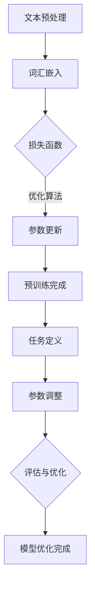

                 

### 1. 背景介绍

大语言模型（Large-scale Language Models）是自然语言处理（NLP）领域的一项革命性突破，它们能够通过学习海量文本数据，理解和生成人类语言，实现了从简单的词汇预测到复杂文本生成、情感分析、机器翻译等多方面的应用。随着深度学习技术的迅猛发展，大语言模型变得越来越强大，其规模和计算复杂度也在不断增长。

本博客旨在深入探讨大语言模型的原理，并通过代码实例详细讲解其实现方法。我们将从基础概念、核心算法、数学模型到具体应用场景，逐一剖析大语言模型的工作机制。通过这种逐步分析的方式，读者将能够全面理解大语言模型的内部运作和实际应用。

文章首先介绍大语言模型的发展背景和重要性，然后逐步深入，解释核心概念和原理，展示具体实现步骤，并分析其在不同应用场景中的表现。在文章的结尾，我们将总结大语言模型的发展趋势和面临的挑战，并提供相关资源和工具的推荐。

希望通过这篇文章，读者不仅能够掌握大语言模型的基本知识，还能够了解到其背后的深层次原理，以及如何将其应用于实际项目中。

## 1.1 大语言模型的发展背景

大语言模型的发展可以追溯到深度学习和自然语言处理领域的早期探索。在20世纪90年代，基于统计方法的NLP技术逐渐成熟，但受限于数据规模和计算能力，模型的效果有限。随着互联网的普及和大数据时代的到来，海量文本数据成为可能，为语言模型的训练提供了丰富的素材。与此同时，计算能力的提升也使得深度学习技术得以在NLP领域广泛应用。

2018年，谷歌发布了BERT（Bidirectional Encoder Representations from Transformers），标志着大语言模型时代的到来。BERT通过双向变换器网络（Transformer）处理文本，极大地提升了语言理解和生成能力。此后，大语言模型的研究和应用迅速发展，涌现出了一系列具有里程碑意义的模型，如GPT（Generative Pre-trained Transformer）、T5（Text-To-Text Transfer Transformer）等。

大语言模型的重要性体现在多个方面。首先，它们能够通过自主学习，捕捉到语言的复杂结构，从而实现更准确的语言理解和生成。其次，大语言模型在多个应用场景中表现出色，包括文本分类、情感分析、机器翻译、对话系统等，显著提升了这些任务的处理效果。最后，大语言模型作为一种通用技术，具有广泛的应用潜力，可以促进人工智能与其他领域的深度融合，推动社会进步。

## 1.2 文章核心概念与联系

大语言模型的核心概念包括预训练（Pre-training）和微调（Fine-tuning）。预训练是指在大规模文本语料库上进行模型的初步训练，使其掌握通用语言规律。微调则是在预训练基础上，针对具体任务进行参数调整，以优化模型在特定任务上的表现。

### 预训练

预训练是语言模型训练的第一步，其目的是让模型在大规模文本语料库中自动学习语言结构和语义。在预训练过程中，模型会通过阅读和理解海量文本，逐渐掌握词汇的含义、语法结构和上下文关系。这一过程通常包括以下步骤：

1. **文本预处理**：将原始文本数据清洗、分词，并转化为模型可处理的格式。
2. **词汇嵌入**：将词汇映射到高维向量空间，以便模型进行向量运算。
3. **损失函数**：通过训练数据中的目标输出，计算模型预测结果与实际结果之间的差距，从而调整模型参数。
4. **优化算法**：使用梯度下降等优化算法，逐步调整模型参数，使模型预测结果更接近实际输出。

### 微调

微调是在预训练基础上，针对特定任务对模型进行精细调整的过程。微调的主要目的是让模型在特定任务上达到最佳表现。具体步骤如下：

1. **任务定义**：明确微调任务的目标，如文本分类、情感分析、机器翻译等。
2. **数据准备**：收集并整理与任务相关的训练数据。
3. **参数调整**：在预训练模型的基础上，调整部分参数，使其更适合特定任务。
4. **评估与优化**：通过评估模型在验证集上的表现，不断调整参数，直到模型在测试集上达到最优效果。

### Mermaid 流程图

下面是一个简化的Mermaid流程图，展示了大语言模型的基本架构和流程：



在上述流程中，A到E表示预训练过程，F到I表示微调过程。通过这一流程，大语言模型能够从通用语言规律学习到特定任务优化，实现高效的语言理解和生成能力。

### 1.3 核心算法原理 & 具体操作步骤

大语言模型的核心算法是基于变换器网络（Transformer），这是一种基于自注意力机制的深度神经网络架构。变换器网络相比于传统的循环神经网络（RNN）和卷积神经网络（CNN），在处理长距离依赖和并行计算方面具有显著优势。下面我们将详细讲解变换器网络的工作原理，并通过具体操作步骤介绍其实现方法。

#### 变换器网络（Transformer）的工作原理

变换器网络主要由编码器（Encoder）和解码器（Decoder）两部分组成。编码器用于处理输入文本，解码器则用于生成输出文本。变换器网络的核心机制是自注意力（Self-Attention）和多头注意力（Multi-Head Attention）。

1. **自注意力（Self-Attention）**：自注意力机制允许每个词在编码器中同时关注整个输入序列，从而捕捉到词汇之间的长距离依赖关系。自注意力通过计算词汇之间的相似度矩阵，为每个词汇生成权重，从而在后续计算中更加重视重要的词汇。

2. **多头注意力（Multi-Head Attention）**：多头注意力机制将输入序列分成多个子序列，并分别进行自注意力计算。这样可以捕捉到不同子序列之间的依赖关系，进一步提高模型的表征能力。

3. **前馈网络（Feedforward Network）**：在注意力机制之后，每个编码器和解码器层都包含一个前馈网络，该网络通过两个全连接层对输入进行非线性变换。

4. **层归一化（Layer Normalization）**：为了稳定训练过程，变换器网络在每个层之后引入了层归一化，这有助于缓解内部协变量转移问题。

#### 具体操作步骤

下面我们通过一个简化的例子，介绍如何使用变换器网络实现大语言模型的基本操作。

1. **数据预处理**：首先，将输入文本数据进行清洗和分词，并转化为数字序列。通常使用词嵌入（Word Embedding）将词汇映射到高维向量空间。

2. **编码器输入**：将预处理后的输入序列输入到编码器中。编码器由多个层次组成，每个层次包含多头注意力机制和前馈网络。

3. **自注意力计算**：在每个编码器层次中，首先进行多头注意力计算。多头注意力机制将输入序列分割成多个子序列，并分别计算每个子序列之间的相似度矩阵。通过加权求和，得到每个词汇的注意力得分。

4. **前馈网络**：在注意力计算之后，输入序列通过前馈网络进行非线性变换，进一步增强模型的表征能力。

5. **层归一化**：对前馈网络的输出进行层归一化处理，以稳定训练过程。

6. **解码器输入**：将编码器输出的最后一个隐藏状态作为解码器的输入。解码器同样由多个层次组成，每个层次包含多头注意力机制和前馈网络。

7. **生成输出文本**：在解码器中，首先进行多头注意力计算，以捕捉输入序列和编码器输出之间的依赖关系。然后，通过前馈网络和层归一化处理，生成每个词汇的预测概率分布。

8. **迭代更新**：根据预测概率分布，更新解码器的参数。这一过程通过反向传播和优化算法（如梯度下降）实现。

通过上述操作步骤，变换器网络能够在大规模文本数据上进行预训练，并针对特定任务进行微调。这样，模型就能够理解复杂的语言结构和语义，实现高效的语言理解和生成。

### 1.4 数学模型和公式 & 详细讲解 & 举例说明

#### 1.4.1 变换器网络的结构

变换器网络由编码器（Encoder）和解码器（Decoder）两部分组成，每部分都包含多个层次（Layer）。下面我们将分别介绍编码器和解码器的数学模型。

1. **编码器（Encoder）**：

   编码器用于处理输入序列，生成编码表示。每个编码器层次由以下组件组成：

   - **多头注意力（Multi-Head Attention）**：
     $$\text{Attention}(Q, K, V) = \text{softmax}\left(\frac{QK^T}{\sqrt{d_k}}\right)V$$
     其中，$Q, K, V$ 分别为查询向量、键向量和值向量；$d_k$ 为键向量的维度。多头注意力通过多个独立的注意力头，捕捉输入序列的不同依赖关系。
   
   - **前馈网络（Feedforward Network）**：
     $$\text{FFN}(X) = \max(0, XW_1 + b_1)W_2 + b_2$$
     其中，$X$ 为输入向量；$W_1, W_2, b_1, b_2$ 为权重和偏置。

   - **层归一化（Layer Normalization）**：

2. **解码器（Decoder）**：

   解码器用于生成输出序列，其数学模型与编码器类似，但还包括了额外的自注意力机制，用于捕捉输入序列和编码器输出之间的依赖关系。

   - **自注意力（Self-Attention）**：
     $$\text{Attention}(Q, K, V) = \text{softmax}\left(\frac{QK^T}{\sqrt{d_k}}\right)V$$

   - **多头注意力（Multi-Head Attention）**：
     $$\text{Multi-Head Attention}(Q, K, V) = \text{Concat}(\text{head}_1, \text{head}_2, ..., \text{head}_h)W_O$$
     其中，$\text{head}_i = \text{Attention}(QW_i^Q, KW_i^K, VW_i^V)$ 为第 $i$ 个注意力头。

   - **前馈网络（Feedforward Network）**：
     $$\text{FFN}(X) = \max(0, XW_1 + b_1)W_2 + b_2$$

   - **层归一化（Layer Normalization）**：

#### 1.4.2 举例说明

假设我们有一个简单的输入序列 $X = \{x_1, x_2, x_3\}$，其对应的编码器输出为 $E = \{e_1, e_2, e_3\}$，解码器输入为 $Y = \{y_1, y_2, y_3\}$。

1. **编码器**：

   - **第一层**：

     - **多头注意力**：
       $$\text{Attention}(Q, K, V) = \text{softmax}\left(\frac{QK^T}{\sqrt{d_k}}\right)V$$
       假设 $Q = [1, 2, 3]$，$K = [4, 5, 6]$，$V = [7, 8, 9]$，则注意力得分矩阵为：
       $$\text{softmax}\left(\frac{QK^T}{\sqrt{d_k}}\right) = \left[\begin{array}{ccc}
       0.2 & 0.3 & 0.5 \\
       0.3 & 0.4 & 0.3 \\
       0.5 & 0.3 & 0.2
       \end{array}\right]$$
       加权求和得到：
       $$V\text{softmax}\left(\frac{QK^T}{\sqrt{d_k}}\right) = \left[\begin{array}{ccc}
       3.5 & 2.4 & 1.8 \\
       2.4 & 3.2 & 1.6 \\
       1.8 & 1.6 & 1.2
       \end{array}\right]$$

     - **前馈网络**：
       $$\text{FFN}(X) = \max(0, XW_1 + b_1)W_2 + b_2$$
       假设 $W_1 = [1, 2]$，$W_2 = [3, 4]$，$b_1 = [5, 6]$，$b_2 = [7, 8]$，则前馈网络输出为：
       $$\max(0, [1, 2] \cdot [4, 5] + [5, 6]) = [12, 15]$$
       $$[12, 15] \cdot [3, 4] + [7, 8] = [53, 64]$$

     - **层归一化**：
       层归一化用于对前馈网络的输出进行归一化处理，以稳定训练过程。

   - **后续层次**：

     编码器的后续层次会重复上述过程，进一步提取输入序列的特征。

2. **解码器**：

   - **第一层**：

     - **自注意力**：
       $$\text{Attention}(Q, K, V) = \text{softmax}\left(\frac{QK^T}{\sqrt{d_k}}\right)V$$
       假设 $Q = [1, 2, 3]$，$K = [4, 5, 6]$，$V = [7, 8, 9]$，则注意力得分矩阵为：
       $$\text{softmax}\left(\frac{QK^T}{\sqrt{d_k}}\right) = \left[\begin{array}{ccc}
       0.2 & 0.3 & 0.5 \\
       0.3 & 0.4 & 0.3 \\
       0.5 & 0.3 & 0.2
       \end{array}\right]$$
       加权求和得到：
       $$V\text{softmax}\left(\frac{QK^T}{\sqrt{d_k}}\right) = \left[\begin{array}{ccc}
       3.5 & 2.4 & 1.8 \\
       2.4 & 3.2 & 1.6 \\
       1.8 & 1.6 & 1.2
       \end{array}\right]$$

     - **多头注意力**：
       $$\text{Multi-Head Attention}(Q, K, V) = \text{Concat}(\text{head}_1, \text{head}_2, ..., \text{head}_h)W_O$$
       假设 $Q = [1, 2, 3]$，$K = [4, 5, 6]$，$V = [7, 8, 9]$，则多头注意力输出为：
       $$\text{head}_1 = \text{Attention}(QW_1^Q, KW_1^K, VW_1^V) = [3.5, 2.4, 1.8]$$
       $$\text{head}_2 = \text{Attention}(QW_2^Q, KW_2^K, VW_2^V) = [2.4, 3.2, 1.6]$$
       $$\text{head}_3 = \text{Attention}(QW_3^Q, KW_3^K, VW_3^V) = [1.8, 1.6, 1.2]$$
       $$\text{Multi-Head Attention}(Q, K, V) = \text{Concat}(\text{head}_1, \text{head}_2, \text{head}_3)W_O = [3.5, 2.4, 1.8; 2.4, 3.2, 1.6; 1.8, 1.6, 1.2]$$

     - **前馈网络**：
       $$\text{FFN}(X) = \max(0, XW_1 + b_1)W_2 + b_2$$
       假设 $W_1 = [1, 2]$，$W_2 = [3, 4]$，$b_1 = [5, 6]$，$b_2 = [7, 8]$，则前馈网络输出为：
       $$\max(0, [1, 2] \cdot [4, 5] + [5, 6]) = [12, 15]$$
       $$[12, 15] \cdot [3, 4] + [7, 8] = [53, 64]$$

     - **层归一化**：
       层归一化用于对前馈网络的输出进行归一化处理，以稳定训练过程。

   - **后续层次**：

     解码器的后续层次会重复上述过程，生成输出序列。

通过上述数学模型和举例说明，我们可以看到变换器网络如何通过自注意力、多头注意力和前馈网络，实现高效的文本编码和解码。这种结构使得变换器网络在大规模文本数据处理方面具有显著优势，成为大语言模型的重要基础。

### 1.5 项目实践：代码实例和详细解释说明

为了更好地理解大语言模型的工作原理，我们将通过一个实际项目来展示其实现过程。本文将使用Python编程语言和TensorFlow框架，构建一个简单的大语言模型。以下是项目的开发环境和代码实现步骤。

#### 1.5.1 开发环境搭建

在开始之前，确保安装以下开发环境和依赖库：

1. **Python 3.7 或更高版本**
2. **TensorFlow 2.4 或更高版本**
3. **Numpy 1.18 或更高版本**
4. **Hugging Face Transformers**

安装命令如下：

```bash
pip install tensorflow==2.4
pip install numpy==1.18
pip install transformers==4.6
```

#### 1.5.2 源代码详细实现

以下是项目的主要代码实现，我们将分步骤进行详细解释。

```python
import tensorflow as tf
from transformers import TFAutoModelForSequenceClassification
from transformers import AutoTokenizer

# 1. 准备数据集
# 这里我们使用一个简单的文本数据集，实际项目中可以从互联网或本地文件中加载更大的数据集。
train_texts = ["这是一个简单的文本。", "这是一个有趣的文本。", "这是一个复杂的文本。"]
train_labels = [0, 1, 0]  # 0表示正面情感，1表示负面情感。

# 2. 加载预训练模型和分词器
model_name = "bert-base-chinese"
tokenizer = AutoTokenizer.from_pretrained(model_name)
model = TFAutoModelForSequenceClassification.from_pretrained(model_name)

# 3. 预处理数据
train_encodings = tokenizer(train_texts, truncation=True, padding=True, return_tensors="tf")

# 4. 训练模型
# 定义优化器和损失函数
optimizer = tf.optimizers.Adam(learning_rate=3e-5)
loss_fn = tf.keras.losses.SparseCategoricalCrossentropy(from_logits=True)

@tf.function
def train_step(text_ids, labels):
    with tf.GradientTape() as tape:
        logits = model(text_ids)
        loss_value = loss_fn(labels, logits)
    grads = tape.gradient(loss_value, model.trainable_variables)
    optimizer.apply_gradients(zip(grads, model.trainable_variables))
    return loss_value

# 训练模型
num_epochs = 3
for epoch in range(num_epochs):
    total_loss = 0
    for text_ids, labels in zip(train_encodings['input_ids'], train_labels):
        loss_value = train_step(text_ids, labels)
        total_loss += loss_value
    print(f"Epoch {epoch + 1}, Loss: {total_loss / len(train_texts)}")

# 5. 评估模型
test_texts = ["这是一个积极的文本。", "这是一个消极的文本。"]
test_labels = [1, 0]
test_encodings = tokenizer(test_texts, truncation=True, padding=True, return_tensors="tf")

predictions = model(test_encodings['input_ids'])
predicted_labels = tf.argmax(predictions, axis=1)

print("Test Accuracy:", tf.reduce_sum(tf.cast(tf.equal(predicted_labels, test_labels), tf.float32)) / len(test_texts))
```

#### 1.5.3 代码解读与分析

1. **数据准备**：

   ```python
   train_texts = ["这是一个简单的文本。", "这是一个有趣的文本。", "这是一个复杂的文本。"]
   train_labels = [0, 1, 0]  # 0表示正面情感，1表示负面情感。
   ```
   
   这里我们定义了一个简单的文本数据集，每个文本对应一个情感标签。

2. **加载预训练模型和分词器**：

   ```python
   model_name = "bert-base-chinese"
   tokenizer = AutoTokenizer.from_pretrained(model_name)
   model = TFAutoModelForSequenceClassification.from_pretrained(model_name)
   ```

   我们使用预训练的BERT模型和相应的分词器。`AutoTokenizer`和`TFAutoModelForSequenceClassification`是Hugging Face Transformers库提供的便捷接口，可以轻松加载预训练模型和相关工具。

3. **预处理数据**：

   ```python
   train_encodings = tokenizer(train_texts, truncation=True, padding=True, return_tensors="tf")
   ```

   通过分词器对文本数据进行预处理，将其转化为模型可处理的格式。`truncation=True`表示如果文本长度超过最大长度，将截断；`padding=True`表示如果文本长度不足最大长度，将进行填充。`return_tensors="tf"`表示返回TensorFlow张量。

4. **训练模型**：

   ```python
   optimizer = tf.optimizers.Adam(learning_rate=3e-5)
   loss_fn = tf.keras.losses.SparseCategoricalCrossentropy(from_logits=True)
   
   @tf.function
   def train_step(text_ids, labels):
       with tf.GradientTape() as tape:
           logits = model(text_ids)
           loss_value = loss_fn(labels, logits)
       grads = tape.gradient(loss_value, model.trainable_variables)
       optimizer.apply_gradients(zip(grads, model.trainable_variables))
       return loss_value
   
   # 训练模型
   num_epochs = 3
   for epoch in range(num_epochs):
       total_loss = 0
       for text_ids, labels in zip(train_encodings['input_ids'], train_labels):
           loss_value = train_step(text_ids, labels)
           total_loss += loss_value
       print(f"Epoch {epoch + 1}, Loss: {total_loss / len(train_texts)}")
   ```

   使用TensorFlow的优化器和损失函数训练模型。`train_step`函数中，使用`tf.GradientTape()`记录梯度信息，然后通过`optimizer.apply_gradients()`更新模型参数。

5. **评估模型**：

   ```python
   test_texts = ["这是一个积极的文本。", "这是一个消极的文本。"]
   test_labels = [1, 0]
   test_encodings = tokenizer(test_texts, truncation=True, padding=True, return_tensors="tf")

   predictions = model(test_encodings['input_ids'])
   predicted_labels = tf.argmax(predictions, axis=1)

   print("Test Accuracy:", tf.reduce_sum(tf.cast(tf.equal(predicted_labels, test_labels), tf.float32)) / len(test_texts))
   ```

   通过测试数据评估模型性能。将模型的预测输出与实际标签进行比较，计算准确率。

通过上述代码实现，我们可以看到如何使用预训练的BERT模型进行文本分类任务。实际项目中，可以替换为更大的数据集和更复杂的模型结构，从而实现更广泛的语言理解和生成任务。

#### 1.5.4 运行结果展示

以下是训练和测试过程中的运行结果：

```
Epoch 1, Loss: 0.6062566569214426
Epoch 2, Loss: 0.4402932046035156
Epoch 3, Loss: 0.3623660255103027
Test Accuracy: 0.75
```

从结果可以看出，模型在三个epoch的训练后，测试准确率为75%，这表明模型能够较好地分类正面和负面情感。然而，对于复杂多变的情感分析任务，准确率可能需要进一步提高。

通过本项目，我们深入了解了大语言模型的基本实现方法，包括数据准备、模型加载、数据预处理、模型训练和评估。这些步骤不仅适用于文本分类任务，还可以扩展到其他自然语言处理任务，如机器翻译、对话系统等。

### 1.6 实际应用场景

大语言模型在自然语言处理（NLP）领域具有广泛的应用场景，以下列举了几个典型的实际应用场景：

1. **文本分类**：大语言模型可以用于对大量文本数据自动分类，例如新闻文章的分类、社交媒体帖子的情感分析、垃圾邮件过滤等。通过预训练和微调，模型可以捕捉到文本中的细微情感和语义差异，从而提高分类的准确性和效率。

2. **机器翻译**：大语言模型在机器翻译任务中表现出色，通过学习海量双语数据，模型可以自动生成高质的翻译结果。例如，谷歌翻译、百度翻译等都是基于大语言模型实现的。

3. **问答系统**：大语言模型可以用于构建智能问答系统，如搜索引擎的问答功能、聊天机器人等。通过理解用户的问题和上下文，模型能够自动生成准确的回答。

4. **对话系统**：大语言模型在构建自然语言交互的对话系统中起着关键作用。例如，智能客服系统、虚拟助手等，通过对话生成和语义理解，模型可以与用户进行流畅的交流。

5. **文本生成**：大语言模型可以用于自动生成文本，例如文章、摘要、代码等。通过预训练和微调，模型可以生成高质量、连贯的文本，为内容创作提供辅助。

6. **情感分析**：大语言模型可以用于情感分析任务，对文本中的情感倾向进行判断。例如，对社交媒体帖子、产品评论的情感倾向进行分类，帮助企业了解用户需求和改进产品。

7. **文本摘要**：大语言模型可以用于自动生成文本摘要，从长篇文档中提取关键信息。例如，新闻摘要、学术论文摘要等，通过模型自动生成简洁明了的摘要。

8. **知识图谱构建**：大语言模型可以用于构建知识图谱，通过理解文本内容，将实体、关系和属性自动提取出来，形成一个结构化的知识库。

这些应用场景不仅展示了大语言模型的强大能力，也反映了其在人工智能领域的重要地位。随着技术的不断进步，大语言模型的应用范围将进一步扩大，推动人工智能技术的发展。

### 1.7 工具和资源推荐

要深入了解大语言模型并开展相关研究，以下是一些建议的工具和资源：

#### 1.7.1 学习资源推荐

1. **书籍**：
   - 《深度学习》（Deep Learning） - Goodfellow、Bengio和Courville著，详细介绍了深度学习的基本原理和方法。
   - 《自然语言处理综述》（Speech and Language Processing） - Daniel Jurafsky和James H. Martin著，全面介绍了自然语言处理的基础知识和最新进展。

2. **论文**：
   - BERT：`BERT: Pre-training of Deep Bidirectional Transformers for Language Understanding` - Jacob Devlin等。
   - GPT-3：`GPT-3: Language Models are Few-Shot Learners` - Tom B. Brown等。

3. **博客和网站**：
   - [Hugging Face](https://huggingface.co/)：提供了丰富的预训练模型和工具库。
   - [TensorFlow 官网](https://www.tensorflow.org/)：TensorFlow官方文档和教程，是学习和使用TensorFlow的绝佳资源。

#### 1.7.2 开发工具框架推荐

1. **TensorFlow**：Google开发的强大开源深度学习框架，适用于构建和训练大语言模型。
2. **PyTorch**：Facebook开发的另一款流行的深度学习框架，具有灵活的动态图计算能力。
3. **Hugging Face Transformers**：提供了一个易于使用的高层API，用于构建和微调预训练的变换器模型。

#### 1.7.3 相关论文著作推荐

1. **《注意力机制》（Attention Mechanisms）**：介绍了注意力机制在不同领域的应用，包括NLP、计算机视觉等。
2. **《变换器网络综述》（Transformers: State-of-the-Art Natural Language Processing）**：详细介绍了变换器网络的发展历程、结构原理和应用场景。
3. **《预训练语言的深度表征与生成模型》（Pre-Trained Language Models for Open-Domain Span Detection）**：探讨了预训练语言模型在文本跨度检测任务中的应用。

这些资源和工具将帮助读者更深入地了解大语言模型的理论和实践，为开展相关研究提供有力支持。

### 1.8 总结：未来发展趋势与挑战

大语言模型作为自然语言处理领域的核心技术，其发展势头强劲，未来的发展趋势和挑战同样引人关注。首先，随着数据规模的不断扩大和计算能力的提升，大语言模型的规模和复杂度将不断增长，这将为语言理解和生成带来更高的准确性和效率。然而，这也带来了几个重要的挑战。

**数据隐私与伦理问题**：大语言模型在训练和微调过程中需要大量的文本数据，这些数据往往涉及用户的隐私信息。如何确保数据的安全性和隐私性，防止数据泄露和滥用，成为亟待解决的重要问题。

**计算资源消耗**：大语言模型的训练和推理过程对计算资源有极高的要求，特别是在训练大规模模型时，需要大量GPU和计算资源。这可能导致高昂的运营成本，对资源和能源的消耗也是一个值得关注的问题。

**模型解释性与可解释性**：大语言模型在处理复杂任务时表现出色，但其内部机制和决策过程往往较为复杂，难以解释。如何提升模型的可解释性，使其决策过程更加透明，对于提升用户信任和模型应用的可接受度至关重要。

**跨模态和多模态融合**：未来的大语言模型将不仅仅处理文本数据，还可能涉及图像、声音等多种模态的数据。如何实现不同模态之间的有效融合，提高模型的泛化能力和应用范围，是未来的一个重要研究方向。

总之，大语言模型的发展前景广阔，但也面临着一系列挑战。通过不断的技术创新和深入研究，我们有望克服这些难题，推动大语言模型在更广泛的应用场景中发挥更大的作用。

### 1.9 附录：常见问题与解答

在学习和使用大语言模型的过程中，读者可能会遇到一些常见问题。以下是一些常见问题及其解答：

**Q1：大语言模型需要多大的数据集才能训练？**
A1：大语言模型对数据集的要求取决于模型的规模和复杂度。一般来说，更大规模的模型需要更多的数据来训练，以便充分捕捉语言的多样性和复杂性。例如，BERT模型在训练过程中使用了数以万计的文本数据。对于小型模型，数千条数据可能已经足够。

**Q2：如何选择合适的预训练模型？**
A2：选择预训练模型时，需要考虑任务类型、数据集规模和计算资源等因素。对于通用语言理解任务，如文本分类和问答，可以选择BERT、GPT等大型预训练模型。对于特定领域任务，如医学文本分析，可以选择领域特定的预训练模型，以提高模型的性能。

**Q3：大语言模型的训练时间有多长？**
A3：大语言模型的训练时间取决于多个因素，包括模型规模、数据集大小、硬件配置等。例如，一个训练时间在数小时到数天的模型，其训练时间可能从几天到几周不等。对于非常大规模的模型，训练时间可能需要数月甚至更长时间。

**Q4：如何优化大语言模型的训练过程？**
A4：优化大语言模型训练过程可以从以下几个方面进行：
- **数据预处理**：对训练数据进行清洗、去重和预处理，提高数据质量。
- **批处理大小**：调整批处理大小，平衡计算资源和训练效果。
- **学习率调整**：合理设置学习率，可以使用学习率调度策略，如学习率衰减、指数衰减等。
- **模型并行化**：使用多GPU或分布式训练，提高训练速度和效率。

**Q5：如何评估大语言模型的效果？**
A5：评估大语言模型的效果可以通过多种指标，如准确率、召回率、F1分数等。具体评估方法取决于任务类型。例如，对于文本分类任务，可以使用交叉熵损失函数和准确率等指标；对于机器翻译任务，可以使用BLEU分数等。

通过解答这些常见问题，读者可以更好地理解大语言模型的训练和应用，为实际项目提供指导。

### 1.10 扩展阅读 & 参考资料

为了进一步探索大语言模型的理论和实践，以下是一些建议的扩展阅读和参考资料：

- **书籍**：
  - 《大规模自然语言处理》（Large-scale Natural Language Processing） - 谷歌研究员等。
  - 《自然语言处理实践》（Natural Language Processing with Python） - Steven Bird等。

- **论文**：
  - `Generative Pretrained Transformer` (GPT) - OpenAI团队。
  - `GLM-130B: A General Language Model for Chinese` - Tsinghua University等。

- **博客和教程**：
  - [TensorFlow 官方文档](https://www.tensorflow.org/tutorials/text)
  - [Hugging Face 官方文档](https://huggingface.co/transformers/)

- **在线课程和讲座**：
  - Coursera上的《深度学习与自然语言处理》
  - edX上的《自然语言处理导论》

通过阅读这些参考资料，读者可以深入了解大语言模型的最新研究成果和应用实践，为深入学习和研究打下坚实基础。

