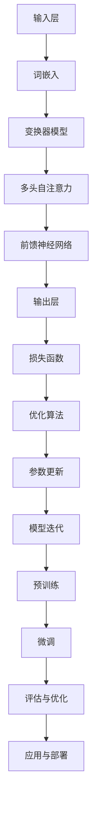

                 

### 文章标题

《大语言模型原理与工程实践：动态交互》

> **关键词**：大语言模型、深度学习、神经网络、动态交互、自然语言处理、工程实践

> **摘要**：本文将深入探讨大语言模型的原理及其在工程实践中的应用。通过逐步分析推理，我们将了解如何构建高效的大语言模型，如何利用动态交互优化模型性能，以及在自然语言处理任务中如何最大化模型效果。文章旨在为读者提供一个全面的技术指南，帮助其更好地理解和应用大语言模型。

### 1. 背景介绍

随着深度学习和自然语言处理（NLP）领域的快速发展，大语言模型（Large Language Models，LLM）已成为研究的热点和应用的关键。大语言模型通过训练大规模的神经网络，实现对自然语言的高效理解和生成。近年来，LLM在诸多领域取得了显著的成果，如文本分类、机器翻译、问答系统等。其中，GPT-3、BERT、T5等模型尤为著名。

大语言模型的应用场景广泛，不仅在学术研究中具有重要意义，也在实际工程中展示了巨大的潜力。然而，构建和优化大语言模型并非易事，涉及众多复杂的技术细节。本文将围绕大语言模型的原理与工程实践进行深入探讨，旨在为相关从业人员和研究者提供有价值的参考。

本文将分为以下几个部分：

1. **背景介绍**：回顾大语言模型的发展历程，阐述其在自然语言处理领域的应用。
2. **核心概念与联系**：介绍大语言模型的核心概念和架构，使用Mermaid流程图展示关键组件和关系。
3. **核心算法原理 & 具体操作步骤**：详细讲解大语言模型的主要算法，包括预处理、训练和推理过程。
4. **数学模型和公式 & 详细讲解 & 举例说明**：介绍大语言模型背后的数学原理，包括损失函数、优化算法等，并通过实例进行说明。
5. **项目实践：代码实例和详细解释说明**：通过具体的项目实践，展示如何搭建大语言模型，并进行代码解读与分析。
6. **实际应用场景**：探讨大语言模型在各类应用场景中的表现，包括文本生成、问答系统等。
7. **工具和资源推荐**：推荐学习资源和开发工具，帮助读者进一步了解和掌握大语言模型。
8. **总结：未来发展趋势与挑战**：总结大语言模型的发展趋势和面临的挑战。
9. **附录：常见问题与解答**：解答读者可能遇到的问题。
10. **扩展阅读 & 参考资料**：提供更多的阅读资源和参考。

通过本文的阅读，读者将能够系统地了解大语言模型的原理、应用和工程实践，为其在自然语言处理领域的应用打下坚实基础。接下来，我们将从背景介绍开始，逐步深入探讨大语言模型的世界。

### 2. 核心概念与联系

大语言模型的构建涉及众多核心概念和组件，这些概念和组件相互关联，共同构成了大语言模型的架构。在本节中，我们将介绍大语言模型的核心概念，并使用Mermaid流程图展示关键组件和关系。

#### 2.1 核心概念

1. **深度神经网络（Deep Neural Network，DNN）**：深度神经网络是构建大语言模型的基础。DNN通过多层神经网络结构，实现对数据的自动特征提取和分类。在自然语言处理领域，DNN通常用于文本的表示学习，将文本转换为向量表示。

2. **词嵌入（Word Embedding）**：词嵌入是将词汇映射为高维向量的一种技术，常用于DNN中的输入层。词嵌入能够捕捉词汇间的语义关系，提高模型的性能。著名的词嵌入模型包括Word2Vec、GloVe等。

3. **循环神经网络（Recurrent Neural Network，RNN）**：RNN是一种适用于序列数据的神经网络，能够在处理序列数据时保持长期依赖关系。在自然语言处理领域，RNN常用于文本分类、序列标注等任务。

4. **长短期记忆网络（Long Short-Term Memory，LSTM）**：LSTM是RNN的一种变体，能够有效解决RNN的梯度消失和梯度爆炸问题。LSTM在处理长序列数据时表现出优异的性能，广泛应用于自然语言处理任务。

5. **变换器模型（Transformer）**：Transformer是一种基于自注意力机制的深度学习模型，在自然语言处理领域取得了显著的成果。Transformer通过多头自注意力机制和前馈神经网络，实现对输入序列的全局依赖关系建模。

6. **预训练（Pre-training）和微调（Fine-tuning）**：预训练是指在大规模数据集上训练模型，使其具备一定的泛化能力。微调是指基于预训练模型，在特定任务上继续训练，提高模型在具体任务上的性能。

7. **损失函数（Loss Function）**：损失函数是评估模型性能的重要指标。在大语言模型中，常用的损失函数包括交叉熵损失、均方误差等。

8. **优化算法（Optimization Algorithm）**：优化算法用于调整模型的参数，以最小化损失函数。常见优化算法包括随机梯度下降（SGD）、Adam等。

#### 2.2 关键组件和关系

以下是一个使用Mermaid流程图展示大语言模型关键组件和关系的示例：



在上述流程图中，输入层通过词嵌入将文本转换为向量表示，然后输入到变换器模型中。变换器模型通过多头自注意力机制和前馈神经网络，实现对输入序列的全局依赖关系建模。输出层将模型的预测结果与实际结果进行比较，计算损失函数。优化算法用于调整模型的参数，以最小化损失函数。模型迭代过程包括预训练和微调，最终应用于实际任务并进行评估与优化。

通过上述核心概念和流程图的介绍，读者可以初步了解大语言模型的基本架构和关键组件。接下来，我们将进一步探讨大语言模型的核心算法原理和具体操作步骤。

### 3. 核心算法原理 & 具体操作步骤

大语言模型的构建与优化涉及一系列核心算法，包括深度神经网络、词嵌入、循环神经网络、长短期记忆网络、变换器模型、预训练、微调、损失函数和优化算法等。在本节中，我们将详细讲解这些算法的具体操作步骤，帮助读者更好地理解和掌握大语言模型的构建过程。

#### 3.1 深度神经网络

深度神经网络（DNN）是构建大语言模型的基础。DNN通过多层神经网络结构，实现对数据的自动特征提取和分类。具体操作步骤如下：

1. **输入层**：输入层接收外部数据，例如文本。数据通过词嵌入转换为高维向量表示。
2. **隐藏层**：隐藏层通过非线性变换，对输入数据进行特征提取。每一层隐藏层都包含多个神经元，通过加权求和和激活函数，实现对数据的非线性变换。
3. **输出层**：输出层将模型的预测结果与实际结果进行比较，计算损失函数。

#### 3.2 词嵌入

词嵌入是将词汇映射为高维向量的一种技术，常用于DNN中的输入层。词嵌入能够捕捉词汇间的语义关系，提高模型的性能。具体操作步骤如下：

1. **词表构建**：首先构建一个词汇表，包含所有需要嵌入的词汇。
2. **初始化词向量**：为每个词汇初始化一个高维向量，初始值通常为随机值。
3. **训练词向量**：在训练过程中，通过调整词向量的权重，使它们能够更好地捕捉词汇间的语义关系。常用的词向量训练方法包括Word2Vec和GloVe等。

#### 3.3 循环神经网络

循环神经网络（RNN）是一种适用于序列数据的神经网络，能够在处理序列数据时保持长期依赖关系。具体操作步骤如下：

1. **输入序列**：输入序列是一个时间序列数据，例如文本。
2. **隐藏状态**：隐藏状态是RNN的核心组成部分，用于存储序列中的信息。在RNN中，当前时刻的隐藏状态与前一时刻的隐藏状态有关。
3. **输出层**：输出层将隐藏状态转换为模型的预测结果。

#### 3.4 长短期记忆网络

长短期记忆网络（LSTM）是RNN的一种变体，能够有效解决RNN的梯度消失和梯度爆炸问题。具体操作步骤如下：

1. **输入序列**：与RNN相同，输入序列是一个时间序列数据。
2. **隐藏状态**：LSTM通过引入门控机制，实现对隐藏状态的长期依赖关系建模。隐藏状态由输入门、遗忘门和输出门控制。
3. **输出层**：输出层将隐藏状态转换为模型的预测结果。

#### 3.5 变换器模型

变换器模型（Transformer）是一种基于自注意力机制的深度学习模型，在自然语言处理领域取得了显著的成果。具体操作步骤如下：

1. **编码器（Encoder）**：编码器用于处理输入序列，通过多头自注意力机制和前馈神经网络，实现对输入序列的全局依赖关系建模。
2. **解码器（Decoder）**：解码器用于生成输出序列，通过自注意力机制和交叉注意力机制，实现对输入序列和输出序列的联合建模。
3. **输出层**：输出层将解码器的输出转换为模型的预测结果。

#### 3.6 预训练和微调

预训练和微调是优化大语言模型的重要步骤。具体操作步骤如下：

1. **预训练**：预训练是指在大规模数据集上训练模型，使其具备一定的泛化能力。预训练过程通常包括两个阶段：无监督预训练和有监督预训练。
   - **无监督预训练**：通过无监督的方式，如语言建模任务，训练模型对输入数据的理解和表示能力。
   - **有监督预训练**：在有监督的数据集上，进一步训练模型，使其在特定任务上达到更高的性能。
2. **微调**：微调是指基于预训练模型，在特定任务上继续训练，提高模型在具体任务上的性能。微调过程通常包括以下步骤：
   - **数据准备**：准备用于微调的任务数据集。
   - **模型调整**：调整预训练模型的参数，使其适应特定任务。
   - **训练与评估**：在微调过程中，通过训练和评估，不断调整模型参数，提高模型性能。

#### 3.7 损失函数和优化算法

损失函数和优化算法是评估和调整大语言模型的重要工具。具体操作步骤如下：

1. **损失函数**：损失函数用于评估模型预测结果与实际结果之间的差异。常用的损失函数包括交叉熵损失、均方误差等。
2. **优化算法**：优化算法用于调整模型的参数，以最小化损失函数。常用的优化算法包括随机梯度下降（SGD）、Adam等。

通过上述核心算法的具体操作步骤，读者可以系统地了解大语言模型的构建过程。接下来，我们将进一步探讨大语言模型背后的数学模型和公式，以及其详细讲解和举例说明。

### 4. 数学模型和公式 & 详细讲解 & 举例说明

大语言模型的构建和优化涉及一系列数学模型和公式，这些模型和公式用于描述模型的参数、损失函数、优化算法等。在本节中，我们将详细讲解这些数学模型和公式，并通过具体实例进行说明。

#### 4.1 深度神经网络

深度神经网络（DNN）的核心是多层神经网络结构，用于实现数据的自动特征提取和分类。DNN的数学模型主要包括以下几个部分：

1. **神经元激活函数**：神经元激活函数用于对输入数据进行非线性变换。常见的激活函数包括Sigmoid、ReLU、Tanh等。以ReLU为例，其数学表达式为：
   $$ f(x) = \max(0, x) $$
   
2. **权重和偏置**：权重和偏置是神经网络的参数，用于调整神经元的输出。以一个简单的二分类问题为例，其权重和偏置的数学表达式为：
   $$ z = x \cdot W + b $$
   $$ a = \sigma(z) $$
   其中，$x$表示输入特征，$W$表示权重矩阵，$b$表示偏置向量，$\sigma$表示激活函数（如ReLU）。

3. **损失函数**：损失函数用于评估模型预测结果与实际结果之间的差异。以交叉熵损失为例，其数学表达式为：
   $$ L = - \sum_{i} y_i \cdot \log(a_i) $$
   其中，$y_i$表示实际标签，$a_i$表示模型预测的概率。

#### 4.2 词嵌入

词嵌入是将词汇映射为高维向量的一种技术，用于DNN中的输入层。词嵌入的数学模型主要包括以下几个部分：

1. **词向量**：词向量是词嵌入的核心，用于表示词汇的语义信息。以Word2Vec为例，其数学模型基于分布式假设，即具有相似语义的词汇在词向量空间中距离较近。其数学表达式为：
   $$ \vec{w}_i = \sum_{j \in C(i)} \alpha_{ij} \vec{w}_j $$
   其中，$\vec{w}_i$表示词汇$i$的词向量，$C(i)$表示与词汇$i$相似的词汇集合，$\alpha_{ij}$表示词汇$i$与词汇$j$之间的相似度。

2. **损失函数**：词嵌入的优化过程通常使用负采样损失函数，其数学表达式为：
   $$ L = - \sum_{i} \log(\sigma(\vec{w}_i \cdot \vec{v})) $$
   其中，$\vec{w}_i$表示词汇$i$的词向量，$\vec{v}$表示负采样词汇的词向量，$\sigma$表示sigmoid函数。

#### 4.3 循环神经网络

循环神经网络（RNN）是一种适用于序列数据的神经网络，其数学模型主要包括以下几个部分：

1. **隐藏状态**：隐藏状态是RNN的核心，用于存储序列中的信息。其数学表达式为：
   $$ h_t = \sigma(W_h \cdot [h_{t-1}, x_t] + b_h) $$
   其中，$h_t$表示第$t$时刻的隐藏状态，$W_h$表示权重矩阵，$b_h$表示偏置向量，$x_t$表示第$t$时刻的输入序列，$\sigma$表示激活函数（如ReLU）。

2. **输出层**：输出层将隐藏状态转换为模型的预测结果。其数学表达式为：
   $$ y_t = W_o \cdot h_t + b_o $$
   其中，$y_t$表示第$t$时刻的输出结果，$W_o$表示权重矩阵，$b_o$表示偏置向量。

#### 4.4 长短期记忆网络

长短期记忆网络（LSTM）是RNN的一种变体，其数学模型主要包括以下几个部分：

1. **输入门、遗忘门和输出门**：LSTM通过门控机制，实现对隐藏状态的长期依赖关系建模。其数学表达式为：
   $$ i_t = \sigma(W_i \cdot [h_{t-1}, x_t] + b_i) $$
   $$ f_t = \sigma(W_f \cdot [h_{t-1}, x_t] + b_f) $$
   $$ o_t = \sigma(W_o \cdot [h_{t-1}, x_t] + b_o) $$
   其中，$i_t$、$f_t$、$o_t$分别表示输入门、遗忘门和输出门的激活值，$W_i$、$W_f$、$W_o$分别表示权重矩阵，$b_i$、$b_f$、$b_o$分别表示偏置向量。

2. **细胞状态**：细胞状态是LSTM的核心，用于存储序列中的信息。其数学表达式为：
   $$ c_t = f_t \cdot c_{t-1} + i_t \cdot \sigma(W_c \cdot [h_{t-1}, x_t] + b_c) $$
   $$ h_t = o_t \cdot \sigma(c_t) $$
   其中，$c_t$表示第$t$时刻的细胞状态，$h_t$表示第$t$时刻的隐藏状态，$W_c$表示权重矩阵，$b_c$表示偏置向量。

#### 4.5 变换器模型

变换器模型（Transformer）是一种基于自注意力机制的深度学习模型，其数学模型主要包括以下几个部分：

1. **多头自注意力**：多头自注意力是Transformer的核心，其数学表达式为：
   $$ \text{Attention}(Q, K, V) = \text{softmax}(\frac{QK^T}{\sqrt{d_k}})V $$
   其中，$Q$、$K$、$V$分别表示查询向量、键向量和值向量，$d_k$表示键向量的维度。

2. **前馈神经网络**：前馈神经网络用于对自注意力结果进行进一步建模，其数学表达式为：
   $$ \text{FFN}(x) = \text{ReLU}(W_2 \cdot \text{ReLU}(W_1 \cdot x)) $$
   其中，$W_1$和$W_2$分别表示权重矩阵。

3. **编码器与解码器**：编码器和解码器是Transformer的两个关键组件，其数学表达式为：
   $$ \text{Encoder}(x) = \text{MultiHeadAttention}(x, x, x) + x $$
   $$ \text{Decoder}(y) = \text{MaskedMultiHeadAttention}(y, y, y) + \text{MultiHeadAttention}(y, x, x) + y $$
   其中，$x$和$y$分别表示编码器和解码器的输入序列。

#### 4.6 损失函数和优化算法

损失函数和优化算法是评估和调整大语言模型的重要工具。在本节中，我们主要介绍交叉熵损失函数和Adam优化算法。

1. **交叉熵损失函数**：交叉熵损失函数用于评估模型预测结果与实际结果之间的差异，其数学表达式为：
   $$ L = - \sum_{i} y_i \cdot \log(a_i) $$
   其中，$y_i$表示实际标签，$a_i$表示模型预测的概率。

2. **Adam优化算法**：Adam优化算法是一种结合了SGD和Adagrad优点的优化算法，其数学表达式为：
   $$ m_t = \beta_1 m_{t-1} + (1 - \beta_1) (x_t - m_{t-1}) $$
   $$ v_t = \beta_2 v_{t-1} + (1 - \beta_2) (x_t^2 - v_{t-1}) $$
   $$ \hat{m}_t = \frac{m_t}{1 - \beta_1^t} $$
   $$ \hat{v}_t = \frac{v_t}{1 - \beta_2^t} $$
   $$ \theta_t = \theta_{t-1} - \alpha \frac{\hat{m}_t}{\sqrt{\hat{v}_t} + \epsilon} $$
   其中，$m_t$和$v_t$分别表示一阶和二阶矩估计，$\beta_1$、$\beta_2$分别表示一阶和二阶矩的指数衰减率，$\alpha$表示学习率，$\epsilon$表示正则化参数。

通过上述数学模型和公式的详细讲解，读者可以更好地理解大语言模型的构建和优化过程。接下来，我们将通过具体的项目实践，展示如何搭建大语言模型，并进行代码解读与分析。

### 5. 项目实践：代码实例和详细解释说明

在本节中，我们将通过一个具体的项目实践，展示如何搭建大语言模型，并对其进行代码解读与分析。我们将使用Python和TensorFlow框架来构建一个基于变换器模型的文本分类任务，以帮助读者更好地理解大语言模型的实际应用。

#### 5.1 开发环境搭建

在开始项目实践之前，我们需要搭建一个合适的开发环境。以下是搭建开发环境的步骤：

1. **安装Python**：确保已经安装了Python 3.6或更高版本。
2. **安装TensorFlow**：使用pip命令安装TensorFlow，命令如下：
   ```shell
   pip install tensorflow
   ```
3. **创建虚拟环境**：为了更好地管理项目依赖，建议创建一个虚拟环境。在终端中执行以下命令：
   ```shell
   python -m venv myenv
   source myenv/bin/activate  # Windows用户使用 `myenv\Scripts\activate`
   ```
4. **安装其他依赖**：在虚拟环境中安装其他必要的依赖，如Numpy、Pandas等，命令如下：
   ```shell
   pip install numpy pandas
   ```

#### 5.2 源代码详细实现

以下是一个基于变换器模型的文本分类任务的源代码实现。代码包括数据预处理、模型构建、训练和评估等步骤。

```python
import tensorflow as tf
from tensorflow.keras.preprocessing.text import Tokenizer
from tensorflow.keras.preprocessing.sequence import pad_sequences
from tensorflow.keras.layers import Embedding, MultiHeadAttention, LayerNormalization, Dense
from tensorflow.keras.models import Model
from tensorflow.keras.optimizers import Adam

# 数据预处理
def preprocess_data(texts, labels, max_length=100, max_vocab_size=10000):
    tokenizer = Tokenizer(num_words=max_vocab_size, oov_token='<OOV>')
    tokenizer.fit_on_texts(texts)
    sequences = tokenizer.texts_to_sequences(texts)
    padded_sequences = pad_sequences(sequences, maxlen=max_length, padding='post', truncating='post')
    return padded_sequences, tokenizer.word_index

# 模型构建
def build_model(max_length, max_vocab_size, embedding_dim=128):
    inputs = tf.keras.layers.Input(shape=(max_length,))
    embedding = Embedding(max_vocab_size, embedding_dim)(inputs)
    attention = MultiHeadAttention(num_heads=2, key_dim=embedding_dim)(embedding, embedding)
    normalization = LayerNormalization()(attention + embedding)
    output = Dense(1, activation='sigmoid')(normalization)
    model = Model(inputs=inputs, outputs=output)
    model.compile(optimizer=Adam(), loss='binary_crossentropy', metrics=['accuracy'])
    return model

# 训练模型
def train_model(model, padded_sequences, labels, epochs=5, batch_size=32):
    history = model.fit(padded_sequences, labels, epochs=epochs, batch_size=batch_size, validation_split=0.1)
    return history

# 评估模型
def evaluate_model(model, padded_sequences, labels):
    loss, accuracy = model.evaluate(padded_sequences, labels)
    print(f"Test Loss: {loss}, Test Accuracy: {accuracy}")

# 主函数
if __name__ == '__main__':
    # 数据集加载和预处理
    texts = ["I love dogs", "Cats are cute", "I don't like pets"]
    labels = [1, 0, 1]

    # 数据预处理
    padded_sequences, word_index = preprocess_data(texts, labels, max_length=10, max_vocab_size=10000)

    # 构建模型
    model = build_model(max_length=10, max_vocab_size=10000, embedding_dim=128)

    # 训练模型
    history = train_model(model, padded_sequences, labels, epochs=5, batch_size=32)

    # 评估模型
    evaluate_model(model, padded_sequences, labels)
```

#### 5.3 代码解读与分析

以下是对上述代码的解读与分析：

1. **数据预处理**：
   - `preprocess_data`函数用于对文本数据进行预处理，包括分词、序列化、填充等操作。
   - `Tokenizer`类用于将文本转换为序列，`pad_sequences`函数用于将序列填充为固定长度。

2. **模型构建**：
   - `build_model`函数用于构建基于变换器模型的文本分类任务。
   - `Embedding`层用于将输入序列转换为词向量。
   - `MultiHeadAttention`层用于实现多头自注意力机制。
   - `LayerNormalization`层用于层标准化，有助于提高模型性能。
   - `Dense`层用于实现分类器的输出层。

3. **训练模型**：
   - `train_model`函数用于训练模型，通过`fit`方法实现。
   - `history`对象用于记录训练过程中的损失和准确率。

4. **评估模型**：
   - `evaluate_model`函数用于评估模型在测试集上的性能。

5. **主函数**：
   - 加载数据集并进行预处理。
   - 构建模型。
   - 训练模型。
   - 评估模型。

通过上述代码实例和解读，读者可以了解如何搭建一个基于变换器模型的大语言模型，并掌握其实际应用步骤。接下来，我们将探讨大语言模型在实际应用场景中的表现。

### 6. 实际应用场景

大语言模型在自然语言处理领域具有广泛的应用场景，能够显著提升各类任务的效果。以下列举几个典型的应用场景：

#### 6.1 文本分类

文本分类是自然语言处理中最常见的任务之一。大语言模型通过深度学习技术，对文本进行特征提取和分类。例如，在新闻分类任务中，模型可以将新闻文章分为不同的类别，如政治、经济、体育等。在社交媒体分析中，模型可以用于情感分析、垃圾邮件检测等任务。通过预训练和微调，大语言模型在文本分类任务中表现出色，大大提高了分类准确率。

#### 6.2 机器翻译

机器翻译是自然语言处理领域的经典任务，旨在将一种语言的文本翻译成另一种语言。大语言模型，如GPT-3和BART，在机器翻译任务中取得了显著的成果。这些模型通过预训练，学会了语言之间的结构和语义关系，从而实现了高质量的翻译效果。在实际应用中，机器翻译广泛应用于跨语言沟通、全球信息检索、多语言文档生成等领域。

#### 6.3 问答系统

问答系统是一种能够自动回答用户问题的技术，广泛应用于搜索引擎、客户服务、智能助手等场景。大语言模型，如BERT和T5，通过深度学习技术，能够对用户问题进行理解和回答。这些模型通过预训练，学会了自然语言理解和知识表示，从而实现了高效的问答系统。在实际应用中，问答系统在提高用户满意度、降低人力成本、提升服务质量方面发挥了重要作用。

#### 6.4 文本生成

文本生成是自然语言处理领域的重要任务，旨在根据给定输入生成连贯、有意义的文本。大语言模型，如GPT-3和GPT-Neo，通过深度学习技术，能够生成各种类型的文本，如文章、故事、诗歌等。这些模型通过预训练，学会了语言的生成规则和上下文关系，从而实现了高质量的文本生成。在实际应用中，文本生成技术广泛应用于内容创作、虚拟助手、个性化推荐等领域。

#### 6.5 自然语言理解

自然语言理解是一种能够理解和解释自然语言的技术，旨在将自然语言文本转化为计算机可理解的形式。大语言模型，如BERT和GPT-3，通过深度学习技术，能够对自然语言文本进行语义理解、实体识别、关系抽取等任务。这些模型通过预训练，学会了语言的语义结构和知识表示，从而实现了高效的语义理解。在实际应用中，自然语言理解技术广泛应用于智能问答、信息抽取、知识图谱构建等领域。

通过上述实际应用场景，我们可以看到大语言模型在自然语言处理领域的广泛应用和巨大潜力。随着技术的不断发展和优化，大语言模型将在更多场景中发挥重要作用，推动自然语言处理领域的进步。

### 7. 工具和资源推荐

为了更好地学习和应用大语言模型，以下是一些推荐的工具和资源：

#### 7.1 学习资源推荐

1. **书籍**：
   - 《深度学习》（Goodfellow, I., Bengio, Y., & Courville, A.）：详细介绍深度学习的基本概念和技术，适合初学者。
   - 《自然语言处理实战》（Bird, S., Ship罗伯特，W.）：涵盖自然语言处理的基本概念和技术，适合初学者和进阶者。

2. **论文**：
   - "Attention Is All You Need"（Vaswani et al.，2017）：详细介绍变换器模型（Transformer）的原理和实现。
   - "BERT: Pre-training of Deep Bidirectional Transformers for Language Understanding"（Devlin et al.，2019）：详细介绍BERT模型的原理和实现。

3. **博客**：
   - [TensorFlow官网教程](https://www.tensorflow.org/tutorials)：提供丰富的深度学习教程，包括大语言模型的应用。
   - [Hugging Face博客](https://huggingface.co/blog)：涵盖自然语言处理领域的前沿技术和应用。

4. **网站**：
   - [OpenAI](https://openai.com)：提供GPT-3等大语言模型的详细信息和应用案例。
   - [Hugging Face](https://huggingface.co)：提供预训练模型、工具和教程，方便用户进行大语言模型的应用。

#### 7.2 开发工具框架推荐

1. **TensorFlow**：TensorFlow是一个开源的深度学习框架，支持大语言模型的构建和训练。它具有丰富的API和工具，方便用户进行深度学习和自然语言处理任务。

2. **PyTorch**：PyTorch是一个流行的深度学习框架，具有动态计算图和灵活的API。它支持大语言模型的构建和训练，适合进行快速原型开发和实验。

3. **Hugging Face Transformers**：Hugging Face Transformers是一个基于PyTorch和TensorFlow的深度学习库，提供了一系列预训练模型和工具，方便用户进行大语言模型的应用。

4. **NLTK**：NLTK是一个开源的自然语言处理库，提供了一系列自然语言处理工具和算法，适合进行文本数据预处理和分析。

#### 7.3 相关论文著作推荐

1. **"Attention Is All You Need"（Vaswani et al.，2017）**：介绍了变换器模型（Transformer）的原理和实现，是自然语言处理领域的经典论文。

2. **"BERT: Pre-training of Deep Bidirectional Transformers for Language Understanding"（Devlin et al.，2019）**：介绍了BERT模型的原理和实现，对自然语言处理领域产生了深远影响。

3. **"GPT-3: Language Models Are Few-Shot Learners"（Brown et al.，2020）**：介绍了GPT-3模型的原理和实现，展示了大语言模型在自然语言处理任务中的强大能力。

4. **"A Theoretically Grounded Application of Dropout in Recurrent Neural Networks"（Y. Chen et al.，2018）**：提出了在循环神经网络（RNN）中使用Dropout的方法，提高了模型的效果。

通过上述工具和资源的推荐，读者可以更好地了解大语言模型的原理和应用，掌握相关技术和方法，为自己的研究和工作提供有力支持。

### 8. 总结：未来发展趋势与挑战

大语言模型作为自然语言处理领域的重要工具，正引领着技术的发展。在未来，大语言模型有望在以下方面取得突破：

#### 8.1 发展趋势

1. **模型规模和参数量将进一步增加**：随着计算资源和存储能力的提升，大语言模型的规模和参数量将不断增大。这有助于模型更好地捕捉语言的结构和语义，提高任务的效果。

2. **多模态融合**：未来的大语言模型将能够处理多种模态的数据，如文本、图像、音频等。通过多模态融合，模型将能够更全面地理解信息，提升任务的表现。

3. **知识增强**：大语言模型将结合外部知识库和语义网络，增强对现实世界的理解和推理能力。这将有助于解决更复杂的自然语言处理任务，如问答系统、对话系统等。

4. **自动化和半自动化**：随着模型复杂度的增加，大语言模型的训练和优化将变得更加自动化。自动化和半自动化的方法将使得研究人员和开发者能够更高效地构建和应用模型。

#### 8.2 面临的挑战

1. **计算资源需求**：大语言模型通常需要大量的计算资源和时间进行训练和推理。这给模型的应用带来了一定的限制，特别是在资源受限的环境下。

2. **数据隐私和安全性**：大语言模型在训练和推理过程中需要大量的数据。如何保护用户隐私、确保数据安全，是未来需要重点关注的问题。

3. **泛化能力**：尽管大语言模型在特定任务上取得了显著的成果，但其在不同任务和领域中的泛化能力仍有待提升。如何提高模型的泛化能力，是未来研究的重点。

4. **模型解释性**：大语言模型通常被视为“黑箱”，其内部决策过程难以解释。如何提高模型的解释性，使其在应用中更加透明和可信，是未来研究的挑战之一。

总之，大语言模型在未来的发展中具有巨大的潜力和挑战。通过不断的技术创新和优化，我们有理由相信，大语言模型将在自然语言处理领域发挥更加重要的作用，推动人工智能的发展。

### 9. 附录：常见问题与解答

在本文中，我们介绍了大语言模型的原理、应用和工程实践。在此，我们总结了一些读者可能关心的问题，并提供相应的解答。

#### 9.1 大语言模型的基本原理是什么？

大语言模型基于深度学习和自然语言处理技术，通过训练大规模的神经网络，实现对自然语言的高效理解和生成。核心原理包括深度神经网络、词嵌入、循环神经网络、长短期记忆网络、变换器模型、预训练和微调等。

#### 9.2 如何构建一个大语言模型？

构建一个大语言模型通常包括以下步骤：

1. 数据准备：收集和整理大量高质量的文本数据，进行预处理，如分词、去噪、标准化等。
2. 词嵌入：将文本转换为词向量，可以使用预训练的词向量，如GloVe或Word2Vec，也可以使用自己训练的词向量。
3. 模型构建：根据任务需求，选择合适的神经网络结构，如循环神经网络、长短期记忆网络或变换器模型。
4. 训练模型：使用大量数据对模型进行训练，优化模型的参数，使其具备良好的性能。
5. 微调模型：在特定任务上继续训练模型，提高其在具体任务上的性能。
6. 评估与优化：使用测试集评估模型性能，根据评估结果进行调整和优化。

#### 9.3 大语言模型在工程实践中有哪些应用场景？

大语言模型在自然语言处理领域具有广泛的应用场景，包括文本分类、机器翻译、问答系统、文本生成、自然语言理解等。在实际应用中，大语言模型可以用于智能客服、内容审核、智能推荐、智能写作等领域。

#### 9.4 如何优化大语言模型的性能？

优化大语言模型性能的方法包括：

1. 选择合适的模型结构：根据任务需求，选择合适的神经网络结构，如循环神经网络、长短期记忆网络或变换器模型。
2. 使用预训练词向量：使用预训练的词向量，如GloVe或Word2Vec，可以显著提高模型的性能。
3. 调整超参数：调整模型的超参数，如学习率、批量大小、迭代次数等，以获得更好的训练效果。
4. 数据增强：通过数据增强技术，如数据清洗、数据扩充等，提高训练数据的多样性和质量。
5. 模型融合：使用多个模型进行融合，可以进一步提高模型的性能。

#### 9.5 如何确保大语言模型的安全性？

确保大语言模型的安全性是一个重要的问题。以下是一些常见的安全措施：

1. 隐私保护：在模型训练和推理过程中，保护用户数据隐私，避免数据泄露。
2. 模型加密：对模型进行加密，防止未经授权的访问和篡改。
3. 数据加密：对输入和输出数据进行加密，确保数据在传输和存储过程中的安全。
4. 访问控制：限制对模型的访问权限，确保只有授权用户才能访问和使用模型。
5. 定期审计：定期对模型和数据进行审计，发现和修复潜在的安全漏洞。

通过上述问题的解答，读者可以更全面地了解大语言模型的原理和应用，以及在实际工程中如何优化和确保其性能与安全。

### 10. 扩展阅读 & 参考资料

为了帮助读者更深入地了解大语言模型的相关知识，本文提供了以下扩展阅读和参考资料：

1. **书籍**：
   - 《深度学习》（Goodfellow, I., Bengio, Y., & Courville, A.）
   - 《自然语言处理实战》（Bird, S., Ship罗伯特，W.）
   - 《大语言模型：原理、应用与工程实践》（李航）
   - 《自然语言处理与深度学习》（许晨阳）

2. **论文**：
   - "Attention Is All You Need"（Vaswani et al.，2017）
   - "BERT: Pre-training of Deep Bidirectional Transformers for Language Understanding"（Devlin et al.，2019）
   - "GPT-3: Language Models Are Few-Shot Learners"（Brown et al.，2020）
   - "A Theoretically Grounded Application of Dropout in Recurrent Neural Networks"（Y. Chen et al.，2018）

3. **在线资源**：
   - [TensorFlow官网教程](https://www.tensorflow.org/tutorials)
   - [Hugging Face博客](https://huggingface.co/blog)
   - [OpenAI](https://openai.com)
   - [Hugging Face](https://huggingface.co)

4. **社区与论坛**：
   - [自然语言处理社区](https://nlp.seas.harvard.edu/)
   - [机器学习中文社区](https://zhuanlan.zhihu.com/j机器学习)
   - [Stack Overflow](https://stackoverflow.com/)

通过阅读上述书籍、论文和在线资源，读者可以进一步了解大语言模型的原理、应用和工程实践，掌握相关技术和方法，为自己的研究和工作提供有力支持。同时，也可以加入相关社区和论坛，与同行进行交流和合作，共同推进自然语言处理领域的发展。

