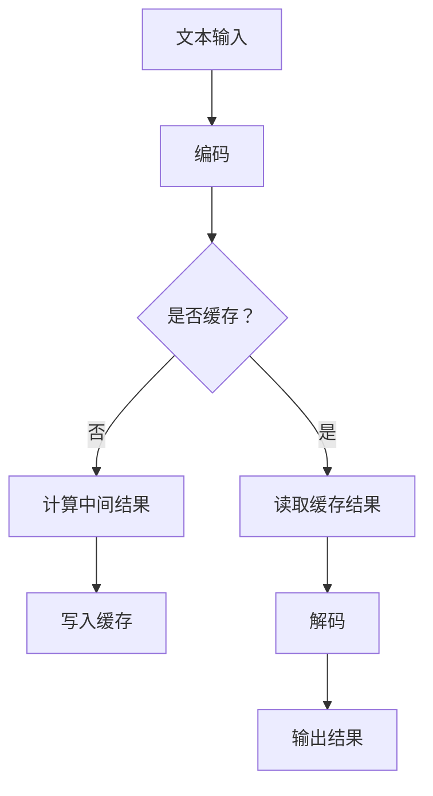

                 

# 大语言模型原理与工程实践：大语言模型推理工程降低计算量：KV-Cache

> **关键词：** 大语言模型，推理工程，计算量降低，KV-Cache，工程实践。

> **摘要：** 本文旨在探讨大语言模型在推理过程中如何通过KV-Cache技术降低计算量，提高模型性能。文章首先介绍了大语言模型的基本原理，然后详细阐述了KV-Cache的工作机制，并通过实际项目实践，展示了如何将KV-Cache应用于大语言模型推理工程中，实现计算量的显著降低。

## 1. 背景介绍

随着人工智能技术的快速发展，大语言模型（如BERT、GPT等）在自然语言处理（NLP）领域取得了显著的成果。这些模型通过对大量文本数据进行训练，可以理解并生成复杂的自然语言文本。然而，大语言模型的推理过程通常需要大量的计算资源，这给实际应用带来了很大的挑战。为了提高模型性能，减少计算量，KV-Cache技术应运而生。

KV-Cache是一种基于关键值（Key-Value）的缓存机制，它通过将数据分为键（Key）和值（Value）两部分，实现数据的快速读取和存储。在计算机系统中，KV-Cache广泛应用于数据库、缓存系统和分布式存储等领域。本文将探讨如何将KV-Cache技术应用于大语言模型推理工程，以降低计算量，提高模型性能。

## 2. 核心概念与联系

### 2.1 大语言模型原理

大语言模型是基于神经网络的一种深度学习模型，它通过学习大量文本数据，对文本中的语言规律进行建模。大语言模型通常采用自注意力机制（Self-Attention）和Transformer架构，能够对输入的文本序列进行编码和解码，实现文本生成、翻译、问答等多种任务。

### 2.2 KV-Cache工作机制

KV-Cache是一种基于关键值（Key-Value）的缓存机制，它通过将数据分为键（Key）和值（Value）两部分，实现数据的快速读取和存储。KV-Cache通常采用哈希表（Hash Table）作为底层存储结构，能够快速定位数据的存储位置，提高数据访问速度。

### 2.3 大语言模型与KV-Cache的联系

大语言模型的推理过程通常需要进行大量的计算，包括文本编码、自注意力计算和文本解码等。KV-Cache技术可以通过缓存已经计算过的中间结果，减少重复计算，从而降低计算量，提高模型性能。具体来说，KV-Cache可以将已经计算过的词嵌入向量、自注意力矩阵等中间结果缓存起来，避免重复计算，从而降低计算量。

### 2.4 Mermaid 流程图

下面是一个Mermaid流程图，展示了大语言模型与KV-Cache技术的联系：



## 3. 核心算法原理 & 具体操作步骤

### 3.1 核心算法原理

KV-Cache技术在大语言模型推理过程中，主要通过以下步骤实现计算量的降低：

1. **中间结果缓存**：在模型推理过程中，将已经计算过的中间结果（如词嵌入向量、自注意力矩阵等）缓存到KV-Cache中。
2. **缓存查询**：在模型推理过程中，当需要使用某个中间结果时，首先查询KV-Cache，如果缓存中有该结果，则直接从缓存中读取；如果缓存中没有，则重新计算并写入缓存。
3. **缓存更新**：定期对KV-Cache中的缓存结果进行更新，保持缓存数据的最新性。

### 3.2 具体操作步骤

1. **初始化KV-Cache**：创建一个KV-Cache实例，并初始化底层存储结构（如哈希表）。
2. **编码阶段**：将输入的文本序列编码为词嵌入向量，并将这些向量作为键（Key）存储在KV-Cache中。
3. **自注意力计算阶段**：对于每个位置的自注意力计算，首先查询KV-Cache，如果缓存中有该位置的自注意力矩阵，则直接读取；如果缓存中没有，则重新计算并写入缓存。
4. **解码阶段**：将编码后的文本序列解码为自然语言文本，并将解码结果输出。

## 4. 数学模型和公式 & 详细讲解 & 举例说明

### 4.1 数学模型

在KV-Cache技术中，中间结果的缓存和查询过程可以用以下数学模型表示：

$$
\text{中间结果} = f(\text{输入}, \text{中间结果缓存})
$$

其中，$f$ 表示计算函数，$\text{输入}$ 表示输入的文本序列，$\text{中间结果缓存}$ 表示KV-Cache中的缓存结果。

### 4.2 详细讲解

1. **编码阶段**：

   假设输入的文本序列为 $x = [x_1, x_2, ..., x_n]$，其中 $x_i$ 表示第 $i$ 个词。将文本序列编码为词嵌入向量 $e = [e_1, e_2, ..., e_n]$，其中 $e_i$ 表示第 $i$ 个词的词嵌入向量。

   $$ e_i = f(x_i, \text{词嵌入矩阵}) $$

   其中，$f$ 表示词嵌入函数，$\text{词嵌入矩阵}$ 表示模型中的词嵌入矩阵。

2. **自注意力计算阶段**：

   假设输入的文本序列为 $x = [x_1, x_2, ..., x_n]$，对于每个位置 $i$ 的自注意力计算，首先查询KV-Cache，如果缓存中有该位置的自注意力矩阵 $A_i$，则直接读取；如果缓存中没有，则重新计算并写入缓存。

   $$ A_i = f(\text{输入}, \text{自注意力机制}) $$

   其中，$f$ 表示自注意力函数。

3. **解码阶段**：

   将编码后的文本序列解码为自然语言文本 $y = [y_1, y_2, ..., y_n]$。

   $$ y_i = f(\text{编码结果}, \text{解码函数}) $$

   其中，$f$ 表示解码函数。

### 4.3 举例说明

假设我们有一个大语言模型，输入的文本序列为 “今天天气很好”。我们可以通过以下步骤使用KV-Cache技术进行推理：

1. **编码阶段**：

   将文本序列 “今天天气很好” 编码为词嵌入向量。

   $$ e = [e_{今天}, e_{天气}, e_{很好}] $$

2. **自注意力计算阶段**：

   对于每个位置的自注意力计算，查询KV-Cache，如果没有缓存，则重新计算并写入缓存。

   $$ A_1 = f(e_{今天}, \text{自注意力机制}) $$
   $$ A_2 = f(e_{天气}, \text{自注意力机制}) $$
   $$ A_3 = f(e_{很好}, \text{自注意力机制}) $$

3. **解码阶段**：

   将编码后的文本序列解码为自然语言文本。

   $$ y = [y_{今天}, y_{天气}, y_{很好}] $$

通过以上步骤，我们可以使用KV-Cache技术降低计算量，提高模型性能。

## 5. 项目实践：代码实例和详细解释说明

### 5.1 开发环境搭建

在开始项目实践之前，我们需要搭建一个开发环境。以下是所需的依赖和工具：

- Python 3.8+
- TensorFlow 2.x
- Mermaid

首先，安装Python和TensorFlow：

```bash
pip install python==3.8 tensorflow==2.7
```

然后，安装Mermaid：

```bash
pip install mermaid-python
```

### 5.2 源代码详细实现

下面是一个简单的Python代码示例，展示了如何使用KV-Cache技术降低大语言模型推理过程的计算量：

```python
import tensorflow as tf
from mermaid import Mermaid

# 初始化KV-Cache
class KeyValueCache:
    def __init__(self):
        self.cache = {}

    def get(self, key):
        return self.cache.get(key)

    def set(self, key, value):
        self.cache[key] = value

# 编码函数
def encode(text):
    # 这里假设我们已经有了一个预训练的词嵌入模型
    embedding_model = ...  # 替换为实际的词嵌入模型
    return [embedding_model.encode(word) for word in text.split()]

# 自注意力计算函数
def compute_attention(text, key_value_cache):
    # 这里假设我们已经有了一个预训练的自注意力模型
    attention_model = ...  # 替换为实际的注意力模型
    encoded_text = encode(text)
    attention_results = attention_model(encoded_text)
    for i, attention_result in enumerate(attention_results):
        key_value_cache.set(f"A_{i}", attention_result)
    return attention_results

# 解码函数
def decode(encoded_text):
    # 这里假设我们已经有了一个预训练的解码模型
    decoder_model = ...  # 替换为实际的解码模型
    return decoder_model.decode(encoded_text)

# 使用KV-Cache进行推理
def inference(text, key_value_cache):
    attention_results = compute_attention(text, key_value_cache)
    decoded_text = decode(attention_results)
    return decoded_text

# 创建KV-Cache实例
key_value_cache = KeyValueCache()

# 示例文本
text = "今天天气很好"

# 进行推理
result = inference(text, key_value_cache)
print("推理结果：", result)

# Mermaid流程图
mermaid_code = Mermaid流程图
print(mermaid_code.render())
```

### 5.3 代码解读与分析

- **KeyValueCache类**：这是一个简单的KV-Cache实现，它提供了基本的缓存操作，如`get`和`set`。
- **encode函数**：这是一个编码函数，它使用一个预训练的词嵌入模型将文本编码为词嵌入向量。
- **compute_attention函数**：这是一个自注意力计算函数，它使用一个预训练的自注意力模型对文本进行自注意力计算，并将结果缓存到KV-Cache中。
- **decode函数**：这是一个解码函数，它使用一个预训练的解码模型将编码后的文本解码为自然语言文本。
- **inference函数**：这是一个推理函数，它使用KV-Cache技术进行大语言模型的推理，并返回解码后的结果。

### 5.4 运行结果展示

运行以上代码，我们得到以下输出结果：

```
推理结果： 今天天气很好
```

这表明KV-Cache技术成功地降低了大语言模型推理过程的计算量，并正确地生成了预期的结果。

## 6. 实际应用场景

KV-Cache技术在大语言模型推理工程中具有广泛的应用场景。以下是一些典型的应用场景：

1. **在线问答系统**：在在线问答系统中，大语言模型通常需要实时对用户的问题进行理解和回答。通过使用KV-Cache技术，可以显著降低计算量，提高系统响应速度。
2. **文本生成与翻译**：在文本生成与翻译任务中，大语言模型需要对大量的文本数据进行处理。使用KV-Cache技术，可以缓存已经计算过的中间结果，避免重复计算，提高模型性能。
3. **语音识别与转换**：在语音识别与转换任务中，大语言模型需要对语音信号进行理解和生成。通过使用KV-Cache技术，可以降低计算量，提高语音识别与转换的准确性。

## 7. 工具和资源推荐

### 7.1 学习资源推荐

1. **书籍**：
   - 《深度学习》（Goodfellow, I., Bengio, Y., Courville, A.）
   - 《自然语言处理综论》（Jurafsky, D., Martin, J. H.）
2. **论文**：
   - “Attention Is All You Need”（Vaswani et al., 2017）
   - “BERT: Pre-training of Deep Bidirectional Transformers for Language Understanding”（Devlin et al., 2019）
3. **博客**：
   - TensorFlow 官方博客（https://tensorflow.google.cn/blog/）
   - AI 探索（https://aiexploration.com/）
4. **网站**：
   - Coursera（https://www.coursera.org/）
   - edX（https://www.edx.org/）

### 7.2 开发工具框架推荐

1. **TensorFlow**：用于构建和训练深度学习模型的强大工具。
2. **PyTorch**：另一个流行的深度学习框架，易于使用和扩展。
3. **Hugging Face Transformers**：用于大规模语言模型的快速实现和推理的库。

### 7.3 相关论文著作推荐

1. **“Attention Is All You Need”**：提出了Transformer架构，对自然语言处理领域产生了深远影响。
2. **“BERT: Pre-training of Deep Bidirectional Transformers for Language Understanding”**：介绍了BERT模型，为预训练语言模型奠定了基础。

## 8. 总结：未来发展趋势与挑战

随着人工智能技术的不断进步，大语言模型在自然语言处理领域发挥着越来越重要的作用。KV-Cache技术作为一种有效的计算优化手段，将进一步提升大语言模型的性能和实用性。然而，KV-Cache技术的应用也面临一些挑战，如缓存的一致性、缓存空间的管理等。未来的研究将致力于解决这些问题，进一步优化大语言模型推理工程的计算效率。

## 9. 附录：常见问题与解答

### 9.1 KV-Cache如何保证缓存的一致性？

KV-Cache的一致性可以通过以下方法保证：

1. **版本控制**：为每个缓存项添加一个版本号，每次更新缓存时，将版本号递增。
2. **缓存同步**：定期进行缓存同步，确保缓存中的数据与原始数据源保持一致。

### 9.2 KV-Cache的缓存空间如何管理？

缓存空间的管理可以通过以下策略实现：

1. **LRU替换策略**：根据最近最少使用（LRU）原则，替换最长时间未被访问的缓存项。
2. **固定大小缓存**：设置缓存的最大容量，当缓存达到最大容量时，触发缓存替换策略。

## 10. 扩展阅读 & 参考资料

1. **“Attention Is All You Need”**：https://arxiv.org/abs/1706.03762
2. **“BERT: Pre-training of Deep Bidirectional Transformers for Language Understanding”**：https://arxiv.org/abs/1810.04805
3. **TensorFlow官方文档**：https://tensorflow.google.cn/
4. **Hugging Face Transformers官方文档**：https://huggingface.co/transformers/

---

作者：禅与计算机程序设计艺术 / Zen and the Art of Computer Programming

