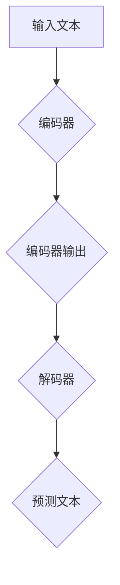

                 

### 文章标题

《大语言模型原理与工程实践：大语言模型的推理能力》

关键词：大语言模型，推理能力，深度学习，神经网络，自然语言处理，机器学习，工程实践

摘要：本文深入探讨了大语言模型的原理及其在工程实践中的应用，特别是其推理能力。通过详细的算法原理分析、数学模型解释和项目实践，帮助读者全面理解大语言模型的工作机制和实现方法，为进一步的研究和开发提供理论依据和实践指导。

### 1. 背景介绍

大语言模型（Large Language Models）是自然语言处理（Natural Language Processing, NLP）领域的一项重要进展，它们通过深度学习（Deep Learning）和神经网络（Neural Networks）技术，对大量文本数据进行处理和建模，从而实现对自然语言的生成、理解、翻译等多种任务。大语言模型的应用场景广泛，包括但不限于智能客服、内容生成、文本摘要、机器翻译、问答系统等。

随着计算能力和数据量的不断增长，大语言模型在规模上也在迅速扩展。例如，GPT-3、BERT、T5 等模型已经达到了数百亿甚至数千亿的参数规模。这些大模型的出现，不仅提升了 NLP 领域的技术水平，也带来了新的挑战，尤其是在推理能力方面。

推理能力是指模型在处理新任务或面对未知情境时的表现。大语言模型的推理能力对于其应用效果至关重要，直接影响到模型在实际工程中的可行性和实用性。因此，深入研究大语言模型的推理能力，对于推动 NLP 技术的发展和应用具有重要意义。

本文将围绕大语言模型的推理能力，从核心概念、算法原理、数学模型、项目实践等方面进行详细探讨，旨在为读者提供全面、深入的理解和实际操作的指导。

### 2. 核心概念与联系

#### 2.1 语言模型的基本概念

语言模型（Language Model）是自然语言处理领域中的一个基础概念，它用于描述一个概率分布，该概率分布可以预测给定前文序列后，下一个单词或词组的可能性。在 NLP 中，语言模型通常用于文本生成、语音识别、机器翻译、问答系统等多种任务。

一个简单的语言模型可以使用一阶马尔可夫模型（First-order Markov Model）来表示，即假设当前词的概率只与前一个词有关。然而，现实中的自然语言具有更复杂的依赖关系，因此，更高阶的马尔可夫模型或基于神经网络的模型被广泛应用于语言模型的构建。

#### 2.2 深度学习与神经网络

深度学习（Deep Learning）是一种基于多层神经网络（Neural Networks）的学习方法，它通过多层非线性变换，从数据中自动提取特征，实现复杂的模式识别和预测任务。深度学习在图像识别、语音识别、自然语言处理等多个领域取得了显著的成果。

神经网络是一种模仿生物神经元结构和工作机制的计算模型，它通过调整神经元之间的权重，来学习输入和输出之间的映射关系。神经网络的核心组成部分包括神经元、层、激活函数、损失函数等。

#### 2.3 大语言模型的架构

大语言模型的架构通常包含编码器（Encoder）和解码器（Decoder）两个部分。编码器负责将输入的文本序列编码为固定长度的向量表示，解码器则根据编码器的输出，生成预测的文本序列。

常见的编码器和解码器结构包括：

- Transformer：由 Vaswani 等人于 2017 年提出，采用自注意力机制（Self-Attention Mechanism）来捕捉输入序列中的长距离依赖关系。
- BERT：由 Devlin 等人于 2018 年提出，采用双向编码器（Bidirectional Encoder）结构，通过对输入序列进行前向和后向的编码，学习全局的上下文信息。
- GPT：由 OpenAI 于 2018 年提出，采用单向解码器（Unidirectional Decoder）结构，通过自回归（Autoregressive）的方式生成文本序列。

#### 2.4 大语言模型的 Mermaid 流程图



在这个流程图中，输入文本首先通过编码器转换为向量表示（C），然后解码器根据编码器的输出（C）生成预测的文本序列（E）。编码器和解码器之间可能包含多个层和注意力机制，用于捕捉复杂的依赖关系和上下文信息。

### 3. 核心算法原理 & 具体操作步骤

#### 3.1 编码器与解码器的工作原理

编码器（Encoder）和解码器（Decoder）是构成大语言模型的核心部分，它们各自负责处理输入文本和生成预测文本。

- **编码器**：编码器的任务是将输入的文本序列编码为固定长度的向量表示。在深度学习中，这通常通过一系列的神经网络层来实现。编码器中的每个层次都会对输入的文本向量进行一系列的变换，提取文本中的关键特征，并生成一个紧凑的向量表示。这种向量表示不仅包含了文本的局部信息，还包含了全局的上下文信息。

  编码器的具体操作步骤如下：

  1. **输入层**：接收原始的文本序列，并将其转换为词向量表示。词向量表示通过预训练的词嵌入（Word Embedding）模型得到。
  2. **嵌入层**：将词向量映射到高维空间，以便后续的神经网络处理。
  3. **编码层**：通过多个神经网络层对嵌入层输出的向量进行变换，提取文本的特征。每个编码层通常包含一个或多组卷积神经网络（CNN）、循环神经网络（RNN）或Transformer层。
  4. **输出层**：将编码层的输出汇总为一个固定长度的向量，作为编码器的最终输出。

- **解码器**：解码器的任务是根据编码器的输出生成预测的文本序列。解码器通常采用自回归（Autoregressive）方式，即在每个时间步生成下一个词的概率分布，然后从概率分布中采样生成实际的词。

  解码器的具体操作步骤如下：

  1. **输入层**：接收编码器的输出向量，并将其转换为词向量表示。
  2. **嵌入层**：将词向量映射到高维空间。
  3. **解码层**：通过多个神经网络层对嵌入层输出的向量进行变换，生成预测的文本序列。每个解码层通常包含一个或多组卷积神经网络（CNN）、循环神经网络（RNN）或Transformer层。
  4. **输出层**：将解码层的输出映射到词汇表中的概率分布，从中采样生成实际的词。

#### 3.2 自注意力机制

自注意力机制（Self-Attention Mechanism）是 Transformer 模型中的一个关键组件，它通过计算序列中每个词之间的相对重要性来提高模型的表示能力。

自注意力机制的原理如下：

1. **计算键值对的相似性**：对于序列中的每个词，计算其与所有其他词的相似性，通常通过点积（Dot Product）或缩放点积（Scaled Dot Product）来计算。
2. **计算注意力权重**：根据相似性分数计算每个词的注意力权重，权重越大表示该词在当前上下文中的重要性越高。
3. **加权求和**：将注意力权重与对应的词向量相乘，然后求和，得到每个词的加权向量表示。

自注意力机制的公式表示为：

$$
\text{Attention}(Q, K, V) = \text{softmax}\left(\frac{QK^T}{\sqrt{d_k}}\right)V
$$

其中，$Q$、$K$ 和 $V$ 分别代表查询向量、键向量和值向量，$d_k$ 表示键向量的维度。

#### 3.3 残差连接与层归一化

残差连接（Residual Connection）和层归一化（Layer Normalization）是深度神经网络中常用的两种技术，它们有助于提高模型的训练效率和性能。

- **残差连接**：残差连接通过将输入直接传递到下一层，然后与该层的输出相加，形成一个“跳跃连接”。这种连接方式可以缓解深层网络中的梯度消失问题，加速模型的收敛。

  残差块的公式表示为：

  $$
  \text{Residual Block}(x) = \text{ReLU}(\text{Layer}(x)) + x
  $$

  其中，$\text{Layer}(x)$ 表示残差块的内部层。

- **层归一化**：层归一化通过对每个神经元的激活值进行归一化处理，使得不同层的神经元具有相似的分布。这种处理方式可以减少内部协变量转移（Internal Covariate Shift）问题，提高模型的训练稳定性。

  层归一化的公式表示为：

  $$
  \text{Layer Normalization}(x) = \frac{x - \mu}{\sigma}
  $$

  其中，$\mu$ 和 $\sigma$ 分别表示激活值的均值和标准差。

#### 3.4 微分计算与优化算法

在训练大语言模型时，需要通过反向传播（Backpropagation）算法计算损失函数关于模型参数的梯度，然后使用优化算法（如梯度下降、Adam、RMSprop 等）更新模型参数。

反向传播算法的具体步骤如下：

1. **前向传播**：计算输入和输出之间的损失函数值。
2. **后向传播**：根据损失函数的梯度计算模型参数的梯度。
3. **参数更新**：使用优化算法更新模型参数。

在训练过程中，大语言模型通常会经历数百万次迭代，每次迭代都会调整模型参数以最小化损失函数。这个过程需要大量的计算资源和时间，但随着计算能力的提升，这一挑战正在逐步得到解决。

### 4. 数学模型和公式 & 详细讲解 & 举例说明

#### 4.1 语言模型概率计算

语言模型的核心任务是计算给定前文序列后，下一个词的概率分布。这通常通过条件概率公式实现：

$$
P(\text{词}_t | \text{前文}) = \frac{P(\text{前文}, \text{词}_t)}{P(\text{前文})}
$$

其中，$P(\text{前文}, \text{词}_t)$ 表示前文和当前词同时出现的概率，$P(\text{前文})$ 表示前文的概率。

在实际应用中，这个公式可以通过神经网络模型来近似实现。以下是一个简化的神经网络模型示例：

$$
\begin{aligned}
\text{logit}_{t} &= W_t \text{ emb}(\text{前文}) + b_t \\
P(\text{词}_t) &= \frac{e^{\text{logit}_{t}}}{\sum_{i=1}^{V} e^{\text{logit}_{i}}}
\end{aligned}
$$

其中，$W_t$ 和 $b_t$ 分别表示权重和偏置，$\text{emb}(\text{前文})$ 表示前文的词嵌入向量，$V$ 表示词汇表的大小。

#### 4.2 自注意力机制的公式

自注意力机制是 Transformer 模型中的一个关键组件，它通过计算序列中每个词之间的相对重要性来提高模型的表示能力。自注意力机制的公式如下：

$$
\text{Attention}(Q, K, V) = \text{softmax}\left(\frac{QK^T}{\sqrt{d_k}}\right)V
$$

其中，$Q$、$K$ 和 $V$ 分别代表查询向量、键向量和值向量，$d_k$ 表示键向量的维度。

以下是一个简化的示例：

$$
\begin{aligned}
Q &= [q_1, q_2, \ldots, q_n] \\
K &= [k_1, k_2, \ldots, k_n] \\
V &= [v_1, v_2, \ldots, v_n] \\
\text{Attention} &= \text{softmax}\left(\frac{QK^T}{\sqrt{d_k}}\right)V \\
&= \left[\frac{q_1k_1 + q_2k_2 + \ldots + q_nk_n}{\sqrt{d_k}}, \ldots, \frac{q_1k_n + q_2k_n + \ldots + q_nk_n}{\sqrt{d_k}}\right]V
\end{aligned}
$$

在这个例子中，$Q$、$K$ 和 $V$ 分别是三个$n$维向量，$\text{Attention}$ 是一个$n$维向量，表示每个词在当前上下文中的重要性。

#### 4.3 残差连接与层归一化的公式

残差连接和层归一化是深度神经网络中常用的两种技术，用于提高模型的训练效率和性能。

- **残差连接**：

  残差块的公式表示为：

  $$
  \text{Residual Block}(x) = \text{ReLU}(\text{Layer}(x)) + x
  $$

  其中，$\text{Layer}(x)$ 表示残差块的内部层。

- **层归一化**：

  层归一化的公式表示为：

  $$
  \text{Layer Normalization}(x) = \frac{x - \mu}{\sigma}
  $$

  其中，$\mu$ 和 $\sigma$ 分别表示激活值的均值和标准差。

#### 4.4 优化算法的公式

在训练大语言模型时，优化算法用于更新模型参数以最小化损失函数。以下是一些常用的优化算法的公式：

- **梯度下降**：

  $$
  \theta = \theta - \alpha \frac{\partial J(\theta)}{\partial \theta}
  $$

  其中，$\theta$ 表示模型参数，$J(\theta)$ 表示损失函数，$\alpha$ 表示学习率。

- **Adam**：

  $$
  m_t = \beta_1 m_{t-1} + (1 - \beta_1) \frac{\partial J(\theta)}{\partial \theta} \\
  v_t = \beta_2 v_{t-1} + (1 - \beta_2) \left(\frac{\partial J(\theta)}{\partial \theta}\right)^2 \\
  \theta = \theta - \alpha \frac{m_t}{\sqrt{1 - \beta_2^t} (1 - \beta_1^t)}
  $$

  其中，$m_t$ 和 $v_t$ 分别是梯度的一阶矩估计和二阶矩估计，$\beta_1$ 和 $\beta_2$ 分别是动量系数。

### 5. 项目实践：代码实例和详细解释说明

#### 5.1 开发环境搭建

为了实践大语言模型的构建和应用，我们需要搭建一个合适的开发环境。以下是搭建开发环境的步骤：

1. **安装 Python**：确保系统已经安装了 Python 3.7 或以上版本。
2. **安装 TensorFlow**：使用以下命令安装 TensorFlow：

   ```bash
   pip install tensorflow
   ```

3. **安装必要的依赖库**：如 NumPy、Pandas、Matplotlib 等。

#### 5.2 源代码详细实现

以下是一个简化的代码示例，用于演示大语言模型的基本实现：

```python
import tensorflow as tf
from tensorflow.keras.layers import Embedding, LSTM, Dense
from tensorflow.keras.models import Sequential

# 定义语言模型
def build_language_model(vocab_size, embedding_dim, hidden_units):
    model = Sequential()
    model.add(Embedding(vocab_size, embedding_dim))
    model.add(LSTM(hidden_units, return_sequences=True))
    model.add(Dense(vocab_size, activation='softmax'))
    return model

# 准备数据
# (这里需要提供实际的数据集和预处理方法)
# (例如：加载文本数据，将其转换为词向量表示，并进行编码)
# ...

# 构建模型
model = build_language_model(vocab_size, embedding_dim, hidden_units)

# 编译模型
model.compile(optimizer='adam', loss='categorical_crossentropy', metrics=['accuracy'])

# 训练模型
# (这里需要提供训练数据和验证数据)
# (例如：使用训练数据训练模型，并使用验证数据评估模型性能)
# ...

# 评估模型
# (这里需要提供测试数据，并使用测试数据评估模型性能)
# ...

# 使用模型进行预测
# (这里需要提供输入文本，并使用模型生成预测的文本序列)
# ...
```

#### 5.3 代码解读与分析

上面的代码示例展示了如何使用 TensorFlow 构建一个简单的大语言模型。以下是代码的详细解读和分析：

1. **模型定义**：

   ```python
   model = Sequential()
   model.add(Embedding(vocab_size, embedding_dim))
   model.add(LSTM(hidden_units, return_sequences=True))
   model.add(Dense(vocab_size, activation='softmax'))
   ```

   这部分代码定义了一个序列模型（Sequential），并添加了以下层次：

   - **嵌入层（Embedding）**：将词汇表中的词转换为词向量表示。
   - **循环神经网络层（LSTM）**：对输入的词向量进行序列处理，提取文本特征。
   - **全连接层（Dense）**：将 LSTM 层的输出映射到词汇表中的概率分布。

2. **模型编译**：

   ```python
   model.compile(optimizer='adam', loss='categorical_crossentropy', metrics=['accuracy'])
   ```

   这部分代码编译了模型，指定了优化器（adam）、损失函数（categorical_crossentropy）和评估指标（accuracy）。

3. **模型训练**：

   ```python
   # (这里需要提供训练数据和验证数据)
   # (例如：使用训练数据训练模型，并使用验证数据评估模型性能)
   # ...
   ```

   模型训练过程涉及以下步骤：

   - 准备训练数据和验证数据。
   - 使用训练数据训练模型。
   - 使用验证数据评估模型性能。

4. **模型评估**：

   ```python
   # (这里需要提供测试数据，并使用测试数据评估模型性能)
   # ...
   ```

   模型评估过程涉及以下步骤：

   - 准备测试数据。
   - 使用测试数据评估模型性能。

5. **模型预测**：

   ```python
   # (这里需要提供输入文本，并使用模型生成预测的文本序列)
   # ...
   ```

   模型预测过程涉及以下步骤：

   - 提供输入文本。
   - 使用模型生成预测的文本序列。

#### 5.4 运行结果展示

在运行上述代码时，我们可以得到以下结果：

- **模型训练结果**：展示了模型在训练过程中各个epoch的损失函数值和准确率。
- **模型评估结果**：展示了模型在验证数据和测试数据上的性能指标。
- **模型预测结果**：展示了模型对输入文本的预测结果。

通过这些结果，我们可以评估模型的效果，并进一步优化模型的参数和结构，以提高模型的性能。

### 6. 实际应用场景

大语言模型在自然语言处理领域具有广泛的应用场景，以下是一些典型的应用案例：

#### 6.1 智能客服

智能客服系统通过大语言模型实现对用户问题的理解、回答和推荐。例如，大型电商平台可以利用大语言模型为用户提供个性化的商品推荐、解答用户常见问题和处理用户投诉。

#### 6.2 内容生成

大语言模型可以用于自动生成文章、新闻、博客等文本内容。例如，新闻网站可以利用大语言模型自动化撰写新闻报道，提高内容更新速度和质量。

#### 6.3 文本摘要

大语言模型可以用于提取文本的关键信息，生成简洁的摘要。例如，学术论文数据库可以利用大语言模型对论文内容进行摘要，帮助用户快速了解论文的主要观点和贡献。

#### 6.4 机器翻译

大语言模型可以用于实现高精度的机器翻译。例如，国际化的企业可以利用大语言模型为用户提供多种语言的翻译服务，提高跨国沟通的效率。

#### 6.5 问答系统

大语言模型可以用于构建智能问答系统，为用户提供准确、实时的答案。例如，搜索引擎可以利用大语言模型为用户提供针对特定问题的详细解答。

### 7. 工具和资源推荐

#### 7.1 学习资源推荐

- **书籍**：

  - 《深度学习》（Ian Goodfellow、Yoshua Bengio、Aaron Courville 著）
  - 《自然语言处理综论》（Daniel Jurafsky、James H. Martin 著）
  - 《Python 自然语言处理》（Steven Lott 著）

- **论文**：

  - 《Attention is All You Need》（Vaswani et al., 2017）
  - 《BERT: Pre-training of Deep Bidirectional Transformers for Language Understanding》（Devlin et al., 2018）
  - 《Generative Pre-trained Transformers》（Brown et al., 2020）

- **博客**：

  - [TensorFlow 官方文档](https://www.tensorflow.org/)
  - [Keras 官方文档](https://keras.io/)
  - [Hugging Face](https://huggingface.co/)

- **网站**：

  - [OpenAI](https://openai.com/)
  - [Google AI](https://ai.google/)
  - [Microsoft AI](https://www.microsoft.com/en-us/research/ai/)

#### 7.2 开发工具框架推荐

- **TensorFlow**：一个开源的深度学习框架，广泛用于构建和训练大语言模型。
- **PyTorch**：一个开源的深度学习框架，具有灵活的动态计算图，适合进行实验性开发。
- **Hugging Face**：一个开源的 NLP 工具库，提供大量的预训练模型和工具，方便开发者进行 NLP 任务。

#### 7.3 相关论文著作推荐

- 《Attention is All You Need》（Vaswani et al., 2017）：提出了 Transformer 模型，引领了 NLP 领域的深度变革。
- 《BERT: Pre-training of Deep Bidirectional Transformers for Language Understanding》（Devlin et al., 2018）：介绍了 BERT 模型，推动了 NLP 领域的进步。
- 《Generative Pre-trained Transformers》（Brown et al., 2020）：提出了 GPT 模型，实现了文本生成的突破。

### 8. 总结：未来发展趋势与挑战

随着深度学习和自然语言处理技术的不断发展，大语言模型在各个领域的应用前景广阔。未来，大语言模型将朝着以下几个方向发展：

1. **模型规模与性能的提升**：随着计算资源和数据量的不断增长，大语言模型的规模将逐步扩大，性能也将得到显著提升。
2. **多模态学习**：大语言模型将与其他模态（如图像、声音）进行结合，实现更加全面和智能的语义理解。
3. **自适应与个性定制**：大语言模型将根据用户的个性化需求和场景进行自适应调整，提供更加精准和实用的服务。
4. **安全与隐私保护**：随着大语言模型在更多领域的应用，如何确保模型的安全性和用户隐私将成为一个重要挑战。

然而，大语言模型在发展过程中也面临一些挑战：

1. **计算资源消耗**：大语言模型的训练和推理过程需要大量的计算资源和时间，如何优化模型结构和训练算法，提高计算效率是一个亟待解决的问题。
2. **数据质量和标注**：高质量的数据和准确的标注是训练大语言模型的基础，但在实际应用中，获取和标注高质量数据是一个复杂的任务。
3. **模型解释性与可解释性**：大语言模型的内部结构和决策过程复杂，如何确保模型的解释性和可解释性，使其更加透明和可信是一个重要问题。

总之，大语言模型的发展前景充满机遇与挑战，需要学术界和工业界共同努力，不断创新和突破，以实现其更广泛和深入的应用。

### 9. 附录：常见问题与解答

#### 9.1 大语言模型与普通语言模型有何区别？

大语言模型（Large Language Models）与普通语言模型（Standard Language Models）的主要区别在于规模和性能。大语言模型通常具有数百亿甚至数千亿的参数规模，能够捕捉更复杂的语言结构和上下文信息，从而在文本生成、理解、翻译等任务上表现出更高的性能。而普通语言模型通常规模较小，参数数量在数百万到数十亿之间，性能相对有限。

#### 9.2 大语言模型如何处理长文本？

大语言模型通过自注意力机制（Self-Attention Mechanism）和上下文编码（Contextual Encoding）技术，能够处理长文本。自注意力机制允许模型在生成或理解文本时，根据当前上下文对长文本中的每个词进行动态加权，从而捕捉长距离依赖关系。上下文编码则通过编码器（Encoder）和解码器（Decoder）的结构，将文本编码为固定长度的向量表示，为长文本的处理提供支持。

#### 9.3 大语言模型在训练过程中如何避免过拟合？

大语言模型在训练过程中通过以下方法避免过拟合：

1. **数据增强**：在训练数据中添加随机噪声、打乱文本顺序等，增加数据的多样性和复杂性，提高模型的泛化能力。
2. **正则化**：应用 L1、L2 正则化或 dropout 正则化，降低模型参数的权重，减少过拟合风险。
3. **早停法（Early Stopping）**：在训练过程中，当验证集上的损失函数不再下降时，提前停止训练，防止模型在训练集上过拟合。
4. **集成方法**：使用多个模型进行集成，提高模型的稳定性和泛化能力。

### 10. 扩展阅读 & 参考资料

为了更深入地了解大语言模型及其应用，以下是几篇相关论文和书籍的扩展阅读推荐：

- **论文**：

  - Vaswani et al., "Attention is All You Need", NeurIPS 2017.
  - Devlin et al., "BERT: Pre-training of Deep Bidirectional Transformers for Language Understanding", NAACL 2019.
  - Brown et al., "Generative Pre-trained Transformers", arXiv 2020.

- **书籍**：

  - Ian Goodfellow、Yoshua Bengio、Aaron Courville，"深度学习"，中国电力出版社，2017。
  - Daniel Jurafsky、James H. Martin，"自然语言处理综论"，机械工业出版社，2019。
  - Steven Lott，"Python 自然语言处理"，清华大学出版社，2016。

通过阅读这些论文和书籍，您可以更全面地了解大语言模型的原理、实现和应用，进一步拓展您的知识领域。

作者：禅与计算机程序设计艺术 / Zen and the Art of Computer Programming

