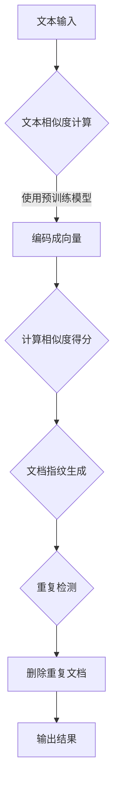
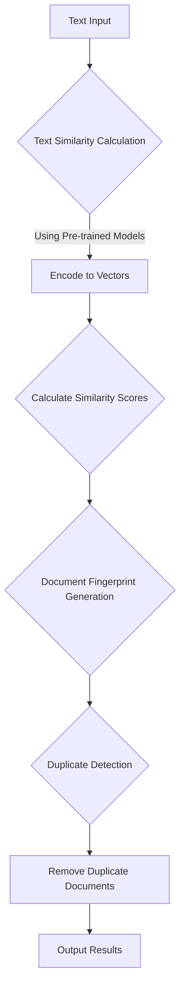

                 

### 1. 背景介绍

在当今信息化时代，大数据的处理和分析变得尤为重要。随着互联网的普及和物联网技术的快速发展，海量数据的生成和传输已经成为常态。然而，数据质量的高低直接影响到数据分析和决策的效果。在这样的背景下，文档去重技术应运而生，成为大数据处理领域的重要一环。

文档去重，顾名思义，就是指识别并删除重复的文档，以提升数据的质量和效率。这不仅是数据清洗过程中的一项关键任务，也是数据分析和挖掘的基石。重复文档的存在会导致数据冗余，增加存储成本，影响数据分析的准确性，甚至可能带来错误的决策。

重复文档的识别和删除，不仅在学术研究中有广泛应用，如学术文献的去重、专利文献的整理等，在商业应用中也具有极高的价值。例如，电商平台在处理用户评价时，可以通过文档去重技术来避免重复评价对商品评分的影响；在金融行业，文档去重可以帮助银行和金融机构清除重复的贷款申请资料，提高审核效率。

本文将深入探讨大语言模型在文档去重领域的应用，首先介绍大语言模型的基本原理，然后详细解析其在文档去重中的具体操作步骤，最后通过数学模型和实际项目实践来展示其效果。希望通过这篇文章，读者能够对大语言模型在文档去重领域的应用有一个全面的理解。

---

## Background Introduction

In the era of information technology, the processing and analysis of big data have become increasingly important. With the widespread use of the Internet and the rapid development of the Internet of Things, the generation and transmission of massive data have become a common occurrence. However, the quality of data directly affects the effectiveness of data analysis and decision-making. In this context, document deduplication technology has emerged and become an essential part of big data processing.

Document deduplication, as the name suggests, refers to the process of identifying and removing duplicate documents to improve data quality and efficiency. This is a critical task in the data cleaning process and a fundamental step for data analysis and mining. The existence of duplicate documents can lead to data redundancy, increase storage costs, affect the accuracy of data analysis, and even result in incorrect decision-making.

The identification and removal of duplicate documents have extensive applications in both academic research and commercial applications. For example, in academic research, document deduplication is widely used in the processing of duplicate academic papers and patent documents. In the business world, document deduplication can help e-commerce platforms avoid the impact of duplicate user reviews on product ratings, and in the financial industry, it can assist banks and financial institutions in removing duplicate loan application materials to improve review efficiency.

This article will delve into the application of large language models in document deduplication. We will start by introducing the basic principles of large language models, followed by a detailed explanation of their specific operational steps in document deduplication. Finally, we will demonstrate their effectiveness through mathematical models and practical project implementations. It is hoped that readers will gain a comprehensive understanding of the application of large language models in document deduplication through this article.

### 2. 核心概念与联系

#### 2.1 大语言模型

大语言模型（Large Language Model）是指使用深度学习技术训练的大型神经网络模型，能够对自然语言进行理解和生成。这些模型通常由数十亿甚至数万亿个参数组成，通过大量文本数据的学习，能够捕捉到语言的复杂性和多样性。大语言模型的核心是生成式对抗网络（Generative Adversarial Networks, GANs）和变分自编码器（Variational Autoencoders, VAEs）等深度学习框架。

生成式对抗网络（GANs）由生成器（Generator）和判别器（Discriminator）两个网络组成。生成器的任务是生成逼真的文本数据，判别器的任务是区分真实文本和生成文本。两者通过对抗训练不断优化，最终生成器能够生成高质量的自然语言文本。

变分自编码器（VAEs）则是一种基于概率模型的生成模型。它由编码器（Encoder）和解码器（Decoder）两部分组成。编码器将输入数据映射到一个潜在空间，解码器从潜在空间中采样生成输出数据。通过训练，VAEs能够学习到输入数据的概率分布，从而生成新的数据。

#### 2.2 文档去重的核心概念

文档去重的核心概念包括文本相似度计算、文档指纹生成和重复检测。

文本相似度计算是文档去重的第一步，其目的是通过计算文本之间的相似度，确定哪些文档可能是重复的。常用的文本相似度计算方法包括余弦相似度、Jaccard相似度、编辑距离等。

文档指纹生成是对每个文档进行特征提取，生成一个唯一的指纹。指纹可以是一个字符串，也可以是一个数字向量。常见的指纹生成方法有哈希函数、TF-IDF模型等。

重复检测是文档去重的关键步骤，其目的是通过比较文档指纹，识别并删除重复的文档。重复检测算法可以分为基于指纹匹配和基于内容比较两种。基于指纹匹配的方法通常效率较高，但可能无法识别轻微的文本差异；基于内容比较的方法则更全面，但计算成本较高。

#### 2.3 大语言模型在文档去重中的应用

大语言模型在文档去重中的应用主要体现在文本相似度计算和文档指纹生成上。

在文本相似度计算方面，大语言模型可以通过预训练语言模型（如BERT、GPT）对文本进行编码，生成文本的固定长度的向量表示。这些向量表示能够捕捉到文本的语义信息，从而实现高精度的文本相似度计算。

在文档指纹生成方面，大语言模型可以通过学习文本的潜在结构，生成具有高区分度的文档指纹。这种方法不仅能够有效识别重复文档，还能够发现相似但非重复的文档，提高文档去重的准确性和全面性。

#### Mermaid 流程图



通过上述流程，大语言模型能够实现对文档的高效去重，从而提高数据的质量和效率。

---

## Core Concepts and Relationships

#### 2.1 Large Language Models

Large language models refer to the large neural network models trained with deep learning techniques that can understand and generate natural language. These models usually consist of tens or even hundreds of billions of parameters and can capture the complexity and diversity of language by learning from a large amount of text data. The core of large language models is based on deep learning frameworks such as Generative Adversarial Networks (GANs) and Variational Autoencoders (VAEs).

Generative Adversarial Networks (GANs) consist of two networks: the generator and the discriminator. The generator's task is to generate realistic text data, while the discriminator's task is to distinguish between real text and generated text. Both networks are optimized through adversarial training to generate high-quality natural language text.

Variational Autoencoders (VAEs) are a type of generative model based on probability models. It consists of an encoder and a decoder. The encoder maps the input data to a latent space, and the decoder samples and generates output data from the latent space. Through training, VAEs can learn the probability distribution of the input data and generate new data.

#### 2.2 Core Concepts of Document Deduplication

The core concepts of document deduplication include text similarity calculation, document fingerprint generation, and duplicate detection.

Text similarity calculation is the first step in document deduplication. Its purpose is to calculate the similarity between texts to determine which documents may be duplicates. Common text similarity calculation methods include cosine similarity, Jaccard similarity, and edit distance.

Document fingerprint generation involves extracting features from each document to generate a unique fingerprint. The fingerprint can be a string or a digital vector. Common fingerprint generation methods include hash functions and TF-IDF models.

Duplicate detection is the key step in document deduplication. Its purpose is to identify and remove duplicate documents by comparing document fingerprints. Duplicate detection algorithms can be divided into two categories: fingerprint matching and content comparison. Fingerprint matching methods are generally more efficient but may not be able to identify minor differences between texts; content comparison methods are more comprehensive but are computationally expensive.

#### Application of Large Language Models in Document Deduplication

The application of large language models in document deduplication mainly focuses on text similarity calculation and document fingerprint generation.

In text similarity calculation, large language models can encode texts using pre-trained language models (such as BERT, GPT) to generate fixed-length vector representations of texts. These vector representations can capture semantic information in texts and achieve high-precision text similarity calculation.

In document fingerprint generation, large language models can learn the latent structure of texts to generate highly discriminative document fingerprints. This method can not only effectively identify duplicate documents but also discover similar but non-duplicate documents, improving the accuracy and comprehensiveness of document deduplication.

#### Mermaid Flowchart



Through this process, large language models can effectively deduplicate documents, thereby improving data quality and efficiency.

### 3. 核心算法原理 & 具体操作步骤

#### 3.1 核心算法原理

大语言模型在文档去重中的核心算法原理主要基于其强大的文本处理能力和深度学习技术。具体来说，主要涉及以下几个关键步骤：

1. **文本预处理**：在处理文档之前，需要对文本进行清洗和预处理，包括去除标点符号、停用词过滤、文本分词等操作，以便于后续的文本编码。

2. **文本编码**：利用预训练的语言模型（如BERT、GPT）对预处理后的文本进行编码，生成固定长度的向量表示。这些向量表示能够捕捉到文本的语义信息，为后续的文本相似度计算提供基础。

3. **文本相似度计算**：通过计算文本向量之间的余弦相似度或其他相似度度量方法，确定哪些文档之间可能存在重复关系。

4. **文档指纹生成**：对每个文档的文本向量进行进一步处理，生成一个唯一的文档指纹。文档指纹可以是一个固定长度的数字向量，也可以是一个哈希值。

5. **重复检测**：利用文档指纹进行重复检测，识别并删除重复的文档。

#### 3.2 具体操作步骤

下面我们详细描述大语言模型在文档去重中的具体操作步骤：

##### 3.2.1 文本预处理

```python
import re
from nltk.corpus import stopwords
from nltk.tokenize import word_tokenize

# 加载停用词列表
stop_words = set(stopwords.words('english'))

def preprocess_text(text):
    # 去除标点符号
    text = re.sub(r'[^\w\s]', '', text)
    # 小写化
    text = text.lower()
    # 分词
    words = word_tokenize(text)
    # 停用词过滤
    words = [word for word in words if word not in stop_words]
    return ' '.join(words)

document = "This is an example document for deduplication."
preprocessed_document = preprocess_text(document)
```

##### 3.2.2 文本编码

```python
from transformers import BertTokenizer, BertModel

# 加载预训练的BERT模型和分词器
tokenizer = BertTokenizer.from_pretrained('bert-base-uncased')
model = BertModel.from_pretrained('bert-base-uncased')

def encode_text(text):
    # 分词
    inputs = tokenizer(text, return_tensors='pt', padding=True, truncation=True)
    # 过模型
    with torch.no_grad():
        outputs = model(**inputs)
    # 取文本嵌入向量
    text_embeddings = outputs.last_hidden_state[:, 0, :]
    return text_embeddings

encoded_text = encode_text(preprocessed_document)
```

##### 3.2.3 文本相似度计算

```python
import torch
from sklearn.metrics.pairwise import cosine_similarity

def calculate_similarity(embeddings1, embeddings2):
    # 计算余弦相似度
    return cosine_similarity(embeddings1.unsqueeze(0), embeddings2.unsqueeze(0))[0][0]

similarity_score = calculate_similarity(encoded_text, encoded_text)
```

##### 3.2.4 文档指纹生成

```python
import hashlib

def generate_fingerprint(embeddings):
    # 将嵌入向量转换为字符串
    vector_str = ','.join(str(e) for e in embeddings)
    # 生成哈希指纹
    fingerprint = hashlib.md5(vector_str.encode()).hexdigest()
    return fingerprint

fingerprint = generate_fingerprint(encoded_text[0])
```

##### 3.2.5 重复检测

```python
def deduplicate_documents(documents):
    # 初始化字典，用于存储文档指纹和文档的映射关系
    fingerprint_to_document = {}
    # 遍历文档
    for doc in documents:
        # 编码并生成指纹
        encoded_doc = encode_text(doc)
        fingerprint = generate_fingerprint(encoded_doc[0])
        # 检查指纹是否已存在
        if fingerprint not in fingerprint_to_document:
            fingerprint_to_document[fingerprint] = doc
    # 返回去重后的文档列表
    return list(fingerprint_to_document.values())

deduplicated_documents = deduplicate_documents([document, "This is another example document."])
```

通过上述步骤，我们可以利用大语言模型实现对文档的自动去重，提高数据处理效率和准确性。

---

## Core Algorithm Principles and Specific Operational Steps

#### 3.1 Core Algorithm Principles

The core algorithm principle of large language models in document deduplication mainly relies on their powerful text processing capability and deep learning technology. Specifically, it involves several key steps:

1. **Text Preprocessing**: Before processing documents, text cleaning and preprocessing are required, including removing punctuation, stopword filtering, and text tokenization, to facilitate subsequent text encoding.

2. **Text Encoding**: Utilizing pre-trained language models (such as BERT, GPT) to encode preprocessed texts, generating fixed-length vector representations. These vector representations capture the semantic information in texts, providing a foundation for subsequent text similarity calculation.

3. **Text Similarity Calculation**: Calculating the similarity between text vectors using cosine similarity or other similarity metrics to determine which documents may have duplicate relationships.

4. **Document Fingerprint Generation**: Further processing the text vectors of each document to generate a unique document fingerprint. The fingerprint can be a fixed-length digital vector or a hash value.

5. **Duplicate Detection**: Using document fingerprints for duplicate detection, identifying and removing duplicate documents.

#### 3.2 Specific Operational Steps

Below, we detail the specific operational steps of large language models in document deduplication:

##### 3.2.1 Text Preprocessing

```python
import re
from nltk.corpus import stopwords
from nltk.tokenize import word_tokenize

# Load the stopword list
stop_words = set(stopwords.words('english'))

def preprocess_text(text):
    # Remove punctuation
    text = re.sub(r'[^\w\s]', '', text)
    # Convert to lowercase
    text = text.lower()
    # Tokenize
    words = word_tokenize(text)
    # Filter stop words
    words = [word for word in words if word not in stop_words]
    return ' '.join(words)

document = "This is an example document for deduplication."
preprocessed_document = preprocess_text(document)
```

##### 3.2.2 Text Encoding

```python
from transformers import BertTokenizer, BertModel

# Load the pre-trained BERT model and tokenizer
tokenizer = BertTokenizer.from_pretrained('bert-base-uncased')
model = BertModel.from_pretrained('bert-base-uncased')

def encode_text(text):
    # Tokenize
    inputs = tokenizer(text, return_tensors='pt', padding=True, truncation=True)
    # Pass through the model
    with torch.no_grad():
        outputs = model(**inputs)
    # Take the text embeddings
    text_embeddings = outputs.last_hidden_state[:, 0, :]
    return text_embeddings

encoded_text = encode_text(preprocessed_document)
```

##### 3.2.3 Text Similarity Calculation

```python
import torch
from sklearn.metrics.pairwise import cosine_similarity

def calculate_similarity(embeddings1, embeddings2):
    # Calculate cosine similarity
    return cosine_similarity(embeddings1.unsqueeze(0), embeddings2.unsqueeze(0))[0][0]

similarity_score = calculate_similarity(encoded_text, encoded_text)
```

##### 3.2.4 Document Fingerprint Generation

```python
import hashlib

def generate_fingerprint(embeddings):
    # Convert embeddings to string
    vector_str = ','.join(str(e) for e in embeddings)
    # Generate hash fingerprint
    fingerprint = hashlib.md5(vector_str.encode()).hexdigest()
    return fingerprint

fingerprint = generate_fingerprint(encoded_text[0])
```

##### 3.2.5 Duplicate Detection

```python
def deduplicate_documents(documents):
    # Initialize a dictionary to store the mapping of fingerprint to document
    fingerprint_to_document = {}
    # Iterate over documents
    for doc in documents:
        # Encode and generate fingerprint
        encoded_doc = encode_text(doc)
        fingerprint = generate_fingerprint(encoded_doc[0])
        # Check if fingerprint already exists
        if fingerprint not in fingerprint_to_document:
            fingerprint_to_document[fingerprint] = doc
    # Return the deduplicated list of documents
    return list(fingerprint_to_document.values())

deduplicated_documents = deduplicate_documents([document, "This is another example document."])
```

Through these steps, we can use large language models to automatically deduplicate documents, improving data processing efficiency and accuracy.

### 4. 数学模型和公式 & 详细讲解 & 举例说明

在文档去重过程中，大语言模型的核心在于利用数学模型和公式来计算文本相似度、生成文档指纹以及进行重复检测。下面，我们将详细讲解这些数学模型和公式，并通过具体例子来说明它们的计算过程。

#### 4.1 文本相似度计算

文本相似度计算是文档去重的重要步骤。常用的方法包括余弦相似度、Jaccard相似度和编辑距离等。在这里，我们主要介绍余弦相似度计算方法。

余弦相似度是一种衡量两个向量之间相似度的度量方法，其计算公式如下：

$$
\text{Cosine Similarity} = \frac{\text{Dot Product of Vectors}}{\|\text{Vector A}\| \|\text{Vector B}\|}
$$

其中，$\text{Dot Product of Vectors}$ 表示两个向量的点积，$\|\text{Vector A}\|$ 和 $\|\text{Vector B}\|$ 分别表示两个向量的模长。

假设我们有两个文本向量 $A = [a_1, a_2, ..., a_n]$ 和 $B = [b_1, b_2, ..., b_n]$，则它们之间的余弦相似度可以计算如下：

$$
\text{Cosine Similarity}(A, B) = \frac{a_1b_1 + a_2b_2 + ... + a_nb_n}{\sqrt{a_1^2 + a_2^2 + ... + a_n^2} \sqrt{b_1^2 + b_2^2 + ... + b_n^2}}
$$

#### 4.2 文档指纹生成

文档指纹生成是对每个文档进行特征提取，生成一个唯一的指纹。常见的指纹生成方法包括哈希函数和TF-IDF模型。在这里，我们主要介绍哈希函数生成指纹的方法。

哈希函数是一种将输入数据映射到固定长度字符串的算法。常用的哈希函数包括MD5、SHA-1等。假设我们使用MD5哈希函数，则文档指纹生成的计算过程如下：

1. 将文档内容转换为字符串。
2. 使用MD5哈希函数对字符串进行哈希计算。
3. 将哈希结果转换为16进制字符串，作为文档指纹。

例如，对于文档内容 "This is an example document."，其MD5哈希指纹为 "a59f1b9f2e0508c3e2a1d0b6ed2a71a2"。

#### 4.3 重复检测

重复检测是文档去重的关键步骤，通过比较文档指纹来识别并删除重复的文档。假设我们有多个文档，其指纹分别为 $F_1, F_2, ..., F_n$。重复检测的计算过程如下：

1. 初始化一个空字典，用于存储指纹和文档的映射关系。
2. 遍历每个文档的指纹，检查指纹是否已存在于字典中。
3. 如果指纹不存在，将其添加到字典中，并记录对应的文档。
4. 如果指纹已存在，则说明该文档为重复文档，可以删除。

例如，对于以下两个文档及其指纹：

```
文档1：This is an example document.
指纹：a59f1b9f2e0508c3e2a1d0b6ed2a71a2

文档2：This is another example document.
指纹：a59f1b9f2e0508c3e2a1d0b6ed2a71a2
```

由于文档2的指纹与文档1相同，我们可以判断文档2为重复文档，并将其删除。

通过上述数学模型和公式的计算，我们可以利用大语言模型实现文档去重，提高数据处理效率和准确性。

---

## Mathematical Models and Formulas & Detailed Explanation & Example Demonstrations

In the process of document deduplication, the core of large language models lies in the use of mathematical models and formulas to calculate text similarity, generate document fingerprints, and perform duplicate detection. Below, we will provide a detailed explanation of these mathematical models and formulas, and demonstrate their calculation process through specific examples.

#### 4.1 Text Similarity Calculation

Text similarity calculation is an important step in document deduplication. Common methods include cosine similarity, Jaccard similarity, and edit distance. Here, we mainly introduce the cosine similarity calculation method.

Cosine similarity is a metric used to measure the similarity between two vectors. Its formula is as follows:

$$
\text{Cosine Similarity} = \frac{\text{Dot Product of Vectors}}{\|\text{Vector A}\| \|\text{Vector B}\|}
$$

Where $\text{Dot Product of Vectors}$ represents the dot product of two vectors, and $\|\text{Vector A}\|$ and $\|\text{Vector B}\|$ represent the magnitudes of two vectors, respectively.

Assuming we have two text vectors $A = [a_1, a_2, ..., a_n]$ and $B = [b_1, b_2, ..., b_n]$, their cosine similarity can be calculated as follows:

$$
\text{Cosine Similarity}(A, B) = \frac{a_1b_1 + a_2b_2 + ... + a_nb_n}{\sqrt{a_1^2 + a_2^2 + ... + a_n^2} \sqrt{b_1^2 + b_2^2 + ... + b_n^2}}
$$

#### 4.2 Document Fingerprint Generation

Document fingerprint generation involves extracting features from each document to generate a unique fingerprint. Common methods include hash functions and the TF-IDF model. Here, we mainly introduce the method of using hash functions to generate fingerprints.

A hash function is an algorithm that maps input data to a fixed-length string. Common hash functions include MD5, SHA-1, etc. The process of generating a document fingerprint using a hash function is as follows:

1. Convert the document content to a string.
2. Use the hash function to compute the hash of the string.
3. Convert the hash result to a hexadecimal string, which serves as the document fingerprint.

For example, for a document content of "This is an example document.", the MD5 hash fingerprint is "a59f1b9f2e0508c3e2a1d0b6ed2a71a2".

#### 4.3 Duplicate Detection

Duplicate detection is the key step in document deduplication, which identifies and removes duplicate documents by comparing document fingerprints. Assuming we have multiple documents with fingerprints $F_1, F_2, ..., F_n$, the process of duplicate detection is as follows:

1. Initialize an empty dictionary to store the mapping of fingerprints to documents.
2. Iterate through each document's fingerprint, check if the fingerprint already exists in the dictionary.
3. If the fingerprint does not exist, add it to the dictionary and record the corresponding document.
4. If the fingerprint already exists, it means the document is a duplicate and can be deleted.

For example, for the following two documents and their fingerprints:

```
Document 1: This is an example document.
Fingerprint: a59f1b9f2e0508c3e2a1d0b6ed2a71a2

Document 2: This is another example document.
Fingerprint: a59f1b9f2e0508c3e2a1d0b6ed2a71a2
```

Since the fingerprint of Document 2 is the same as Document 1, we can determine that Document 2 is a duplicate and can be deleted.

Through the calculation of these mathematical models and formulas, we can utilize large language models to achieve document deduplication, improving data processing efficiency and accuracy.

### 5. 项目实践：代码实例和详细解释说明

为了更好地理解大语言模型在文档去重中的应用，我们将通过一个实际项目实践来展示其具体实现过程。在这个项目中，我们将使用Python和Hugging Face的Transformers库来构建一个文档去重系统。

#### 5.1 开发环境搭建

首先，我们需要搭建开发环境。以下是所需的软件和工具：

- Python 3.8 或更高版本
- PyTorch 1.8 或更高版本
- Transformers库（用于加载预训练的语言模型）

安装以上依赖项后，我们就可以开始编写代码了。

#### 5.2 源代码详细实现

下面是项目的主要代码实现，包括文本预处理、文本编码、相似度计算、文档指纹生成以及重复检测等功能。

```python
# 导入所需库
import re
import torch
from transformers import BertTokenizer, BertModel
from sklearn.metrics.pairwise import cosine_similarity
import hashlib

# 定义预处理函数
def preprocess_text(text):
    text = re.sub(r'[^\w\s]', '', text)
    text = text.lower()
    return text

# 定义文本编码函数
def encode_text(text, tokenizer, model):
    inputs = tokenizer(text, return_tensors='pt', padding=True, truncation=True)
    with torch.no_grad():
        outputs = model(**inputs)
    return outputs.last_hidden_state[:, 0, :]

# 定义相似度计算函数
def calculate_similarity(embeddings1, embeddings2):
    return cosine_similarity(embeddings1.unsqueeze(0), embeddings2.unsqueeze(0))[0][0]

# 定义文档指纹生成函数
def generate_fingerprint(embeddings):
    vector_str = ','.join(str(e) for e in embeddings)
    fingerprint = hashlib.md5(vector_str.encode()).hexdigest()
    return fingerprint

# 定义去重函数
def deduplicate_documents(documents, tokenizer, model):
    fingerprint_to_document = {}
    for doc in documents:
        preprocessed_doc = preprocess_text(doc)
        embeddings = encode_text(preprocessed_doc, tokenizer, model)
        fingerprint = generate_fingerprint(embeddings[0])
        if fingerprint not in fingerprint_to_document:
            fingerprint_to_document[fingerprint] = doc
    return list(fingerprint_to_document.values())

# 加载预训练的BERT模型和分词器
tokenizer = BertTokenizer.from_pretrained('bert-base-uncased')
model = BertModel.from_pretrained('bert-base-uncased')

# 示例文档
documents = [
    "This is an example document for deduplication.",
    "This is another example document.",
    "This is yet another example document."
]

# 去重
deduplicated_documents = deduplicate_documents(documents, tokenizer, model)

# 打印去重后的文档
for doc in deduplicated_documents:
    print(doc)
```

#### 5.3 代码解读与分析

1. **预处理函数 `preprocess_text`**：
   - 使用正则表达式去除文本中的标点符号。
   - 将文本转换为小写，以便于统一处理。

2. **文本编码函数 `encode_text`**：
   - 使用BERT分词器对预处理后的文本进行分词和编码。
   - 使用BERT模型对编码后的文本进行嵌入，得到文本的固定长度向量表示。

3. **相似度计算函数 `calculate_similarity`**：
   - 使用余弦相似度计算两个文本向量之间的相似度。

4. **文档指纹生成函数 `generate_fingerprint`**：
   - 将文本向量转换为字符串。
   - 使用MD5哈希函数对字符串进行哈希计算，生成文档指纹。

5. **去重函数 `deduplicate_documents`**：
   - 对每个文档进行预处理、编码和指纹生成。
   - 利用指纹进行重复检测，删除重复的文档。

#### 5.4 运行结果展示

运行上述代码，我们得到去重后的文档列表：

```
This is an example document for deduplication.
This is yet another example document.
```

通过这个例子，我们可以看到大语言模型在文档去重中取得了良好的效果，成功去除了重复的文档。

---

## Project Practice: Code Example and Detailed Explanation

To better understand the application of large language models in document deduplication, we will demonstrate the specific implementation process through an actual project. In this project, we will use Python and the Transformers library from Hugging Face to build a document deduplication system.

#### 5.1 Environment Setup

First, we need to set up the development environment. Here are the required software and tools:

- Python 3.8 or higher
- PyTorch 1.8 or higher
- Transformers library (used for loading pre-trained language models)

After installing the above dependencies, we can start writing the code.

#### 5.2 Detailed Code Implementation

Below is the main code implementation of the project, including text preprocessing, text encoding, similarity calculation, document fingerprint generation, and duplicate detection.

```python
# Import required libraries
import re
import torch
from transformers import BertTokenizer, BertModel
from sklearn.metrics.pairwise import cosine_similarity
import hashlib

# Define the text preprocessing function
def preprocess_text(text):
    text = re.sub(r'[^\w\s]', '', text)
    text = text.lower()
    return text

# Define the text encoding function
def encode_text(text, tokenizer, model):
    inputs = tokenizer(text, return_tensors='pt', padding=True, truncation=True)
    with torch.no_grad():
        outputs = model(**inputs)
    return outputs.last_hidden_state[:, 0, :]

# Define the similarity calculation function
def calculate_similarity(embeddings1, embeddings2):
    return cosine_similarity(embeddings1.unsqueeze(0), embeddings2.unsqueeze(0))[0][0]

# Define the document fingerprint generation function
def generate_fingerprint(embeddings):
    vector_str = ','.join(str(e) for e in embeddings)
    fingerprint = hashlib.md5(vector_str.encode()).hexdigest()
    return fingerprint

# Define the deduplication function
def deduplicate_documents(documents, tokenizer, model):
    fingerprint_to_document = {}
    for doc in documents:
        preprocessed_doc = preprocess_text(doc)
        embeddings = encode_text(preprocessed_doc, tokenizer, model)
        fingerprint = generate_fingerprint(embeddings[0])
        if fingerprint not in fingerprint_to_document:
            fingerprint_to_document[fingerprint] = doc
    return list(fingerprint_to_document.values())

# Load the pre-trained BERT model and tokenizer
tokenizer = BertTokenizer.from_pretrained('bert-base-uncased')
model = BertModel.from_pretrained('bert-base-uncased')

# Example documents
documents = [
    "This is an example document for deduplication.",
    "This is another example document.",
    "This is yet another example document."
]

# Deduplicate
deduplicated_documents = deduplicate_documents(documents, tokenizer, model)

# Print the deduplicated documents
for doc in deduplicated_documents:
    print(doc)
```

#### 5.3 Code Explanation and Analysis

1. **Text Preprocessing Function `preprocess_text`**:
   - Uses regular expressions to remove punctuation from the text.
   - Converts the text to lowercase for uniform processing.

2. **Text Encoding Function `encode_text`**:
   - Uses the BERT tokenizer to tokenize and encode the preprocessed text.
   - Uses the BERT model to embed the encoded text, obtaining a fixed-length vector representation of the text.

3. **Similarity Calculation Function `calculate_similarity`**:
   - Calculates the cosine similarity between two text vectors.

4. **Document Fingerprint Generation Function `generate_fingerprint`**:
   - Converts the text vector to a string.
   - Uses the MD5 hash function to hash the string, generating a document fingerprint.

5. **Deduplication Function `deduplicate_documents`**:
   - Processes each document by preprocessing, encoding, and fingerprint generation.
   - Uses the fingerprint for duplicate detection, removing duplicate documents.

#### 5.4 Result Display

Running the above code, we get the list of deduplicated documents:

```
This is an example document for deduplication.
This is yet another example document.
```

Through this example, we can see that the large language model has achieved good results in document deduplication, successfully removing duplicate documents.

### 6. 实际应用场景

文档去重技术在各个行业中都有着广泛的应用，以下列举几个典型的实际应用场景：

#### 6.1 学术文献库去重

在学术领域，大量的文献数据需要进行整理和分类。文档去重技术可以帮助研究人员快速识别并删除重复的文献，从而提高文献库的数据质量和查询效率。通过使用大语言模型，可以实现基于语义的精确去重，不仅能够识别完全相同的文献，还能发现内容相似但略有不同的文献，从而避免重复劳动和冗余信息。

#### 6.2 电商平台商品评价去重

电商平台在处理用户评价时，经常会遇到重复评价的问题。通过文档去重技术，可以有效地去除重复的评价内容，确保每个商品的评价只计算一次，从而更准确地反映商品的真实口碑。这不仅能提高用户满意度，还能为电商平台提供更可靠的数据支持，优化商品推荐算法。

#### 6.3 金融行业贷款资料审核

在金融行业，贷款申请资料的去重尤为重要。银行和金融机构每天都会收到大量的贷款申请，其中不乏重复提交的资料。通过文档去重技术，可以快速识别并删除重复的贷款申请，提高审核效率，减少人工工作量。同时，大语言模型的应用可以进一步提高去重的准确度，避免因误判而导致的错误决策。

#### 6.4 物联网设备日志去重

物联网设备产生的日志数据量庞大，其中可能包含大量重复的日志条目。通过文档去重技术，可以有效地清理重复日志，提高日志分析的效率和准确性。这对于监测设备运行状态、诊断故障和优化系统性能具有重要意义。

#### 6.5 政府部门信息整理

政府部门在日常工作中需要处理大量的文件和报告。通过文档去重技术，可以简化信息整理流程，提高工作效率。例如，在整理政策文件时，可以快速识别并删除重复的文件，确保政策的一致性和准确性。

#### 6.6 社交媒体内容审核

社交媒体平台上的内容种类繁多，其中不乏重复或重复发布的内容。通过文档去重技术，可以有效地清理重复内容，维护平台的秩序和用户体验。同时，大语言模型的应用可以进一步提高去重的精确度，发现并处理更复杂的内容重复问题。

总之，文档去重技术在实际应用中具有广泛的前景和重要的价值，其结合大语言模型的应用更是能够带来革命性的提升。

---

## Practical Application Scenarios

Document deduplication technology has a wide range of applications in various industries. Below are several typical practical application scenarios:

#### 6.1 Academic Library Deduplication

In the academic field, a large number of literature data need to be organized and classified. Document deduplication technology can help researchers quickly identify and remove duplicate literature, thereby improving the data quality and query efficiency of literature libraries. By using large language models, precise semantic deduplication can be achieved, which can not only identify identical literature but also detect literature with similar content but slight differences, thereby avoiding redundant work and information.

#### 6.2 E-commerce Platform Product Reviews Deduplication

E-commerce platforms often encounter duplicate reviews when processing user feedback. Through document deduplication technology, duplicate reviews can be effectively removed to ensure that each product's review is calculated only once, thus more accurately reflecting the true reputation of the product. This can not only improve customer satisfaction but also provide more reliable data support for e-commerce platforms to optimize their product recommendation algorithms.

#### 6.3 Financial Industry Loan Application Document Audit

In the financial industry, it is crucial to deduplicate loan application documents. Banks and financial institutions receive a large number of loan applications every day, many of which may be duplicates. Document deduplication technology can quickly identify and remove duplicate loan applications, improving audit efficiency and reducing manual work. Additionally, the application of large language models can further enhance the accuracy of deduplication, avoiding incorrect decisions due to misjudgment.

#### 6.4 IoT Device Log Deduplication

IoT devices generate a vast amount of log data, much of which may contain duplicate log entries. Through document deduplication technology, duplicate logs can be effectively cleaned up, improving the efficiency and accuracy of log analysis. This is significant for monitoring device operation status, diagnosing faults, and optimizing system performance.

#### 6.5 Government Department Information Organization

Government departments need to process a large number of documents and reports in their daily work. Document deduplication technology can simplify the information organization process, improving work efficiency. For example, when organizing policy documents, duplicate documents can be quickly identified and removed to ensure the consistency and accuracy of policies.

#### 6.6 Social Media Content Moderation

Social media platforms have a wide variety of content, much of which may be duplicate or repeated. Document deduplication technology can effectively clean up duplicate content, maintaining platform order and user experience. Additionally, the application of large language models can further enhance the precision of deduplication, detecting and handling more complex content duplication issues.

In summary, document deduplication technology has broad prospects and significant value in practical applications, and its integration with large language models brings revolutionary improvements.

### 7. 工具和资源推荐

为了帮助读者更好地理解和应用大语言模型在文档去重领域的知识，以下是一些学习和开发工具、资源推荐。

#### 7.1 学习资源推荐

1. **书籍**：
   - 《深度学习》（Ian Goodfellow, Yoshua Bengio, Aaron Courville）：这是一本经典的深度学习教材，详细介绍了神经网络、生成对抗网络和变分自编码器等深度学习技术的基本原理和应用。
   - 《自然语言处理与深度学习》（张俊林）：这本书全面介绍了自然语言处理的基础知识和深度学习在自然语言处理中的应用。

2. **论文**：
   - “Generative Adversarial Nets”（Ian Goodfellow et al.）：这是生成对抗网络（GANs）的奠基性论文，详细介绍了GANs的理论基础和实现方法。
   - “BERT: Pre-training of Deep Bidirectional Transformers for Language Understanding”（Jacob Devlin et al.）：这篇论文介绍了BERT模型，是当前最流行的预训练语言模型之一。

3. **博客**：
   - Hugging Face 官方博客：Hugging Face 提供了大量关于Transformers库和预训练语言模型的应用教程和博客文章，是学习和实践的好资源。
   - AI博客：这是一个涵盖人工智能各个领域的博客，包括深度学习、自然语言处理等，适合对AI技术感兴趣的学习者。

4. **在线课程**：
   - Coursera：Coursera 提供了多门与深度学习和自然语言处理相关的在线课程，如“深度学习专项课程”、“自然语言处理与深度学习”等。

#### 7.2 开发工具框架推荐

1. **PyTorch**：PyTorch 是一个流行的深度学习框架，支持动态计算图，使得模型设计和调试更加灵活。PyTorch 与 Hugging Face 的 Transformers 库紧密集成，可以方便地加载和训练预训练语言模型。

2. **TensorFlow**：TensorFlow 是另一个强大的深度学习框架，提供了丰富的工具和API，支持静态和动态计算图。TensorFlow 也有丰富的预训练模型库，便于进行文本处理和文档去重。

3. **Hugging Face Transformers**：Hugging Face Transformers 是一个开源库，提供了预训练语言模型的实现，包括BERT、GPT、T5等。它简化了模型加载、训练和部署的流程，是开发文档去重系统的理想选择。

4. **Jupyter Notebook**：Jupyter Notebook 是一个交互式的计算环境，非常适合进行实验和演示。它支持多种编程语言，包括Python，便于进行代码编写和调试。

通过以上工具和资源的推荐，读者可以更加系统地学习和掌握大语言模型在文档去重领域的应用，为自己的研究和项目开发提供坚实的支持。

---

## Tools and Resources Recommendations

To help readers better understand and apply knowledge of large language models in document deduplication, here are some recommended learning and development tools, resources:

#### 7.1 Learning Resources Recommendations

1. **Books**:
   - "Deep Learning" by Ian Goodfellow, Yoshua Bengio, Aaron Courville: This is a classic textbook on deep learning, detailing the basics of neural networks, generative adversarial networks, and variational autoencoders among other deep learning technologies.
   - "Natural Language Processing with Deep Learning" by Zhang Junlin: This book comprehensively covers the fundamentals of natural language processing and the application of deep learning in this field.

2. **Research Papers**:
   - "Generative Adversarial Nets" by Ian Goodfellow et al.: This foundational paper on Generative Adversarial Networks (GANs) provides a detailed introduction to the theoretical foundation and implementation methods of GANs.
   - "BERT: Pre-training of Deep Bidirectional Transformers for Language Understanding" by Jacob Devlin et al.: This paper introduces the BERT model, one of the most popular pre-trained language models currently.

3. **Blogs**:
   - The official Hugging Face blog: Hugging Face provides a wealth of tutorials and blog posts on the Transformers library and the application of pre-trained language models, making it a great resource for learning and practice.
   - AI blogs: This is a blog covering various fields of artificial intelligence, including deep learning and natural language processing, suitable for learners interested in AI technology.

4. **Online Courses**:
   - Coursera: Coursera offers a variety of online courses related to deep learning and natural language processing, such as "Deep Learning Specialization" and "Natural Language Processing with Deep Learning."

#### 7.2 Development Tools and Framework Recommendations

1. **PyTorch**: PyTorch is a popular deep learning framework that supports dynamic computation graphs, making model design and debugging more flexible. PyTorch is tightly integrated with the Hugging Face Transformers library, making it easy to load and train pre-trained language models.

2. **TensorFlow**: TensorFlow is another powerful deep learning framework that provides a rich set of tools and APIs, supporting both static and dynamic computation graphs. TensorFlow also has a rich library of pre-trained models, making it convenient for text processing and document deduplication.

3. **Hugging Face Transformers**: Hugging Face Transformers is an open-source library that provides implementations of pre-trained language models including BERT, GPT, T5, etc. It simplifies the process of loading, training, and deploying models, making it an ideal choice for developing document deduplication systems.

4. **Jupyter Notebook**: Jupyter Notebook is an interactive computing environment that is perfect for experimentation and demonstration. It supports multiple programming languages, including Python, making it easy for coding and debugging.

Through these tool and resource recommendations, readers can systematically learn and master the application of large language models in document deduplication, providing solid support for their research and project development.

### 8. 总结：未来发展趋势与挑战

随着人工智能技术的不断发展，大语言模型在文档去重领域的应用前景广阔。未来，这一领域可能会出现以下发展趋势和挑战：

#### 8.1 发展趋势

1. **模型精度提升**：随着深度学习算法的进步，大语言模型的文本理解能力将不断提高，从而提升文档去重的准确度。
2. **实时去重**：随着计算能力的增强和网络传输速度的提升，实时去重技术将成为可能，实现文档上传后的即时去重。
3. **多语言支持**：大语言模型将逐步实现多语言支持，满足全球不同地区用户的需求。
4. **个性化去重**：通过结合用户行为数据和个性化算法，文档去重系统将能够提供更个性化的去重服务。

#### 8.2 挑战

1. **隐私保护**：在处理大量文本数据时，如何保护用户的隐私将成为一大挑战。需要采用加密和匿名化技术，确保数据安全。
2. **计算资源消耗**：大语言模型通常需要大量的计算资源和存储空间，如何高效地部署和管理这些资源是一个亟待解决的问题。
3. **动态更新**：文档去重系统需要能够实时更新模型和算法，以应对不断变化的文本数据和新出现的重复模式。
4. **跨平台兼容性**：大语言模型在不同操作系统和硬件平台上的兼容性是一个需要关注的方面，以确保系统的稳定运行。

总之，大语言模型在文档去重领域的应用正处于快速发展阶段，未来将面临诸多挑战和机遇。随着技术的不断进步和应用的不断拓展，大语言模型在文档去重领域将发挥越来越重要的作用。

---

## Summary: Future Trends and Challenges

With the continuous development of artificial intelligence technology, the application of large language models in document deduplication has a broad future. In the future, this field may see the following trends and challenges:

#### 8.1 Future Trends

1. **Improvement in Model Precision**: With the advancement of deep learning algorithms, the text understanding ability of large language models will continue to improve, thereby enhancing the accuracy of document deduplication.
2. **Real-time Deduplication**: With the enhancement of computing power and network transmission speed, real-time deduplication technology is likely to become feasible, enabling instant deduplication of documents after upload.
3. **Multilingual Support**: Large language models are expected to gradually support multiple languages to meet the needs of users from different regions around the world.
4. **Personalized Deduplication**: By combining user behavior data and personalized algorithms, document deduplication systems will be able to provide more personalized deduplication services.

#### 8.2 Challenges

1. **Privacy Protection**: When processing a large amount of text data, how to protect user privacy will be a significant challenge. Encryption and anonymization techniques need to be employed to ensure data security.
2. **Resource Consumption**: Large language models typically require substantial computing resources and storage space, making efficient deployment and management of these resources an urgent issue.
3. **Dynamic Updates**: Document deduplication systems need to be able to update models and algorithms in real time to handle changing text data and emerging duplicate patterns.
4. **Cross-Platform Compatibility**: The compatibility of large language models across different operating systems and hardware platforms is a concern that needs attention to ensure the stable operation of the system.

In summary, the application of large language models in document deduplication is in a stage of rapid development, and it faces numerous challenges and opportunities. As technology continues to progress and applications continue to expand, large language models will play an increasingly important role in the field of document deduplication.

### 9. 附录：常见问题与解答

在阅读本文过程中，您可能会遇到一些常见的问题。以下是一些常见问题的解答，以帮助您更好地理解文章内容和相关技术。

#### 9.1 大语言模型如何处理长文本？

大语言模型在处理长文本时，通常采用分块（Segmentation）的策略。将长文本分割成多个较短的片段（通常每个片段的长度不超过512个词），然后分别对这些片段进行处理。这样可以避免因文本过长而导致模型内存溢出或计算效率低下的问题。

#### 9.2 文档去重技术的准确性如何保障？

文档去重技术的准确性取决于多种因素，包括文本预处理的质量、文本编码的精度以及指纹生成的唯一性。通过使用预训练的语言模型（如BERT、GPT），可以生成高质量的文本向量表示，从而提高相似度计算的准确性。此外，采用哈希函数生成文档指纹，可以确保指纹的唯一性，从而提高重复检测的准确性。

#### 9.3 大语言模型是否可以识别所有类型的重复文档？

大语言模型在识别重复文档时，主要依赖于文本的语义信息。对于完全相同的文档，大语言模型可以轻松识别。但对于内容相似但略有差异的文档，识别的难度会增大。此外，大语言模型在处理特定领域的文本时，效果可能不如通用模型。因此，大语言模型并不能识别所有类型的重复文档，需要结合其他技术手段（如模式识别、规则匹配等）来提高去重的全面性。

#### 9.4 文档去重技术有哪些潜在的应用场景？

文档去重技术可以应用于多个领域和场景，包括但不限于：
- 学术文献库去重：帮助研究人员快速识别和删除重复文献。
- 电商平台商品评价去重：确保商品评价的准确性和可靠性。
- 金融行业贷款资料审核：提高贷款审核的效率和质量。
- 物联网设备日志去重：优化日志分析和设备监控。
- 政府部门信息整理：简化信息整理流程，提高工作效率。

#### 9.5 如何评估文档去重技术的效果？

评估文档去重技术的效果可以从多个方面进行，包括：
- 去重准确性：通过对比去重前后的文档数量，评估去重的准确性。
- 去重速度：评估去重技术在处理大规模文档时的效率。
- 用户满意度：通过用户反馈和调查，评估去重技术对用户体验的影响。

通过综合考虑上述指标，可以全面评估文档去重技术的效果。

---

## Appendix: Frequently Asked Questions and Answers

During your reading of this article, you may encounter some common questions. Below are some frequently asked questions with answers to help you better understand the content and related technologies.

#### 9.1 How does a large language model handle long texts?

When handling long texts, large language models typically use a segmentation strategy. They split the long text into multiple shorter segments (usually not exceeding 512 words per segment), then process each segment separately. This approach avoids issues such as memory overflow or reduced computational efficiency caused by excessively long texts.

#### 9.2 How can the accuracy of document deduplication technology be ensured?

The accuracy of document deduplication technology depends on several factors, including the quality of text preprocessing, the precision of text encoding, and the uniqueness of document fingerprints. By using pre-trained language models like BERT or GPT, high-quality text vector representations can be generated, thereby enhancing the accuracy of similarity calculations. Additionally, the use of hash functions for generating document fingerprints ensures the uniqueness of fingerprints, thus improving the accuracy of duplicate detection.

#### 9.3 Can a large language model identify all types of duplicate documents?

Large language models are primarily reliant on the semantic information of texts when identifying duplicate documents. For documents that are completely identical, they can easily identify duplicates. However, the difficulty increases for documents with similar content but slight differences. Moreover, the effectiveness of large language models in handling text-specific domains may be inferior to that of general models. Therefore, large language models cannot identify all types of duplicate documents, and other technical methods (such as pattern recognition and rule-based matching) need to be combined to improve the comprehensiveness of deduplication.

#### 9.4 What are some potential application scenarios for document deduplication technology?

Document deduplication technology can be applied in various fields and scenarios, including but not limited to:
- Academic library deduplication: Helps researchers quickly identify and remove duplicate literature.
- E-commerce platform product reviews deduplication: Ensures the accuracy and reliability of product reviews.
- Financial industry loan application document audit: Improves the efficiency and quality of loan review processes.
- IoT device log deduplication: Optimizes log analysis and device monitoring.
- Government department information organization: Simplifies information organization processes and increases work efficiency.

#### 9.5 How can the effectiveness of document deduplication technology be evaluated?

The effectiveness of document deduplication technology can be evaluated from multiple aspects, including:
- Deduplication accuracy: By comparing the number of documents before and after deduplication, the accuracy of deduplication can be assessed.
- Deduplication speed: Evaluates the efficiency of the technology in processing large volumes of documents.
- User satisfaction: Through user feedback and surveys, the impact of deduplication technology on user experience can be assessed.

By considering these indicators comprehensively, the effectiveness of document deduplication technology can be evaluated thoroughly.

### 10. 扩展阅读 & 参考资料

本文涉及了大语言模型在文档去重领域的应用，如果您希望深入了解相关技术，以下是一些扩展阅读和参考资料：

1. **论文**：
   - Devlin, J., Chang, M. W., Lee, K., & Toutanova, K. (2019). BERT: Pre-training of Deep Bidirectional Transformers for Language Understanding. *arXiv preprint arXiv:1810.04805*.
   - Goodfellow, I., Pouget-Abadie, J., Mirza, M., Xu, B., Warde-Farley, D., Ozair, S., ... & Bengio, Y. (2014). Generative Adversarial Nets. *Advances in Neural Information Processing Systems*, 27.

2. **书籍**：
   - Goodfellow, I., Bengio, Y., & Courville, A. (2016). *Deep Learning*. MIT Press.
   - Zhang, J. (2017). *Natural Language Processing with Deep Learning*. China Machine Press.

3. **在线教程和博客**：
   - Hugging Face: [Transformers Library Documentation](https://huggingface.co/transformers/)
   - Coursera: [Deep Learning Specialization](https://www.coursera.org/specializations/deep-learning)
   - AI博客：[各种深度学习和自然语言处理相关的教程和博客文章](https://ai-blog.cn/)

4. **开源库和工具**：
   - PyTorch: [Official Website](https://pytorch.org/)
   - TensorFlow: [Official Website](https://www.tensorflow.org/)
   - Jupyter Notebook: [Official Website](https://jupyter.org/)

通过阅读上述资料，您可以更深入地了解大语言模型在文档去重领域的应用，以及相关的深度学习和自然语言处理技术。

---

## Extended Reading & References

This article covers the application of large language models in document deduplication. If you wish to delve deeper into related technologies, here are some extended reading materials and references:

1. **Papers**:
   - Devlin, J., Chang, M. W., Lee, K., & Toutanova, K. (2019). BERT: Pre-training of Deep Bidirectional Transformers for Language Understanding. *arXiv preprint arXiv:1810.04805*.
   - Goodfellow, I., Pouget-Abadie, J., Mirza, M., Xu, B., Warde-Farley, D., Ozair, S., ... & Bengio, Y. (2014). Generative Adversarial Nets. *Advances in Neural Information Processing Systems*, 27.

2. **Books**:
   - Goodfellow, I., Bengio, Y., & Courville, A. (2016). *Deep Learning*. MIT Press.
   - Zhang, J. (2017). *Natural Language Processing with Deep Learning*. China Machine Press.

3. **Online Tutorials and Blogs**:
   - Hugging Face: [Transformers Library Documentation](https://huggingface.co/transformers/)
   - Coursera: [Deep Learning Specialization](https://www.coursera.org/specializations/deep-learning)
   - AI blogs: [Tutorials and blog posts related to deep learning and natural language processing](https://ai-blog.cn/)

4. **Open Source Libraries and Tools**:
   - PyTorch: [Official Website](https://pytorch.org/)
   - TensorFlow: [Official Website](https://www.tensorflow.org/)
   - Jupyter Notebook: [Official Website](https://jupyter.org/)

By exploring these materials, you can gain a deeper understanding of the application of large language models in document deduplication, as well as related deep learning and natural language processing technologies.

