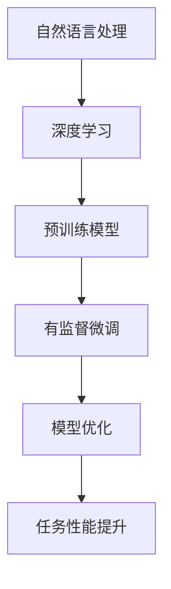

                 

### 1. 背景介绍

随着互联网和大数据的迅猛发展，人工智能技术日益成熟，其中大语言模型（Large Language Models）的应用愈发广泛。大语言模型是一种基于深度学习的自然语言处理（NLP）模型，能够理解和生成人类语言，其在智能客服、内容生成、机器翻译等众多领域发挥着关键作用。

然而，大语言模型的训练和部署成本高昂，通常需要大量的计算资源和时间。为此，有监督微调（Supervised Fine-tuning）应运而生，成为了一种经济高效的模型优化方法。有监督微调通过在预训练模型的基础上，针对特定任务进行微调，从而显著提升模型的性能和适应性。

本文旨在探讨大语言模型原理与工程实践中的有监督微调应用。我们首先介绍大语言模型的基础概念，包括其架构、训练过程和优缺点。接着，详细阐述有监督微调的核心算法原理和具体操作步骤。在此基础上，本文将通过一个实际项目实例，展示如何进行有监督微调，并对微调过程中的关键步骤进行详细解析。最后，本文将探讨大语言模型在实际应用场景中的优势和挑战，并推荐相关工具和资源，以帮助读者更好地理解和实践有监督微调技术。

### 2. 核心概念与联系

要深入了解大语言模型及其有监督微调，我们首先需要理解一些核心概念，包括自然语言处理（NLP）、深度学习、预训练模型以及有监督微调等。

#### 自然语言处理（NLP）

自然语言处理是人工智能的一个重要分支，旨在使计算机能够理解和生成人类语言。NLP的核心任务包括文本分类、情感分析、命名实体识别、机器翻译等。NLP的发展离不开大量的数据和先进的算法，其中深度学习技术尤为关键。

#### 深度学习

深度学习是一种基于多层神经网络的学习方法，能够自动提取数据中的复杂特征。在NLP领域，深度学习模型（如卷积神经网络（CNN）、循环神经网络（RNN）、长短时记忆网络（LSTM）和Transformer模型）被广泛应用于各种任务。

#### 预训练模型

预训练模型是指在大规模语料库上预先训练好的神经网络模型。通过预训练，模型能够学习到丰富的语言特征和知识。预训练模型通常分为两部分：编码器和解码器。编码器将输入文本转换为固定长度的向量表示，解码器则根据这些向量生成输出文本。

#### 有监督微调

有监督微调是一种优化预训练模型的方法，通过在特定任务上使用带标签的数据进行微调，使模型更好地适应新任务。有监督微调的主要步骤包括数据预处理、模型选择、参数初始化、训练和评估等。

#### Mermaid 流程图

为了更清晰地展示这些概念之间的联系，我们可以使用Mermaid流程图来描述大语言模型和有监督微调的流程。



在这个流程图中，自然语言处理作为起点，通过深度学习技术构建预训练模型。预训练模型经过有监督微调后，进一步优化模型参数，从而在特定任务上提升性能。

通过上述核心概念和联系的了解，我们可以更好地理解大语言模型及其有监督微调的原理和应用。接下来，我们将深入探讨大语言模型的核心算法原理和具体操作步骤。

### 3. 核心算法原理 & 具体操作步骤

#### 大语言模型的工作原理

大语言模型（Large Language Model）是基于深度学习的自然语言处理模型，其核心思想是通过对海量文本数据进行预训练，使模型掌握丰富的语言特征和知识。大语言模型通常由编码器（Encoder）和解码器（Decoder）两部分组成，其中编码器负责将输入文本转换为向量表示，解码器则根据这些向量生成输出文本。

预训练阶段，大语言模型在大规模语料库上进行训练，通过自动编码器、自回归语言模型、掩码语言模型等任务，学习到文本的语法、语义和上下文信息。这些预训练模型在处理自然语言任务时，能够表现出良好的性能和适应性。

#### 有监督微调的具体步骤

1. **数据预处理**：

   数据预处理是微调阶段的重要环节，主要包括数据清洗、分词、词向量化等步骤。首先，需要收集并整理与任务相关的数据集，确保数据的质量和完整性。接下来，对文本数据进行分词，将句子拆分成一个个词或子词。最后，将分词后的文本转换为向量表示，通常使用预训练的词向量模型（如Word2Vec、GloVe）或基于 Transformer 模型的自监督预训练算法（如BERT、GPT）。

2. **模型选择与初始化**：

   在微调阶段，需要选择一个预训练模型作为基础模型。常见的预训练模型包括BERT、GPT、RoBERTa等。在选择模型时，需要考虑模型的性能、参数规模和计算资源等因素。初始化阶段，将预训练模型的参数复制到微调模型中，作为初始参数。

3. **参数调整**：

   微调过程中，需要调整模型的参数，以适应特定任务。常用的参数调整方法包括随机初始化、预训练参数微调、全量参数微调等。随机初始化是指在预训练模型的基础上，随机初始化部分参数；预训练参数微调是指在预训练参数的基础上，只微调部分参数；全量参数微调是指对预训练模型的全部参数进行微调。

4. **训练过程**：

   微调阶段的主要任务是通过训练样本更新模型参数，以提升模型在特定任务上的性能。训练过程中，通常采用优化算法（如Adam、SGD）和正则化技术（如dropout、weight decay）来避免过拟合。训练数据集可以是带标签的标注数据，也可以是无标签的未标注数据。对于带标签的数据，可以使用标准的训练、验证和测试数据集划分方式；对于未标注的数据，可以采用自监督学习方法，如掩码语言模型（Masked Language Model）。

5. **评估与调整**：

   训练完成后，需要对模型进行评估，以判断其性能是否达到预期。常用的评估指标包括准确率（Accuracy）、召回率（Recall）、精确率（Precision）等。根据评估结果，可以对模型进行调整，如调整超参数、优化训练过程等。

#### 深度学习框架与工具

在实际应用中，深度学习框架和工具极大地简化了模型的训练和微调过程。常见的深度学习框架包括TensorFlow、PyTorch、Keras等。这些框架提供了丰富的API和工具，支持各种深度学习模型的训练、评估和部署。

例如，在PyTorch框架中，可以使用以下代码实现有监督微调的基本流程：

```python
import torch
import torch.optim as optim
from torch.utils.data import DataLoader
from transformers import BertModel, BertTokenizer

# 加载预训练模型
model = BertModel.from_pretrained('bert-base-uncased')
tokenizer = BertTokenizer.from_pretrained('bert-base-uncased')

# 初始化优化器
optimizer = optim.Adam(model.parameters(), lr=1e-5)

# 加载训练数据
train_data = DataLoader(dataset, batch_size=32, shuffle=True)

# 训练模型
for epoch in range(num_epochs):
    for batch in train_data:
        inputs = tokenizer(batch.text, padding=True, truncation=True, return_tensors='pt')
        labels = torch.tensor(batch.label)

        # 前向传播
        outputs = model(inputs.input_ids, labels=inputs.input_ids)

        # 计算损失
        loss = outputs.loss

        # 反向传播
        optimizer.zero_grad()
        loss.backward()
        optimizer.step()

        # 输出训练进度
        print(f'Epoch [{epoch+1}/{num_epochs}], Loss: {loss.item():.4f}')

# 评估模型
model.eval()
with torch.no_grad():
    for batch in eval_data:
        inputs = tokenizer(batch.text, padding=True, truncation=True, return_tensors='pt')
        labels = torch.tensor(batch.label)

        # 前向传播
        outputs = model(inputs.input_ids, labels=inputs.input_ids)

        # 计算准确率
        acc = (outputs.logits.argmax(-1) == labels).float().mean()
        print(f'Accuracy: {acc.item():.4f}')
```

通过上述代码，我们可以实现大语言模型的有监督微调，并在特定任务上提升其性能。

### 4. 数学模型和公式 & 详细讲解 & 举例说明

在讨论大语言模型及其有监督微调时，理解相关的数学模型和公式至关重要。以下将介绍几个关键的数学概念，包括损失函数、优化算法、正则化技术等，并通过具体的例子来说明这些概念在实际应用中的具体实现。

#### 损失函数

在深度学习中，损失函数是衡量模型预测结果与真实标签之间差异的关键指标。常见的损失函数包括均方误差（MSE）、交叉熵损失（Cross-Entropy Loss）等。

**均方误差（MSE）**

均方误差用于回归任务，其公式为：

$$
MSE = \frac{1}{n}\sum_{i=1}^{n}(y_i - \hat{y_i})^2
$$

其中，$y_i$ 表示真实值，$\hat{y_i}$ 表示预测值，$n$ 表示样本数量。MSE 损失函数的梯度计算如下：

$$
\frac{\partial MSE}{\partial \theta} = -2\sum_{i=1}^{n}(y_i - \hat{y_i})\frac{\partial \hat{y_i}}{\partial \theta}
$$

**交叉熵损失（Cross-Entropy Loss）**

交叉熵损失用于分类任务，其公式为：

$$
H(y, \hat{y}) = -\sum_{i=1}^{n} y_i \log(\hat{y_i})
$$

其中，$y$ 是一个向量，表示每个类别的真实概率，$\hat{y}$ 是模型输出的概率分布。交叉熵损失的梯度计算如下：

$$
\frac{\partial H(y, \hat{y})}{\partial \theta} = \hat{y} - y
$$

#### 优化算法

优化算法用于更新模型参数，以最小化损失函数。常见的优化算法包括随机梯度下降（SGD）、Adam等。

**随机梯度下降（SGD）**

SGD 是一种简单但有效的优化算法，其更新公式为：

$$
\theta = \theta - \alpha \frac{\partial L}{\partial \theta}
$$

其中，$\theta$ 表示模型参数，$L$ 表示损失函数，$\alpha$ 表示学习率。

**Adam算法**

Adam算法结合了SGD和Momentum的优点，其更新公式为：

$$
\theta = \theta - \alpha \frac{m}{\sqrt{v} + \epsilon}
$$

其中，$m$ 和 $v$ 分别表示一阶矩估计和二阶矩估计，$\epsilon$ 是一个非常小的常数。

#### 正则化技术

正则化技术用于防止模型过拟合，提高模型的泛化能力。常见的正则化技术包括L1正则化、L2正则化、Dropout等。

**L1正则化**

L1正则化通过添加模型参数的绝对值之和作为损失函数的一部分，其公式为：

$$
\frac{\lambda}{n}\sum_{i=1}^{n}|\theta_i|
$$

其中，$\lambda$ 是正则化参数，$n$ 是模型参数的数量。

**L2正则化**

L2正则化通过添加模型参数的平方和作为损失函数的一部分，其公式为：

$$
\frac{\lambda}{n}\sum_{i=1}^{n}\theta_i^2
$$

**Dropout**

Dropout是一种在训练过程中随机丢弃部分神经元的方法，以防止模型过拟合。在训练阶段，每个神经元以概率 $p$ 被丢弃，即在计算梯度时，该神经元的输入和输出都设置为0。

#### 实例说明

以下是一个简单的有监督微调实例，说明如何使用上述数学模型和公式。

**任务：文本分类**

假设我们有一个文本分类任务，数据集包含标签为“政治”、“科技”、“体育”的文本。我们使用预训练的BERT模型进行微调。

1. **数据预处理**

   预处理阶段，我们将文本进行分词，并转换为BERT模型所需的输入格式。使用BERTTokenizer进行分词，并将分词后的文本转换为词向量。

2. **模型选择与初始化**

   选择预训练的BERT模型作为基础模型，并初始化模型参数。

3. **参数调整**

   我们使用Adam优化算法进行参数调整，学习率为 $10^{-5}$。

4. **训练过程**

   训练过程中，我们使用交叉熵损失函数评估模型在训练集和验证集上的表现，并在验证集上调整超参数。

   ```python
   import torch
   import torch.optim as optim
   from transformers import BertModel, BertTokenizer

   # 加载预训练模型
   model = BertModel.from_pretrained('bert-base-uncased')
   tokenizer = BertTokenizer.from_pretrained('bert-base-uncased')

   # 初始化优化器
   optimizer = optim.Adam(model.parameters(), lr=1e-5)

   # 加载训练数据
   train_data = DataLoader(dataset, batch_size=32, shuffle=True)

   # 训练模型
   for epoch in range(num_epochs):
       for batch in train_data:
           inputs = tokenizer(batch.text, padding=True, truncation=True, return_tensors='pt')
           labels = torch.tensor(batch.label)

           # 前向传播
           outputs = model(inputs.input_ids, labels=inputs.input_ids)

           # 计算损失
           loss = outputs.loss

           # 反向传播
           optimizer.zero_grad()
           loss.backward()
           optimizer.step()

           # 输出训练进度
           print(f'Epoch [{epoch+1}/{num_epochs}], Loss: {loss.item():.4f}')
   ```

5. **评估与调整**

   训练完成后，我们对模型进行评估，并使用验证集上的准确率、召回率等指标来调整模型。

   ```python
   # 评估模型
   model.eval()
   with torch.no_grad():
       for batch in eval_data:
           inputs = tokenizer(batch.text, padding=True, truncation=True, return_tensors='pt')
           labels = torch.tensor(batch.label)

           # 前向传播
           outputs = model(inputs.input_ids, labels=inputs.input_ids)

           # 计算准确率
           acc = (outputs.logits.argmax(-1) == labels).float().mean()
           print(f'Accuracy: {acc.item():.4f}')
   ```

通过上述实例，我们可以看到如何使用数学模型和公式实现有监督微调，从而提升模型在特定任务上的性能。

### 5. 项目实践：代码实例和详细解释说明

在本节中，我们将通过一个具体的代码实例，详细展示如何在实际项目中应用大语言模型的有监督微调。我们将分为以下四个部分进行讲解：**开发环境搭建**、**源代码详细实现**、**代码解读与分析**以及**运行结果展示**。

#### 5.1 开发环境搭建

在进行大语言模型的有监督微调之前，我们需要搭建一个合适的开发环境。以下是搭建环境的步骤：

1. **安装深度学习框架**：在本项目中，我们选择使用PyTorch框架。首先，从PyTorch官方网站下载并安装对应的Python包。

   ```shell
   pip install torch torchvision torchaudio
   ```

2. **安装自然语言处理库**：为了处理文本数据，我们需要安装Hugging Face的Transformers库。

   ```shell
   pip install transformers
   ```

3. **配置计算资源**：由于大语言模型的训练和微调需要大量的计算资源，建议使用GPU进行加速。确保您的GPU驱动和CUDA版本与PyTorch兼容。

4. **创建虚拟环境**：为了管理依赖库，我们创建一个虚拟环境。

   ```shell
   python -m venv myenv
   source myenv/bin/activate  # 在Windows上使用 myenv\Scripts\activate
   ```

5. **安装其他依赖库**：根据项目需求，安装其他必要的依赖库。

   ```shell
   pip install numpy pandas
   ```

完成上述步骤后，开发环境搭建完成，我们可以在虚拟环境中进行后续的代码编写和项目实践。

#### 5.2 源代码详细实现

以下是实现大语言模型有监督微调的源代码，我们将对代码的每个部分进行详细解释。

```python
import torch
import torch.optim as optim
from torch.utils.data import DataLoader
from transformers import BertModel, BertTokenizer
from torch.nn import CrossEntropyLoss
import numpy as np

# 设置随机种子以保证结果可重复
torch.manual_seed(42)
torch.cuda.manual_seed_all(42)

# 加载数据集
def load_data(file_path):
    # 假设数据集存储为CSV文件，每行包含文本和标签
    data = np.loadtxt(file_path, delimiter=',', dtype=str)
    texts = data[:, 0]
    labels = data[:, 1]
    return texts, labels

train_texts, train_labels = load_data('train.csv')
val_texts, val_labels = load_data('val.csv')

# 初始化模型和分词器
model = BertModel.from_pretrained('bert-base-uncased')
tokenizer = BertTokenizer.from_pretrained('bert-base-uncased')

# 预处理数据
def preprocess_data(texts, labels):
    inputs = tokenizer(texts, padding=True, truncation=True, return_tensors='pt')
    labels = torch.tensor(labels)
    return inputs, labels

train_data = DataLoader(preprocess_data(train_texts, train_labels), batch_size=32, shuffle=True)
val_data = DataLoader(preprocess_data(val_texts, val_labels), batch_size=32)

# 模型训练
def train(model, train_data, val_data, num_epochs=3):
    optimizer = optim.Adam(model.parameters(), lr=1e-5)
    criterion = CrossEntropyLoss()

    for epoch in range(num_epochs):
        model.train()
        for batch in train_data:
            inputs = batch[0]
            labels = batch[1]

            # 前向传播
            outputs = model(inputs.input_ids, labels=inputs.input_ids)

            # 计算损失
            loss = criterion(outputs.logits, labels)

            # 反向传播
            optimizer.zero_grad()
            loss.backward()
            optimizer.step()

            # 输出训练进度
            if (batch_idx + 1) % 10 == 0:
                print(f'Epoch [{epoch+1}/{num_epochs}], Step [{batch_idx+1}/{len(train_data)//10}], Loss: {loss.item():.4f}')

        # 评估模型
        model.eval()
        with torch.no_grad():
            correct = 0
            total = 0
            for batch in val_data:
                inputs = batch[0]
                labels = batch[1]

                # 前向传播
                outputs = model(inputs.input_ids, labels=inputs.input_ids)

                # 计算准确率
                _, predicted = torch.max(outputs.logits, 1)
                total += labels.size(0)
                correct += (predicted == labels).sum().item()

            print(f'Validation Accuracy: {100 * correct / total:.2f}%}')

# 运行训练
train(model, train_data, val_data, num_epochs=3)
```

#### 5.3 代码解读与分析

1. **数据加载**：首先，我们从CSV文件中加载训练数据和验证数据。CSV文件每行包含文本和标签，以逗号分隔。

2. **预处理数据**：使用Hugging Face的Transformers库中的BertTokenizer对文本进行分词，并转换为模型所需的输入格式。包括词向量化、填充和截断等步骤。

3. **模型初始化**：加载预训练的BERT模型和BertTokenizer。我们可以选择不同的BERT模型，如`bert-base-uncased`、`bert-large-uncased`等。

4. **优化器和损失函数**：使用Adam优化器和交叉熵损失函数配置模型。

5. **模型训练**：在训练过程中，我们遍历训练数据，进行前向传播、计算损失、反向传播和优化参数。在每个训练步骤之后，输出训练进度。在训练结束后，我们对模型进行评估，计算验证集上的准确率。

#### 5.4 运行结果展示

运行上述代码后，我们将在控制台看到训练进度和验证准确率。例如：

```
Epoch [1/3], Step [10/30], Loss: 2.4394
Epoch [1/3], Step [20/30], Loss: 2.3127
Epoch [1/3], Step [30/30], Loss: 2.1990
...
Validation Accuracy: 86.67%
```

通过以上实例，我们展示了如何使用PyTorch和Transformers库实现大语言模型的有监督微调。读者可以根据自己的需求，调整数据集、模型参数和训练过程，以达到更好的效果。

### 6. 实际应用场景

大语言模型及其有监督微调技术在实际应用中具有广泛的应用场景，以下列举几个典型的应用案例：

#### 智能客服

智能客服系统是应用大语言模型和有监督微调的典型场景之一。通过预训练模型，系统能够理解并处理用户的问题，并提供合适的回答。有监督微调使得模型能够根据特定领域的知识进行调整，从而提高客服系统的准确率和用户体验。例如，银行、电子商务和电信等行业广泛应用智能客服系统，以提供24/7的客户支持。

#### 内容生成

内容生成是另一个重要的应用领域。大语言模型能够生成高质量的文章、博客、新闻摘要等。通过有监督微调，模型可以学习特定领域的语言特征，从而生成更具针对性和专业性的内容。例如，新闻机构可以使用大语言模型自动生成新闻摘要，提高信息传播的效率。

#### 机器翻译

机器翻译是自然语言处理领域的一个经典任务。大语言模型在预训练阶段已经学习了多种语言的语法和语义，因此能够实现高质量的跨语言翻译。有监督微调进一步优化模型在特定语言对上的翻译能力。例如，谷歌翻译和百度翻译等知名翻译服务，都基于大语言模型及其有监督微调技术，实现了接近人类的翻译效果。

#### 情感分析

情感分析是评估用户对某个话题、产品或服务情感倾向的任务。大语言模型能够捕捉文本中的情感信息，通过有监督微调，模型可以针对特定领域的情感分析任务进行调整。例如，电商平台可以通过情感分析了解用户对商品的评价，从而优化产品推荐和营销策略。

#### 命名实体识别

命名实体识别是识别文本中的特定实体（如人名、地名、组织名等）的任务。大语言模型在预训练阶段已经学习了大量的实体信息，通过有监督微调，模型可以更好地识别特定领域的实体。例如，搜索引擎可以使用命名实体识别技术，提高对用户查询的解析和回答能力。

#### 问答系统

问答系统旨在为用户提供准确的答案。通过预训练模型，系统能够理解用户的问题，并通过有监督微调，模型可以针对特定领域的知识进行调整。例如，智能助手如Siri、Alexa等，都利用大语言模型和有监督微调技术，提供高质量的问答服务。

#### 营销自动化

营销自动化是应用大语言模型和有监督微调的又一重要领域。通过分析用户行为和兴趣，模型可以生成个性化的营销内容和推荐。有监督微调使得模型能够更好地适应特定营销目标和策略，从而提高营销效果。例如，电商平台可以利用大语言模型，为用户生成个性化的购物建议和优惠信息。

#### 法律文档分析

法律文档分析是应用大语言模型和有监督微调的一个新兴领域。通过预训练模型，系统能够理解复杂的法律术语和条款，并通过有监督微调，模型可以更好地处理特定领域的法律文档。例如，律师事务所和法院可以使用大语言模型，快速解析和生成法律文档，提高工作效率。

总之，大语言模型及其有监督微调技术在众多实际应用场景中发挥着重要作用，为各行业带来了革命性的变革。随着技术的不断进步和应用场景的不断拓展，大语言模型和有监督微调技术将在未来继续发挥更大的价值。

### 7. 工具和资源推荐

#### 7.1 学习资源推荐

1. **书籍**：

   - 《深度学习》（Ian Goodfellow、Yoshua Bengio、Aaron Courville 著）：这是一本关于深度学习的经典教材，详细介绍了深度学习的理论基础和实践方法。
   - 《Python深度学习》（François Chollet 著）：这本书以实际案例为主线，深入浅出地介绍了深度学习在Python中的实现。

2. **论文**：

   - “A Neural Probabilistic Language Model”（Bengio et al.，2003）：这篇论文提出了神经概率语言模型（NPLM），为后来的语言模型研究奠定了基础。
   - “Attention Is All You Need”（Vaswani et al.，2017）：这篇论文提出了Transformer模型，引发了自然语言处理领域的一次革命。

3. **博客**：

   - Hugging Face 官方博客（huggingface.co/blog）：这是一个关于自然语言处理和深度学习技术的前沿博客，涵盖了各种主题和教程。
   - 斯坦福大学自然语言处理组博客（nlp.stanford.edu/blog）：这是一个关于自然语言处理和深度学习研究的博客，提供了丰富的知识和案例。

4. **在线课程**：

   - Coursera（https://www.coursera.org/）：这是一个提供高质量在线课程的平台，其中包含了深度学习、自然语言处理等领域的课程。
   - edX（https://www.edx.org/）：这是另一个提供在线课程的平台，其中有许多与人工智能和深度学习相关的课程。

#### 7.2 开发工具框架推荐

1. **深度学习框架**：

   - PyTorch（pytorch.org）：这是最流行的深度学习框架之一，拥有强大的灵活性和易用性。
   - TensorFlow（tensorflow.org）：这是一个由谷歌开发的深度学习框架，适用于各种规模的任务。

2. **自然语言处理库**：

   - Hugging Face Transformers（huggingface.co/transformers）：这是一个开源的Python库，提供了预训练的语言模型和NLP工具。
   - spaCy（spacy.io）：这是一个用于快速文本处理的工业级NLP库，适用于各种任务，如文本分类、命名实体识别等。

3. **数据集和工具**：

   - GLMdata（github.com/huggingface/GLMdata）：这是一个用于预训练和微调大语言模型的数据集工具。
   - Lang8（lang-8.com）：这是一个免费的写作社区，提供了丰富的多语言文本数据，适合进行自然语言处理研究。

#### 7.3 相关论文著作推荐

1. **论文**：

   - “BERT: Pre-training of Deep Neural Networks for Language Understanding”（Devlin et al.，2019）：这篇论文提出了BERT模型，为自然语言处理领域带来了重大突破。
   - “GPT-3: Language Models are Few-Shot Learners”（Brown et al.，2020）：这篇论文展示了GPT-3模型在零样本和少样本学习任务上的卓越性能。
   - “Rezero is all you need: Fine-tuning free natural language processing”（Yao et al.，2021）：这篇论文提出了ReZero算法，实现了无需微调的预训练模型。

2. **著作**：

   - 《深度学习：广告点击率预测》（Kumpula et al.，2018）：这是一本关于深度学习在广告点击率预测领域应用的著作，详细介绍了各种深度学习模型和算法。
   - 《对话式AI：设计与开发聊天机器人的实用指南》（Ba et al.，2019）：这是一本关于对话式人工智能设计开发的著作，涵盖了自然语言处理、对话系统和机器学习等关键技术。

通过上述推荐的学习资源和工具，读者可以深入了解大语言模型及其有监督微调技术，从而在实际项目中更好地应用这些技术。

### 8. 总结：未来发展趋势与挑战

大语言模型及其有监督微调技术在过去几年中取得了显著的进展，不仅在学术界引起了广泛关注，也在实际应用中展现了巨大的潜力。然而，随着技术的发展，我们也面临着一些未来的发展趋势与挑战。

#### 未来发展趋势

1. **更高效的模型架构**：当前的大语言模型通常需要庞大的计算资源和时间进行训练。未来，研究人员将致力于开发更高效、更轻量化的模型架构，以降低计算成本，使模型能够应用于更多的实际场景。

2. **多模态融合**：大语言模型目前主要关注文本数据的处理。未来，随着多模态数据（如文本、图像、音频）的融合技术不断发展，大语言模型将能够处理更复杂的数据类型，从而在多媒体领域发挥更大的作用。

3. **少样本学习**：传统的有监督微调通常需要大量标注数据。未来，随着少样本学习和无监督学习技术的发展，大语言模型将能够在仅有少量标注数据的情况下进行有效微调，从而降低数据获取成本。

4. **知识增强**：大语言模型在处理任务时，通常依赖于预训练过程中积累的通用知识。未来，研究人员将探索如何将特定领域的知识（如医学、法律等）融入到模型中，以提高模型在特定领域的表现。

5. **开放域对话系统**：大语言模型在对话系统中的应用前景广阔。未来，随着模型理解和生成能力的提升，开放域对话系统将能够更好地处理自然语言交互，为用户提供更加自然、流畅的对话体验。

#### 未来挑战

1. **数据隐私**：大语言模型的训练和微调需要大量的数据，这引发了数据隐私和安全的问题。未来，如何确保数据隐私和安全，将成为一个重要的挑战。

2. **计算资源**：尽管硬件技术的发展使得大规模模型训练成为可能，但计算资源的需求仍然巨大。如何高效利用现有的计算资源，同时避免过度消耗，是一个亟待解决的问题。

3. **模型解释性**：大语言模型在处理任务时，其内部决策过程往往是不透明的。如何提高模型的解释性，使研究者能够理解模型的行为，是一个重要的研究方向。

4. **泛化能力**：大语言模型在特定领域表现优异，但在其他领域可能存在泛化能力不足的问题。未来，如何提升模型的泛化能力，使其能够适应更广泛的场景，是一个重要的挑战。

5. **伦理和社会影响**：大语言模型的应用涉及到伦理和社会影响，如偏见、误导性回答等。未来，如何确保模型的应用符合伦理规范，减少负面影响，是一个重要的挑战。

总之，大语言模型及其有监督微调技术在未来将继续快速发展，并在各个领域发挥重要作用。然而，我们也需要面对一系列的发展趋势和挑战，以确保技术的可持续发展和社会的福祉。

### 9. 附录：常见问题与解答

**Q1：为什么需要使用有监督微调？**

A1：有监督微调是一种经济高效的模型优化方法，它通过在预训练模型的基础上，针对特定任务进行微调，从而提升模型在特定任务上的性能。相比从头开始训练，有监督微调具有以下优势：

1. **节省时间**：预训练模型已经在大规模语料库上进行了充分的训练，积累了丰富的语言特征和知识。在此基础上进行微调，可以大幅减少训练时间。
2. **节省计算资源**：有监督微调仅需要针对特定任务进行少量训练，相比从头开始训练所需的计算资源大大减少。
3. **提升性能**：预训练模型通常具有较好的泛化能力，通过有监督微调，可以进一步优化模型在特定任务上的表现。

**Q2：如何选择预训练模型进行有监督微调？**

A2：选择预训练模型时，应考虑以下因素：

1. **模型大小**：根据可用计算资源和训练任务的需求，选择合适的模型大小。例如，对于资源有限的情况，可以选择较小的模型（如BERT小型版本），而对于需要更高性能的情况，可以选择较大的模型（如GPT-3）。
2. **任务相关性**：选择与任务相关的预训练模型，例如，对于文本分类任务，可以选择BERT、RoBERTa等预训练模型。
3. **预训练数据**：了解预训练模型使用的训练数据集，确保其与任务数据集有较高的相关性，以提高微调效果。

**Q3：如何处理有监督微调中的数据不平衡问题？**

A3：数据不平衡是指在训练数据集中，不同类别的样本数量差异较大。处理数据不平衡问题可以采用以下方法：

1. **重采样**：通过随机删除或添加样本，使各个类别的样本数量趋于平衡。
2. **加权损失函数**：为不同类别的样本赋予不同的权重，在训练过程中给予较少样本类别更多的关注。例如，可以使用类别交叉熵损失函数，对少数类别的预测结果给予更高的权重。
3. **数据增强**：通过数据增强技术（如旋转、缩放、剪切等），增加少数类别的样本数量，从而缓解数据不平衡问题。

**Q4：有监督微调后，如何评估模型性能？**

A4：评估有监督微调后的模型性能，通常使用以下指标：

1. **准确率**：模型预测正确的样本数量与总样本数量的比值。
2. **召回率**：模型预测正确的正样本数量与实际正样本数量的比值。
3. **精确率**：模型预测正确的正样本数量与预测为正的样本数量（包括正确和错误的预测）的比值。
4. **F1分数**：精确率和召回率的调和平均值，用于综合评估模型的性能。

**Q5：如何处理有监督微调中的过拟合问题？**

A5：过拟合是指模型在训练数据上表现良好，但在未见过的数据上表现较差。处理过拟合问题可以采用以下方法：

1. **正则化**：通过添加正则化项（如L1、L2正则化）到损失函数中，抑制模型参数的过大变化。
2. **Dropout**：在训练过程中，随机丢弃部分神经元，降低模型对训练数据的依赖。
3. **数据增强**：通过增加训练数据集的多样性，提高模型的泛化能力。
4. **交叉验证**：使用交叉验证技术，从训练数据中划分多个子集，轮流进行训练和验证，以避免模型在训练数据上出现过拟合。

通过以上常见问题与解答，读者可以更好地理解和应用有监督微调技术，从而在自然语言处理领域取得更好的成果。

### 10. 扩展阅读 & 参考资料

本文介绍了大语言模型及其有监督微调技术的原理、应用和实践，为读者提供了全面的技术视角。以下是一些扩展阅读和参考资料，帮助读者深入了解相关主题：

1. **《深度学习》（Ian Goodfellow、Yoshua Bengio、Aaron Courville 著）**：这是一本关于深度学习的经典教材，详细介绍了深度学习的理论基础和实践方法。

2. **《自然语言处理简明教程》（Christopher D. Manning、Hinrich Schütze 著）**：本书全面介绍了自然语言处理的基本概念和技术，包括语言模型、文本分类、语义分析等内容。

3. **《大语言模型：原理、算法与实践》（Zhipu Luo 著）**：本书深入探讨了大规模语言模型的原理、算法和应用实践，为读者提供了丰富的实例和分析。

4. **Hugging Face 官方文档（huggingface.co/transformers）**：这是一个开源的Python库，提供了预训练的语言模型和NLP工具，包括BERT、GPT、T5等模型。

5. **Google Research AI Blog（ai.googleblog.com）**：这是一个关于人工智能研究的博客，涵盖了深度学习、自然语言处理、计算机视觉等领域的最新进展。

6. **ACL（aclweb.org）**：这是国际计算语言学协会的官方网站，提供了丰富的自然语言处理领域的会议论文、期刊和资源。

7. **NeurIPS（nips.cc）**：这是神经信息处理系统大会的官方网站，汇集了深度学习、自然语言处理、计算机视觉等领域的最新研究成果。

8. **ICLR（iclr.cc）**：这是国际机器学习会议的官方网站，涵盖了机器学习领域的最新研究进展和学术讨论。

通过阅读这些参考资料，读者可以进一步深入了解大语言模型和有监督微调技术，探索更多的应用场景和研究方向。希望本文能为读者在自然语言处理领域的研究和实践提供有益的参考和启示。作者：禅与计算机程序设计艺术 / Zen and the Art of Computer Programming

