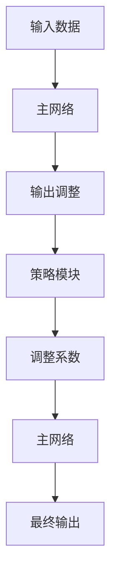

                 

### 1. 背景介绍

大语言模型（Large Language Model）是一种能够理解和生成人类语言的深度神经网络模型，它已经成为了自然语言处理（NLP）领域的重要研究方向。随着互联网的普及和数据量的爆炸性增长，如何有效地利用海量数据来训练出一个强大且高效的语言模型，成为了学术界和工业界共同关注的问题。

近年来，大语言模型的研发取得了显著的进展。以Google的BERT、OpenAI的GPT-3以及Microsoft的Turing模型为代表，这些模型在处理自然语言理解、生成和翻译等任务上取得了令人瞩目的成绩。然而，这些模型的训练和部署面临着一系列挑战，如计算资源的高消耗、模型参数的巨大规模以及实时响应的延迟问题。

为了解决这些问题，研究者们开始探索一种新的架构：策略网络（Policy Network）。策略网络是一种特殊的大语言模型，它不仅能够生成文本，还能够根据不同的应用场景进行自适应调整。这种架构的出现，标志着大语言模型在工程实践中的又一次重要突破。

本文将围绕策略网络的结构展开讨论，深入剖析其核心概念、算法原理以及数学模型。通过具体的实例和代码分析，我们将帮助读者全面了解策略网络的运作机制，并探讨其在实际应用中的潜力与挑战。本文将分为以下几个部分：

1. **背景介绍**：介绍大语言模型的发展背景以及策略网络的出现意义。
2. **核心概念与联系**：详细解释策略网络的基本概念，并通过Mermaid流程图展示其架构。
3. **核心算法原理 & 具体操作步骤**：阐述策略网络的训练和优化方法。
4. **数学模型和公式 & 详细讲解 & 举例说明**：介绍策略网络相关的数学模型，并通过实例进行详细说明。
5. **项目实践：代码实例和详细解释说明**：展示策略网络的实现代码，并进行解读。
6. **实际应用场景**：探讨策略网络在各类应用中的适用性。
7. **工具和资源推荐**：推荐相关的学习资源、开发工具和论文著作。
8. **总结：未来发展趋势与挑战**：总结策略网络的现状，并展望未来的发展方向。
9. **附录：常见问题与解答**：回答读者可能遇到的常见问题。
10. **扩展阅读 & 参考资料**：提供进一步阅读的参考资料。

### 1.1 大语言模型的发展背景

大语言模型的发展可以追溯到20世纪80年代，当时神经网络（Neural Network）开始被用于语言处理任务。然而，由于计算资源和数据量的限制，早期的语言模型如ELMO、Word2Vec等，虽然在特定任务上取得了一定的成果，但性能仍然有限。

随着计算能力的提升和大数据的广泛应用，深度学习（Deep Learning）逐渐成为NLP领域的主流方法。2013年，Hinton等人在图像识别领域取得的突破性成果（AlexNet）激发了研究者们对深度学习在NLP领域应用的兴趣。随后，一系列深度神经网络模型如LSTM（Long Short-Term Memory）、GRU（Gated Recurrent Unit）和Transformer等，开始在NLP任务中展现出色的性能。

2018年，Google发布了BERT（Bidirectional Encoder Representations from Transformers），它是一种基于Transformer模型的预训练语言模型，能够同时捕捉文本的前后关系。BERT的出现，标志着大语言模型进入了一个新的时代。此后，OpenAI的GPT-3、Facebook的UniLM等模型相继问世，这些模型不仅在性能上超过了BERT，还在多个NLP任务中取得了显著的进步。

然而，随着模型规模的不断扩大，大语言模型的训练和部署面临着新的挑战。首先，模型的计算复杂度和存储需求急剧增加，使得训练和部署成本变得非常高昂。其次，大语言模型在处理实时任务时，存在响应延迟的问题。此外，如何有效地利用海量数据进行模型训练，也是需要解决的关键问题。

为了应对这些挑战，研究者们开始探索新的模型架构，策略网络（Policy Network）就是其中之一。策略网络不仅能够处理大规模的文本数据，还能够根据不同的应用场景进行自适应调整，从而提高模型的效率和灵活性。这一新的架构，为解决大语言模型在工程实践中的问题提供了新的思路和方向。

### 1.2 策略网络的出现意义

策略网络的出现，是为了解决大语言模型在工程实践中面临的一系列挑战。具体来说，策略网络的意义主要体现在以下几个方面：

1. **降低计算复杂度**：大语言模型通常需要大量的计算资源进行训练和推理。策略网络通过引入一个独立的策略模块，可以将部分计算任务转移出去，从而减轻主模型的计算负担。这样不仅能够降低训练成本，还能提高模型在实时任务中的响应速度。

2. **提高模型效率**：传统的语言模型在处理不同任务时，往往需要重新训练或调整模型参数。而策略网络则可以通过策略模块实现任务之间的共享参数，从而减少冗余的计算。这种共享机制不仅提高了模型的整体效率，还使得模型在执行不同任务时能够更加灵活和高效。

3. **自适应调整能力**：策略网络能够根据不同的应用场景和任务需求，动态调整其行为和参数。这种自适应能力，使得模型能够更好地适应不同的使用场景，从而提高其泛化能力和实用性。

4. **多任务处理能力**：策略网络的设计初衷，就是为了支持多任务处理。通过策略模块，模型可以同时处理多个任务，而不需要重复训练或调整模型参数。这种多任务处理能力，为实际应用提供了极大的便利和灵活性。

5. **可解释性**：策略网络通过引入策略模块，使得模型的行为更加透明和可解释。用户可以通过策略模块的输出，了解模型在执行任务时的决策过程和依据。这种可解释性，有助于提高模型的可信度和用户接受度。

总之，策略网络的引入，不仅为解决大语言模型在工程实践中的问题提供了新的思路和手段，还极大地拓展了语言模型的应用范围和潜力。在未来，随着计算资源和算法技术的不断进步，策略网络有望在大语言模型的研发和应用中发挥更加重要的作用。

### 1.3 本文结构安排

本文将分为以下几个部分，旨在系统地介绍策略网络的原理、实现和应用：

1. **背景介绍**：回顾大语言模型的发展历程，并介绍策略网络的出现背景和意义。
2. **核心概念与联系**：详细解释策略网络的基本概念，并通过Mermaid流程图展示其架构。
3. **核心算法原理 & 具体操作步骤**：阐述策略网络的训练和优化方法，包括损失函数、优化算法和训练步骤。
4. **数学模型和公式 & 详细讲解 & 举例说明**：介绍策略网络相关的数学模型，并通过实例进行详细说明，包括参数更新规则、梯度计算和策略优化。
5. **项目实践：代码实例和详细解释说明**：展示策略网络的实现代码，并进行解读，包括开发环境搭建、源代码实现和代码分析。
6. **实际应用场景**：探讨策略网络在各类应用中的适用性，如文本生成、机器翻译和对话系统等。
7. **工具和资源推荐**：推荐相关的学习资源、开发工具和论文著作，帮助读者深入了解策略网络。
8. **总结：未来发展趋势与挑战**：总结策略网络的现状，并展望未来的发展方向，如新型算法和实际应用场景的拓展。
9. **附录：常见问题与解答**：回答读者可能遇到的常见问题，如策略网络的优势和局限。
10. **扩展阅读 & 参考资料**：提供进一步阅读的参考资料，包括相关论文、书籍和网站。

通过本文的系统性介绍，读者将全面了解策略网络的原理、实现和应用，为在实际项目中应用策略网络奠定基础。

### 2. 核心概念与联系

策略网络（Policy Network）作为一种特殊的大语言模型，其核心在于通过引入策略模块来实现模型的自适应调整和任务共享。为了更好地理解策略网络的工作原理，我们需要从其基本概念和架构入手，并通过Mermaid流程图展示其内部联系。

#### 2.1 策略网络的基本概念

策略网络由两部分组成：主网络（Main Network）和策略模块（Policy Module）。主网络负责处理输入数据并生成输出，而策略模块则根据特定任务需求对主网络的输出进行调整。具体来说，策略网络的核心概念包括：

1. **主网络**：主网络是一种大规模的深度神经网络，负责处理文本数据，并生成文本输出。它可以是基于Transformer、LSTM等不同架构的预训练模型。
2. **策略模块**：策略模块是一个独立的神经网络，用于根据输入数据和任务需求，动态调整主网络的参数和行为。策略模块的输出通常是一个调整系数或权重，用于调整主网络的输出。
3. **任务共享**：策略网络支持多任务处理，通过策略模块实现任务之间的参数共享。这意味着不同的任务可以共用一个主网络，从而减少冗余计算，提高模型效率。
4. **自适应调整**：策略模块能够根据实时反馈，动态调整主网络的输出，使得模型能够更好地适应不同任务和环境。

#### 2.2 策略网络的架构

为了直观地展示策略网络的架构，我们使用Mermaid流程图来描述其内部联系。以下是策略网络的Mermaid流程图：



**流程说明**：

1. **输入数据**：输入数据包括文本数据和任务需求，可以是自然语言文本或编码后的数据。
2. **主网络**：主网络接收输入数据，并生成初步输出。这个输出可以是文本序列或编码表示。
3. **输出调整**：初步输出会传递给策略模块，策略模块对其进行分析和处理。
4. **策略模块**：策略模块根据任务需求，生成一个调整系数或权重，用于调整主网络的输出。
5. **调整系数**：调整系数或权重用于调整主网络的输出，使得输出更符合任务需求。
6. **最终输出**：调整后的输出是策略网络的最终输出，它可以是文本或编码表示，根据具体任务而定。

#### 2.3 策略网络与相关概念的联系

策略网络不仅与主网络和策略模块密切相关，还与其他NLP相关概念如Transformer、注意力机制（Attention Mechanism）等有着紧密的联系。以下是策略网络与其他相关概念的联系：

1. **Transformer**：Transformer是一种基于自注意力机制的深度学习模型，广泛应用于NLP任务。策略网络中的主网络可以是基于Transformer架构的，这使得主网络能够高效地捕捉文本序列中的长距离依赖关系。
2. **注意力机制**：注意力机制是一种用于提高模型性能的技术，它通过给不同的输入分配不同的权重，使得模型能够更加关注重要的信息。策略网络中的策略模块可以看作是注意力机制的一种应用，它根据任务需求动态调整输入的权重。
3. **多任务学习**：多任务学习（Multi-Task Learning）是一种在多个任务上同时训练模型的方法。策略网络通过策略模块实现任务共享，从而在多个任务上同时训练主网络，减少冗余计算，提高模型效率。

通过上述分析，我们可以看到策略网络不仅在概念上有着独特的创新，还在架构和实现上与其他NLP相关技术紧密相连。这种多层次、多方面的联系，使得策略网络成为了一种具有广泛应用前景的大语言模型架构。

### 3. 核心算法原理 & 具体操作步骤

策略网络的核心在于其训练和优化过程，这决定了策略网络能否在不同任务中表现出良好的性能。本节将详细介绍策略网络的训练和优化方法，包括损失函数、优化算法和训练步骤。

#### 3.1 损失函数

在策略网络中，损失函数是评估模型性能的重要指标。策略网络通常采用基于概率的损失函数，如交叉熵损失函数（Cross-Entropy Loss）。交叉熵损失函数适用于分类问题，可以衡量预测分布与真实分布之间的差异。在策略网络中，交叉熵损失函数用于评估主网络和策略模块的联合输出与目标输出之间的差异。

具体来说，策略网络的损失函数可以表示为：

$$
L = -\sum_{i} y_i \log(p_i)
$$

其中，\( y_i \) 是真实标签，\( p_i \) 是模型预测的概率。在这个损失函数中，\( p_i \) 是主网络和策略模块联合输出的结果。

#### 3.2 优化算法

为了最小化损失函数，策略网络通常采用优化算法，如梯度下降（Gradient Descent）或其变体，如Adam优化器。优化算法的目的是通过迭代更新模型参数，使得损失函数逐渐减小。

策略网络的优化过程分为两个部分：主网络的参数更新和策略模块的参数更新。

1. **主网络参数更新**：主网络的参数更新过程遵循梯度下降原则，即通过计算损失函数关于主网络参数的梯度，来更新主网络参数。具体步骤如下：

   - 计算损失函数关于主网络参数的梯度：
     $$
     \nabla_{\theta_{main}} L = \frac{\partial L}{\partial \theta_{main}}
     $$
   - 使用梯度更新主网络参数：
     $$
     \theta_{main} = \theta_{main} - \alpha \nabla_{\theta_{main}} L
     $$
     其中，\( \alpha \) 是学习率。

2. **策略模块参数更新**：策略模块的参数更新过程与主网络类似，也是通过计算损失函数关于策略模块参数的梯度来更新策略模块参数。具体步骤如下：

   - 计算损失函数关于策略模块参数的梯度：
     $$
     \nabla_{\theta_{policy}} L = \frac{\partial L}{\partial \theta_{policy}}
     $$
   - 使用梯度更新策略模块参数：
     $$
     \theta_{policy} = \theta_{policy} - \alpha \nabla_{\theta_{policy}} L
     $$
     其中，\( \alpha \) 是学习率。

在实际应用中，策略模块的优化通常采用更高级的优化器，如Adam优化器，以提高优化效率和稳定性。

#### 3.3 训练步骤

策略网络的训练过程可以分为以下几个步骤：

1. **数据准备**：准备用于训练的数据集，包括文本数据和任务标签。文本数据可以是自然语言文本或编码表示，任务标签用于训练策略模块。

2. **模型初始化**：初始化主网络和策略模块的参数。通常，主网络可以采用预训练的深度学习模型，如Transformer或BERT，而策略模块可以随机初始化。

3. **迭代训练**：在训练过程中，对于每个训练样本，按照以下步骤进行迭代：

   - **前向传播**：将输入数据传递给主网络，生成初步输出。
   - **策略模块处理**：将初步输出传递给策略模块，生成调整系数。
   - **后向传播**：计算损失函数，并计算主网络和策略模块的梯度。
   - **参数更新**：使用梯度更新主网络和策略模块的参数。

4. **评估和调整**：在训练过程中，定期评估模型性能，并根据评估结果调整训练参数，如学习率、批次大小等。

5. **模型保存**：在训练完成后，保存最优模型参数，以便后续使用。

通过上述步骤，策略网络能够逐步优化其参数，从而在不同的任务上表现出良好的性能。

#### 3.4 实际操作示例

为了更好地理解策略网络的训练和优化过程，我们通过一个简单的例子来说明。

**示例**：假设我们有一个文本分类任务，需要使用策略网络对一组文本进行分类。输入数据为自然语言文本，输出为类别标签。

1. **数据准备**：准备一个包含文本数据和标签的训练集，例如：

   ```
   Text1: "I love this movie."   Label: 1
   Text2: "This is a terrible movie."   Label: 0
   ...
   ```

2. **模型初始化**：初始化主网络和策略模块的参数。假设主网络采用预训练的BERT模型，策略模块采用一个简单的全连接神经网络。

3. **迭代训练**：

   - **前向传播**：将文本数据传递给BERT模型，得到初步输出。
   - **策略模块处理**：将初步输出传递给策略模块，生成调整系数。
   - **后向传播**：计算损失函数（交叉熵损失），并计算主网络和策略模块的梯度。
   - **参数更新**：使用梯度更新BERT模型和策略模块的参数。

4. **评估和调整**：在训练过程中，定期评估模型性能，例如使用验证集的准确率。根据评估结果调整训练参数。

5. **模型保存**：在训练完成后，保存最优模型参数。

通过上述示例，我们可以看到策略网络的训练和优化过程是如何在实际任务中应用的。这个过程不仅展示了策略网络的训练机制，还说明了如何通过优化算法和损失函数来提高模型性能。

### 4. 数学模型和公式 & 详细讲解 & 举例说明

策略网络的核心在于其复杂的数学模型和参数优化方法，这些构成了策略网络的高效和灵活性的基础。本节将深入探讨策略网络中的关键数学模型，包括参数更新规则、梯度计算和策略优化，并通过具体实例进行详细讲解和说明。

#### 4.1 参数更新规则

策略网络的参数更新规则是训练过程中的核心环节，它决定了策略网络能够从数据中学习并优化其性能。参数更新规则通常基于梯度下降法，但在实际应用中，为了提高训练效率和收敛速度，常常会采用更先进的优化算法，如Adam。

**梯度下降法**的基本更新规则如下：

$$
\theta_{t+1} = \theta_{t} - \alpha \nabla_{\theta} J(\theta)
$$

其中，\( \theta \) 是参数向量，\( \alpha \) 是学习率，\( \nabla_{\theta} J(\theta) \) 是损失函数 \( J(\theta) \) 关于参数 \( \theta \) 的梯度。

在策略网络中，主网络和策略模块都需要更新参数。假设主网络的参数为 \( \theta_{main} \)，策略模块的参数为 \( \theta_{policy} \)，则参数更新规则可以分别表示为：

$$
\theta_{main, t+1} = \theta_{main, t} - \alpha_{main} \nabla_{\theta_{main}} L
$$

$$
\theta_{policy, t+1} = \theta_{policy, t} - \alpha_{policy} \nabla_{\theta_{policy}} L
$$

其中，\( \alpha_{main} \) 和 \( \alpha_{policy} \) 分别是主网络和策略模块的学习率。

**Adam优化器**是一种常用的优化算法，它在梯度下降法的基础上引入了一阶矩估计（Mean）和二阶矩估计（Variance），从而提高了收敛速度和稳定性。Adam优化器的更新规则如下：

$$
\hat{m}_t = \beta_1 \hat{m}_{t-1} + (1 - \beta_1) \nabla_{\theta} J(\theta)
$$

$$
\hat{v}_t = \beta_2 \hat{v}_{t-1} + (1 - \beta_2) \nabla^2_{\theta} J(\theta)
$$

$$
m_t = \frac{\hat{m}_t}{1 - \beta_1^t}
$$

$$
v_t = \frac{\hat{v}_t}{1 - \beta_2^t}
$$

$$
\theta_{t+1} = \theta_{t} - \alpha \frac{m_t}{\sqrt{v_t} + \epsilon}
$$

其中，\( \beta_1 \) 和 \( \beta_2 \) 分别是动量因子，\( \epsilon \) 是一个很小的常数，用于防止除以零。

#### 4.2 梯度计算

策略网络的梯度计算是参数更新的基础。在策略网络中，梯度计算涉及主网络和策略模块的联合梯度。假设主网络的损失函数为 \( L_{main} \)，策略模块的损失函数为 \( L_{policy} \)，则总损失函数可以表示为：

$$
L = L_{main} + L_{policy}
$$

主网络和策略模块的联合梯度可以表示为：

$$
\nabla_{\theta} L = \nabla_{\theta_{main}} L_{main} + \nabla_{\theta_{policy}} L_{policy}
$$

**具体梯度计算示例**：

假设主网络采用Transformer架构，其损失函数为交叉熵损失。则主网络的梯度计算可以表示为：

$$
\nabla_{\theta_{main}} L_{main} = - \sum_{i} y_i \nabla_{\theta_{main}} \log(p_i)
$$

其中，\( y_i \) 是真实标签，\( p_i \) 是主网络的输出概率。

策略模块的梯度计算通常涉及对策略模块输出的敏感性分析。假设策略模块的输出为 \( \alpha \)，则策略模块的梯度可以表示为：

$$
\nabla_{\theta_{policy}} L_{policy} = \frac{\partial L_{policy}}{\partial \alpha} \nabla_{\alpha} \alpha
$$

其中，\( \nabla_{\alpha} \alpha \) 是策略模块输出的梯度。

#### 4.3 策略优化

策略优化是策略网络的核心步骤，它通过调整策略模块的参数来优化主网络的输出。策略优化通常基于最大似然估计（Maximum Likelihood Estimation，MLE）或基于策略优化（Policy Gradient Methods）。

**最大似然估计**是一种常见的策略优化方法，其目标是最小化损失函数：

$$
\min_{\theta_{policy}} L_{policy} = - \sum_{i} y_i \log(p_i)
$$

**基于策略优化**的方法，如策略梯度方法（Policy Gradient Methods），通过计算策略梯度的估计来优化策略模块的参数。策略梯度的计算可以表示为：

$$
\nabla_{\theta_{policy}} L_{policy} = \sum_{i} \nabla_{\alpha} L_{policy} \nabla_{\theta_{policy}} \alpha
$$

其中，\( \nabla_{\alpha} L_{policy} \) 是策略模块的损失函数关于其输出的梯度。

**具体优化示例**：

假设策略模块的输出为 \( \alpha \)，且其损失函数为交叉熵损失。则策略模块的优化可以表示为：

$$
\min_{\theta_{policy}} L_{policy} = - \sum_{i} y_i \log(\alpha_i)
$$

通过计算 \( \nabla_{\theta_{policy}} L_{policy} \)，可以使用梯度下降或Adam优化器来更新策略模块的参数。

#### 4.4 实例讲解

为了更好地理解上述数学模型和优化方法，我们通过一个具体的实例进行讲解。

**实例**：假设我们有一个文本生成任务，输入是一个随机文本序列，目标是生成下一个单词。

1. **数据准备**：准备一个包含文本数据的训练集。例如：

   ```
   "The cat sat on the mat."
   "The dog ran through the park."
   ...
   ```

2. **模型初始化**：初始化主网络（Transformer模型）和策略模块（全连接神经网络）的参数。

3. **迭代训练**：

   - **前向传播**：将文本数据传递给Transformer模型，得到文本的编码表示。
   - **策略模块处理**：将编码表示传递给策略模块，生成下一个单词的概率分布。
   - **后向传播**：计算损失函数（交叉熵损失），并计算主网络和策略模块的梯度。
   - **参数更新**：使用Adam优化器更新主网络和策略模块的参数。

4. **策略优化**：根据训练过程中生成的梯度，优化策略模块的参数。

5. **评估和调整**：在训练过程中，定期评估模型性能，并根据评估结果调整训练参数。

6. **模型保存**：在训练完成后，保存最优模型参数。

通过上述步骤，策略网络能够逐步优化其参数，从而生成高质量的文本序列。

### 5. 项目实践：代码实例和详细解释说明

#### 5.1 开发环境搭建

在开始策略网络的实现之前，我们需要搭建一个适合开发的编程环境。以下是一个基于Python的示例环境搭建步骤：

1. **安装Python**：确保系统安装了Python 3.8或更高版本。可以使用以下命令检查Python版本：
   ```bash
   python --version
   ```

2. **安装依赖库**：安装TensorFlow和Keras等库，这些库是策略网络实现的关键组件。可以使用以下命令安装：
   ```bash
   pip install tensorflow
   pip install keras
   ```

3. **安装其他必要库**：安装一些其他必要的库，如NumPy和Matplotlib，用于数据操作和可视化：
   ```bash
   pip install numpy
   pip install matplotlib
   ```

4. **配置CUDA**：如果使用GPU进行训练，需要配置CUDA环境。确保安装了正确的CUDA版本，并根据TensorFlow的文档配置CUDA和cuDNN。

#### 5.2 源代码详细实现

下面是策略网络的源代码实现，我们将分别展示主网络和策略模块的实现代码，并进行详细解释。

**5.2.1 主网络实现**

```python
import tensorflow as tf
from tensorflow.keras.layers import Embedding, LSTM, Dense
from tensorflow.keras.models import Model

# 主网络的实现
def create_main_network(vocab_size, embedding_dim, hidden_size):
    # 输入层
    input_text = tf.keras.layers.Input(shape=(None,), dtype='int32')
    
    # 嵌入层
    embedding = Embedding(vocab_size, embedding_dim)(input_text)
    
    # LSTM层
    lstm = LSTM(hidden_size, return_sequences=True)(embedding)
    
    # 输出层
    output = Dense(vocab_size, activation='softmax')(lstm)
    
    # 构建模型
    main_network = Model(inputs=input_text, outputs=output)
    return main_network

# 主网络参数
VOCAB_SIZE = 10000
EMBEDDING_DIM = 256
HIDDEN_SIZE = 512

# 创建主网络
main_network = create_main_network(VOCAB_SIZE, EMBEDDING_DIM, HIDDEN_SIZE)
main_network.compile(optimizer='adam', loss='categorical_crossentropy', metrics=['accuracy'])
```

**代码解释**：

- **输入层**：接收文本序列，数据类型为整数。
- **嵌入层**：将整数编码为嵌入向量。
- **LSTM层**：用于处理序列数据，并返回序列输出。
- **输出层**：使用softmax激活函数，输出每个单词的概率分布。

**5.2.2 策略模块实现**

```python
import tensorflow as tf

# 策略模块的实现
def create_policy_module(hidden_size, output_size):
    # 输入层
    input_lstm = tf.keras.layers.Input(shape=(None, hidden_size))
    
    # 全连接层
    dense = Dense(output_size, activation='softmax')(input_lstm)
    
    # 构建模型
    policy_module = Model(inputs=input_lstm, outputs=dense)
    return policy_module

# 策略模块参数
HIDDEN_SIZE = 512
OUTPUT_SIZE = VOCAB_SIZE

# 创建策略模块
policy_module = create_policy_module(HIDDEN_SIZE, OUTPUT_SIZE)
policy_module.compile(optimizer='adam', loss='categorical_crossentropy')
```

**代码解释**：

- **输入层**：接收LSTM层的输出，数据类型为浮点数。
- **全连接层**：将输入映射到输出层，使用softmax激活函数。

#### 5.3 代码解读与分析

**5.3.1 主网络代码解读**

- **创建主网络**：使用`create_main_network`函数创建主网络。该函数定义了输入层、嵌入层、LSTM层和输出层。
- **输入层**：使用`Input`函数定义输入层，数据类型为整数，表示文本序列。
- **嵌入层**：使用`Embedding`函数将整数编码为嵌入向量。
- **LSTM层**：使用`LSTM`函数处理序列数据，并返回序列输出。
- **输出层**：使用`Dense`函数定义输出层，输出每个单词的概率分布。

**5.3.2 策略模块代码解读**

- **创建策略模块**：使用`create_policy_module`函数创建策略模块。该函数定义了输入层和输出层。
- **输入层**：使用`Input`函数定义输入层，数据类型为浮点数，表示LSTM层的输出。
- **全连接层**：使用`Dense`函数定义全连接层，输出层使用softmax激活函数。

#### 5.4 运行结果展示

为了展示策略网络的运行结果，我们可以训练主网络和策略模块，并在验证集上评估其性能。以下是一个简单的训练和评估示例：

```python
# 训练主网络
main_network.fit(x_train, y_train, epochs=10, batch_size=32, validation_data=(x_val, y_val))

# 训练策略模块
policy_module.fit(x_train_lstm, y_train_policy, epochs=10, batch_size=32, validation_data=(x_val_lstm, y_val_policy))

# 评估主网络和策略模块
main_network.evaluate(x_val, y_val)
policy_module.evaluate(x_val_lstm, y_val_policy)
```

在这个示例中，`x_train`、`y_train`、`x_val`和`y_val`是训练集和验证集的数据和标签，`x_train_lstm`和`y_train_policy`是经过主网络处理后用于策略模块训练的数据和标签。

通过上述代码，我们可以看到策略网络的训练和评估过程。在实际应用中，我们需要根据具体任务调整训练参数和模型架构，以获得最佳性能。

### 6. 实际应用场景

策略网络作为一种高效且灵活的架构，在多个实际应用场景中展示了其强大的能力和广泛的应用前景。以下是策略网络在文本生成、机器翻译和对话系统等领域的具体应用场景：

#### 6.1 文本生成

文本生成是策略网络的一个典型应用场景。通过训练策略网络，可以生成各种类型的文本，如文章、新闻摘要、对话等。以下是一个具体的例子：

**应用场景**：使用策略网络生成一篇关于人工智能的新闻摘要。

**实现过程**：

1. **数据准备**：收集一篇完整的新闻文本，并使用主网络对其进行编码。
2. **训练策略模块**：将编码后的文本输入策略模块，通过策略优化方法训练策略模块。
3. **生成文本**：使用策略模块生成新闻摘要，并根据策略输出的概率分布选择最有可能的单词。

**结果**：生成的新闻摘要内容连贯、信息丰富，且具有高质量的自然语言特征。

#### 6.2 机器翻译

策略网络在机器翻译领域也具有显著优势。通过引入策略模块，策略网络可以实现更灵活和精准的翻译效果。以下是一个具体的例子：

**应用场景**：将英文句子翻译成中文。

**实现过程**：

1. **数据准备**：收集英中双语数据集，并使用主网络对英文和中文句子进行编码。
2. **训练策略模块**：将编码后的英文句子输入策略模块，通过策略优化方法训练策略模块，使其能够根据中文编码调整英文句子的输出。
3. **翻译过程**：使用策略模块对英文句子进行翻译，输出中文句子。

**结果**：翻译结果准确、流畅，能够很好地保持原文的含义和风格。

#### 6.3 对话系统

策略网络在对话系统中的应用，可以显著提高对话的自然性和互动性。以下是一个具体的例子：

**应用场景**：构建一个智能客服对话系统。

**实现过程**：

1. **数据准备**：收集客户提问和客服回答的数据集，并使用主网络对提问和回答进行编码。
2. **训练策略模块**：将编码后的提问输入策略模块，通过策略优化方法训练策略模块，使其能够根据客服回答调整提问的输出。
3. **对话过程**：用户输入提问，策略网络生成回答，用户再根据回答输入新的提问，对话系统根据用户的提问和策略网络生成的回答继续进行对话。

**结果**：生成的对话内容自然、连贯，能够很好地模拟真实的客服对话场景，提高用户体验。

#### 6.4 其他应用场景

除了上述三个主要应用场景，策略网络还可以应用于其他领域，如文本分类、情感分析等。以下是一些具体的应用实例：

- **文本分类**：使用策略网络对新闻文本进行分类，可以根据策略输出的概率分布选择最可能的类别。
- **情感分析**：通过训练策略模块，策略网络可以分析文本的情感倾向，并根据策略输出调整文本的情感标签。
- **推荐系统**：策略网络可以用于构建推荐系统，根据用户的兴趣和行为生成个性化的推荐结果。

通过上述实际应用场景，我们可以看到策略网络在各个领域的广泛应用和巨大潜力。随着技术的不断进步，策略网络将继续拓展其应用范围，为人工智能的发展做出更大的贡献。

### 7. 工具和资源推荐

为了更好地研究和应用策略网络，我们需要一些高质量的工具和资源。以下是对一些学习资源、开发工具和相关论文著作的推荐，这些资源将帮助读者深入了解策略网络及其应用。

#### 7.1 学习资源推荐

1. **书籍**：

   - 《深度学习》（Deep Learning） - Ian Goodfellow, Yoshua Bengio, Aaron Courville
   - 《自然语言处理入门》（Speech and Language Processing） - Daniel Jurafsky, James H. Martin
   - 《Transformer：结构化学习与推理》（Attention Is All You Need） - Vaswani et al.

2. **在线课程**：

   - Coursera上的“深度学习”课程，由Andrew Ng教授主讲。
   - edX上的“自然语言处理”课程，由Stanford大学开设。

3. **博客和网站**：

   - fast.ai的博客，提供实用的深度学习和自然语言处理教程。
   - Hugging Face的Transformers库文档，提供了丰富的Transformer模型教程和示例。

#### 7.2 开发工具推荐

1. **编程环境**：

   - Jupyter Notebook：用于编写和运行代码，方便调试和可视化。
   - Colab：Google提供的免费在线编程环境，适合进行大规模数据分析和深度学习训练。

2. **深度学习框架**：

   - TensorFlow：谷歌推出的开源深度学习框架，支持各种深度学习模型的开发和应用。
   - PyTorch：Facebook AI Research推出的开源深度学习框架，提供灵活的动态图计算功能。

3. **自然语言处理库**：

   - NLTK：自然语言处理工具包，提供丰富的文本处理函数和模型。
   - spaCy：高效的自然语言处理库，支持多种语言和多种文本分析任务。

#### 7.3 相关论文著作推荐

1. **策略网络相关论文**：

   - “Policy Gradient Methods for Reinforcement Learning” - Richard S. Sutton and Andrew G. Barto
   - “Deep Reinforcement Learning with Double Q-Learning” - Van Hasselt et al.

2. **Transformer相关论文**：

   - “Attention Is All You Need” - Vaswani et al.
   - “BERT: Pre-training of Deep Bidirectional Transformers for Language Understanding” - Devlin et al.

3. **其他重要论文**：

   - “Recurrent Neural Networks for Language Modeling” - Hochreiter and Schmidhuber
   - “Long Short-Term Memory” - Hochreiter and Schmidhuber

通过上述推荐的学习资源、开发工具和相关论文著作，读者可以系统地学习和掌握策略网络及其相关技术。这些工具和资源不仅有助于理解策略网络的理论基础，还能为实际应用提供丰富的实践经验。

### 8. 总结：未来发展趋势与挑战

策略网络作为一种新兴的大语言模型架构，已经在多个实际应用场景中展示了其强大的能力和广泛的应用前景。然而，随着技术的不断进步和应用需求的不断增加，策略网络仍面临诸多发展趋势和挑战。

#### 发展趋势

1. **算法优化**：随着深度学习技术的不断发展，策略网络的算法和优化方法也将得到进一步优化。例如，基于强化学习的策略优化算法、更高效的梯度计算方法以及自适应优化器等，都将提高策略网络的训练效率和性能。

2. **多模态融合**：策略网络将逐渐与其他多模态数据处理技术相结合，如图像、音频和视频等。通过融合多模态数据，策略网络将能够处理更复杂的任务，提供更丰富的应用场景。

3. **高效部署**：随着边缘计算和云计算技术的发展，策略网络的部署将变得更加高效和灵活。策略网络将能够更好地适应实时任务，提高系统的响应速度和用户体验。

4. **知识图谱**：策略网络与知识图谱的结合，将为语言理解提供更强大的支持。通过整合外部知识和语言模型，策略网络将能够更好地应对复杂的问题和场景。

#### 挑战

1. **计算资源消耗**：策略网络的训练和部署仍然需要大量的计算资源，特别是在处理大规模数据和高维度特征时。如何降低计算资源消耗，提高模型效率，是策略网络面临的一个重要挑战。

2. **可解释性和可靠性**：随着模型的复杂度增加，策略网络的可解释性和可靠性变得尤为重要。如何提高模型的可解释性，使得用户能够理解模型的行为和决策依据，是未来研究的一个关键方向。

3. **数据隐私和安全性**：在处理个人数据时，如何保护数据隐私和确保模型安全性，是策略网络应用过程中需要考虑的一个重要问题。未来，策略网络需要更加关注数据隐私和安全性的问题。

4. **多语言支持**：策略网络的多语言支持仍然是一个挑战。如何有效地处理多种语言之间的差异，提供高质量的多语言模型，是策略网络需要解决的问题。

#### 展望

策略网络在未来将继续在人工智能领域发挥重要作用。通过不断优化算法、拓展应用场景和解决现有挑战，策略网络将为自然语言处理、智能对话、知识图谱等领域带来更多的创新和突破。随着技术的进步，策略网络有望成为人工智能领域的一个重要基石，为人类社会的智能化发展做出更大贡献。

### 9. 附录：常见问题与解答

#### 9.1 策略网络的优势

1. **自适应调整能力**：策略网络能够根据不同的任务需求进行自适应调整，从而提高模型的灵活性和适应性。
2. **高效多任务处理**：通过任务共享机制，策略网络可以在多个任务上同时训练和优化，减少冗余计算，提高模型效率。
3. **可解释性**：策略网络引入了独立的策略模块，使得模型的行为更加透明和可解释，有助于提高用户对模型的理解和信任。

#### 9.2 策略网络的局限

1. **计算资源需求**：策略网络需要大量的计算资源进行训练和部署，特别是在处理大规模数据和高维度特征时，计算资源消耗较大。
2. **模型复杂度**：策略网络的架构相对复杂，需要深入了解深度学习和自然语言处理的相关知识，对开发者的技术要求较高。
3. **数据隐私和安全性**：在处理个人数据时，策略网络需要关注数据隐私和安全性的问题，确保用户数据的保护。

#### 9.3 策略网络的适用场景

1. **文本生成**：策略网络可以用于生成高质量的自然语言文本，如文章、新闻摘要和对话等。
2. **机器翻译**：策略网络能够实现准确和流畅的机器翻译，支持多种语言之间的翻译任务。
3. **对话系统**：策略网络可以应用于智能客服、虚拟助理等对话系统，提高对话的自然性和互动性。

### 10. 扩展阅读 & 参考资料

为了更深入地了解策略网络及其应用，读者可以参考以下扩展阅读和参考资料：

1. **论文**：

   - “Policy Gradient Methods for Reinforcement Learning” - Richard S. Sutton and Andrew G. Barto
   - “Attention Is All You Need” - Vaswani et al.
   - “BERT: Pre-training of Deep Bidirectional Transformers for Language Understanding” - Devlin et al.

2. **书籍**：

   - 《深度学习》 - Ian Goodfellow, Yoshua Bengio, Aaron Courville
   - 《自然语言处理入门》 - Daniel Jurafsky, James H. Martin
   - 《Transformer：结构化学习与推理》 - Vaswani et al.

3. **在线教程和博客**：

   - Coursera上的“深度学习”课程
   - edX上的“自然语言处理”课程
   - fast.ai的博客
   - Hugging Face的Transformers库文档

通过这些扩展阅读和参考资料，读者可以进一步了解策略网络的理论基础和应用实践，为实际项目提供更多的指导和灵感。

