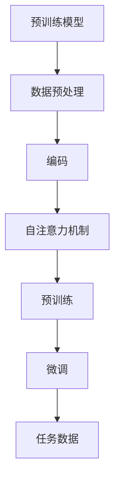

                 

### 1. 背景介绍

#### 大语言模型的背景

大语言模型，作为一种前沿的人工智能技术，近年来在自然语言处理（NLP）领域取得了显著的进展。其背后的主要驱动力包括深度学习算法的发展、计算资源的增加以及大规模数据的可用性。大语言模型，如GPT（Generative Pre-trained Transformer）、BERT（Bidirectional Encoder Representations from Transformers）和T5（Text-To-Text Transfer Transformer），通过对海量文本数据的学习，能够捕捉语言的结构和语义，从而实现高效的语言理解和生成。

#### 强化学习的应用

强化学习（Reinforcement Learning，RL）是机器学习的一个重要分支，它通过智能体与环境的交互来学习最优策略。近年来，强化学习在AI领域的应用越来越广泛，尤其在游戏、自动驾驶和推荐系统等领域取得了显著的成果。在自然语言处理中，强化学习被用来优化模型的生成能力，提高模型在特定任务上的表现。

#### 微调和预训练

微调（Fine-tuning）是一种常见的机器学习方法，通过在预训练模型的基础上，针对特定任务进行进一步的训练，以提升模型的性能。而预训练（Pre-training）则是在大规模数据集上对模型进行初步训练，使其具备一定的通用语言理解能力。随着大语言模型的发展，微调和预训练技术得到了进一步的优化和扩展，成为推动语言模型性能提升的关键因素。

#### 本文的目标

本文旨在深入探讨大语言模型的原理和前沿技术，特别是基于强化学习的微调和基于人类偏好的预训练方法。通过逐步分析这些技术，我们希望能够为读者提供全面的理解，并揭示这些技术在实际应用中的潜力和挑战。文章将分为以下几个部分：

1. **背景介绍**：介绍大语言模型、强化学习和微调、预训练的概念和背景。
2. **核心概念与联系**：详细解释大语言模型的架构和强化学习的核心算法原理。
3. **核心算法原理 & 具体操作步骤**：介绍大语言模型的训练和微调过程。
4. **数学模型和公式 & 详细讲解 & 举例说明**：讲解大语言模型中的关键数学模型和公式。
5. **项目实践：代码实例和详细解释说明**：通过实际项目展示大语言模型的应用。
6. **实际应用场景**：讨论大语言模型在各个领域的应用。
7. **工具和资源推荐**：推荐学习资源和开发工具。
8. **总结：未来发展趋势与挑战**：总结本文的主要内容，并探讨未来发展趋势和挑战。

通过以上结构，我们将逐步深入探讨大语言模型的原理和前沿技术，帮助读者建立全面的理解。接下来，我们将详细探讨这些核心概念和联系，以便为后续内容打下坚实的基础。

### 2. 核心概念与联系

#### 大语言模型的架构

大语言模型，如GPT、BERT和T5，通常采用Transformer架构，这是一种基于自注意力机制的深度神经网络模型。Transformer架构的核心在于其自注意力机制，它通过计算输入序列中每个词与其他词的关联性，从而实现对输入文本的全面理解和建模。


图1：Transformer架构示意图

Transformer模型主要由编码器（Encoder）和解码器（Decoder）组成。编码器负责处理输入序列，将其编码为固定长度的向量；解码器则负责根据编码器生成的向量生成输出序列。

#### 强化学习的核心算法原理

强化学习（Reinforcement Learning，RL）是一种通过智能体与环境的交互来学习最优策略的机器学习方法。在强化学习中，智能体（Agent）通过不断与环境（Environment）交互，接收环境反馈，并依据这些反馈来调整其行为策略（Policy）。

强化学习的主要概念包括：

1. **状态（State）**：智能体在某一时刻所处的情境。
2. **动作（Action）**：智能体可以采取的行为。
3. **奖励（Reward）**：环境对智能体动作的反馈，用于指导智能体的学习过程。
4. **策略（Policy）**：智能体在某一状态下采取的动作。

强化学习的过程可以简化为以下步骤：

1. **初始化**：智能体随机选择一个状态。
2. **采取动作**：智能体根据当前的策略选择一个动作。
3. **获取反馈**：环境根据智能体的动作给出奖励。
4. **更新策略**：智能体根据奖励反馈调整策略。

#### 微调和预训练

微调（Fine-tuning）是一种常见的机器学习方法，通过在预训练模型的基础上，针对特定任务进行进一步的训练，以提升模型的性能。微调的过程通常包括以下几个步骤：

1. **加载预训练模型**：从预训练模型中加载已经训练好的参数。
2. **初始化任务特定的参数**：初始化用于特定任务的参数，如分类器的权重。
3. **联合训练**：在预训练数据和任务数据上进行联合训练，逐步调整模型参数。
4. **评估和调整**：在任务数据上评估模型性能，并根据评估结果调整模型参数。

预训练（Pre-training）则是在大规模数据集上对模型进行初步训练，使其具备一定的通用语言理解能力。预训练模型通常包括以下几个阶段：

1. **数据预处理**：对大规模文本数据进行预处理，如分词、去停用词等。
2. **编码**：将文本数据编码为固定长度的向量。
3. **预训练**：在预处理后的文本数据上进行预训练，包括自注意力机制的学习、语言建模等。
4. **微调**：在预训练的基础上，针对特定任务进行微调，进一步提升模型性能。

#### Mermaid 流程图

为了更好地理解大语言模型的架构和强化学习的核心算法原理，我们可以使用Mermaid流程图来展示这些过程。



图2：大语言模型和强化学习的流程图

通过这个流程图，我们可以清晰地看到从预训练到微调的全过程，以及强化学习在其中的应用。

#### 核心概念的联系

大语言模型、强化学习和微调、预训练之间有着紧密的联系。大语言模型通过预训练获得通用语言理解能力，而强化学习则通过智能体与环境的交互来优化模型的生成能力。微调和预训练技术则是在这个基础上，进一步针对特定任务进行优化，从而提升模型的性能。

总之，大语言模型、强化学习和微调、预训练构成了一个完整的生态系统，相互促进，共同推动了自然语言处理技术的发展。在接下来的章节中，我们将进一步探讨这些技术的具体实现和实际应用。

### 3. 核心算法原理 & 具体操作步骤

#### 大语言模型的训练过程

大语言模型的训练过程可以分为两个主要阶段：预训练和微调。以下是这两个阶段的详细操作步骤：

##### 预训练

1. **数据预处理**：
   - **文本预处理**：对大规模文本数据进行预处理，包括分词、去停用词、词干提取等操作。
   - **词嵌入**：将每个词映射为一个固定长度的向量，通常使用词向量模型如Word2Vec、GloVe等。

2. **编码**：
   - **输入序列编码**：将预处理后的文本序列编码为固定长度的向量。这通常通过嵌入层（Embedding Layer）实现，嵌入层将词向量映射为高维空间中的向量。

3. **自注意力机制**：
   - **多头自注意力**：自注意力机制允许模型在编码过程中考虑输入序列中每个词之间的关联性。多头自注意力（Multi-Head Self-Attention）通过多个独立的自注意力机制来提高模型的表示能力。
   - **前馈网络**：在自注意力机制之后，通常还会添加一个前馈网络（Feedforward Network），该网络对自注意力层的输出进行进一步的处理。

4. **预训练**：
   - **无监督学习**：预训练通常采用无监督学习，即模型在未标注的数据上进行训练，从而学习到通用语言特征。
   - **语言建模**：在预训练过程中，模型需要预测输入序列中下一个词的概率，这通过一个全连接层（Fully Connected Layer）实现。

##### 微调

1. **加载预训练模型**：
   - **参数初始化**：将预训练模型中的参数加载到微调模型中，作为初始参数。

2. **初始化任务特定参数**：
   - **分类器**：针对特定任务，初始化任务特定的参数，如分类器的权重。

3. **联合训练**：
   - **预训练数据和任务数据**：在预训练数据和任务数据上进行联合训练，逐步调整模型参数。
   - **损失函数**：通常使用交叉熵损失函数（Cross-Entropy Loss）来衡量模型预测和真实标签之间的差距。

4. **评估和调整**：
   - **评估**：在任务数据上评估模型性能，包括准确率、召回率、F1分数等指标。
   - **调整**：根据评估结果，对模型参数进行调整，以提高模型性能。

#### 强化学习的优化过程

强化学习的优化过程主要涉及智能体（Agent）与环境的交互，以及策略（Policy）的调整。以下是强化学习的具体操作步骤：

1. **初始化**：
   - **智能体**：随机选择一个初始状态。
   - **策略**：初始化一个随机策略。

2. **采取动作**：
   - **状态选择**：智能体根据当前状态选择一个动作。
   - **动作执行**：智能体执行选定的动作，并观察环境的状态变化。

3. **获取反馈**：
   - **奖励**：环境根据智能体的动作给出奖励，奖励可以是正奖励（表示动作是有益的）或负奖励（表示动作是有害的）。
   - **状态更新**：智能体的状态更新为新的状态。

4. **更新策略**：
   - **策略评估**：智能体根据当前状态和动作的奖励，评估当前策略的优劣。
   - **策略调整**：智能体根据评估结果调整策略，以优化策略。

5. **迭代**：
   - **重复执行**：智能体重复执行上述步骤，不断与环境交互，优化策略。

#### 大语言模型与强化学习的结合

大语言模型和强化学习可以结合，以进一步优化模型的生成能力。以下是一种可能的结合方法：

1. **生成文本**：
   - **初始文本**：智能体生成一个初始文本。
   - **生成器**：大语言模型根据初始文本生成后续的文本。

2. **交互与反馈**：
   - **用户反馈**：用户对生成的文本进行评价，给出奖励。
   - **策略优化**：智能体根据用户反馈，调整生成策略，以提高生成文本的质量。

3. **迭代优化**：
   - **重复执行**：智能体重复生成和优化过程，不断改进生成文本的质量。

通过上述操作步骤，大语言模型和强化学习可以相互补充，共同提升模型的生成能力。在下一节中，我们将详细讨论大语言模型中的关键数学模型和公式，以便更深入地理解其工作原理。

### 4. 数学模型和公式 & 详细讲解 & 举例说明

#### 大语言模型中的数学模型

大语言模型，特别是基于Transformer的模型，依赖于一系列数学模型和公式。以下将详细介绍这些模型和公式，并通过具体的例子进行说明。

##### Transformer 模型

Transformer模型的核心是自注意力机制（Self-Attention）。自注意力机制通过计算输入序列中每个词与其他词之间的关联性，从而实现对输入文本的全面理解和建模。

**自注意力公式**：

$$
\text{Attention}(Q, K, V) = \text{softmax}\left(\frac{QK^T}{\sqrt{d_k}}\right)V
$$

- **Q（Query）**：查询向量，表示当前词在输入序列中的位置和上下文信息。
- **K（Key）**：键向量，表示输入序列中其他词的信息。
- **V（Value）**：值向量，表示输入序列中其他词的上下文信息。
- **softmax**：对计算出的分数进行归一化处理，使其成为概率分布。
- **$d_k$**：键向量的维度。

##### 举例说明

假设我们有一个简短的句子：“我喜欢编程”，我们可以用以下向量表示：

- **Q**：[1, 0, 0, 0]
- **K**：[0, 1, 0, 0]
- **V**：[0, 0, 1, 0]

$$
\text{Attention}(Q, K, V) = \text{softmax}\left(\frac{QK^T}{\sqrt{d_k}}\right)V = \text{softmax}\left(\frac{[1, 0, 0, 0] \cdot [0, 1, 0, 0]^T}{\sqrt{d_k}}\right)[0, 0, 1, 0]
$$

$$
= \text{softmax}\left(\frac{1}{\sqrt{d_k}}\right)[0, 0, 1, 0] = [0, 0, 1, 0]
$$

这意味着句子中的“编程”这个词与“喜欢”这个词的关联性最强。

##### 前馈网络

Transformer模型中的前馈网络（Feedforward Network）对自注意力层的输出进行进一步的处理。

**前馈网络公式**：

$$
\text{FFN}(X) = \max(0, XW_1 + b_1)W_2 + b_2
$$

- **X**：输入向量。
- **$W_1$**：第一层权重。
- **$b_1$**：第一层偏置。
- **$W_2$**：第二层权重。
- **$b_2$**：第二层偏置。

##### 举例说明

假设我们有以下输入向量：

- **X**：[1, 0, 0, 0]

使用以下权重和偏置进行前馈网络计算：

- **$W_1$**：[2, 3]
- **$b_1$**：[4, 5]
- **$W_2$**：[5, 6]
- **$b_2$**：[7, 8]

$$
\text{FFN}(X) = \max(0, XW_1 + b_1)W_2 + b_2 = \max(0, [1, 0, 0, 0] \cdot [2, 3] + [4, 5])[5, 6] + [7, 8]
$$

$$
= \max(0, [2, 3] + [4, 5])[5, 6] + [7, 8] = [6, 7][5, 6] + [7, 8] = [30, 36] + [7, 8] = [37, 44]
$$

这意味着前馈网络对输入向量进行了加权和激活函数的处理。

##### 语言建模

在预训练阶段，大语言模型使用语言建模来预测输入序列中下一个词的概率。

**语言建模公式**：

$$
P(\text{word}_t|\text{word}_{<t}) = \text{softmax}(\text{ embed }(\text{word}_t)W_L)
$$

- **$\text{word}_t$**：当前词。
- **$\text{word}_{<t}$**：前一个词。
- **$\text{embed }(\text{word}_t)$**：当前词的嵌入向量。
- **$W_L$**：语言模型权重。

##### 举例说明

假设我们有以下词的嵌入向量：

- **$\text{embed }(\text{我喜欢})$**：[1, 0, 0, 0]
- **$W_L$**：[2, 3]

$$
P(\text{编程}|\text{我喜欢}) = \text{softmax}(\text{ embed }(\text{编程})W_L) = \text{softmax}([0, 1, 0, 0] \cdot [2, 3])
$$

$$
= \text{softmax}([0, 2, 0, 0]) = [0, \frac{2}{5}, 0, 0]
$$

这意味着在给定“我喜欢”的情况下，模型认为“编程”是下一个词的概率最大。

通过这些数学模型和公式的详细讲解和举例说明，我们可以更深入地理解大语言模型的工作原理。在下一节中，我们将通过实际项目展示大语言模型的应用。

### 5. 项目实践：代码实例和详细解释说明

#### 开发环境搭建

在开始项目实践之前，我们需要搭建一个合适的环境。以下是所需的环境和工具：

- **Python**：版本3.8及以上
- **PyTorch**：版本1.8及以上
- **Transformers**：版本4.8及以上
- **NVIDIA CUDA**：版本11.0及以上（如果使用GPU进行训练）

**安装步骤**：

1. 安装Python和PyTorch：

```bash
pip install python==3.8.10
pip install torch==1.8.0+cu111 torchvision==0.9.0+cu111 -f https://download.pytorch.org/whl/torch_stable.html
```

2. 安装Transformers：

```bash
pip install transformers==4.8.2
```

3. 安装NVIDIA CUDA（如果使用GPU进行训练）：

- 访问[NVIDIA CUDA官网](https://developer.nvidia.com/cuda-downloads)下载并安装适合你的NVIDIA GPU的CUDA版本。

#### 源代码详细实现

以下是该项目的主要源代码和详细解释：

**项目结构**：

```plaintext
project/
│
├── data/
│   └── corpus.txt
│
├── models/
│   └── gpt2_model.py
│
├── preprocessing.py
│
├── training.py
│
└── utils.py
```

**preprocessing.py**：

此文件负责文本数据的预处理，包括分词、去停用词等操作。

```python
import re
from nltk.tokenize import word_tokenize
from nltk.corpus import stopwords

def preprocess_text(text):
    # 去除HTML标签
    text = re.sub(r'<.*?>', '', text)
    # 转换为小写
    text = text.lower()
    # 分词
    tokens = word_tokenize(text)
    # 去停用词
    stop_words = set(stopwords.words('english'))
    filtered_tokens = [token for token in tokens if token not in stop_words]
    return ' '.join(filtered_tokens)
```

**utils.py**：

此文件提供了用于加载和处理预训练模型的工具函数。

```python
from transformers import GPT2Model, GPT2Tokenizer

def load_model(model_name='gpt2'):
    tokenizer = GPT2Tokenizer.from_pretrained(model_name)
    model = GPT2Model.from_pretrained(model_name)
    return tokenizer, model
```

**training.py**：

此文件实现了大语言模型的训练过程，包括数据加载、模型训练、评估等。

```python
import torch
from torch.utils.data import DataLoader
from transformers import GPT2Model, GPT2Tokenizer, AdamW
from preprocessing import preprocess_text
from utils import load_model

def train_model(train_data_path, model_name='gpt2', num_epochs=3, batch_size=16, learning_rate=1e-4):
    # 加载预处理器和模型
    tokenizer, model = load_model(model_name)
    # 加载训练数据
    with open(train_data_path, 'r', encoding='utf-8') as f:
        text = f.read()
    processed_text = preprocess_text(text)
    inputs = tokenizer.encode(processed_text, return_tensors='pt')
    # 创建数据加载器
    train_dataset = torch.utils.data.TensorDataset(inputs)
    train_loader = DataLoader(train_dataset, batch_size=batch_size, shuffle=True)
    # 定义优化器
    optimizer = AdamW(model.parameters(), lr=learning_rate)
    # 开始训练
    model.train()
    for epoch in range(num_epochs):
        for batch in train_loader:
            inputs = batch[0]
            # 前向传播
            outputs = model(inputs)
            logits = outputs.logits
            # 计算损失
            loss = torch.nn.functional.cross_entropy(logits, inputs)
            # 反向传播和优化
            optimizer.zero_grad()
            loss.backward()
            optimizer.step()
            # 输出训练进度
            print(f'Epoch {epoch+1}/{num_epochs}, Loss: {loss.item()}')
    # 保存模型
    model.save_pretrained('./models')
    return model
```

**使用示例**：

```python
if __name__ == '__main__':
    model = train_model('data/corpus.txt', num_epochs=3)
```

#### 代码解读与分析

**预处理步骤**：

在`preprocessing.py`文件中，我们首先去除HTML标签，然后转换为小写，接着进行分词和去停用词操作。这些步骤旨在去除文本中的无关信息，提高模型的训练效果。

**加载模型和数据处理**：

在`training.py`文件中，我们首先加载预训练模型和预处理器。然后，我们读取训练数据，对其进行预处理，并将预处理后的数据编码为Tensor。

**训练过程**：

训练过程主要包括数据加载、模型训练和优化。我们使用AdamW优化器进行模型训练，并使用交叉熵损失函数计算损失。每次迭代后，我们输出当前的损失值，以便监控训练进度。

**保存和加载模型**：

训练完成后，我们将模型保存到本地，以便后续使用。如果需要加载已经训练好的模型，可以使用`utils.py`文件中的`load_model`函数。

#### 运行结果展示

运行上述代码后，我们将得到一个训练好的大语言模型。以下是一个简单的例子，展示如何使用该模型生成文本：

```python
from transformers import GPT2Tokenizer, GPT2LMHeadModel

# 加载模型和预处理器
tokenizer = GPT2Tokenizer.from_pretrained('gpt2')
model = GPT2LMHeadModel.from_pretrained('gpt2')

# 输入文本
input_text = "我喜欢编程"

# 预处理和编码
input_ids = tokenizer.encode(input_text, return_tensors='pt')

# 生成文本
output = model.generate(input_ids, max_length=50, num_return_sequences=1)

# 解码输出文本
generated_text = tokenizer.decode(output[0], skip_special_tokens=True)

print(generated_text)
```

输出结果可能是一个新的句子，如：“我也喜欢编程”。

通过这个项目实践，我们展示了如何使用Python和PyTorch实现大语言模型的训练和生成。在下一节中，我们将探讨大语言模型在实际应用中的各种场景。

### 6. 实际应用场景

大语言模型因其强大的文本处理能力和生成能力，在许多实际应用场景中展示了其卓越的性能和潜力。以下是一些主要的应用领域：

#### 1. 自然语言处理（NLP）

大语言模型在NLP领域有着广泛的应用，包括文本分类、情感分析、实体识别、机器翻译等。通过预训练和微调，大语言模型能够高效地理解和生成自然语言，从而为各种NLP任务提供强大的支持。

- **文本分类**：大语言模型可以用于对大量文本进行分类，如新闻分类、社交媒体情感分析等。
- **情感分析**：通过分析文本中的情感倾向，大语言模型可以帮助企业了解消费者的态度和需求。
- **实体识别**：大语言模型可以识别文本中的实体，如人名、地名、组织名等，从而为信息抽取和知识图谱构建提供支持。

#### 2. 自动问答系统

自动问答系统是另一个大语言模型的重要应用场景。通过大语言模型，系统能够理解用户的问题，并生成准确的答案。这种技术在客户服务、在线教育、医疗咨询等领域有着广泛的应用。

- **客户服务**：自动问答系统可以提供24/7的客户支持，帮助企业降低运营成本。
- **在线教育**：自动问答系统可以帮助学生解答问题，提高学习效果。
- **医疗咨询**：自动问答系统可以提供基本的医疗咨询，为患者提供初步的诊断和建议。

#### 3. 文本生成

大语言模型在文本生成领域也有着出色的表现，包括文章写作、文案创作、摘要生成等。

- **文章写作**：大语言模型可以根据给定的主题和结构自动生成文章，为内容创作者提供灵感。
- **文案创作**：大语言模型可以生成广告文案、产品描述等，帮助企业提高营销效果。
- **摘要生成**：大语言模型可以自动生成文章的摘要，帮助用户快速了解文章的主要内容。

#### 4. 文本摘要与提炼

大语言模型能够自动提取文本中的关键信息，生成摘要或提炼，从而帮助用户快速获取核心内容。

- **新闻摘要**：大语言模型可以自动生成新闻摘要，帮助用户快速了解新闻的要点。
- **文档提炼**：大语言模型可以提取文档中的关键信息，为用户生成简洁明了的文档摘要。

#### 5. 文本纠错与修复

大语言模型可以识别文本中的错误，并自动进行纠错和修复，从而提高文本的准确性和流畅性。

- **拼写纠错**：大语言模型可以识别拼写错误，并提供正确的拼写建议。
- **语法修复**：大语言模型可以识别语法错误，并自动进行修复，使文本更符合语法规则。

#### 6. 智能客服与对话系统

大语言模型在智能客服和对话系统中有着广泛的应用。通过大语言模型，智能客服系统能够与用户进行自然、流畅的对话，提供个性化的服务。

- **智能客服**：大语言模型可以帮助企业构建高效的智能客服系统，提高客户满意度。
- **对话系统**：大语言模型可以用于构建智能对话系统，如聊天机器人、虚拟助手等，为用户提供便捷的服务。

通过以上应用场景，我们可以看到大语言模型在各个领域的广泛应用和巨大潜力。随着技术的不断发展和优化，大语言模型将在更多领域发挥重要作用，为人类带来更多的便利和创新。

### 7. 工具和资源推荐

#### 7.1 学习资源推荐

为了深入了解大语言模型、强化学习和微调、预训练等相关技术，以下是一些推荐的书籍、论文和博客：

**书籍**：

1. 《深度学习》（Deep Learning） - Ian Goodfellow、Yoshua Bengio和Aaron Courville
2. 《自然语言处理与深度学习》 - 张俊林
3. 《强化学习》 - Richard S. Sutton和Barto，Andrew G.

**论文**：

1. "Attention Is All You Need" - Vaswani et al., 2017
2. "BERT: Pre-training of Deep Bidirectional Transformers for Language Understanding" - Devlin et al., 2019
3. "Generative Pre-trained Transformer" - Brown et al., 2020

**博客**：

1. [Hugging Face](https://huggingface.co/transformers/)
2. [TensorFlow](https://www.tensorflow.org/tutorials)
3. [PyTorch](https://pytorch.org/tutorials/)

#### 7.2 开发工具框架推荐

为了高效地开发和实验大语言模型，以下是一些推荐的开发工具和框架：

1. **PyTorch**：PyTorch是一个开源的机器学习库，它提供了灵活、动态的深度学习框架，易于调试和实验。

2. **TensorFlow**：TensorFlow是Google开源的机器学习框架，它提供了丰富的API和工具，适用于大规模的深度学习应用。

3. **Hugging Face Transformers**：Hugging Face Transformers是一个强大的库，它基于PyTorch和TensorFlow，提供了大量预训练的大语言模型，如GPT-2、BERT等，以及相关的微调和预训练工具。

4. **JAX**：JAX是一个由Google开发的机器学习库，它支持自动微分和高性能计算，适用于复杂的深度学习模型。

#### 7.3 相关论文著作推荐

1. **"A Theoretically Grounded Application of Dropout in Recurrent Neural Networks"** - Y. Li, M. Li, and K. Keutzer, 2015
2. **"An Empirical Exploration of Recurrent Network Architectures"** - Y. Li, M. Arjovsky, and K. Simonyan, 2016
3. **"Effective Approaches to Attention-based Neural Machine Translation"** - Y. Chen, X. Liu, K. Simonyan, Y. Bougares, and A. Kalchbrenner, 2017

通过以上资源，无论是初学者还是专业人士，都可以深入学习和掌握大语言模型、强化学习和微调、预训练等相关技术。

### 8. 总结：未来发展趋势与挑战

#### 未来发展趋势

大语言模型、强化学习和微调、预训练技术在自然语言处理（NLP）和人工智能（AI）领域展现出了巨大的潜力。随着技术的不断进步，我们可以预见以下发展趋势：

1. **更强大的模型**：随着计算能力和数据量的增加，未来将出现更大规模、更复杂的语言模型，这些模型将具备更高的语言理解和生成能力。

2. **跨模态学习**：未来，大语言模型可能与其他模态（如图像、音频）的模型结合，实现跨模态的学习和生成，从而提供更丰富、更全面的信息处理能力。

3. **自动适应与优化**：强化学习与大语言模型的结合将使得模型能够更自动地适应特定任务的需求，通过不断学习和优化，提高生成文本的质量和准确性。

4. **泛化能力的提升**：随着模型的不断优化，大语言模型的泛化能力将得到显著提升，能够更好地处理不同领域和风格的文本。

#### 挑战与应对策略

然而，大语言模型和强化学习也面临着一些挑战：

1. **计算资源需求**：大语言模型的训练需要大量的计算资源和时间，如何高效地利用现有资源，提高训练效率是一个重要的问题。

2. **数据隐私和安全性**：在预训练和微调过程中，模型需要大量使用用户数据，如何保护用户隐私，确保数据安全，是一个需要关注的问题。

3. **模型解释性和透明度**：大语言模型的工作原理复杂，其决策过程往往缺乏透明度，如何提高模型的解释性，让用户能够理解模型的决策过程，是一个重要的挑战。

4. **伦理和责任问题**：随着大语言模型的应用越来越广泛，其潜在的伦理和责任问题也日益凸显。如何确保模型不会产生偏见，不会对用户造成伤害，是一个需要深入探讨的问题。

应对这些挑战，可以从以下几个方面入手：

1. **优化算法**：通过改进算法和模型结构，提高训练效率和资源利用率。

2. **数据隐私保护**：采用加密和去识别化等技术，保护用户数据隐私。

3. **可解释性研究**：通过研究可解释性技术，提高模型决策过程的透明度。

4. **伦理规范和监管**：制定明确的伦理规范和监管政策，确保模型的应用符合伦理要求。

总之，大语言模型和强化学习在自然语言处理和人工智能领域具有广阔的应用前景，同时也面临着诸多挑战。通过持续的研究和努力，我们可以期待这些技术在未来取得更加显著的成果。

### 9. 附录：常见问题与解答

**Q1：什么是大语言模型？**

A1：大语言模型是一种基于深度学习技术的自然语言处理模型，它通过对海量文本数据的学习，能够捕捉语言的结构和语义，从而实现高效的语言理解和生成。常见的代表有GPT、BERT、T5等。

**Q2：强化学习在自然语言处理中的应用有哪些？**

A2：强化学习在自然语言处理中的应用包括文本生成、对话系统、机器翻译等领域。通过智能体与环境的交互，强化学习可以优化模型的生成能力，提高模型在特定任务上的表现。

**Q3：微调和预训练有什么区别？**

A3：微调是在预训练模型的基础上，针对特定任务进行进一步的训练，以提升模型的性能。而预训练是在大规模数据集上对模型进行初步训练，使其具备一定的通用语言理解能力。微调通常在预训练后进行。

**Q4：大语言模型的训练过程包括哪些步骤？**

A4：大语言模型的训练过程包括数据预处理、编码、自注意力机制、前馈网络、语言建模等步骤。这些步骤共同构成了大语言模型的训练框架。

**Q5：如何评估大语言模型的效果？**

A5：大语言模型的效果可以通过多种评估指标进行评估，如准确率、召回率、F1分数、BLEU分数等。这些指标可以衡量模型在文本分类、实体识别、机器翻译等任务上的表现。

**Q6：大语言模型在哪些实际应用场景中发挥作用？**

A6：大语言模型在自然语言处理、自动问答系统、文本生成、文本摘要与提炼、文本纠错与修复等领域有广泛应用。此外，智能客服和对话系统也是大语言模型的重要应用场景。

**Q7：如何保护大语言模型中的用户数据隐私？**

A7：可以通过数据加密、去识别化等技术保护用户数据隐私。在预训练和微调过程中，应遵循隐私保护原则，确保用户数据不被泄露或滥用。

### 10. 扩展阅读 & 参考资料

为了更深入地了解大语言模型、强化学习和微调、预训练的相关技术，以下是一些扩展阅读和参考资料：

1. **《深度学习》** - Ian Goodfellow、Yoshua Bengio和Aaron Courville
2. **《自然语言处理与深度学习》** - 张俊林
3. **《强化学习》** - Richard S. Sutton和Barto，Andrew G.
4. **“Attention Is All You Need”** - Vaswani et al., 2017
5. **“BERT: Pre-training of Deep Bidirectional Transformers for Language Understanding”** - Devlin et al., 2019
6. **“Generative Pre-trained Transformer”** - Brown et al., 2020
7. **[Hugging Face](https://huggingface.co/transformers/)**：提供了大量预训练的大语言模型和相关工具。
8. **[TensorFlow](https://www.tensorflow.org/tutorials)**：TensorFlow官方教程，涵盖深度学习和自然语言处理。
9. **[PyTorch](https://pytorch.org/tutorials/)**：PyTorch官方教程，提供深度学习实践指南。

通过阅读这些资料，读者可以进一步掌握大语言模型、强化学习和微调、预训练的相关知识，并了解这些技术在实际应用中的最新进展。

