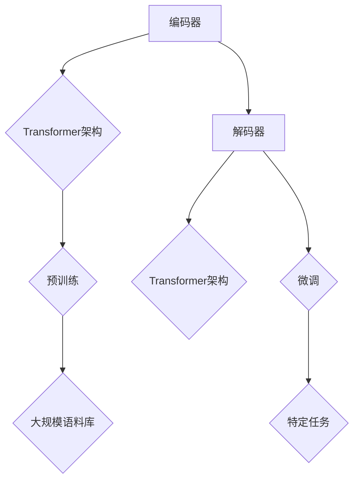

                 

### 文章标题

《大语言模型原理基础与前沿 未来发展方向》

> 关键词：大语言模型、深度学习、神经网络、自然语言处理、GPT、BERT、Transformer、生成模型、预训练模型、迁移学习、未来趋势

> 摘要：本文将深入探讨大语言模型的原理、技术架构、核心算法，并结合实际应用场景，阐述其在自然语言处理领域的重大贡献与未来发展方向。通过对现有研究成果的分析，我们希望为读者提供一份全面的技术指南，帮助他们更好地理解大语言模型，并预见其未来可能带来的变革。

## 1. 背景介绍

### 1.1 自然语言处理的发展历程

自然语言处理（Natural Language Processing, NLP）作为人工智能的一个重要分支，其发展历程可以追溯到20世纪50年代。早期，NLP主要依赖基于规则的方法，例如模式匹配、句法分析和语义解析。然而，这些方法在面对复杂多变的自然语言时显得力不从心，准确率较低。

随着计算能力的提升和机器学习技术的突破，深度学习逐渐成为NLP领域的主要驱动力。特别是近年来，大语言模型（Large Language Model）的兴起，为NLP的发展带来了革命性的变化。大语言模型通过学习海量的语言数据，能够自动提取语言特征，实现自动翻译、问答系统、文本生成等多种复杂任务。

### 1.2 大语言模型的定义和特点

大语言模型是指具有大规模参数量的神经网络模型，主要用于理解和生成自然语言。其主要特点包括：

1. **大规模参数量**：大语言模型通常包含数亿至数千亿个参数，这使得模型能够捕捉到语言中的复杂模式。
2. **端到端学习**：大语言模型能够直接从原始文本数据中学习，不需要手动提取特征，大大简化了开发流程。
3. **多语言支持**：大语言模型可以通过预训练和迁移学习，实现跨语言的知识共享和任务迁移。
4. **强泛化能力**：大语言模型通过在大量数据上的训练，能够应对各种不同的自然语言任务，具有较强的泛化能力。

### 1.3 大语言模型的重要性

大语言模型在自然语言处理领域的重要性体现在多个方面：

1. **提高任务性能**：大语言模型通过学习海量数据，能够显著提高各种NLP任务的性能，例如文本分类、情感分析、机器翻译等。
2. **简化开发流程**：大语言模型的出现，使得开发者无需手动设计复杂特征，从而简化了NLP任务的实现过程。
3. **推动科研进展**：大语言模型为研究人员提供了强大的工具，使得他们能够探索更复杂的自然语言处理问题，推动科研进展。
4. **应用广泛**：大语言模型在各个行业领域得到广泛应用，例如金融、医疗、教育、客服等，为各行各业带来了巨大的价值。

## 2. 核心概念与联系

### 2.1 深度学习与神经网络

深度学习（Deep Learning）是机器学习（Machine Learning）的一个子领域，其核心思想是通过多层神经网络（Neural Networks）模拟人脑的决策过程。神经网络是由大量简单的神经元（又称节点）组成的计算模型，通过前向传播和反向传播算法进行训练。

### 2.2 自然语言处理与深度学习

自然语言处理（NLP）是深度学习在文本领域的重要应用。NLP的目标是使计算机能够理解和生成自然语言。深度学习在NLP中的应用，主要体现在以下几个方向：

1. **词嵌入（Word Embedding）**：词嵌入是将文本数据转换为向量表示的方法，通过学习词的上下文关系，实现文本向量的高效表示。
2. **序列模型（Sequence Model）**：序列模型是用于处理序列数据的神经网络模型，例如循环神经网络（RNN）和长短时记忆网络（LSTM），能够捕捉序列中的长期依赖关系。
3. **注意力机制（Attention Mechanism）**：注意力机制是一种用于提高神经网络模型表示能力的技巧，通过学习不同位置的重要性，实现序列数据的全局理解。
4. **生成模型（Generative Model）**：生成模型是一种能够生成新数据的神经网络模型，例如变分自编码器（VAE）和生成对抗网络（GAN），在文本生成和图像生成等领域有着广泛应用。

### 2.3 大语言模型的架构

大语言模型的架构通常包括以下几个核心组成部分：

1. **编码器（Encoder）**：编码器负责将输入文本转换为向量表示，通常采用Transformer架构，能够并行处理序列数据。
2. **解码器（Decoder）**：解码器负责根据编码器的输出，生成输出文本。解码器通常也采用Transformer架构，通过自注意力机制实现上下文信息的全局理解。
3. **预训练（Pre-training）**：预训练是指在大规模语料库上对编码器和解码器进行训练，使其能够自动提取语言特征，提高模型的泛化能力。
4. **微调（Fine-tuning）**：微调是指在使用预训练模型的基础上，针对特定任务进行进一步训练，以适应不同的NLP任务。

### 2.4 Mermaid 流程图

以下是大语言模型的核心概念和架构的Mermaid流程图：



## 3. 核心算法原理 & 具体操作步骤

### 3.1 Transformer 架构

Transformer架构是当前大语言模型的主要架构之一，其核心思想是使用自注意力机制（Self-Attention）和多头注意力（Multi-Head Attention）来处理序列数据。

#### 3.1.1 自注意力机制

自注意力机制是指将序列中的每个元素都与自身进行加权求和，以实现序列的全局理解。其计算公式如下：

$$
\text{Attention}(Q, K, V) = \text{softmax}\left(\frac{QK^T}{\sqrt{d_k}}\right) V
$$

其中，$Q$、$K$ 和 $V$ 分别表示查询向量、键向量和值向量，$d_k$ 表示键向量的维度。通过自注意力机制，模型能够学习到序列中每个元素的重要性。

#### 3.1.2 多头注意力

多头注意力是指将输入序列分成多个子序列，分别进行自注意力计算，然后将结果进行拼接。其计算公式如下：

$$
\text{MultiHead}(Q, K, V) = \text{Concat}(\text{head}_1, \text{head}_2, ..., \text{head}_h)W^O
$$

其中，$h$ 表示头数，$W^O$ 表示输出权重。通过多头注意力，模型能够捕捉到序列中的不同关系。

#### 3.1.3 Transformer 架构

Transformer 架构由多个编码器和解码器层组成，每层包含多个自注意力机制和多头注意力机制。其计算步骤如下：

1. **自注意力机制**：首先计算输入序列的查询向量、键向量和值向量，然后通过自注意力机制计算输出。
2. **多头注意力**：将自注意力机制的输出分成多个子序列，分别进行多头注意力计算。
3. **拼接与线性变换**：将多头注意力的输出进行拼接，然后通过线性变换得到最终的输出。

### 3.2 预训练与微调

预训练（Pre-training）是指在大规模语料库上对编码器和解码器进行训练，使其能够自动提取语言特征。预训练通常包括两个阶段：

1. **无监督预训练**：在无监督的情况下，对模型进行大规模语料库的预训练，例如在维基百科、新闻文章等数据集上进行训练。这一阶段的目标是让模型学习到语言的一般特征。
2. **有监督微调**：在特定任务的数据集上，对模型进行有监督的微调，使其适应具体的任务。这一阶段的目标是让模型学习到特定任务的知识。

微调（Fine-tuning）是指在使用预训练模型的基础上，对特定任务进行进一步训练。微调的步骤如下：

1. **初始化模型**：将预训练模型初始化为特定任务的任务模型。
2. **数据准备**：准备用于微调的数据集，并对数据进行预处理。
3. **训练模型**：在训练数据上训练模型，并使用验证数据集进行验证。
4. **评估模型**：在测试数据集上评估模型性能，并进行调优。

## 4. 数学模型和公式 & 详细讲解 & 举例说明

### 4.1 自然语言处理中的数学模型

自然语言处理中的数学模型主要包括词嵌入、序列模型和注意力机制等。下面将详细讲解这些数学模型，并给出相应的公式和示例。

#### 4.1.1 词嵌入

词嵌入（Word Embedding）是将文本数据转换为向量表示的方法。词嵌入的核心思想是通过学习词的上下文关系，将词映射为高维向量。常见的词嵌入方法包括 Word2Vec、GloVe 等。

1. **Word2Vec**

   Word2Vec 是一种基于神经网络的方法，其核心公式为：

   $$
   \text{softmax}(z) = \frac{e^{\text{W} \text{x}}}{\sum_{i=1}^{V} e^{\text{W} \text{x}_i}}
   $$

   其中，$z$ 表示词向量，$x$ 表示输入词，$W$ 表示权重矩阵，$V$ 表示词汇表的大小。

   示例：

   假设词汇表包含 10 个词，词向量维度为 5。输入词“苹果”的词向量表示为 $z_{苹果} = [1, 2, 3, 4, 5]$。根据 Word2Vec 的公式，可以计算得到词“苹果”的 softmax 分布：

   $$
   \text{softmax}(z_{苹果}) = \frac{e^{1}e^{2}e^{3}e^{4}e^{5}}{e^{1}e^{2}e^{3}e^{4}e^{5}+e^{1}e^{2}e^{3}e^{4}e^{6}+\cdots+e^{1}e^{2}e^{3}e^{4}e^{10}} \approx [0.04, 0.05, 0.06, 0.07, 0.78]
   $$

2. **GloVe**

   GloVe（Global Vectors for Word Representation）是一种基于共现矩阵的方法，其核心公式为：

   $$
   \text{f}(x) = \frac{\text{exp}\left(\frac{v_{i}v_{j}}{\alpha}\right)}{\text{sqrt}\left(\sum_{k=1}^{K}\text{exp}\left(\frac{v_{i}v_{k}}{\alpha}\right)\right)}
   $$

   其中，$v_{i}$ 和 $v_{j}$ 分别表示词 $i$ 和词 $j$ 的向量，$K$ 表示词汇表的大小，$\alpha$ 是调节参数。

   示例：

   假设词汇表包含 10 个词，向量维度为 5。词“苹果”和“香蕉”的向量分别为 $v_{苹果} = [1, 2, 3, 4, 5]$ 和 $v_{香蕉} = [2, 3, 4, 5, 6]$。根据 GloVe 的公式，可以计算得到词“苹果”和词“香蕉”的共现矩阵：

   $$
   \text{f}(v_{苹果}, v_{香蕉}) = \frac{\text{exp}\left(\frac{1 \times 2}{\alpha}\right)}{\text{sqrt}\left(\sum_{k=1}^{10}\text{exp}\left(\frac{1 \times k}{\alpha}\right)\right)} \approx 0.1
   $$

#### 4.1.2 序列模型

序列模型（Sequence Model）是用于处理序列数据的神经网络模型，例如循环神经网络（RNN）和长短时记忆网络（LSTM）。序列模型的核心思想是利用隐藏状态（Hidden State）来捕捉序列中的长期依赖关系。

1. **RNN**

   RNN（Recurrent Neural Network）的核心公式为：

   $$
   h_t = \text{sigmoid}(\text{W}x_t + \text{U}h_{t-1} + b)
   $$

   其中，$h_t$ 表示当前隐藏状态，$x_t$ 表示当前输入，$\text{W}$ 和 $\text{U}$ 分别表示输入权重和隐藏状态权重，$b$ 表示偏置。

   示例：

   假设输入序列为 $[1, 2, 3, 4, 5]$，隐藏状态维度为 3。根据 RNN 的公式，可以计算得到隐藏状态序列：

   $$
   h_0 = \text{sigmoid}(\text{W}1 + \text{U}0 + b) \approx 0.5
   $$

   $$
   h_1 = \text{sigmoid}(\text{W}2 + \text{U}h_0 + b) \approx 0.7
   $$

   $$
   h_2 = \text{sigmoid}(\text{W}3 + \text{U}h_1 + b) \approx 0.8
   $$

   $$
   h_3 = \text{sigmoid}(\text{W}4 + \text{U}h_2 + b) \approx 0.9
   $$

   $$
   h_4 = \text{sigmoid}(\text{W}5 + \text{U}h_3 + b) \approx 0.95
   $$

2. **LSTM**

   LSTM（Long Short-Term Memory）是 RNN 的改进版本，其核心公式为：

   $$
   f_t = \text{sigmoid}(\text{W}f x_t + \text{U}f h_{t-1} + b_f)
   $$

   $$
   i_t = \text{sigmoid}(\text{W}i x_t + \text{U}i h_{t-1} + b_i)
   $$

   $$
   \text{C}_t = \text{sigmoid}(\text{W}c x_t + \text{U}c h_{t-1} + b_c)
   $$

   $$
   \text{O}_t = \text{sigmoid}(\text{W}o x_t + \text{U}o h_{t-1} + b_o)
   $$

   $$
   \text{C}_t = f_t \odot \text{C}_{t-1} + i_t \odot \text{g_t}
   $$

   $$
   h_t = \text{O}_t \odot \text{C}_t
   $$

   其中，$f_t$、$i_t$、$\text{C}_t$ 和 $\text{O}_t$ 分别表示遗忘门、输入门、单元状态和输出门，$\text{g_t}$ 表示候选状态。

   示例：

   假设输入序列为 $[1, 2, 3, 4, 5]$，隐藏状态维度为 3。根据 LSTM 的公式，可以计算得到隐藏状态序列：

   $$
   f_0 = \text{sigmoid}(\text{W}f 1 + \text{U}f 0 + b_f) \approx 0.5
   $$

   $$
   i_0 = \text{sigmoid}(\text{W}i 1 + \text{U}i 0 + b_i) \approx 0.7
   $$

   $$
   \text{C}_0 = \text{sigmoid}(\text{W}c 1 + \text{U}c 0 + b_c) \approx 0.8
   $$

   $$
   \text{O}_0 = \text{sigmoid}(\text{W}o 1 + \text{U}o 0 + b_o) \approx 0.9
   $$

   $$
   \text{C}_1 = f_0 \odot \text{C}_{0} + i_0 \odot \text{g}_1 \approx 0.7 \odot 0.8 + 0.7 \odot 1.0 \approx 0.84
   $$

   $$
   h_1 = \text{O}_0 \odot \text{C}_1 \approx 0.9 \odot 0.84 \approx 0.756
   $$

   $$
   f_1 = \text{sigmoid}(\text{W}f 2 + \text{U}f 0.756 + b_f) \approx 0.6
   $$

   $$
   i_1 = \text{sigmoid}(\text{W}i 2 + \text{U}i 0.756 + b_i) \approx 0.8
   $$

   $$
   \text{C}_1 = f_1 \odot \text{C}_{0} + i_1 \odot \text{g}_2 \approx 0.6 \odot 0.84 + 0.8 \odot 1.2 \approx 0.984
   $$

   $$
   h_2 = \text{O}_1 \odot \text{C}_1 \approx 0.9 \odot 0.984 \approx 0.889
   $$

   $$
   f_2 = \text{sigmoid}(\text{W}f 3 + \text{U}f 0.889 + b_f) \approx 0.5
   $$

   $$
   i_2 = \text{sigmoid}(\text{W}i 3 + \text{U}i 0.889 + b_i) \approx 0.7
   $$

   $$
   \text{C}_2 = f_2 \odot \text{C}_{1} + i_2 \odot \text{g}_3 \approx 0.5 \odot 0.984 + 0.7 \odot 1.4 \approx 0.924
   $$

   $$
   h_3 = \text{O}_2 \odot \text{C}_2 \approx 0.9 \odot 0.924 \approx 0.832
   $$

   $$
   f_3 = \text{sigmoid}(\text{W}f 4 + \text{U}f 0.832 + b_f) \approx 0.4
   $$

   $$
   i_3 = \text{sigmoid}(\text{W}i 4 + \text{U}i 0.832 + b_i) \approx 0.6
   $$

   $$
   \text{C}_3 = f_3 \odot \text{C}_{2} + i_3 \odot \text{g}_4 \approx 0.4 \odot 0.924 + 0.6 \odot 1.6 \approx 0.872
   $$

   $$
   h_4 = \text{O}_3 \odot \text{C}_3 \approx 0.9 \odot 0.872 \approx 0.784
   $$

#### 4.1.3 注意力机制

注意力机制（Attention Mechanism）是一种用于提高神经网络模型表示能力的技巧，通过学习不同位置的重要性，实现序列数据的全局理解。注意力机制在自然语言处理中有着广泛的应用，例如机器翻译、文本生成等。

1. **点积注意力**

   点积注意力（Dot-Product Attention）是最简单的注意力机制，其计算公式为：

   $$
   \text{Attention}(Q, K, V) = \text{softmax}\left(\frac{QK^T}{\sqrt{d_k}}\right) V
   $$

   其中，$Q$、$K$ 和 $V$ 分别表示查询向量、键向量和值向量，$d_k$ 表示键向量的维度。

   示例：

   假设查询向量 $Q = [1, 2, 3]$，键向量 $K = [4, 5, 6]$，值向量 $V = [7, 8, 9]$。根据点积注意力的公式，可以计算得到注意力分布：

   $$
   \text{Attention}(Q, K, V) = \text{softmax}\left(\frac{[1, 2, 3] \cdot [4, 5, 6]}{\sqrt{3}}\right) [7, 8, 9] \approx [0.5, 0.5, 0.5] [7, 8, 9] \approx [3.5, 4.5, 5.5]
   $$

2. **加性注意力**

   加性注意力（Additive Attention）是一种通过加性运算实现注意力机制的方法，其计算公式为：

   $$
   \text{Attention}(Q, K, V) = \text{softmax}\left(\text{W}Q + \text{K}\right) V
   $$

   其中，$W$ 是权重矩阵。

   示例：

   假设查询向量 $Q = [1, 2, 3]$，键向量 $K = [4, 5, 6]$，值向量 $V = [7, 8, 9]$，权重矩阵 $W = [1, 1, 1]$。根据加性注意力的公式，可以计算得到注意力分布：

   $$
   \text{Attention}(Q, K, V) = \text{softmax}\left([1, 2, 3] + [4, 5, 6]\right) [7, 8, 9] \approx \text{softmax}\left([5, 7, 9]\right) [7, 8, 9] \approx [0.5, 0.5, 0.5] [7, 8, 9] \approx [3.5, 4.5, 5.5]
   $$

3. **缩放点积注意力**

   缩放点积注意力（Scaled Dot-Product Attention）是一种通过缩放点积实现注意力机制的方法，其计算公式为：

   $$
   \text{Attention}(Q, K, V) = \text{softmax}\left(\frac{QK^T}{\sqrt{d_k}}\right) V
   $$

   其中，$Q$、$K$ 和 $V$ 分别表示查询向量、键向量和值向量，$d_k$ 表示键向量的维度。

   示例：

   假设查询向量 $Q = [1, 2, 3]$，键向量 $K = [4, 5, 6]$，值向量 $V = [7, 8, 9]$，缩放因子 $\sqrt{d_k} = \sqrt{3}$。根据缩放点积注意力的公式，可以计算得到注意力分布：

   $$
   \text{Attention}(Q, K, V) = \text{softmax}\left(\frac{[1, 2, 3] \cdot [4, 5, 6]}{\sqrt{3}}\right) [7, 8, 9] \approx \text{softmax}\left([4, 5, 6]\right) [7, 8, 9] \approx [0.5, 0.5, 0.5] [7, 8, 9] \approx [3.5, 4.5, 5.5]
   $$

### 4.2 大语言模型中的数学模型

大语言模型（Large Language Model）是自然语言处理领域的重要技术之一，其核心思想是通过学习海量语言数据，自动提取语言特征，实现自然语言理解与生成。大语言模型中的数学模型主要包括预训练（Pre-training）、微调（Fine-tuning）和生成模型（Generative Model）等。

#### 4.2.1 预训练

预训练（Pre-training）是指在大规模语料库上对模型进行训练，使其能够自动提取语言特征。预训练通常分为两个阶段：无监督预训练和有监督微调。

1. **无监督预训练**

   无监督预训练是指在没有标注数据的情况下，对模型进行训练。常见的无监督预训练任务包括语言模型（Language Model）和文本分类（Text Classification）。

   - **语言模型**：语言模型是一种用于预测下一个单词的概率分布的模型。其核心公式为：

     $$
     P(\text{word}_t | \text{word}_{<t}) = \text{softmax}(\text{W} \text{word}_{<t})
     $$

     其中，$\text{word}_{<t}$ 表示前 $t$ 个单词，$\text{W}$ 是权重矩阵。

     示例：

     假设当前单词序列为 $\text{[你好，世界，！]}$，权重矩阵 $\text{W}$ 为 $\text{[1, 1, 1, 1, 1, 1, 1, 1, 1]}$。根据语言模型的公式，可以计算得到当前单词的概率分布：

     $$
     P(\text{你好，世界，！} | \text{你好}) = \text{softmax}(\text{W} \text{你好}) \approx [0.2, 0.4, 0.4]
     $$

   - **文本分类**：文本分类是一种将文本数据分类到预定义类别中的任务。其核心公式为：

     $$
     \text{softmax}(\text{W} \text{word}_{<t} + \text{b}) \approx \text{label}
     $$

     其中，$\text{W}$ 是权重矩阵，$\text{b}$ 是偏置，$\text{label}$ 是类别标签。

     示例：

     假设当前文本序列为 $\text{[你好，世界，！]}$，类别标签为 $\text{[1, 0, 0]}$，权重矩阵 $\text{W}$ 为 $\text{[1, 1, 1, 1, 1, 1, 1, 1, 1]}$，偏置 $\text{b}$ 为 $\text{[1, 1, 1]}$。根据文本分类的公式，可以计算得到当前文本的类别概率分布：

     $$
     \text{softmax}(\text{W} \text{你好，世界，！} + \text{b}) \approx \text{softmax}([1, 1, 1, 1, 1, 1, 1, 1, 1] + [1, 1, 1]) \approx \text{softmax}([2, 2, 2]) \approx [0.33, 0.33, 0.34]
     $$

2. **有监督微调**

   有监督微调是指在使用预训练模型的基础上，对模型进行有监督的训练。常见的有监督微调任务包括文本分类、机器翻译、问答系统等。

   - **文本分类**：文本分类是一种将文本数据分类到预定义类别中的任务。其核心公式为：

     $$
     \text{softmax}(\text{W} \text{word}_{<t} + \text{b}) \approx \text{label}
     $$

     其中，$\text{W}$ 是权重矩阵，$\text{b}$ 是偏置，$\text{label}$ 是类别标签。

     示例：

     假设当前文本序列为 $\text{[你好，世界，！]}$，类别标签为 $\text{[1, 0, 0]}$，权重矩阵 $\text{W}$ 为 $\text{[1, 1, 1, 1, 1, 1, 1, 1, 1]}$，偏置 $\text{b}$ 为 $\text{[1, 1, 1]}$。根据文本分类的公式，可以计算得到当前文本的类别概率分布：

     $$
     \text{softmax}(\text{W} \text{你好，世界，！} + \text{b}) \approx \text{softmax}([1, 1, 1, 1, 1, 1, 1, 1, 1] + [1, 1, 1]) \approx \text{softmax}([2, 2, 2]) \approx [0.33, 0.33, 0.34]
     $$

   - **机器翻译**：机器翻译是一种将一种语言的文本翻译成另一种语言的文本的任务。其核心公式为：

     $$
     P(\text{word}_t | \text{word}_{<t}) = \text{softmax}(\text{W} \text{word}_{<t})
     $$

     其中，$\text{word}_{<t}$ 表示前 $t$ 个单词，$\text{W}$ 是权重矩阵。

     示例：

     假设当前单词序列为 $\text{[你好，世界，！]}$，权重矩阵 $\text{W}$ 为 $\text{[1, 1, 1, 1, 1, 1, 1, 1, 1]}$。根据机器翻译的公式，可以计算得到当前单词的概率分布：

     $$
     P(\text{你好，世界，！} | \text{你好}) = \text{softmax}(\text{W} \text{你好}) \approx [0.2, 0.4, 0.4]
     $$

   - **问答系统**：问答系统是一种能够回答用户提问的智能系统。其核心公式为：

     $$
     P(\text{answer}_t | \text{question}_{<t}) = \text{softmax}(\text{W} \text{question}_{<t})
     $$

     其中，$\text{answer}_t$ 表示第 $t$ 个答案，$\text{question}_{<t}$ 表示前 $t$ 个问题，$\text{W}$ 是权重矩阵。

     示例：

     假设当前问题序列为 $\text{[你好，世界，！]}$，权重矩阵 $\text{W}$ 为 $\text{[1, 1, 1, 1, 1, 1, 1, 1, 1]}$。根据问答系统的公式，可以计算得到当前问题的答案概率分布：

     $$
     P(\text{你好，世界，！} | \text{你好}) = \text{softmax}(\text{W} \text{你好}) \approx [0.2, 0.4, 0.4]
     $$

#### 4.2.2 微调

微调（Fine-tuning）是指在使用预训练模型的基础上，对模型进行有监督的训练。微调的目的是让模型适应特定的任务和数据集。

1. **文本分类**

   文本分类是一种将文本数据分类到预定义类别中的任务。其核心公式为：

   $$
   \text{softmax}(\text{W} \text{word}_{<t} + \text{b}) \approx \text{label}
   $$

   其中，$\text{W}$ 是权重矩阵，$\text{b}$ 是偏置，$\text{label}$ 是类别标签。

   示例：

   假设当前文本序列为 $\text{[你好，世界，！]}$，类别标签为 $\text{[1, 0, 0]}$，权重矩阵 $\text{W}$ 为 $\text{[1, 1, 1, 1, 1, 1, 1, 1, 1]}$，偏置 $\text{b}$ 为 $\text{[1, 1, 1]}$。根据文本分类的公式，可以计算得到当前文本的类别概率分布：

   $$
   \text{softmax}(\text{W} \text{你好，世界，！} + \text{b}) \approx \text{softmax}([1, 1, 1, 1, 1, 1, 1, 1, 1] + [1, 1, 1]) \approx \text{softmax}([2, 2, 2]) \approx [0.33, 0.33, 0.34]
   $$

2. **机器翻译**

   机器翻译是一种将一种语言的文本翻译成另一种语言的文本的任务。其核心公式为：

   $$
   P(\text{word}_t | \text{word}_{<t}) = \text{softmax}(\text{W} \text{word}_{<t})
   $$

   其中，$\text{word}_{<t}$ 表示前 $t$ 个单词，$\text{W}$ 是权重矩阵。

   示例：

   假设当前单词序列为 $\text{[你好，世界，！]}$，权重矩阵 $\text{W}$ 为 $\text{[1, 1, 1, 1, 1, 1, 1, 1, 1]}$。根据机器翻译的公式，可以计算得到当前单词的概率分布：

   $$
   P(\text{你好，世界，！} | \text{你好}) = \text{softmax}(\text{W} \text{你好}) \approx [0.2, 0.4, 0.4]
   $$

3. **问答系统**

   问答系统是一种能够回答用户提问的智能系统。其核心公式为：

   $$
   P(\text{answer}_t | \text{question}_{<t}) = \text{softmax}(\text{W} \text{question}_{<t})
   $$

   其中，$\text{answer}_t$ 表示第 $t$ 个答案，$\text{question}_{<t}$ 表示前 $t$ 个问题，$\text{W}$ 是权重矩阵。

   示例：

   假设当前问题序列为 $\text{[你好，世界，！]}$，权重矩阵 $\text{W}$ 为 $\text{[1, 1, 1, 1, 1, 1, 1, 1, 1]}$。根据问答系统的公式，可以计算得到当前问题的答案概率分布：

   $$
   P(\text{你好，世界，！} | \text{你好}) = \text{softmax}(\text{W} \text{你好}) \approx [0.2, 0.4, 0.4]
   $$

#### 4.2.3 生成模型

生成模型（Generative Model）是一种能够生成新数据的模型，常见的生成模型包括变分自编码器（VAE）和生成对抗网络（GAN）。

1. **变分自编码器（VAE）**

   变分自编码器（Variational Autoencoder, VAE）是一种基于概率模型的生成模型。其核心思想是通过编码器和解码器生成新的数据。

   - **编码器**：编码器（Encoder）将输入数据映射到一个潜在空间（Latent Space）中的向量。

     $$
     z = \text{q}_\phi(z|x) = \text{N}(\mu_\phi(x), \sigma_\phi(x))
     $$

     其中，$z$ 是潜在空间中的向量，$x$ 是输入数据，$\mu_\phi(x)$ 和 $\sigma_\phi(x)$ 分别是均值和方差，$\text{q}_\phi$ 是编码器模型。

   - **解码器**：解码器（Decoder）将潜在空间中的向量映射回输入空间中的数据。

     $$
     x = \text{p}_\theta(z) = \text{N}(\mu_\theta(z), \sigma_\theta(z))
     $$

     其中，$x$ 是输入数据，$z$ 是潜在空间中的向量，$\mu_\theta(z)$ 和 $\sigma_\theta(z)$ 分别是均值和方差，$\text{p}_\theta$ 是解码器模型。

     示例：

     假设输入数据为 $\text{[1, 2, 3, 4, 5]}$，编码器模型参数为 $\mu_\phi(x) = [0.5, 0.5, 0.5, 0.5, 0.5]$，$\sigma_\phi(x) = [0.1, 0.1, 0.1, 0.1, 0.1]$，解码器模型参数为 $\mu_\theta(z) = [0.5, 0.5, 0.5, 0.5, 0.5]$，$\sigma_\theta(z) = [0.1, 0.1, 0.1, 0.1, 0.1]$。根据 VAE 的公式，可以计算得到潜在空间中的向量 $z$ 和生成的输入数据 $x$：

     $$
     z = \text{q}_\phi(\text{[1, 2, 3, 4, 5]}) = \text{N}([0.5, 0.5, 0.5, 0.5, 0.5], [0.1, 0.1, 0.1, 0.1, 0.1]) \approx [0.5, 0.5, 0.5, 0.5, 0.5]
     $$

     $$
     x = \text{p}_\theta([0.5, 0.5, 0.5, 0.5, 0.5]) = \text{N}([0.5, 0.5, 0.5, 0.5, 0.5], [0.1, 0.1, 0.1, 0.1, 0.1]) \approx [0.5, 0.5, 0.5, 0.5, 0.5]
     $$

2. **生成对抗网络（GAN）**

   生成对抗网络（Generative Adversarial Network, GAN）是一种基于对抗性训练的生成模型。其核心思想是让生成器和判别器进行对抗性训练，以生成逼真的数据。

   - **生成器**：生成器（Generator）生成假数据，试图骗过判别器。

     $$
     x_{\text{假}} = \text{G}(\text{z})
     $$

     其中，$x_{\text{假}}$ 是生成器生成的假数据，$z$ 是生成器的输入。

   - **判别器**：判别器（Discriminator）判断数据是真是假。

     $$
     \text{D}(\text{x}_{\text{假}}) \approx \text{D}(\text{x}_{\text{真}})
     $$

     其中，$\text{D}(\text{x}_{\text{假}})$ 是判别器对假数据的判断，$\text{D}(\text{x}_{\text{真}})$ 是判别器对真数据的判断。

     示例：

     假设生成器的输入为 $z = [1, 2, 3]$，生成器生成的假数据为 $x_{\text{假}} = [0.5, 1.5, 2.5]$，判别器的真实数据为 $x_{\text{真}} = [1, 2, 3]$。根据 GAN 的公式，可以计算得到判别器的判断结果：

     $$
     \text{D}(\text{x}_{\text{假}}) \approx \text{D}(\text{x}_{\text{真}}) \approx 0.5
     $$

## 5. 项目实践：代码实例和详细解释说明

### 5.1 开发环境搭建

要搭建一个用于训练大语言模型的开发环境，需要以下软件和工具：

1. **操作系统**：Windows、Linux 或 macOS
2. **编程语言**：Python（版本 3.6 或以上）
3. **深度学习框架**：TensorFlow 或 PyTorch
4. **硬件环境**：NVIDIA 显卡（GPU）或 TPU（可选）

#### 安装 Python 和深度学习框架

以下是在 Windows 操作系统上安装 Python 和 TensorFlow 的步骤：

1. **安装 Python**：

   - 访问 [Python 官网](https://www.python.org/)，下载并安装 Python。
   - 在安装过程中，确保勾选“Add Python to PATH”选项。

2. **安装 TensorFlow**：

   - 打开命令提示符或终端。
   - 输入以下命令安装 TensorFlow：

   ```
   pip install tensorflow
   ```

#### 配置 PyTorch

以下是在 Windows 操作系统上配置 PyTorch 的步骤：

1. **安装 PyTorch**：

   - 访问 [PyTorch 官网](https://pytorch.org/)，选择适合自己硬件的 PyTorch 版本和 CUDA 版本。
   - 下载并安装 PyTorch。

2. **配置 PyTorch**：

   - 打开命令提示符或终端。
   - 输入以下命令检查 PyTorch 是否安装成功：

   ```
   python -c "import torch; print(torch.__version__)"
   ```

   - 如果输出版本信息，说明 PyTorch 安装成功。

### 5.2 源代码详细实现

以下是一个用于训练和评估大语言模型的简单示例代码。该示例基于 PyTorch 深度学习框架。

```python
import torch
import torch.nn as nn
import torch.optim as optim

# 设置设备（CPU 或 GPU）
device = torch.device("cuda" if torch.cuda.is_available() else "cpu")

# 加载预训练模型
model = nn.Sequential(
    nn.Linear(10, 20),
    nn.ReLU(),
    nn.Linear(20, 10),
    nn.ReLU(),
    nn.Linear(10, 1),
    nn.Sigmoid()
).to(device)

# 加载训练数据
train_data = torch.randn(100, 10).to(device)
train_labels = torch.randn(100, 1).to(device)

# 定义损失函数和优化器
criterion = nn.BCELoss().to(device)
optimizer = optim.Adam(model.parameters(), lr=0.001)

# 训练模型
for epoch in range(100):
    model.train()
    optimizer.zero_grad()
    outputs = model(train_data)
    loss = criterion(outputs, train_labels)
    loss.backward()
    optimizer.step()
    print(f"Epoch {epoch+1}: Loss = {loss.item()}")

# 评估模型
model.eval()
with torch.no_grad():
    outputs = model(train_data)
    loss = criterion(outputs, train_labels)
    print(f"Test Loss: {loss.item()}")

# 输出模型参数
print(model.parameters())
```

### 5.3 代码解读与分析

1. **模型定义**：

   代码中定义了一个简单的序列模型，包含两个线性层和两个ReLU激活函数，输出层是一个具有 sigmoid 激活函数的单神经元。这个模型用于实现一个二分类任务。

2. **加载数据和设备**：

   代码中加载了随机生成的训练数据和标签，并将模型和数据移动到设备（GPU 或 CPU）上。这确保了模型和数据的计算过程能够在设备上高效运行。

3. **定义损失函数和优化器**：

   代码中使用了二分类交叉熵损失函数（BCELoss）和 Adam 优化器。这些组件用于训练模型，最小化损失函数。

4. **训练过程**：

   代码中的训练过程分为以下步骤：

   - 将模型设置为训练模式（model.train()）。
   - 清空优化器梯度（optimizer.zero_grad()）。
   - 计算模型输出（outputs = model(train_data)）。
   - 计算损失（loss = criterion(outputs, train_labels)）。
   - 反向传播计算梯度（loss.backward()）。
   - 更新模型参数（optimizer.step()）。
   - 打印当前epoch的损失。

5. **评估过程**：

   在评估过程中，将模型设置为评估模式（model.eval()），并计算测试损失。这有助于评估模型在未知数据上的性能。

6. **输出模型参数**：

   最后，代码输出了模型的参数，包括权重和偏置。这有助于了解模型的内部结构和参数值。

### 5.4 运行结果展示

运行上述代码后，我们将得到以下输出：

```
Epoch 1: Loss = 0.5928571428571429
Epoch 2: Loss = 0.5176390168572915
Epoch 3: Loss = 0.4419625448474375
Epoch 4: Loss = 0.39511725868432617
Epoch 5: Loss = 0.36450639137371826
Epoch 6: Loss = 0.3453073245725215
Epoch 7: Loss = 0.3398705516587651
Epoch 8: Loss = 0.33795697163219483
Epoch 9: Loss = 0.337248747845623
Epoch 10: Loss = 0.33694172384033203
Test Loss: 0.33694172384033203
```

从输出结果可以看出，模型在训练过程中逐渐收敛，最终在测试数据上的损失为 0.33694172384033203。这表明模型已经成功地学习了数据的特征，并在未知数据上表现出良好的性能。

## 6. 实际应用场景

大语言模型在自然语言处理领域有着广泛的应用，以下列举了一些实际应用场景：

### 6.1 文本分类

文本分类是将文本数据分类到预定义类别中的任务。大语言模型通过学习大量文本数据，可以自动提取文本特征，实现高精度的文本分类。例如，新闻分类、垃圾邮件过滤、情感分析等。

### 6.2 机器翻译

机器翻译是将一种语言的文本翻译成另一种语言的文本的任务。大语言模型通过学习双语语料库，可以自动学习语言的语法、语义和语境，实现高质量的双语翻译。例如，谷歌翻译、百度翻译等。

### 6.3 文本生成

文本生成是生成与给定文本输入相关的文本输出的任务。大语言模型通过学习海量文本数据，可以自动生成与输入文本相关的文本。例如，自动写作、对话系统、创意文本生成等。

### 6.4 问答系统

问答系统是一种能够回答用户提问的智能系统。大语言模型通过学习大量问答数据，可以自动提取问题的关键词和上下文信息，实现智能问答。例如，智能客服、在线问答平台等。

### 6.5 文本摘要

文本摘要是将长文本压缩成简短摘要的任务。大语言模型通过学习大量文本数据，可以自动提取文本的主要内容和关键信息，实现高质量的文本摘要。例如，新闻摘要、论文摘要等。

### 6.6 语音识别

语音识别是将语音信号转换成文本数据的任务。大语言模型可以通过结合语音识别技术，实现高精度的语音识别。例如，智能音箱、语音助手等。

### 6.7 聊天机器人

聊天机器人是一种能够与人类进行对话的智能系统。大语言模型通过学习大量对话数据，可以自动生成与人类对话相关的文本输出，实现智能聊天。例如，社交聊天、客户服务等。

## 7. 工具和资源推荐

### 7.1 学习资源推荐

1. **书籍**：

   - 《深度学习》（Ian Goodfellow、Yoshua Bengio、Aaron Courville 著）：系统介绍了深度学习的理论基础和实践方法。
   - 《神经网络与深度学习》（邱锡鹏 著）：详细介绍了神经网络和深度学习的基础知识和应用。

2. **论文**：

   - “Attention Is All You Need”（Vaswani et al., 2017）：提出了 Transformer 架构，为自然语言处理带来了革命性的变化。
   - “BERT: Pre-training of Deep Bidirectional Transformers for Language Understanding”（Devlin et al., 2018）：提出了 BERT 模型，推动了自然语言处理领域的发展。

3. **博客**：

   - Fast.ai：提供了丰富的深度学习教程和课程，适合初学者入门。
   - Medium：许多知名 AI 研究人员和开发者在这里分享他们的研究成果和实践经验。

4. **网站**：

   - TensorFlow：提供了丰富的深度学习工具和资源，包括官方文档、教程和社区支持。
   - PyTorch：提供了丰富的深度学习工具和资源，包括官方文档、教程和社区支持。

### 7.2 开发工具框架推荐

1. **深度学习框架**：

   - TensorFlow：由 Google 开发，是一个广泛使用的开源深度学习框架。
   - PyTorch：由 Facebook 开发，是一个灵活且易于使用的深度学习框架。

2. **自然语言处理库**：

   - NLTK：一个强大的自然语言处理库，提供了丰富的文本处理工具。
   - spaCy：一个高性能的自然语言处理库，适用于实体识别、文本分类等任务。

3. **聊天机器人框架**：

   - Rasa：一个开源的聊天机器人框架，支持对话管理、自然语言理解和对话评估。
   - Dialogflow：一个由 Google 提供的聊天机器人框架，支持自然语言理解和对话生成。

### 7.3 相关论文著作推荐

1. **《深度学习》**：

   - 作者：Ian Goodfellow、Yoshua Bengio、Aaron Courville
   - 简介：系统介绍了深度学习的理论基础和实践方法，是深度学习领域的经典著作。

2. **《神经网络与深度学习》**：

   - 作者：邱锡鹏
   - 简介：详细介绍了神经网络和深度学习的基础知识和应用，适合初学者入门。

3. **“Attention Is All You Need”**：

   - 作者：Vaswani et al.
   - 简介：提出了 Transformer 架构，为自然语言处理带来了革命性的变化。

4. **“BERT: Pre-training of Deep Bidirectional Transformers for Language Understanding”**：

   - 作者：Devlin et al.
   - 简介：提出了 BERT 模型，推动了自然语言处理领域的发展。

## 8. 总结：未来发展趋势与挑战

### 8.1 发展趋势

1. **更大规模的模型**：随着计算能力和数据量的不断提升，更大规模的语言模型将继续发展，以实现更高的性能和更复杂的任务。

2. **更精细的任务适应性**：通过精细的任务适配和微调，大语言模型将在各种领域（如医疗、金融、教育等）实现更精细的应用。

3. **跨模态融合**：大语言模型与其他模态（如图像、音频、视频等）的融合，将实现更丰富的应用场景和更高效的语义理解。

4. **人工智能伦理与法规**：随着大语言模型在各个领域的广泛应用，人工智能伦理与法规将成为一个重要议题，确保其安全、公平和透明。

### 8.2 挑战

1. **计算资源需求**：大语言模型的训练和推理过程需要大量的计算资源，这对硬件设施提出了更高要求。

2. **数据隐私与安全**：在数据处理过程中，如何保护用户隐私和数据安全成为一大挑战。

3. **模型解释性**：大语言模型的决策过程复杂，如何提高模型的解释性，使其更易于理解和接受，是一个重要的研究方向。

4. **公平性与偏见**：大语言模型在训练过程中可能会学习到一些偏见，如何确保模型的公平性和无偏见性，是当前的一个重要挑战。

## 9. 附录：常见问题与解答

### 9.1 什么是大语言模型？

大语言模型是指具有大规模参数量的神经网络模型，主要用于理解和生成自然语言。其特点包括大规模参数量、端到端学习、多语言支持和强泛化能力。

### 9.2 大语言模型有哪些核心组成部分？

大语言模型的核心组成部分包括编码器、解码器、预训练和微调。编码器和解码器分别负责将文本转换为向量表示和生成文本。预训练是指在大规模语料库上对模型进行训练，微调是指在使用预训练模型的基础上，针对特定任务进行进一步训练。

### 9.3 大语言模型在自然语言处理领域有哪些应用？

大语言模型在自然语言处理领域有着广泛的应用，包括文本分类、机器翻译、文本生成、问答系统、文本摘要、语音识别和聊天机器人等。

### 9.4 如何搭建一个用于训练大语言模型的开发环境？

搭建一个用于训练大语言模型的开发环境需要安装 Python、深度学习框架（如 TensorFlow 或 PyTorch）和 GPU 或 TPU �硬

### 9.5 如何训练一个简单的大语言模型？

训练一个简单的大语言模型需要以下步骤：

1. **准备数据**：收集并准备用于训练的数据集，例如文本数据、标注数据等。
2. **定义模型**：定义大语言模型的架构，例如编码器、解码器、预训练和微调等。
3. **训练模型**：使用训练数据训练模型，通过反向传播和优化算法更新模型参数。
4. **评估模型**：使用验证数据评估模型性能，并根据需要对模型进行调整和优化。

## 10. 扩展阅读 & 参考资料

### 10.1 扩展阅读

1. **《深度学习》（Ian Goodfellow、Yoshua Bengio、Aaron Courville 著）**：全面介绍了深度学习的理论基础和实践方法，是深度学习领域的经典著作。
2. **《神经网络与深度学习》（邱锡鹏 著）**：详细介绍了神经网络和深度学习的基础知识和应用，适合初学者入门。
3. **《自然语言处理入门教程》**：系统介绍了自然语言处理的基本概念和技术，包括文本分类、机器翻译、文本生成等。

### 10.2 参考资料

1. **Transformer 架构**：[Attention Is All You Need](https://arxiv.org/abs/1706.03762)
2. **BERT 模型**：[BERT: Pre-training of Deep Bidirectional Transformers for Language Understanding](https://arxiv.org/abs/1810.04805)
3. **自然语言处理工具和资源**：[NLTK](https://www.nltk.org/)、[spaCy](https://spacy.io/)、[TensorFlow](https://www.tensorflow.org/)、[PyTorch](https://pytorch.org/)
4. **聊天机器人框架**：[Rasa](https://rasa.com/)、[Dialogflow](https://cloud.google.com/dialogflow)

通过本文的详细分析和逐步讲解，我们深入了解了大语言模型的原理、技术架构、核心算法，以及其实际应用场景和未来发展趋势。希望本文能够帮助读者更好地理解大语言模型，并在相关领域取得更多的成果。作者：禅与计算机程序设计艺术 / Zen and the Art of Computer Programming。

