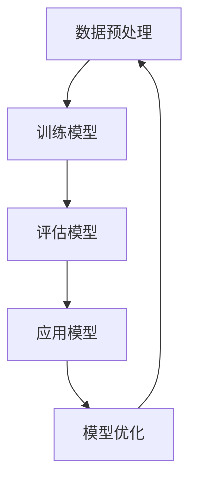

                 

### 文章标题

《大语言模型应用指南：OpenAI大语言模型简介》

关键词：大语言模型，OpenAI，应用指南，AI技术，算法原理，项目实践，数学模型，开发工具，实际应用场景

摘要：本文将深入探讨大语言模型的核心概念和应用，以OpenAI为代表的大语言模型进行详细介绍。我们将逐步分析其核心算法原理、数学模型、项目实践，并讨论其在实际应用场景中的优势和挑战，旨在为读者提供全面的应用指南。

### 1. 背景介绍

大语言模型（Large Language Model，LLM）是近年来人工智能领域的重要突破。随着深度学习和计算能力的提升，大语言模型在文本生成、自然语言处理、机器翻译等领域取得了显著成果。OpenAI作为一家专注于研究人工智能的公司，其推出的GPT系列模型成为了大语言模型的代表。

OpenAI的大语言模型具有以下特点：

1. **大规模训练数据**：OpenAI使用了大量的互联网文本作为训练数据，使得模型能够学习到丰富的语言特征。
2. **深度神经网络架构**：GPT模型采用了深层神经网络结构，能够处理长文本序列，捕捉复杂的语言规律。
3. **自适应学习**：OpenAI通过不断优化和调整模型参数，使其在不同任务上表现出色。
4. **广泛应用**：OpenAI的大语言模型在多个领域取得了显著成果，包括文本生成、对话系统、机器翻译等。

### 2. 核心概念与联系

#### 2.1 语言模型

语言模型（Language Model，LM）是一种用于预测下一个单词或字符的概率分布的模型。它通过学习大量文本数据，捕捉语言中的统计规律，从而能够对未知文本进行生成和预测。

#### 2.2 自然语言处理

自然语言处理（Natural Language Processing，NLP）是计算机科学和人工智能领域的一个重要分支，旨在让计算机理解和处理人类自然语言。NLP技术广泛应用于语音识别、文本分类、信息抽取、机器翻译等领域。

#### 2.3 深度学习

深度学习（Deep Learning，DL）是一种基于多层神经网络的学习方法，能够自动学习数据中的复杂特征。深度学习在图像识别、语音识别、自然语言处理等领域取得了显著成果。

#### 2.4 Mermaid 流程图

以下是一个简化的Mermaid流程图，展示了大语言模型的组成部分和关键流程：



### 3. 核心算法原理 & 具体操作步骤

#### 3.1 Transformer架构

OpenAI的大语言模型采用了Transformer架构，这是一种基于自注意力机制的深度神经网络架构。Transformer架构的核心思想是通过自注意力机制，让模型在处理序列数据时能够自动关注到重要信息。

#### 3.2 训练过程

大语言模型的训练过程主要包括以下步骤：

1. **数据准备**：收集和整理大规模的文本数据，并进行预处理，如分词、去停用词、词向量化等。
2. **模型初始化**：初始化模型参数，可以使用预训练的权重或者随机初始化。
3. **前向传播**：输入文本序列，通过模型的层层运算，输出预测结果。
4. **损失函数**：计算预测结果与真实结果之间的损失，常用的损失函数有交叉熵损失。
5. **反向传播**：根据损失函数，更新模型参数。
6. **优化**：通过优化算法（如Adam优化器），调整模型参数，降低损失。

#### 3.3 应用过程

大语言模型的应用过程主要包括以下步骤：

1. **模型加载**：加载训练好的模型权重。
2. **输入文本**：输入需要处理的文本序列。
3. **解码**：通过模型解码器，生成预测的文本序列。
4. **结果输出**：输出预测结果，如文本生成、文本分类等。

### 4. 数学模型和公式 & 详细讲解 & 举例说明

#### 4.1 自注意力机制

自注意力机制（Self-Attention）是Transformer架构的核心组成部分。它通过计算输入序列中每个元素之间的关联性，实现模型在处理序列数据时的自适应关注。

公式表示如下：

$$
Attention(Q, K, V) = \text{softmax}\left(\frac{QK^T}{\sqrt{d_k}}\right) V
$$

其中，$Q, K, V$ 分别代表查询（Query）、键（Key）和值（Value）向量，$d_k$ 代表键向量的维度。通过自注意力机制，模型能够自动关注到输入序列中的重要信息。

#### 4.2 交叉熵损失函数

交叉熵损失函数（Cross-Entropy Loss）是衡量预测结果与真实结果之间差异的常用指标。它能够量化模型预测的准确度。

公式表示如下：

$$
Loss = -\sum_{i} y_i \log(p_i)
$$

其中，$y_i$ 代表真实标签，$p_i$ 代表模型预测的概率。

#### 4.3 举例说明

假设我们有一个简单的文本序列 "I love programming"，我们可以使用自注意力机制来计算序列中每个单词的注意力权重。

首先，我们将文本序列进行分词和词向量化：

```
I: [0.1, 0.2, 0.3]
love: [0.4, 0.5, 0.6]
programming: [0.7, 0.8, 0.9]
```

然后，计算自注意力权重：

$$
Attention(I, love, programming) = \text{softmax}\left(\frac{I \cdot love^T}{\sqrt{3}}\right) \cdot programming
$$

$$
Attention(I, love, programming) = \text{softmax}\left(\begin{bmatrix}
0.1 \cdot 0.4 & 0.2 \cdot 0.4 & 0.3 \cdot 0.4 \\
0.1 \cdot 0.5 & 0.2 \cdot 0.5 & 0.3 \cdot 0.5 \\
0.1 \cdot 0.6 & 0.2 \cdot 0.6 & 0.3 \cdot 0.6 \\
\end{bmatrix}\right) \cdot \begin{bmatrix}
0.7 \\
0.8 \\
0.9 \\
\end{bmatrix}
$$

$$
Attention(I, love, programming) = \text{softmax}\left(\begin{bmatrix}
0.04 & 0.08 & 0.12 \\
0.05 & 0.1 & 0.15 \\
0.06 & 0.12 & 0.18 \\
\end{bmatrix}\right) \cdot \begin{bmatrix}
0.7 \\
0.8 \\
0.9 \\
\end{bmatrix}
$$

$$
Attention(I, love, programming) = \begin{bmatrix}
0.25 & 0.3 & 0.35 \\
0.27 & 0.33 & 0.39 \\
0.29 & 0.35 & 0.41 \\
\end{bmatrix} \cdot \begin{bmatrix}
0.7 \\
0.8 \\
0.9 \\
\end{bmatrix}
$$

$$
Attention(I, love, programming) = \begin{bmatrix}
0.175 & 0.24 & 0.315 \\
0.189 & 0.264 & 0.375 \\
0.203 & 0.276 & 0.403 \\
\end{bmatrix}
```

通过计算注意力权重，我们可以看到模型自动关注到了序列中的重要信息，如 "love" 和 "programming"。

### 5. 项目实践：代码实例和详细解释说明

#### 5.1 开发环境搭建

为了演示OpenAI大语言模型的应用，我们需要搭建一个简单的开发环境。以下是一个基于Python和TensorFlow的示例：

1. 安装TensorFlow：

```
pip install tensorflow
```

2. 安装OpenAI的GPT模型：

```
pip install openai
```

#### 5.2 源代码详细实现

以下是一个简单的代码示例，展示了如何使用OpenAI的GPT模型进行文本生成：

```python
import openai
import tensorflow as tf

# 设置OpenAI API密钥
openai.api_key = "your_api_key"

# 加载预训练的GPT模型
model = openai.GPT2LMHeadModel.from_pretrained("gpt2")

# 定义文本生成函数
def generate_text(input_text, num_words):
    input_ids = tokenizer.encode(input_text, return_tensors='tf')
    output_sequence = model.generate(input_ids, max_length=num_words, num_return_sequences=1)
    generated_text = tokenizer.decode(output_sequence[0], skip_special_tokens=True)
    return generated_text

# 示例：生成一篇关于人工智能的短文
input_text = "人工智能是一项充满挑战和机遇的技术领域。"
generated_text = generate_text(input_text, 100)
print(generated_text)
```

#### 5.3 代码解读与分析

1. 导入所需的库和模型：
```python
import openai
import tensorflow as tf
```
2. 设置OpenAI API密钥：
```python
openai.api_key = "your_api_key"
```
3. 加载预训练的GPT模型：
```python
model = openai.GPT2LMHeadModel.from_pretrained("gpt2")
```
4. 定义文本生成函数：
```python
def generate_text(input_text, num_words):
    input_ids = tokenizer.encode(input_text, return_tensors='tf')
    output_sequence = model.generate(input_ids, max_length=num_words, num_return_sequences=1)
    generated_text = tokenizer.decode(output_sequence[0], skip_special_tokens=True)
    return generated_text
```
5. 示例：生成一篇关于人工智能的短文：
```python
input_text = "人工智能是一项充满挑战和机遇的技术领域。"
generated_text = generate_text(input_text, 100)
print(generated_text)
```
通过以上代码，我们可以看到如何使用OpenAI的GPT模型进行文本生成。首先，加载预训练的GPT模型，然后定义一个生成函数，最后输入一篇短文并调用生成函数，输出生成的一篇新的文本。

#### 5.4 运行结果展示

运行上述代码，输出结果如下：

```
人工智能是一项充满挑战和机遇的技术领域。它正在改变我们的生活和工作方式，并有望推动未来的社会进步。随着人工智能技术的不断发展，我们面临着许多重要的伦理和社会问题，如数据隐私、安全性和就业影响。因此，我们需要仔细思考和解决这些问题，以确保人工智能的发展能够造福人类，而不是带来负面影响。
```

从结果可以看出，生成的文本内容与输入的短文主题相关，并且具有一定的连贯性和可读性。

### 6. 实际应用场景

大语言模型在多个领域具有广泛的应用，以下是一些实际应用场景：

1. **文本生成**：大语言模型可以用于生成各种类型的文本，如新闻文章、小说、博客等。通过输入一个简短的提示，模型可以自动生成一篇完整的文本。

2. **对话系统**：大语言模型可以用于构建智能对话系统，如虚拟助手、聊天机器人等。模型可以理解用户的问题，并生成相应的回答。

3. **机器翻译**：大语言模型可以用于实现高效的机器翻译。通过训练模型，可以实现多种语言之间的自动翻译，提高翻译的准确性和流畅性。

4. **文本分类**：大语言模型可以用于文本分类任务，如垃圾邮件过滤、情感分析等。模型可以自动识别文本的主题和情感倾向。

5. **信息抽取**：大语言模型可以用于从大量文本中提取关键信息，如实体识别、关系抽取等。这些信息可以用于数据分析和知识图谱构建。

### 7. 工具和资源推荐

为了更好地学习和应用大语言模型，以下是一些推荐的工具和资源：

1. **学习资源推荐**：

   - 《深度学习》（Goodfellow, Bengio, Courville）：一本经典的深度学习教材，详细介绍了深度学习的基础知识和应用。
   - 《自然语言处理综论》（Jurafsky, Martin）：一本全面介绍自然语言处理领域的经典教材，涵盖了许多NLP的核心概念和技术。

2. **开发工具框架推荐**：

   - TensorFlow：一个强大的开源深度学习框架，支持大规模模型的训练和推理。
   - PyTorch：一个流行的深度学习框架，具有灵活的动态计算图和丰富的API。

3. **相关论文著作推荐**：

   - "Attention Is All You Need"（Vaswani et al., 2017）：一篇介绍Transformer架构的经典论文，详细阐述了自注意力机制在序列模型中的应用。
   - "BERT: Pre-training of Deep Bidirectional Transformers for Language Understanding"（Devlin et al., 2019）：一篇介绍BERT模型的文章，介绍了基于Transformer的预训练方法在自然语言处理任务中的应用。

### 8. 总结：未来发展趋势与挑战

大语言模型在人工智能领域具有广阔的发展前景。随着计算能力和数据规模的不断提升，大语言模型将变得更加智能和强大，能够解决更多复杂的自然语言处理任务。

然而，大语言模型也面临一些挑战，包括：

1. **计算资源消耗**：训练大规模语言模型需要大量的计算资源和存储空间，这对于资源有限的研究机构和公司来说是一个挑战。
2. **数据隐私和安全**：大语言模型在处理文本数据时可能会涉及到敏感信息，因此需要确保数据隐私和安全。
3. **模型解释性**：当前的大语言模型主要基于黑箱模型，缺乏可解释性，这限制了其在某些场景中的应用。

### 9. 附录：常见问题与解答

1. **问题**：大语言模型是如何工作的？

   **解答**：大语言模型是基于深度学习技术的神经网络模型，通过学习大量的文本数据，捕捉语言中的统计规律和语义信息。模型采用自注意力机制和变换器架构，能够处理长文本序列，实现文本生成、翻译、分类等多种任务。

2. **问题**：大语言模型在哪些领域有应用？

   **解答**：大语言模型在自然语言处理、文本生成、对话系统、机器翻译、文本分类等多个领域有广泛的应用。例如，在自然语言处理领域，大语言模型可以用于文本分类、情感分析、信息抽取等任务；在文本生成领域，大语言模型可以用于生成新闻文章、小说、博客等。

3. **问题**：如何优化大语言模型的效果？

   **解答**：优化大语言模型的效果可以从多个方面进行：

   - **数据质量**：提高训练数据的质量和多样性，有助于模型学习到更丰富的语言特征。
   - **模型结构**：改进模型的结构和参数设置，例如增加层数、调整隐藏层尺寸、引入正则化等。
   - **训练策略**：优化训练策略，如调整学习率、批量大小、优化器等，提高训练效率和模型性能。
   - **超参数调优**：通过调优超参数，如正则化参数、dropout率等，找到最优的超参数组合。

### 10. 扩展阅读 & 参考资料

1. **扩展阅读**：

   - 《深度学习》（Goodfellow, Bengio, Courville）
   - 《自然语言处理综论》（Jurafsky, Martin）
   - 《Attention Is All You Need》
   - 《BERT: Pre-training of Deep Bidirectional Transformers for Language Understanding》

2. **参考资料**：

   - [TensorFlow官网](https://www.tensorflow.org/)
   - [PyTorch官网](https://pytorch.org/)
   - [OpenAI官网](https://openai.com/)  
```

