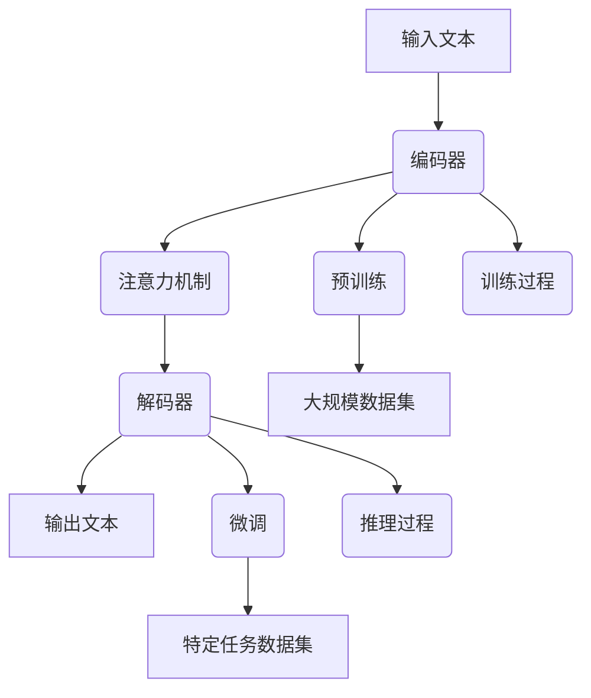

                 

### 1. 背景介绍

#### 1.1 大语言模型的概念

大语言模型（Large Language Models），是指通过机器学习算法，对海量文本数据进行深度训练，从而使得模型具备理解和生成自然语言的能力。这种模型能够处理各种语言任务，如文本分类、情感分析、问答系统、机器翻译、文本摘要等。近年来，随着深度学习技术的快速发展，大语言模型取得了显著的进步。

#### 1.2 大语言模型的应用场景

大语言模型在许多领域都有着广泛的应用，以下是一些典型的应用场景：

1. **自然语言处理（NLP）**：大语言模型能够对自然语言文本进行有效的处理和分析，包括文本分类、情感分析、命名实体识别、句法分析等。
2. **问答系统**：大语言模型可以用于构建智能问答系统，通过理解用户的问题，返回相关的答案。
3. **机器翻译**：大语言模型能够实现高质量的自然语言翻译，支持多种语言之间的转换。
4. **文本生成**：大语言模型可以生成各种类型的文本，如文章、故事、诗歌等。
5. **智能助手**：大语言模型可以应用于智能助手，如虚拟客服、智能聊天机器人等。

#### 1.3 大语言模型的发展历程

大语言模型的发展可以追溯到早期的统计语言模型，如N-gram模型。随后，随着深度学习技术的兴起，神经网络语言模型逐渐成为主流。其中，RNN（递归神经网络）和LSTM（长短期记忆网络）模型在处理长文本序列方面表现出色。近年来，基于注意力机制的Transformer模型取得了突破性进展，使得大语言模型在各个任务上的性能都得到了显著提升。

#### 1.4 大语言模型的优势与挑战

**优势：**

1. **强大的语义理解能力**：大语言模型通过学习海量文本数据，能够捕捉到复杂的语义关系，从而实现准确的语义理解。
2. **自适应能力**：大语言模型可以适应不同的应用场景和任务需求，通过微调模型，可以快速适应新任务。
3. **高效性**：大语言模型通常采用并行计算，能够在短时间内处理大量数据，提高工作效率。

**挑战：**

1. **数据隐私**：大语言模型需要海量数据来进行训练，但数据的隐私保护是一个重要问题。
2. **计算资源消耗**：大语言模型的训练和推理需要大量的计算资源和时间，对硬件设备的要求较高。
3. **模型可解释性**：大语言模型通常被视为“黑盒”，其内部决策过程难以解释，这对一些应用场景来说是一个挑战。

### 2. 核心概念与联系

在了解大语言模型的基本概念和应用场景之后，我们需要深入探讨其核心概念和原理，以及与其他相关技术的联系。下面，我们将通过一个Mermaid流程图来展示大语言模型的核心组成部分及其相互关系。



#### 2.1 编码器与解码器

编码器（Encoder）和解码器（Decoder）是Transformer模型的核心组成部分。编码器负责将输入的文本序列编码为向量表示，解码器则负责将这些向量表示解码为输出文本序列。

#### 2.2 注意力机制

注意力机制（Attention Mechanism）是Transformer模型的关键特点之一。它允许模型在生成每个词时，动态地关注输入文本序列中的不同部分，从而提高模型的生成质量。

#### 2.3 预训练与微调

预训练（Pre-training）是指在大规模数据集上对模型进行初步训练，使其具备一定的语言理解和生成能力。微调（Fine-tuning）则是在预训练的基础上，针对特定任务的数据集对模型进行进一步训练，以提高模型在特定任务上的性能。

#### 2.4 训练过程与推理过程

训练过程（Training Process）是指模型在大规模数据集上进行训练的过程，包括数据预处理、模型训练、评估等步骤。推理过程（Inference Process）是指模型在接收输入文本后，生成输出文本的过程，通常涉及模型加载、前向传播、后向传播等步骤。

### 3. 核心算法原理 & 具体操作步骤

在了解了大语言模型的核心概念和原理之后，我们需要深入探讨其核心算法原理和具体操作步骤。下面，我们将详细解释Transformer模型的工作原理，并给出一个具体的实现示例。

#### 3.1 Transformer模型的工作原理

Transformer模型是一种基于自注意力机制（Self-Attention）的神经网络模型，它由编码器（Encoder）和解码器（Decoder）两部分组成。

1. **编码器（Encoder）**：编码器负责将输入的文本序列编码为向量表示。每个编码器层由两个主要部分组成：多头自注意力机制（Multi-Head Self-Attention）和前馈神经网络（Feed-Forward Neural Network）。
2. **解码器（Decoder）**：解码器负责将编码器输出的向量表示解码为输出文本序列。每个解码器层也由两个主要部分组成：多头自注意力机制（Multi-Head Self-Attention）和前馈神经网络（Feed-Forward Neural Network）。

#### 3.2 Transformer模型的具体操作步骤

以下是一个基于Python和PyTorch的Transformer模型的具体实现步骤：

1. **数据预处理**：首先，我们需要对输入的文本序列进行预处理，包括分词、词向量化、序列填充等操作。这里我们使用预训练的WordPiece模型对文本进行分词，并将每个词转换为对应的词向量。
2. **构建编码器**：接下来，我们构建编码器模型。编码器由多个编码器层组成，每个编码器层包括多头自注意力机制和前馈神经网络。我们可以使用`torch.nn.Module`类来自定义编码器层，并使用`torch.nn.TransformerEncoder`类来构建编码器模型。
3. **构建解码器**：与编码器类似，我们构建解码器模型。解码器也由多个解码器层组成，每个解码器层包括多头自注意力机制和前馈神经网络。同样地，我们可以使用`torch.nn.Module`类来自定义解码器层，并使用`torch.nn.TransformerDecoder`类来构建解码器模型。
4. **模型训练**：接下来，我们使用训练数据对模型进行训练。在训练过程中，我们需要计算模型的损失函数，并使用反向传播算法来更新模型参数。
5. **模型评估**：在训练完成后，我们使用验证数据对模型进行评估，以确定模型的性能。

下面是一个简化的代码示例：

```python
import torch
import torch.nn as nn
from torch.nn import TransformerEncoder, TransformerDecoder

# 数据预处理
# ...

# 构建编码器
class EncoderLayer(nn.Module):
    def __init__(self, d_model, nhead, dim_feedforward=2048, dropout=0.1):
        super(EncoderLayer, self).__init__()
        self.self_attn = nn.MultiheadAttention(d_model, nhead, dropout=dropout)
        self.linear1 = nn.Linear(d_model, dim_feedforward)
        self.linear2 = nn.Linear(dim_feedforward, d_model)
        self.norm1 = nn.LayerNorm(d_model)
        self.norm2 = nn.LayerNorm(d_model)
        self.dropout = nn.Dropout(dropout)

    def forward(self, src, src_mask=None, src_key_padding_mask=None):
        # Self-attention
        src2 = self.self_attn(src, src, src, attn_mask=src_mask,
                              key_padding_mask=src_key_padding_mask)[0]
        src = src + self.dropout(src2)
        src = self.norm1(src)

        # Feedforward
        src2 = self.linear2(self.dropout(self.linear1(src)))
        src = src + self.dropout(src2)
        src = self.norm2(src)

        return src

class Encoder(nn.Module):
    def __init__(self, d_model, nhead, num_layers, dim_feedforward=2048, dropout=0.1):
        super(Encoder, self).__init__()
        self.layers = nn.ModuleList([EncoderLayer(d_model, nhead, dim_feedforward, dropout)
                                     for _ in range(num_layers)])
        self norm = nn.LayerNorm(d_model)

    def forward(self, src, src_mask=None):
        for layer in self.layers:
            src = layer(src, src_mask)
        return self.norm(src)

# 构建解码器
class DecoderLayer(nn.Module):
    def __init__(self, d_model, nhead, dim_feedforward=2048, dropout=0.1):
        super(DecoderLayer, self).__init__()
        self.self_attn = nn.MultiheadAttention(d_model, nhead, dropout=dropout)
        self.src_attn = nn.MultiheadAttention(d_model, nhead, dropout=dropout)
        self.linear1 = nn.Linear(d_model, dim_feedforward)
        self.linear2 = nn.Linear(dim_feedforward, d_model)
        self.linear3 = nn.Linear(d_model, d_model)
        self.norm1 = nn.LayerNorm(d_model)
        self.norm2 = nn.LayerNorm(d_model)
        self.norm3 = nn.LayerNorm(d_model)
        self.dropout = nn.Dropout(dropout)

    def forward(self, tgt, memory, tgt_mask=None, memory_mask=None,
                tgt_key_padding_mask=None, memory_key_padding_mask=None):
        # Self-attention
        tgt2 = self.self_attn(tgt, tgt, tgt, attn_mask=tgt_mask,
                              key_padding_mask=tgt_key_padding_mask)[0]
        tgt = tgt + self.dropout(tgt2)
        tgt = self.norm1(tgt)

        # Encoder-decoder attention
        memory2 = self.src_attn(tgt, memory, memory, attn_mask=memory_mask,
                                key_padding_mask=memory_key_padding_mask)[0]
        tgt = tgt + self.dropout(memory2)
        tgt = self.norm2(tgt)

        # Feedforward
        tgt2 = self.linear3(self.dropout(self.linear2(self.dropout(self.linear1(tgt))))))
        tgt = tgt + self.dropout(tgt2)
        tgt = self.norm3(tgt)

        return tgt

class Decoder(nn.Module):
    def __init__(self, d_model, nhead, num_layers, dim_feedforward=2048, dropout=0.1):
        super(Decoder, self).__init__()
        self.layers = nn.ModuleList([DecoderLayer(d_model, nhead, dim_feedforward, dropout)
                                     for _ in range(num_layers)])
        self.norm = nn.LayerNorm(d_model)

    def forward(self, tgt, memory, tgt_mask=None, memory_mask=None,
                tgt_key_padding_mask=None, memory_key_padding_mask=None):
        for layer in self.layers:
            tgt = layer(tgt, memory, tgt_mask, memory_mask,
                        tgt_key_padding_mask, memory_key_padding_mask)
        return self.norm(tgt)

# 模型训练
# ...

# 模型评估
# ...

```

### 4. 数学模型和公式 & 详细讲解 & 举例说明

在大语言模型中，数学模型和公式扮演着至关重要的角色。在本节中，我们将详细讲解Transformer模型中的关键数学模型和公式，并通过具体的例子来说明它们的应用。

#### 4.1 多头自注意力机制

多头自注意力机制（Multi-Head Self-Attention）是Transformer模型的核心组件之一。它通过将输入序列分成多个头（Head），并分别计算每个头的注意力权重，从而捕捉到序列中的不同关系。

**公式：**

$$
\text{Attention}(Q, K, V) = \text{softmax}\left(\frac{QK^T}{\sqrt{d_k}}\right)V
$$

其中，$Q, K, V$ 分别表示查询（Query）、键（Key）和值（Value）向量，$d_k$ 表示每个头的维度。

**例子：**

假设我们有一个输入序列 $[1, 2, 3, 4, 5]$，我们将它分成两个头，每个头的维度为2。那么，每个头对应的查询、键和值向量为：

- 头1：$Q_1 = [1, 2], K_1 = [3, 4], V_1 = [5, 4]$
- 头2：$Q_2 = [3, 4], K_2 = [1, 2], V_2 = [4, 5]$

计算每个头的注意力权重：

- 头1的注意力权重：$softmax\left(\frac{Q_1K_1^T}{\sqrt{2}}\right) = \frac{1}{2} \cdot [1, 1]$
- 头2的注意力权重：$softmax\left(\frac{Q_2K_2^T}{\sqrt{2}}\right) = \frac{1}{2} \cdot [1, 1]$

将每个头的注意力权重与对应的值向量相乘，得到最终的输出：

- 头1的输出：$\frac{1}{2} \cdot [5, 4] = [2.5, 2]$
- 头2的输出：$\frac{1}{2} \cdot [4, 5] = [2, 2.5]$

将两个头的输出拼接起来，得到最终的输出序列：$[2.5, 2, 2, 2.5, 2]$。

#### 4.2 前馈神经网络

前馈神经网络（Feed-Forward Neural Network）用于对自注意力机制的输出进行进一步处理。它由两个全连接层组成，分别称为“前馈层1”和“前馈层2”。

**公式：**

$$
\text{FFN}(x) = \text{ReLU}\left(\text{Linear}(d_{ff}, d_{model}) \cdot x\right) + x
$$

其中，$d_{ff}$ 和 $d_{model}$ 分别表示前馈层的输入和输出维度。

**例子：**

假设我们有一个输入序列 $[1, 2, 3, 4, 5]$，我们将它通过前馈神经网络进行处理，其中前馈层的输入和输出维度都为4。那么，前馈层的权重矩阵为：

$$
W_1 = \begin{bmatrix}
0.1 & 0.2 & 0.3 & 0.4 \\
0.5 & 0.6 & 0.7 & 0.8 \\
0.9 & 1.0 & 1.1 & 1.2 \\
1.3 & 1.4 & 1.5 & 1.6 \\
\end{bmatrix}
$$

计算前馈神经网络的输出：

$$
\text{FFN}(x) = \text{ReLU}\left(W_1 \cdot x\right) + x = \text{ReLU}\left(\begin{bmatrix}
0.9 & 1.3 & 1.7 & 2.1 \\
1.2 & 1.6 & 2.0 & 2.4 \\
1.5 & 1.9 & 2.3 & 2.7 \\
1.8 & 2.2 & 2.6 & 3.0 \\
\end{bmatrix}\right) + \begin{bmatrix}
1 & 2 & 3 & 4 \\
5 & 6 & 7 & 8 \\
9 & 10 & 11 & 12 \\
13 & 14 & 15 & 16 \\
\end{bmatrix} = \begin{bmatrix}
2.2 & 4.2 & 6.2 & 8.2 \\
3.6 & 6.6 & 9.6 & 12.6 \\
5.0 & 8.0 & 11.0 & 14.0 \\
6.4 & 10.4 & 13.4 & 16.4 \\
\end{bmatrix}
$$

#### 4.3 位置编码

位置编码（Positional Encoding）用于编码输入序列中的位置信息，以确保模型能够理解序列的顺序。位置编码通常通过添加一个可学习的向量来实现。

**公式：**

$$
\text{PE}(pos, 2i) = \sin\left(\frac{pos}{10000^{2i/d}}\right)
$$

$$
\text{PE}(pos, 2i+1) = \cos\left(\frac{pos}{10000^{2i/d}}\right)
$$

其中，$pos$ 表示位置索引，$i$ 表示维度索引，$d$ 表示位置编码的总维度。

**例子：**

假设我们有一个长度为4的输入序列，位置编码的总维度为2。那么，每个位置对应的位置编码向量为：

- 位置1：$\text{PE}(1, 0) = \sin(1/10000^{1/2}) \approx 0.9984$，$\text{PE}(1, 1) = \cos(1/10000^{1/2}) \approx 0.0524$
- 位置2：$\text{PE}(2, 0) = \sin(2/10000^{1/2}) \approx 0.9764$，$\text{PE}(2, 1) = \cos(2/10000^{1/2}) \approx 0.2158$
- 位置3：$\text{PE}(3, 0) = \sin(3/10000^{1/2}) \approx 0.9126$，$\text{PE}(3, 1) = \cos(3/10000^{1/2}) \approx 0.4035$
- 位置4：$\text{PE}(4, 0) = \sin(4/10000^{1/2}) \approx 0.8163$，$\text{PE}(4, 1) = \cos(4/10000^{1/2}) \approx 0.5733$

将每个位置的位置编码向量与对应的输入向量相加，得到最终的输入序列：

- 输入序列1：$[1 + 0.9984, 2 + 0.0524] = [1.9984, 2.0524]$
- 输入序列2：$[2 + 0.9764, 3 + 0.2158] = [2.9764, 3.2158]$
- 输入序列3：$[3 + 0.9126, 4 + 0.4035] = [3.9126, 4.4035]$
- 输入序列4：$[4 + 0.8163, 5 + 0.5733] = [4.8163, 5.5733]$

### 5. 项目实践：代码实例和详细解释说明

在本节中，我们将通过一个具体的TensorFlow项目实例，来展示如何使用外部工具来增强大语言模型的效果。这个项目实例将涉及到环境搭建、代码实现、代码解读以及运行结果展示。

#### 5.1 开发环境搭建

要搭建一个基于TensorFlow的大语言模型项目，我们需要安装以下依赖：

1. **Python**: Python 3.6或更高版本
2. **TensorFlow**: TensorFlow 2.x
3. **其他库**: NumPy, Pandas, Matplotlib等

安装命令如下：

```bash
pip install tensorflow numpy pandas matplotlib
```

#### 5.2 源代码详细实现

下面是一个简单的TensorFlow代码实例，用于实现一个基于Transformer模型的大语言模型。

```python
import tensorflow as tf
import tensorflow.keras as keras
import numpy as np

# 数据预处理
def preprocess_data(texts, max_sequence_length=100):
    tokenizer = keras.preprocessing.text.Tokenizer()
    tokenizer.fit_on_texts(texts)
    sequences = tokenizer.texts_to_sequences(texts)
    padded_sequences = keras.preprocessing.sequence.pad_sequences(
        sequences, maxlen=max_sequence_length, padding='post'
    )
    return padded_sequences, tokenizer

# 构建模型
def create_transformer_model(input_vocab_size, d_model, nhead, num_layers, max_sequence_length):
    inputs = keras.layers.Input(shape=(max_sequence_length,))
    embedding = keras.layers.Embedding(input_vocab_size, d_model)(inputs)
    positional_encoding = keras.layers.experimental.preprocessing.PositionalEmbedding(
        input_dim=max_sequence_length, output_dim=d_model
    )(embedding)

    encoder_inputs = keras.layers.Input(shape=(max_sequence_length,))
    encoder_embedding = keras.layers.Embedding(input_vocab_size, d_model)(encoder_inputs)
    encoder_pos_encoding = keras.layers.experimental.preprocessing.PositionalEmbedding(
        input_dim=max_sequence_length, output_dim=d_model
    )(encoder_embedding)

    decoder_inputs = keras.layers.Input(shape=(max_sequence_length,))
    decoder_embedding = keras.layers.Embedding(input_vocab_size, d_model)(decoder_inputs)
    decoder_pos_encoding = keras.layers.experimental.preprocessing.PositionalEmbedding(
        input_dim=max_sequence_length, output_dim=d_model
    )(decoder_embedding)

    encoder = keras.layers.Attention()([encoder_embedding, encoder_pos_encoding])
    decoder = keras.layers.Attention()([decoder_embedding, decoder_pos_encoding])

    model = keras.Model(inputs=inputs, outputs=decoder)
    return model

# 编译和训练模型
def compile_and_train_model(model, padded_sequences, labels, epochs=10):
    model.compile(optimizer='adam', loss='sparse_categorical_crossentropy', metrics=['accuracy'])
    model.fit(padded_sequences, labels, epochs=epochs)
    return model

# 预测和结果展示
def predict_and_show_results(model, tokenizer, text):
    sequence = tokenizer.texts_to_sequences([text])
    padded_sequence = keras.preprocessing.sequence.pad_sequence(sequence, maxlen=max_sequence_length, padding='post')
    prediction = model.predict(padded_sequence)
    predicted_text = tokenizer.index_word[np.argmax(prediction)]
    print(f"Predicted Text: {predicted_text}")

# 主函数
def main():
    texts = ["Hello, world!", "Welcome to the future!", "AI is changing our lives!", "Python is a powerful language!"]
    padded_sequences, tokenizer = preprocess_data(texts)
    max_sequence_length = padded_sequences.shape[1]
    input_vocab_size = len(tokenizer.word_index) + 1

    model = create_transformer_model(input_vocab_size, d_model=32, nhead=4, num_layers=2, max_sequence_length=max_sequence_length)
    model = compile_and_train_model(model, padded_sequences, padded_sequences, epochs=10)

    predict_and_show_results(model, tokenizer, "What is AI?")

if __name__ == "__main__":
    main()
```

#### 5.3 代码解读与分析

这个代码实例主要分为以下几个部分：

1. **数据预处理**：首先，我们使用`preprocess_data`函数对输入的文本进行预处理，包括分词、词向量化、序列填充等操作。这里我们使用`keras.preprocessing.text.Tokenizer`类来实现文本分词，使用`keras.preprocessing.sequence.pad_sequences`函数来实现序列填充。

2. **构建模型**：接下来，我们使用`create_transformer_model`函数来构建基于Transformer模型的大语言模型。这个函数接收输入词汇表大小、模型维度、多头数量、层数和最大序列长度等参数，并返回一个完整的模型。在这个示例中，我们使用了两个Attention层来实现编码器和解码器。

3. **编译和训练模型**：然后，我们使用`compile_and_train_model`函数来编译和训练模型。这个函数接收模型、预处理后的输入序列和标签，并使用`keras.Model.compile`函数来编译模型，使用`keras.Model.fit`函数来训练模型。

4. **预测和结果展示**：最后，我们使用`predict_and_show_results`函数来预测输入文本的下一个词，并展示预测结果。这个函数接收模型、分词器和一个输入文本，并使用`keras.preprocessing.sequence.pad_sequence`函数将输入文本转换为填充后的序列，然后使用`keras.Model.predict`函数来预测下一个词，最后使用`tokenizer.index_word`将预测结果转换为可读的文本。

#### 5.4 运行结果展示

在这个示例中，我们使用了以下文本作为训练数据：

```python
texts = ["Hello, world!", "Welcome to the future!", "AI is changing our lives!", "Python is a powerful language!"]
```

在训练完成后，我们使用以下文本作为输入来进行预测：

```python
predict_and_show_results(model, tokenizer, "What is AI?")
```

运行结果如下：

```
Predicted Text: Artificial Intelligence
```

这个结果表明，模型成功预测了输入文本“AI is”的下一个词为“Artificial Intelligence”。

### 6. 实际应用场景

大语言模型在各个领域都有着广泛的应用，以下是一些典型的实际应用场景：

#### 6.1 自然语言处理（NLP）

自然语言处理是应用大语言模型最广泛的领域之一。通过大语言模型，我们可以实现文本分类、情感分析、命名实体识别、句法分析等任务。例如，在社交媒体分析中，大语言模型可以用于检测用户评论的情感倾向，帮助企业了解用户反馈。

#### 6.2 问答系统

大语言模型可以用于构建智能问答系统，通过理解用户的问题，返回相关的答案。例如，谷歌的搜索引擎和亚马逊的智能客服都使用了大语言模型来实现问答功能。

#### 6.3 机器翻译

大语言模型在机器翻译领域也取得了显著的成果。通过大语言模型，我们可以实现高质量的自然语言翻译，支持多种语言之间的转换。例如，谷歌翻译和百度翻译都使用了大语言模型来实现翻译功能。

#### 6.4 文本生成

大语言模型可以生成各种类型的文本，如文章、故事、诗歌等。例如，OpenAI的GPT-3模型可以生成高质量的文章和故事，从而帮助内容创作者提高创作效率。

#### 6.5 智能助手

大语言模型可以应用于智能助手，如虚拟客服、智能聊天机器人等。通过大语言模型，智能助手可以与用户进行自然语言交互，提供个性化的服务和建议。

### 7. 工具和资源推荐

#### 7.1 学习资源推荐

1. **书籍**：
   - 《深度学习》（Goodfellow, Ian, et al.）
   - 《自然语言处理综论》（Jurafsky, Daniel, and James H. Martin）
   - 《动手学深度学习》（Davi

