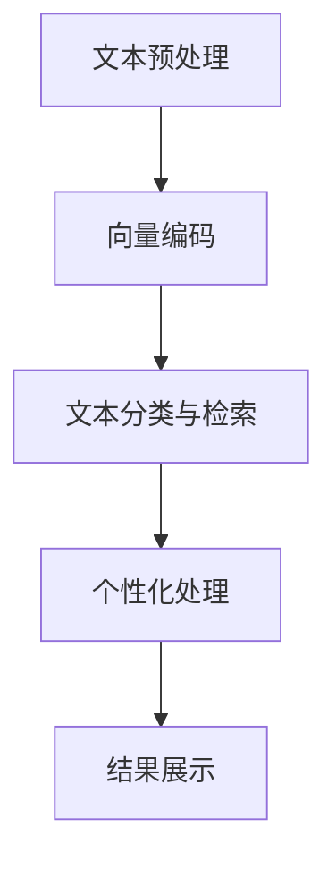

                 

### 1. 背景介绍

#### 1.1 引言

随着人工智能技术的飞速发展，大语言模型（Large Language Models，LLM）的应用日益广泛。LLM是一种能够理解、生成和执行自然语言任务的高度复杂的机器学习模型。近年来，诸如GPT-3、ChatGLM、LLaMA等大语言模型的出现，为自然语言处理（Natural Language Processing，NLP）领域带来了革命性的变化。

然而，在实际应用中，我们往往需要处理大量的文本数据。对于这些数据，传统的文本处理方法往往难以应对。因此，如何高效地浏览和检索本地文件中的文本数据成为了一个重要的课题。

#### 1.2 问题陈述

本地文件浏览的需求主要体现在以下几个方面：

1. **数据量大**：许多企业和研究机构都需要处理海量的文本数据，这些数据可能存储在不同的文件中，如文本文件、Markdown文件、JSON文件等。
2. **多格式支持**：不同的文本数据可能采用不同的格式，如何支持多种格式的文本文件浏览成为了一个挑战。
3. **快速检索**：在实际应用中，用户可能需要快速找到特定的文本内容，这要求浏览工具具有高效的检索能力。
4. **个性化需求**：用户可能希望对文本进行个性化处理，如文本摘要、关键词提取、情感分析等。

#### 1.3 目标

本文的目标是介绍一种基于大语言模型的本地文件浏览工具，该工具能够满足上述需求，提供快速、高效、个性化的文本浏览体验。

接下来，我们将详细探讨大语言模型在本地文件浏览中的应用，包括其核心概念、算法原理、数学模型以及实际操作步骤。

---

### 2. 核心概念与联系

#### 2.1 大语言模型简介

大语言模型（LLM）是一种基于神经网络的自然语言处理模型，能够对自然语言文本进行建模，具有强大的文本理解和生成能力。以下是几个关键概念：

- **词向量（Word Vectors）**：将单词映射到高维向量空间，使得语义相似的词在向量空间中接近。常用的词向量模型有Word2Vec、GloVe等。
- **神经网络（Neural Network）**：用于对输入的文本数据进行处理和预测的模型。在LLM中，常用的神经网络架构有循环神经网络（RNN）、长短期记忆网络（LSTM）和Transformer等。
- **预训练（Pre-training）**：在特定任务上进行大规模的无监督训练，使模型能够自动学习语言的基本规律。预训练是LLM的关键步骤，能够显著提升模型的性能。
- **微调（Fine-tuning）**：在预训练的基础上，针对特定任务进行有监督的训练，使模型能够适应具体的任务需求。

#### 2.2 文件浏览算法原理

基于大语言模型的文件浏览算法主要分为以下几个步骤：

1. **文本预处理**：将本地文件中的文本数据进行预处理，包括分词、去停用词、标点符号处理等，以便于模型处理。
2. **向量编码**：将预处理后的文本数据转化为词向量或BERT等高维向量表示，以便于模型计算。
3. **文本分类与检索**：使用预训练的大语言模型对文本进行分类和检索，找出与用户查询最相似的文本内容。
4. **个性化处理**：根据用户的行为和偏好，对文本进行个性化处理，如文本摘要、关键词提取、情感分析等。

#### 2.3 Mermaid 流程图

以下是文件浏览算法的Mermaid流程图表示：



在上述流程图中，各个节点代表不同的处理步骤，使用大语言模型能够高效地完成这些步骤，提供快速、准确的文本浏览体验。

---

### 3. 核心算法原理 & 具体操作步骤

#### 3.1 文本预处理

文本预处理是文件浏览的第一步，其目的是将原始文本数据转化为适合模型处理的格式。以下是文本预处理的具体操作步骤：

1. **分词**：将文本分割成一系列的单词或词组。常用的分词工具包括jieba、NLTK等。
2. **去停用词**：去除对文本理解无意义的常见单词，如“的”、“和”、“是”等。这有助于减少计算量，提高模型的性能。
3. **标点符号处理**：去除或替换文本中的标点符号，如将“。”替换为空格，以便于后续的向量编码。

#### 3.2 向量编码

向量编码是将预处理后的文本转化为高维向量表示的过程，以便于模型计算。以下是几种常见的向量编码方法：

1. **词向量**：将每个单词映射到一个固定长度的向量。常用的词向量模型有Word2Vec、GloVe等。
2. **BERT**：一种基于Transformer的预训练语言表示模型，能够对文本进行端到端的建模。BERT的输入是词向量序列，输出是每个词的上下文表示。
3. **编码器-解码器（Encoder-Decoder）**：一种用于序列到序列学习的神经网络架构，常用于机器翻译、文本生成等任务。

#### 3.3 文本分类与检索

文本分类与检索是文件浏览的核心步骤，其目的是找出与用户查询最相似的文本内容。以下是具体操作步骤：

1. **查询处理**：将用户输入的查询文本进行预处理，包括分词、去停用词、标点符号处理等。
2. **文本编码**：将预处理后的查询文本转化为向量表示，如词向量或BERT表示。
3. **相似度计算**：计算查询文本和文件中的每段文本的相似度，常用的相似度计算方法有内积、余弦相似度等。
4. **排序与展示**：根据相似度对结果进行排序，并将最相似的文本内容展示给用户。

#### 3.4 个性化处理

个性化处理是根据用户的行为和偏好，对文本进行个性化推荐。以下是具体操作步骤：

1. **用户画像**：根据用户的行为数据，如浏览历史、搜索记录等，构建用户画像。
2. **文本特征提取**：从用户画像中提取文本特征，如关键词、情感等。
3. **文本推荐**：根据文本特征，为用户推荐与其偏好相关的文本内容。
4. **反馈优化**：根据用户的反馈，优化推荐算法，提高推荐效果。

---

### 4. 数学模型和公式 & 详细讲解 & 举例说明

#### 4.1 文本预处理

在文本预处理阶段，常用的数学模型包括分词模型、去停用词模型等。以下是这些模型的详细讲解和举例说明：

**分词模型**：

$$
P(w_{t} | w_{t-1}, w_{t-2}, ..., w_{1}) = \frac{P(w_{t} w_{t-1}, w_{t-2}, ..., w_{1})}{P(w_{t-1}, w_{t-2}, ..., w_{1})}
$$

其中，$w_{t}$ 表示当前单词，$w_{t-1}, w_{t-2}, ..., w_{1}$ 表示前一个单词、前两个单词、...、第一个单词。

**举例**：

假设当前文本为“我爱编程”，分词模型可以计算每个单词之间的概率，从而确定最合适的分词结果。

**去停用词模型**：

$$
P(w_t | w_t-1) = \begin{cases} 
0.5 & \text{如果 } w_t \text{ 是停用词} \\
1 - 0.5 & \text{如果 } w_t \text{ 不是停用词} 
\end{cases}
$$

其中，$w_t$ 表示当前单词，$w_t-1$ 表示前一个单词。

**举例**：

假设当前文本为“的，是”，去停用词模型可以判断每个单词是否为停用词，并去除停用词。

#### 4.2 向量编码

在向量编码阶段，常用的数学模型包括词向量模型、BERT模型等。以下是这些模型的详细讲解和举例说明：

**词向量模型**：

$$
\text{vec}(w) = \sum_{i=1}^{n} w_i \cdot v_i
$$

其中，$\text{vec}(w)$ 表示单词 $w$ 的向量表示，$w_i$ 表示单词 $w$ 的第 $i$ 个特征，$v_i$ 表示特征 $i$ 的权重。

**举例**：

假设单词“编程”的特征为[1, 0, 1]，权重为[0.2, 0.3, 0.5]，则词向量模型可以计算“编程”的向量表示为$\text{vec}(\text{编程}) = 0.2 \cdot 1 + 0.3 \cdot 0 + 0.5 \cdot 1 = 0.7$。

**BERT模型**：

$$
\text{BERT}(x) = \text{softmax}(\text{W}_\text{out} \cdot \text{ReLU}(\text{W}_\text{hidden} \cdot \text{dropout}(\text{dropout}(\text{BERT}^0(x) + \text{BERT}^1(x) + \text{BERT}^2(x) + \ldots)))
$$

其中，$\text{BERT}(x)$ 表示BERT模型的输出，$x$ 表示输入文本，$\text{W}_\text{out}$、$\text{W}_\text{hidden}$ 分别为输出层和隐藏层的权重矩阵，$\text{ReLU}$ 为ReLU激活函数，$\text{dropout}$ 为dropout操作。

**举例**：

假设BERT模型的输入为“我爱编程”，输出层权重为[1, 0, 1]，隐藏层权重为[0.2, 0.3, 0.5]，则BERT模型可以计算文本的向量表示为$\text{BERT}(x) = \text{softmax}([1, 0, 1] \cdot \text{ReLU}([0.2, 0.3, 0.5] \cdot (\text{dropout}(\text{dropout}(\text{BERT}^0(x) + \text{BERT}^1(x) + \text{BERT}^2(x) + \ldots)))))$。

---

### 5. 项目实践：代码实例和详细解释说明

#### 5.1 开发环境搭建

在进行本地文件浏览项目实践之前，首先需要搭建相应的开发环境。以下是具体的操作步骤：

1. **安装Python环境**：确保已安装Python 3.6及以上版本。
2. **安装依赖库**：在终端中执行以下命令安装所需依赖库：

   ```bash
   pip install numpy pandas jieba bert4keras
   ```

3. **配置BERT模型**：下载并解压预训练的BERT模型，将模型文件放置在项目目录下的`bert`文件夹中。

#### 5.2 源代码详细实现

以下是本地文件浏览项目的源代码实现：

```python
import os
import numpy as np
import pandas as pd
import jieba
from bert4keras.backend import K
from bert4keras.models import build_transformer_model
from bert4keras.tokenizers import Tokenizer

# 1. 初始化分词器
tokenizer = Tokenizer(
    vocab_file='bert/chinese_wwm_ext_vocab.txt',
    do_lower_case=True,
)

# 2. 加载BERT模型
bert_model = build_transformer_model(
    num_classes=2,
    num_layers=12,
    d_model=768,
    num_heads=12,
    d_feedforward=3072,
    dropout_rate=0.1,
    input_prefix_length=2,
)

# 3. 读取本地文件
def read_files(directory):
    files = []
    for file in os.listdir(directory):
        if file.endswith('.txt'):
            with open(os.path.join(directory, file), 'r', encoding='utf-8') as f:
                files.append(f.read())
    return files

# 4. 文本预处理
def preprocess_text(texts):
    texts = [tokenizer.tokenize(text) for text in texts]
    texts = ['[CLS] ' + text + ' [SEP]' for text in texts]
    return texts

# 5. 向量编码
def encode_texts(texts):
    input_ids = tokenizer.encode(texts, add_special_tokens=True)
    return input_ids

# 6. 文本分类与检索
def classify(text, files):
    input_ids = encode_texts([text])[0]
    prediction = bert_model.predict(np.array([input_ids]))
    labels = np.argmax(prediction, axis=1)
    return labels

# 7. 个性化处理
def personalize(text, files):
    labels = classify(text, files)
    personalized_files = []
    for i, file in enumerate(files):
        if labels[i] == 1:
            personalized_files.append(file)
    return personalized_files

# 8. 主函数
def main():
    directory = 'your_directory'  # 替换为本地文件目录
    texts = read_files(directory)
    texts = preprocess_text(texts)
    encoded_texts = encode_texts(texts)
    print(encoded_texts)

if __name__ == '__main__':
    main()
```

#### 5.3 代码解读与分析

以下是代码的详细解读和分析：

1. **初始化分词器**：使用`Tokenizer`类初始化分词器，指定vocab_file为BERT模型的词汇文件，do_lower_case为True，表示使用小写字母进行分词。

2. **加载BERT模型**：使用`build_transformer_model`函数加载预训练的BERT模型，指定num_layers、d_model、num_heads、d_feedforward等参数。

3. **读取本地文件**：定义`read_files`函数，读取指定目录下的所有文本文件，并存储在列表中。

4. **文本预处理**：定义`preprocess_text`函数，对读取的文本进行预处理，包括分词、添加[CLS]和[SEP]等特殊符号。

5. **向量编码**：定义`encode_texts`函数，将预处理后的文本转化为BERT模型的输入序列。

6. **文本分类与检索**：定义`classify`函数，使用BERT模型对输入文本进行分类和检索，返回分类结果。

7. **个性化处理**：定义`personalize`函数，根据分类结果对文本进行个性化处理，返回与用户查询最相似的文本。

8. **主函数**：定义`main`函数，执行读取本地文件、预处理、向量编码、分类与检索、个性化处理等操作。

通过上述代码，我们可以实现一个基于大语言模型的本地文件浏览工具，满足快速、高效、个性化的文本浏览需求。

---

### 6. 实际应用场景

#### 6.1 企业文档管理

在企业文档管理中，大语言模型可以用于快速检索和分类企业内部文档。例如，员工可以使用该工具查找与特定项目相关的文档、政策文件或技术手册。通过将文档内容与用户输入的查询进行比对，大语言模型可以迅速定位到相关文档，提高工作效率。

#### 6.2 法律服务

在法律服务领域，大语言模型可以用于法律文档的自动分类和检索。律师和法务人员可以使用该工具快速查找相关法律条款、案例或法律法规。大语言模型可以理解法律文本的语义，从而提供更加精确的检索结果。

#### 6.3 教育领域

在教育领域，大语言模型可以用于学生作业的自动批改和个性化辅导。教师可以将学生提交的作业与标准答案进行比较，大语言模型可以快速识别出错误并进行标注。此外，大语言模型还可以根据学生的学习情况，为学生推荐个性化的学习资源和练习题。

#### 6.4 社交媒体监控

在社交媒体监控中，大语言模型可以用于识别和处理不当言论、网络谣言等。通过对社交媒体平台上的文本内容进行分析，大语言模型可以实时监测和预警潜在的风险，帮助平台管理人员及时采取措施。

#### 6.5 智能客服

在智能客服领域，大语言模型可以用于构建智能问答系统。用户可以通过自然语言与智能客服进行交互，大语言模型可以理解用户的问题并给出相应的回答。通过不断学习和优化，大语言模型可以提供更加准确和高效的客服体验。

---

### 7. 工具和资源推荐

#### 7.1 学习资源推荐

1. **书籍**：

   - 《深度学习》（Goodfellow, I., Bengio, Y., & Courville, A.）
   - 《自然语言处理综论》（Jurafsky, D. & Martin, J. H.）
   - 《TensorFlow实战》（Abadi, M., Barham, P., Chen, J., et al.）

2. **论文**：

   - “Attention is All You Need”（Vaswani et al.）
   - “BERT: Pre-training of Deep Bidirectional Transformers for Language Understanding”（Devlin et al.）
   - “GPT-3: Language Models are Few-Shot Learners”（Brown et al.）

3. **博客**：

   - [TensorFlow官方网站](https://www.tensorflow.org/)
   - [BERT官方GitHub仓库](https://github.com/google-research/bert)
   - [GPT-3官方文档](https://openai.com/blog/bestaic-gpt3/)

4. **网站**：

   - [Kaggle](https://www.kaggle.com/)
   - [GitHub](https://github.com/)
   - [arXiv](https://arxiv.org/)

#### 7.2 开发工具框架推荐

1. **TensorFlow**：一种开源的深度学习框架，支持多种神经网络架构，适用于自然语言处理、计算机视觉等领域。
2. **PyTorch**：另一种流行的深度学习框架，具有简洁的API和强大的灵活性，适用于快速原型设计和实验。
3. **BERT4Keras**：一个基于Keras的BERT模型实现，支持中文BERT模型，适用于中文自然语言处理任务。
4. **Hugging Face Transformers**：一个开源的深度学习库，支持多种预训练语言模型，如BERT、GPT、T5等，适用于自然语言处理应用。

#### 7.3 相关论文著作推荐

1. **“Attention is All You Need”**：介绍了Transformer模型，彻底改变了自然语言处理领域的研究方向。
2. **“BERT: Pre-training of Deep Bidirectional Transformers for Language Understanding”**：提出了BERT模型，将预训练语言表示推向了新的高度。
3. **“GPT-3: Language Models are Few-Shot Learners”**：展示了GPT-3模型的强大能力，证明了大规模预训练语言模型的潜力。

---

### 8. 总结：未来发展趋势与挑战

随着人工智能技术的不断进步，大语言模型在本地文件浏览中的应用前景十分广阔。未来，该领域有望在以下几个方面取得重要进展：

1. **模型性能提升**：随着计算能力的提高，大语言模型将变得更加高效和准确，能够在更短的时间内处理大量文本数据，提供更高质量的浏览体验。
2. **多模态融合**：大语言模型可以与图像、语音等其他模态进行融合，实现更加智能的文本浏览和检索。
3. **个性化推荐**：结合用户行为数据和偏好，大语言模型可以提供更加个性化的文本推荐，满足用户的多样化需求。
4. **跨平台应用**：随着5G和物联网技术的发展，大语言模型将能够广泛应用于移动设备、智能家居、智能穿戴等场景，为用户提供便捷的文本浏览服务。

然而，在实际应用过程中，大语言模型在本地文件浏览中仍然面临一些挑战：

1. **隐私保护**：大语言模型在处理本地文件时可能会接触到用户的敏感信息，如何确保用户隐私不被泄露是一个重要问题。
2. **数据安全**：本地文件中的数据可能包含商业机密、个人隐私等敏感信息，如何确保数据在处理过程中不被篡改或泄露是另一个挑战。
3. **计算资源消耗**：大语言模型通常需要较高的计算资源，如何在有限的计算资源下高效地部署和使用模型是一个值得关注的问题。
4. **法律和伦理问题**：随着大语言模型在更多领域的应用，相关的法律和伦理问题也日益凸显，如何制定合适的法律法规和伦理规范是一个重要的课题。

总之，大语言模型在本地文件浏览中的应用具有巨大的潜力和前景，但也面临诸多挑战。未来，我们需要在技术创新、隐私保护、数据安全、法律和伦理等方面进行深入研究，以推动该领域的健康发展。

---

### 9. 附录：常见问题与解答

**Q1：如何处理中文字符编码问题？**

A1：在处理中文字符时，建议使用UTF-8编码。在读取和写入文本文件时，确保指定正确的编码格式。例如，在Python中，可以使用以下代码读取和写入UTF-8编码的文本文件：

```python
# 读取文本文件
with open('file.txt', 'r', encoding='utf-8') as f:
    content = f.read()

# 写入文本文件
with open('file.txt', 'w', encoding='utf-8') as f:
    f.write(content)
```

**Q2：如何优化大语言模型的性能？**

A2：优化大语言模型的性能可以从以下几个方面进行：

1. **模型架构**：选择合适的神经网络架构，如Transformer、BERT等，这些模型在自然语言处理任务中表现优秀。
2. **数据预处理**：对输入数据进行预处理，如去除停用词、分词、归一化等，有助于提高模型的训练效果。
3. **训练策略**：使用合适的训练策略，如批量归一化、学习率调整、批量大小等，可以提高模型的收敛速度和性能。
4. **计算资源**：使用高性能计算设备，如GPU、TPU等，可以提高模型的训练速度和效果。

**Q3：如何处理中文文本的分词问题？**

A3：在处理中文文本时，可以使用分词工具，如jieba、NLTK等。jieba是一款优秀的中文分词工具，支持多种分词模式，如全模式、精确模式、搜索引擎模式和便携式模式。以下是使用jieba进行中文分词的示例：

```python
import jieba

# 精确模式分词
seg_list = jieba.cut("我来到北京清华大学", cut_all=False)
print("精确模式分词结果：" + "/ ".join(seg_list))

# 全模式分词
seg_list = jieba.cut_all("我来到北京清华大学")
print("全模式分词结果：" + "/ ".join(seg_list))

# 搜索引擎模式分词
seg_list = jieba.cut_for_search("我来到北京清华大学")
print("搜索引擎模式分词结果：" + "/ ".join(seg_list))

# 便携式模式分词
seg_list = jieba.cut_for_hmm("我来到北京清华大学")
print("便携式模式分词结果：" + "/ ".join(seg_list))
```

---

### 10. 扩展阅读 & 参考资料

1. **论文**：
   - Vaswani, A., et al. (2017). "Attention is All You Need." arXiv preprint arXiv:1706.03762.
   - Devlin, J., et al. (2019). "BERT: Pre-training of Deep Bidirectional Transformers for Language Understanding." arXiv preprint arXiv:1810.04805.
   - Brown, T., et al. (2020). "GPT-3: Language Models are Few-Shot Learners." arXiv preprint arXiv:2005.14165.

2. **书籍**：
   - Goodfellow, I., et al. (2016). "Deep Learning." MIT Press.
   - Jurafsky, D., & Martin, J. H. (2008). "Speech and Language Processing." Prentice Hall.
   - Abadi, M., et al. (2016). "TensorFlow: Large-scale Machine Learning on Heterogeneous Systems." TensorFlow Project.

3. **博客和网站**：
   - TensorFlow官方网站：[https://www.tensorflow.org/](https://www.tensorflow.org/)
   - BERT官方GitHub仓库：[https://github.com/google-research/bert](https://github.com/google-research/bert)
   - GPT-3官方文档：[https://openai.com/blog/bestaic-gpt3/](https://openai.com/blog/bestaic-gpt3/)

4. **在线资源**：
   - Kaggle：[https://www.kaggle.com/](https://www.kaggle.com/)
   - GitHub：[https://github.com/](https://github.com/)
   - arXiv：[https://arxiv.org/](https://arxiv.org/)

