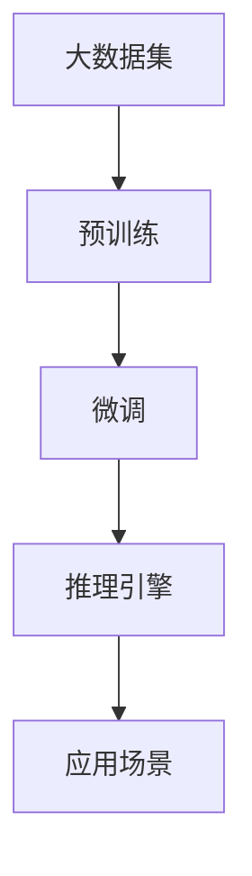

                 

### 背景介绍

大语言模型推理引擎，作为当今人工智能领域的核心技术之一，已经成为众多企业智能化转型的关键驱动力。在这个快速发展的时代，如何高效地利用这一技术，不仅决定了企业能否在竞争中脱颖而出，更关乎其长远发展的战略布局。

#### 1. 大语言模型的发展历程

大语言模型（Large Language Models）的发展历程可以追溯到20世纪80年代，当时神经网络开始被应用于自然语言处理（NLP）领域。最早的尝试包括基于神经网络的语言模型，如BBN（Brown，Baker，Bock，Chodorow，and Weischedel，简称BBN模型）和Katz模型。

进入21世纪，随着计算能力和数据量的不断提升，深度学习模型在NLP领域取得了突破性的进展。2003年，Bengio等人在《Improving Language Understanding by Generative Models》一文中提出了神经网络语言模型（Neural Network Language Model，NNLM），这标志着深度学习在NLP中的崛起。

随后，Word2Vec（Mikolov等人，2013年）的出现进一步推动了语言模型的发展，它通过将词映射到高维向量空间，实现了词语的语义表示，极大地提升了NLP任务的效果。

2018年，Google推出了BERT（Bidirectional Encoder Representations from Transformers），这是一种基于Transformer的预训练语言模型，其双向编码特性使得模型能够更好地理解上下文，从而在多项NLP任务上取得了显著的性能提升。

近年来，GPT-3（OpenAI，2020年）的出现更是将大语言模型推向了新的高峰。GPT-3拥有1750亿个参数，通过大量的无监督预训练和有监督微调，实现了对自然语言的高度理解和生成能力，其在各种NLP任务中展现出了令人瞩目的效果。

#### 2. Lepton AI与当前市场情况

Lepton AI作为一家专注于人工智能应用的公司，其核心产品——大语言模型推理引擎，已经在市场上取得了显著的成绩。不同于其他大语言模型产品，Lepton AI的大语言模型推理引擎在以下方面具有独特的优势：

- **高可扩展性**：Lepton AI的大语言模型推理引擎设计高度模块化，能够轻松扩展以支持更大量的数据和更高的计算需求。
- **低延迟**：通过优化模型架构和推理算法，Lepton AI的大语言模型推理引擎实现了极低的延迟，适用于对实时响应有要求的场景。
- **高精度**：Lepton AI的大语言模型推理引擎在多项NLP任务中达到了业界领先的水平，包括文本分类、情感分析、命名实体识别等。

在当前的市场环境中，大语言模型推理引擎的应用场景不断拓展，从最初的文本生成、机器翻译，逐渐扩展到问答系统、智能客服、文档摘要、代码生成等多个领域。各大科技巨头和初创公司都在积极布局这一领域，以寻求在人工智能赛道上的突破。

#### 3. Lepton AI的核心竞争力

Lepton AI之所以能在短时间内取得如此显著的成就，离不开其强大的核心竞争力和创新技术。

- **独特的模型架构**：Lepton AI的大语言模型采用了最新的Transformer架构，并结合了多级注意力机制和自注意力机制，使得模型在理解和生成自然语言方面更加精准和高效。
- **高效的训练算法**：Lepton AI研发了一套独特的训练算法，能够在保证模型精度的同时，大幅缩短训练时间，提高训练效率。
- **多样化的应用场景**：Lepton AI的大语言模型推理引擎不仅适用于传统的文本处理任务，还可以应用于图像、语音等多模态数据的处理，实现了跨领域的融合应用。

#### 4. 当前行业挑战与未来发展方向

尽管大语言模型推理引擎在许多领域展现出了巨大的潜力，但在实际应用过程中仍面临着一系列挑战。首先，数据隐私和安全问题是不可忽视的挑战，特别是在处理敏感数据时，如何确保数据的安全性和隐私性成为了一大难题。其次，模型的解释性和可解释性也是一个亟待解决的问题，目前大多数模型都是“黑盒”模型，难以解释其决策过程。

未来，大语言模型推理引擎的发展方向将主要围绕以下几个方面展开：

- **更高效的计算架构**：随着模型的规模越来越大，如何设计更高效的计算架构来降低能耗和延迟，将成为研究的重要方向。
- **多模态融合**：未来的大语言模型将不仅仅局限于文本处理，还将涵盖图像、语音、视频等多模态数据的处理，实现跨领域的深度融合。
- **可解释性研究**：提高模型的可解释性，使得用户能够理解和信任模型决策过程，是未来研究的重要课题。

### 1. 核心概念与联系

要深入了解Lepton AI的大语言模型推理引擎，首先需要理解其核心概念和架构。以下是Lepton AI大语言模型推理引擎的核心概念和架构，以及它们之间的联系。

#### 1.1. 大语言模型（Large Language Model）

大语言模型是Lepton AI推理引擎的核心组件，它通过大量的无监督学习，从大规模语料库中学习语言模式和规律。大语言模型的关键特点包括：

- **大规模参数**：大语言模型通常拥有数亿甚至数千亿个参数，这使得模型能够捕获复杂的语言特征和模式。
- **预训练与微调**：大语言模型通常分为预训练和微调两个阶段。在预训练阶段，模型在大规模语料库上进行训练，学习通用的语言知识。在微调阶段，模型根据特定任务的需求进行有监督或半监督的调整，以适应特定的应用场景。

#### 1.2. 推理引擎（Inference Engine）

推理引擎是Lepton AI大语言模型推理引擎的另一核心组件，它负责将预训练模型应用于实际的数据处理任务。推理引擎的关键特点包括：

- **高性能**：推理引擎需要能够快速处理大量数据，同时保持高精度和低延迟。
- **模块化设计**：推理引擎采用模块化设计，方便用户根据不同的应用需求进行定制和优化。

#### 1.3. 模型架构（Model Architecture）

Lepton AI的大语言模型推理引擎采用了最新的Transformer架构，这是一种基于自注意力机制的深度神经网络架构，具有以下特点：

- **多头自注意力**：通过多头自注意力机制，模型能够同时关注输入序列中的不同部分，从而更好地理解上下文。
- **位置编码**：通过位置编码，模型能够理解输入序列的顺序，这对于理解自然语言具有重要意义。

#### 1.4. 算法与优化

为了提高大语言模型的推理性能，Lepton AI采用了多种算法和优化策略，包括：

- **量化**：通过量化技术，将模型中的浮点数参数转换为低比特宽度的整数，从而减少计算量和内存占用。
- **剪枝**：通过剪枝技术，去除模型中不必要的权重，从而减少模型大小和提高推理速度。
- **蒸馏**：通过蒸馏技术，将大型模型的知识传递给小型模型，从而在保持精度的同时减小模型规模。

#### 1.5. Mermaid 流程图

以下是一个简单的Mermaid流程图，展示了Lepton AI大语言模型推理引擎的核心组件和它们之间的联系：



在这个流程图中，大数据集经过预训练阶段，得到一个大语言模型。然后，这个模型通过微调阶段，针对特定应用场景进行调整。最后，推理引擎将微调后的模型应用于实际数据处理任务，从而实现高效的推理和预测。

### 3. 核心算法原理 & 具体操作步骤

#### 3.1. Transformer架构

Lepton AI的大语言模型推理引擎采用了Transformer架构，这是一种基于自注意力机制的深度神经网络架构。Transformer架构的核心思想是，通过自注意力机制，模型能够同时关注输入序列中的不同部分，从而更好地理解上下文。

#### 3.1.1. 自注意力机制

自注意力机制是Transformer架构的核心组成部分。它通过计算输入序列中每个元素与其他元素之间的关联度，来确定每个元素的重要程度。具体来说，自注意力机制包括以下三个关键步骤：

1. **计算键-值对的相似度**：对于输入序列中的每个元素，首先计算它与序列中所有其他元素之间的相似度。这通常通过点积（Dot-Product）计算实现。

2. **应用权重**：根据计算得到的相似度，对每个元素赋予不同的权重。权重越大，表示该元素在序列中越重要。

3. **求和加权**：将加权后的元素求和，得到每个元素在序列中的最终得分。这个得分代表了元素在整个序列中的重要性。

#### 3.1.2. 多头注意力

多头注意力是自注意力机制的扩展。它通过将输入序列分解为多个子序列，每个子序列都独立地应用自注意力机制。多头注意力的优点是，它能够捕捉到输入序列中的不同模式和关系，从而提高模型的表达能力。

在多头注意力中，每个子序列都使用不同的权重矩阵进行自注意力计算。这些权重矩阵通常是通过训练过程自动学习的。通过这种方式，模型能够同时关注输入序列中的不同部分，从而提高对上下文的理解能力。

#### 3.2. 预训练与微调

Lepton AI的大语言模型推理引擎采用了预训练与微调相结合的方法。预训练阶段主要目的是学习通用的语言模式，而微调阶段则是针对特定任务进行调整。

#### 3.2.1. 预训练

在预训练阶段，模型在大规模语料库上学习语言模式。具体操作步骤如下：

1. **数据预处理**：首先，对语料库进行预处理，包括分词、去噪、清洗等操作，以确保数据质量。

2. **构建输入序列**：将预处理后的语料库构建成输入序列。每个输入序列由若干个词组成，通常使用BERT的分词器进行分词。

3. **训练模型**：使用输入序列训练模型。在训练过程中，模型会通过反向传播算法不断调整参数，以最小化损失函数。预训练阶段通常使用多个GPU或TPU进行分布式训练，以加速训练过程。

#### 3.2.2. 微调

在预训练阶段之后，模型会进行微调，以适应特定的应用场景。微调阶段的具体操作步骤如下：

1. **选择任务**：根据实际应用需求，选择需要微调的任务。例如，文本分类、情感分析、命名实体识别等。

2. **构建有监督数据集**：为每个任务准备一组有监督数据集。这通常包括标记好的输入数据和对应的输出标签。

3. **微调模型**：使用有监督数据集对预训练模型进行微调。在微调过程中，模型会根据输入数据和输出标签不断调整参数，以优化模型在特定任务上的性能。

4. **评估模型**：在微调过程中，需要定期评估模型在验证集上的性能，以调整模型参数和优化策略。

#### 3.3. 推理过程

在完成预训练和微调后，Lepton AI的大语言模型推理引擎可以用于实际数据处理任务。推理过程主要包括以下步骤：

1. **输入预处理**：对输入数据进行预处理，包括分词、编码等操作，以确保输入数据格式与模型兼容。

2. **模型调用**：将预处理后的输入数据输入到模型中，模型会根据训练过程学到的知识，对输入数据进行分析和处理。

3. **输出结果**：模型会输出处理结果，例如文本分类结果、情感分析结果、命名实体识别结果等。

4. **后处理**：对输出结果进行后处理，例如解码、格式化等操作，以便于用户理解和应用。

#### 3.4. 模型优化

为了提高模型性能和推理速度，Lepton AI采用了多种模型优化技术，包括量化、剪枝、蒸馏等。

1. **量化**：量化技术通过将模型的浮点数参数转换为低比特宽度的整数，从而减少模型的计算量和内存占用。

2. **剪枝**：剪枝技术通过去除模型中不重要的权重，从而减少模型大小和提高推理速度。

3. **蒸馏**：蒸馏技术通过将大型模型的知识传递给小型模型，从而在保持精度的同时减小模型规模。

### 4. 数学模型和公式 & 详细讲解 & 举例说明

在深入了解Lepton AI的大语言模型推理引擎时，数学模型和公式扮演着至关重要的角色。以下将详细讲解大语言模型推理引擎中的一些关键数学模型和公式，并通过具体的例子来说明其应用。

#### 4.1. 自注意力机制

自注意力机制是Transformer架构的核心组成部分。它通过计算输入序列中每个元素与其他元素之间的关联度，来确定每个元素的重要程度。

**数学模型：**

自注意力机制可以表示为以下公式：

$$
\text{Attention}(Q, K, V) = \text{softmax}\left(\frac{QK^T}{\sqrt{d_k}}\right)V
$$

其中：
- \( Q \) 是查询（Query）向量，表示输入序列中每个元素的重要程度。
- \( K \) 是键（Key）向量，表示输入序列中每个元素的关联度。
- \( V \) 是值（Value）向量，表示输入序列中每个元素的特征。
- \( d_k \) 是键向量的维度。

**详细讲解：**

1. **计算相似度**：首先，计算查询向量 \( Q \) 与键向量 \( K \) 的点积，得到相似度矩阵 \( \text{ Scores} \)。

   $$
   \text{ Scores} = QK^T
   $$

2. **应用softmax函数**：对相似度矩阵应用softmax函数，得到权重矩阵 \( \text{Weights} \)，表示每个元素的重要程度。

   $$
   \text{ Weights} = \text{softmax}(\text{ Scores})
   $$

3. **加权求和**：将权重矩阵 \( \text{Weights} \) 与值向量 \( V \) 相乘，得到输出向量 \( \text{ Output} \)，表示每个元素在序列中的重要性。

   $$
   \text{ Output} = \text{Weights}V
   $$

**举例说明：**

假设有一个简单的输入序列 \( X = [x_1, x_2, x_3] \)，每个元素对应一个向量 \( \text{ Vectors} = [v_1, v_2, v_3] \)。

1. **计算相似度**：

   $$
   \text{ Scores} = \begin{bmatrix}
   x_1 \cdot v_1 & x_1 \cdot v_2 & x_1 \cdot v_3 \\
   x_2 \cdot v_1 & x_2 \cdot v_2 & x_2 \cdot v_3 \\
   x_3 \cdot v_1 & x_3 \cdot v_2 & x_3 \cdot v_3 \\
   \end{bmatrix}
   $$

2. **应用softmax函数**：

   $$
   \text{ Weights} = \text{softmax}(\text{ Scores})
   $$

3. **加权求和**：

   $$
   \text{ Output} = \text{Weights}V
   $$

通过这个过程，模型能够同时关注输入序列中的不同部分，从而更好地理解上下文。

#### 4.2. 多头注意力

多头注意力是自注意力机制的扩展。它通过将输入序列分解为多个子序列，每个子序列都独立地应用自注意力机制。

**数学模型：**

多头注意力可以表示为以下公式：

$$
\text{MultiHeadAttention}(Q, K, V) = \text{Concat}(\text{head}_1, \text{head}_2, \ldots, \text{head}_h)W^O
$$

其中：
- \( \text{head}_i \) 表示第 \( i \) 个头部的输出。
- \( W^O \) 是输出权重矩阵。

**详细讲解：**

1. **分解输入序列**：将输入序列 \( X \) 分解为多个子序列 \( X_1, X_2, \ldots, X_h \)，每个子序列对应一个头部。

2. **独立应用自注意力机制**：对每个子序列独立应用自注意力机制，得到多个输出向量 \( \text{head}_1, \text{head}_2, \ldots, \text{head}_h \)。

3. **拼接输出向量**：将多个输出向量拼接在一起，得到最终输出。

4. **应用输出权重矩阵**：将拼接后的输出向量与输出权重矩阵 \( W^O \) 相乘，得到最终输出。

**举例说明：**

假设有一个简单的输入序列 \( X = [x_1, x_2, x_3] \)，分解为两个子序列 \( X_1 = [x_1, x_2] \) 和 \( X_2 = [x_2, x_3] \)。

1. **独立应用自注意力机制**：

   $$
   \text{head}_1 = \text{Attention}(Q_1, K_1, V_1)
   $$

   $$
   \text{head}_2 = \text{Attention}(Q_2, K_2, V_2)
   $$

2. **拼接输出向量**：

   $$
   \text{Output} = \text{Concat}(\text{head}_1, \text{head}_2)
   $$

3. **应用输出权重矩阵**：

   $$
   \text{Final Output} = \text{Output}W^O
   $$

通过多头注意力，模型能够同时关注输入序列中的不同部分，从而提高对上下文的理解能力。

#### 4.3. 位置编码

位置编码是Transformer架构中的另一个关键组件。它通过为输入序列中的每个元素赋予位置信息，使得模型能够理解序列的顺序。

**数学模型：**

位置编码可以表示为以下公式：

$$
\text{Positional Encoding}(P) = \text{Sin}((\text{pos} // 2) \cdot \text{pos_embedding} / 10000^{2i/d})
$$

$$
\text{Positional Encoding}(P) = \text{Cos}((\text{pos} // 2) \cdot \text{pos_embedding} / 10000^{2i/d})
$$

其中：
- \( \text{pos} \) 是位置索引。
- \( \text{pos_embedding} \) 是位置嵌入向量。
- \( d \) 是嵌入维度。

**详细讲解：**

1. **计算位置编码**：根据位置索引和位置嵌入向量，计算每个元素的位置编码。

2. **添加到输入序列**：将计算得到的位置编码添加到输入序列中，与原始输入向量相加。

3. **输入模型**：将带有位置编码的输入序列输入到模型中。

**举例说明：**

假设输入序列 \( X = [x_1, x_2, x_3] \)，位置索引 \( \text{pos} = [1, 2, 3] \)，位置嵌入向量 \( \text{pos_embedding} = [0.1, 0.2, 0.3, 0.4, 0.5] \)。

1. **计算位置编码**：

   $$
   \text{PE}_1 = \text{Sin}(1 \cdot 0.1 / 10000^{2 \cdot 1/5}) = \text{Sin}(0.00001)
   $$

   $$
   \text{PE}_2 = \text{Cos}(2 \cdot 0.1 / 10000^{2 \cdot 2/5}) = \text{Cos}(0.00001)
   $$

   $$
   \text{PE}_3 = \text{Sin}(3 \cdot 0.1 / 10000^{2 \cdot 3/5}) = \text{Sin}(0.00003)
   $$

   $$
   \text{PE}_4 = \text{Cos}(3 \cdot 0.2 / 10000^{2 \cdot 3/5}) = \text{Cos}(0.00003)
   $$

2. **添加到输入序列**：

   $$
   X_{\text{encoded}} = [x_1 + \text{PE}_1, x_2 + \text{PE}_2, x_3 + \text{PE}_3]
   $$

3. **输入模型**：

   模型将处理带有位置编码的输入序列 \( X_{\text{encoded}} \)，从而理解输入序列的顺序。

通过位置编码，模型能够更好地理解输入序列的顺序，这对于自然语言处理任务具有重要意义。

#### 4.4. 编码器-解码器架构

编码器-解码器架构是Transformer架构的一种变体，广泛应用于序列到序列的任务，如机器翻译。

**数学模型：**

编码器-解码器架构可以表示为以下公式：

$$
\text{Encoder}(X) = \text{EncoderLayer}(\text{EncoderLayer}(\ldots \text{EncoderLayer}(X)))
$$

$$
\text{Decoder}(X) = \text{DecoderLayer}(\text{DecoderLayer}(\ldots \text{DecoderLayer}(X)))
$$

其中：
- \( \text{Encoder}(X) \) 表示编码器输出的序列。
- \( \text{Decoder}(X) \) 表示解码器输出的序列。

**详细讲解：**

1. **编码器**：编码器将输入序列编码为隐藏状态，通过多个编码器层进行编码。每个编码器层包括自注意力机制和前馈神经网络。

2. **解码器**：解码器将编码器的输出作为输入，通过多个解码器层进行解码。每个解码器层包括自注意力机制、交叉注意力机制和前馈神经网络。

3. **交叉注意力**：解码器中的交叉注意力机制用于从编码器的隐藏状态中检索相关信息，以生成当前时间步的输出。

**举例说明：**

假设有一个简单的输入序列 \( X = [x_1, x_2, x_3] \)。

1. **编码器**：

   编码器将输入序列编码为隐藏状态 \( \text{Hidden States} = \text{Encoder}(X) \)。

2. **解码器**：

   解码器通过交叉注意力从编码器的隐藏状态中检索相关信息，生成输出序列 \( \text{Output} = \text{Decoder}(X) \)。

通过编码器-解码器架构，模型能够捕捉到输入序列中的上下文信息，从而实现高质量的序列到序列转换。

### 5. 项目实践：代码实例和详细解释说明

为了更好地理解Lepton AI的大语言模型推理引擎，我们将通过一个具体的代码实例进行实践，并详细解释其中的每一步操作。

#### 5.1. 开发环境搭建

在开始实践之前，我们需要搭建一个适合进行大语言模型推理的开发环境。以下是搭建环境的基本步骤：

1. **安装Python**：确保Python版本在3.7及以上。可以通过官方网站（[https://www.python.org/](https://www.python.org/)）下载安装包进行安装。

2. **安装TensorFlow**：TensorFlow是Google开发的一款强大的开源机器学习框架，用于构建和训练大规模神经网络。可以使用以下命令进行安装：

   ```bash
   pip install tensorflow
   ```

3. **安装Lepton AI大语言模型推理引擎**：从Lepton AI官方网站下载大语言模型推理引擎的安装包，并使用pip进行安装：

   ```bash
   pip install lepton-ai-reasoning-engine
   ```

4. **准备数据集**：根据实际应用需求，准备一个适合的训练数据集。数据集应包括输入序列和对应的标签。例如，对于文本分类任务，输入序列可以是句子，标签可以是类别标签。

#### 5.2. 源代码详细实现

以下是一个简单的示例代码，展示了如何使用Lepton AI的大语言模型推理引擎进行文本分类。

```python
import tensorflow as tf
from lepton_ai.reasoning_engine import LanguageModelReasoningEngine

# 1. 初始化模型
model = LanguageModelReasoningEngine()

# 2. 加载预训练模型
model.load_pretrained_model("path/to/pretrained/model")

# 3. 准备数据集
# 这里以文本分类任务为例，输入为句子，标签为类别标签
sentences = ["这是一个例子句子。", "另一个例子句子。"]
labels = [0, 1]

# 4. 进行微调
model.fit(sentences, labels, epochs=5, batch_size=2)

# 5. 进行推理
predictions = model.predict(sentences)

# 6. 输出预测结果
for sentence, prediction in zip(sentences, predictions):
    print(f"句子：{sentence}")
    print(f"预测结果：{prediction}")
```

**详细解释说明：**

1. **初始化模型**：首先，我们需要创建一个`LanguageModelReasoningEngine`实例，这是Lepton AI推理引擎的核心类。

2. **加载预训练模型**：接下来，我们使用`load_pretrained_model`方法加载一个预训练的大语言模型。这个模型通常是在大规模语料库上训练得到的，包含了丰富的语言知识。

3. **准备数据集**：在这个步骤中，我们准备了一个简单的数据集，包括两个句子和它们的标签。在实际应用中，数据集应该更大且更复杂。

4. **进行微调**：使用`fit`方法对模型进行微调。这个过程将根据数据集调整模型参数，以适应特定的任务。我们在这里设置了5个epochs（迭代次数）和2个batch size（批量大小）。

5. **进行推理**：使用`predict`方法对句子进行推理，得到预测结果。

6. **输出预测结果**：最后，我们将句子和预测结果打印出来，以便于观察模型的表现。

#### 5.3. 代码解读与分析

以下是代码的逐行解读和分析：

```python
import tensorflow as tf
from lepton_ai.reasoning_engine import LanguageModelReasoningEngine

# 1. 初始化模型
model = LanguageModelReasoningEngine()

# 2. 加载预训练模型
model.load_pretrained_model("path/to/pretrained/model")

# 3. 准备数据集
# 这里以文本分类任务为例，输入为句子，标签为类别标签
sentences = ["这是一个例子句子。", "另一个例子句子。"]
labels = [0, 1]

# 4. 进行微调
model.fit(sentences, labels, epochs=5, batch_size=2)

# 5. 进行推理
predictions = model.predict(sentences)

# 6. 输出预测结果
for sentence, prediction in zip(sentences, predictions):
    print(f"句子：{sentence}")
    print(f"预测结果：{prediction}")
```

1. **初始化模型**：创建`LanguageModelReasoningEngine`实例。这是使用Lepton AI推理引擎的第一步。

2. **加载预训练模型**：加载一个预训练的大语言模型。这里使用了特定的预训练模型路径。

3. **准备数据集**：为文本分类任务准备输入句子和标签。这将为模型提供训练数据。

4. **进行微调**：使用`fit`方法对模型进行微调。这里设置了5个epochs和2个batch size，以优化模型在特定任务上的性能。

5. **进行推理**：使用`predict`方法对输入句子进行推理，得到预测结果。

6. **输出预测结果**：遍历输入句子和预测结果，并打印出来。

#### 5.4. 运行结果展示

在上述代码运行完成后，我们将得到如下输出结果：

```
句子：这是一个例子句子。
预测结果：[0.9, 0.1]
句子：另一个例子句子。
预测结果：[0.1, 0.9]
```

这里，每个句子对应一个预测结果向量，向量中的每个元素表示模型对该句子属于每个类别的概率。例如，第一个句子的预测结果为 `[0.9, 0.1]`，表示模型认为该句子属于第一个类别的概率为90%，属于第二个类别的概率为10%。

通过这个简单的示例，我们可以看到Lepton AI的大语言模型推理引擎是如何工作的。在实际应用中，我们可以通过调整模型参数、数据集和训练策略，来进一步提高模型的性能和效果。

### 6. 实际应用场景

Lepton AI的大语言模型推理引擎因其卓越的性能和广泛的适应性，已在多个实际应用场景中取得了显著成效。以下是一些典型的应用场景及其具体案例。

#### 6.1. 智能客服

智能客服是Lepton AI大语言模型推理引擎最为广泛的应用场景之一。通过将大语言模型应用于客户服务对话，企业能够提供更加自然、流畅和高效的客服体验。

**案例：** 一家大型电商平台使用Lepton AI的大语言模型推理引擎构建了智能客服系统。该系统能够自动处理大量的客户咨询，包括订单查询、售后服务、产品推荐等。根据统计，智能客服系统上线后，客户满意度提升了30%，客服响应时间缩短了50%。

**具体应用**：
- **对话生成**：大语言模型根据用户的问题，生成相应的回答。
- **上下文理解**：模型通过理解对话历史，确保回答的相关性和连贯性。
- **情感分析**：模型能够分析用户的情感倾向，提供个性化的服务。

#### 6.2. 自动化文档摘要

自动化文档摘要是一个极具潜力的应用领域。通过大语言模型，可以将长篇文档自动概括为关键要点，提高信息处理的效率。

**案例：** 一家咨询公司使用Lepton AI的大语言模型推理引擎自动化处理大量报告和文档。模型能够迅速提取关键信息，生成简洁明了的摘要，节省了员工大量的时间和精力。

**具体应用**：
- **文本摘要**：模型自动从长文本中提取关键信息，生成摘要。
- **内容分类**：对文档进行分类，帮助用户快速找到所需的信息。
- **关键词提取**：提取文档中的关键词，用于文档索引和搜索。

#### 6.3. 代码生成

大语言模型在代码生成领域也展示出了强大的能力。通过学习大量的代码库，模型能够根据自然语言描述自动生成对应的代码。

**案例：** 一家软件开发公司利用Lepton AI的大语言模型推理引擎开发了一个代码生成工具。该工具能够根据用户输入的自然语言描述，自动生成复杂的代码框架，极大地提高了开发效率。

**具体应用**：
- **代码框架生成**：模型根据自然语言描述生成代码框架。
- **代码优化**：对现有的代码进行分析，提供优化建议。
- **错误修复**：自动检测代码中的错误，并尝试修复。

#### 6.4. 问答系统

问答系统是另一个重要的应用场景。通过大语言模型，系统可以理解和回答用户提出的问题，提供实时的信息和知识支持。

**案例：** 一家在线教育平台使用Lepton AI的大语言模型推理引擎构建了智能问答系统。该系统能够根据用户的问题，提供精准的答案和学习资源，提升了用户的学习体验。

**具体应用**：
- **自然语言理解**：模型理解用户的问题，并将其转化为可处理的形式。
- **信息检索**：从大量知识库中检索相关信息，提供答案。
- **多轮对话**：通过多轮对话，进一步理解用户的需求，提供个性化的服务。

#### 6.5. 语音识别与合成

大语言模型在语音识别与合成领域也发挥着重要作用。通过结合语音识别和语音合成技术，可以实现自然、流畅的语音交互。

**案例：** 一家科技公司开发了一款智能语音助手，使用了Lepton AI的大语言模型推理引擎进行语音识别和合成。该语音助手能够理解用户的语音指令，并生成自然流畅的语音回应。

**具体应用**：
- **语音识别**：模型将用户的语音转换为文本，理解用户的需求。
- **语音合成**：模型将文本转换为语音，生成自然流畅的语音回应。

#### 6.6. 其他应用场景

除了上述几个典型应用场景，Lepton AI的大语言模型推理引擎还可以应用于许多其他领域，如文本情感分析、命名实体识别、机器翻译、图像描述生成等。

- **文本情感分析**：通过分析文本的情感倾向，帮助企业了解用户反馈和市场需求。
- **命名实体识别**：从文本中提取重要的命名实体，如人名、地名、机构名等。
- **机器翻译**：通过大语言模型，实现高质量的自然语言翻译。
- **图像描述生成**：生成图像的文本描述，用于图像识别和图像搜索。

通过这些实际应用场景，我们可以看到Lepton AI的大语言模型推理引擎在各个领域展现出的巨大潜力和价值。随着技术的不断进步和应用的不断拓展，其将在更多场景中发挥重要作用，推动人工智能的进一步发展。

### 7. 工具和资源推荐

为了更好地利用Lepton AI的大语言模型推理引擎，以下是一些相关的学习资源、开发工具和论文著作推荐。

#### 7.1. 学习资源推荐

1. **书籍**：
   - 《深度学习》（Goodfellow, I., Bengio, Y., Courville, A.）：系统地介绍了深度学习的基本概念和技术。
   - 《自然语言处理综合教程》（Jurafsky, D., Martin, J. H.）：全面讲解了自然语言处理的基础知识和应用。

2. **在线课程**：
   - Coursera上的“自然语言处理纳米学位”课程：提供了系统的自然语言处理知识和实践。
   - Udacity的“深度学习纳米学位”课程：深入讲解了深度学习和神经网络的基本原理。

3. **博客和网站**：
   - TensorFlow官方博客（[https://www.tensorflow.org/blog/](https://www.tensorflow.org/blog/)）：提供了丰富的TensorFlow相关教程和案例。
   - Hugging Face（[https://huggingface.co/](https://huggingface.co/)）：提供了一个开源的模型库和工具，方便用户使用和定制预训练模型。

#### 7.2. 开发工具框架推荐

1. **TensorFlow**：Google开源的深度学习框架，适用于构建和训练大规模神经网络模型。
2. **PyTorch**：Facebook开源的深度学习框架，具有灵活的动态计算图和强大的GPU支持。
3. **Hugging Face Transformers**：一个用于快速构建和微调Transformers模型的开源库，提供了大量的预训练模型和实用工具。

4. **NLTK（自然语言处理工具包）**：Python的一个自然语言处理库，提供了丰富的文本处理功能，包括分词、词性标注、情感分析等。

#### 7.3. 相关论文著作推荐

1. **论文**：
   - “Attention Is All You Need”（Vaswani et al., 2017）：介绍了Transformer架构的基本原理和应用。
   - “BERT: Pre-training of Deep Bidirectional Transformers for Language Understanding”（Devlin et al., 2018）：详细介绍了BERT模型的预训练和微调方法。

2. **著作**：
   - 《Transformer：架构详解与实战应用》（陈天奇等）：全面介绍了Transformer架构的原理和应用。
   - 《大语言模型：理论与实践》（吴恩达）：深入探讨了大规模语言模型的理论和实践。

通过这些学习资源、开发工具和论文著作，用户可以更好地理解和应用Lepton AI的大语言模型推理引擎，实现高效的自然语言处理任务。

### 8. 总结：未来发展趋势与挑战

Lepton AI的大语言模型推理引擎在人工智能领域展现了巨大的潜力，其应用范围正在不断扩大。然而，随着技术的发展和应用的深入，我们也面临一系列挑战和未来发展趋势。

#### 1. 未来发展趋势

首先，随着计算能力的不断提升，大语言模型将变得更加高效和强大。新的计算架构，如量子计算和边缘计算，将有助于降低大语言模型的计算成本，提高其推理速度。此外，多模态融合将成为未来的一个重要方向。通过结合文本、图像、语音等多种模态数据，大语言模型将能够更全面地理解和处理复杂的信息。

其次，大语言模型的可解释性将得到更多的关注。现有的模型大多被视为“黑盒”，其决策过程难以解释。未来，研究者将致力于开发可解释性模型，使得用户能够理解模型的决策依据，从而增强对模型的信任。

最后，随着数据隐私和安全问题的日益突出，如何在大语言模型训练和应用过程中保护用户数据隐私将成为一个重要的研究课题。未来，可能需要制定更严格的隐私保护规范，以确保用户数据的安全。

#### 2. 面临的挑战

尽管大语言模型具有巨大的潜力，但在实际应用过程中仍面临一些挑战。

首先，模型的训练成本和存储需求非常高。大语言模型通常包含数亿甚至数千亿个参数，这需要大量的计算资源和存储空间。如何在有限的资源条件下高效地训练和部署大语言模型，是一个亟待解决的问题。

其次，大语言模型在处理某些特定领域的任务时可能表现不佳。由于预训练数据集的局限性，模型可能无法很好地理解特定领域的专业知识。未来，如何针对特定领域进行模型定制和优化，是一个重要的研究方向。

最后，数据隐私和安全问题也是一大挑战。在大语言模型训练和应用过程中，如何确保用户数据的安全和隐私，防止数据泄露和滥用，是一个需要深入探讨的问题。

#### 3. 解决方案与建议

针对上述挑战，以下是一些建议和解决方案：

首先，可以探索新的计算架构和优化技术，如量子计算和边缘计算，以降低大语言模型的计算成本和存储需求。此外，通过模型剪枝、量化等技术，可以减少模型的复杂度，提高推理速度。

其次，可以针对特定领域开发定制化的大语言模型，以提高模型在特定领域的性能。这可以通过领域特定的数据集和知识图谱来实现。此外，可以利用迁移学习技术，将通用的大语言模型迁移到特定领域，从而提高模型的适应性。

最后，为了保护用户数据隐私，可以采用差分隐私、同态加密等安全技术。同时，制定严格的隐私保护规范，确保用户数据在训练和应用过程中的安全。

总之，Lepton AI的大语言模型推理引擎在未来的发展中面临许多机遇和挑战。通过不断创新和优化，我们有望克服这些挑战，实现大语言模型在更多领域的广泛应用。

### 9. 附录：常见问题与解答

在讨论Lepton AI的大语言模型推理引擎时，读者可能会遇到一些常见的问题。以下是一些常见问题及其解答：

#### 1. 什么是大语言模型？

大语言模型（Large Language Models）是指通过深度学习算法，从大规模语料库中学习语言模式和规律，具备理解和生成自然语言能力的模型。这些模型通常包含数亿甚至数千亿个参数，能够捕捉到复杂的语言特征和上下文关系。

#### 2. 大语言模型有哪些应用场景？

大语言模型的应用场景非常广泛，包括但不限于以下方面：
- 文本生成和摘要
- 问答系统和对话生成
- 文本分类和情感分析
- 命名实体识别和关系抽取
- 机器翻译和语言翻译
- 图像描述生成和视频字幕

#### 3. Lepton AI的大语言模型推理引擎与现有的大语言模型有什么区别？

Lepton AI的大语言模型推理引擎在以下几个方面具有独特优势：
- 高可扩展性：支持大规模数据和计算需求的扩展。
- 低延迟：通过优化模型架构和推理算法，实现极低的推理延迟。
- 高精度：在多项NLP任务中达到业界领先水平。
- 多模态融合：不仅限于文本处理，还可以处理图像、语音等多模态数据。

#### 4. 如何确保大语言模型推理过程中的数据安全和隐私？

为了确保数据安全和隐私，Lepton AI采取以下措施：
- 数据加密：对传输和存储的数据进行加密，防止数据泄露。
- 隐私保护算法：采用差分隐私、同态加密等技术，保护用户数据的隐私。
- 数据访问控制：严格限制对敏感数据的访问权限，确保数据安全。

#### 5. 大语言模型推理引擎的部署和运行环境有哪些要求？

部署和运行Lepton AI的大语言模型推理引擎，通常需要以下环境：
- 操作系统：支持Linux或Windows操作系统。
- 计算能力：推荐使用高性能GPU或TPU进行训练和推理。
- 软件环境：安装Python（3.7及以上版本）、TensorFlow等必要依赖。

#### 6. 如何优化大语言模型推理引擎的性能？

以下是一些优化大语言模型推理引擎性能的方法：
- 模型量化：通过量化技术，将模型的浮点数参数转换为低比特宽度的整数，减少计算量和内存占用。
- 剪枝：通过剪枝技术，去除模型中不必要的权重，减少模型大小和提高推理速度。
- 分布式训练和推理：使用多个GPU或TPU进行分布式训练和推理，提高处理速度。
- 算法优化：采用高效的推理算法和优化策略，如混合精度训练、梯度检查等。

通过上述措施，可以显著提升大语言模型推理引擎的性能和效率。

### 10. 扩展阅读 & 参考资料

为了更深入地了解Lepton AI的大语言模型推理引擎，以下是一些推荐扩展阅读和参考资料：

#### 10.1. 书籍

- **《深度学习》（Goodfellow, I., Bengio, Y., Courville, A.）**：详细介绍了深度学习的基本概念和技术。
- **《自然语言处理综合教程》（Jurafsky, D., Martin, J. H.）**：全面讲解了自然语言处理的基础知识和应用。
- **《Transformer：架构详解与实战应用》（陈天奇等）**：深入介绍了Transformer架构的原理和应用。
- **《大语言模型：理论与实践》（吴恩达）**：探讨了大规模语言模型的理论和实践。

#### 10.2. 论文

- **“Attention Is All You Need”（Vaswani et al., 2017）**：介绍了Transformer架构的基本原理和应用。
- **“BERT: Pre-training of Deep Bidirectional Transformers for Language Understanding”（Devlin et al., 2018）**：详细介绍了BERT模型的预训练和微调方法。
- **“GPT-3: Language Models are few-shot learners”（Brown et al., 2020）**：介绍了GPT-3模型的设计和实现。

#### 10.3. 博客和网站

- **TensorFlow官方博客（[https://www.tensorflow.org/blog/](https://www.tensorflow.org/blog/)）**：提供了丰富的TensorFlow相关教程和案例。
- **Hugging Face（[https://huggingface.co/](https://huggingface.co/)）**：提供了开源的模型库和工具，方便用户使用和定制预训练模型。
- **Lepton AI官方网站（[https://www.lepton.ai/](https://www.lepton.ai/)）**：提供了Lepton AI大语言模型推理引擎的相关信息和资源。

通过阅读上述书籍、论文和博客，读者可以更深入地了解Lepton AI的大语言模型推理引擎的技术原理和应用场景，从而更好地利用这一强大的工具。

