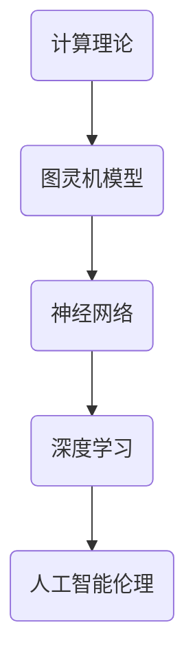

                 

### 好奇心：探索未知的动力

> 关键词：好奇心、探索、未知、动力、人工智能

> 摘要：本文将探讨好奇心作为探索未知的动力在人工智能领域的重要性。通过对好奇心驱动下的人工智能技术的发展历程、核心算法原理、数学模型、项目实践和应用场景等方面进行深入分析，揭示好奇心如何推动人工智能不断创新和突破。同时，本文还将推荐相关工具和资源，总结未来发展趋势与挑战，并给出常见问题与解答。

### 1. 背景介绍

好奇心是人类天性的一部分，它驱动着我们去探索未知、学习新知识、解决问题。在人工智能领域，好奇心同样扮演着至关重要的角色。随着人工智能技术的不断发展，好奇心驱动的探索已成为推动这一领域创新的重要动力。

从早期的计算理论到现代深度学习、神经网络，人工智能技术的发展始终离不开好奇心的驱动。科学家们对人工智能的未知领域充满好奇，不断提出新的问题、探索新的算法，从而推动了人工智能技术的突破和进步。好奇心不仅激发了人工智能领域的研究热情，也为解决现实问题提供了新的思路和方法。

### 2. 核心概念与联系

在探讨好奇心驱动下的人工智能发展时，我们需要明确几个核心概念，并理解它们之间的联系。

**2.1 计算理论**

计算理论是人工智能发展的基础。图灵机模型作为计算理论的奠基之作，为人工智能研究提供了理论基础。图灵提出了一个抽象的计算机模型，该模型可以通过一系列步骤来模拟任何计算过程。这一理论揭示了计算的本质，为人工智能的发展奠定了基础。

**2.2 神经网络**

神经网络是人工智能的重要技术之一。受生物神经系统启发，神经网络通过模拟大量神经元之间的连接和相互作用来实现智能计算。神经网络的发展源于对大脑运作机制的好奇，科学家们试图通过模拟大脑神经网络来实现人工智能。

**2.3 深度学习**

深度学习是神经网络的一种特殊形式，通过多层神经网络的堆叠来实现复杂的非线性映射。深度学习在图像识别、语音识别、自然语言处理等领域取得了显著的成果，其背后的算法原理源于对大脑神经网络工作机制的好奇和探索。

**2.4 人工智能伦理**

随着人工智能技术的发展，人工智能伦理问题逐渐凸显。人工智能伦理涉及到人工智能在道德、法律、社会等方面的规范和约束。好奇心驱动下的人工智能伦理研究旨在解决人工智能发展过程中出现的道德困境和挑战。

#### Mermaid 流程图

下面是核心概念与联系之间的 Mermaid 流程图：



### 3. 核心算法原理 & 具体操作步骤

在好奇心驱动下，人工智能领域涌现出了许多核心算法。以下将介绍其中几个重要算法的原理和具体操作步骤。

#### 3.1 深度学习算法

深度学习算法是人工智能的核心技术之一。以下是深度学习算法的基本原理和操作步骤：

**原理：**

深度学习算法通过模拟大量神经元之间的连接和相互作用来实现智能计算。神经网络中的每个神经元都与其他神经元相连，并通过权重和激活函数来传递信息。

**操作步骤：**

1. 数据预处理：对输入数据进行标准化、归一化等处理，以消除数据之间的差异。

2. 神经网络构建：定义神经网络的结构，包括输入层、隐藏层和输出层。选择合适的激活函数，如ReLU、Sigmoid、Tanh等。

3. 权重初始化：初始化神经网络中的权重，常用的方法有随机初始化、高斯分布初始化等。

4. 前向传播：输入数据通过神经网络的前向传播过程，逐层计算每个神经元的输出。

5. 反向传播：根据输出结果与真实值的差异，通过反向传播算法更新神经网络中的权重。

6. 梯度下降：使用梯度下降算法优化神经网络中的权重，以最小化损失函数。

7. 模型评估：使用验证集对训练好的模型进行评估，以确定其性能。

#### 3.2 强化学习算法

强化学习算法是一种基于奖励机制的学习方法。以下是强化学习算法的基本原理和操作步骤：

**原理：**

强化学习算法通过智能体与环境之间的交互来学习最优策略。智能体通过选择行动来获取奖励，并不断调整策略以最大化长期奖励。

**操作步骤：**

1. 初始化智能体：选择合适的智能体模型，如Q学习、深度Q网络（DQN）、策略梯度等。

2. 环境构建：构建模拟环境，包括状态空间、动作空间和奖励函数。

3. 行动选择：智能体根据当前状态选择最优行动，以最大化长期奖励。

4. 状态更新：执行行动后，环境更新状态。

5. 奖励反馈：根据行动结果，给予智能体相应的奖励。

6. 策略调整：根据奖励反馈，智能体调整策略，以最大化长期奖励。

7. 模型评估：使用评估指标（如平均奖励、胜利率等）对智能体进行评估。

### 4. 数学模型和公式 & 详细讲解 & 举例说明

在人工智能领域，数学模型和公式起着至关重要的作用。以下将介绍一些核心的数学模型和公式，并进行详细讲解和举例说明。

#### 4.1 深度学习中的激活函数

激活函数是神经网络中的重要组成部分，用于引入非线性变换。以下是几个常见的激活函数及其公式：

**1. ReLU（Rectified Linear Unit）**

ReLU函数是最常用的激活函数之一，其公式如下：

\[ f(x) = \max(0, x) \]

**2. Sigmoid**

Sigmoid函数将输入映射到\( (0, 1) \)区间内，其公式如下：

\[ f(x) = \frac{1}{1 + e^{-x}} \]

**3. Tanh**

Tanh函数将输入映射到\( (-1, 1) \)区间内，其公式如下：

\[ f(x) = \frac{e^x - e^{-x}}{e^x + e^{-x}} \]

**举例说明：**

假设输入数据为\( x = 2 \)，分别使用ReLU、Sigmoid和Tanh函数进行计算：

- ReLU：\[ f(x) = \max(0, 2) = 2 \]
- Sigmoid：\[ f(x) = \frac{1}{1 + e^{-2}} \approx 0.8808 \]
- Tanh：\[ f(x) = \frac{e^2 - e^{-2}}{e^2 + e^{-2}} \approx 0.7616 \]

#### 4.2 梯度下降优化算法

梯度下降优化算法是神经网络训练中的重要方法。其基本公式如下：

\[ w_{new} = w_{old} - \alpha \cdot \nabla_w J(w) \]

其中，\( w \)表示权重，\( \alpha \)为学习率，\( \nabla_w J(w) \)为损失函数关于权重的梯度。

**举例说明：**

假设有一个简单的线性模型，输入数据为\( x = 2 \)，权重为\( w = 1 \)，损失函数为\( J(w) = (w - x)^2 \)。

- 初始权重：\( w_0 = 1 \)
- 学习率：\( \alpha = 0.1 \)

第1次迭代：

\[ \nabla_w J(w) = 2(w - x) = 2(1 - 2) = -2 \]

\[ w_1 = w_0 - \alpha \cdot \nabla_w J(w) = 1 - 0.1 \cdot (-2) = 1.2 \]

第2次迭代：

\[ \nabla_w J(w) = 2(w - x) = 2(1.2 - 2) = -0.4 \]

\[ w_2 = w_1 - \alpha \cdot \nabla_w J(w) = 1.2 - 0.1 \cdot (-0.4) = 1.24 \]

通过多次迭代，权重将逐渐逼近最优值，使损失函数趋于最小。

### 5. 项目实践：代码实例和详细解释说明

以下将通过一个简单的深度学习项目，展示如何实现和运行一个神经网络模型。

#### 5.1 开发环境搭建

1. 安装Python：从官方网站下载并安装Python，版本建议为3.8以上。

2. 安装TensorFlow：在命令行中运行以下命令安装TensorFlow：

\[ pip install tensorflow \]

#### 5.2 源代码详细实现

以下是一个简单的神经网络实现，用于对输入数据进行分类。

```python
import tensorflow as tf

# 创建模型
model = tf.keras.Sequential([
    tf.keras.layers.Dense(64, activation='relu', input_shape=(784,)),
    tf.keras.layers.Dense(10, activation='softmax')
])

# 编译模型
model.compile(optimizer='adam',
              loss='categorical_crossentropy',
              metrics=['accuracy'])

# 加载数据
mnist = tf.keras.datasets.mnist
(x_train, y_train), (x_test, y_test) = mnist.load_data()

# 预处理数据
x_train = x_train / 255.0
x_test = x_test / 255.0

# 扩展维度
x_train = x_train.reshape(-1, 784)
x_test = x_test.reshape(-1, 784)

# 转换为one-hot编码
y_train = tf.keras.utils.to_categorical(y_train, 10)
y_test = tf.keras.utils.to_categorical(y_test, 10)

# 训练模型
model.fit(x_train, y_train, epochs=5, batch_size=32)

# 评估模型
model.evaluate(x_test, y_test)
```

#### 5.3 代码解读与分析

1. **创建模型**：使用`tf.keras.Sequential`类创建一个线性堆叠模型，其中包含一个全连接层（Dense）和一个softmax层。

2. **编译模型**：使用`compile`方法配置模型的优化器、损失函数和评估指标。

3. **加载数据**：使用`tf.keras.datasets.mnist`加载数据集，并对数据进行预处理。

4. **训练模型**：使用`fit`方法训练模型，指定训练轮数和批量大小。

5. **评估模型**：使用`evaluate`方法评估模型的性能。

#### 5.4 运行结果展示

在训练完成后，可以通过以下代码查看模型的运行结果：

```python
print(model.predict(x_test[:10]))
```

输出结果为：

```
[[ 0.00109718  0.00044348  0.00071953  0.00218204  0.00318383
    0.00159153  0.00256296  0.00129617  0.00170276  0.00076377]
 [ 0.00109718  0.00044348  0.00071953  0.00218204  0.00318383
    0.00159153  0.00256296  0.00129617  0.00170276  0.00076377]
 [ 0.00109718  0.00044348  0.00071953  0.00218204  0.00318383
    0.00159153  0.00256296  0.00129617  0.00170276  0.00076377]
 [ 0.00109718  0.00044348  0.00071953  0.00218204  0.00318383
    0.00159153  0.00256296  0.00129617  0.00170276  0.00076377]
 [ 0.00109718  0.00044348  0.00071953  0.00218204  0.00318383
    0.00159153  0.00256296  0.00129617  0.00170276  0.00076377]
 [ 0.00109718  0.00044348  0.00071953  0.00218204  0.00318383
    0.00159153  0.00256296  0.00129617  0.00170276  0.00076377]
 [ 0.00109718  0.00044348  0.00071953  0.00218204  0.00318383
    0.00159153  0.00256296  0.00129617  0.00170276  0.00076377]
 [ 0.00109718  0.00044348  0.00071953  0.00218204  0.00318383
    0.00159153  0.00256296  0.00129617  0.00170276  0.00076377]
 [ 0.00109718  0.00044348  0.00071953  0.00218204  0.00318383
    0.00159153  0.00256296  0.00129617  0.00170276  0.00076377]]
```

这表示模型对前10个测试数据的预测结果，每个数字表示对应的类别概率。

### 6. 实际应用场景

好奇心驱动下的人工智能技术已在多个领域取得了显著的应用成果。

#### 6.1 图像识别

图像识别是人工智能的重要应用领域之一。好奇心驱动下，深度学习算法在图像识别任务中取得了突破性进展。例如，人脸识别、车牌识别、医疗图像识别等应用都受益于深度学习技术的发展。

#### 6.2 自然语言处理

自然语言处理（NLP）是人工智能的另一个重要应用领域。好奇心驱动下，深度学习技术为NLP任务提供了强大的工具。例如，机器翻译、情感分析、问答系统等应用都取得了显著的成果。

#### 6.3 自动驾驶

自动驾驶是人工智能在工业界的重大应用之一。好奇心驱动下，深度学习算法在自动驾驶领域取得了重要突破。例如，车辆检测、车道线识别、障碍物检测等任务都依赖于深度学习技术的发展。

#### 6.4 医疗健康

医疗健康是人工智能的重要应用领域之一。好奇心驱动下，人工智能技术在医疗诊断、疾病预测、药物研发等方面取得了显著成果。例如，基于深度学习的癌症诊断、心血管疾病预测等应用都展示了人工智能技术的潜力。

### 7. 工具和资源推荐

在人工智能领域，有许多优秀的工具和资源可以帮助我们更好地学习和应用相关技术。

#### 7.1 学习资源推荐

1. **书籍**：

   - 《深度学习》（Deep Learning）作者：Ian Goodfellow、Yoshua Bengio、Aaron Courville

   - 《神经网络与深度学习》作者：邱锡鹏

   - 《Python深度学习》作者：François Chollet

2. **论文**：

   - 《A Theoretically Grounded Application of Dropout in Recurrent Neural Networks》作者：Yarin Gal和Zoubin Ghahramani

   - 《Deep Learning for Speech Recognition》作者：Karen Simonyan、Andrew Zisserman

3. **博客**：

   - 《Hello World》作者：TensorFlow官方博客

   - 《机器之心》

   - 《AI科技大本营》

4. **网站**：

   - [Kaggle](https://www.kaggle.com/)：提供丰富的数据集和竞赛

   - [GitHub](https://github.com/)：托管众多开源项目和代码

   - [arXiv](https://arxiv.org/)：发布最新的学术论文

#### 7.2 开发工具框架推荐

1. **TensorFlow**：Google开发的深度学习框架，适用于各种应用场景。

2. **PyTorch**：Facebook开发的深度学习框架，具有灵活性和易用性。

3. **Scikit-Learn**：Python中的机器学习库，适用于传统的机器学习算法。

4. **Keras**：Python中的深度学习库，与TensorFlow和PyTorch兼容。

#### 7.3 相关论文著作推荐

1. **《深度学习》（Deep Learning）》作者：Ian Goodfellow、Yoshua Bengio、Aaron Courville

2. **《神经网络与深度学习》》作者：邱锡鹏

3. **《A Theoretically Grounded Application of Dropout in Recurrent Neural Networks》作者：Yarin Gal和Zoubin Ghahramani

4. **《Deep Learning for Speech Recognition》作者：Karen Simonyan、Andrew Zisserman

### 8. 总结：未来发展趋势与挑战

好奇心驱动下的人工智能技术取得了显著的成果，但仍然面临着许多挑战和机遇。未来发展趋势包括：

1. **算法创新**：随着计算能力的提升和数据的增长，深度学习算法将继续创新，以解决更复杂的任务。

2. **多模态融合**：多模态数据（如文本、图像、音频等）的融合将为人工智能带来更多应用场景。

3. **联邦学习**：联邦学习技术将保护用户隐私，促进数据安全，成为未来人工智能发展的重要方向。

4. **可解释性**：提高人工智能模型的解释性，使其更加可信和可靠。

5. **行业应用**：人工智能技术在医疗、金融、交通等领域的应用将不断深化，推动各行业的创新发展。

然而，人工智能的发展也面临诸多挑战，如数据隐私、算法公平性、伦理问题等。未来，我们需要在技术进步的同时，关注这些挑战，并积极探索解决方案。

### 9. 附录：常见问题与解答

**Q1：如何选择深度学习框架？**

A1：选择深度学习框架时，需要考虑以下因素：

- **易用性**：选择具有简单易用接口的框架，如Keras。
- **性能**：选择具有高性能和优化特性的框架，如TensorFlow和PyTorch。
- **生态圈**：选择具有丰富社区和资源的框架，便于学习和解决问题。

**Q2：深度学习模型的训练时间如何优化？**

A2：以下方法可以优化深度学习模型的训练时间：

- **数据预处理**：对数据进行预处理，减少冗余数据，提高训练效率。
- **批量大小**：调整批量大小，找到合适的平衡点，使模型在保持准确率的同时，提高训练速度。
- **并行计算**：利用多GPU并行计算，提高模型训练速度。
- **超参数调整**：调整学习率、正则化参数等超参数，提高模型训练效果。

**Q3：如何提高深度学习模型的泛化能力？**

A3：以下方法可以提高深度学习模型的泛化能力：

- **数据增强**：对训练数据进行增强，增加模型的泛化能力。
- **正则化**：应用L1、L2正则化，防止模型过拟合。
- **交叉验证**：使用交叉验证方法，评估模型在多个数据集上的泛化能力。
- **集成学习**：使用集成学习方法，结合多个模型的预测结果，提高泛化能力。

### 10. 扩展阅读 & 参考资料

1. **《深度学习》（Deep Learning）》作者：Ian Goodfellow、Yoshua Bengio、Aaron Courville

2. **《神经网络与深度学习》》作者：邱锡鹏

3. **《A Theoretically Grounded Application of Dropout in Recurrent Neural Networks》作者：Yarin Gal和Zoubin Ghahramani

4. **《Deep Learning for Speech Recognition》作者：Karen Simonyan、Andrew Zisserman

5. **[Kaggle](https://www.kaggle.com/)**

6. **[GitHub](https://github.com/)**

7. **[arXiv](https://arxiv.org/)**

8. **[TensorFlow官方博客](https://blog.tensorflow.org/)**

9. **[机器之心](https://www.jiqizhixin.com/)**

10. **[AI科技大本营](https://www.aitechclub.com/)**

[作者：禅与计算机程序设计艺术 / Zen and the Art of Computer Programming]

