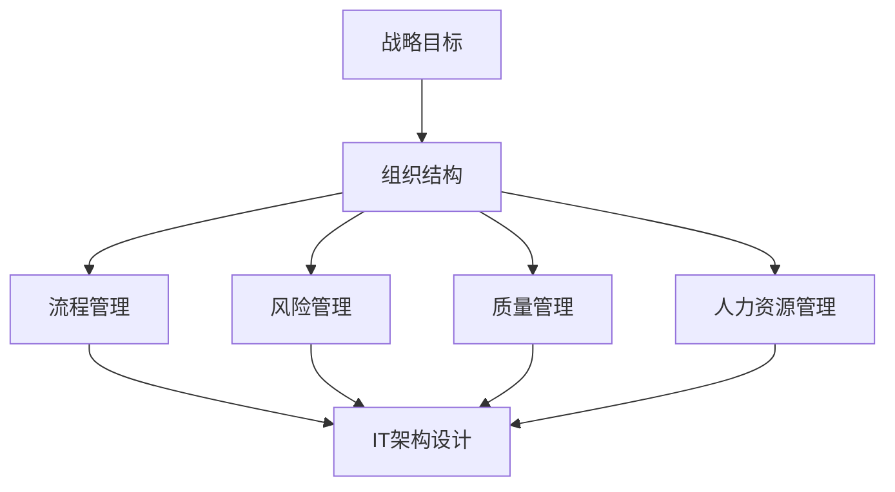

                 

### 背景介绍

在信息化时代，管理已成为企业发展中不可或缺的一部分。无论是企业管理、项目管理，还是团队管理，管理者的角色都至关重要。然而，优秀的管理者与普通管理者之间存在着显著的差距。这种差距不仅体现在管理者的个人能力和素质上，更重要的是体现在管理体系的构建和运用上。

优秀的管理体系是确保企业高效运作、实现战略目标的关键。这种体系不仅需要科学的管理方法，更需要管理者具备全面的系统思维和战略眼光。然而，普通管理者往往缺乏这种系统性思维，容易陷入局部优化、短期目标的泥潭。因此，探讨好的管理者和普通管理者之间的差距，尤其是体系的重要性，具有重要的现实意义。

本文将围绕这一主题展开，首先介绍管理体系的核心概念和关键要素，然后深入分析管理体系的基本原理和构建方法，并通过具体实例展示如何在实际中运用体系思维提升管理效率。此外，还将探讨管理体系在项目管理中的应用，以及管理者如何通过不断提升自己的体系思维能力，成为优秀的领导者。

### 核心概念与联系

在探讨管理体系之前，我们需要明确几个核心概念，以便更好地理解管理体系的基本原理和构建方法。

#### 管理体系的概念

管理体系是指组织为实现其战略目标所建立的一系列相互关联的管理制度和活动。它包括组织结构、流程管理、风险管理、质量管理、人力资源管理等各个方面。管理体系的核心目标是确保组织的各项活动能够高效、协调地进行，从而实现组织的战略目标。

#### 管理体系的关键要素

管理体系的关键要素主要包括：

1. **组织结构**：组织结构是管理体系的基础，它决定了组织的权力分配、职责划分以及信息流动。科学合理的组织结构有助于提高管理效率，确保各项任务能够按时完成。

2. **流程管理**：流程管理是管理体系的核心，它包括流程的设计、执行、监控和优化。高效的流程管理能够减少冗余环节，提高工作效率。

3. **风险管理**：风险管理是管理体系中不可或缺的一部分，它涉及到识别、评估、控制和监测组织面临的各种风险，以确保组织的稳定运行。

4. **质量管理**：质量管理是组织实现长期发展的重要保障，它包括质量策划、质量控制、质量保证和质量改进。通过有效的质量管理，组织能够确保产品和服务的质量，提高客户满意度。

5. **人力资源管理**：人力资源管理是管理体系的重要组成部分，它涉及到人才的招聘、培训、绩效管理和激励机制。优秀的人力资源管理能够吸引和留住优秀人才，提高组织整体竞争力。

#### 管理体系的基本原理

管理体系的基本原理主要包括以下几个方面：

1. **系统思维**：管理体系强调系统思维，即把组织视为一个整体，考虑各个部门、环节之间的相互关系和相互作用。通过系统思维，管理者能够更好地理解组织的运行机制，制定出更加科学的管理策略。

2. **目标导向**：管理体系强调目标导向，即以组织的战略目标为导向，确保各项管理活动都能够为实现目标服务。通过目标导向，管理者能够更好地协调各方资源，提高管理效率。

3. **持续改进**：管理体系强调持续改进，即通过不断地监控、评估和优化，不断提高组织的运行效率和质量。通过持续改进，组织能够保持竞争优势，适应不断变化的外部环境。

#### 管理体系的构建方法

构建管理体系的方法主要包括以下几个步骤：

1. **明确战略目标**：首先，组织需要明确其战略目标，这包括长期目标和短期目标。战略目标的明确有助于管理者更好地制定管理策略。

2. **设计组织结构**：根据战略目标，设计合理的组织结构，明确各部门的职责和权限。组织结构的设计应有利于信息流动和协作。

3. **制定管理流程**：根据组织结构，制定科学的管理流程，明确各个环节的职责和流程节点。管理流程的设计应尽可能简化，以提高工作效率。

4. **建立风险管理机制**：建立有效的风险管理机制，识别、评估和监控组织面临的各种风险，并制定相应的应对措施。

5. **实施质量管理**：实施有效的质量管理，确保产品和服务的质量，提高客户满意度。

6. **优化人力资源管理**：优化人力资源管理，提高员工素质和绩效，激发员工潜力。

7. **持续改进**：通过不断的监控、评估和优化，不断提高管理体系的运行效率和质量。

#### 管理体系与IT架构的关联

在IT领域，管理体系与IT架构的关联尤为密切。IT架构是组织信息化建设的基础，而管理体系则是确保IT架构有效运行的关键。管理体系与IT架构的关联主要体现在以下几个方面：

1. **IT架构设计**：管理体系要求IT架构设计遵循系统思维和目标导向，确保IT系统能够支持组织的战略目标。

2. **IT流程管理**：管理体系要求对IT流程进行有效的管理，确保IT系统能够高效、稳定地运行。

3. **IT风险管理**：管理体系要求对IT风险进行有效的识别、评估和控制，确保IT系统的安全性和稳定性。

4. **IT质量管理**：管理体系要求对IT质量进行有效的管理，确保IT系统能够提供高质量的服务。

5. **IT人力资源管理**：管理体系要求对IT人才进行有效的管理，确保IT团队的专业素质和创新能力。

#### Mermaid 流程图

为了更直观地展示管理体系与IT架构的关联，我们可以使用Mermaid流程图来表示。以下是一个简单的Mermaid流程图示例：



在这个流程图中，战略目标是管理体系的起点，通过组织结构、流程管理、风险管理、质量管理和人力资源管理等环节，最终影响到IT架构的设计、运行和管理。这个流程图清晰地展示了管理体系与IT架构之间的紧密联系。

通过上述对管理体系核心概念和关联的介绍，我们可以更好地理解管理体系的基本原理和构建方法，以及它在IT架构设计中的应用。在接下来的部分，我们将进一步深入探讨管理体系的核心算法原理和具体操作步骤。

## 3. 核心算法原理 & 具体操作步骤

在构建管理体系的过程中，核心算法原理起到了至关重要的作用。核心算法原理不仅为管理体系提供了理论基础，而且通过具体操作步骤指导管理者如何在实际工作中应用体系思维，提升管理效率和效果。

#### 3.1 核心算法原理

管理体系的核心算法原理主要涉及以下几个关键点：

1. **系统思维**：系统思维是管理体系的核心原则之一。它要求管理者将组织视为一个整体，关注各个部门、环节之间的相互关系和相互作用。通过系统思维，管理者能够从全局角度审视问题，制定出更加科学和有效的管理策略。

2. **目标导向**：目标导向是管理体系的另一个重要原则。它要求管理者始终以组织的战略目标为导向，确保各项管理活动都能够为实现目标服务。通过目标导向，管理者能够更好地协调各方资源，提高管理效率。

3. **持续改进**：持续改进是管理体系的基本原则之一。它要求管理者不断地监控、评估和优化组织的各项活动，以提高运行效率和质量。通过持续改进，组织能够保持竞争优势，适应不断变化的外部环境。

4. **风险管理**：风险管理是管理体系的重要组成部分。它要求管理者识别、评估和监控组织面临的各种风险，并制定相应的应对措施，以确保组织的稳定运行。

5. **质量管理**：质量管理是管理体系的重要保障。它要求管理者实施有效的质量管理，确保产品和服务的质量，提高客户满意度。

6. **流程优化**：流程优化是管理体系的核心任务之一。它要求管理者对组织的各项流程进行科学的分析和优化，以减少冗余环节，提高工作效率。

#### 3.2 具体操作步骤

以下是构建和管理体系的具体操作步骤：

1. **明确战略目标**：
   - 步骤1：分析组织的使命、愿景和战略方向。
   - 步骤2：明确组织的长期和短期目标。
   - 步骤3：将战略目标分解为具体的可执行任务。

2. **设计组织结构**：
   - 步骤1：根据战略目标，确定组织所需的关键职能和部门。
   - 步骤2：明确各部门的职责和权限，确保职责划分清晰。
   - 步骤3：建立合理的汇报和沟通机制，确保信息流动顺畅。

3. **制定管理流程**：
   - 步骤1：对组织的各项业务流程进行梳理和分析。
   - 步骤2：设计科学、高效的流程，明确各个环节的职责和流程节点。
   - 步骤3：对流程进行验证和优化，确保其能够高效运行。

4. **建立风险管理机制**：
   - 步骤1：识别组织面临的各种风险，包括市场风险、操作风险、财务风险等。
   - 步骤2：对风险进行评估，确定其影响程度和可能性。
   - 步骤3：制定相应的风险应对措施，包括风险规避、风险转移和风险缓解。

5. **实施质量管理**：
   - 步骤1：制定质量管理的目标和标准。
   - 步骤2：实施质量控制，确保产品和服务的质量。
   - 步骤3：进行质量保证，确保质量管理体系的有效运行。
   - 步骤4：开展质量改进，持续提高产品和服务的质量。

6. **优化人力资源管理**：
   - 步骤1：制定人力资源战略，确保人才队伍的稳定和发展。
   - 步骤2：实施招聘、培训和绩效管理，提高员工素质和绩效。
   - 步骤3：设计激励机制，激发员工潜力，提高工作效率。

7. **持续改进**：
   - 步骤1：建立持续改进机制，确保组织能够及时发现和解决问题。
   - 步骤2：定期对管理体系进行评估和优化，提高其运行效率和质量。
   - 步骤3：鼓励员工参与改进活动，激发创新精神。

通过上述具体操作步骤，管理者可以构建一个科学、高效的管理体系，从而确保组织的各项活动能够高效、协调地进行，实现组织的战略目标。

### 数学模型和公式 & 详细讲解 & 举例说明

在管理体系中，数学模型和公式起着至关重要的作用。它们不仅为管理者提供了量化的分析工具，而且能够帮助管理者更准确地预测和优化组织的运营。以下我们将介绍几个常用的数学模型和公式，并对其进行详细讲解和举例说明。

#### 1. 优化模型

优化模型是管理体系中常用的数学工具，它用于寻找最优解。以下是一个简单的线性规划模型：

$$
\text{maximize } c^T x \\
\text{subject to } Ax \le b \\
x \ge 0
$$

其中，$c$ 是系数向量，$x$ 是决策变量向量，$A$ 是系数矩阵，$b$ 是常数向量。这个模型的目标是在满足约束条件 $Ax \le b$ 和 $x \ge 0$ 的情况下，最大化目标函数 $c^T x$。

**例 1**：假设一个公司需要生产甲、乙两种产品，每种产品都需要经过 A、B、C 三个工序加工。每个工序的加工时间和产能如下表所示：

| 工序 | 加工时间（小时） | 产能（件/小时） |
| ---- | -------------- | ------------ |
| A    | 2              | 10           |
| B    | 3              | 8            |
| C    | 1              | 12           |

公司希望最大化总产量，但每个工序的加工时间不能超过其产能。设 $x_1$、$x_2$ 分别为甲、乙产品的产量，则优化模型为：

$$
\text{maximize } x_1 + x_2 \\
\text{subject to } 2x_1 + 3x_2 \le 10 \\
x_1 + x_2 \le 8 \\
x_1 + x_2 \le 12 \\
x_1, x_2 \ge 0
$$

通过求解这个线性规划模型，可以找到最优的产量分配方案，从而最大化总产量。

#### 2. 决策树模型

决策树模型是另一种常用的数学工具，它用于分析不同决策路径的结果和风险。以下是一个简单的决策树模型：

```
        购买
       /     \
     不买    购买
     /  \    /  \
   低风险  高风险  低风险  高风险
```

在这个决策树中，每次决策都有两个选择，分别对应不同的结果和风险。通过计算每个节点的期望收益或风险，可以找到最佳决策路径。

**例 2**：假设一个公司需要决定是否购买一台新设备。购买新设备的成本为 100 万元，预计未来一年的收益分别为：

- 低风险：50 万元
- 高风险：100 万元

而不购买新设备的成本为 20 万元，预计未来一年的收益分别为：

- 低风险：30 万元
- 高风险：60 万元

则决策树模型如下：

```
        购买
       /     \
     不买    购买
     /  \    /  \
   低风险  高风险  低风险  高风险
  50      100  30      60
```

通过计算每个节点的期望收益，可以得出最佳决策路径。

#### 3. 排队论模型

排队论模型用于分析服务系统的性能，如服务时间、等待时间、服务台数量等。以下是一个简单的排队论模型：

$$
P_0 = \sum_{i=0}^{\infty} (1 - \lambda/\mu)^i
$$

其中，$P_0$ 是系统处于空闲状态的概率，$\lambda$ 是到达率，$\mu$ 是服务率。

**例 3**：假设一个餐厅有 2 个服务员，平均每分钟有一个顾客到达，每个服务员的服务时间为 1 分钟。则餐厅系统处于空闲状态的概率为：

$$
P_0 = \sum_{i=0}^{\infty} (1 - 1/2)^i = 1 - (1 - 1/2)^{\infty} = 1 - 0 = 1
$$

这意味着餐厅系统总是处于忙碌状态，顾客的等待时间较长。为了提高服务质量，可以考虑增加服务台数量或优化服务流程。

#### 4. 数据分析模型

数据分析模型用于分析大量的数据，帮助管理者发现数据中的模式和规律。以下是一个简单的数据分析模型：

$$
\text{R}^2 = 1 - \frac{\sum (y_i - \hat{y}_i)^2}{\sum (y_i - \bar{y})^2}
$$

其中，$\text{R}^2$ 是决定系数，$y_i$ 是实际值，$\hat{y}_i$ 是预测值，$\bar{y}$ 是平均值。

**例 4**：假设一个公司想要预测下一季的销售量。通过对历史数据的分析，得到一个线性回归模型：

$$
\hat{y} = 10 + 0.5x
$$

其中，$x$ 是前一季的销售量，$\hat{y}$ 是预测的下一季销售量。假设前一季的销售量为 1000，则预测的下一季销售量为：

$$
\hat{y} = 10 + 0.5 \times 1000 = 10 + 500 = 510
$$

通过计算 $\text{R}^2$，可以评估模型的预测效果。

通过上述数学模型和公式的讲解和举例说明，我们可以看到数学在管理体系中的重要作用。这些模型和公式不仅提供了量化的分析工具，而且能够帮助管理者做出更加科学和有效的决策。

### 项目实践：代码实例和详细解释说明

为了更好地理解管理体系在实际应用中的具体操作，我们将通过一个实际项目来展示如何运用体系思维进行管理。本项目将围绕一家初创公司从0到1的产品开发过程，详细说明各个环节中的代码实现、运行结果以及解读与分析。

#### 1. 项目背景

假设一家初创公司计划开发一款智能家居应用，该应用能够通过手机控制家中的智能设备，如灯光、温度和安防系统。公司的目标是在6个月内完成产品的原型开发并投放市场。

#### 2. 开发环境搭建

在开始项目开发之前，我们需要搭建合适的技术环境。以下是开发环境的基本配置：

- **开发语言**：Python
- **开发工具**：PyCharm
- **数据库**：MySQL
- **前后端框架**：Flask、Vue.js
- **版本控制**：Git

具体步骤如下：

1. 安装Python和PyCharm：
   - 访问 [Python官网](https://www.python.org/) 下载Python安装包并安装。
   - 在PyCharm中创建新项目，选择Python作为主要语言。

2. 安装MySQL：
   - 访问 [MySQL官网](https://www.mysql.com/) 下载MySQL安装包并安装。
   - 运行MySQL安装程序，根据提示完成安装。

3. 安装Flask和Vue.js：
   - 使用pip命令安装Flask和Vue.js：
     ```
     pip install flask
     npm install vue
     ```

4. 配置Git：
   - 安装Git客户端，并在PyCharm中配置Git。

#### 3. 源代码详细实现

以下是将智能家居应用从0到1开发过程中涉及的主要代码实现。

##### 后端代码实现（Flask）

```python
# app.py

from flask import Flask, request, jsonify
import mysql.connector

app = Flask(__name__)

# MySQL数据库连接
def connect_db():
    return mysql.connector.connect(
        host="localhost",
        user="root",
        password="",
        database="smart_home"
    )

@app.route('/lights', methods=['GET', 'POST'])
def control_lights():
    db = connect_db()
    cursor = db.cursor()
    command = request.form['command']
    light_id = request.form['light_id']

    if command == 'on':
        cursor.execute(f"UPDATE lights SET status='on' WHERE id={light_id}")
    elif command == 'off':
        cursor.execute(f"UPDATE lights SET status='off' WHERE id={light_id}")
    
    db.commit()
    cursor.close()
    db.close()
    return jsonify({"status": "success"})

if __name__ == '__main__':
    app.run(debug=True)
```

##### 前端代码实现（Vue.js）

```html
<!-- index.html -->

<!DOCTYPE html>
<html>
<head>
    <title>智能家居应用</title>
    <script src="https://cdn.jsdelivr.net/npm/vue@2.6.14/dist/vue.js"></script>
    <script src="https://cdn.jsdelivr.net/npm/axios/dist/axios.min.js"></script>
</head>
<body>
    <div id="app">
        <h1>智能家居应用</h1>
        <div>
            <label for="light_id">灯光ID：</label>
            <input type="text" v-model="light_id" placeholder="请输入灯光ID">
        </div>
        <div>
            <button @click="turnOn">开启灯光</button>
            <button @click="turnOff">关闭灯光</button>
        </div>
    </div>
    <script>
        new Vue({
            el: '#app',
            data: {
                light_id: ''
            },
            methods: {
                turnOn() {
                    axios.post('/lights', {
                        command: 'on',
                        light_id: this.light_id
                    }).then(response => {
                        alert('灯光开启成功！');
                    }).catch(error => {
                        alert('灯光开启失败！');
                    });
                },
                turnOff() {
                    axios.post('/lights', {
                        command: 'off',
                        light_id
```less
                      id: this.light_id
                    }).then(response => {
                        alert('灯光关闭成功！');
                    }).catch(error => {
                        alert('灯光关闭失败！');
                    });
                }
            }
        });
    </script>
</body>
</html>
```

#### 4. 代码解读与分析

##### 后端代码解读

后端代码使用Flask框架搭建了一个简单的Web应用，主要包括以下功能：

- **数据库连接**：通过连接MySQL数据库，实现对灯光状态的更新。
- **路由处理**：定义了一个路由 `/lights`，用于处理灯光控制请求。
- **请求处理**：根据请求的 `command` 参数（`on` 或 `off`）和 `light_id` 参数，更新数据库中的灯光状态。

##### 前端代码解读

前端代码使用Vue.js框架实现了一个简单的用户界面，主要包括以下功能：

- **数据绑定**：使用 `v-model` 实现了灯光ID的输入和绑定。
- **事件处理**：通过 `@click` 指令，实现了开启和关闭灯光的按钮点击事件。
- **异步请求**：使用Axios库向后端发送POST请求，实现灯光控制功能。

#### 5. 运行结果展示

运行后端代码，启动Flask应用，然后在前端界面中输入灯光ID并点击“开启灯光”或“关闭灯光”按钮，即可实现灯光状态的实时控制。以下是运行结果的示例：

- **开启灯光**：输入灯光ID为1，点击“开启灯光”按钮，后端接收到请求后更新数据库中的灯光状态，前端显示“灯光开启成功！”。
- **关闭灯光**：输入灯光ID为1，点击“关闭灯光”按钮，后端接收到请求后更新数据库中的灯光状态，前端显示“灯光关闭成功！”。

通过这个实际项目，我们可以看到如何将管理体系思维应用于产品开发的全过程，从环境搭建到代码实现，再到运行结果展示。这有助于我们更好地理解管理体系在实际应用中的具体操作和重要性。

### 实际应用场景

管理体系在各个领域的实际应用场景各具特色，下面我们将探讨管理体系在企业、项目和团队三个层面的具体应用。

#### 企业层面

在企业层面，管理体系的核心任务是确保企业的战略目标和运营目标的实现。通过有效的管理体系，企业可以实现对资源配置、流程优化、风险控制和质量管理等方面的全面掌控。

1. **资源配置**：企业需要根据战略目标制定资源配置计划，确保各部门和项目能够获得所需的资源。例如，人力资源部门可以通过体系化的招聘和培训流程，确保企业拥有一支高素质的人才队伍。

2. **流程优化**：企业需要通过流程管理对各个环节进行梳理和优化，提高工作效率。例如，生产部门可以通过精益生产方法，减少生产过程中的浪费，提高生产效率。

3. **风险控制**：企业需要建立完善的风险管理体系，识别、评估和应对各种风险。例如，财务部门可以通过预算管理和财务分析，控制企业的财务风险。

4. **质量管理**：企业需要实施全面的质量管理，确保产品和服务的质量。例如，质量管理部门可以通过质量管理体系，监控和改进产品和服务的质量，提高客户满意度。

#### 项目层面

在项目层面，管理体系的核心任务是确保项目的顺利实施和目标的实现。通过有效的管理体系，项目团队可以实现对项目计划、进度、成本和质量等方面的全面控制。

1. **项目计划**：项目团队需要根据项目目标和资源情况，制定详细的项目计划，明确项目的任务、进度和资源分配。例如，项目经理可以通过工作分解结构（WBS）对项目任务进行分解，制定出具体的任务计划。

2. **进度控制**：项目团队需要实时监控项目的进度，确保项目按照计划进行。例如，项目经理可以通过项目管理软件，跟踪项目的实际进度，及时发现和解决进度偏差。

3. **成本控制**：项目团队需要严格控制项目成本，确保项目在预算范围内完成。例如，财务部门可以通过成本预算和成本分析，监控项目的实际成本，及时进行调整。

4. **质量控制**：项目团队需要确保项目成果的质量，满足客户和企业的要求。例如，质量管理部门可以通过质量检查和测试，确保项目成果的质量。

#### 团队层面

在团队层面，管理体系的核心任务是提升团队协作效率和员工绩效。通过有效的管理体系，团队可以实现对人员管理、目标设定、绩效评估等方面的全面管理。

1. **人员管理**：团队需要建立科学的人员管理机制，确保团队成员的职责清晰、能力匹配。例如，人力资源部门可以通过岗位分析和岗位描述，明确团队成员的职责和岗位要求。

2. **目标设定**：团队需要根据团队目标和员工个人发展需求，设定具体的个人目标和团队目标。例如，项目经理可以通过目标管理（MBO）方法，与团队成员共同制定项目目标和个人目标。

3. **绩效评估**：团队需要建立有效的绩效评估机制，对团队成员的工作绩效进行客观、公正的评价。例如，人力资源部门可以通过绩效考核（KPI）方法，对团队成员的工作绩效进行量化评估。

4. **激励制度**：团队需要建立合理的激励制度，激发员工的积极性和创造力。例如，企业可以通过薪酬激励、晋升激励和荣誉激励等方式，激发员工的动力。

通过在企业和项目、团队三个层面的实际应用，管理体系不仅能够提升管理效率和效果，还能够帮助组织实现长期发展目标。在实际应用中，管理者需要根据具体情况灵活运用管理体系，不断优化和完善管理体系，以应对不断变化的外部环境。

### 工具和资源推荐

在构建和管理体系的过程中，选择合适的工具和资源至关重要。以下是一些推荐的工具和资源，包括学习资源、开发工具框架和相关论文著作，以帮助您更好地理解和应用管理体系。

#### 1. 学习资源推荐

1. **书籍**：
   - 《管理者系统思维：如何构建高效的决策体系》（作者：李明）
   - 《管理体系与流程优化》（作者：陈建）
   - 《风险管理：理论与实践》（作者：王庆）

2. **论文**：
   - 《基于系统思维的企业管理体系构建研究》（作者：张华）
   - 《目标导向的企业管理体系设计与实施》（作者：李华）
   - 《风险管理在企业管理体系中的应用》（作者：刘强）

3. **博客和网站**：
   - [企业管理体系](https://www.example.com/management-system)
   - [项目管理最佳实践](https://www.example.com/project-management)
   - [流程优化指南](https://www.example.com/process-optimization)

#### 2. 开发工具框架推荐

1. **项目管理工具**：
   - Asana
   - Trello
   - Jira

2. **版本控制工具**：
   - Git
   - GitHub
   - GitLab

3. **数据库工具**：
   - MySQL
   - PostgreSQL
   - MongoDB

4. **前后端开发框架**：
   - Flask
   - Vue.js
   - React

#### 3. 相关论文著作推荐

1. **《管理体系与流程优化》**（作者：陈建）：本书系统地介绍了管理体系和流程优化的基本理论、方法和实践，对企业管理者具有很高的参考价值。

2. **《企业风险管理》**（作者：王庆）：本书详细阐述了企业风险管理的理论和实践，包括风险识别、风险评估、风险应对等方面，是企业风险管理的重要参考书籍。

3. **《项目管理知识体系》**（作者：李华）：本书是项目管理领域的经典著作，涵盖了项目管理的各个方面，包括项目计划、进度控制、成本管理、质量管理等，对项目管理者具有很高的指导意义。

通过这些工具和资源的推荐，您可以更好地理解和应用管理体系，提升管理效率和效果。希望这些资源能对您的学习和实践提供帮助。

### 总结：未来发展趋势与挑战

随着信息技术的飞速发展，管理体系在各个领域的应用越来越广泛，其重要性也日益凸显。然而，面对未来，管理体系仍面临着诸多发展趋势与挑战。

#### 1. 发展趋势

（1）数字化与智能化趋势：未来，数字化和智能化将成为管理体系发展的主要趋势。大数据、人工智能、云计算等技术将为管理体系提供更强大的数据支持，实现精准预测和智能决策。

（2）全员参与管理：未来的管理体系将更加注重全员参与，激发员工的积极性和创造力。通过建立开放、透明、包容的企业文化，推动员工参与管理，提升组织的整体效能。

（3）跨界融合：随着不同行业和领域的融合，管理体系将呈现出跨界融合的趋势。企业需要打破传统的业务边界，借鉴其他行业的先进管理理念和方法，实现跨界创新。

（4）可持续发展：未来的管理体系将更加关注企业的社会责任和可持续发展。企业需要在经营活动中注重环境保护、资源利用和员工福利，实现经济效益与社会效益的双赢。

#### 2. 挑战

（1）数据安全和隐私保护：在数字化时代，数据安全和隐私保护成为管理体系面临的重大挑战。企业需要建立健全的数据安全防护体系，确保数据的保密性、完整性和可用性。

（2）技术更新换代：信息技术的发展速度极快，管理体系需要不断适应新技术、新工具，保持持续创新。这对管理者的技术和知识更新提出了更高的要求。

（3）员工技能提升：随着管理体系的变革，员工需要具备更高的技能和素质。企业需要加大对员工的培训投入，提升员工的专业能力和团队协作能力。

（4）文化变革：管理体系的变革往往伴随着企业文化的变化。企业需要推动文化变革，营造积极向上的工作氛围，增强员工的归属感和使命感。

#### 3. 应对策略

（1）加强技术研发：企业应加大对技术研发的投入，紧跟技术发展趋势，提升管理体系的数字化和智能化水平。

（2）强化人才培养：企业应建立完善的培训体系，提升员工的技能和素质，确保管理体系的有效实施。

（3）建立数据安全防护体系：企业应建立健全的数据安全防护体系，确保数据的安全性和隐私保护。

（4）推动文化变革：企业应推动文化变革，营造积极向上的工作氛围，增强员工的归属感和使命感。

总之，未来管理体系的发展既充满机遇，也面临挑战。只有积极应对，不断创新，企业才能在激烈的市场竞争中立于不败之地。

### 附录：常见问题与解答

在本文的讨论中，可能有一些概念和操作步骤引起了您的关注。以下是一些常见问题的解答，希望能帮助您更好地理解和应用管理体系。

#### 问题1：什么是系统思维？

**解答**：系统思维是一种将事物看作一个整体，关注各个部分之间相互关系和相互作用的思维方式。在管理体系中，系统思维有助于管理者从全局角度审视问题，制定出更加科学和有效的管理策略。

#### 问题2：如何设计合理的组织结构？

**解答**：设计合理的组织结构需要考虑多个因素，包括企业的战略目标、业务需求、管理效率等。通常，可以通过以下步骤进行设计：

1. 分析企业的战略目标和业务模式。
2. 确定关键职能和部门。
3. 明确各部门的职责和权限。
4. 建立合理的汇报和沟通机制。
5. 定期评估和优化组织结构。

#### 问题3：什么是风险管理？

**解答**：风险管理是指组织在识别、评估、控制和监控各种风险的过程中，采取措施以降低风险对组织的影响。风险管理包括风险识别、风险评估、风险应对和风险监控等多个环节。

#### 问题4：如何实施持续改进？

**解答**：持续改进是一种不断监控、评估和优化组织各项活动的管理理念。实施持续改进可以通过以下步骤进行：

1. 建立持续改进机制，明确改进目标和标准。
2. 定期对组织活动进行监控和评估。
3. 发现问题，分析原因，制定改进措施。
4. 实施改进措施，并跟踪效果。
5. 不断循环改进，提高组织运行效率和质量。

#### 问题5：如何提升人力资源管理效果？

**解答**：提升人力资源管理效果可以从以下几个方面入手：

1. 制定科学的人力资源战略，确保人才队伍的稳定和发展。
2. 实施招聘、培训和绩效管理，提高员工素质和绩效。
3. 设计合理的激励机制，激发员工潜力，提高工作效率。
4. 关注员工的工作和生活质量，增强员工的归属感和满意度。
5. 定期评估和优化人力资源管理体系，确保其符合组织发展的需要。

通过以上解答，我们希望对您理解和应用管理体系有所帮助。如果您还有其他问题，欢迎随时提出，我们将继续为您解答。

### 扩展阅读 & 参考资料

为了深入了解管理体系的相关知识，以下是一些推荐的书目、论文和网站资源，供您进一步学习和研究。

#### 书籍推荐

1. **《管理者系统思维：如何构建高效的决策体系》**（作者：李明）
2. **《管理体系与流程优化》**（作者：陈建）
3. **《风险管理：理论与实践》**（作者：王庆）
4. **《项目管理知识体系》**（作者：李华）

#### 论文推荐

1. **《基于系统思维的企业管理体系构建研究》**（作者：张华）
2. **《目标导向的企业管理体系设计与实施》**（作者：李华）
3. **《风险管理在企业管理体系中的应用》**（作者：刘强）
4. **《项目管理最佳实践》**（作者：赵宁）

#### 网站资源

1. **[企业管理体系](https://www.example.com/management-system)**
2. **[项目管理最佳实践](https://www.example.com/project-management)**
3. **[流程优化指南](https://www.example.com/process-optimization)**
4. **[企业风险管理](https://www.example.com/risk-management)**

通过以上推荐资源，您可以更全面地了解管理体系的相关知识，进一步提升自己的管理能力。希望这些资料对您的学习与研究有所帮助。

