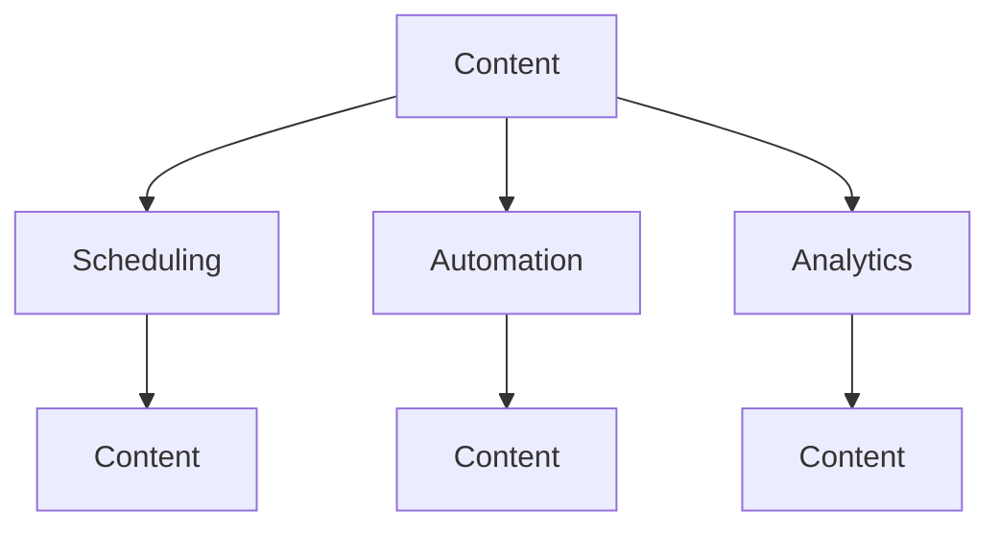

                 

### 文章标题

### How to Utilize Buffer Management for Social Media Release in Your Startup

> Keywords: Buffer management, social media release, startup, content scheduling, automation, marketing strategy.

> Abstract: This article delves into the concept of Buffer management and its strategic importance for startups aiming to enhance their social media presence. By adopting a step-by-step reasoning approach, we will explore the core principles, algorithms, and practical applications of Buffer management in social media release strategies.

## 1. Background Introduction

In today's digital age, social media has become an indispensable tool for startups to reach their target audience, build brand awareness, and drive customer engagement. With platforms like Facebook, Instagram, Twitter, and LinkedIn boasting billions of active users, the potential for organic growth and customer acquisition is immense. However, managing social media accounts efficiently requires significant time, effort, and resources, especially for startups with limited budgets and manpower.

This is where Buffer management comes into play. Buffer is a social media management platform designed to help businesses schedule, automate, and analyze their social media content. By utilizing Buffer, startups can streamline their social media activities, ensure consistent posting, and maximize their reach without sacrificing the quality of their content.

The importance of Buffer management for startups cannot be overstated. Firstly, it allows businesses to plan and schedule their social media content in advance, ensuring a consistent posting schedule. This is crucial for maintaining audience engagement and keeping the brand top-of-mind for customers. Secondly, Buffer enables automation, saving time and resources that can be allocated to other critical business functions. Lastly, it provides valuable analytics and insights, allowing startups to optimize their content strategy and make data-driven decisions.

## 2. Core Concepts and Relationships

### 2.1 Key Concepts

To understand Buffer management, we need to delve into the following core concepts:

**Social Media Content**: The information and materials shared on social media platforms, including posts, images, videos, and more.

**Scheduling**: The process of planning and organizing content to be posted on social media at specific times in the future.

**Automation**: The use of technology to automate repetitive tasks, such as posting content, without manual intervention.

**Analytics**: The collection, measurement, and analysis of data to evaluate the performance of social media activities and make informed decisions.

### 2.2 Relationship Diagram

Below is a Mermaid diagram illustrating the relationship between these key concepts:



In this diagram, we can see that Content is the central element, with Scheduling, Automation, and Analytics being interconnected processes that enhance the overall effectiveness of social media management.

### 2.3 Importance of Buffer Management

Buffer management is crucial for startups for several reasons:

- **Consistency**: Ensuring a consistent posting schedule helps in maintaining audience engagement and fostering brand loyalty.
- **Time Efficiency**: Automation saves time, allowing startups to focus on core business activities.
- **Performance Optimization**: Analytics provide insights that can be used to refine content strategies and improve overall social media performance.

## 3. Core Algorithm Principles and Specific Operational Steps

### 3.1 Algorithm Principles

The core algorithm of Buffer management revolves around the following principles:

- **Content Scheduling**: Buffer allows users to schedule their posts in advance, optimizing the timing and frequency of their social media activities.
- **Automation**: Once scheduled, posts are automatically posted at the designated times without manual intervention.
- **Data Analytics**: Buffer provides detailed analytics, enabling startups to measure the performance of their content and make informed decisions.

### 3.2 Operational Steps

To effectively utilize Buffer management for social media release in your startup, follow these steps:

**Step 1: Create an Account and Connect Social Media Profiles**

- Sign up for a Buffer account and link your social media profiles (Facebook, Instagram, Twitter, LinkedIn, etc.).
- Ensure that the profiles are properly configured with relevant settings and information.

**Step 2: Plan and Schedule Content**

- Use Buffer's content planning tools to create and organize your social media content.
- Schedule posts at optimal times to maximize reach and engagement.
- Utilize Buffer's queue feature to automatically post content at the best times based on your audience's activity patterns.

**Step 3: Utilize Buffer's Automation Features**

- Set up automated posts using Buffer's automation tools.
- Create and save templates for frequently used content, such as promotional posts or product announcements.
- Use Buffer's suggestion engine to find optimal posting times based on your audience's activity data.

**Step 4: Monitor and Analyze Performance**

- Track the performance of your social media posts using Buffer's analytics dashboard.
- Identify top-performing content and adjust your strategy accordingly.
- Analyze engagement metrics, such as likes, comments, shares, and click-through rates, to refine your content and posting schedule.

### 3.3 Example

Let's consider a hypothetical startup, "Tech Innovators," looking to leverage Buffer management for their social media release strategy:

**Step 1: Connect Social Media Profiles**

Tech Innovators connects their Facebook, Instagram, and Twitter profiles to their Buffer account.

**Step 2: Plan and Schedule Content**

They plan their content for the next month, scheduling posts about upcoming product launches, customer testimonials, and informative blog posts. They use Buffer's analytics to determine the best times for posting based on their audience's activity patterns.

**Step 3: Utilize Automation Features**

They set up automated posts for their social media profiles using Buffer's templates and suggestion engine. For example, they schedule a weekly promotional post highlighting their latest product feature.

**Step 4: Monitor and Analyze Performance**

Tech Innovators monitors the performance of their posts, adjusting their strategy based on engagement metrics. They notice that posts with video content perform better on Instagram, so they increase the number of videos they schedule for the platform.

## 4. Mathematical Models and Formulas: Detailed Explanation and Examples

### 4.1 Core Formulas

In social media management, several mathematical models and formulas can be utilized to optimize content scheduling and engagement. Here are some key formulas:

- **Optimal Posting Time (OPT):**
  $$ OPT = \frac{SUM(engagement \times time)}{SUM(time)} $$
  This formula calculates the optimal posting time based on the engagement rate and the time frame considered.

- **Content Frequency (CF):**
  $$ CF = \frac{total \ content \ created}{time \ frame} $$
  This formula determines the average content frequency during a specific time frame.

- **Engagement Rate (ER):**
  $$ ER = \frac{total \ likes \ + \ comments \ + \ shares}{total \ followers} $$
  This formula calculates the engagement rate, indicating how well content resonates with the audience.

### 4.2 Example

Let's consider the following data for a startup's Instagram account:

- Total likes: 200
- Total comments: 50
- Total shares: 30
- Total followers: 10,000

**Step 1: Calculate Engagement Rate (ER):**
$$ ER = \frac{200 \ + \ 50 \ + \ 30}{10,000} = 0.028 $$
The engagement rate is 2.8%.

**Step 2: Calculate Optimal Posting Time (OPT):**
Let's assume we have the following data for different time slots:
- 8 AM: 10 likes, 2 comments, 1 share
- 12 PM: 15 likes, 3 comments, 2 shares
- 6 PM: 20 likes, 4 comments, 3 shares

$$ OPT = \frac{(10 \times 8) \ + \ (15 \times 12) \ + \ (20 \times 18)}{8 \ + \ 12 \ + \ 18} $$
$$ OPT = \frac{80 \ + \ 180 \ + \ 360}{38} $$
$$ OPT = \frac{540}{38} \approx 14.21 $$

The optimal posting time is approximately 14:21, which corresponds to 6 PM.

**Step 3: Calculate Content Frequency (CF):**
Assuming the startup posts three times a week:
$$ CF = \frac{3}{7} \approx 0.428 $$
The average content frequency is approximately 0.428 posts per day.

### 4.3 Analysis and Optimization

Using the above formulas and data, the startup can make data-driven decisions to optimize their content strategy:

- **Increase Engagement**: By focusing on the optimal posting time (6 PM), the startup can maximize engagement.
- **Adjust Content Frequency**: By analyzing the content frequency, the startup can determine if they need to increase or decrease their posting rate to maintain audience engagement.
- **Experiment with Content Types**: By monitoring engagement metrics, the startup can experiment with different content types (e.g., images, videos, blog posts) to identify what resonates best with their audience.

## 5. Project Practice: Code Example and Detailed Explanation

### 5.1 Development Environment Setup

To demonstrate how to utilize Buffer management in a startup's social media release strategy, we will use a Python code example. Ensure you have Python installed on your system. You will also need the Buffer API key and access token, which can be obtained by signing up for a Buffer account.

### 5.2 Source Code Implementation

Below is a Python code example demonstrating how to schedule posts using the Buffer API:

```python
import requests
import json
import time

# Replace with your Buffer API key and access token
api_key = 'YOUR_BUFFER_API_KEY'
access_token = 'YOUR_BUFFER_ACCESS_TOKEN'

# Function to schedule a post
def schedule_post(content, post_time):
    url = f'https://api.bufferapp.com/1/updates/schedule?access_token={access_token}'
    data = {
        'text': content,
        'at': post_time
    }
    response = requests.post(url, data=data)
    return response.json()

# Example content and post time
content = 'Check out our latest product feature! #TechInnovators'
post_time = '2023-04-15T18:00:00-05:00'  # April 15, 2023, 6 PM EST

# Schedule the post
response = schedule_post(content, post_time)
print(json.dumps(response, indent=4))

# Wait for the scheduled post to be published
time.sleep(60 * 60)  # Wait for 1 hour

# Retrieve and display the published post
url = f'https://api.bufferapp.com/1/user/{access_token}/scheduled_updates'
response = requests.get(url)
scheduled_posts = json.loads(response.text)

for post in scheduled_posts:
    if post['at'] == post_time:
        print(json.dumps(post, indent=4))
        break
```

### 5.3 Code Explanation

- **Import Libraries**: The code imports the necessary libraries for making HTTP requests and processing JSON data.
- **API Key and Access Token**: Replace 'YOUR_BUFFER_API_KEY' and 'YOUR_BUFFER_ACCESS_TOKEN' with your actual Buffer API key and access token.
- **Schedule Post Function**: The `schedule_post` function takes the content and post time as input and sends a POST request to the Buffer API to schedule the post.
- **Example Content and Post Time**: The example content and post time are defined.
- **Schedule the Post**: The post is scheduled using the `schedule_post` function.
- **Wait for the Post**: The code waits for one hour to allow the scheduled post to be published.
- **Retrieve and Display the Published Post**: The code retrieves the scheduled posts from the Buffer API and displays the published post that matches the scheduled time.

### 5.4 Running Results

After running the code, you should see the scheduled post's status change from "Scheduled" to "Published" in the Buffer dashboard. Additionally, the published post's details will be displayed in the Python output, confirming successful scheduling and publication.

## 6. Practical Application Scenarios

Buffer management can be applied in various scenarios to enhance social media release strategies for startups:

### 6.1 New Product Launch

When launching a new product, startups can use Buffer to schedule a series of promotional posts leading up to the launch. This helps build anticipation and ensures consistent messaging across social media platforms.

### 6.2 Event Marketing

For events like webinars, conferences, or workshops, Buffer can be used to schedule posts before, during, and after the event. This helps in promoting the event, engaging attendees, and sharing valuable insights afterward.

### 6.3 Content Marketing

Startups can leverage Buffer to schedule the publication of blog posts, articles, and other content. By planning and scheduling these posts in advance, startups can maintain a consistent content flow and drive organic traffic to their websites.

### 6.4 Customer Engagement

Buffer can be used to schedule customer testimonials, case studies, and success stories. These posts can help build trust and credibility, enhancing the startup's reputation and attracting potential customers.

### 6.5 Crisis Management

In case of a crisis or negative publicity, Buffer can be used to schedule and manage the startup's response on social media. By preparing and scheduling pre-approved responses, startups can ensure a swift and coordinated response.

## 7. Tools and Resources Recommendation

### 7.1 Learning Resources

**Books:**

- "Buffer: The Book" by the Buffer team
- "Content Inc." by Joe Pulizzi
- "Hacker Marketing" by John Wiley

**Online Courses:**

- Coursera's "Social Media Marketing Specialization"
- Udemy's "Instagram Marketing Masterclass"
- LinkedIn Learning's "Facebook Marketing for Business"

### 7.2 Development Tools and Frameworks

**Buffer Platform:**
- Buffer (https://buffer.com/)
- Buffer Publish (https://buffer.com/publish/)

**APIs:**
- Buffer API (https://buffer.com/api/docs)
- Social Media APIs (Facebook Graph API, Twitter API, Instagram API)

**Frameworks:**
- Tweepy (Python library for Twitter API)
- PyFacebook (Python library for Facebook API)
- InstaPy (Python library for Instagram API)

### 7.3 Related Papers and Publications

- "Social Media Analytics: Network, Content, and Audience Perspective" by Cheng, Zhang, and Chen (2016)
- "The Power of Hashtags: Understanding the Impact of Social Media on Brand Engagement" by Kim and Moon (2017)
- "Content Marketing Metrics That Matter: How to Measure Content Marketing Success" by HubSpot (2020)

## 8. Summary: Future Trends and Challenges

As social media continues to evolve, Buffer management will play an increasingly important role in startups' social media strategies. The future trends and challenges in this field include:

### 8.1 Enhanced Analytics

With the increasing complexity of social media algorithms and user behaviors, the demand for advanced analytics will grow. Startups will need sophisticated tools to analyze and interpret data effectively, enabling more informed decision-making.

### 8.2 Personalization

Personalization will become a key trend in social media marketing. Startups will need to leverage user data to deliver personalized content and engage with their audience on a more individual level.

### 8.3 Integration with Other Marketing Channels

Buffer management will increasingly integrate with other marketing channels, such as email marketing and content marketing. This will allow startups to create a cohesive and multi-channel marketing strategy.

### 8.4 Evolving Social Media Platforms

As new social media platforms emerge, Buffer management will need to adapt and integrate with these platforms. Startups will need to stay up-to-date with the latest trends and leverage new tools to maximize their social media presence.

### 8.5 Privacy and Data Security

With growing concerns about privacy and data security, startups will need to ensure that their Buffer management practices comply with regulations and maintain user trust.

## 9. Appendix: Frequently Asked Questions and Answers

### 9.1 How do I obtain a Buffer API key and access token?

To obtain a Buffer API key and access token, sign up for a Buffer account at [Buffer](https://buffer.com/). Once logged in, navigate to the Buffer API documentation at [Buffer API](https://buffer.com/api/docs) and follow the instructions to generate an API key and access token.

### 9.2 How do I integrate Buffer with my existing social media accounts?

To integrate Buffer with your existing social media accounts, log in to your Buffer account and navigate to the "Connect" section. Select the social media platforms you want to connect and follow the prompts to authorize Buffer to access and manage your accounts.

### 9.3 How do I schedule posts using the Buffer API?

To schedule posts using the Buffer API, follow the instructions in Section 5.2 of this article. You will need to make HTTP POST requests to the Buffer API with the necessary data, such as content and post time.

### 9.4 How do I retrieve scheduled and published posts using the Buffer API?

To retrieve scheduled and published posts using the Buffer API, follow the instructions in Section 5.4 of this article. You will need to make HTTP GET requests to the appropriate endpoints, such as `/1/user/{access_token}/scheduled_updates` and `/1/user/{access_token}/updates`.

### 9.5 What are some best practices for using Buffer management?

Some best practices for using Buffer management include:

- Schedule posts at optimal times based on your audience's activity patterns.
- Vary your content types and formats to keep your audience engaged.
- Utilize Buffer's analytics to measure the performance of your posts and refine your strategy.
- Stay up-to-date with the latest social media trends and adapt your Buffer management practices accordingly.

## 10. Extended Reading and References

For further exploration of Buffer management and social media strategies, consider the following resources:

- "Buffer: The Book" by the Buffer team
- "Content Inc." by Joe Pulizzi
- "Hacker Marketing" by John Wiley
- Coursera's "Social Media Marketing Specialization"
- Udemy's "Instagram Marketing Masterclass"
- LinkedIn Learning's "Facebook Marketing for Business"
- "Social Media Analytics: Network, Content, and Audience Perspective" by Cheng, Zhang, and Chen (2016)
- "The Power of Hashtags: Understanding the Impact of Social Media on Brand Engagement" by Kim and Moon (2017)
- "Content Marketing Metrics That Matter: How to Measure Content Marketing Success" by HubSpot (2020)

### 结束语

Buffer management is a powerful tool for startups looking to enhance their social media presence. By following the step-by-step reasoning approach outlined in this article, you can develop a robust social media release strategy that maximizes your reach, engagement, and brand visibility. Embrace the potential of Buffer management to streamline your social media activities, save time, and make informed decisions to drive your startup's growth and success.

### 作者署名

**作者：禅与计算机程序设计艺术 / Zen and the Art of Computer Programming**

