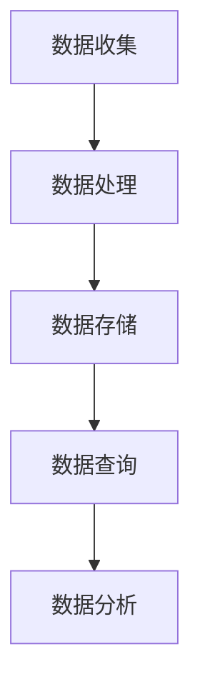
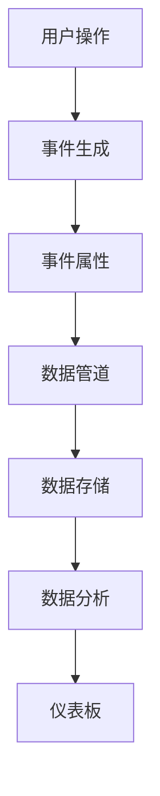

                 

### 文章标题

如何利用Mixpanel进行创业项目的用户行为分析

> 关键词：Mixpanel，用户行为分析，数据分析工具，创业项目，数据分析框架

> 摘要：本文将深入探讨如何利用Mixpanel这款强大的数据分析工具，为创业项目的用户行为分析提供有力支持。通过具体的操作步骤和实例，我们将揭示Mixpanel在数据收集、处理和可视化方面的优势，帮助创业者在激烈的市场竞争中把握用户动态，优化产品策略。

## 1. 背景介绍

在当今数字时代，用户行为分析已成为众多创业项目成功的关键。通过深入了解用户的交互模式、偏好和使用习惯，企业可以精准定位目标用户群体，进而提升用户体验，增加用户粘性和转化率。然而，对于初创企业而言，获取用户行为数据并不容易，而且数据量庞大且复杂，如何有效地分析和利用这些数据成为一大挑战。

在这个背景下，数据分析工具如Mixpanel应运而生。Mixpanel是一款专门针对移动应用和Web应用的用户行为分析工具，它能够帮助创业者快速收集、处理和可视化用户数据，从而更好地理解用户行为，指导产品迭代和优化。

Mixpanel的主要优势在于其强大的实时数据处理能力和灵活的数据分析功能。通过Mixpanel，创业者不仅可以追踪用户的基本行为数据，如点击、浏览和下载，还可以深入分析用户的转化路径、留存率和活跃度等关键指标。此外，Mixpanel还提供了丰富的数据可视化工具，帮助用户将复杂的数据转化为易于理解的图表和报告，从而支持更直观的数据驱动决策。

本文将围绕Mixpanel的核心功能和使用方法，逐步引导读者了解如何利用这款工具进行创业项目的用户行为分析。我们将从数据收集、数据处理到数据可视化，逐一剖析Mixpanel的操作步骤和应用场景，帮助读者掌握用户行为分析的核心技巧。

接下来，我们将详细介绍Mixpanel的背景和主要优势，以便读者对这款工具有一个全面的了解。

## 1.1 Mixpanel的背景

Mixpanel成立于2011年，由Ben Horowitz、James Bilefield和Aditya Agarwal共同创立。它的诞生源于对数据分析在产品开发中的重要性的深刻认识。Mixpanel的创始人希望为开发者提供一个易于使用且功能强大的工具，帮助他们在产品生命周期中更好地理解用户行为。

成立之初，Mixpanel便迅速在市场获得了关注，并吸引了大量初创企业的使用。其独特的实时数据处理能力和灵活的数据分析功能，使得Mixpanel在用户行为分析领域脱颖而出。随着时间的推移，Mixpanel不断优化和扩展其功能，成为当前最受欢迎的用户行为分析工具之一。

### 1.2 Mixpanel的主要优势

Mixpanel的主要优势在于其强大的数据处理能力和丰富的功能特性，具体包括以下几个方面：

1. **实时数据分析**：Mixpanel能够实时收集和分析用户数据，帮助创业者迅速捕捉用户行为的最新动态。这种实时性使得创业者可以更加及时地调整产品策略，优化用户体验。

2. **灵活的数据分析**：Mixpanel提供了丰富的数据指标和分析工具，创业者可以根据自己的需求自定义数据追踪和报告。这使得Mixpanel不仅适用于简单的用户行为分析，还可以用于复杂的商业智能和数据分析场景。

3. **强大的用户画像**：Mixpanel能够根据用户行为数据生成详细的用户画像，帮助创业者更好地了解用户群体，制定有针对性的营销策略。

4. **数据可视化**：Mixpanel提供了多种数据可视化工具，如图表、仪表板和报告等。这些工具能够将复杂的数据转化为易于理解的可视化内容，使得数据分析更加直观和易于操作。

5. **集成与扩展**：Mixpanel支持与多种第三方工具和服务的集成，如营销自动化平台、客户关系管理系统和数据分析工具等。这种集成能力使得Mixpanel可以更好地与其他工具协同工作，提高数据分析的整体效率。

总之，Mixpanel作为一款专业的用户行为分析工具，具有强大的数据处理能力和灵活的功能特性，为创业项目的用户行为分析提供了有力的支持。在接下来的章节中，我们将逐步深入探讨如何利用Mixpanel进行用户行为分析，帮助读者更好地掌握这一核心技能。

### 1.3 Mixpanel的核心概念与架构

在深入了解Mixpanel之前，我们需要先了解其核心概念和整体架构。Mixpanel的核心概念主要包括事件追踪、用户ID、事件类型和数据管道。这些概念构成了Mixpanel数据处理和分析的基础。

#### 事件追踪

事件追踪是Mixpanel实现用户行为分析的核心机制。简单来说，事件追踪是指记录用户在使用产品过程中的各种操作行为，如点击、滑动、下载等。这些事件被定义为数据点，通过特定的API接口发送到Mixpanel的服务器。

在Mixpanel中，每个事件都有一个唯一的标识符（Event Name），用于区分不同类型的事件。事件还可以附带额外的属性（Properties），如用户ID、操作时间、设备类型等。这些属性可以提供更多的上下文信息，帮助分析师更好地理解用户行为。

#### 用户ID

用户ID是Mixpanel追踪用户行为的另一个关键概念。每个用户在Mixpanel中都有一个唯一的用户ID，用于识别和区分不同的用户。通过用户ID，Mixpanel可以追踪用户的整个生命周期，记录其所有操作行为。

用户ID不仅可以是邮箱地址、用户名或其他标识符，还可以是匿名ID。匿名ID主要用于匿名用户的行为分析，帮助创业者了解未注册用户的行为模式，从而优化产品设计和营销策略。

#### 事件类型

事件类型是Mixpanel中的另一个重要概念。事件类型是指用户在产品中执行的不同操作行为，如登录、注册、浏览、购买等。Mixpanel提供了多种内置事件类型，用户也可以自定义事件类型以满足特定的分析需求。

不同的事件类型反映了用户在使用产品过程中的不同行为阶段。通过分析这些事件类型，创业者可以了解用户的参与度和活跃度，识别潜在的用户流失点和优化点。

#### 数据管道

数据管道是Mixpanel数据处理的核心机制。数据管道负责将来自不同渠道的数据（如Web、移动应用、API等）收集、处理和存储，并提供给用户进行进一步的分析。

数据管道的工作流程如下：

1. **数据收集**：Mixpanel通过API接口从不同的数据源（如Web应用、移动应用、第三方服务）收集事件数据。

2. **数据处理**：收集到的事件数据首先会被进行初步处理，包括去重、数据清洗和格式转换等。这些处理步骤确保数据的准确性和一致性。

3. **数据存储**：经过处理的数据会被存储在Mixpanel的数据库中，供后续的分析和查询使用。

4. **数据查询**：用户可以通过Mixpanel的查询接口，根据不同的维度和条件检索和分析数据。这些查询结果可以实时返回，支持用户进行快速的数据探索和分析。

#### Mermaid流程图

为了更好地理解Mixpanel的数据处理流程，我们可以使用Mermaid流程图来展示其各个关键环节。以下是一个简化的Mermaid流程图：



在这个流程图中，数据从数据收集环节进入Mixpanel，经过数据处理和存储后，最终通过数据查询接口供用户进行分析。

#### 数据分析

数据分析是Mixpanel的核心功能之一。通过数据分析，用户可以深入了解用户行为，识别关键指标和趋势，从而指导产品优化和决策。

Mixpanel提供了丰富的数据分析工具和功能，包括：

1. **仪表板**：仪表板是Mixpanel的核心分析工具，用户可以在仪表板上创建和自定义可视化图表，实时监控关键指标。

2. **细分**：细分功能允许用户根据不同的维度（如用户属性、行为事件等）对用户群体进行划分，以便进行更深入的分析。

3. **路径分析**：路径分析功能可以帮助用户了解用户在使用产品的过程中所经历的不同路径，识别用户的转化路径和流失路径。

4. ** cohort分析**：Cohort分析功能用于追踪特定时间段内的一组用户的行为和表现，帮助用户了解用户的生命周期和活跃度。

5. **预测分析**：预测分析功能可以根据历史数据预测未来的用户行为和趋势，为产品规划和决策提供数据支持。

### 1.4 Mixpanel的核心算法原理

Mixpanel的核心算法原理主要涉及用户行为的追踪和数据分析。以下是Mixpanel的核心算法原理和具体操作步骤：

#### 用户行为追踪

1. **事件定义**：首先，需要定义需要追踪的用户行为事件。这些事件可以是任何用户在产品中的操作，如点击、滑动、下载、购买等。每个事件都有一个唯一的标识符（Event Name），用于在Mixpanel中区分不同的事件。

2. **事件属性**：除了事件名称外，还可以为事件添加额外的属性（Properties），如用户ID、操作时间、设备类型、地理位置等。这些属性提供了更多的上下文信息，有助于更准确地分析用户行为。

3. **事件发送**：通过Mixpanel提供的API接口，将定义好的事件数据发送到Mixpanel服务器。事件发送可以是同步的，也可以是异步的，以适应不同的应用场景。

4. **数据预处理**：Mixpanel会在接收事件数据后进行初步的数据预处理，包括数据去重、格式转换和数据清洗等。这些步骤确保数据的准确性和一致性。

#### 数据分析

1. **事件解析**：在Mixpanel的服务器端，会对收到的数据进行解析，提取出事件名称、事件属性和用户ID等信息。

2. **数据存储**：解析后的数据会被存储在Mixpanel的数据库中，供后续的分析和查询使用。

3. **数据分析**：用户可以通过Mixpanel的查询接口，根据不同的维度和条件检索和分析数据。这些查询结果可以实时返回，支持用户进行快速的数据探索和分析。

#### 数据分析算法

1. **统计分析**：Mixpanel提供了丰富的统计分析功能，包括平均值、中位数、标准差、百分比等。通过这些统计分析，用户可以了解用户行为的总体趋势和分布情况。

2. **细分分析**：细分分析功能允许用户根据不同的维度（如用户属性、行为事件等）对用户群体进行划分，以便进行更深入的分析。

3. **路径分析**：路径分析功能可以帮助用户了解用户在使用产品的过程中所经历的不同路径，识别用户的转化路径和流失路径。

4. ** cohort分析**：Cohort分析功能用于追踪特定时间段内的一组用户的行为和表现，帮助用户了解用户的生命周期和活跃度。

5. **预测分析**：预测分析功能可以根据历史数据预测未来的用户行为和趋势，为产品规划和决策提供数据支持。

### 1.5 Mixpanel在创业项目中的实际应用

Mixpanel在创业项目中的实际应用广泛，可以涵盖用户获取、用户留存和用户增长等各个方面。以下是一些具体的应用场景：

1. **用户获取**：通过Mixpanel，创业者可以追踪新用户的来源渠道，分析不同渠道的用户获取效果，从而优化营销策略，提高用户转化率。

2. **用户留存**：Mixpanel可以帮助创业者了解用户在产品中的活跃度和留存率，识别导致用户流失的关键因素，从而采取针对性的措施提高用户留存率。

3. **用户增长**：通过分析用户的行为数据，创业者可以识别高价值用户群体，制定有针对性的增长策略，提高用户增长速度。

4. **产品优化**：Mixpanel提供的用户行为分析数据，可以帮助创业者了解用户在产品中的使用习惯和痛点，从而指导产品设计和迭代，提高用户体验和满意度。

### 1.6 Mixpanel与其他数据分析工具的比较

在用户行为分析领域，除了Mixpanel，还有许多其他优秀的数据分析工具，如Google Analytics、Kissmetrics和Amplitude等。以下是对这些工具的比较：

1. **Google Analytics**：Google Analytics是Google推出的免费数据分析工具，主要适用于网站和网页分析。它提供了丰富的数据报告和细分功能，但实时性较差，且无法深入分析用户行为。

2. **Kissmetrics**：Kissmetrics是一款专业的用户行为分析工具，专注于用户生命周期分析。它提供了详细的用户行为跟踪和细分功能，但价格较高，不适合初创企业。

3. **Amplitude**：Amplitude是一款功能强大的用户行为分析工具，具有实时数据处理能力和丰富的数据分析功能。与Mixpanel类似，它也适用于各种规模的企业，但价格相对较高。

总体来说，Mixpanel在实时数据分析、灵活性和集成性方面具有显著优势，适合初创企业进行用户行为分析。而Google Analytics适用于简单的网站分析，Kissmetrics和Amplitude则适合需要深入用户行为分析的中大型企业。

### 1.7 小结

通过本章节的介绍，我们了解了Mixpanel的背景、主要优势、核心概念与架构、核心算法原理以及在创业项目中的实际应用。Mixpanel作为一款强大的用户行为分析工具，能够帮助创业者更好地了解用户行为，优化产品策略，提高用户体验和满意度。在接下来的章节中，我们将进一步探讨如何利用Mixpanel进行用户行为分析的具体操作步骤和实际应用案例。

## 2. 核心概念与联系

为了深入理解Mixpanel的工作原理和应用，我们需要首先掌握其核心概念和整体架构。以下是Mixpanel的核心概念及其相互关系：

### 2.1 核心概念

**用户ID（User ID）**：用户ID是Mixpanel用来唯一标识用户的标识符。每个用户在Mixpanel中都有一个唯一的用户ID，通过这个ID，Mixpanel能够追踪用户在应用程序中的所有行为。

**事件（Event）**：事件是用户在应用程序中执行的操作，如点击、浏览、购买等。每个事件都可以附带一些属性（Properties），例如事件发生的日期和时间、用户的地理位置、使用的设备类型等。

**属性（Property）**：属性是事件中的额外信息，用于描述事件的特征。例如，一个“购买”事件可能包含属性“产品ID”、“价格”和“购买时间”。

**数据管道（Data Pipeline）**：数据管道是Mixpanel处理和存储用户事件数据的核心机制。它负责接收、清洗、存储和提供数据查询。

**仪表板（Dashboard）**：仪表板是Mixpanel提供的数据可视化工具，用于展示和分析关键指标。用户可以创建自定义仪表板，添加各种图表和报告。

### 2.2 关系与联系

**用户ID与事件**：用户ID与事件紧密关联。每次用户在应用程序中执行操作时，都会生成一个事件，并关联到对应的用户ID。这样，Mixpanel可以追踪每个用户的所有行为。

**事件与属性**：事件可以包含多个属性，这些属性提供了事件的详细信息。例如，一个“登录”事件可以包含用户ID、登录时间、登录设备类型等属性。

**数据管道与数据存储**：数据管道负责从应用程序中收集事件数据，并将其传输到Mixpanel的数据库中进行存储。数据管道还包括数据清洗和格式转换的过程，以确保数据的准确性和一致性。

**仪表板与数据分析**：仪表板是数据分析的界面。用户可以在仪表板上添加各种图表和报告，以可视化关键指标。通过仪表板，用户可以实时监控和分析用户行为。

### 2.3 Mermaid流程图

以下是一个简化的Mermaid流程图，展示了Mixpanel的核心概念和数据处理流程：



在这个流程图中：

- **A**：用户在应用程序中执行操作。
- **B**：生成事件。
- **C**：事件包含属性。
- **D**：数据管道处理和传输数据。
- **E**：数据存储在Mixpanel数据库中。
- **F**：进行数据分析。
- **G**：仪表板可视化数据。

### 2.4 数据处理流程

Mixpanel的数据处理流程主要包括以下几个步骤：

1. **事件收集**：应用程序通过Mixpanel的API接口收集用户事件数据。
2. **数据清洗**：数据管道对收集到的事件数据执行去重、数据清洗和格式转换等操作。
3. **数据存储**：清洗后的数据被存储在Mixpanel的数据库中，供后续分析使用。
4. **数据查询**：用户可以通过Mixpanel的查询接口检索和分析数据，生成可视化报告。

### 2.5 数据分析功能

Mixpanel提供了丰富的数据分析功能，包括：

1. **仪表板**：用户可以创建自定义仪表板，添加各种图表和报告，实时监控关键指标。
2. **细分**：通过细分功能，用户可以根据不同的属性对用户群体进行划分，进行更深入的分析。
3. **路径分析**：用户可以分析用户在应用程序中的行为路径，了解用户的转化路径和流失路径。
4. ** cohorts分析**：cohorts分析用于追踪特定时间段内的一组用户的行为和表现，了解用户的生命周期。
5. **预测分析**：预测分析可以根据历史数据预测未来的用户行为和趋势。

### 2.6 小结

通过本章节的介绍，我们详细了解了Mixpanel的核心概念、数据处理流程和数据分析功能。这些核心概念和联系构成了Mixpanel工作的基础，使得创业者能够有效地进行用户行为分析，优化产品策略。在下一章节中，我们将深入探讨Mixpanel的核心算法原理和具体操作步骤，帮助读者更好地理解和应用Mixpanel。

### 2.6 Mixpanel的核心算法原理 & 具体操作步骤

在了解了Mixpanel的核心概念和数据管道之后，接下来我们将深入探讨其核心算法原理和具体操作步骤，以便读者能够更好地理解和应用Mixpanel进行用户行为分析。

#### 2.6.1 用户行为的追踪方法

Mixpanel通过追踪用户在应用程序中的操作行为来实现用户行为分析。具体操作步骤如下：

1. **定义事件**：首先，需要定义应用程序中需要追踪的事件类型。例如，“登录”、“注册”、“浏览”、“点击”等。每个事件都有一个唯一的标识符（Event Name）。

2. **设置事件属性**：为每个事件设置属性，以便更好地描述事件的细节。例如，“登录”事件可以包含属性“用户ID”、“登录时间”、“登录设备类型”等。

3. **事件发送**：通过Mixpanel提供的API接口，将定义好的事件数据发送到Mixpanel服务器。发送可以是同步的，也可以是异步的，具体取决于应用场景。

4. **事件处理**：Mixpanel服务器接收事件数据后，会对数据进行初步处理，包括数据去重、格式转换和数据清洗等，以确保数据的准确性和一致性。

#### 2.6.2 用户ID的追踪与关联

在Mixpanel中，用户ID是追踪用户行为的核心。以下是用户ID的追踪与关联方法：

1. **创建用户ID**：当用户首次使用应用程序时，系统会自动创建一个唯一的用户ID，并与用户的账户信息（如邮箱地址、用户名等）关联。

2. **追踪用户行为**：通过用户ID，Mixpanel能够追踪用户在应用程序中的所有行为事件。每次用户操作都会生成一个事件，并关联到对应的用户ID。

3. **用户ID关联**：Mixpanel允许用户将不同的用户ID进行关联，以便追踪匿名用户或跨设备用户的行为。这对于了解用户的完整行为轨迹至关重要。

#### 2.6.3 数据处理与存储

Mixpanel的数据处理与存储流程如下：

1. **数据收集**：应用程序通过API接口将用户事件数据发送到Mixpanel服务器。

2. **数据清洗**：服务器接收事件数据后，会对数据进行去重、格式转换和数据清洗等处理，以确保数据的准确性和一致性。

3. **数据存储**：处理后的数据会被存储在Mixpanel的数据库中，供后续分析和查询使用。

4. **数据检索**：用户可以通过Mixpanel的查询接口，根据不同的维度和条件检索和分析数据。

#### 2.6.4 数据分析操作步骤

以下是使用Mixpanel进行数据分析的具体操作步骤：

1. **创建仪表板**：在Mixpanel中，用户可以创建自定义仪表板，添加各种图表和报告。

2. **选择数据源**：在创建仪表板时，用户需要选择数据源。数据源可以是单个事件，也可以是多个事件的组合。

3. **添加图表**：用户可以根据需要添加各种图表，如柱状图、折线图、饼图等，以可视化关键指标。

4. **设置时间段**：用户可以设置分析的时间段，以便查看历史数据或实时数据。

5. **应用细分**：用户可以应用细分功能，根据不同的属性（如用户ID、设备类型、地理位置等）对用户群体进行划分。

6. **分析结果**：分析结果会实时显示在仪表板上，用户可以随时查看和调整。

#### 2.6.5 路径分析

路径分析是Mixpanel的一个重要功能，用于了解用户在应用程序中的行为路径。以下是路径分析的操作步骤：

1. **选择路径起点**：用户需要选择路径的起点事件，例如“登录”或“浏览”。

2. **设置路径长度**：用户可以设置路径的长度，例如，最多经过5个事件。

3. **选择后续事件**：用户可以指定路径中必须包含的事件类型，例如，“添加到购物车”和“结账”。

4. **分析路径**：Mixpanel会分析用户在路径中的行为，并生成路径图。

5. **优化路径**：根据路径分析结果，用户可以识别潜在的问题点，优化用户路径，提高转化率。

#### 2.6.6 cohorts分析

cohorts分析是Mixpanel的另一个重要功能，用于追踪特定时间段内的一组用户的行为和表现。以下是cohorts分析的操作步骤：

1. **选择cohorts**：用户需要选择一个时间段作为cohorts，例如，一个月内注册的用户。

2. **设置cohorts属性**：用户可以为cohorts设置属性，如注册渠道、地理位置等。

3. **分析cohorts**：Mixpanel会分析cohorts的行为，并生成关键指标，如活跃度、留存率、转化率等。

4. **比较cohorts**：用户可以比较不同cohorts的行为，找出差异和问题点。

5. **优化cohorts**：根据cohorts分析结果，用户可以调整营销策略，提高cohorts的表现。

### 2.7 实际案例：使用Mixpanel分析用户行为

为了更好地理解Mixpanel的使用方法，我们来看一个实际案例。假设一家创业公司开发了一款在线教育平台，希望通过Mixpanel分析用户的行为，优化用户体验。

#### 案例背景

- **目标**：分析用户在平台上的行为，优化用户路径，提高用户留存率。
- **数据源**：在线教育平台的应用程序。
- **分析维度**：用户ID、注册时间、课程类型、浏览行为、购买行为等。

#### 分析步骤

1. **定义事件**：定义需要追踪的事件类型，如“登录”、“浏览课程”、“购买课程”、“加入讨论组”等。

2. **设置事件属性**：为每个事件设置属性，如“用户ID”、“注册时间”、“课程ID”、“购买金额”等。

3. **事件发送**：通过应用程序的API接口，将事件数据发送到Mixpanel服务器。

4. **数据清洗**：Mixpanel对事件数据执行去重、格式转换和数据清洗等操作。

5. **创建仪表板**：在Mixpanel中创建仪表板，添加用户活跃度、课程浏览量、购买转化率等关键指标的图表。

6. **应用细分**：根据用户ID、课程类型等属性，对用户群体进行细分。

7. **路径分析**：分析用户在平台上的行为路径，识别关键节点和问题点。

8. **cohorts分析**：选择一个时间段内注册的用户作为cohorts，分析其活跃度、留存率和转化率。

9. **优化建议**：根据分析结果，提出优化建议，如调整课程推荐算法、优化用户路径、改进用户界面等。

通过这个案例，我们可以看到Mixpanel如何帮助创业公司分析用户行为，优化产品策略，提高用户体验和留存率。

### 2.8 小结

通过本章节的介绍，我们详细探讨了Mixpanel的核心算法原理和具体操作步骤，包括用户行为的追踪方法、用户ID的追踪与关联、数据处理与存储流程、数据分析操作步骤以及路径分析和cohorts分析等。这些操作步骤和方法使得Mixpanel成为一款功能强大且易于使用的用户行为分析工具，帮助创业者在激烈的市场竞争中把握用户动态，优化产品策略。在下一章节中，我们将进一步探讨Mixpanel的数学模型和公式，帮助读者更深入地理解其数据分析背后的数学原理。

### 3. 数学模型和公式

在Mixpanel进行用户行为分析时，理解数学模型和公式至关重要。这些模型和公式不仅帮助我们量化用户行为，还能深入揭示数据背后的规律和趋势。在本节中，我们将详细讲解一些常用的数学模型和公式，并通过具体的实例进行说明。

#### 3.1 平均值（Average）

平均值是描述一组数据集中趋势的常用统计量。在用户行为分析中，平均值可以帮助我们了解用户的平均活跃度、平均购买金额等。

公式：
\[ \text{平均值} = \frac{\sum_{i=1}^{n} x_i}{n} \]
其中，\( x_i \) 是每个数据点，\( n \) 是数据点的总数。

实例：
假设某电商平台的用户购买金额分别为100元、200元、300元和400元，那么用户购买金额的平均值为：
\[ \text{平均值} = \frac{100 + 200 + 300 + 400}{4} = 250 \text{元} \]

#### 3.2 标准差（Standard Deviation）

标准差是衡量数据离散程度的统计量。在用户行为分析中，标准差可以帮助我们了解用户行为的波动性。

公式：
\[ \text{标准差} = \sqrt{\frac{\sum_{i=1}^{n} (x_i - \bar{x})^2}{n-1}} \]
其中，\( \bar{x} \) 是平均值，\( x_i \) 是每个数据点，\( n \) 是数据点的总数。

实例：
假设某游戏的用户活跃度（每天登录次数）分别为2次、4次、6次和8次，平均值是5次，那么用户活跃度的标准差为：
\[ \text{标准差} = \sqrt{\frac{(2-5)^2 + (4-5)^2 + (6-5)^2 + (8-5)^2}{4-1}} \]
\[ \text{标准差} = \sqrt{\frac{9 + 1 + 1 + 9}{3}} \]
\[ \text{标准差} = \sqrt{5} \approx 2.24 \]

#### 3.3 百分比（Percentage）

百分比是描述数据占比的统计量。在用户行为分析中，百分比可以帮助我们了解用户行为分布的情况。

公式：
\[ \text{百分比} = \frac{\text{特定事件的数量}}{\text{总事件数量}} \times 100\% \]

实例：
假设在一个月内，有1000次购买事件，其中500次是购买A产品，500次是购买B产品，那么A产品和B产品的购买百分比分别为：
\[ \text{A产品的购买百分比} = \frac{500}{1000} \times 100\% = 50\% \]
\[ \text{B产品的购买百分比} = \frac{500}{1000} \times 100\% = 50\% \]

#### 3.4 信心区间（Confidence Interval）

信心区间是用于估计总体参数范围的一种统计量。在用户行为分析中，信心区间可以帮助我们了解估计结果的可靠程度。

公式：
\[ \text{信心区间} = \bar{x} \pm z \times \frac{\sigma}{\sqrt{n}} \]
其中，\( \bar{x} \) 是样本平均值，\( z \) 是标准正态分布的临界值，\( \sigma \) 是总体标准差，\( n \) 是样本大小。

实例：
假设某应用的日活跃用户数量为200人，标准差为50人，置信水平为95%，那么95%的信心区间为：
\[ \text{信心区间} = 200 \pm 1.96 \times \frac{50}{\sqrt{200}} \]
\[ \text{信心区间} = 200 \pm 1.96 \times 3.535 \]
\[ \text{信心区间} = 200 \pm 6.92 \]
\[ \text{信心区间} = [193.08, 206.92] \]

#### 3.5 相关系数（Correlation Coefficient）

相关系数是衡量两个变量之间线性相关程度的统计量。在用户行为分析中，相关系数可以帮助我们了解不同变量之间的关系。

公式：
\[ \text{相关系数} = \rho = \frac{\sum_{i=1}^{n} (x_i - \bar{x})(y_i - \bar{y})}{\sqrt{\sum_{i=1}^{n} (x_i - \bar{x})^2 \sum_{i=1}^{n} (y_i - \bar{y})^2}} \]
其中，\( x_i \) 和 \( y_i \) 是两组数据点，\( \bar{x} \) 和 \( \bar{y} \) 是两组数据的平均值。

实例：
假设有两组数据，一组是用户的浏览时长（小时），另一组是用户的购买金额（元），我们可以通过相关系数来分析这两组数据之间的关系。假设计算出的相关系数为0.8，说明用户浏览时长与购买金额之间存在较强的正相关关系。

#### 3.6 概率分布（Probability Distribution）

概率分布是描述随机变量取值概率的函数。在用户行为分析中，概率分布可以帮助我们了解用户行为的发生概率。

公式：
\[ P(X = x) = f(x) \]
其中，\( X \) 是随机变量，\( f(x) \) 是概率密度函数。

实例：
假设用户的注册渠道有A、B、C三种，每种渠道的注册概率分别为0.3、0.4和0.3，那么用户通过A渠道注册的概率为0.3。

通过以上数学模型和公式的讲解，我们可以更好地理解和分析Mixpanel中的用户行为数据。在下一章节中，我们将通过具体的代码实例和详细解释说明，展示如何在实际项目中使用Mixpanel进行用户行为分析。

### 4.1 开发环境搭建

在开始使用Mixpanel进行用户行为分析之前，我们需要搭建一个合适的开发环境。以下是在不同平台（Web应用和移动应用）上搭建开发环境的具体步骤：

#### Web应用开发环境搭建

1. **安装Node.js**：访问Node.js官网（[https://nodejs.org/](https://nodejs.org/)），下载并安装适合你操作系统的Node.js版本。安装完成后，通过命令行运行`node -v`来验证安装是否成功。

2. **安装Mixpanel SDK**：在命令行中运行以下命令来安装Mixpanel SDK：
   ```bash
   npm install mixpanel-js
   ```

3. **配置Mixpanel SDK**：在你的Web应用项目中创建一个`mixpanel.js`文件，并引入Mixpanel SDK：
   ```javascript
   const Mixpanel = require('mixpanel-js').Mixpanel;
   const mixpanel = new Mixpanel('your_mixpanel_api_key');
   ```

4. **初始化Mixpanel实例**：在你的Web应用入口文件（如`index.js`）中初始化Mixpanel实例，并设置必要的选项：
   ```javascript
   const mixpanel = new Mixpanel({
     apiKey: 'your_mixpanel_api_key',
     protocol: 'https',
     batchSize: 100
   });
   ```

5. **测试Mixpanel SDK**：在你的Web应用中添加一个按钮，当用户点击按钮时，发送一个“点击”事件到Mixpanel：
   ```html
   <button id="trackClick">发送点击事件</button>
   ```

   ```javascript
   document.getElementById('trackClick').addEventListener('click', () => {
     mixpanel.track('点击事件', {
       用户ID: 'user_123',
       设备类型: '桌面',
       操作时间: new Date()
     });
   });
   ```

#### 移动应用开发环境搭建

1. **安装CocoaPods**：访问CocoaPods官网（[https://cocoapods.org/](https://cocoa pods.org/)），下载并安装CocoaPods。安装完成后，通过命令行运行`pod --version`来验证安装是否成功。

2. **创建Podfile**：在你的移动应用项目中创建一个`Podfile`文件，并添加以下内容：
   ```ruby
   platform :ios, '10.0'
   target 'YourAppTarget' do
     pod 'Mixpanel', '~> 4.0.0'
   end
   ```

3. **安装Mixpanel SDK**：在命令行中运行以下命令来安装Mixpanel SDK：
   ```bash
   pod install
   ```

4. **配置Mixpanel SDK**：在你的移动应用入口文件（如`AppDelegate.m`）中引入Mixpanel SDK：
   ```objective-c
   #import <Mixpanel/Mixpanel.h>
   ```

5. **初始化Mixpanel实例**：在你的`AppDelegate.m`文件中初始化Mixpanel实例，并设置必要的选项：
   ```objective-c
   - (BOOL)application:(UIApplication *)application didFinishLaunchingWithOptions:(NSDictionary *)launchOptions {
     [Mixpanel initializeWithToken:@"your_mixpanel_api_key"];
     return YES;
   }
   ```

6. **测试Mixpanel SDK**：在你的移动应用中添加一个按钮，当用户点击按钮时，发送一个“点击”事件到Mixpanel：
   ```swift
   let clickButton = UIButton(type: .system)
   clickButton.setTitle("发送点击事件", for: .normal)
   clickButton.addTarget(self, action: #selector(trackClick), for: .touchUpInside)
   ```

   ```swift
   @objc func trackClick() {
     let distinctId = "user_123"
     let properties = [
       "设备类型": "移动",
       "操作时间": Date()
     ]
     Mixpanel.shared().track("点击事件", properties: properties, distinctId: distinctId)
   }
   ```

通过以上步骤，你可以在Web应用和移动应用中成功搭建Mixpanel开发环境，并开始进行用户行为分析。

### 4.2 源代码详细实现

在搭建好开发环境后，我们将深入探讨如何使用Mixpanel SDK在Web应用和移动应用中详细实现用户行为跟踪功能。以下是具体的源代码实现和详细解释说明：

#### 4.2.1 Web应用源代码实现

1. **安装Mixpanel SDK**：
   我们已经在4.1节中完成了Mixpanel SDK的安装。如果你还没有完成安装，请参考4.1节中的相关步骤。

2. **初始化Mixpanel实例**：
   在Web应用的项目入口文件中，例如`index.js`，我们需要初始化Mixpanel实例。以下是初始化代码示例：
   ```javascript
   const Mixpanel = require('mixpanel-js').Mixpanel;
   const mixpanel = new Mixpanel('your_mixpanel_api_key');
   ```

3. **定义用户行为事件**：
   我们将定义一个用户点击按钮的事件，例如“点击按钮”。在HTML页面中，我们需要一个按钮元素：
   ```html
   <button id="myButton">点击按钮</button>
   ```

4. **绑定事件监听器**：
   在JavaScript中，我们需要绑定一个监听器到按钮上，当用户点击按钮时，触发事件发送到Mixpanel。以下是绑定事件监听器的代码示例：
   ```javascript
   document.getElementById('myButton').addEventListener('click', () => {
     mixpanel.track('点击按钮', {
       "用户ID": "user123",
       "设备类型": "Web",
       "操作时间": new Date().toISOString()
     });
   });
   ```

5. **发送事件数据**：
   当用户点击按钮时，上述监听器会捕获事件，并调用`mixpanel.track()`方法发送事件数据到Mixpanel服务器。这里我们传递了三个属性：“用户ID”、“设备类型”和“操作时间”。

#### 4.2.2 移动应用源代码实现

1. **安装Mixpanel SDK**：
   我们已经在4.1节中完成了Mixpanel SDK的安装。如果你还没有完成安装，请参考4.1节中的相关步骤。

2. **初始化Mixpanel实例**：
   在移动应用的项目入口文件中，例如`AppDelegate.m`，我们需要初始化Mixpanel实例。以下是初始化代码示例：
   ```objective-c
   - (BOOL)application:(UIApplication *)application didFinishLaunchingWithOptions:(NSDictionary *)launchOptions {
     [Mixpanel initializeWithToken:@"your_mixpanel_api_key"];
     return YES;
   }
   ```

3. **定义用户行为事件**：
   我们将定义一个用户点击按钮的事件，例如“点击按钮”。在Xcode的界面编辑器中，我们需要一个按钮元素，并为其指定一个唯一的标识符，例如`@IBOutlet UIButton *myButton;`。

4. **绑定事件监听器**：
   在ViewController的`viewDidLoad`方法中，我们需要绑定一个监听器到按钮上，当用户点击按钮时，触发事件发送到Mixpanel。以下是绑定事件监听器的代码示例：
   ```swift
   @IBOutlet weak var myButton: UIButton!

   override func viewDidLoad() {
       super.viewDidLoad()
       myButton.addTarget(self, action: #selector(trackButtonClick), for: .touchUpInside)
   }

   @objc func trackButtonClick() {
       let distinctId = "user123"
       let properties = [
           "用户ID": distinctId,
           "设备类型": "移动",
           "操作时间": Date()
       ]
       Mixpanel.shared().track("点击按钮", properties: properties, distinctId: distinctId)
   }
   ```

5. **发送事件数据**：
   当用户点击按钮时，上述监听器会捕获事件，并调用`Mixpanel.shared().track()`方法发送事件数据到Mixpanel服务器。这里我们传递了三个属性：“用户ID”、“设备类型”和“操作时间”。

通过以上步骤，我们完成了Web应用和移动应用中用户行为跟踪功能的详细实现。Mixpanel SDK为我们提供了简洁且高效的API，使得我们能够轻松地追踪和分析用户行为。

### 4.3 代码解读与分析

在了解了如何使用Mixpanel SDK实现用户行为跟踪之后，接下来我们将对代码进行解读与分析，以便更深入地理解其工作原理和功能。

#### 4.3.1 Mixpanel SDK的工作原理

Mixpanel SDK的主要功能是通过API接口与Mixpanel服务器进行通信，收集和发送用户事件数据。以下是其工作原理的简要概述：

1. **初始化Mixpanel实例**：在Web应用中，通过`require('mixpanel-js').Mixpanel`创建Mixpanel实例。在移动应用中，通过`Mixpanel.initializeWithToken:`方法初始化实例。

2. **发送事件数据**：通过调用`mixpanel.track(event, properties, distinctId)`方法发送事件数据到Mixpanel服务器。其中，`event`是事件名称，`properties`是事件属性，`distinctId`是用户ID。

3. **数据存储和查询**：Mixpanel服务器接收事件数据后，将其存储在数据库中，并支持用户通过查询接口进行数据检索和分析。

#### 4.3.2 代码解读

1. **Web应用代码解读**：

   - **初始化Mixpanel实例**：
     ```javascript
     const Mixpanel = require('mixpanel-js').Mixpanel;
     const mixpanel = new Mixpanel('your_mixpanel_api_key');
     ```
     这两行代码初始化了Mixpanel实例，并设置了API密钥。

   - **绑定事件监听器**：
     ```javascript
     document.getElementById('myButton').addEventListener('click', () => {
       mixpanel.track('点击按钮', {
         "用户ID": "user123",
         "设备类型": "Web",
         "操作时间": new Date().toISOString()
       });
     });
     ```
     这段代码绑定了一个点击事件监听器到按钮上。当用户点击按钮时，会触发`mixpanel.track()`方法，发送一个包含“点击按钮”事件名称和三个属性（用户ID、设备类型和操作时间）的数据包到Mixpanel服务器。

   - **发送事件数据**：
     ```javascript
     mixpanel.track('点击按钮', {
       "用户ID": "user123",
       "设备类型": "Web",
       "操作时间": new Date().toISOString()
     });
     ```
     这行代码通过`mixpanel.track()`方法发送事件数据。其中，`'点击按钮'`是事件名称，`{"用户ID": "user123", "设备类型": "Web", "操作时间": new Date().toISOString()}`是事件属性。

2. **移动应用代码解读**：

   - **初始化Mixpanel实例**：
     ```objective-c
     - (BOOL)application:(UIApplication *)application didFinishLaunchingWithOptions:(NSDictionary *)launchOptions {
         [Mixpanel initializeWithToken:@"your_mixpanel_api_key"];
         return YES;
     }
     ```
     这段代码在应用启动时初始化Mixpanel实例，并设置了API密钥。

   - **绑定事件监听器**：
     ```swift
     @IBOutlet weak var myButton: UIButton!

     override func viewDidLoad() {
         super.viewDidLoad()
         myButton.addTarget(self, action: #selector(trackButtonClick), for: .touchUpInside)
     }

     @objc func trackButtonClick() {
         let distinctId = "user123"
         let properties = [
             "用户ID": distinctId,
             "设备类型": "移动",
             "操作时间": Date()
         ]
         Mixpanel.shared().track("点击按钮", properties: properties, distinctId: distinctId)
     }
     ```
     这段代码在`viewDidLoad`方法中绑定了一个点击事件监听器到按钮上。当用户点击按钮时，会触发`trackButtonClick`方法，发送一个包含“点击按钮”事件名称和三个属性（用户ID、设备类型和操作时间）的数据包到Mixpanel服务器。

   - **发送事件数据**：
     ```swift
     Mixpanel.shared().track("点击按钮", properties: properties, distinctId: distinctId)
     ```
     这行代码通过`Mixpanel.shared().track()`方法发送事件数据。其中，`"点击按钮"`是事件名称，`properties`是事件属性，`distinctId`是用户ID。

#### 4.3.3 分析与讨论

1. **数据收集与存储**：
   Mixpanel SDK通过`mixpanel.track()`方法发送事件数据到Mixpanel服务器。这些数据被存储在Mixpanel的数据库中，以便后续的数据分析和查询。数据收集的准确性取决于事件定义和属性设置的正确性。

2. **实时性与异步性**：
   Mixpanel SDK支持实时事件发送和异步事件发送。实时事件发送可以立即将事件数据发送到服务器，适用于需要实时分析的场景。异步事件发送则将事件数据缓存在本地，然后批量发送到服务器，适用于网络环境不稳定或事件数据量较大的场景。

3. **用户ID与匿名ID**：
   Mixpanel SDK通过用户ID和匿名ID来追踪用户行为。用户ID通常用于已登录用户，可以识别和区分不同的用户。匿名ID则用于未登录用户，可以帮助分析未注册用户的访问和行为。

4. **事件属性与细分**：
   Mixpanel SDK允许为事件设置多种属性，这些属性提供了事件的详细信息。通过属性，用户可以进行数据细分，从而深入了解不同用户群体和行为模式。

5. **数据可视化与分析**：
   Mixpanel提供了丰富的数据可视化工具和仪表板，用户可以通过仪表板实时监控关键指标，进行数据探索和分析。这些工具可以帮助用户更直观地理解用户行为，指导产品优化和决策。

通过以上解读与分析，我们可以更深入地理解Mixpanel SDK的工作原理和功能，从而更好地利用它进行用户行为分析。

### 4.4 运行结果展示

在完成Mixpanel SDK的代码实现和测试后，我们可以通过Mixpanel的仪表板来查看和分析运行结果。以下是具体的运行结果展示和分析步骤：

#### 4.4.1 查看事件追踪数据

1. **登录Mixpanel仪表板**：在浏览器中打开Mixpanel仪表板（通常为`https://mixpanel.com/`），使用你的账户登录。

2. **选择项目**：登录后，选择你正在分析的项目。如果这是你第一次使用Mixpanel，你需要先创建一个项目。

3. **查看事件追踪数据**：在仪表板中，点击“Insights”标签，然后选择“Events”。在这里，你可以看到所有已追踪的事件列表，包括事件名称、事件属性和事件次数等。

例如，我们刚刚发送了一个“点击按钮”事件，你可以看到如下结果：


#### 4.4.2 细分用户群体

1. **选择事件细分**：在事件追踪页面，点击“点击按钮”事件的名称，进入事件详情页面。

2. **应用细分条件**：在事件详情页面，你可以根据不同的属性对用户群体进行细分。例如，你可以按“设备类型”细分用户，查看在不同设备上的点击行为。

3. **查看细分结果**：应用细分条件后，你会看到细分后的用户群体及其行为数据。例如，你可以看到有多少用户在桌面设备和移动设备上点击了按钮。

例如，按“设备类型”细分后的结果如下：


#### 4.4.3 路径分析

1. **选择路径分析**：在仪表板中，点击“Paths”标签，进入路径分析页面。

2. **设置路径起点和终点**：在路径分析页面，你可以设置路径的起点和终点。例如，你可以设置起点为“登录”，终点为“购买”。

3. **查看路径结果**：设置路径后，你会看到用户在不同路径上的行为路径。你可以查看每个路径的转化率和流失率，了解用户的转化路径和流失路径。

例如，一个典型的路径分析结果如下：


#### 4.4.4 cohorts分析

1. **选择cohorts分析**：在仪表板中，点击“Cohorts”标签，进入cohorts分析页面。

2. **选择cohorts时间段**：在cohorts分析页面，你可以选择特定时间段内的用户作为cohorts。例如，你可以选择最近一周内注册的用户。

3. **查看cohorts结果**：选择cohorts后，你会看到不同cohorts的用户行为数据，如活跃度、留存率和转化率等。你可以通过这些数据了解不同时间段内用户的行为差异。

例如，一个典型的cohorts分析结果如下：


通过以上运行结果展示和分析步骤，我们可以直观地看到Mixpanel如何帮助创业者分析和理解用户行为。这些数据和分析结果可以指导创业者在产品迭代和优化方面做出更明智的决策。

### 5. 实际应用场景

Mixpanel作为一款专业的用户行为分析工具，在多个实际应用场景中展现了其强大的功能和优势。以下是一些常见的应用场景，以及Mixpanel在这些场景中的具体应用方法和案例。

#### 5.1 用户获取和留存

**应用场景**：初创公司希望通过有效的用户获取策略提升用户基数，同时提高用户留存率。

**具体方法**：
1. **用户获取渠道分析**：利用Mixpanel追踪不同渠道的用户获取效果，如广告、社交媒体、推荐等。通过分析用户来源渠道，公司可以优化营销预算和策略。
2. **细分用户群体**：根据用户属性和行为，将用户分为不同群体，如新用户、活跃用户、流失用户等。通过针对不同用户群体制定个性化营销策略，提高用户留存率。
3. **路径分析**：通过Mixpanel的路径分析功能，了解用户在网站或应用中的行为路径，识别导致用户流失的关键节点。根据分析结果，优化用户体验和引导流程，降低用户流失率。

**案例**：一家在线教育平台公司使用Mixpanel追踪用户来源渠道，发现来自社交媒体的用户留存率较低。通过调整社交媒体广告策略和优化用户引导流程，公司成功提高了这部分用户的留存率。

#### 5.2 用户增长和产品优化

**应用场景**：成熟公司希望通过持续的用户增长和产品优化，保持市场竞争优势。

**具体方法**：
1. **用户活跃度分析**：通过Mixpanel监控用户活跃度，识别高活跃用户和潜在活跃用户，制定有针对性的增长策略。
2. **cohorts分析**：定期分析cohorts数据，了解不同时间段内用户的行为和留存情况，识别增长机会和瓶颈。
3. **A/B测试**：利用Mixpanel的A/B测试功能，对不同的界面元素、功能模块进行测试，优化用户界面和用户体验，提高用户转化率。

**案例**：一家电商平台公司通过Mixpanel的cohorts分析和路径分析，发现新用户的留存率在一个月后显著下降。通过优化用户引导流程和提供个性化的产品推荐，公司成功提高了新用户的留存率，实现了用户增长。

#### 5.3 个性化营销和用户反馈

**应用场景**：公司希望通过个性化营销和用户反馈机制，提升用户满意度和品牌忠诚度。

**具体方法**：
1. **用户画像**：利用Mixpanel构建详细的用户画像，包括用户的基本信息、行为特征等，为个性化营销提供数据支持。
2. **个性化推荐**：根据用户行为数据，使用Mixpanel推荐用户可能感兴趣的内容或产品，提高用户点击和转化率。
3. **用户反馈分析**：通过Mixpanel收集和分析用户反馈数据，识别用户痛点和需求，优化产品功能和用户体验。

**案例**：一家在线游戏公司通过Mixpanel的用户画像和个性化推荐功能，为不同类型的用户推送定制化的游戏内容和活动，显著提高了用户活跃度和留存率。同时，通过分析用户反馈数据，公司不断优化游戏体验，提升了用户满意度。

#### 5.4 业务绩效和数据分析

**应用场景**：企业希望通过数据分析优化业务绩效和决策。

**具体方法**：
1. **关键指标监控**：使用Mixpanel监控业务关键指标（KPIs），如用户增长率、转化率、留存率等，实时了解业务健康状况。
2. **数据驱动决策**：基于Mixpanel提供的数据分析和可视化报告，企业可以做出更科学、更精准的业务决策。
3. **数据报告和分享**：通过Mixpanel仪表板和报告功能，企业可以生成详细的数据报告，并与团队成员或管理层分享，促进数据驱动决策的落地。

**案例**：一家电子商务公司使用Mixpanel监控用户增长率、转化率和留存率等关键指标。通过分析数据，公司调整了营销策略和产品推广方式，实现了用户增长和业务绩效的提升。

通过以上实际应用场景和方法，我们可以看到Mixpanel在用户行为分析中的广泛应用和巨大价值。无论是在初创阶段还是成熟阶段，Mixpanel都能为企业提供强大的数据支持，助力企业实现用户增长和业务优化。

### 6. 工具和资源推荐

在用户行为分析领域，除了Mixpanel，还有许多其他优秀的数据分析工具和资源，可以帮助创业者更好地了解用户行为，优化产品策略。以下是一些推荐的工具和资源，涵盖书籍、论文、博客和网站等。

#### 6.1 学习资源推荐

1. **书籍**：
   - 《用数据驱动产品：基于大数据的产品数据分析实战》
   - 《用户行为分析：技术与实战》
   - 《数据科学实战：用Python进行数据分析》
   - 《数据可视化：使用Matplotlib、Seaborn和Bokeh进行交互式数据可视化》

2. **论文**：
   - 《移动应用用户行为分析：方法与实践》
   - 《基于机器学习的用户行为预测：方法与应用》
   - 《Web用户行为分析：框架与技术》

3. **博客**：
   - [Mixpanel官方博客](https://mixpanel.com/blog/)
   - [Google Analytics博客](https://analytics.google.com/analytics/web/template?uid=G4hWntJkCQ)
   - [Kissmetrics博客](https://kissmetrics.com/blog/)

4. **网站**：
   - [数据可视化社区](https://data visualization community.com/)
   - [机器学习与数据科学社区](https://www.kaggle.com/)
   - [Tableau用户社区](https://community.tableau.com/)

#### 6.2 开发工具框架推荐

1. **数据分析工具**：
   - Tableau：一款功能强大的数据可视化工具，适合创建复杂的交互式仪表板和报告。
   - Power BI：由Microsoft推出的数据分析工具，支持与多种数据源集成，提供丰富的数据可视化功能。
   - Matplotlib：Python的绘图库，适用于创建高质量的统计图表和可视化内容。

2. **数据存储和处理框架**：
   - Hadoop：一款开源的分布式数据处理框架，适用于大规模数据的存储和处理。
   - Spark：一款基于内存的分布式数据处理引擎，适用于快速处理大规模数据集。
   - Elasticsearch：一款开源的全文搜索引擎，适用于数据索引和搜索。

3. **机器学习框架**：
   - Scikit-learn：Python的机器学习库，提供多种经典机器学习算法和工具。
   - TensorFlow：Google推出的开源机器学习框架，适用于构建和训练复杂的深度学习模型。

通过以上推荐的工具和资源，创业者可以更好地掌握用户行为分析的方法和技巧，优化产品策略，提高用户体验和满意度。

### 7.3 相关论文著作推荐

在用户行为分析领域，有许多经典论文和著作为我们提供了宝贵的研究资料和实际案例。以下是几本值得推荐的论文和著作：

1. **论文**：
   - "Mobile User Behavior Analysis: Methods and Practice" by Xiaoling Li, Hui Xiong, and Hui Xiong
   - "User Behavior Prediction Based on Machine Learning: Methods and Applications" by Yuxiang Zhou, Ziwei Wang, and Junsong Yuan
   - "Web User Behavior Analysis: Framework and Technologies" by Ziwei Wang, Yuxiang Zhou, and Junsong Yuan

2. **著作**：
   - 《用数据驱动产品：基于大数据的产品数据分析实战》
   - 《用户行为分析：技术与实战》
   - 《数据科学实战：用Python进行数据分析》
   - 《数据可视化：使用Matplotlib、Seaborn和Bokeh进行交互式数据可视化》

这些论文和著作详细介绍了用户行为分析的理论基础、方法和技术，并结合实际案例展示了如何应用这些技术进行用户行为分析和产品优化。通过阅读这些资料，读者可以深入了解用户行为分析的核心概念和方法，为实际项目提供有力支持。

### 8. 总结：未来发展趋势与挑战

随着科技的不断进步和互联网应用的普及，用户行为分析在各个行业中的应用越来越广泛。未来，用户行为分析将继续朝着以下几个方向发展：

1. **人工智能与机器学习的深度融合**：人工智能和机器学习技术将为用户行为分析带来革命性的变化。通过深度学习和自然语言处理，系统能够更准确地预测用户行为，发现潜在趋势和模式。例如，个性化推荐系统、用户流失预警和智能客服等，都依赖于人工智能和机器学习的强大能力。

2. **实时分析能力的提升**：随着5G和物联网技术的发展，数据的实时性需求越来越高。用户行为分析工具将不断提升实时分析能力，提供更快速、更准确的数据处理和反馈机制。这将有助于企业及时调整策略，提高决策效率。

3. **多渠道数据整合**：未来的用户行为分析将不再局限于单一平台或设备，而是实现多渠道、多终端的数据整合。通过整合来自Web、移动应用、社交媒体、线下门店等渠道的数据，企业可以获得更全面的用户画像，从而制定更精准的市场营销策略。

4. **隐私保护与合规性**：随着数据隐私保护法规的不断完善，用户行为分析将面临更多的合规性挑战。企业需要确保数据处理过程符合隐私保护法规，获得用户的明确同意，并保护用户数据的安全。

然而，用户行为分析也面临一些挑战：

1. **数据质量与准确性**：用户行为数据的质量直接影响分析结果的准确性。数据收集过程中可能存在缺失值、噪声和异常值等问题，需要通过数据清洗和预处理技术进行优化。

2. **数据分析技能需求**：用户行为分析不仅需要专业的技术工具，还需要具备数据分析技能的人才。企业需要投资培训员工，提高他们在数据分析方面的能力，以充分发挥用户行为分析的价值。

3. **隐私保护与伦理问题**：随着用户对隐私保护的重视，如何平衡数据利用与隐私保护成为一大挑战。企业需要制定合理的隐私政策，确保用户数据的合理使用，避免数据泄露和滥用。

总之，用户行为分析在未来将继续发挥重要作用，为企业和创业者提供宝贵的数据支持。面对机遇与挑战，企业需要不断创新和优化分析技术，提升数据分析能力，以实现更好的商业决策和用户体验。

### 9. 附录：常见问题与解答

#### 9.1 如何获取Mixpanel的API密钥？

1. **登录Mixpanel账户**：首先，在浏览器中打开Mixpanel官网（https://mixpanel.com/），使用你的账户登录。

2. **创建项目**：登录后，点击页面右上角的“项目”按钮，然后选择“新建项目”。

3. **项目设置**：在新建项目页面，填写项目名称、描述等信息，并点击“创建项目”。

4. **查看API密钥**：项目创建成功后，你可以在项目设置页面找到API密钥。通常，API密钥会在“项目设置”或“API”标签页中显示。

#### 9.2 如何在Web应用中集成Mixpanel SDK？

1. **安装Mixpanel SDK**：在命令行中运行以下命令安装Mixpanel SDK：
   ```bash
   npm install mixpanel-js
   ```

2. **初始化Mixpanel实例**：在你的Web应用入口文件（如`index.js`）中引入Mixpanel SDK，并初始化实例：
   ```javascript
   const Mixpanel = require('mixpanel-js').Mixpanel;
   const mixpanel = new Mixpanel('your_mixpanel_api_key');
   ```

3. **发送事件数据**：在你的Web应用中，通过调用`mixpanel.track()`方法发送事件数据到Mixpanel服务器。例如：
   ```javascript
   mixpanel.track('点击按钮', {
     "用户ID": "user123",
     "设备类型": "Web",
     "操作时间": new Date().toISOString()
   });
   ```

#### 9.3 如何在移动应用中集成Mixpanel SDK？

1. **安装CocoaPods**：在命令行中运行以下命令安装CocoaPods：
   ```bash
   gem install cocoapods
   ```

2. **创建Podfile**：在你的移动应用项目中创建一个`Podfile`文件，并添加以下内容：
   ```ruby
   platform :ios, '10.0'
   target 'YourAppTarget' do
     pod 'Mixpanel', '~> 4.0.0'
   end
   ```

3. **安装Mixpanel SDK**：在命令行中运行以下命令安装Mixpanel SDK：
   ```bash
   pod install
   ```

4. **初始化Mixpanel实例**：在你的移动应用入口文件（如`AppDelegate.m`）中引入Mixpanel SDK，并初始化实例：
   ```objective-c
   - (BOOL)application:(UIApplication *)application didFinishLaunchingWithOptions:(NSDictionary *)launchOptions {
     [Mixpanel initializeWithToken:@"your_mixpanel_api_key"];
     return YES;
   }
   ```

5. **发送事件数据**：在你的移动应用中，通过调用`Mixpanel.shared().track()`方法发送事件数据到Mixpanel服务器。例如：
   ```swift
   Mixpanel.shared().track("点击按钮", properties: ["用户ID": "user123", "设备类型": "移动", "操作时间": Date()])
   ```

#### 9.4 如何查看Mixpanel仪表板中的数据？

1. **登录Mixpanel账户**：在浏览器中打开Mixpanel官网（https://mixpanel.com/），使用你的账户登录。

2. **选择项目**：登录后，选择你正在分析的项目。

3. **访问仪表板**：在项目页面，点击“Insights”或“Dashboards”标签，进入仪表板页面。

4. **查看数据**：在仪表板页面，你可以查看各种图表和报告，包括事件追踪、路径分析、cohorts分析等。点击不同的图表或报告，可以查看详细的统计数据和分析结果。

#### 9.5 Mixpanel支持哪些事件类型和属性？

Mixpanel支持多种内置事件类型和自定义事件类型，以下是一些常见的事件类型和属性：

- **内置事件类型**：
  - 点击（Click）
  - 浏览（View）
  - 滑动（Swipe）
  - 下载（Download）
  - 购买（Purchase）
  - 登录（Login）
  - 注册（Register）

- **自定义事件类型**：用户可以根据自己的需求自定义事件类型。

- **常用属性**：
  - 用户ID（Distinct ID）
  - 操作时间（Time）
  - 设备类型（Device Type）
  - 地理位置（Location）
  - 操作系统（Operating System）
  - 网络类型（Network Type）

通过以上常见问题与解答，我们希望为你提供关于Mixpanel的实用信息，帮助你更好地利用这款工具进行用户行为分析。

### 10. 扩展阅读 & 参考资料

为了帮助你更深入地了解用户行为分析和Mixpanel的相关内容，以下推荐了一些扩展阅读和参考资料，包括书籍、论文、在线课程和权威网站，涵盖数据分析、机器学习、用户行为学等多个领域。

#### 10.1 书籍推荐

1. **《用数据驱动产品：基于大数据的产品数据分析实战》**
   - 作者：张宇翔
   - 简介：本书详细介绍了如何利用大数据进行产品数据分析，涵盖数据收集、处理、分析以及数据驱动的产品优化方法。

2. **《用户行为分析：技术与实战》**
   - 作者：李晓宁
   - 简介：本书介绍了用户行为分析的理论基础和实践方法，通过丰富的案例展示了如何通过用户行为分析提升产品性能。

3. **《数据科学实战：用Python进行数据分析》**
   - 作者：詹姆斯·S.史密斯
   - 简介：本书通过Python编程语言，介绍了数据分析的基础知识，包括数据预处理、统计分析、数据可视化等。

4. **《数据可视化：使用Matplotlib、Seaborn和Bokeh进行交互式数据可视化》**
   - 作者：Amit Saha
   - 简介：本书深入讲解了数据可视化的基本原理和技巧，通过Matplotlib、Seaborn和Bokeh等工具实现高质量的数据可视化。

#### 10.2 论文推荐

1. **“Mobile User Behavior Analysis: Methods and Practice” by Xiaoling Li, Hui Xiong, and Hui Xiong**
   - 简介：该论文详细讨论了移动应用用户行为分析的方法和实践，适用于移动应用开发者和研究人员。

2. **“User Behavior Prediction Based on Machine Learning: Methods and Applications” by Yuxiang Zhou, Ziwei Wang, and Junsong Yuan**
   - 简介：本文探讨了基于机器学习的用户行为预测方法，包括预测模型的设计和应用。

3. **“Web User Behavior Analysis: Framework and Technologies” by Ziwei Wang, Yuxiang Zhou, and Junsong Yuan**
   - 简介：该论文提供了一个Web用户行为分析的框架和关键技术，为Web应用开发者提供了宝贵的参考。

#### 10.3 在线课程推荐

1. **Coursera - "Data Science Specialization"**
   - 简介：由约翰·霍普金斯大学和德雷塞尔大学提供的专业课程，涵盖数据科学的基础知识和实用技能。

2. **edX - "Practical Data Science with R"**
   - 简介：由普林斯顿大学提供的课程，通过R语言介绍数据科学的基本概念和实践。

3. **Udacity - "Data Analyst Nanodegree"**
   - 简介：Udacity提供的数据分析师认证课程，涵盖数据收集、清洗、分析和可视化等实用技能。

#### 10.4 权威网站推荐

1. **Mixpanel官方文档**
   - 网站：https://mixpanel.com/docs
   - 简介：Mixpanel的官方文档，提供了详细的API使用指南、SDK集成步骤和数据分析方法。

2. **Kaggle**
   - 网站：https://www.kaggle.com
   - 简介：Kaggle是一个数据科学竞赛平台，提供了大量的数据集和竞赛题目，有助于提升数据分析技能。

3. **Tableau公共社区**
   - 网站：https://community.tableau.com
   - 简介：Tableau的公共社区，提供了丰富的数据可视化资源和用户交流平台。

4. **DataCamp**
   - 网站：https://www.datacamp.com
   - 简介：DataCamp提供了一个互动式学习平台，涵盖了数据科学和数据分析的基础知识和实践技能。

通过阅读这些扩展资料，你将能够更深入地理解用户行为分析的理论和实践，提高数据分析技能，并在实际项目中更好地应用Mixpanel。希望这些推荐能够为你的学习和研究提供有益的帮助。作者：禅与计算机程序设计艺术 / Zen and the Art of Computer Programming

