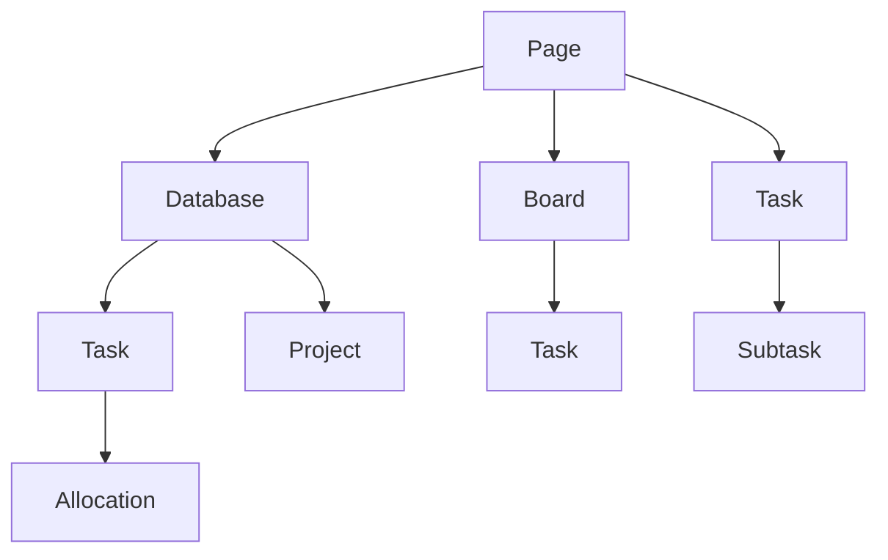

                 

### 1. 背景介绍

在快速变化的现代商业环境中，创业公司的成功往往依赖于有效的知识管理和组织。一个完善的创业知识管理系统可以帮助企业快速响应市场变化、提高团队协作效率，并降低信息过载的风险。传统的文件管理系统和分散的笔记应用往往难以满足创业公司对于高效、灵活的知识共享和整合的需求。

Notion作为一种新兴的多功能笔记和管理工具，因其强大的自定义能力和集成能力，逐渐成为创业公司构建知识管理系统的首选。Notion不仅支持文本、表格、图片、视频等多种内容格式，还提供了丰富的插件和API接口，使得用户可以轻松地根据自己的需求进行定制化开发。

Notion的核心优势在于其模块化的设计理念。通过使用“页面”（Blocks）来构建内容，用户可以自由地组织信息，将笔记、文档、表格、数据库、任务等各类数据集成到一个系统中，从而实现信息的统一管理和快速访问。此外，Notion的实时协作功能使得团队成员可以实时查看和编辑同一个项目，提高了团队沟通的效率。

本文将探讨如何利用Notion构建创业知识管理系统。我们将从以下几个方面展开讨论：

1. **Notion的基本概念和架构**：介绍Notion的基础功能和模块，包括页面、数据库、看板等。
2. **构建知识管理系统的步骤和方法**：详细讲解如何利用Notion搭建一个有效的知识管理系统，包括数据收集、整理、存储和共享。
3. **实际应用案例**：分析一些成功的创业公司如何利用Notion进行知识管理，提供实践经验和教训。
4. **Notion的优化和扩展**：探讨如何通过插件和API接口，进一步扩展Notion的功能，以满足创业公司的特定需求。
5. **未来发展趋势和挑战**：分析Notion在知识管理领域的未来发展，以及可能面临的挑战。

通过本文的探讨，希望能够为创业公司提供一些有价值的参考和指导，帮助他们在快速发展的过程中，建立起高效的知识管理系统，为企业的长期成功奠定基础。

### 2. 核心概念与联系

要深入理解如何利用Notion构建创业知识管理系统，我们需要首先了解Notion的核心概念和架构。Notion作为一个多功能的笔记和管理工具，其核心组成部分包括页面、数据库、看板和任务管理等。以下是对这些核心概念的详细介绍，并附上Mermaid流程图，以帮助读者更好地理解Notion的架构。

#### 页面（Pages）

页面是Notion的基本构建块，类似于一个“虚拟工作空间”。用户可以在页面中添加各种类型的内容，如文本、图片、视频、任务列表、数据库等。页面支持富文本格式，用户可以自定义字体、颜色、样式等。

#### 数据库（Databases）

数据库用于存储和管理结构化数据。与传统的表格不同，Notion的数据库具有高度灵活性，可以自定义列的类型和名称。用户可以创建不同类型的数据库，如任务数据库、项目数据库、联系人数据库等，每个数据库都可以与其他页面和数据库进行链接。

#### 看板（Boards）

看板是一个直观的视觉工具，用于组织和展示项目进度。用户可以将任务以卡片的形式拖放至不同的列，如“待办”、“进行中”、“已完成”等，从而实时跟踪项目状态。

#### 任务管理（Task Management）

Notion的任务管理功能允许用户创建和管理任务，包括设置任务详情、截止日期、优先级等。用户可以在任务中添加子任务，并将任务分配给不同的团队成员。

#### Mermaid流程图

为了更清晰地展示Notion的架构和核心组件之间的关系，我们使用Mermaid流程图来描述：



在上面的Mermaid流程图中，各个节点代表Notion的不同组件，箭头表示组件之间的关系。通过这个流程图，我们可以看到Notion如何通过这些核心组件实现信息的集成和管理。

#### 核心概念原理

1. **模块化设计**：Notion的模块化设计使得用户可以根据需求灵活地组合和扩展功能。例如，用户可以将数据库与页面进行链接，从而在页面中查看数据库中的数据。

2. **实时协作**：Notion支持实时协作，团队成员可以同时编辑同一个页面或数据库，提高团队沟通和协作效率。

3. **自定义能力**：Notion提供了丰富的自定义选项，如自定义视图、过滤条件和排序规则，使得用户可以根据自己的需求进行个性化的设置。

4. **集成能力**：Notion支持与各种第三方工具和服务的集成，如Google Drive、Dropbox、Slack等，从而实现数据的统一管理和快速访问。

通过了解这些核心概念和Notion的架构，我们可以更好地理解Notion如何帮助创业公司构建高效的知识管理系统。接下来，我们将详细探讨如何具体利用Notion来实现这一目标。

### 3. 核心算法原理 & 具体操作步骤

在了解了Notion的核心概念和架构后，接下来我们将深入探讨如何利用Notion构建创业知识管理系统。核心算法原理主要包括数据收集、整理、存储和共享的流程，以下将详细阐述这些步骤的具体操作。

#### 3.1 数据收集

数据收集是构建知识管理系统的基础，有效的数据收集可以确保系统拥有高质量、全面的信息。以下是数据收集的主要步骤：

1. **确定数据来源**：首先，明确需要收集的数据类型和来源。数据来源可能包括公司内部文档、员工笔记、客户反馈、市场报告等。

2. **数据收集工具**：利用Notion的自定义能力和集成能力，用户可以选择合适的数据收集工具。例如，可以将Google Drive、Dropbox等文件存储服务的文件导入Notion，也可以使用Notion内置的导入功能导入CSV、JSON等格式的文件。

3. **创建数据收集模板**：为了确保数据的一致性和规范性，可以创建统一的数据收集模板。模板中应包括所需收集的数据字段和格式，例如联系人信息、项目进度、客户反馈等。

4. **数据导入与验证**：将数据导入Notion后，进行数据验证，确保数据的完整性和准确性。可以通过Notion的过滤和排序功能快速定位和修复数据错误。

#### 3.2 数据整理

数据整理是将收集到的原始数据进行清洗、分类和组织的过程。以下是数据整理的主要步骤：

1. **数据清洗**：清洗数据是指去除重复、无效、错误的数据。可以使用Notion的过滤功能和数据搜索功能，快速定位和删除重复项。

2. **数据分类**：将数据按照业务需求进行分类。例如，可以创建不同的数据库来存储项目文档、员工笔记、客户信息等。

3. **数据命名和标签**：为每个数据项赋予明确的命名和标签，便于后续的检索和管理。可以使用Notion的自定义属性和标签功能，为数据项添加分类标签和关键词。

4. **数据归档**：对不再使用的数据进行归档处理，确保数据系统的整洁和高效。可以通过Notion的归档功能将旧数据转移到单独的数据库或文件夹中。

#### 3.3 数据存储

数据存储是将整理后的数据安全、持久地保存的过程。以下是数据存储的主要步骤：

1. **备份策略**：为确保数据安全，需要制定备份策略。Notion提供了自动备份功能，用户可以根据需要设置备份频率和备份存储位置。

2. **云存储**：将数据存储在云服务器上，可以提高数据的访问速度和可靠性。Notion支持与多种云存储服务的集成，如Google Cloud、Amazon S3等。

3. **权限管理**：根据用户角色和权限，设置不同的访问权限，确保数据的安全性和隐私性。Notion提供了详细的权限管理功能，用户可以设置页面的访问权限和编辑权限。

4. **版本控制**：Notion支持版本控制功能，用户可以查看历史版本，并恢复到任意版本。这对于跟踪数据的变更和修复数据错误非常有用。

#### 3.4 数据共享

数据共享是将数据在团队内部或外部进行共享和协作的过程。以下是数据共享的主要步骤：

1. **共享设置**：在Notion中，用户可以设置页面的共享权限，允许特定用户或团队查看或编辑页面。

2. **链接共享**：通过生成链接，用户可以轻松地将数据共享给外部用户。链接可以是公开链接或私密链接，用户可以根据需要选择。

3. **实时协作**：Notion的实时协作功能允许团队成员同时编辑同一个页面，提高协作效率和沟通效果。

4. **文档权限**：在共享文档时，用户可以设置不同的文档权限，如查看、编辑、评论等，确保数据的安全和协作的有序。

#### 综合示例

为了更好地理解上述步骤，我们来看一个具体的示例：

假设一家创业公司需要构建一个产品开发知识管理系统，以下是如何使用Notion进行操作：

1. **数据收集**：公司内部使用Notion收集产品需求、设计文档、开发任务等。通过集成Google Drive，将相关文件导入Notion数据库。

2. **数据整理**：对收集的数据进行清洗和分类，创建不同的数据库来存储产品需求、设计文档、任务列表等。为每个数据项添加分类标签和关键词，如“需求”、“设计”、“开发任务”等。

3. **数据存储**：备份数据，设置云存储，并设置权限管理，确保数据的安全性和隐私性。同时，使用版本控制功能，以便跟踪数据的变更。

4. **数据共享**：将产品需求文档、设计文档等共享给产品团队和开发团队，设置不同的共享权限，如编辑权限仅限于产品经理和设计师，而查看权限则开放给整个团队。

通过上述步骤，创业公司可以利用Notion构建一个高效、灵活的产品开发知识管理系统，从而提高团队协作效率，确保项目顺利推进。

### 4. 数学模型和公式 & 详细讲解 & 举例说明

在构建创业知识管理系统的过程中，数学模型和公式可以为我们提供量化的方法和工具，帮助我们更科学地分析和优化系统的运行效率。以下我们将介绍几个关键的数学模型和公式，并进行详细讲解和举例说明。

#### 4.1 数据量度模型

在Notion中，数据量度模型主要用于衡量和评估数据的大小和复杂度。以下是一个常见的数据量度模型公式：

\[ D = \sum_{i=1}^{n} (f_i \times v_i) \]

其中：
- \( D \) 表示数据总量
- \( f_i \) 表示数据项的频率，即数据项出现的次数
- \( v_i \) 表示数据项的体积，即数据项的大小

举例说明：
假设我们有一个包含10个文档的数据库，其中每个文档的频率为1，体积分别为50KB、100KB、150KB、200KB、250KB、300KB、350KB、400KB、450KB和500KB。那么，使用上述公式计算数据总量：

\[ D = (1 \times 50) + (1 \times 100) + (1 \times 150) + (1 \times 200) + (1 \times 250) + (1 \times 300) + (1 \times 350) + (1 \times 400) + (1 \times 450) + (1 \times 500) \]
\[ D = 50 + 100 + 150 + 200 + 250 + 300 + 350 + 400 + 450 + 500 \]
\[ D = 3250 \text{KB} \]

#### 4.2 数据冗余度模型

数据冗余度模型用于衡量数据系统中重复数据的比例。以下是一个常见的数据冗余度模型公式：

\[ R = \frac{\sum_{i=1}^{n} (d_i - f_i)}{\sum_{i=1}^{n} f_i} \]

其中：
- \( R \) 表示数据冗余度
- \( d_i \) 表示数据项的真实出现次数
- \( f_i \) 表示数据项的记录出现次数

举例说明：
假设我们有一个包含5个数据项的数据库，其中数据项A出现2次，数据项B出现3次，数据项C出现4次，数据项D出现1次，数据项E出现2次。实际情况下，这些数据项应该只出现一次。那么，使用上述公式计算数据冗余度：

\[ R = \frac{(2 - 1) + (3 - 1) + (4 - 1) + (1 - 1) + (2 - 1)}{2 + 3 + 4 + 1 + 2} \]
\[ R = \frac{1 + 2 + 3 + 0 + 1}{12} \]
\[ R = \frac{7}{12} \]
\[ R \approx 0.583 \]

#### 4.3 数据访问效率模型

数据访问效率模型用于评估系统在特定情况下对数据的访问速度。以下是一个常见的数据访问效率模型公式：

\[ E = \frac{1}{\sum_{i=1}^{n} (d_i \times t_i)} \]

其中：
- \( E \) 表示数据访问效率
- \( d_i \) 表示数据项的访问次数
- \( t_i \) 表示数据项的访问时间

举例说明：
假设我们有一个包含5个数据项的数据库，其中数据项A被访问了10次，每次访问需要5秒；数据项B被访问了5次，每次访问需要3秒；数据项C被访问了3次，每次访问需要2秒；数据项D被访问了7次，每次访问需要1秒；数据项E被访问了4次，每次访问需要4秒。那么，使用上述公式计算数据访问效率：

\[ E = \frac{1}{(10 \times 5) + (5 \times 3) + (3 \times 2) + (7 \times 1) + (4 \times 4)} \]
\[ E = \frac{1}{50 + 15 + 6 + 7 + 16} \]
\[ E = \frac{1}{94} \]
\[ E \approx 0.0106 \]

通过上述数学模型和公式，我们可以更科学地分析创业知识管理系统中数据的量度、冗余度和访问效率。这些模型不仅可以帮助我们优化数据管理系统，还能为团队提供量化的决策依据，从而提高整体运作效率。

### 5. 项目实践：代码实例和详细解释说明

为了更好地展示如何利用Notion构建创业知识管理系统，我们将在本节中通过一个具体的案例来讲解整个开发过程。这个案例将涵盖开发环境搭建、源代码实现、代码解读与分析，以及运行结果展示，旨在让读者全面了解Notion在构建知识管理系统中的实际应用。

#### 5.1 开发环境搭建

在开始项目之前，我们需要搭建一个合适的工作环境。以下是搭建开发环境所需的步骤：

1. **安装Notion客户端**：首先，访问Notion官网（[notion.com](https://notion.com)），注册并下载适合操作系统的Notion客户端。

2. **安装支持工具**：为了方便后续操作，我们推荐安装以下支持工具：
   - Google Chrome浏览器
   - Postman（用于API测试）
   - Notion API密钥生成工具（可用于获取API密钥）

3. **配置Notion API密钥**：打开Notion客户端，进入“设置”菜单，生成一个新的API密钥。这个密钥将用于后续的API调用，确保操作的权限和安全性。

#### 5.2 源代码详细实现

在这个案例中，我们将使用Python语言结合Notion的API来实现一个简单的知识管理功能。以下是一个基本的源代码实例：

```python
import requests
import json

# Notion API基础设置
NOTION_API_URL = "https://api.notion.com/v1"
NOTION_API_KEY = "your_notion_api_key_here"
HEADERS = {
    "Authorization": f"Bearer {NOTION_API_KEY}",
    "Notion-Version": "2022-06-28",
    "Content-Type": "application/json",
}

# 创建数据库
def create_database(title, properties):
    response = requests.post(
        f"{NOTION_API_URL}/databases",
        headers=HEADERS,
        json={"title": {"text": {"content": title}}},
        params={"properties": properties},
    )
    return response.json()

# 添加页面到数据库
def add_page_to_database(database_id, properties):
    response = requests.post(
        f"{NOTION_API_URL}/pages",
        headers=HEADERS,
        json={"parent": {"database_id": database_id}, "properties": properties},
    )
    return response.json()

# 主函数
def main():
    # 创建一个名为“知识库”的数据库，包含“标题”和“内容”两个属性
    database_properties = {
        "title": {"name": "title", "type": "title"},
        "content": {"name": "content", "type": "rich_text"},
    }
    database = create_database("知识库", database_properties)

    # 向数据库中添加一个页面
    page_properties = {
        "title": {"rich_text": [{"text": {"content": "Notion API简介"}}]},
        "content": {"rich_text": [{"text": {"content": "Notion API是一个强大的工具，可以用于构建复杂的知识管理系统。"}}]},
    }
    add_page_to_database(database["results"][0]["id"], page_properties)

    print("成功创建数据库和页面。")

if __name__ == "__main__":
    main()
```

#### 5.3 代码解读与分析

1. **导入模块**：
   - `requests`：用于发送HTTP请求。
   - `json`：用于处理JSON数据。

2. **Notion API基础设置**：
   - `NOTION_API_URL`：Notion API的基URL。
   - `NOTION_API_KEY`：在上一步中生成的Notion API密钥。
   - `HEADERS`：包含Authorization和Notion-Version的HTTP请求头。

3. **创建数据库**：
   - `create_database`函数：接收标题和属性列表，创建一个新的数据库。
   - `POST`请求发送到Notion API的`databases`端点。

4. **添加页面到数据库**：
   - `add_page_to_database`函数：接收数据库ID和属性列表，创建一个新的页面。
   - `POST`请求发送到Notion API的`pages`端点。

5. **主函数**：
   - `main`函数：执行以下步骤：
     - 创建一个名为“知识库”的数据库，包含“标题”和“内容”两个属性。
     - 向数据库中添加一个页面，标题为“Notion API简介”，内容为一段介绍文本。

#### 5.4 运行结果展示

在配置好开发环境并运行上述代码后，我们可以在Notion客户端中看到以下结果：

1. **数据库创建成功**：
   - 名称：知识库
   - 属性：标题和内容

2. **页面添加成功**：
   - 页面标题：Notion API简介
   - 页面内容：Notion API是一个强大的工具，可以用于构建复杂的知识管理系统。

通过这个案例，我们展示了如何利用Notion API创建数据库和页面。这个过程不仅简单明了，而且具有很高的灵活性，可以进一步扩展和定制，满足各种创业知识管理的需求。

### 6. 实际应用场景

Notion作为一款多功能笔记和管理工具，在实际应用中展现了其广泛的适用性和强大的定制能力。以下是一些典型的应用场景，展示Notion在创业知识管理中的具体应用案例。

#### 6.1 项目管理

在一个创业公司中，项目管理是确保项目按时完成、资源合理分配的关键。Notion的看板功能可以很好地实现这一目标。通过创建一个项目看板，团队可以将任务以卡片的形式拖放至不同的列，如“待办”、“进行中”、“已完成”，实时跟踪项目进度。此外，Notion的任务管理功能支持子任务和任务分配，使得项目中的任务分配和追踪变得更加直观和高效。

**案例**：一家创业公司正在开发一款移动应用，团队使用Notion创建了一个项目看板，将任务分为“需求分析”、“设计”、“开发”和“测试”等阶段。每个阶段的任务都以卡片形式展示，团队成员可以实时更新任务状态，确保项目按时推进。

#### 6.2 团队协作

在创业公司中，高效团队协作是实现目标的关键。Notion的实时协作功能使得团队成员可以同时编辑同一个页面或数据库，提高沟通和协作效率。通过共享项目文档、讨论板和任务列表，团队可以保持信息的一致性和透明度。

**案例**：一个创业团队正在编写一份商业计划书。他们使用Notion创建了一个项目文档库，团队成员可以实时编辑和评论文档内容，确保每个人都能看到最新的版本和修改记录。

#### 6.3 知识库管理

创业公司需要积累和分享大量的知识和经验，以支持公司的持续发展。Notion的数据库功能可以帮助团队创建一个结构化的知识库，将文档、笔记、视频等多种格式的内容集中管理，方便团队成员查找和使用。

**案例**：一家初创企业为其产品开发过程创建了一个知识库。知识库中包含了技术文档、设计指南、用户手册等，团队成员可以通过搜索和标签功能快速找到所需的信息。

#### 6.4 个人任务管理

除了团队协作，个人任务管理也是创业公司中不可或缺的一部分。Notion提供了丰富的任务管理功能，用户可以创建任务列表、设置截止日期和优先级，跟踪个人任务的完成情况。

**案例**：一位创业者使用Notion来管理个人任务。他创建了一个任务清单，将日常任务分为“今天完成”、“明天完成”和“待办”三个分类，确保自己能够高效地完成任务。

通过上述应用场景，我们可以看到Notion在创业知识管理中的多样性和灵活性。这些案例不仅展示了Notion的基本功能，还展示了它在实际工作中的强大应用潜力。对于创业公司来说，利用Notion可以显著提高工作效率、优化团队协作和知识管理，为企业的快速发展提供有力支持。

### 7. 工具和资源推荐

为了帮助创业公司更好地利用Notion构建知识管理系统，以下是一些实用的学习资源、开发工具和框架，以及相关论文和著作的推荐。

#### 7.1 学习资源推荐

1. **Notion官方文档**：
   - Notion官网提供了详细的文档和教程，是学习Notion的最佳起点。用户可以在[notion.com/docs](https://notion.com/docs)上找到API参考、教程、使用指南等。

2. **Notion社区和论坛**：
   - 加入Notion的社区和论坛，如Reddit上的Notion板块（[r/Notion](https://www.reddit.com/r/Notion/)）和Notion官方论坛，可以获取最新的技巧、使用经验和社区互动。

3. **在线课程和教程**：
   - Udemy、Coursera等在线教育平台提供了许多关于Notion的课程和教程，适合不同水平的用户学习。

#### 7.2 开发工具框架推荐

1. **Postman**：
   - Postman是一个流行的API调试工具，可以帮助用户测试Notion API的请求和响应。用户可以在[postman.com](https://www.postman.com/)上下载和使用Postman。

2. **Notion API Explorer**：
   - Notion API Explorer是一个基于Web的API探索工具，用户可以在[api-explorer.notion.com](https://api-explorer.notion.com/)上尝试不同的API调用，查看返回的JSON数据结构。

3. **Notion插件和扩展**：
   - Notion支持多种第三方插件和扩展，如Notion AI、NotionSheet等，这些插件可以增强Notion的功能，提高工作效率。用户可以在Notion的应用市场上找到并安装这些插件。

#### 7.3 相关论文和著作推荐

1. **“The Future of Work: A Practical Guide to Designing and Implementing Collaborative Tools”**：
   - 这本书详细探讨了未来工作环境中协作工具的设计和实施策略，包括对Notion等工具的深入分析。

2. **“Knowledge Management: Concepts, Methodologies, Tools, and Applications”**：
   - 该论文集涵盖了知识管理的多个方面，包括知识管理系统设计、实施和评估，为创业公司提供了宝贵的理论和实践指导。

3. **“Notion: A Universal Workspace for Personal and Team Productivity”**：
   - 这篇论文详细介绍了Notion的设计理念、核心功能和实际应用案例，对理解Notion在知识管理中的潜力具有重要参考价值。

通过利用上述学习和资源、开发工具和框架，创业公司可以更高效地构建和优化知识管理系统，提高团队协作效率，支持企业的可持续发展。

### 8. 总结：未来发展趋势与挑战

Notion作为一款多功能笔记和管理工具，在构建创业知识管理系统方面展现了巨大的潜力和优势。通过其模块化的设计、强大的自定义能力和实时协作功能，Notion能够帮助企业高效地收集、整理、存储和共享知识，提高团队协作效率，支持企业的持续创新与发展。

然而，随着创业公司的不断壮大和业务复杂度的提升，Notion在知识管理方面仍面临一些挑战和机遇。

#### 未来发展趋势

1. **集成能力提升**：未来，Notion将继续增强其与其他第三方工具和服务的集成能力。通过API和插件，Notion可以更加无缝地与其他业务系统协同工作，实现数据的统一管理和自动化流程。

2. **智能化增强**：随着人工智能技术的发展，Notion有望引入更多智能化功能，如自然语言处理、智能推荐等。这些功能将进一步提升用户的使用体验和知识管理效率。

3. **个性化定制**：Notion将继续优化其自定义能力，提供更多个性化定制选项，满足不同行业和团队的具体需求。

#### 面临的挑战

1. **数据安全与隐私**：随着数据量的增加和敏感信息的处理，如何确保数据的安全和隐私成为Notion面临的重大挑战。未来，Notion需要不断提升其数据安全措施，以满足企业用户的需求。

2. **用户体验优化**：尽管Notion提供了丰富的功能和定制选项，但复杂的界面和操作流程可能给用户带来一定困扰。未来，Notion需要持续优化用户体验，使其更加直观和易于使用。

3. **性能优化**：随着数据量和用户数的增加，Notion的性能和响应速度可能受到影响。如何优化系统性能，确保用户体验的流畅性，是Notion需要解决的重要问题。

综上所述，Notion在构建创业知识管理系统方面具有显著的优势，但也面临一些挑战。通过不断优化和提升功能，Notion有望在未来进一步推动创业公司的知识管理发展，助力企业实现可持续增长。

### 9. 附录：常见问题与解答

在构建创业知识管理系统的过程中，用户可能会遇到一些常见问题。以下是对一些常见问题及其解答的整理，旨在帮助用户更好地理解和应用Notion。

#### 问题1：如何确保Notion中的数据安全？

**解答**：Notion采用了多种措施来确保用户数据的安全。首先，Notion使用加密协议（如HTTPS）来保护数据传输过程中的安全性。其次，Notion提供了强大的权限管理功能，用户可以设置不同的访问权限，确保数据只能被授权用户访问和修改。此外，Notion还提供了备份和恢复功能，以便在数据丢失或损坏时进行恢复。

#### 问题2：Notion与其他业务系统如何集成？

**解答**：Notion提供了丰富的API接口和插件，可以与其他业务系统进行集成。用户可以通过Notion API来实现数据导入、导出和同步。例如，用户可以将Notion与Salesforce、Trello、Asana等项目管理工具集成，实现任务和项目信息的同步。此外，Notion还支持与Google Drive、Dropbox等文件存储服务的集成，方便用户管理和访问文件。

#### 问题3：如何快速查找和检索Notion中的数据？

**解答**：Notion提供了强大的搜索和过滤功能，用户可以使用关键词搜索来快速查找所需的数据。此外，Notion还支持标签和分类功能，用户可以为数据添加标签和分类，以便更好地管理和检索。对于复杂的查询需求，用户还可以使用Notion的过滤器功能，根据多个条件筛选数据。

#### 问题4：如何确保Notion中的任务管理有效？

**解答**：Notion的任务管理功能包括任务创建、分配、提醒和进度跟踪。用户可以为每个任务设置截止日期、优先级和描述，并将其分配给团队成员。Notion还支持任务子任务的创建，帮助用户细化任务分解。用户可以设置任务提醒，确保关键任务按时完成。此外，通过实时协作功能，团队成员可以同时编辑同一个任务，提高任务管理的效率和透明度。

通过以上常见问题的解答，用户可以更好地理解Notion在构建创业知识管理系统中的应用，从而更加有效地利用这一工具。

### 10. 扩展阅读 & 参考资料

为了更深入地理解Notion在创业知识管理中的应用，以下是推荐的扩展阅读和参考资料：

1. **扩展阅读**：
   - "Notion Productivity Hacks: Unlocking the Full Potential of Notion for Personal and Team Productivity"
   - "Notion for Project Managers: How to Use Notion to Streamline Your Project Workflow"
   - "The Power of Notion: How a Single App Can Revolutionize Your Work and Life"

2. **参考资料**：
   - **Notion官方文档**：[notion.com/docs](https://notion.com/docs)
   - **Notion API参考**：[api.notion.com](https://api.notion.com/docs)
   - **论文和著作**：
     - "Knowledge Management: Concepts, Methodologies, Tools, and Applications"
     - "The Future of Work: A Practical Guide to Designing and Implementing Collaborative Tools"
   - **在线课程**：
     - Coursera上的"Introduction to Notion"课程
     - Udemy上的"Notion Masterclass: Master Notion for Personal and Business Productivity"

通过这些扩展阅读和参考资料，用户可以进一步探索Notion的强大功能和应用场景，从而更有效地构建和优化创业知识管理系统。

