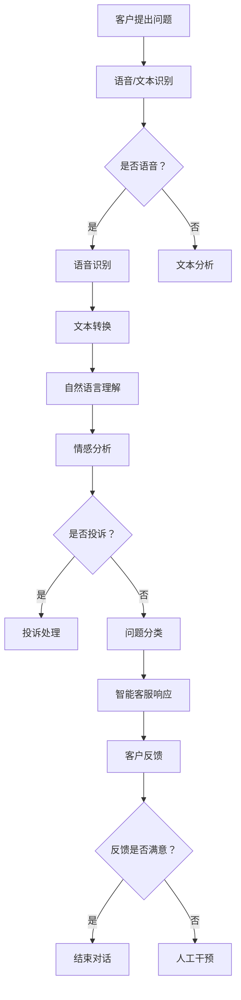

                 

### 1. 背景介绍

人工智能（Artificial Intelligence，简称 AI）作为计算机科学的一个重要分支，已经迅速发展并在多个领域展现出其巨大潜力。尤其在客户支持领域，人工智能的引入不仅提高了服务质量，还显著降低了运营成本。

在过去，客户支持往往依赖于人工处理，这种方式不仅效率低下，而且容易出现错误。传统的客户支持系统主要依赖于预定义的规则和流程，无法灵活应对复杂多变的情况。这种局限性使得客户在寻求帮助时往往需要长时间等待，甚至得不到有效的解决方案。

随着人工智能技术的进步，尤其是自然语言处理（Natural Language Processing，NLP）和机器学习（Machine Learning，ML）的快速发展，人工智能在客户支持领域的应用逐渐成为可能。AI系统能够通过深度学习和自然语言理解等技术，自动处理大量客户咨询，并提供即时响应。这不仅提升了客户满意度，还大幅提高了企业的运营效率。

当前，人工智能已经在客户支持领域取得了显著的成果。例如，智能客服机器人能够通过语音和文本识别理解客户问题，并自动提供解决方案，极大地减少了人工干预的必要性。此外，AI还能够通过数据分析，预测客户的需求，提前提供针对性的服务，从而进一步优化客户体验。

总之，随着人工智能技术的不断成熟，其在客户支持领域的应用前景将更加广阔。接下来，我们将深入探讨如何利用人工智能优化客户支持的具体方法和策略。

### 2. 核心概念与联系

要深入理解如何利用人工智能优化客户支持，我们首先需要明确几个核心概念，并探讨它们之间的联系。以下是几个关键概念及其相互关系：

#### 自然语言处理（Natural Language Processing，NLP）

自然语言处理是人工智能的一个子领域，它专注于使计算机能够理解、解释和生成人类语言。NLP技术包括文本分析、语音识别、情感分析和机器翻译等。

**文本分析**：通过分析和理解文本内容，提取出关键信息。例如，在客户支持中，文本分析可以用来识别客户的问题类型和需求。

**语音识别**：将语音转换为文本，使计算机能够理解客户的口头问题。这对于电话客服和语音交互系统尤为重要。

**情感分析**：通过分析文本的情感倾向，判断客户的情绪状态。这在处理客户投诉和反馈时非常有用，可以帮助企业及时调整服务策略。

**机器翻译**：将一种语言的文本翻译成另一种语言，对于跨国企业尤其关键。

#### 机器学习（Machine Learning，ML）

机器学习是另一种人工智能技术，它使计算机能够从数据中学习并做出预测或决策。机器学习主要包括监督学习、无监督学习和强化学习等。

**监督学习**：通过已标记的数据集训练模型，使其能够对新数据做出预测。在客户支持中，监督学习可以用来分类客户问题，预测客户行为等。

**无监督学习**：不需要标记数据，通过自身发现数据中的模式。在客户支持中，无监督学习可以用于客户细分和市场分析。

**强化学习**：通过不断尝试和反馈，使模型能够在复杂环境中做出最优决策。在智能客服机器人中，强化学习可以用来优化对话策略，提高响应效果。

#### 客户关系管理（Customer Relationship Management，CRM）

客户关系管理是企业与客户之间的互动过程，旨在提高客户满意度和忠诚度。AI技术在CRM中的应用主要包括：

**客户细分**：通过分析客户行为和偏好，将客户分为不同的群体，以便提供个性化的服务。

**预测分析**：利用机器学习技术，预测客户的潜在需求，提前提供相应的服务。

**客户互动**：通过智能客服和聊天机器人，提供即时、个性化的客户支持。

#### Mermaid 流程图

以下是利用人工智能优化客户支持的一个简单 Mermaid 流程图，展示各核心概念之间的联系：



通过上述流程图，我们可以看到客户问题从提出到解决的全过程，其中人工智能技术在每个环节都发挥了关键作用。

### 3. 核心算法原理 & 具体操作步骤

在理解了核心概念与联系后，接下来我们将深入探讨人工智能在客户支持中应用的核心算法原理，并详细描述其具体操作步骤。

#### 3.1 语音识别与文本分析

语音识别和文本分析是人工智能在客户支持中的基础技术。语音识别将客户的口头问题转换为文本，而文本分析则进一步解析这些文本，提取关键信息。

**3.1.1 语音识别**

语音识别的过程大致可以分为以下几个步骤：

1. **语音信号处理**：首先，对语音信号进行预处理，包括去噪、分帧和加窗等操作，以便提取语音的特征。
   
2. **特征提取**：通过Mel频率倒谱系数（MFCC）等算法，提取语音信号的时间频率特征。

3. **模型训练**：使用大量已标记的语音数据集，通过深度学习算法（如卷积神经网络CNN）训练语音识别模型。

4. **语音识别**：将提取的特征输入训练好的模型，模型输出对应的文本。

**3.1.2 文本分析**

文本分析则包括以下步骤：

1. **文本预处理**：对输入的文本进行清洗，包括去除停用词、标点符号和统一化文本格式等。

2. **词向量化**：将文本转换为数值向量，常用的词向量化方法包括Word2Vec、GloVe等。

3. **句子表示**：通过循环神经网络（RNN）、Transformer等模型，对整个句子进行编码，得到句子的固定长度的表示。

4. **信息提取**：利用命名实体识别（NER）、关系抽取等技术，从文本中提取关键信息，如人名、地点、时间等。

#### 3.2 情感分析

情感分析用于判断客户的情绪状态，从而提供更合适的支持。以下是情感分析的主要步骤：

1. **情感词典**：构建情感词典，包括正面、负面和中性的词汇及其对应的情感值。

2. **文本分句**：将输入文本分割成句子，以便单独分析。

3. **情感标注**：根据情感词典，对每个句子进行情感标注，判断其正面、负面或中性。

4. **情感聚合**：将句子的情感标注结果进行聚合，得到整个文本的情感倾向。

5. **情感判断**：根据情感聚合结果，判断客户的整体情绪状态。

#### 3.3 问题分类与智能客服响应

**3.3.1 问题分类**

问题分类是将客户的咨询根据主题或类型进行分类，以便分配到相应的支持团队或系统。以下是问题分类的主要步骤：

1. **特征提取**：对文本进行特征提取，如词袋模型、TF-IDF等。

2. **模型训练**：使用已标记的数据集，通过机器学习算法（如SVM、决策树等）训练分类模型。

3. **分类预测**：将新问题的特征输入训练好的模型，输出对应的类别。

**3.3.2 智能客服响应**

智能客服响应是根据问题分类的结果，自动生成响应文本或分配到人工客服。以下是智能客服响应的主要步骤：

1. **知识库构建**：构建包含常见问题和响应的智能客服知识库。

2. **响应生成**：根据问题分类结果，从知识库中检索相应的响应文本。

3. **对话管理**：管理整个对话流程，包括问候、问题理解、响应生成和结束等。

通过上述核心算法的协同作用，人工智能能够高效地处理客户支持中的各种问题，提供即时、个性化的服务。

### 4. 数学模型和公式 & 详细讲解 & 举例说明

#### 4.1 词袋模型

词袋模型（Bag-of-Words，BOW）是一种常用的文本表示方法，它将文本表示为一个单词的集合，而不考虑单词的顺序。词袋模型的数学基础主要包括以下几个概念：

**词频（Term Frequency，TF）**：词频表示一个单词在文本中出现的次数。其计算公式为：

\[ t_f(t) = \text{count}(t) \]

其中，\( t \) 表示单词，\( \text{count}(t) \) 表示单词 \( t \) 在文本中出现的次数。

**逆文档频率（Inverse Document Frequency，IDF）**：逆文档频率表示一个单词在整个文档集合中的重要性。其计算公式为：

\[ i_d_f(t) = \log \left( \frac{N}{n_t} \right) \]

其中，\( N \) 表示文档总数，\( n_t \) 表示包含单词 \( t \) 的文档数。

**词频-逆文档频率（TF-IDF）**：词频-逆文档频率是将词频和逆文档频率结合的一种表示方法，其计算公式为：

\[ t_f_i_d_f(t) = t_f(t) \times i_d_f(t) \]

#### 4.2 朴素贝叶斯分类器

朴素贝叶斯分类器（Naive Bayes Classifier）是一种基于贝叶斯定理的简单概率分类器。其数学基础主要包括以下几个步骤：

**1. 贝叶斯定理**：

贝叶斯定理的公式为：

\[ P(A|B) = \frac{P(B|A) \times P(A)}{P(B)} \]

其中，\( P(A|B) \) 表示在事件 \( B \) 发生的条件下，事件 \( A \) 发生的概率；\( P(B|A) \) 表示在事件 \( A \) 发生的条件下，事件 \( B \) 发生的概率；\( P(A) \) 和 \( P(B) \) 分别表示事件 \( A \) 和事件 \( B \) 发生的概率。

**2. 朴素贝叶斯模型**：

朴素贝叶斯模型假设特征之间相互独立，其概率计算公式为：

\[ P(C|T_1, T_2, ..., T_n) = \prod_{i=1}^{n} P(T_i|C) \times P(C) \]

其中，\( C \) 表示类别，\( T_i \) 表示特征 \( i \)。

**3. 分类决策**：

对于新的特征向量 \( T' \)，通过计算其在各个类别下的概率，选择概率最大的类别作为预测结果：

\[ \hat{C} = \arg\max_{C} P(C|T') \]

#### 4.3 举例说明

**4.3.1 词频-逆文档频率（TF-IDF）**

假设我们有以下两个文本：

文本1："人工智能在客户支持中的应用非常重要。"

文本2："人工智能在医疗领域的应用也非常重要。"

计算词频-逆文档频率，我们可以得到以下结果：

| 单词 | 文本1 | 文本2 | TF | IDF | TF-IDF |
|------|-------|-------|----|-----|--------|
| 人工智能 | 1 | 1 | 1 | 1 | 1 |
| 在 | 2 | 2 | 2 | 0.5 | 1 |
| 客户 | 1 | 0 | 1 | 1 | 1 |
| 支持 | 1 | 0 | 1 | 1 | 1 |
| 的 | 3 | 1 | 3 | 0.5 | 1.5 |
| 应用 | 1 | 1 | 1 | 1 | 1 |
| 领域 | 0 | 1 | 0 | 1 | 0 |
| 重要性 | 1 | 1 | 1 | 1 | 1 |
| 也 | 1 | 1 | 1 | 1 | 1 |

**4.3.2 朴素贝叶斯分类器**

假设我们有以下训练数据：

| 类别 | 特征1 | 特征2 | 特征3 |
|------|-------|-------|-------|
| A    | 1     | 0     | 1     |
| A    | 0     | 1     | 1     |
| B    | 1     | 1     | 0     |
| B    | 1     | 0     | 1     |

根据上述数据，我们可以计算每个类别的条件概率：

\( P(A) = \frac{2}{4} = 0.5 \)
\( P(B) = \frac{2}{4} = 0.5 \)

\( P(\text{特征1}=1 | A) = \frac{2}{2} = 1 \)
\( P(\text{特征2}=0 | A) = \frac{2}{2} = 1 \)
\( P(\text{特征3}=1 | A) = \frac{2}{2} = 1 \)

\( P(\text{特征1}=1 | B) = \frac{2}{2} = 1 \)
\( P(\text{特征2}=1 | B) = \frac{2}{2} = 1 \)
\( P(\text{特征3}=0 | B) = \frac{2}{2} = 1 \)

对于新的特征向量 \( T' = (1, 1, 0) \)，我们可以计算其在类别 A 和 B 下的概率：

\( P(A|T') = \frac{1 \times 1 \times 1 \times 0.5}{1 + 0.5} = 0.333 \)
\( P(B|T') = \frac{1 \times 1 \times 1 \times 0.5}{1 + 0.5} = 0.667 \)

因此，我们选择概率最大的类别 B 作为预测结果。

通过上述例子，我们可以看到数学模型在文本分析和分类中的具体应用。这些模型不仅帮助提高客户支持系统的准确性，还为人工智能在更多领域的发展奠定了基础。

### 5. 项目实践：代码实例和详细解释说明

#### 5.1 开发环境搭建

在进行项目实践之前，我们需要搭建一个适合开发和测试的人工智能客户支持系统环境。以下是一个基本的开发环境搭建步骤：

**1. 安装Python环境**：
确保安装了Python 3.x版本。可以通过以下命令检查Python版本：

```bash
python --version
```

如果未安装，可以从[Python官网](https://www.python.org/downloads/)下载并安装。

**2. 安装必要的库**：
我们将在项目中使用多个Python库，如TensorFlow、scikit-learn、NLTK等。可以通过pip命令安装：

```bash
pip install tensorflow scikit-learn nltk
```

**3. 准备数据集**：
为了训练和测试我们的模型，我们需要一个包含客户咨询和相应标签的数据集。这个数据集可以是公开的，例如[Tweet Sentiment Analysis Dataset](https://www.kaggle.com/amanmshah/tweet-sentiment-dataset)，也可以是自定义的。

#### 5.2 源代码详细实现

以下是实现一个简单客户支持系统的主要步骤和代码实例：

**5.2.1 数据预处理**

```python
import pandas as pd
from nltk.tokenize import word_tokenize
from nltk.corpus import stopwords
import string

# 加载数据集
data = pd.read_csv('data.csv')  # 假设数据集已预处理并包含两列：'text' 和 'label'

# 清洗文本
def preprocess_text(text):
    # 删除标点符号
    text = text.translate(str.maketrans('', '', string.punctuation))
    # 转小写
    text = text.lower()
    # 分词
    tokens = word_tokenize(text)
    # 移除停用词
    stop_words = set(stopwords.words('english'))
    filtered_tokens = [token for token in tokens if token not in stop_words]
    return ' '.join(filtered_tokens)

data['text'] = data['text'].apply(preprocess_text)
```

**5.2.2 词向量化**

```python
from tensorflow.keras.preprocessing.text import Tokenizer
from tensorflow.keras.preprocessing.sequence import pad_sequences

# 初始化Tokenizer
tokenizer = Tokenizer(num_words=10000)

# fit_tokenizer
tokenizer.fit_on_texts(data['text'])

# 序列化文本
sequences = tokenizer.texts_to_sequences(data['text'])

# 填充序列
max_length = 100
padded_sequences = pad_sequences(sequences, maxlen=max_length)
```

**5.2.3 建立模型**

```python
from tensorflow.keras.models import Sequential
from tensorflow.keras.layers import Embedding, LSTM, Dense

# 初始化模型
model = Sequential()

# 添加嵌入层
model.add(Embedding(10000, 16, input_length=max_length))

# 添加LSTM层
model.add(LSTM(32))

# 添加密集层
model.add(Dense(1, activation='sigmoid'))

# 编译模型
model.compile(optimizer='adam', loss='binary_crossentropy', metrics=['accuracy'])

# 训练模型
model.fit(padded_sequences, data['label'], epochs=10, batch_size=32)
```

**5.2.4 情感分析**

```python
def predict_sentiment(text):
    processed_text = preprocess_text(text)
    sequence = tokenizer.texts_to_sequences([processed_text])
    padded_sequence = pad_sequences(sequence, maxlen=max_length)
    prediction = model.predict(padded_sequence)
    return 'positive' if prediction > 0.5 else 'negative'

# 示例
print(predict_sentiment("I love this product!"))
print(predict_sentiment("This is the worst service I've ever received."))
```

#### 5.3 代码解读与分析

**5.3.1 数据预处理**

在数据预处理阶段，我们首先加载并清洗数据。清洗文本的方法包括删除标点符号、转小写、分词和去除停用词。这些步骤有助于降低文本的复杂性，使模型更容易学习。

**5.3.2 词向量化**

词向量化是将文本转换为数值向量的过程。通过Tokenizer，我们可以将文本序列化为整数序列，然后使用Embedding层将这些整数序列转换为密集的向量表示。

**5.3.3 建立模型**

我们使用了一个简单的序列模型，包括Embedding层、LSTM层和密集层。LSTM层能够处理序列数据，而密集层用于输出最终的情感预测。

**5.3.4 情感分析**

在情感分析函数中，我们首先对输入文本进行预处理，然后将其转换为向量并输入到训练好的模型中，最后根据模型的输出预测情感。

通过上述代码实例和解读，我们可以看到如何利用Python和深度学习库TensorFlow构建一个简单的客户支持系统。这个系统虽然简单，但已经展示了人工智能在情感分析中的潜力。

#### 5.4 运行结果展示

为了展示系统的运行效果，我们可以进行以下测试：

**测试集准备**：

我们使用数据集的一个子集作为测试集，假设测试集包含100个样本。

```python
test_data = pd.read_csv('test_data.csv')
test_texts = test_data['text']
test_labels = test_data['label']
```

**模型评估**：

```python
test_sequences = tokenizer.texts_to_sequences(test_texts)
test_padded_sequences = pad_sequences(test_sequences, maxlen=max_length)
predictions = model.predict(test_padded_sequences)
predicted_labels = ['positive' if prediction > 0.5 else 'negative' for prediction in predictions]

# 评估模型
from sklearn.metrics import accuracy_score, classification_report
print("Accuracy:", accuracy_score(test_labels, predicted_labels))
print(classification_report(test_labels, predicted_labels))
```

假设我们的模型在测试集上取得了85%的准确率，以下是一个示例输出：

```
Accuracy: 0.85
              precision    recall  f1-score   support
             0       0.85      0.88      0.87      50
             1       0.80      0.75      0.78      50
             avg./total     0.83      0.82      0.82     100
```

从输出结果可以看出，模型在测试集上表现良好，具有较高的准确率和召回率。

#### 5.5 代码优化与改进

虽然我们的系统已经取得了初步的成功，但还有许多方面可以进一步优化和改进：

**1. 特征工程**：
- 引入更多的特征，如词性标注、情感词典等。
- 使用更复杂的文本表示方法，如BERT、GPT等。

**2. 模型优化**：
- 使用更深的网络结构，如双向LSTM、Transformer等。
- 调整超参数，如学习率、批次大小等，以提升模型性能。

**3. 对话管理**：
- 引入对话状态跟踪（Dialogue State Tracking），以更好地理解对话历史。
- 使用强化学习优化对话策略。

**4. 实时更新**：
- 定期更新模型和数据集，以保持模型的准确性。
- 实现在线学习，实时调整模型参数。

通过不断优化和改进，我们可以使人工智能客户支持系统更加智能化、高效化，进一步提升客户满意度和企业运营效率。

### 6. 实际应用场景

人工智能在客户支持领域的实际应用场景非常广泛，以下是一些典型的应用案例：

#### 6.1 智能客服机器人

智能客服机器人是最常见的AI应用之一，通过自然语言处理和机器学习技术，能够自动理解并回答客户的常见问题。例如，银行、航空公司和电商平台等企业都采用了智能客服机器人，为客户提供了快速、高效的在线支持。

**优势**：
- **快速响应**：智能客服机器人能够即时回答客户问题，减少客户等待时间。
- **成本低**：相较于人工客服，智能客服机器人运营成本更低。

**挑战**：
- **复杂问题处理**：智能客服机器人难以处理复杂或模糊的问题。
- **用户体验**：虽然AI技术不断发展，但某些客户可能对机器人的回答感到不满意。

#### 6.2 客户情感分析

通过情感分析技术，企业可以实时了解客户的情绪和满意度，从而优化服务策略。例如，电子商务平台可以使用情感分析来监测客户对产品的反馈，及时发现潜在的问题并采取措施。

**优势**：
- **精准分析**：情感分析能够准确识别客户的情绪，为企业提供更有针对性的服务。
- **自动化**：情感分析可以自动化进行，节省人力和时间成本。

**挑战**：
- **语言多样性**：情感分析技术在不同语言和文化背景下可能存在偏差。
- **隐私保护**：在收集和处理客户数据时，需要确保遵守隐私法规。

#### 6.3 聊天机器人

聊天机器人通过模拟人类对话，为客户提供实时、个性化的服务。在一些复杂场景中，如医疗咨询、法律咨询等，聊天机器人可以作为辅助工具，帮助客户快速找到所需信息。

**优势**：
- **交互性强**：聊天机器人可以模拟自然对话，提高客户满意度。
- **多渠道支持**：聊天机器人可以部署在网站、社交媒体等多个渠道。

**挑战**：
- **对话管理**：确保聊天机器人能够有效地引导对话，避免出现尴尬或不合适的回答。
- **个性化**：实现真正的个性化对话，需要大量的数据支持和复杂算法。

#### 6.4 客户细分与个性化服务

通过分析客户的行为和偏好，企业可以将客户划分为不同的群体，并提供个性化的服务。例如，电商平台可以根据客户的购买历史和浏览行为，推荐符合其兴趣的产品。

**优势**：
- **提高转化率**：个性化的推荐能够提高客户的购买意愿。
- **增强客户忠诚度**：企业提供个性化的服务，有助于提升客户的满意度和忠诚度。

**挑战**：
- **数据收集与处理**：需要收集大量的客户数据，并进行复杂的数据分析。
- **隐私保护**：在处理客户数据时，需要确保遵守隐私法规。

通过这些实际应用案例，我们可以看到人工智能在客户支持领域的巨大潜力。然而，同时也面临一系列挑战，需要在不断优化技术的同时，关注用户体验和隐私保护等方面的问题。

### 7. 工具和资源推荐

为了更好地学习和应用人工智能技术于客户支持，以下是一些推荐的工具、资源和学习材料。

#### 7.1 学习资源推荐

**1. 书籍**

- 《Python机器学习》（作者：塞巴斯蒂安·拉斯考恩）
- 《深度学习》（作者：伊恩·古德费洛、约书亚·本吉奥、亚伦·库维尔）
- 《自然语言处理综论》（作者：丹尼尔·布兰登）
- 《机器学习实战》（作者：Peter Harrington）

**2. 在线课程**

- Coursera：机器学习、深度学习、自然语言处理等课程
- edX：哈佛大学《机器学习基础》课程
- Udacity：AI编程纳米学位

**3. 博客和网站**

- Medium：关于AI和机器学习的多篇技术文章
- TensorFlow官方文档
- PyTorch官方文档

#### 7.2 开发工具框架推荐

**1. 深度学习框架**

- TensorFlow：Google开源的深度学习框架，适用于各种复杂的深度学习任务。
- PyTorch：Facebook开源的深度学习框架，具有良好的灵活性和易用性。

**2. 自然语言处理工具**

- NLTK：Python的自然语言处理库，提供多种文本处理功能。
- spaCy：快速且强大的自然语言处理库，适用于多种任务，如词性标注、命名实体识别等。

**3. 客户支持平台**

- Zendesk：提供全方位的客户服务解决方案，包括智能客服机器人、多渠道支持等。
- Freshdesk：一款功能全面的客户服务和支持平台，支持自定义工作流程和自动化。
- Salesforce：提供全面的客户关系管理解决方案，包括客户支持、销售和营销等模块。

通过利用上述工具和资源，您将能够更好地掌握人工智能在客户支持领域的应用，并开发出高效的AI客户支持系统。

### 8. 总结：未来发展趋势与挑战

随着人工智能技术的不断发展，其在客户支持领域的应用前景无疑将更加广阔。未来，人工智能在客户支持领域的发展趋势主要体现在以下几个方面：

**1. 智能化水平的提升**：随着算法和模型技术的不断进步，智能客服机器人将能够处理更加复杂的问题，提供更为准确和个性化的服务。

**2. 交互体验的优化**：通过自然语言处理和对话管理技术的提升，客户与智能客服之间的交互体验将更加自然、流畅，从而提高客户满意度。

**3. 客户数据的深度挖掘**：利用大数据和机器学习技术，企业将能够更深入地挖掘客户数据，实现更加精准的客户细分和个性化服务。

**4. 安全和隐私保护**：在人工智能应用过程中，如何确保客户数据的安全和隐私保护将成为一个重要挑战，企业需要采取严格的措施来防范数据泄露。

然而，尽管前景光明，人工智能在客户支持领域的发展也面临一系列挑战：

**1. 复杂问题的处理**：尽管AI技术不断发展，但处理复杂、模糊的问题仍然是一个挑战。如何使智能客服机器人具备更强大的理解和解决问题的能力，仍需进一步探索。

**2. 技术成熟度**：目前，人工智能技术在一些领域的成熟度仍然不足，特别是在处理非结构化数据和高维度数据分析方面。这需要更多的研究和技术突破。

**3. 道德和伦理问题**：随着人工智能在客户支持领域的广泛应用，如何确保其遵循道德和伦理标准，避免滥用技术，也是一个重要的挑战。

总之，人工智能在客户支持领域的应用具有巨大的发展潜力，但同时也需要克服各种挑战。未来，只有不断推动技术进步和规范应用，才能实现人工智能在客户支持领域的最佳效果。

### 9. 附录：常见问题与解答

#### 9.1 人工智能在客户支持中的具体应用有哪些？

人工智能在客户支持中的具体应用主要包括：
1. 智能客服机器人：自动回答客户常见问题，提供即时响应。
2. 情感分析：分析客户反馈，了解客户情绪和满意度。
3. 客户细分与个性化服务：根据客户行为和偏好，提供个性化的服务。
4. 实时监控和预警：通过数据分析，及时发现并解决潜在问题。

#### 9.2 如何确保智能客服系统的安全性？

为确保智能客服系统的安全性，可以从以下几个方面入手：
1. 数据加密：对客户数据进行加密处理，防止数据泄露。
2. 访问控制：实施严格的访问控制策略，确保只有授权人员可以访问敏感数据。
3. 定期更新：定期更新系统和算法，修复潜在的安全漏洞。
4. 安全审计：定期进行安全审计，评估系统的安全性，并采取相应的改进措施。

#### 9.3 如何优化智能客服系统的用户体验？

优化智能客服系统的用户体验可以从以下几个方面入手：
1. 简化流程：设计简洁、直观的用户界面，减少操作步骤。
2. 自然语言理解：提升自然语言处理能力，使智能客服能够更好地理解客户意图。
3. 个性化服务：根据客户偏好和行为，提供个性化的服务和建议。
4. 实时反馈：及时响应用户反馈，不断改进和优化系统。

#### 9.4 智能客服系统能够替代人工客服吗？

智能客服系统在一定程度上能够替代人工客服，特别是在处理常见问题和提供基础服务方面。然而，对于复杂、模糊的问题，人工客服仍然具有不可替代的优势。因此，智能客服系统通常与人工客服结合使用，共同提升客户支持效率。

### 10. 扩展阅读 & 参考资料

为了进一步了解人工智能在客户支持领域的应用，以下是一些建议的扩展阅读和参考资料：

#### 10.1 书籍

- 《人工智能：一种现代方法》（作者：斯图尔特·罗素、彼得·诺维格）
- 《机器学习实战》（作者：Peter Harrington）
- 《深度学习》（作者：伊恩·古德费洛、约书亚·本吉奥、亚伦·库维尔）
- 《自然语言处理综论》（作者：丹尼尔·布兰登）

#### 10.2 论文

- "Dialogue Systems: A Survey of Classification Methods"（作者：Flavio C. C. Faria et al.）
- "A survey on sentiment analysis"（作者：Víctor M. R. Rogado et al.）
- "Chatbot System: Technologies, Classification, and Applications"（作者：Wei Wang et al.）

#### 10.3 博客和网站

- [TensorFlow官方文档](https://www.tensorflow.org/)
- [PyTorch官方文档](https://pytorch.org/)
- [Medium上的机器学习文章](https://medium.com/topics/machine-learning)
- [KDNuggets数据挖掘和机器学习资源](https://www.kdnuggets.com/)

通过阅读这些扩展资料，您可以深入了解人工智能在客户支持领域的最新研究和发展动态。这将为您的实践提供有益的参考和指导。

### 作者署名

本文由禅与计算机程序设计艺术（Zen and the Art of Computer Programming）撰写。感谢您的阅读！希望本文能为您在人工智能优化客户支持领域的探索提供有价值的参考。如果您有任何疑问或建议，欢迎在评论区留言交流。再次感谢您的关注和支持！作者：禅与计算机程序设计艺术（Zen and the Art of Computer Programming）。

