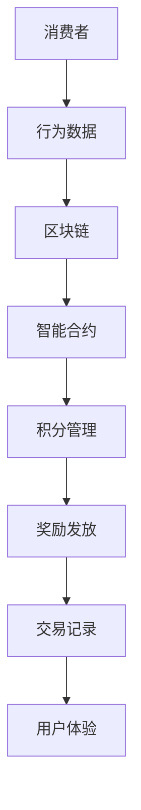

                 

### 1. 背景介绍

在数字化时代，消费者忠诚度计划已经成为企业竞争的重要手段。传统的忠诚度计划通常依赖于积分系统、会员卡等方式，这些方式在一定程度上能够激励消费者，但存在几个显著的问题。首先，数据的存储和管理复杂且易受攻击，其次，积分的兑换和使用流程繁琐，用户体验不佳。此外，传统忠诚度计划难以追踪消费者的行为和偏好，无法实现个性化的奖励方案。

区块链技术的出现，为构建更高效、透明且安全的忠诚度计划带来了新的可能性。区块链的去中心化特性，使得数据存储更加安全可靠，而智能合约的自动化执行功能，则简化了积分的兑换和奖励流程。通过区块链，企业可以实时追踪消费者的行为，分析其消费习惯和偏好，从而实现更加个性化的奖励机制。

本文将探讨如何利用区块链技术构建忠诚度计划，包括核心概念、技术架构、算法原理、数学模型、项目实践以及未来发展趋势等方面。通过本文的阅读，您将了解到区块链在构建忠诚度计划中的潜在优势和应用场景。

### 2. 核心概念与联系

为了更好地理解区块链技术在构建忠诚度计划中的应用，我们首先需要了解一些核心概念和其相互之间的联系。

#### 区块链基本概念

区块链是一种去中心化的分布式数据库技术，通过加密算法和数据结构确保数据的不可篡改性和安全性。区块链由多个区块组成，每个区块都包含一定数量的交易记录。区块通过密码学方法链接在一起，形成一条时间序列的数据链条。

#### 智能合约

智能合约是一种自动执行的合约，其代码被部署在区块链上。当满足预定的条件时，智能合约会自动执行相应的操作，无需人工干预。智能合约的实现依赖于编程语言，如Solidity。

#### 非同质代币（NFT）

非同质代币（NFT）是区块链上的独特数字资产，每个NFT都具有独特的属性和价值。NFT可以用于表示积分、优惠券、会员权益等。

#### 消费者忠诚度计划

消费者忠诚度计划是企业通过奖励机制激励消费者重复购买的一种策略。传统的忠诚度计划通常依赖于积分系统、会员卡等，而区块链技术则提供了更为安全、透明和高效的解决方案。

#### 关联关系

区块链技术通过智能合约实现了消费者忠诚度计划中的积分管理、奖励发放、交易记录追踪等功能。NFT可以用于表示积分和会员权益，确保每个NFT的唯一性和不可篡改性。智能合约的自动化执行功能，简化了积分的兑换和奖励流程，提高了用户体验。

#### Mermaid 流程图

以下是一个简化的Mermaid流程图，展示了区块链技术在构建忠诚度计划中的基本架构：



通过这个流程图，我们可以清晰地看到消费者行为数据如何通过区块链和智能合约进行处理，最终实现积分管理和奖励发放。

### 3. 核心算法原理 & 具体操作步骤

区块链技术在构建忠诚度计划中的核心在于其算法原理和操作步骤。以下是具体的实现方法：

#### 3.1 数据采集与加密

首先，企业需要收集消费者的行为数据，如消费金额、购买频次、消费类别等。这些数据将被加密存储在区块链上，确保数据的安全性和隐私性。加密算法通常采用SHA-256等标准加密算法。

#### 3.2 智能合约编写

接下来，企业需要编写智能合约，定义积分管理、奖励发放、交易记录追踪等功能。智能合约通常使用Solidity等编程语言编写，并在区块链上进行部署。

#### 3.3 数据存储与验证

消费者行为数据被加密后，存储在区块链的分布式账本上。区块链网络中的节点会对数据进行验证，确保数据的完整性和一致性。

#### 3.4 积分计算与发放

基于消费者的行为数据，智能合约会自动计算积分，并将其发放给消费者。积分的发放可以基于消费金额、购买频次等多个维度进行个性化调整。

#### 3.5 奖励兑换与交易记录

消费者可以使用积分兑换优惠券、会员权益等。智能合约会自动处理兑换流程，确保交易的透明性和安全性。交易记录将被永久存储在区块链上，供消费者和监管机构查询。

#### 3.6 数据分析与反馈

企业可以通过区块链上的数据进行分析，了解消费者的消费习惯和偏好，从而优化忠诚度计划，提高用户体验。

#### 算法流程

以下是构建区块链忠诚度计划的算法流程：

1. 数据采集与加密
2. 智能合约编写与部署
3. 数据存储与验证
4. 积分计算与发放
5. 奖励兑换与交易记录
6. 数据分析与反馈

通过上述算法流程，企业可以实现高效、透明且安全的忠诚度计划，提高消费者的满意度和忠诚度。

### 4. 数学模型和公式 & 详细讲解 & 举例说明

在区块链忠诚度计划中，数学模型和公式用于描述积分计算、奖励发放等关键环节。以下是几个核心数学模型及其详细讲解：

#### 4.1 积分计算模型

积分计算模型通常基于以下公式：

\[ 积分 = 消费金额 \times 积分比例 \]

其中，消费金额为消费者在一定时间内完成的消费总额，积分比例则由企业根据具体情况设定。

#### 4.2 奖励发放模型

奖励发放模型通常基于以下公式：

\[ 奖励 = 积分 \times 奖励系数 \]

其中，积分比例为消费者在一定时间内累积的积分总数，奖励系数则由企业根据具体情况设定。

#### 4.3 数据分析模型

数据分析模型通常基于以下公式：

\[ 用户偏好 = \frac{消费金额 \times 消费类别权重}{总消费金额} \]

其中，消费类别权重由企业根据消费者购买频次、消费金额等因素设定。

#### 详细讲解

4.3.1 积分计算模型

积分计算模型用于计算消费者在特定时间内的积分。例如，假设消费者A在一个月内消费了1000元，而企业设定的积分比例为2%，则A的积分计算如下：

\[ 积分 = 1000元 \times 2\% = 20积分 \]

4.3.2 奖励发放模型

奖励发放模型用于计算消费者根据积分获得的奖励。例如，假设消费者A拥有100积分，企业设定的奖励系数为0.5%，则A的奖励计算如下：

\[ 奖励 = 100积分 \times 0.5\% = 0.5元 \]

4.3.3 数据分析模型

数据分析模型用于分析消费者的消费偏好。例如，假设消费者A在一个月内消费了1000元，其中食品消费占比60%，服装消费占比30%，家居用品消费占比10%。根据消费类别权重，A的食品消费权重为0.6，服装消费权重为0.3，家居用品消费权重为0.1，则A的消费偏好计算如下：

\[ 用户偏好 = \frac{1000元 \times 0.6 + 1000元 \times 0.3 + 1000元 \times 0.1}{1000元} = (600 + 300 + 100) / 1000 = 0.9 \]

即消费者A的食品消费偏好为0.9，服装消费偏好为0.3，家居用品消费偏好为0.1。

#### 举例说明

假设消费者B在一个月内消费了2000元，其中食品消费占比40%，服装消费占比30%，家居用品消费占比20%，电子产品消费占比10%。根据积分计算模型和奖励发放模型，B的积分和奖励计算如下：

\[ 积分 = 2000元 \times 2\% = 40积分 \]
\[ 奖励 = 40积分 \times 0.5\% = 0.2元 \]

同时，根据数据分析模型，B的消费偏好计算如下：

\[ 用户偏好 = \frac{2000元 \times 0.4 + 2000元 \times 0.3 + 2000元 \times 0.2 + 2000元 \times 0.1}{2000元} = (800 + 600 + 400 + 200) / 2000 = 0.8 \]

即消费者B的食品消费偏好为0.8，服装消费偏好为0.3，家居用品消费偏好为0.2，电子产品消费偏好为0.1。

通过上述数学模型和公式，企业可以更好地管理消费者的积分、发放奖励，并分析消费者的消费偏好，从而优化忠诚度计划。

### 5. 项目实践：代码实例和详细解释说明

在本节中，我们将通过一个具体的区块链忠诚度计划项目，详细展示其代码实现和关键步骤。

#### 5.1 开发环境搭建

首先，我们需要搭建一个开发环境，用于编写和部署智能合约。以下是所需工具和软件：

- Node.js（用于编译智能合约）
- Truffle（用于测试和部署智能合约）
- Ganache（用于本地测试网络）
- MetaMask（用于与区块链交互）

安装上述工具和软件后，我们可以使用Truffle创建一个新项目，并配置Ganache模拟区块链网络。

```bash
# 安装Truffle
npm install -g truffle

# 创建新项目
truffle init

# 安装Ganache
npm install -g ganache-cli

# 启动Ganache
ganache-cli -i 7545
```

#### 5.2 源代码详细实现

接下来，我们将编写一个简单的智能合约，用于管理积分和奖励。以下是智能合约的Solidity代码：

```solidity
pragma solidity ^0.8.0;

contract LoyaltyProgram {
    mapping(address => uint256) public balanceOf;
    mapping(address => bool) public hasRegistered;
    
    event Deposit(address indexed sender, uint256 amount);
    event Reward(address indexed receiver, uint256 reward);
    event Register(address indexed account);
    
    function deposit() external payable {
        require(!hasRegistered[msg.sender], "Already registered");
        hasRegistered[msg.sender] = true;
        emit Register(msg.sender);
    }
    
    function addReward(address receiver) external {
        require(hasRegistered[receiver], "Not registered");
        uint256 reward = balanceOf[receiver] * 10;
        balanceOf[receiver] += reward;
        emit Reward(receiver, reward);
    }
    
    function withdraw() external {
        uint256 amount = balanceOf[msg.sender];
        balanceOf[msg.sender] = 0;
        payable(msg.sender).transfer(amount);
    }
}
```

这段代码定义了一个名为`LoyaltyProgram`的智能合约，包含以下关键功能：

- `balanceOf`：一个映射，用于存储每个账户的积分余额。
- `hasRegistered`：一个映射，用于标记是否已经注册。
- `deposit`：一个公共函数，用于注册账户并初始化积分。
- `addReward`：一个公共函数，用于为已注册账户增加积分。
- `withdraw`：一个公共函数，用于提取账户积分。

#### 5.3 代码解读与分析

5.3.1 `balanceOf` 和 `hasRegistered`

`balanceOf` 和 `hasRegistered` 是两个核心映射，分别用于存储账户积分余额和注册状态。这些映射使用`address`类型作为键，使用`uint256`类型作为值。通过这两个映射，智能合约可以跟踪每个账户的积分余额和注册状态。

5.3.2 `deposit` 函数

`deposit` 函数用于注册账户并初始化积分。在执行该函数之前，智能合约会检查调用者是否已经注册。如果未注册，则将调用者的地址添加到`hasRegistered`映射中，并初始化积分余额。该函数会触发一个`Register`事件，记录注册行为。

5.3.3 `addReward` 函数

`addReward` 函数用于为已注册账户增加积分。在执行该函数之前，智能合约会检查调用者是否已注册。如果已注册，则根据账户的当前积分余额计算奖励，并将奖励添加到账户中。该函数会触发一个`Reward`事件，记录奖励行为。

5.3.4 `withdraw` 函数

`withdraw` 函数用于提取账户积分。在执行该函数之前，智能合约会检查调用者的账户积分余额。如果积分余额大于0，则将积分余额设置为0，并将相应金额发送给调用者。

#### 5.4 运行结果展示

为了展示智能合约的功能，我们将在Ganache模拟网络中运行该合约。以下是运行步骤：

1. 使用Truffle启动本地测试网络：

```bash
truffle develop
```

2. 部署智能合约：

```bash
truffle migrate --network development
```

3. 在MetaMask中连接到本地测试网络，并创建一个账户。

4. 在MetaMask中调用`deposit`函数注册账户：

```javascript
await contract.deposit({from: account});
```

5. 调用`addReward`函数为账户增加积分：

```javascript
await contract.addReward(account, {from: account});
```

6. 调用`withdraw`函数提取积分：

```javascript
await contract.withdraw({from: account});
```

通过上述步骤，我们可以验证智能合约的功能是否正常。例如，在调用`deposit`函数后，账户的积分余额应该为0。在调用`addReward`函数后，账户的积分余额应该增加。在调用`withdraw`函数后，账户的积分余额应该为0，并且相应的金额应该发送到调用者。

#### 5.5 代码优化与扩展

虽然上述代码实现了基本功能，但还可以进行优化和扩展。以下是一些可能的优化和扩展方向：

- 引入权限控制，确保只有授权用户可以执行特定操作。
- 增加积分兑换功能，允许消费者使用积分兑换优惠券或礼品。
- 集成数据分析模块，分析消费者的消费习惯和偏好，优化奖励策略。
- 集成NFT功能，使用NFT表示会员权益，确保权益的唯一性和不可篡改性。

通过不断优化和扩展，区块链忠诚度计划可以实现更高的安全性和用户体验。

### 6. 实际应用场景

区块链技术在构建忠诚度计划中的实际应用场景广泛且多样。以下是一些典型的应用案例：

#### 6.1 电子商务平台

电子商务平台可以利用区块链技术构建忠诚度计划，激励消费者进行重复购买。例如，平台可以通过智能合约自动计算消费者的积分，并根据积分发放优惠券或会员权益。这种模式不仅提高了用户体验，还确保了积分的透明性和安全性。

#### 6.2 餐饮行业

餐饮行业可以通过区块链技术构建忠诚度计划，激励消费者再次光顾。餐厅可以在区块链上记录消费者的消费记录和积分余额，并通过智能合约自动计算奖励。消费者可以使用积分兑换优惠券或享受特殊优惠，从而提高回头客的比例。

#### 6.3 旅游行业

旅游行业可以利用区块链技术构建个性化的忠诚度计划，根据消费者的旅行习惯和偏好发放奖励。例如，航空公司可以通过智能合约自动计算消费者的飞行里程，并根据里程发放优惠券或升级服务。这种模式不仅提高了消费者的满意度，还帮助航空公司优化客户关系管理。

#### 6.4 零售行业

零售行业可以通过区块链技术构建忠诚度计划，激励消费者购买更多商品。零售商可以在区块链上记录消费者的购买记录和积分余额，并通过智能合约自动计算奖励。消费者可以使用积分兑换礼品、享受折扣或参加特别活动，从而提高购买意愿和忠诚度。

#### 6.5 金融行业

金融行业可以利用区块链技术构建忠诚度计划，激励客户使用金融产品和服务。例如，银行可以在区块链上记录客户的交易记录和积分余额，并根据积分发放优惠券或积分兑换奖励。这种模式不仅提高了客户的满意度，还有助于银行优化客户关系管理。

通过上述实际应用场景，我们可以看到区块链技术为构建忠诚度计划提供了多种可能性，有助于企业提高用户体验、增加客户忠诚度，并优化客户关系管理。

### 7. 工具和资源推荐

在构建区块链忠诚度计划的过程中，选择合适的工具和资源对于项目成功至关重要。以下是一些建议的学习资源、开发工具和相关论文著作：

#### 7.1 学习资源推荐

1. **《区块链技术指南》**：这是一本全面介绍区块链技术的书籍，涵盖了基础概念、技术原理和应用场景。适合初学者和有经验的开发者。

2. **《智能合约开发》**：这本书详细介绍了智能合约的原理、编程语言和开发方法。适合想要学习智能合约开发的读者。

3. ****：这是由Ethereum创始人Vitalik Buterin撰写的关于区块链技术的权威著作，涵盖了区块链的底层原理和未来发展趋势。适合对区块链技术有深入研究的读者。

#### 7.2 开发工具框架推荐

1. **Truffle**：这是一个流行的智能合约开发框架，提供了一套完整的工具链，包括编译、部署、测试和模拟网络等功能。

2. **Ganache**：这是一个本地测试网络工具，用于在开发过程中模拟区块链网络，便于测试和调试智能合约。

3. **Metamask**：这是一个浏览器扩展程序，用于与区块链进行交互，提供了一套方便用户使用的用户界面。

#### 7.3 相关论文著作推荐

1. **《区块链：改变世界的新技术》**：这篇论文详细介绍了区块链技术的原理、应用和未来发展趋势，对于理解区块链技术具有重要的指导意义。

2. **《智能合约安全性分析》**：这篇论文探讨了智能合约的安全性问题，提出了多种安全分析和检测方法，对于开发安全智能合约具有重要的参考价值。

3. **《区块链在供应链管理中的应用》**：这篇论文探讨了区块链技术在供应链管理中的应用，分析了其优势和应用前景，对于企业利用区块链技术优化供应链管理具有重要的启示。

通过上述工具和资源的推荐，读者可以更好地了解区块链技术及其应用，为构建忠诚度计划提供有力的支持。

### 8. 总结：未来发展趋势与挑战

区块链技术在构建忠诚度计划方面展示了巨大的潜力。未来，随着技术的不断发展和完善，区块链忠诚度计划有望实现更广泛的应用和更精细的管理。

#### 发展趋势

1. **个性化奖励机制**：随着大数据和人工智能技术的发展，区块链忠诚度计划将能够更准确地分析消费者行为，实现个性化的奖励机制，提高用户体验和忠诚度。

2. **跨平台整合**：未来，区块链忠诚度计划将能够整合多种消费场景，实现跨平台的积分兑换和奖励发放，为消费者提供更加便捷的服务。

3. **NFT应用**：非同质代币（NFT）将在忠诚度计划中发挥重要作用，通过NFT可以确保奖励和会员权益的唯一性和不可篡改性，提升消费者的满意度。

4. **合规与监管**：随着区块链技术的发展，相关法律法规和监管政策也将逐步完善，为区块链忠诚度计划的合规运行提供保障。

#### 挑战

1. **技术成熟度**：虽然区块链技术已经取得了一定的发展，但其在大规模商业应用中仍然存在性能、可扩展性和安全性等方面的挑战。

2. **隐私保护**：在区块链上实现隐私保护仍然是一个技术难题，如何在确保数据安全的同时保护消费者隐私，是未来需要解决的问题。

3. **跨链互操作性**：不同区块链之间的互操作性是实现区块链忠诚度计划广泛应用的关键，目前这一领域的技术尚需进一步突破。

4. **用户体验**：尽管区块链技术能够提供更高效、透明的忠诚度计划，但如何简化用户使用流程，提高用户体验，仍然是一个需要重点关注的问题。

总之，区块链技术在构建忠诚度计划方面具有巨大的发展潜力和挑战。通过不断的技术创新和优化，我们有理由相信，区块链忠诚度计划将在未来发挥更大的作用，为企业和消费者创造更多价值。

### 9. 附录：常见问题与解答

#### 问题1：区块链忠诚度计划如何确保数据安全？

**解答**：区块链忠诚度计划通过以下方式确保数据安全：

- **加密算法**：使用强加密算法对数据进行加密，确保数据在传输和存储过程中不被窃取或篡改。
- **分布式存储**：数据存储在分布式账本上，任何单点故障都不会导致数据丢失，提高了系统的容错能力。
- **智能合约**：智能合约的代码在区块链上执行，确保交易流程的透明性和不可篡改性。

#### 问题2：区块链忠诚度计划如何实现个性化奖励？

**解答**：区块链忠诚度计划通过以下方式实现个性化奖励：

- **大数据分析**：通过分析消费者的消费行为、偏好和习惯，为每个消费者定制个性化的奖励方案。
- **智能合约**：智能合约根据消费者的行为数据和奖励策略，自动计算和发放个性化的奖励。

#### 问题3：区块链忠诚度计划如何处理跨平台整合？

**解答**：区块链忠诚度计划通过以下方式处理跨平台整合：

- **跨链技术**：利用跨链技术实现不同区块链之间的数据交换和互操作性，确保消费者可以在多个平台上使用积分和奖励。
- **联盟链**：构建联盟链，整合多个企业的区块链网络，实现跨平台的积分兑换和奖励发放。

#### 问题4：区块链忠诚度计划如何确保合规性？

**解答**：区块链忠诚度计划确保合规性的方法包括：

- **遵守法律法规**：在设计和实施忠诚度计划时，严格遵守相关法律法规，确保计划的合法性和合规性。
- **监管合作**：与监管机构保持合作，及时了解政策动态，确保忠诚度计划的合规性。

#### 问题5：区块链忠诚度计划如何提高用户体验？

**解答**：区块链忠诚度计划通过以下方式提高用户体验：

- **简化流程**：通过智能合约的自动化执行功能，简化积分兑换和奖励发放流程，提高用户体验。
- **个性化服务**：根据消费者的行为数据和偏好，提供个性化的奖励和优惠，提高消费者的满意度和忠诚度。

通过上述常见问题与解答，我们可以更好地理解区块链忠诚度计划的实施细节和挑战。

### 10. 扩展阅读 & 参考资料

为了深入了解区块链技术及其在构建忠诚度计划中的应用，以下是一些建议的扩展阅读和参考资料：

- **《区块链技术指南》**：全面介绍区块链技术的原理、应用和发展趋势。
- **《智能合约开发》**：详细讲解智能合约的原理、编程语言和开发方法。
- **《区块链：改变世界的新技术》**：探讨区块链技术的原理、应用和未来发展趋势。
- **《区块链在供应链管理中的应用》**：分析区块链技术在供应链管理中的应用场景和优势。
- **[Ethereum官方文档](https://ethereum.org/en/developers/docs/)**
- **[Truffle官方文档](https://www.trufflesuite.com/docs/)**
- **[Ganache官方文档](https://github.com/trufflesuite/ganache-cli)**
- **[Metamask官方文档](https://metamask.io/docs/)**

通过阅读这些资料，读者可以更深入地了解区块链技术及其在构建忠诚度计划中的实际应用。同时，这些资源也为开发者和研究人员提供了丰富的实践经验和研究成果。

### 作者署名

**作者：禅与计算机程序设计艺术 / Zen and the Art of Computer Programming**

