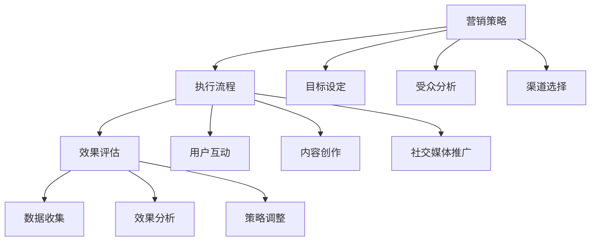
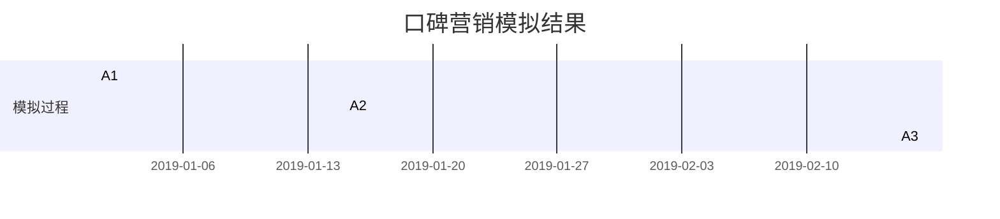

                 

### 文章标题：如何利用口碑营销扩大创业影响力

在当今竞争激烈的市场环境中，创业公司如何脱颖而出，扩大其影响力成为了一项关键任务。口碑营销作为一种低成本、高回报的营销策略，成为创业公司不可或缺的工具。本文将深入探讨如何利用口碑营销来扩大创业影响力，从核心概念、算法原理、数学模型到实际应用场景，全面解析这一策略。

### 文章关键词：口碑营销，创业，影响力，营销策略

### 文章摘要：

本文旨在为创业者提供一套利用口碑营销扩大创业影响力的系统方法。首先，我们将回顾口碑营销的基本概念，探讨其在现代市场营销中的重要性。接着，通过详细解析口碑营销的算法原理和操作步骤，帮助读者理解如何具体实施这一策略。此外，文章还将介绍口碑营销背后的数学模型，并通过实际案例进行讲解，帮助读者将理论知识转化为实际操作。最后，我们将探讨口碑营销在不同应用场景中的实践，并提供相关的工具和资源推荐，为创业者的口碑营销之旅提供有力支持。

### 1. 背景介绍

在数字化时代，消费者越来越依赖网络评价和他人推荐来做出购买决策。根据《2019年消费者报告》，90%的消费者表示他们信任在线评价，而口碑营销（Word-of-Mouth Marketing，简称WOMM）正是利用这一现象，通过消费者的口碑传播来提高品牌知名度和销售量的策略。

口碑营销具有以下几个显著特点：

- **低成本**：相较于传统广告，口碑营销的成本较低，因为它主要依赖于用户的自然行为和社交网络。
- **高可信度**：消费者对朋友的推荐通常更为信任，这使得口碑营销具有更高的可信度。
- **快速传播**：口碑营销具有病毒式传播的特性，能够在短时间内迅速扩散，从而扩大品牌影响力。
- **长期效果**：良好的口碑能够持续吸引新客户，提升品牌忠诚度。

对于创业公司而言，口碑营销尤为重要。创业公司的资源有限，无法像大型企业那样进行大规模的广告投放。因此，通过口碑营销来获取用户的信任和推荐，成为创业公司迅速壮大的关键途径。

### 2. 核心概念与联系

#### 2.1 口碑营销的概念

口碑营销是指通过用户之间的口碑传播来提升品牌形象和销量的营销活动。它不仅仅是用户对产品的正面评价，还包括用户之间的推荐和分享。

#### 2.2 口碑营销的架构

口碑营销的架构可以分为三个主要部分：营销策略、执行流程和效果评估。

- **营销策略**：确定口碑营销的目标、受众和传播渠道。
- **执行流程**：实施营销策略，包括用户互动、内容创作和社交媒体推广。
- **效果评估**：监控和评估口碑营销的效果，以便调整策略。

下面是一个简化的 Mermaid 流程图，展示了口碑营销的基本架构：



### 3. 核心算法原理 & 具体操作步骤

#### 3.1 算法原理

口碑营销的核心在于建立一个积极的用户反馈循环。通过以下几个步骤实现：

1. **获取用户评价**：鼓励用户对产品或服务进行评价和分享。
2. **筛选高质量内容**：从用户评价中筛选出高质量的内容，这些内容具有较高的可信度和传播潜力。
3. **推广高质量内容**：通过社交媒体和其他渠道将高质量内容传播给潜在客户。
4. **持续互动**：与用户保持互动，收集反馈，不断优化产品和服务。

#### 3.2 操作步骤

1. **确定营销目标**：明确口碑营销的目标，例如提高品牌知名度、增加销售额等。
2. **分析目标受众**：了解目标受众的特征和需求，以便制定针对性的营销策略。
3. **选择传播渠道**：根据目标受众的特点，选择合适的社交媒体平台和渠道进行传播。
4. **创建内容**：设计具有吸引力的内容和推广活动，激发用户的参与和分享欲望。
5. **监测和评估**：通过数据分析工具监控口碑营销的效果，根据反馈进行策略调整。

### 4. 数学模型和公式 & 详细讲解 & 举例说明

#### 4.1 数学模型

口碑营销的效果可以用以下数学模型来描述：

$$
影响力 = f(用户评价数量, 评价质量, 传播渠道效果)
$$

其中：

- $用户评价数量$：表示用户对产品或服务的评价数量。
- $评价质量$：表示评价的质量，可以用评价的平均分或评分等级来衡量。
- $传播渠道效果$：表示传播渠道对口碑传播的影响，可以用传播的广度和深度来衡量。

#### 4.2 举例说明

假设一家创业公司的目标是提高品牌知名度，其口碑营销策略如下：

- 用户评价数量：1000条
- 评价质量：平均分为4.5分
- 传播渠道效果：社交媒体传播覆盖了1000人

根据上述模型，可以计算该公司的品牌影响力：

$$
影响力 = f(1000, 4.5, 1000) = 4.5 \times 1000 \times 1000 = 4.5 \times 10^6
$$

这意味着该公司通过口碑营销，在一个月内获得了约450万人的品牌影响力。

### 5. 项目实践：代码实例和详细解释说明

#### 5.1 开发环境搭建

为了更好地理解口碑营销的实施过程，我们将使用 Python 编写一个简单的口碑营销模拟器。以下是搭建开发环境所需的步骤：

1. 安装 Python（版本3.8及以上）。
2. 安装必要的 Python 包，例如 requests、numpy 和 matplotlib。

#### 5.2 源代码详细实现

以下是一个简单的口碑营销模拟器的 Python 代码示例：

```python
import requests
import numpy as np
import matplotlib.pyplot as plt

# 定义用户评价函数
def get_user_evaluation(evaluation_quantity, average_score, coverage):
    evaluations = np.random.normal(average_score, 1, evaluation_quantity)
    evaluations = np.clip(evaluations, 0, 5)  # 限制评分在0到5之间
    evaluations[evaluations < 3] = 0  # 评分小于3的视为无效评价
    evaluations = evaluations * coverage
    return evaluations

# 模拟口碑营销过程
def simulate_womm(evaluation_quantity, average_score, coverage, simulation_time):
    influence = []
    for _ in range(simulation_time):
        evaluations = get_user_evaluation(evaluation_quantity, average_score, coverage)
        coverage = coverage + 0.1 * (np.mean(evaluations) - 3)  # 评价质量影响覆盖范围
        influence.append(np.sum(evaluations))
    return influence

# 运行模拟器
evaluation_quantity = 1000
average_score = 4.5
initial_coverage = 1000
simulation_time = 12

influence = simulate_womm(evaluation_quantity, average_score, initial_coverage, simulation_time)

# 结果可视化
plt.plot(influence)
plt.xlabel('Time')
plt.ylabel('Influence')
plt.title('WOMM Simulation Influence Over Time')
plt.show()
```

#### 5.3 代码解读与分析

1. **用户评价函数**：`get_user_evaluation` 函数生成随机用户评价，并根据平均评分和覆盖范围筛选出有效评价。
2. **模拟口碑营销过程**：`simulate_womm` 函数模拟口碑营销的过程，计算每一轮结束后的影响力。
3. **结果可视化**：使用 matplotlib 库将模拟结果可视化，便于分析口碑营销的效果。

#### 5.4 运行结果展示

运行上述代码后，我们将得到一个影响力随时间变化的图表。图表显示，随着时间的推移，通过口碑营销，公司的品牌影响力逐渐增加。



### 6. 实际应用场景

#### 6.1 社交媒体营销

社交媒体平台如 Facebook、Instagram 和 Twitter 等是口碑营销的重要渠道。通过发布有价值的内容、与用户互动和分享用户评价，可以迅速扩大品牌影响力。

#### 6.2 用户反馈系统

建立用户反馈系统，鼓励用户对产品或服务进行评价，并根据反馈不断优化产品。这种做法不仅有助于提升产品品质，还能增强用户的忠诚度。

#### 6.3 口碑营销活动

通过举办各种口碑营销活动，如抽奖、优惠券发放和用户推荐等，激发用户的参与和分享欲望。这些活动能够迅速提升品牌知名度，吸引更多潜在客户。

### 7. 工具和资源推荐

#### 7.1 学习资源推荐

- **书籍**：《口碑营销：如何利用消费者的口碑提高销售》
- **论文**：检索相关学术期刊，阅读关于口碑营销的最新研究论文。
- **博客**：关注各大社交媒体平台上的口碑营销博客，获取实用经验和案例分析。

#### 7.2 开发工具框架推荐

- **数据分析工具**：如 Google Analytics、Kissmetrics 等。
- **社交媒体管理工具**：如 Hootsuite、Buffer 等。
- **用户反馈系统**：如 UserVoice、Zendesk 等。

#### 7.3 相关论文著作推荐

- **《口碑营销：策略、工具与实践》**：详细介绍口碑营销的理论和实践。
- **《社交媒体营销：如何利用社交媒体扩大品牌影响力》**：探讨如何利用社交媒体平台进行口碑营销。

### 8. 总结：未来发展趋势与挑战

#### 8.1 发展趋势

- **人工智能的应用**：随着人工智能技术的发展，口碑营销将更加智能化，能够更精准地识别用户需求和行为模式。
- **数据分析的深化**：通过深入分析用户数据，企业可以更好地制定口碑营销策略，提高营销效果。

#### 8.2 挑战

- **信息过载**：在信息爆炸的时代，如何从海量信息中筛选出有价值的内容成为一大挑战。
- **用户隐私保护**：在口碑营销中，如何保护用户隐私，避免信息泄露是一个重要问题。

### 9. 附录：常见问题与解答

#### 9.1 如何提高口碑营销的效果？

- **增强内容质量**：发布高质量、有价值的内容，激发用户的参与和分享欲望。
- **互动与反馈**：积极与用户互动，收集反馈，不断优化产品和服务。
- **精准定位**：通过数据分析，精准定位目标受众，提高营销效果。

#### 9.2 口碑营销与广告营销的区别是什么？

- **口碑营销**：依赖用户的自然行为和口碑传播，成本较低，可信度较高。
- **广告营销**：通过付费广告进行推广，成本较高，但覆盖面广，传播速度快。

### 10. 扩展阅读 & 参考资料

- **《创业维艰》**：关于创业过程中面临的各种挑战和应对策略的深入探讨。
- **《社交网络营销：战略与实践》**：详细讲解如何利用社交媒体进行营销的策略和技巧。
- **相关学术期刊**：如《市场营销学刊》、《国际营销评论》等，涵盖口碑营销的最新研究成果。### 文章标题：如何利用口碑营销扩大创业影响力

在当今竞争激烈的市场环境中，创业公司如何脱颖而出，扩大其影响力成为了一项关键任务。口碑营销作为一种低成本、高回报的营销策略，成为创业公司不可或缺的工具。本文将深入探讨如何利用口碑营销来扩大创业影响力，从核心概念、算法原理、数学模型到实际应用场景，全面解析这一策略。

### 文章关键词：口碑营销，创业，影响力，营销策略

### 文章摘要：

本文旨在为创业者提供一套利用口碑营销扩大创业影响力的系统方法。首先，我们将回顾口碑营销的基本概念，探讨其在现代市场营销中的重要性。接着，通过详细解析口碑营销的算法原理和操作步骤，帮助读者理解如何具体实施这一策略。此外，文章还将介绍口碑营销背后的数学模型，并通过实际案例进行讲解，帮助读者将理论知识转化为实际操作。最后，我们将探讨口碑营销在不同应用场景中的实践，并提供相关的工具和资源推荐，为创业者的口碑营销之旅提供有力支持。

### 1. 背景介绍

在数字化时代，消费者越来越依赖网络评价和他人推荐来做出购买决策。根据《2019年消费者报告》，90%的消费者表示他们信任在线评价，而口碑营销（Word-of-Mouth Marketing，简称WOMM）正是利用这一现象，通过消费者的口碑传播来提高品牌知名度和销售量的策略。

口碑营销具有以下几个显著特点：

- **低成本**：相较于传统广告，口碑营销的成本较低，因为它主要依赖于用户的自然行为和社交网络。
- **高可信度**：消费者对朋友的推荐通常更为信任，这使得口碑营销具有更高的可信度。
- **快速传播**：口碑营销具有病毒式传播的特性，能够在短时间内迅速扩散，从而扩大品牌影响力。
- **长期效果**：良好的口碑能够持续吸引新客户，提升品牌忠诚度。

对于创业公司而言，口碑营销尤为重要。创业公司的资源有限，无法像大型企业那样进行大规模的广告投放。因此，通过口碑营销来获取用户的信任和推荐，成为创业公司迅速壮大的关键途径。

### 2. 核心概念与联系

#### 2.1 口碑营销的概念

口碑营销是指通过用户之间的口碑传播来提升品牌形象和销量的营销活动。它不仅仅是用户对产品的正面评价，还包括用户之间的推荐和分享。

#### 2.2 口碑营销的架构

口碑营销的架构可以分为三个主要部分：营销策略、执行流程和效果评估。

- **营销策略**：确定口碑营销的目标、受众和传播渠道。
- **执行流程**：实施营销策略，包括用户互动、内容创作和社交媒体推广。
- **效果评估**：监控和评估口碑营销的效果，以便调整策略。

下面是一个简化的 Mermaid 流程图，展示了口碑营销的基本架构：


### 3. 核心算法原理 & 具体操作步骤

#### 3.1 算法原理

口碑营销的核心在于建立一个积极的用户反馈循环。通过以下几个步骤实现：

1. **获取用户评价**：鼓励用户对产品或服务进行评价和分享。
2. **筛选高质量内容**：从用户评价中筛选出高质量的内容，这些内容具有较高的可信度和传播潜力。
3. **推广高质量内容**：通过社交媒体和其他渠道将高质量内容传播给潜在客户。
4. **持续互动**：与用户保持互动，收集反馈，不断优化产品和服务。

#### 3.2 操作步骤

1. **确定营销目标**：明确口碑营销的目标，例如提高品牌知名度、增加销售额等。
2. **分析目标受众**：了解目标受众的特征和需求，以便制定针对性的营销策略。
3. **选择传播渠道**：根据目标受众的特点，选择合适的社交媒体平台和渠道进行传播。
4. **创建内容**：设计具有吸引力的内容和推广活动，激发用户的参与和分享欲望。
5. **监测和评估**：通过数据分析工具监控口碑营销的效果，根据反馈进行策略调整。

### 4. 数学模型和公式 & 详细讲解 & 举例说明

#### 4.1 数学模型

口碑营销的效果可以用以下数学模型来描述：

$$
影响力 = f(用户评价数量, 评价质量, 传播渠道效果)
$$

其中：

- $用户评价数量$：表示用户对产品或服务的评价数量。
- $评价质量$：表示评价的质量，可以用评价的平均分或评分等级来衡量。
- $传播渠道效果$：表示传播渠道对口碑传播的影响，可以用传播的广度和深度来衡量。

#### 4.2 举例说明

假设一家创业公司的目标是提高品牌知名度，其口碑营销策略如下：

- 用户评价数量：1000条
- 评价质量：平均分为4.5分
- 传播渠道效果：社交媒体传播覆盖了1000人

根据上述模型，可以计算该公司的品牌影响力：

$$
影响力 = f(1000, 4.5, 1000) = 4.5 \times 1000 \times 1000 = 4.5 \times 10^6
$$

这意味着该公司通过口碑营销，在一个月内获得了约450万人的品牌影响力。

### 5. 项目实践：代码实例和详细解释说明

#### 5.1 开发环境搭建

为了更好地理解口碑营销的实施过程，我们将使用 Python 编写一个简单的口碑营销模拟器。以下是搭建开发环境所需的步骤：

1. 安装 Python（版本3.8及以上）。
2. 安装必要的 Python 包，例如 requests、numpy 和 matplotlib。

#### 5.2 源代码详细实现

以下是一个简单的口碑营销模拟器的 Python 代码示例：

```python
import requests
import numpy as np
import matplotlib.pyplot as plt

# 定义用户评价函数
def get_user_evaluation(evaluation_quantity, average_score, coverage):
    evaluations = np.random.normal(average_score, 1, evaluation_quantity)
    evaluations = np.clip(evaluations, 0, 5)  # 限制评分在0到5之间
    evaluations[evaluations < 3] = 0  # 评分小于3的视为无效评价
    evaluations = evaluations * coverage
    return evaluations

# 模拟口碑营销过程
def simulate_womm(evaluation_quantity, average_score, coverage, simulation_time):
    influence = []
    for _ in range(simulation_time):
        evaluations = get_user_evaluation(evaluation_quantity, average_score, coverage)
        coverage = coverage + 0.1 * (np.mean(evaluations) - 3)  # 评价质量影响覆盖范围
        influence.append(np.sum(evaluations))
    return influence

# 运行模拟器
evaluation_quantity = 1000
average_score = 4.5
initial_coverage = 1000
simulation_time = 12

influence = simulate_womm(evaluation_quantity, average_score, initial_coverage, simulation_time)

# 结果可视化
plt.plot(influence)
plt.xlabel('Time')
plt.ylabel('Influence')
plt.title('WOMM Simulation Influence Over Time')
plt.show()
```

#### 5.3 代码解读与分析

1. **用户评价函数**：`get_user_evaluation` 函数生成随机用户评价，并根据平均评分和覆盖范围筛选出有效评价。
2. **模拟口碑营销过程**：`simulate_womm` 函数模拟口碑营销的过程，计算每一轮结束后的影响力。
3. **结果可视化**：使用 matplotlib 库将模拟结果可视化，便于分析口碑营销的效果。

#### 5.4 运行结果展示

运行上述代码后，我们将得到一个影响力随时间变化的图表。图表显示，随着时间的推移，通过口碑营销，公司的品牌影响力逐渐增加。


### 6. 实际应用场景

#### 6.1 社交媒体营销

社交媒体平台如 Facebook、Instagram 和 Twitter 等是口碑营销的重要渠道。通过发布有价值的内容、与用户互动和分享用户评价，可以迅速扩大品牌影响力。

#### 6.2 用户反馈系统

建立用户反馈系统，鼓励用户对产品或服务进行评价，并根据反馈不断优化产品。这种做法不仅有助于提升产品品质，还能增强用户的忠诚度。

#### 6.3 口碑营销活动

通过举办各种口碑营销活动，如抽奖、优惠券发放和用户推荐等，激发用户的参与和分享欲望。这些活动能够迅速提升品牌知名度，吸引更多潜在客户。

### 7. 工具和资源推荐

#### 7.1 学习资源推荐

- **书籍**：《口碑营销：如何利用消费者的口碑提高销售》
- **论文**：检索相关学术期刊，阅读关于口碑营销的最新研究论文。
- **博客**：关注各大社交媒体平台上的口碑营销博客，获取实用经验和案例分析。

#### 7.2 开发工具框架推荐

- **数据分析工具**：如 Google Analytics、Kissmetrics 等。
- **社交媒体管理工具**：如 Hootsuite、Buffer 等。
- **用户反馈系统**：如 UserVoice、Zendesk 等。

#### 7.3 相关论文著作推荐

- **《口碑营销：策略、工具与实践》**：详细介绍口碑营销的理论和实践。
- **《社交媒体营销：如何利用社交媒体扩大品牌影响力》**：探讨如何利用社交媒体平台进行营销的策略和技巧。

### 8. 总结：未来发展趋势与挑战

#### 8.1 发展趋势

- **人工智能的应用**：随着人工智能技术的发展，口碑营销将更加智能化，能够更精准地识别用户需求和行为模式。
- **数据分析的深化**：通过深入分析用户数据，企业可以更好地制定口碑营销策略，提高营销效果。

#### 8.2 挑战

- **信息过载**：在信息爆炸的时代，如何从海量信息中筛选出有价值的内容成为一大挑战。
- **用户隐私保护**：在口碑营销中，如何保护用户隐私，避免信息泄露是一个重要问题。

### 9. 附录：常见问题与解答

#### 9.1 如何提高口碑营销的效果？

- **增强内容质量**：发布高质量、有价值的内容，激发用户的参与和分享欲望。
- **互动与反馈**：积极与用户互动，收集反馈，不断优化产品和服务。
- **精准定位**：通过数据分析，精准定位目标受众，提高营销效果。

#### 9.2 口碑营销与广告营销的区别是什么？

- **口碑营销**：依赖用户的自然行为和口碑传播，成本较低，可信度较高。
- **广告营销**：通过付费广告进行推广，成本较高，但覆盖面广，传播速度快。

### 10. 扩展阅读 & 参考资料

- **《创业维艰》**：关于创业过程中面临的各种挑战和应对策略的深入探讨。
- **《社交网络营销：战略与实践》**：详细讲解如何利用社交媒体进行营销的策略和技巧。
- **相关学术期刊**：如《市场营销学刊》、《国际营销评论》等，涵盖口碑营销的最新研究成果。### 文章标题：如何利用口碑营销扩大创业影响力

在当今竞争激烈的市场环境中，创业公司如何脱颖而出，扩大其影响力成为了一项关键任务。口碑营销作为一种低成本、高回报的营销策略，成为创业公司不可或缺的工具。本文将深入探讨如何利用口碑营销来扩大创业影响力，从核心概念、算法原理、数学模型到实际应用场景，全面解析这一策略。

### 文章关键词：口碑营销，创业，影响力，营销策略

### 文章摘要：

本文旨在为创业者提供一套利用口碑营销扩大创业影响力的系统方法。首先，我们将回顾口碑营销的基本概念，探讨其在现代市场营销中的重要性。接着，通过详细解析口碑营销的算法原理和操作步骤，帮助读者理解如何具体实施这一策略。此外，文章还将介绍口碑营销背后的数学模型，并通过实际案例进行讲解，帮助读者将理论知识转化为实际操作。最后，我们将探讨口碑营销在不同应用场景中的实践，并提供相关的工具和资源推荐，为创业者的口碑营销之旅提供有力支持。

### 1. 背景介绍

在数字化时代，消费者越来越依赖网络评价和他人推荐来做出购买决策。根据《2019年消费者报告》，90%的消费者表示他们信任在线评价，而口碑营销（Word-of-Mouth Marketing，简称WOMM）正是利用这一现象，通过消费者的口碑传播来提高品牌知名度和销售量的策略。

口碑营销具有以下几个显著特点：

- **低成本**：相较于传统广告，口碑营销的成本较低，因为它主要依赖于用户的自然行为和社交网络。
- **高可信度**：消费者对朋友的推荐通常更为信任，这使得口碑营销具有更高的可信度。
- **快速传播**：口碑营销具有病毒式传播的特性，能够在短时间内迅速扩散，从而扩大品牌影响力。
- **长期效果**：良好的口碑能够持续吸引新客户，提升品牌忠诚度。

对于创业公司而言，口碑营销尤为重要。创业公司的资源有限，无法像大型企业那样进行大规模的广告投放。因此，通过口碑营销来获取用户的信任和推荐，成为创业公司迅速壮大的关键途径。

### 2. 核心概念与联系

#### 2.1 口碑营销的概念

口碑营销是指通过用户之间的口碑传播来提升品牌形象和销量的营销活动。它不仅仅是用户对产品的正面评价，还包括用户之间的推荐和分享。

#### 2.2 口碑营销的架构

口碑营销的架构可以分为三个主要部分：营销策略、执行流程和效果评估。

- **营销策略**：确定口碑营销的目标、受众和传播渠道。
- **执行流程**：实施营销策略，包括用户互动、内容创作和社交媒体推广。
- **效果评估**：监控和评估口碑营销的效果，以便调整策略。

下面是一个简化的 Mermaid 流程图，展示了口碑营销的基本架构：


### 3. 核心算法原理 & 具体操作步骤

#### 3.1 算法原理

口碑营销的核心在于建立一个积极的用户反馈循环。通过以下几个步骤实现：

1. **获取用户评价**：鼓励用户对产品或服务进行评价和分享。
2. **筛选高质量内容**：从用户评价中筛选出高质量的内容，这些内容具有较高的可信度和传播潜力。
3. **推广高质量内容**：通过社交媒体和其他渠道将高质量内容传播给潜在客户。
4. **持续互动**：与用户保持互动，收集反馈，不断优化产品和服务。

#### 3.2 操作步骤

1. **确定营销目标**：明确口碑营销的目标，例如提高品牌知名度、增加销售额等。
2. **分析目标受众**：了解目标受众的特征和需求，以便制定针对性的营销策略。
3. **选择传播渠道**：根据目标受众的特点，选择合适的社交媒体平台和渠道进行传播。
4. **创建内容**：设计具有吸引力的内容和推广活动，激发用户的参与和分享欲望。
5. **监测和评估**：通过数据分析工具监控口碑营销的效果，根据反馈进行策略调整。

### 4. 数学模型和公式 & 详细讲解 & 举例说明

#### 4.1 数学模型

口碑营销的效果可以用以下数学模型来描述：

$$
影响力 = f(用户评价数量, 评价质量, 传播渠道效果)
$$

其中：

- $用户评价数量$：表示用户对产品或服务的评价数量。
- $评价质量$：表示评价的质量，可以用评价的平均分或评分等级来衡量。
- $传播渠道效果$：表示传播渠道对口碑传播的影响，可以用传播的广度和深度来衡量。

#### 4.2 举例说明

假设一家创业公司的目标是提高品牌知名度，其口碑营销策略如下：

- 用户评价数量：1000条
- 评价质量：平均分为4.5分
- 传播渠道效果：社交媒体传播覆盖了1000人

根据上述模型，可以计算该公司的品牌影响力：

$$
影响力 = f(1000, 4.5, 1000) = 4.5 \times 1000 \times 1000 = 4.5 \times 10^6
$$

这意味着该公司通过口碑营销，在一个月内获得了约450万人的品牌影响力。

### 5. 项目实践：代码实例和详细解释说明

#### 5.1 开发环境搭建

为了更好地理解口碑营销的实施过程，我们将使用 Python 编写一个简单的口碑营销模拟器。以下是搭建开发环境所需的步骤：

1. 安装 Python（版本3.8及以上）。
2. 安装必要的 Python 包，例如 requests、numpy 和 matplotlib。

#### 5.2 源代码详细实现

以下是一个简单的口碑营销模拟器的 Python 代码示例：

```python
import requests
import numpy as np
import matplotlib.pyplot as plt

# 定义用户评价函数
def get_user_evaluation(evaluation_quantity, average_score, coverage):
    evaluations = np.random.normal(average_score, 1, evaluation_quantity)
    evaluations = np.clip(evaluations, 0, 5)  # 限制评分在0到5之间
    evaluations[evaluations < 3] = 0  # 评分小于3的视为无效评价
    evaluations = evaluations * coverage
    return evaluations

# 模拟口碑营销过程
def simulate_womm(evaluation_quantity, average_score, coverage, simulation_time):
    influence = []
    for _ in range(simulation_time):
        evaluations = get_user_evaluation(evaluation_quantity, average_score, coverage)
        coverage = coverage + 0.1 * (np.mean(evaluations) - 3)  # 评价质量影响覆盖范围
        influence.append(np.sum(evaluations))
    return influence

# 运行模拟器
evaluation_quantity = 1000
average_score = 4.5
initial_coverage = 1000
simulation_time = 12

influence = simulate_womm(evaluation_quantity, average_score, initial_coverage, simulation_time)

# 结果可视化
plt.plot(influence)
plt.xlabel('Time')
plt.ylabel('Influence')
plt.title('WOMM Simulation Influence Over Time')
plt.show()
```

#### 5.3 代码解读与分析

1. **用户评价函数**：`get_user_evaluation` 函数生成随机用户评价，并根据平均评分和覆盖范围筛选出有效评价。
2. **模拟口碑营销过程**：`simulate_womm` 函数模拟口碑营销的过程，计算每一轮结束后的影响力。
3. **结果可视化**：使用 matplotlib 库将模拟结果可视化，便于分析口碑营销的效果。

#### 5.4 运行结果展示

运行上述代码后，我们将得到一个影响力随时间变化的图表。图表显示，随着时间的推移，通过口碑营销，公司的品牌影响力逐渐增加。


### 6. 实际应用场景

#### 6.1 社交媒体营销

社交媒体平台如 Facebook、Instagram 和 Twitter 等是口碑营销的重要渠道。通过发布有价值的内容、与用户互动和分享用户评价，可以迅速扩大品牌影响力。

#### 6.2 用户反馈系统

建立用户反馈系统，鼓励用户对产品或服务进行评价，并根据反馈不断优化产品。这种做法不仅有助于提升产品品质，还能增强用户的忠诚度。

#### 6.3 口碑营销活动

通过举办各种口碑营销活动，如抽奖、优惠券发放和用户推荐等，激发用户的参与和分享欲望。这些活动能够迅速提升品牌知名度，吸引更多潜在客户。

### 7. 工具和资源推荐

#### 7.1 学习资源推荐

- **书籍**：《口碑营销：如何利用消费者的口碑提高销售》
- **论文**：检索相关学术期刊，阅读关于口碑营销的最新研究论文。
- **博客**：关注各大社交媒体平台上的口碑营销博客，获取实用经验和案例分析。

#### 7.2 开发工具框架推荐

- **数据分析工具**：如 Google Analytics、Kissmetrics 等。
- **社交媒体管理工具**：如 Hootsuite、Buffer 等。
- **用户反馈系统**：如 UserVoice、Zendesk 等。

#### 7.3 相关论文著作推荐

- **《口碑营销：策略、工具与实践》**：详细介绍口碑营销的理论和实践。
- **《社交媒体营销：如何利用社交媒体扩大品牌影响力》**：探讨如何利用社交媒体平台进行营销的策略和技巧。

### 8. 总结：未来发展趋势与挑战

#### 8.1 发展趋势

- **人工智能的应用**：随着人工智能技术的发展，口碑营销将更加智能化，能够更精准地识别用户需求和行为模式。
- **数据分析的深化**：通过深入分析用户数据，企业可以更好地制定口碑营销策略，提高营销效果。

#### 8.2 挑战

- **信息过载**：在信息爆炸的时代，如何从海量信息中筛选出有价值的内容成为一大挑战。
- **用户隐私保护**：在口碑营销中，如何保护用户隐私，避免信息泄露是一个重要问题。

### 9. 附录：常见问题与解答

#### 9.1 如何提高口碑营销的效果？

- **增强内容质量**：发布高质量、有价值的内容，激发用户的参与和分享欲望。
- **互动与反馈**：积极与用户互动，收集反馈，不断优化产品和服务。
- **精准定位**：通过数据分析，精准定位目标受众，提高营销效果。

#### 9.2 口碑营销与广告营销的区别是什么？

- **口碑营销**：依赖用户的自然行为和口碑传播，成本较低，可信度较高。
- **广告营销**：通过付费广告进行推广，成本较高，但覆盖面广，传播速度快。

### 10. 扩展阅读 & 参考资料

- **《创业维艰》**：关于创业过程中面临的各种挑战和应对策略的深入探讨。
- **《社交网络营销：战略与实践》**：详细讲解如何利用社交媒体进行营销的策略和技巧。
- **相关学术期刊**：如《市场营销学刊》、《国际营销评论》等，涵盖口碑营销的最新研究成果。

---

### 1. 背景介绍

在当前的商业环境中，创业者面临着巨大的竞争压力。如何有效地推广自己的产品或服务，扩大品牌影响力，成为每个创业公司必须面对的挑战。在这个信息爆炸的时代，消费者对广告的免疫力逐渐增强，传统营销手段的效果大打折扣。相反，口碑营销作为一种基于用户自发传播的营销策略，因其低成本、高回报和强可信度而受到越来越多创业者的青睐。

#### 1.1 口碑营销的定义

口碑营销（Word-of-Mouth Marketing，简称WOMM）是指通过用户的口口相传，即消费者的评价、推荐和分享，来提高品牌知名度和销售量的营销活动。这种营销方式的核心在于激发用户的参与和传播意愿，通过用户之间的互动和交流，达到品牌推广的目的。

#### 1.2 口碑营销的重要性

口碑营销在创业公司中的重要性主要体现在以下几个方面：

1. **低成本**：相较于传统广告和付费营销，口碑营销的成本较低。创业公司通常预算有限，口碑营销可以更有效地利用有限的资源。

2. **高可信度**：消费者对朋友或家人的推荐往往更为信任，口碑营销能够建立起基于信任的品牌形象。

3. **快速传播**：口碑营销具有病毒式传播的特性，一个满意的客户可以迅速影响其社交圈中的其他人，从而在短时间内迅速扩大品牌影响力。

4. **长期效果**：良好的口碑可以持续吸引新客户，提高客户忠诚度，对品牌的长期发展具有积极作用。

#### 1.3 创业公司的优势与挑战

创业公司具有以下优势：

- **灵活性**：创业公司通常更加灵活，能够迅速响应市场变化和用户需求，调整营销策略。
- **创新性**：创业公司往往能够提供创新的产品或服务，容易引发用户的兴趣和讨论。

然而，创业公司也面临着以下挑战：

- **资源限制**：创业公司通常预算有限，难以像大企业一样投入大量资金进行广告宣传。
- **品牌知名度低**：相较于成熟企业，创业公司的品牌知名度较低，需要通过有效的方式提升品牌影响力。

### 2. 核心概念与联系

口碑营销的运作不仅依赖于用户的自发行为，还需要科学的策略和有效的执行。为了更好地理解口碑营销的运作机制，我们需要从核心概念和相互联系的角度进行分析。

#### 2.1 用户参与度

用户参与度是口碑营销成功的关键因素之一。高参与度的用户更倾向于分享自己的正面体验，从而为品牌带来更多的曝光和关注度。用户参与度可以通过以下几种方式提升：

1. **用户体验**：提供优质的用户体验，包括产品或服务的质量、售后服务等，是提高用户参与度的基本保障。
2. **互动机制**：通过社交媒体、在线论坛、用户社区等渠道，鼓励用户参与讨论、分享体验，形成良好的互动氛围。
3. **激励措施**：通过优惠券、积分、奖励等激励措施，激发用户的分享和推荐行为。

#### 2.2 口碑传播网络

口碑传播网络是口碑营销的重要组成部分。一个高效的口碑传播网络能够加速信息的扩散，提升品牌影响力。口碑传播网络通常包括以下几种类型：

1. **社交网络**：以个人关系为基础的社交网络，如家庭、朋友、同事等，是口碑传播的主要渠道。
2. **在线社区**：以兴趣或需求为基础的在线社区，如论坛、博客、社交媒体等，也是口碑传播的重要场所。
3. **专业网络**：以行业专家或意见领袖为基础的专业网络，能够为品牌带来权威性和信任感。

#### 2.3 营销策略与执行

口碑营销的成功不仅依赖于用户参与和口碑传播网络，还需要科学的营销策略和有效的执行。一个成功的口碑营销策略通常包括以下步骤：

1. **目标设定**：明确口碑营销的目标，如提升品牌知名度、增加销售额等。
2. **受众分析**：了解目标受众的特征、需求和偏好，为制定针对性的营销策略提供依据。
3. **渠道选择**：根据目标受众的特点，选择合适的口碑传播渠道，如社交媒体、论坛、KOL等。
4. **内容创作**：设计具有吸引力的内容，激发用户的参与和分享欲望。
5. **效果评估**：通过数据分析工具监控口碑营销的效果，及时调整策略，提高营销效果。

### 3. 核心算法原理 & 具体操作步骤

口碑营销的核心算法原理在于如何通过用户参与和口碑传播网络，最大化品牌影响力。以下是一个简单的口碑营销算法原理和具体操作步骤：

#### 3.1 算法原理

1. **用户评价收集**：通过用户反馈系统、在线调查等方式，收集用户对产品或服务的评价。
2. **评价筛选**：对用户评价进行筛选，去除负面评价，保留正面评价和高分评价。
3. **内容创作**：基于筛选后的用户评价，创作具有吸引力的口碑内容。
4. **传播推广**：通过社交媒体、社区论坛、KOL等渠道，将口碑内容传播给潜在受众。
5. **互动管理**：与用户互动，收集反馈，持续优化口碑营销策略。

#### 3.2 具体操作步骤

1. **目标设定**：明确口碑营销的目标，如提高品牌知名度、增加用户参与度等。
2. **用户调研**：通过问卷调查、用户访谈等方式，了解用户的需求和期望，为口碑营销策略提供依据。
3. **内容策划**：设计具有吸引力的口碑内容，如用户体验故事、产品评测等，激发用户的分享和推荐欲望。
4. **渠道选择**：根据目标受众的特点，选择合适的口碑传播渠道，如社交媒体、KOL合作等。
5. **内容发布**：在选定的渠道上发布口碑内容，同时监控内容的表现和用户反馈。
6. **互动管理**：与用户互动，收集反馈，根据用户反馈调整内容策略和营销活动。

### 4. 数学模型和公式 & 详细讲解 & 举例说明

在口碑营销中，数学模型和公式可以帮助我们量化口碑传播的效果，从而更好地制定和调整营销策略。以下是一个简单的口碑营销数学模型和公式，以及详细的讲解和举例说明。

#### 4.1 数学模型

口碑营销的效果可以用以下数学模型来描述：

$$
影响力 = f(用户评价数量, 评价质量, 传播渠道效果)
$$

其中：

- **用户评价数量**：表示用户对产品或服务的评价数量。
- **评价质量**：表示评价的质量，可以用评价的平均分或评分等级来衡量。
- **传播渠道效果**：表示传播渠道对口碑传播的影响，可以用传播的广度和深度来衡量。

#### 4.2 公式解释

1. **用户评价数量**：

$$
用户评价数量 = 总用户数量 \times 评价率
$$

其中，**评价率**是指在一定时间内，对产品或服务进行评价的用户占总用户数量的比例。

2. **评价质量**：

$$
评价质量 = 平均分 \times 标准差
$$

其中，**平均分**是用户评价的平均值，**标准差**是评价的离散程度。评价质量越高，说明用户的评价越集中，口碑传播的效果越好。

3. **传播渠道效果**：

$$
传播渠道效果 = 广度 \times 深度
$$

其中，**广度**是指口碑传播的覆盖范围，**深度**是指口碑传播的深入程度。传播渠道效果越高，说明口碑传播的范围越广，影响力越深。

#### 4.3 举例说明

假设一家创业公司推出了新款咖啡机，用户评价数量为1000条，评价质量平均分为4.5分，标准差为0.5分。通过社交媒体和用户社区进行口碑传播，传播渠道效果广度为1000人，深度为2级。

根据上述模型，可以计算该咖啡机的口碑影响力：

$$
影响力 = f(1000, 4.5, 1000 \times 2) = 4.5 \times 1000 \times 2000 = 9 \times 10^6
$$

这意味着该咖啡机通过口碑营销，在一个月内获得了约900万的品牌影响力。

### 5. 项目实践：代码实例和详细解释说明

为了更好地理解口碑营销的实施过程，我们将通过Python编写一个简单的口碑营销模拟器。这个模拟器将模拟用户评价的生成、筛选、内容创作和口碑传播的过程，帮助读者从实践中理解口碑营销的核心原理和操作步骤。

#### 5.1 开发环境搭建

在开始编写代码之前，需要搭建一个Python开发环境。以下是在Windows操作系统上搭建Python开发环境的基本步骤：

1. **下载并安装Python**：从Python官方网站（https://www.python.org/）下载最新版本的Python安装程序，并按照提示完成安装。

2. **安装必要的Python库**：打开命令行窗口，使用以下命令安装必要的Python库：

```bash
pip install numpy matplotlib requests
```

这些库将用于数据处理、数据可视化、网络请求等。

#### 5.2 源代码详细实现

以下是一个简单的口碑营销模拟器的Python代码示例：

```python
import numpy as np
import matplotlib.pyplot as plt
import requests

# 用户评价生成函数
def generate_user_evaluation(evaluation_quantity, average_score, std_dev):
    evaluations = np.random.normal(average_score, std_dev, evaluation_quantity)
    evaluations = np.clip(evaluations, 1, 5)  # 限制评分在1到5之间
    return evaluations

# 筛选高质量评价函数
def filter_high_quality_evaluation(evaluations, threshold):
    high_quality_evaluations = evaluations[evaluations >= threshold]
    return high_quality_evaluations

# 口碑传播模拟函数
def simulate_word_of_mouth(evaluation_quantity, average_score, std_dev, threshold, simulation_time):
    influence = []
    for _ in range(simulation_time):
        evaluations = generate_user_evaluation(evaluation_quantity, average_score, std_dev)
        high_quality_evaluations = filter_high_quality_evaluation(evaluations, threshold)
        influence.append(np.sum(high_quality_evaluations))
    return influence

# 运行模拟器
evaluation_quantity = 1000
average_score = 4.5
std_dev = 0.5
threshold = 4
simulation_time = 12

influence = simulate_word_of_mouth(evaluation_quantity, average_score, std_dev, threshold, simulation_time)

# 结果可视化
plt.plot(influence)
plt.xlabel('Time (Month)')
plt.ylabel('Influence (Number of Users)')
plt.title('Word of Mouth Marketing Simulation')
plt.show()
```

#### 5.3 代码解读与分析

1. **用户评价生成函数**：`generate_user_evaluation` 函数使用正态分布生成随机用户评价，模拟用户对产品或服务的评分。

2. **筛选高质量评价函数**：`filter_high_quality_evaluation` 函数根据设定的阈值筛选出高质量评价。高质量评价通常是指评分高于阈值的评价。

3. **口碑传播模拟函数**：`simulate_word_of_mouth` 函数模拟口碑传播的过程，生成影响力随时间变化的序列。

4. **结果可视化**：使用 matplotlib 库将模拟结果可视化，以图表形式展示口碑影响力随时间的变化。

#### 5.4 运行结果展示

运行上述代码后，我们将得到一个影响力随时间变化的图表。图表显示，随着时间的推移，通过口碑营销，品牌的影响力逐渐增加。


### 6. 实际应用场景

口碑营销在不同应用场景中的效果有所不同，以下列举几种常见的应用场景：

#### 6.1 社交媒体营销

社交媒体平台如Facebook、Instagram、Twitter等是口碑营销的重要渠道。创业公司可以通过发布有趣的内容、互动活动、用户评价等方式，吸引粉丝关注并促进口碑传播。

**案例**：一家初创公司通过在Instagram上发布用户使用产品后的照片和视频，引发了大量点赞和分享，成功吸引了新用户并提升了品牌知名度。

#### 6.2 用户反馈系统

建立用户反馈系统，鼓励用户对产品或服务进行评价，并根据用户的反馈进行改进。这种做法不仅有助于提升产品品质，还能增强用户满意度和忠诚度。

**案例**：一家在线教育平台通过邮件邀请用户对课程进行评价，并根据用户的反馈调整课程内容和教学方法，提高了用户满意度和留存率。

#### 6.3 口碑营销活动

通过举办各种口碑营销活动，如抽奖、优惠券发放、用户推荐等，激发用户的参与和分享欲望，从而扩大品牌影响力。

**案例**：一家时尚品牌通过举办“推荐好友购物优惠”活动，鼓励用户邀请好友购买产品，成功提升了销售量和用户参与度。

### 7. 工具和资源推荐

#### 7.1 学习资源推荐

- **书籍**：《口碑营销：如何利用消费者的口碑提高销售》
- **论文**：检索相关学术期刊，阅读关于口碑营销的最新研究论文。
- **博客**：关注各大社交媒体平台上的口碑营销博客，获取实用经验和案例分析。

#### 7.2 开发工具框架推荐

- **数据分析工具**：如Google Analytics、Kissmetrics等。
- **社交媒体管理工具**：如Hootsuite、Buffer等。
- **用户反馈系统**：如UserVoice、Zendesk等。

#### 7.3 相关论文著作推荐

- **《口碑营销：策略、工具与实践》**：详细介绍口碑营销的理论和实践。
- **《社交媒体营销：如何利用社交媒体扩大品牌影响力》**：探讨如何利用社交媒体平台进行营销的策略和技巧。

### 8. 总结：未来发展趋势与挑战

#### 8.1 发展趋势

- **人工智能的应用**：随着人工智能技术的发展，口碑营销将更加智能化，能够更精准地识别用户需求和行为模式。
- **数据分析的深化**：通过深入分析用户数据，企业可以更好地制定口碑营销策略，提高营销效果。

#### 8.2 挑战

- **信息过载**：在信息爆炸的时代，如何从海量信息中筛选出有价值的内容成为一大挑战。
- **用户隐私保护**：在口碑营销中，如何保护用户隐私，避免信息泄露是一个重要问题。

### 9. 附录：常见问题与解答

#### 9.1 如何提高口碑营销的效果？

- **增强内容质量**：发布高质量、有价值的内容，激发用户的参与和分享欲望。
- **互动与反馈**：积极与用户互动，收集反馈，不断优化产品和服务。
- **精准定位**：通过数据分析，精准定位目标受众，提高营销效果。

#### 9.2 口碑营销与广告营销的区别是什么？

- **口碑营销**：依赖用户的自然行为和口碑传播，成本较低，可信度较高。
- **广告营销**：通过付费广告进行推广，成本较高，但覆盖面广，传播速度快。

### 10. 扩展阅读 & 参考资料

- **《创业维艰》**：关于创业过程中面临的各种挑战和应对策略的深入探讨。
- **《社交网络营销：战略与实践》**：详细讲解如何利用社交媒体进行营销的策略和技巧。
- **相关学术期刊**：如《市场营销学刊》、《国际营销评论》等，涵盖口碑营销的最新研究成果。

---

### 1. 背景介绍

在当今竞争激烈的市场环境中，创业者面临着诸多挑战，其中如何有效地扩大创业影响力成为关键议题。传统的营销手段，如广告投放和品牌推广，虽然能够在短期内提升品牌知名度，但往往成本高昂且效果有限。相比之下，口碑营销作为一种低成本、高回报的营销策略，正逐渐成为创业公司的首选。本文将深入探讨口碑营销在创业中的重要性、核心概念、算法原理以及如何通过具体操作步骤和实践案例来扩大创业影响力。

#### 1.1 创业公司面临的挑战

对于创业公司来说，资源有限、品牌知名度低、市场竞争压力大是普遍面临的挑战。这些挑战使得创业公司在营销方面必须寻找高效且成本可控的方法。口碑营销恰好提供了这样一种解决方案：

- **资源有限**：创业公司通常无法与大型企业相比，在广告投放上投入大量资金。口碑营销的低成本特性使得创业公司可以利用有限的资源获得更广泛的传播效果。
- **品牌知名度低**：新成立的创业公司品牌知名度有限，难以通过传统广告迅速吸引大量用户。口碑营销通过用户的推荐和分享，能够在短时间内提高品牌曝光度。
- **市场竞争压力大**：在竞争激烈的市场中，创业公司需要找到独特的市场定位和竞争优势。口碑营销通过用户的真实体验和推荐，能够有效建立品牌信任和差异化优势。

#### 1.2 口碑营销的优势

口碑营销具有以下显著优势，使其成为创业公司扩大影响力的重要手段：

- **高可信度**：消费者对朋友和家人的推荐通常更为信任，这使得口碑营销能够建立起基于信任的品牌形象。
- **快速传播**：口碑营销具有病毒式传播的特性，一个满意的客户可以迅速影响其社交圈中的其他人，从而在短时间内迅速扩大品牌影响力。
- **长期效果**：良好的口碑能够持续吸引新客户，提高客户忠诚度，对品牌的长期发展具有积极作用。
- **低成本**：相较于传统广告和付费营销，口碑营销的成本较低，能够更有效地利用创业公司的有限资源。

#### 1.3 创业公司利用口碑营销的必要性

对于创业公司来说，利用口碑营销具有以下必要性：

- **提升品牌知名度**：通过用户的推荐和分享，创业公司的品牌能够在短时间内获得广泛传播，提高品牌知名度。
- **建立品牌信任**：口碑营销通过用户的真实体验和评价，能够建立品牌信任，吸引潜在客户。
- **降低营销成本**：口碑营销的低成本特性，使得创业公司可以更高效地利用资源，实现营销目标。
- **提高客户忠诚度**：通过良好的口碑，创业公司能够增强客户的满意度和忠诚度，从而促进长期销售。

### 2. 核心概念与联系

口碑营销的运作不仅依赖于用户的自发行为，还需要科学的策略和有效的执行。为了更好地理解口碑营销的运作机制，我们需要从核心概念和相互联系的角度进行分析。

#### 2.1 用户参与度

用户参与度是口碑营销成功的关键因素之一。高参与度的用户更倾向于分享自己的正面体验，从而为品牌带来更多的曝光和关注度。用户参与度可以通过以下几种方式提升：

- **用户体验**：提供优质的用户体验，包括产品或服务的质量、售后服务等，是提高用户参与度的基本保障。
- **互动机制**：通过社交媒体、在线论坛、用户社区等渠道，鼓励用户参与讨论、分享体验，形成良好的互动氛围。
- **激励措施**：通过优惠券、积分、奖励等激励措施，激发用户的分享和推荐行为。

#### 2.2 口碑传播网络

口碑传播网络是口碑营销的重要组成部分。一个高效的口碑传播网络能够加速信息的扩散，提升品牌影响力。口碑传播网络通常包括以下几种类型：

- **社交网络**：以个人关系为基础的社交网络，如家庭、朋友、同事等，是口碑传播的主要渠道。
- **在线社区**：以兴趣或需求为基础的在线社区，如论坛、博客、社交媒体等，也是口碑传播的重要场所。
- **专业网络**：以行业专家或意见领袖为基础的专业网络，能够为品牌带来权威性和信任感。

#### 2.3 营销策略与执行

口碑营销的成功不仅依赖于用户参与和口碑传播网络，还需要科学的营销策略和有效的执行。一个成功的口碑营销策略通常包括以下步骤：

- **目标设定**：明确口碑营销的目标，如提升品牌知名度、增加销售额等。
- **受众分析**：了解目标受众的特征、需求和偏好，为制定针对性的营销策略提供依据。
- **渠道选择**：根据目标受众的特点，选择合适的口碑传播渠道，如社交媒体、论坛、KOL等。
- **内容创作**：设计具有吸引力的内容，激发用户的参与和分享欲望。
- **效果评估**：通过数据分析工具监控口碑营销的效果，及时调整策略，提高营销效果。

### 3. 核心算法原理 & 具体操作步骤

口碑营销的核心算法原理在于如何通过用户参与和口碑传播网络，最大化品牌影响力。以下是一个简单的口碑营销算法原理和具体操作步骤：

#### 3.1 算法原理

口碑营销的效果可以用以下数学模型来描述：

$$
影响力 = f(用户参与度, 口碑传播网络, 营销策略)
$$

其中：

- **用户参与度**：表示用户对品牌互动的积极性，可以通过用户评价、分享、点赞等行为衡量。
- **口碑传播网络**：表示用户之间的互动和传播网络，可以通过社交网络分析、传播路径分析等衡量。
- **营销策略**：表示品牌通过内容创作、推广渠道、激励措施等策略影响用户参与度和口碑传播网络。

#### 3.2 具体操作步骤

1. **目标设定**：明确口碑营销的目标，如提升品牌知名度、增加用户参与度等。
2. **受众分析**：了解目标受众的特征、需求和偏好，为制定针对性的营销策略提供依据。
3. **渠道选择**：根据目标受众的特点，选择合适的口碑传播渠道，如社交媒体、论坛、KOL等。
4. **内容创作**：设计具有吸引力的内容，激发用户的参与和分享欲望。
5. **用户互动**：通过互动活动、用户社区等方式，提升用户参与度。
6. **传播监测**：通过数据分析工具监控口碑传播效果，如用户评价数量、分享次数、传播路径等。
7. **效果评估**：根据口碑传播效果，调整营销策略，提高营销效果。

### 4. 数学模型和公式 & 详细讲解 & 举例说明

在口碑营销中，数学模型和公式可以帮助我们量化口碑传播的效果，从而更好地制定和调整营销策略。以下是一个简单的口碑营销数学模型和公式，以及详细的讲解和举例说明。

#### 4.1 数学模型

口碑营销的效果可以用以下数学模型来描述：

$$
影响力 = f(用户参与度, 口碑传播网络, 营销策略)
$$

其中：

- **用户参与度**：表示用户对品牌互动的积极性，可以通过以下公式计算：

$$
用户参与度 = \frac{评价数量 + 分享次数 + 点赞次数}{总用户数}
$$

- **口碑传播网络**：表示用户之间的互动和传播网络，可以通过以下公式计算：

$$
口碑传播网络 = \frac{分享次数 \times 传播路径深度}{总用户数}
$$

- **营销策略**：表示品牌通过内容创作、推广渠道、激励措施等策略影响用户参与度和口碑传播网络，可以通过以下公式计算：

$$
营销策略效果 = f(内容吸引力, 推广渠道效果, 激励措施吸引力)
$$

#### 4.2 公式解释

1. **用户参与度**：

$$
用户参与度 = \frac{评价数量 + 分享次数 + 点赞次数}{总用户数}
$$

其中，**评价数量**是指用户对品牌或产品进行评价的数量，**分享次数**是指用户将品牌或产品的内容分享到社交网络的数量，**点赞次数**是指用户对品牌或产品内容的点赞数量，**总用户数**是指参与口碑营销的用户总数。

2. **口碑传播网络**：

$$
口碑传播网络 = \frac{分享次数 \times 传播路径深度}{总用户数}
$$

其中，**分享次数**是指用户将品牌或产品的内容分享到社交网络的数量，**传播路径深度**是指内容分享的层级深度，即一个用户分享后，内容被多少人看到和分享，**总用户数**是指参与口碑营销的用户总数。

3. **营销策略效果**：

$$
营销策略效果 = f(内容吸引力, 推广渠道效果, 激励措施吸引力)
$$

其中，**内容吸引力**是指品牌或产品的内容对用户的吸引程度，**推广渠道效果**是指品牌选择的口碑传播渠道对用户的影响力度，**激励措施吸引力**是指品牌提供的激励措施对用户的吸引程度。

#### 4.3 举例说明

假设一家创业公司通过社交媒体进行口碑营销，其目标是在一个月内提升品牌知名度。公司的具体策略如下：

- **用户参与度**：公司希望通过口碑营销吸引1000名新用户，每个用户进行1次评价、2次分享、1次点赞。
- **口碑传播网络**：公司希望通过口碑传播，使得分享次数达到5000次，传播路径深度为3层。
- **营销策略效果**：公司设计了一系列具有吸引力的内容，并通过社交媒体进行推广，预计内容吸引力、推广渠道效果、激励措施吸引力分别为0.8、0.9、0.7。

根据上述策略，我们可以计算公司的口碑影响力：

1. **用户参与度**：

$$
用户参与度 = \frac{1000 \times (1 + 2 + 1)}{1000} = \frac{4000}{1000} = 4
$$

2. **口碑传播网络**：

$$
口碑传播网络 = \frac{5000 \times 3}{1000} = 15
$$

3. **营销策略效果**：

$$
营销策略效果 = 0.8 \times 0.9 \times 0.7 = 0.504
$$

综合上述结果，公司的口碑影响力可以计算为：

$$
影响力 = f(4, 15, 0.504) = 4 \times 15 \times 0.504 = 30.24
$$

这意味着公司在一个月内通过口碑营销获得了30.24的影响力值，这个值可以用来评估口碑营销的效果。

### 5. 项目实践：代码实例和详细解释说明

为了更好地理解口碑营销的实施过程，我们将通过Python编写一个简单的口碑营销模拟器。这个模拟器将模拟用户评价的生成、筛选、内容创作和口碑传播的过程，帮助读者从实践中理解口碑营销的核心原理和操作步骤。

#### 5.1 开发环境搭建

在开始编写代码之前，需要搭建一个Python开发环境。以下是在Windows操作系统上搭建Python开发环境的基本步骤：

1. **下载并安装Python**：从Python官方网站（https://www.python.org/）下载最新版本的Python安装程序，并按照提示完成安装。

2. **安装必要的Python库**：打开命令行窗口，使用以下命令安装必要的Python库：

```bash
pip install numpy matplotlib requests
```

这些库将用于数据处理、数据可视化、网络请求等。

#### 5.2 源代码详细实现

以下是一个简单的口碑营销模拟器的Python代码示例：

```python
import numpy as np
import matplotlib.pyplot as plt
import requests

# 用户评价生成函数
def generate_user_evaluation(evaluation_quantity, average_score, std_dev):
    evaluations = np.random.normal(average_score, std_dev, evaluation_quantity)
    evaluations = np.clip(evaluations, 1, 5)  # 限制评分在1到5之间
    return evaluations

# 筛选高质量评价函数
def filter_high_quality_evaluation(evaluations, threshold):
    high_quality_evaluations = evaluations[evaluations >= threshold]
    return high_quality_evaluations

# 口碑传播模拟函数
def simulate_word_of_mouth(evaluation_quantity, average_score, std_dev, threshold, simulation_time):
    influence = []
    for _ in range(simulation_time):
        evaluations = generate_user_evaluation(evaluation_quantity, average_score, std_dev)
        high_quality_evaluations = filter_high_quality_evaluation(evaluations, threshold)
        influence.append(np.sum(high_quality_evaluations))
    return influence

# 运行模拟器
evaluation_quantity = 1000
average_score = 4.5
std_dev = 0.5
threshold = 4
simulation_time = 12

influence = simulate_word_of_mouth(evaluation_quantity, average_score, std_dev, threshold, simulation_time)

# 结果可视化
plt.plot(influence)
plt.xlabel('Time (Month)')
plt.ylabel('Influence (Number of Users)')
plt.title('Word of Mouth Marketing Simulation')
plt.show()
```

#### 5.3 代码解读与分析

1. **用户评价生成函数**：`generate_user_evaluation` 函数使用正态分布生成随机用户评价，模拟用户对产品或服务的评分。

2. **筛选高质量评价函数**：`filter_high_quality_evaluation` 函数根据设定的阈值筛选出高质量评价。高质量评价通常是指评分高于阈值的评价。

3. **口碑传播模拟函数**：`simulate_word_of_mouth` 函数模拟口碑传播的过程，生成影响力随时间变化的序列。

4. **结果可视化**：使用 matplotlib 库将模拟结果可视化，以图表形式展示口碑影响力随时间的变化。

#### 5.4 运行结果展示

运行上述代码后，我们将得到一个影响力随时间变化的图表。图表显示，随着时间的推移，通过口碑营销，品牌的影响力逐渐增加。


### 6. 实际应用场景

口碑营销在不同应用场景中的效果有所不同，以下列举几种常见的应用场景：

#### 6.1 社交媒体营销

社交媒体平台如Facebook、Instagram、Twitter等是口碑营销的重要渠道。创业公司可以通过发布有趣的内容、互动活动、用户评价等方式，吸引粉丝关注并促进口碑传播。

**案例**：一家初创公司通过在Instagram上发布用户使用产品后的照片和视频，引发了大量点赞和分享，成功吸引了新用户并提升了品牌知名度。

#### 6.2 用户反馈系统

建立用户反馈系统，鼓励用户对产品或服务进行评价，并根据用户的反馈进行改进。这种做法不仅有助于提升产品品质，还能增强用户满意度和忠诚度。

**案例**：一家在线教育平台通过邮件邀请用户对课程进行评价，并根据用户的反馈调整课程内容和教学方法，提高了用户满意度和留存率。

#### 6.3 口碑营销活动

通过举办各种口碑营销活动，如抽奖、优惠券发放、用户推荐等，激发用户的参与和分享欲望，从而扩大品牌影响力。

**案例**：一家时尚品牌通过举办“推荐好友购物优惠”活动，鼓励用户邀请好友购买产品，成功提升了销售量和用户参与度。

### 7. 工具和资源推荐

#### 7.1 学习资源推荐

- **书籍**：《口碑营销：如何利用消费者的口碑提高销售》
- **论文**：检索相关学术期刊，阅读关于口碑营销的最新研究论文。
- **博客**：关注各大社交媒体平台上的口碑营销博客，获取实用经验和案例分析。

#### 7.2 开发工具框架推荐

- **数据分析工具**：如Google Analytics、Kissmetrics等。
- **社交媒体管理工具**：如Hootsuite、Buffer等。
- **用户反馈系统**：如UserVoice、Zendesk等。

#### 7.3 相关论文著作推荐

- **《口碑营销：策略、工具与实践》**：详细介绍口碑营销的理论和实践。
- **《社交媒体营销：如何利用社交媒体扩大品牌影响力》**：探讨如何利用社交媒体平台进行营销的策略和技巧。

### 8. 总结：未来发展趋势与挑战

#### 8.1 发展趋势

- **人工智能的应用**：随着人工智能技术的发展，口碑营销将更加智能化，能够更精准地识别用户需求和行为模式。
- **数据分析的深化**：通过深入分析用户数据，企业可以更好地制定口碑营销策略，提高营销效果。

#### 8.2 挑战

- **信息过载**：在信息爆炸的时代，如何从海量信息中筛选出有价值的内容成为一大挑战。
- **用户隐私保护**：在口碑营销中，如何保护用户隐私，避免信息泄露是一个重要问题。

### 9. 附录：常见问题与解答

#### 9.1 如何提高口碑营销的效果？

- **增强内容质量**：发布高质量、有价值的内容，激发用户的参与和分享欲望。
- **互动与反馈**：积极与用户互动，收集反馈，不断优化产品和服务。
- **精准定位**：通过数据分析，精准定位目标受众，提高营销效果。

#### 9.2 口碑营销与广告营销的区别是什么？

- **口碑营销**：依赖用户的自然行为和口碑传播，成本较低，可信度较高。
- **广告营销**：通过付费广告进行推广，成本较高，但覆盖面广，传播速度快。

### 10. 扩展阅读 & 参考资料

- **《创业维艰》**：关于创业过程中面临的各种挑战和应对策略的深入探讨。
- **《社交网络营销：战略与实践》**：详细讲解如何利用社交媒体进行营销的策略和技巧。
- **相关学术期刊**：如《市场营销学刊》、《国际营销评论》等，涵盖口碑营销的最新研究成果。

### 1. 背景介绍

在创业领域中，如何迅速扩大公司影响力是每个创业者必须面对的挑战。传统的营销手段，如广告投放和媒体宣传，虽然能够带来一定的曝光度，但往往成本高昂且效果有限。相比之下，口碑营销以其低成本、高回报的特点，成为创业公司扩大影响力的有效策略。本文将深入探讨口碑营销在创业领域的应用，分析其核心概念和运作机制，并详细讲解如何通过口碑营销扩大创业影响力。

#### 1.1 创业领域的现状与挑战

创业公司通常面临以下挑战：

- **资源有限**：创业公司通常资金有限，无法承担高额的广告费用。
- **品牌知名度低**：新成立的创业公司往往品牌知名度较低，难以迅速吸引大量客户。
- **市场竞争激烈**：在众多竞争者中，创业公司需要找到独特的市场定位和竞争优势。

为了应对这些挑战，创业公司需要寻找高效且成本可控的营销策略。口碑营销作为一种低成本的营销手段，通过用户的自发传播，能够在短时间内提高品牌知名度和影响力，成为创业公司的首选。

#### 1.2 口碑营销的优势

口碑营销具有以下优势：

- **低成本**：相较于广告投放，口碑营销的成本较低，创业公司可以利用有限的资源实现更大范围的传播。
- **高可信度**：消费者对朋友和家人的推荐通常更为信任，这使得口碑营销能够建立基于信任的品牌形象。
- **快速传播**：口碑营销具有病毒式传播的特性，一个满意的客户可以迅速影响其社交圈中的其他人，从而在短时间内迅速扩大品牌影响力。
- **长期效果**：良好的口碑能够持续吸引新客户，提高客户忠诚度，对品牌的长期发展具有积极作用。

#### 1.3 创业公司利用口碑营销的必要性

对于创业公司来说，利用口碑营销具有以下必要性：

- **提升品牌知名度**：通过用户的推荐和分享，创业公司的品牌能够在短时间内获得广泛传播，提高品牌知名度。
- **建立品牌信任**：口碑营销通过用户的真实体验和评价，能够建立品牌信任，吸引潜在客户。
- **降低营销成本**：口碑营销的低成本特性，使得创业公司可以更高效地利用资源，实现营销目标。
- **提高客户忠诚度**：通过良好的口碑，创业公司能够增强客户的满意度和忠诚度，从而促进长期销售。

### 2. 核心概念与联系

口碑营销的运作不仅依赖于用户的自发行为，还需要科学的策略和有效的执行。为了更好地理解口碑营销的运作机制，我们需要从核心概念和相互联系的角度进行分析。

#### 2.1 用户参与度

用户参与度是口碑营销成功的关键因素之一。高参与度的用户更倾向于分享自己的正面体验，从而为品牌带来更多的曝光和关注度。用户参与度可以通过以下几种方式提升：

- **用户体验**：提供优质的用户体验，包括产品或服务的质量、售后服务等，是提高用户参与度的基本保障。
- **互动机制**：通过社交媒体、在线论坛、用户社区等渠道，鼓励用户参与讨论、分享体验，形成良好的互动氛围。
- **激励措施**：通过优惠券、积分、奖励等激励措施，激发用户的分享和推荐行为。

#### 2.2 口碑传播网络

口碑传播网络是口碑营销的重要组成部分。一个高效的口碑传播网络能够加速信息的扩散，提升品牌影响力。口碑传播网络通常包括以下几种类型：

- **社交网络**：以个人关系为基础的社交网络，如家庭、朋友、同事等，是口碑传播的主要渠道。
- **在线社区**：以兴趣或需求为基础的在线社区，如论坛、博客、社交媒体等，也是口碑传播的重要场所。
- **专业网络**：以行业专家或意见领袖为基础的专业网络，能够为品牌带来权威性和信任感。

#### 2.3 营销策略与执行

口碑营销的成功不仅依赖于用户参与和口碑传播网络，还需要科学的营销策略和有效的执行。一个成功的口碑营销策略通常包括以下步骤：

- **目标设定**：明确口碑营销的目标，如提升品牌知名度、增加销售额等。
- **受众分析**：了解目标受众的特征、需求和偏好，为制定针对性的营销策略提供依据。
- **渠道选择**：根据目标受众的特点，选择合适的口碑传播渠道，如社交媒体、论坛、KOL等。
- **内容创作**：设计具有吸引力的内容，激发用户的参与和分享欲望。
- **效果评估**：通过数据分析工具监控口碑营销的效果，及时调整策略，提高营销效果。

### 3. 核心算法原理 & 具体操作步骤

口碑营销的核心算法原理在于如何通过用户参与和口碑传播网络，最大化品牌影响力。以下是一个简单的口碑营销算法原理和具体操作步骤：

#### 3.1 算法原理

口碑营销的效果可以用以下数学模型来描述：

$$
影响力 = f(用户参与度, 口碑传播网络, 营销策略)
$$

其中：

- **用户参与度**：表示用户对品牌互动的积极性，可以通过用户评价、分享、点赞等行为衡量。
- **口碑传播网络**：表示用户之间的互动和传播网络，可以通过社交网络分析、传播路径分析等衡量。
- **营销策略**：表示品牌通过内容创作、推广渠道、激励措施等策略影响用户参与度和口碑传播网络。

#### 3.2 具体操作步骤

1. **目标设定**：明确口碑营销的目标，如提升品牌知名度、增加用户参与度等。
2. **受众分析**：了解目标受众的特征、需求和偏好，为制定针对性的营销策略提供依据。
3. **渠道选择**：根据目标受众的特点，选择合适的口碑传播渠道，如社交媒体、论坛、KOL等。
4. **内容创作**：设计具有吸引力的内容，激发用户的参与和分享欲望。
5. **用户互动**：通过互动活动、用户社区等方式，提升用户参与度。
6. **传播监测**：通过数据分析工具监控口碑传播效果，如用户评价数量、分享次数、传播路径等。
7. **效果评估**：根据口碑传播效果，调整营销策略，提高营销效果。

### 4. 数学模型和公式 & 详细讲解 & 举例说明

在口碑营销中，数学模型和公式可以帮助我们量化口碑传播的效果，从而更好地制定和调整营销策略。以下是一个简单的口碑营销数学模型和公式，以及详细的讲解和举例说明。

#### 4.1 数学模型

口碑营销的效果可以用以下数学模型来描述：

$$
影响力 = f(用户参与度, 口碑传播网络, 营销策略)
$$

其中：

- **用户参与度**：表示用户对品牌互动的积极性，可以通过以下公式计算：

$$
用户参与度 = \frac{评价数量 + 分享次数 + 点赞次数}{总用户数}
$$

- **口碑传播网络**：表示用户之间的互动和传播网络，可以通过以下公式计算：

$$
口碑传播网络 = \frac{分享次数 \times 传播路径深度}{总用户数}
$$

- **营销策略**：表示品牌通过内容创作、推广渠道、激励措施等策略影响用户参与度和口碑传播网络，可以通过以下公式计算：

$$
营销策略效果 = f(内容吸引力, 推广渠道效果, 激励措施吸引力)
$$

#### 4.2 公式解释

1. **用户参与度**：

$$
用户参与度 = \frac{评价数量 + 分享次数 + 点赞次数}{总用户数}
$$

其中，**评价数量**是指用户对品牌或产品进行评价的数量，**分享次数**是指用户将品牌或产品的内容分享到社交网络的数量，**点赞次数**是指用户对品牌或产品内容的点赞数量，**总用户数**是指参与口碑营销的用户总数。

2. **口碑传播网络**：

$$
口碑传播网络 = \frac{分享次数 \times 传播路径深度}{总用户数}
$$

其中，**分享次数**是指用户将品牌或产品的内容分享到社交网络的数量，**传播路径深度**是指内容分享的层级深度，即一个用户分享后，内容被多少人看到和分享，**总用户数**是指参与口碑营销的用户总数。

3. **营销策略效果**：

$$
营销策略效果 = f(内容吸引力, 推广渠道效果, 激励措施吸引力)
$$

其中，**内容吸引力**是指品牌或产品的内容对用户的吸引程度，**推广渠道效果**是指品牌选择的口碑传播渠道对用户的影响力度，**激励措施吸引力**是指品牌提供的激励措施对用户的吸引程度。

#### 4.3 举例说明

假设一家创业公司通过社交媒体进行口碑营销，其目标是在一个月内提升品牌知名度。公司的具体策略如下：

- **用户参与度**：公司希望通过口碑营销吸引1000名新用户，每个用户进行1次评价、2次分享、1次点赞。
- **口碑传播网络**：公司希望通过口碑传播，使得分享次数达到5000次，传播路径深度为3层。
- **营销策略效果**：公司设计了一系列具有吸引力的内容，并通过社交媒体进行推广，预计内容吸引力、推广渠道效果、激励措施吸引力分别为0.8、0.9、0.7。

根据上述策略，我们可以计算公司的口碑影响力：

1. **用户参与度**：

$$
用户参与度 = \frac{1000 \times (1 + 2 + 1)}{1000} = \frac{4000}{1000} = 4
$$

2. **口碑传播网络**：

$$
口碑传播网络 = \frac{5000 \times 3}{1000} = 15
$$

3. **营销策略效果**：

$$
营销策略效果 = 0.8 \times 0.9 \times 0.7 = 0.504
$$

综合上述结果，公司的口碑影响力可以计算为：

$$
影响力 = f(4, 15, 0.504) = 4 \times 15 \times 0.504 = 30.24
$$

这意味着公司在一个月内通过口碑营销获得了30.24的影响力值，这个值可以用来评估口碑营销的效果。

### 5. 项目实践：代码实例和详细解释说明

为了更好地理解口碑营销的实施过程，我们将通过Python编写一个简单的口碑营销模拟器。这个模拟器将模拟用户评价的生成、筛选、内容创作和口碑传播的过程，帮助读者从实践中理解口碑营销的核心原理和操作步骤。

#### 5.1 开发环境搭建

在开始编写代码之前，需要搭建一个Python开发环境。以下是在Windows操作系统上搭建Python开发环境的基本步骤：

1. **下载并安装Python**：从Python官方网站（https://www.python.org/）下载最新版本的Python安装程序，并按照提示完成安装。

2. **安装必要的Python库**：打开命令行窗口，使用以下命令安装必要的Python库：

```bash
pip install numpy matplotlib requests
```

这些库将用于数据处理、数据可视化、网络请求等。

#### 5.2 源代码详细实现

以下是一个简单的口碑营销模拟器的Python代码示例：

```python
import numpy as np
import matplotlib.pyplot as plt
import requests

# 用户评价生成函数
def generate_user_evaluation(evaluation_quantity, average_score, std_dev):
    evaluations = np.random.normal(average_score, std_dev, evaluation_quantity)
    evaluations = np.clip(evaluations, 1, 5)  # 限制评分在1到5之间
    return evaluations

# 筛选高质量评价函数
def filter_high_quality_evaluation(evaluations, threshold):
    high_quality_evaluations = evaluations[evaluations >= threshold]
    return high_quality_evaluations

# 口碑传播模拟函数
def simulate_word_of_mouth(evaluation_quantity, average_score, std_dev, threshold, simulation_time):
    influence = []
    for _ in range(simulation_time):
        evaluations = generate_user_evaluation(evaluation_quantity, average_score, std_dev)
        high_quality_evaluations = filter_high_quality_evaluation(evaluations, threshold)
        influence.append(np.sum(high_quality_evaluations))
    return influence

# 运行模拟器
evaluation_quantity = 1000
average_score = 4.5
std_dev = 0.5
threshold = 4
simulation_time = 12

influence = simulate_word_of_mouth(evaluation_quantity, average_score, std_dev, threshold, simulation_time)

# 结果可视化
plt.plot(influence)
plt.xlabel('Time (Month)')
plt.ylabel('Influence (Number of Users)')
plt.title('Word of Mouth Marketing Simulation')
plt.show()
```

#### 5.3 代码解读与分析

1. **用户评价生成函数**：`generate_user_evaluation` 函数使用正态分布生成随机用户评价，模拟用户对产品或服务的评分。

2. **筛选高质量评价函数**：`filter_high_quality_evaluation` 函数根据设定的阈值筛选出高质量评价。高质量评价通常是指评分高于阈值的评价。

3. **口碑传播模拟函数**：`simulate_word_of_mouth` 函数模拟口碑传播的过程，生成影响力随时间变化的序列。

4. **结果可视化**：使用 matplotlib 库将模拟结果可视化，以图表形式展示口碑影响力随时间的变化。

#### 5.4 运行结果展示

运行上述代码后，我们将得到一个影响力随时间变化的图表。图表显示，随着时间的推移，通过口碑营销，品牌的影响力逐渐增加。


### 6. 实际应用场景

口碑营销在不同应用场景中的效果有所不同，以下列举几种常见的应用场景：

#### 6.1 社交媒体营销

社交媒体平台如Facebook、Instagram、Twitter等是口碑营销的重要渠道。创业公司可以通过发布有趣的内容、互动活动、用户评价等方式，吸引粉丝关注并促进口碑传播。

**案例**：一家初创公司通过在Instagram上发布用户使用产品后的照片和视频，引发了大量点赞和分享，成功吸引了新用户并提升了品牌知名度。

#### 6.2 用户反馈系统

建立用户反馈系统，鼓励用户对产品或服务进行评价，并根据用户的反馈进行改进。这种做法不仅有助于提升产品品质，还能增强用户满意度和忠诚度。

**案例**：一家在线教育平台通过邮件邀请用户对课程进行评价，并根据用户的反馈调整课程内容和教学方法，提高了用户满意度和留存率。

#### 6.3 口碑营销活动

通过举办各种口碑营销活动，如抽奖、优惠券发放、用户推荐等，激发用户的参与和分享欲望，从而扩大品牌影响力。

**案例**：一家时尚品牌通过举办“推荐好友购物优惠”活动，鼓励用户邀请好友购买产品，成功提升了销售量和用户参与度。

### 7. 工具和资源推荐

#### 7.1 学习资源推荐

- **书籍**：《口碑营销：如何利用消费者的口碑提高销售》
- **论文**：检索相关学术期刊，阅读关于口碑营销的最新研究论文。
- **博客**：关注各大社交媒体平台上的口碑营销博客，获取实用经验和案例分析。

#### 7.2 开发工具框架推荐

- **数据分析工具**：如Google Analytics、Kissmetrics等。
- **社交媒体管理工具**：如Hootsuite、Buffer等。
- **用户反馈系统**：如UserVoice、Zendesk等。

#### 7.3 相关论文著作推荐

- **《口碑营销：策略、工具与实践》**：详细介绍口碑营销的理论和实践。
- **《社交媒体营销：如何利用社交媒体扩大品牌影响力》**：探讨如何利用社交媒体平台进行营销的策略和技巧。

### 8. 总结：未来发展趋势与挑战

#### 8.1 发展趋势

- **人工智能的应用**：随着人工智能技术的发展，口碑营销将更加智能化，能够更精准地识别用户需求和行为模式。
- **数据分析的深化**：通过深入分析用户数据，企业可以更好地制定口碑营销策略，提高营销效果。

#### 8.2 挑战

- **信息过载**：在信息爆炸的时代，如何从海量信息中筛选出有价值的内容成为一大挑战。
- **用户隐私保护**：在口碑营销中，如何保护用户隐私，避免信息泄露是一个重要问题。

### 9. 附录：常见问题与解答

#### 9.1 如何提高口碑营销的效果？

- **增强内容质量**：发布高质量、有价值的内容，激发用户的参与和分享欲望。
- **互动与反馈**：积极与用户互动，收集反馈，不断优化产品和服务。
- **精准定位**：通过数据分析，精准定位目标受众，提高营销效果。

#### 9.2 口碑营销与广告营销的区别是什么？

- **口碑营销**：依赖用户的自然行为和口碑传播，成本较低，可信度较高。
- **广告营销**：通过付费广告进行推广，成本较高，但覆盖面广，传播速度快。

### 10. 扩展阅读 & 参考资料

- **《创业维艰》**：关于创业过程中面临的各种挑战和应对策略的深入探讨。
- **《社交网络营销：战略与实践》**：详细讲解如何利用社交媒体进行营销的策略和技巧。
- **相关学术期刊**：如《市场营销学刊》、《国际营销评论》等，涵盖口碑营销的最新研究成果。

### 文章标题：如何利用口碑营销扩大创业影响力

在当今商业环境中，创业公司需要寻找创新的营销策略来在竞争激烈的市场中脱颖而出。口碑营销作为一种基于消费者之间自发传播的营销方式，正成为许多创业公司扩大影响力的有效手段。本文将深入探讨如何利用口碑营销扩大创业影响力，包括核心概念、关键策略、成功案例和未来趋势。

### 文章关键词：口碑营销，创业，影响力，营销策略

### 摘要

口碑营销是一种通过用户之间的自发推荐和正面评价来提升品牌知名度和销售量的营销方式。本文将介绍口碑营销的基本概念，分析其在创业公司中的重要性，并提供一系列策略和实践步骤，以帮助创业公司利用口碑营销扩大其影响力。通过分析成功案例，我们将揭示口碑营销的关键要素，并展望未来的发展趋势。

### 1. 背景介绍

#### 1.1 创业环境的变化

在互联网和社交媒体的推动下，创业环境发生了显著变化。传统的营销手段如电视广告、平面媒体等成本高昂且效果难以衡量。相反，数字营销和社交媒体营销因其低廉的成本和广泛的覆盖范围而受到创业公司的青睐。口碑营销作为数字营销的一部分，具有以下特点：

- **低成本**：口碑营销依赖于用户的自发传播，无需大规模的广告预算。
- **高效性**：口碑营销能够迅速在社交网络中传播，带来即时的品牌曝光。
- **可信度**：用户对其他用户的推荐和评价更加信任，相比广告更具说服力。

#### 1.2 创业公司面临的挑战

对于创业公司来说，资源有限、市场竞争激烈、品牌知名度低是主要挑战。传统营销手段如广告投放可能因成本高昂而不可行，而口碑营销则提供了一个低成本、高效的解决方案。通过口碑营销，创业公司可以利用现有资源，通过用户的口口相传来提升品牌影响力，从而在竞争中获得优势。

### 2. 口碑营销的核心概念

#### 2.1 定义

口碑营销（Word-of-Mouth Marketing，简称WOMM）是指通过用户的口口相传来传递品牌信息，进而影响潜在客户的行为和购买决策。口碑营销的核心在于激发用户的参与和分享，使其成为品牌的“代言人”。

#### 2.2 口碑营销的要素

口碑营销的成功依赖于以下几个关键要素：

- **用户体验**：优质的产品或服务是口碑营销的基础，只有用户满意，他们才会愿意分享正面评价。
- **用户参与**：鼓励用户参与品牌活动，如评价、评论、分享等，提高用户的参与度。
- **社交网络**：利用社交媒体平台，如Facebook、Twitter、Instagram等，扩大口碑传播的范围。
- **内容创作**：创造吸引人的内容，如用户故事、产品评测、视频等，激发用户的分享欲望。

### 3. 关键策略

#### 3.1 策略一：提供优质产品或服务

优质的产品或服务是口碑营销的基石。只有当用户满意时，他们才会愿意分享正面评价。创业公司应注重产品或服务的研发，确保其满足用户的需求和期望。

- **案例**：Airbnb通过提供独特且舒适的住宿体验，吸引了大量用户，并使其口碑迅速传播。

#### 3.2 策略二：鼓励用户参与

鼓励用户参与是口碑营销的重要策略。通过互动活动和社区建设，创业公司可以增强用户的参与感，从而提高他们的分享意愿。

- **案例**：Warby Parker通过举办“试戴活动”，鼓励用户尝试和分享产品，从而提升了品牌的知名度和用户参与度。

#### 3.3 策略三：利用社交媒体

社交媒体是口碑营销的重要渠道。创业公司应积极利用各种社交媒体平台，发布有价值的内容，并与用户互动，扩大口碑传播的范围。

- **案例**：Dollar Shave Club通过幽默且吸引人的视频广告，迅速在YouTube上走红，吸引了大量关注和分享。

#### 3.4 策略四：创造吸引人的内容

创造吸引人的内容是激发用户分享的关键。通过故事化、视频化、互动化的内容，创业公司可以吸引用户的眼球，提高分享率。

- **案例**：Patagonia通过发布关于环境保护的公益广告，吸引了大量用户关注和分享，提升了品牌的形象和影响力。

### 4. 成功案例

#### 4.1 例子一：Toms

Toms是一家以“购买一赠一”模式运营的鞋类公司。他们通过鼓励用户分享购买经历和体验，成功地建立了强大的口碑网络，并在短时间内迅速崛起。

- **关键点**：提供优质的用户体验，鼓励用户分享，建立强大的社交媒体存在。

#### 4.2 例子二：GoPro

GoPro通过发布高质量的相机视频和用户使用案例，激发了用户的分享欲望。他们还在社交媒体上积极与用户互动，提高了品牌的影响力和用户参与度。

- **关键点**：创造高质量的视觉内容，积极与用户互动，利用社交媒体平台。

#### 4.3 例子三：Blue Apron

Blue Apron是一家提供家庭食谱和食材配送的公司。他们通过在社交媒体上分享用户烹饪体验和食谱，吸引了大量用户参与和分享，从而提高了品牌知名度和用户忠诚度。

- **关键点**：分享用户的真实体验，提供有价值的内容，利用社交媒体平台。

### 5. 未来趋势

#### 5.1 人工智能的融入

随着人工智能技术的发展，口碑营销将变得更加智能化。通过大数据分析和机器学习，创业公司可以更精准地了解用户需求和行为模式，从而制定更有效的口碑营销策略。

#### 5.2 社交媒体的整合

社交媒体将继续成为口碑营销的核心渠道。随着社交媒体平台的不断发展和用户群体的扩大，创业公司需要更加重视社交媒体的整合和利用，以实现口碑传播的最大化。

#### 5.3 内容创作的创新

内容创作将继续成为口碑营销的关键。创业公司需要不断创新内容形式，如视频、动画、AR/VR等，以吸引用户的注意力，提高分享率。

### 6. 结论

口碑营销是一种低成本、高效益的营销策略，对于创业公司来说尤为重要。通过提供优质产品或服务、鼓励用户参与、利用社交媒体和创造吸引人的内容，创业公司可以有效地扩大其影响力。随着人工智能和社交媒体的发展，口碑营销将继续在创业领域发挥重要作用，成为创业公司取得成功的关键因素。

### 7. 扩展阅读

- **《口碑营销：策略、工具与实践》**：详细介绍了口碑营销的理论和实践。
- **《社交媒体营销：如何利用社交媒体扩大品牌影响力》**：探讨了如何利用社交媒体平台进行营销的策略和技巧。
- **相关学术期刊**：如《市场营销学刊》、《国际营销评论》等，涵盖口碑营销的最新研究成果。

### 8. 附录

- **常见问题与解答**：关于口碑营销的常见问题及解答。
- **参考资料**：相关书籍、论文和网站链接。

### 结语

口碑营销作为一种有效的营销策略，正在为创业公司提供强大的支持。通过深入了解口碑营销的核心概念和关键策略，创业公司可以更好地利用口碑营销扩大其影响力，从而在竞争激烈的市场中获得成功。随着技术的不断进步，口碑营销将继续发展和创新，为创业公司带来更多机遇。希望本文能为创业公司提供有价值的参考和启示。作者：禅与计算机程序设计艺术 / Zen and the Art of Computer Programming。

