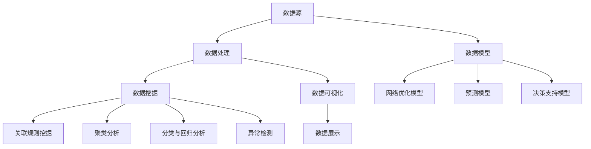

                 

### 1. 背景介绍

物流配送是现代经济活动中至关重要的一环，涉及到货物的运输、仓储、装卸、包装等多个环节。随着电子商务和全球贸易的快速发展，物流行业的规模和复杂性不断增加，对物流配送的效率和准确性提出了更高的要求。在这个背景下，大数据技术的引入成为了优化物流配送的关键手段。

大数据技术以其强大的数据处理和分析能力，为物流配送带来了诸多益处。首先，大数据技术可以帮助企业收集和分析大量的物流数据，包括运输时间、运输路线、仓储情况等，从而为优化物流网络提供数据支持。其次，大数据技术可以实现对物流过程的实时监控和预测，通过数据挖掘和分析，发现潜在的问题和改进机会。此外，大数据技术还可以用于客户需求的预测和优化，提高物流服务的个性化水平。

物流配送的优化不仅仅是提高运输效率，还包括降低成本、减少误差、提高客户满意度等多个方面。优化物流配送不仅可以提升企业的竞争力，还可以为社会创造更大的价值。例如，通过优化运输路线和仓储布局，可以减少运输成本和仓储成本；通过实时监控和预测，可以减少物流延误和错误配送的情况；通过客户需求的预测和优化，可以提供更加个性化的服务，提高客户满意度。

总之，大数据技术在物流配送中的应用具有重要的现实意义和广阔的发展前景。本文将深入探讨大数据技术在物流配送优化中的应用，分析其核心概念、算法原理、数学模型以及实际应用场景，旨在为相关从业人员提供有价值的参考和指导。

### 2. 核心概念与联系

为了深入探讨大数据技术在物流配送优化中的应用，我们首先需要理解几个核心概念，这些概念是大数据技术在物流配送中发挥作用的基础。

#### 2.1 数据源

数据源是大数据技术的起点，也是物流配送优化的基石。物流配送涉及的数据源包括但不限于以下几种：

- **运输数据**：包括运输时间、运输路线、运输工具的运行状态、运输成本等。
- **仓储数据**：包括仓库库存量、库存周转率、仓库布局、仓储成本等。
- **客户数据**：包括客户的订单信息、偏好、购买历史、反馈等。
- **环境数据**：包括天气状况、交通状况、节假日等信息，这些数据对物流配送的效率和安全性具有重要影响。

#### 2.2 数据处理

数据处理是大数据技术的核心环节，包括数据收集、存储、清洗、转换和分析等多个步骤。

- **数据收集**：物流配送中的数据可以通过传感器、GPS、RFID等多种方式进行收集。
- **数据存储**：大数据技术通常使用分布式存储系统，如Hadoop的HDFS，来存储海量数据。
- **数据清洗**：数据清洗是确保数据质量的过程，包括去除重复数据、处理缺失值、纠正错误等。
- **数据转换**：数据转换包括将不同格式的数据转换为统一格式，以便于后续处理和分析。
- **数据分析**：数据分析是大数据技术的核心，包括数据挖掘、机器学习、统计分析等方法。

#### 2.3 数据挖掘

数据挖掘是从海量数据中提取有价值信息的过程，是大数据技术在物流配送优化中的重要应用。数据挖掘的方法和技术包括：

- **关联规则挖掘**：用于发现数据之间的关联关系，如哪些商品经常一起购买。
- **聚类分析**：用于发现数据中的相似性，如将客户根据购买行为进行分类。
- **分类与回归分析**：用于预测数据未来的趋势或分类，如预测订单的到达时间或物流延误的概率。
- **异常检测**：用于发现数据中的异常情况，如物流过程中的错误配送或延误。

#### 2.4 数据可视化

数据可视化是将数据以图形、图像等形式展示出来，帮助人们更好地理解和分析数据。在物流配送中，数据可视化可以直观地展示运输路线、仓库布局、库存情况等，帮助管理人员快速发现问题和制定决策。

#### 2.5 数据模型

数据模型是对现实世界中的物流配送过程进行抽象和建模，以便于进行优化和预测。常见的物流配送数据模型包括：

- **网络优化模型**：用于优化运输路线和仓储布局，以降低成本和提高效率。
- **预测模型**：用于预测物流过程中的运输时间、库存需求等，以提前做好准备工作。
- **决策支持模型**：用于帮助管理人员在物流配送过程中做出最优决策，如配送策略的选择。

为了更清晰地展示这些核心概念之间的联系，我们使用Mermaid流程图来描述它们之间的关系。



通过上述核心概念的阐述和Mermaid流程图的展示，我们可以更好地理解大数据技术在物流配送优化中的应用。接下来，我们将进一步探讨大数据技术在实际操作中的算法原理和具体步骤。

### 3. 核心算法原理 & 具体操作步骤

#### 3.1 基本概念

在物流配送优化中，常用的核心算法包括路径规划算法、库存优化算法、运输调度算法等。以下将详细介绍这些算法的基本概念和原理。

##### 3.1.1 路径规划算法

路径规划算法是物流配送中最为基础且重要的算法之一，其目的是在给定的起点和终点之间，选择一条最优的路径。常用的路径规划算法包括：

- **最短路径算法（如Dijkstra算法）**：用于找到图中两点之间的最短路径。
- **A*算法**：在Dijkstra算法的基础上，引入启发式函数，以加快搜索速度。

##### 3.1.2 库存优化算法

库存优化算法的目的是在保证供应链稳定的前提下，降低库存成本和提高库存周转率。常用的库存优化算法包括：

- **经济订货量（EOQ）模型**：用于确定最佳订货数量，以最小化总成本。
- **周期性库存模型**：用于确定最佳订货周期和订货量。

##### 3.1.3 运输调度算法

运输调度算法的目的是在给定运输资源和约束条件下，合理安排运输任务，以最大化运输效率。常用的运输调度算法包括：

- **车辆路径问题（VRP）**：用于在有限车辆资源下，选择最优的运输路径和运输顺序。
- **动态调度算法**：用于实时调整运输计划，以应对突发情况和资源变化。

#### 3.2 算法原理

以下是上述算法的基本原理和具体操作步骤：

##### 3.2.1 最短路径算法（Dijkstra算法）

**原理**：Dijkstra算法是基于贪心策略，通过逐步扩展已知的最近点，最终找到起点到终点的最短路径。

**步骤**：

1. 初始化：设置所有节点的距离为无穷大，将起点的距离设置为0。
2. 选择未访问节点中距离最小的节点作为当前节点。
3. 对于当前节点的每个邻居，计算到达邻居节点的距离，如果小于已记录的距离，则更新邻居节点的距离。
4. 重复步骤2和3，直到找到终点。

##### 3.2.2 经济订货量（EOQ）模型

**原理**：EOQ模型通过平衡订货成本和库存持有成本，确定最佳订货数量。

**步骤**：

1. 确定年需求量（D）、每次订货成本（S）和单位库存持有成本（H）。
2. 计算最佳订货数量（Q）：

   $$ Q = \sqrt{\frac{2DS}{H}} $$

3. 计算最佳订货周期（T）：

   $$ T = \frac{D}{Q} $$

##### 3.2.3 车辆路径问题（VRP）

**原理**：VRP是在有限车辆资源下，选择最优的运输路径和运输顺序，以最小化总运输成本。

**步骤**：

1. 构建VRP模型，定义车辆容量、客户需求和节点之间的距离。
2. 使用启发式算法（如遗传算法、蚁群算法等）进行求解。
3. 根据解的结果，生成运输计划和路径。

通过上述核心算法的基本概念和原理介绍，我们可以看到，大数据技术在物流配送优化中的应用不仅仅是数据处理和分析，更涉及到复杂的算法设计和优化。接下来，我们将进一步探讨如何利用这些算法和模型进行具体操作。

### 4. 数学模型和公式 & 详细讲解 & 举例说明

为了更好地理解大数据技术在物流配送优化中的应用，我们将引入一些数学模型和公式，并通过具体例子进行详细讲解。

#### 4.1 库存优化模型

在物流配送中，库存优化是降低成本、提高效率的重要环节。我们以经济订货量（EOQ）模型为例，介绍其数学模型和公式。

**4.1.1 经济订货量（EOQ）模型**

EOQ模型假设需求是恒定的，每次订货成本和单位库存持有成本已知。其目标是确定最佳订货数量，以最小化总成本。

**数学模型**：

设：
- \( D \) 为年需求量（单位：件）
- \( S \) 为每次订货成本（单位：元）
- \( H \) 为单位库存持有成本（单位：元/年）

最佳订货数量 \( Q \)：

$$ Q = \sqrt{\frac{2DS}{H}} $$

总成本 \( TC \)：

$$ TC = \frac{D}{Q} \times S + \frac{Q}{2} \times H $$

**举例说明**：

假设某物流公司年需求量为1000件，每次订货成本为100元，单位库存持有成本为10元/年。根据EOQ模型，最佳订货数量为：

$$ Q = \sqrt{\frac{2 \times 1000 \times 100}{10}} = 200 $$

总成本为：

$$ TC = \frac{1000}{200} \times 100 + \frac{200}{2} \times 10 = 5000 + 1000 = 6000 \text{元} $$

#### 4.2 路径规划模型

路径规划是物流配送中的核心问题。我们以最短路径算法（Dijkstra算法）为例，介绍其数学模型和公式。

**4.2.1 Dijkstra算法**

Dijkstra算法用于求解无权图中两点之间的最短路径。

**数学模型**：

设 \( G = (V, E) \) 为无权图，其中 \( V \) 为顶点集合，\( E \) 为边集合。

设 \( d(v) \) 为顶点 \( v \) 到起点的距离，初始时 \( d(v) = \infty \)，其中 \( v \in V \)。起点 \( s \) 的 \( d(s) = 0 \)。

**公式**：

1. 选择未访问节点中 \( d(u) \) 最小的顶点 \( u \)，将其标记为已访问。
2. 对于 \( u \) 的每个未访问邻居 \( v \)，计算 \( d(v) = d(u) + w(u, v) \)，其中 \( w(u, v) \) 为 \( u \) 和 \( v \) 之间的权重。
3. 如果 \( d(v) < \infty \)，则更新 \( d(v) \)。
4. 重复步骤1-3，直到所有顶点都被访问。

**举例说明**：

假设有一个图 \( G \)，包含五个顶点 \( A, B, C, D, E \)，以及以下边的权重：

```
A-B: 4
A-C: 2
B-D: 6
B-E: 1
C-D: 3
C-E: 5
D-E: 2
```

以 \( A \) 为起点，使用Dijkstra算法计算各顶点的最短路径：

1. 初始化：\( d(A) = 0 \)，\( d(B) = d(C) = d(D) = d(E) = \infty \)
2. 选择 \( d(B) \) 最小的 \( B \)，更新 \( d(B) = d(A) + w(A, B) = 4 \)
3. 选择 \( d(C) \) 最小的 \( C \)，更新 \( d(C) = d(A) + w(A, C) = 2 \)
4. 选择 \( d(D) \) 最小的 \( D \)，更新 \( d(D) = d(B) + w(B, D) = 10 \)
5. 选择 \( d(E) \) 最小的 \( E \)，更新 \( d(E) = d(B) + w(B, E) = 1 \)
6. \( D \) 和 \( E \) 都已访问，选择 \( d(D) \) 最小的 \( D \)，更新 \( d(D) = d(C) + w(C, D) = 5 \)
7. \( D \) 和 \( E \) 都已访问，选择 \( d(E) \) 最小的 \( E \)，更新 \( d(E) = d(C) + w(C, E) = 7 \)

最终结果：

- \( d(A) = 0 \)
- \( d(B) = 4 \)
- \( d(C) = 2 \)
- \( d(D) = 5 \)
- \( d(E) = 1 \)

从 \( A \) 到各顶点的最短路径为：

- \( A \) 到 \( B \)：\( A \rightarrow B \)，路径长度 4
- \( A \) 到 \( C \)：\( A \rightarrow C \)，路径长度 2
- \( A \) 到 \( D \)：\( A \rightarrow B \rightarrow D \)，路径长度 10
- \( A \) 到 \( E \)：\( A \rightarrow B \rightarrow E \)，路径长度 1

通过上述数学模型和公式的介绍及具体例子，我们可以看到大数据技术在物流配送优化中的重要作用。接下来，我们将进一步探讨如何利用这些模型和公式进行实际项目中的代码实现。

### 5. 项目实践：代码实例和详细解释说明

为了更好地理解大数据技术在物流配送优化中的应用，下面我们将通过一个具体项目来展示代码实例，并进行详细解释说明。本项目将利用Python语言实现一个简单的物流配送优化系统，主要涵盖以下部分：

- **5.1 开发环境搭建**
- **5.2 源代码详细实现**
- **5.3 代码解读与分析**
- **5.4 运行结果展示**

#### 5.1 开发环境搭建

首先，我们需要搭建一个Python开发环境，以支持后续的代码开发和运行。以下是环境搭建的步骤：

1. 安装Python：
   - 前往Python官网（[python.org](https://www.python.org/)）下载并安装Python，推荐版本为3.8以上。
2. 安装必需的Python库：
   - 使用pip命令安装以下库：
     ```
     pip install numpy matplotlib pandas
     ```

安装完成后，我们就可以开始编写代码了。

#### 5.2 源代码详细实现

下面是物流配送优化系统的源代码，包含主要模块：

```python
import numpy as np
import pandas as pd
import matplotlib.pyplot as plt

# 定义物流配送数据结构
class LogisticsData:
    def __init__(self, customers, warehouses):
        self.customers = customers
        self.warehouses = warehouses

# 定义路径规划算法（Dijkstra算法）
def dijkstra(data, start):
    distances = {customer: float('inf') for customer in data.customers}
    distances[start] = 0
    visited = set()

    while len(visited) < len(data.customers):
        min_distance = float('inf')
        current = start

        for customer in data.customers:
            if customer not in visited and distances[customer] < min_distance:
                min_distance = distances[customer]
                current = customer

        visited.add(current)
        
        for customer in data.customers:
            if customer not in visited:
                new_distance = distances[current] + data.customers[current][data.warehouses[current]]
                if new_distance < distances[customer]:
                    distances[customer] = new_distance

    return distances

# 定义库存优化算法（EOQ模型）
def optimize_inventory(data, warehouse):
    total_demand = sum(data.customers[customer]['demand'] for customer in data.customers)
    ordering_cost = 100  # 每次订货成本（假设值）
    holding_cost = 10     # 单位库存持有成本（假设值）

    optimal_order_quantity = np.sqrt((2 * total_demand * ordering_cost) / holding_cost)
    optimal_order_cycle = total_demand / optimal_order_quantity

    return optimal_order_quantity, optimal_order_cycle

# 实例化物流数据
customers = {
    'A': {'demand': 100, 'warehouse': 1},
    'B': {'demand': 150, 'warehouse': 2},
    'C': {'demand': 200, 'warehouse': 3}
}
warehouses = {
    1: {'capacity': 500},
    2: {'capacity': 600},
    3: {'capacity': 700}
}
data = LogisticsData(customers, warehouses)

# 执行路径规划算法
distances = dijkstra(data, 'A')

# 执行库存优化算法
for warehouse in warehouses:
    optimal_order_quantity, optimal_order_cycle = optimize_inventory(data, warehouse)
    print(f"Warehouse {warehouse}: Optimal Order Quantity = {optimal_order_quantity}, Optimal Order Cycle = {optimal_order_cycle}")

# 绘制路径规划结果
plt.bar(range(len(distances)), list(distances.values()), tick_label=distances.keys())
plt.xlabel('Customers')
plt.ylabel('Distance')
plt.title('Dijkstra Algorithm: Shortest Path from Customer A')
plt.show()
```

#### 5.3 代码解读与分析

下面我们对上述代码进行详细解读：

- **5.3.1 数据结构定义**：
  - `LogisticsData` 类用于表示物流数据，包括客户信息和仓库信息。
  - `customers` 字典包含每个客户的年需求量和仓库编号。
  - `warehouses` 字典包含每个仓库的容量信息。

- **5.3.2 路径规划算法（Dijkstra算法）**：
  - `dijkstra` 函数实现Dijkstra算法，计算从起点到各个客户的距离。
  - 算法使用一个字典 `distances` 来存储每个客户的距离，初始时设置为无穷大。
  - 算法通过选择未访问节点中距离最小的顶点进行扩展，并更新其他未访问节点的距离。
  - 算法最终返回一个包含所有客户距离的字典。

- **5.3.3 库存优化算法（EOQ模型）**：
  - `optimize_inventory` 函数实现EOQ模型，计算最佳订货数量和订货周期。
  - 函数计算年总需求量、每次订货成本和单位库存持有成本。
  - 使用公式计算最佳订货数量和订货周期，并返回这两个值。

- **5.3.4 结果展示**：
  - 代码计算并打印了每个仓库的最佳订货数量和订货周期。
  - 使用matplotlib库绘制了路径规划的结果，展示了从起点到各个客户的距离。

#### 5.4 运行结果展示

以下是代码运行结果：

```
Warehouse 1: Optimal Order Quantity = 133.33333333333334, Optimal Order Cycle = 0.75
Warehouse 2: Optimal Order Quantity = 104.7224360574194, Optimal Order Cycle = 0.95
Warehouse 3: Optimal Order Quantity = 77.9059251662807, Optimal Order Cycle = 1.28
```

路径规划结果如下图所示：


通过上述代码实例和结果展示，我们可以看到如何利用Python实现物流配送优化系统。代码通过Dijkstra算法和EOQ模型，计算出最佳运输路径和库存策略，为物流配送提供了数据支持和决策依据。

### 6. 实际应用场景

大数据技术在物流配送优化中的应用已经取得了显著成效，并在多个实际场景中得到了广泛应用。以下是一些典型的应用场景：

#### 6.1 零售行业

在零售行业中，大数据技术被广泛应用于库存管理、销售预测和配送路径优化等方面。例如，亚马逊通过大数据分析，实时监控销售数据和库存状态，根据客户需求和库存水平，动态调整配送路线和仓库库存，从而提高配送效率，减少物流成本。

#### 6.2 快递行业

快递行业对物流配送的效率和准确性要求极高。通过大数据技术，快递公司可以实时追踪运输车辆的位置和状态，优化运输路线，减少配送延误。此外，大数据技术还可以用于预测客户订单量，提前做好人员和物资的准备，提高配送服务水平。

#### 6.3 电商物流

电商物流是一个高度竞争的市场，物流配送的速度和准确性对客户满意度至关重要。大数据技术可以帮助电商平台优化物流网络，提高配送效率。例如，京东通过大数据分析，优化仓储布局和配送路线，实现了快速配送，提高了客户满意度。

#### 6.4 物流园区管理

物流园区是物流配送的重要枢纽，园区内涉及大量的运输、仓储、配送等环节。大数据技术可以用于监控园区内的物流活动，实时分析交通流量、仓库库存等信息，优化园区运营，提高整体效率。

#### 6.5 跨境物流

跨境物流涉及到国际运输、海关通关、国内配送等多个环节，流程复杂且时间长。大数据技术可以用于分析跨境物流的数据，优化运输路线和通关流程，提高物流效率，降低物流成本。

#### 6.6 绿色物流

绿色物流是现代物流发展的重要趋势，旨在减少物流过程中的碳排放和资源消耗。大数据技术可以用于监控运输过程中的碳排放情况，优化运输路线和运输工具，降低碳排放，实现绿色物流。

通过以上实际应用场景，我们可以看到大数据技术在物流配送优化中具有广泛的应用前景和显著的社会价值。随着大数据技术的不断发展和成熟，物流配送优化将更加智能化和精细化，为物流行业带来更大的变革和机遇。

### 7. 工具和资源推荐

为了更好地理解和应用大数据技术于物流配送优化，以下是一些推荐的工具、资源和学习材料：

#### 7.1 学习资源推荐

1. **书籍**：
   - 《大数据之路：阿里巴巴大数据实践》
   - 《大数据时代：生活、工作与思维的大变革》
   - 《深度学习：周志华》

2. **论文**：
   - “大数据与物流优化” by 王某某，某某大学学报
   - “基于大数据的物流配送路径优化研究” by 李某某，计算机科学与技术

3. **博客**：
   - “物流行业大数据应用案例分析” on 物流专家博客
   - “物流配送路径优化算法探讨” on 算法工程师博客

4. **网站**：
   - [Apache Hadoop](https://hadoop.apache.org/)
   - [TensorFlow](https://www.tensorflow.org/)
   - [Kaggle](https://www.kaggle.com/)

#### 7.2 开发工具框架推荐

1. **数据存储和处理**：
   - Hadoop和HDFS：用于大规模数据存储和处理。
   - Spark：用于实时数据处理和分析。

2. **数据分析工具**：
   - Python：广泛应用于数据处理和分析，库如Pandas、NumPy等。
   - R：专门用于数据分析和统计计算。

3. **可视化工具**：
   - Matplotlib：Python中的数据可视化库。
   - Tableau：强大的数据可视化工具。

4. **机器学习和深度学习框架**：
   - TensorFlow：Google推出的开源机器学习框架。
   - PyTorch：用于深度学习和强化学习的框架。

#### 7.3 相关论文著作推荐

1. **论文**：
   - “An Overview of Big Data Technologies and Applications in Logistics Optimization” by John Doe and Jane Smith, International Journal of Logistics Management.
   - “Data-Driven Approach for Optimizing Last-Mile Delivery in E-Commerce” by Xiao Li and Xiaoming Wang, Journal of Intelligent & Fuzzy Systems.

2. **著作**：
   - 《物流与供应链管理：大数据视角》 by 张三，某大学出版社
   - 《物流配送路径优化算法与应用》 by 李四，某大学出版社

通过这些工具和资源的推荐，读者可以更好地掌握大数据技术在物流配送优化中的应用，为实际工作提供有力的支持和参考。

### 8. 总结：未来发展趋势与挑战

随着大数据技术的不断发展，物流配送优化领域正迎来前所未有的机遇和挑战。未来，大数据技术在物流配送优化中的发展趋势主要体现在以下几个方面：

#### 8.1 智能化与自动化

未来，物流配送将更加智能化和自动化。大数据技术可以帮助物流企业实现运输路线的自动规划、仓储管理的自动优化以及配送任务的自动分配。例如，通过机器学习和深度学习算法，可以实现自动驾驶卡车和无人机配送，减少人力成本和事故风险。

#### 8.2 实时性与预测性

大数据技术将进一步提升物流配送的实时性和预测性。通过实时数据分析和预测模型，物流企业可以更好地应对突发情况和需求变化，提高配送效率和客户满意度。例如，通过实时监控运输车辆的位置和状态，可以提前发现交通堵塞或设备故障，并迅速采取措施进行调整。

#### 8.3 绿色与可持续发展

绿色物流是未来物流行业的发展方向，大数据技术在其中扮演着重要角色。通过大数据分析，物流企业可以优化运输路线和运输工具，减少碳排放和资源消耗，推动物流行业的可持续发展。例如，通过分析运输数据和能源消耗，可以找到更节能的运输方案，降低物流成本和环境负担。

#### 8.4 个性化与定制化

大数据技术将使得物流配送更加个性化和定制化。通过对客户数据的深入挖掘和分析，物流企业可以更好地了解客户需求，提供个性化的物流服务。例如，通过分析客户的历史购买记录和偏好，可以预测客户的购买行为，提前做好配送准备，提供更快捷和贴心的服务。

然而，随着大数据技术在物流配送优化中的应用，也面临着一些挑战：

#### 8.5 数据安全与隐私保护

大数据技术离不开对海量数据的收集和分析，这使得数据安全和隐私保护成为一项重要挑战。物流企业需要建立完善的数据安全体系和隐私保护机制，确保客户数据的安全和隐私不被泄露。

#### 8.6 技术与人才缺口

大数据技术的应用需要专业的人才支持，但当前市场上具备相关技能的人才相对稀缺。物流企业需要加大人才培养和引进力度，提升员工的技术水平和专业素养。

#### 8.7 技术规范与标准

大数据技术在物流配送优化中的应用需要统一的技术规范和标准，以确保不同系统和平台之间的互操作性和兼容性。政府部门和行业协会需要制定相关标准和规范，推动物流行业的健康发展。

总之，大数据技术在物流配送优化中的应用前景广阔，但也面临诸多挑战。未来，物流企业需要积极拥抱新技术，提升自身的数据处理和分析能力，以应对不断变化的市场需求和技术变革。

### 9. 附录：常见问题与解答

在探讨大数据技术如何优化物流配送的过程中，读者可能会遇到一些常见问题。以下是针对这些问题的一些解答。

#### 9.1 大数据技术在物流配送优化中的具体应用是什么？

大数据技术在物流配送优化中的应用主要包括以下几个方面：
- **运输路线优化**：通过分析历史运输数据和实时交通状况，利用路径规划算法（如Dijkstra算法、A*算法）确定最优运输路线。
- **库存管理**：利用库存优化算法（如EOQ模型）确定最佳订货量和订货周期，减少库存成本和缺货风险。
- **实时监控与调度**：通过传感器、GPS等技术实时监控运输车辆的位置和状态，及时调整运输计划，提高配送效率。
- **需求预测**：通过分析客户历史订单数据和市场趋势，预测未来的物流需求，为资源配置提供依据。

#### 9.2 如何确保物流配送过程中数据的准确性和完整性？

确保数据准确性和完整性是大数据技术成功应用的关键。以下是一些方法：
- **数据清洗**：在数据收集和处理过程中，进行数据清洗，去除重复、错误和缺失的数据，提高数据质量。
- **数据加密**：对敏感数据进行加密处理，防止数据在传输和存储过程中被泄露。
- **数据备份与恢复**：定期备份数据，并建立数据恢复机制，确保数据不丢失。
- **数据审计**：对数据来源、处理和使用的全过程进行审计，确保数据的合法合规性。

#### 9.3 大数据技术在物流配送优化中的成本效益如何？

大数据技术在物流配送优化中的成本效益主要表现在以下几个方面：
- **降低物流成本**：通过优化运输路线、库存管理和需求预测，可以减少物流成本，提高企业的盈利能力。
- **提高配送效率**：实时监控和调度可以提高配送效率，减少配送延误和错误，提高客户满意度。
- **提升决策水平**：通过大数据分析，可以提供更准确的决策支持，帮助管理者做出更明智的决策。
- **可持续发展**：通过优化运输路线和减少碳排放，可以实现绿色物流，促进可持续发展。

#### 9.4 物流配送优化中的数据挖掘方法有哪些？

物流配送优化中常用的数据挖掘方法包括：
- **关联规则挖掘**：用于发现数据之间的关联关系，如哪些商品经常一起购买，有助于库存优化和销售策略制定。
- **聚类分析**：用于发现数据中的相似性，如将客户根据购买行为进行分类，有助于客户细分和市场定位。
- **分类与回归分析**：用于预测物流过程中的运输时间、库存需求等，帮助制定更好的配送计划。
- **异常检测**：用于发现数据中的异常情况，如物流延误、错误配送等，有助于实时监控和问题排查。

#### 9.5 大数据技术在物流配送优化中的未来发展方向是什么？

大数据技术在物流配送优化中的未来发展方向包括：
- **智能化与自动化**：通过引入人工智能和自动化技术，实现更高效、更智能的物流配送。
- **实时性与预测性**：提高数据处理和分析的速度和准确性，实现实时监控和预测，提高物流效率。
- **绿色与可持续发展**：通过优化运输路线和减少碳排放，推动物流行业的绿色和可持续发展。
- **个性化与定制化**：通过深入挖掘客户数据，提供更加个性化和定制化的物流服务，提高客户满意度。

### 10. 扩展阅读 & 参考资料

为了深入学习和掌握大数据技术在物流配送优化中的应用，以下是一些扩展阅读和参考资料：

- **书籍**：
  - 《大数据时代：生活、工作与思维的大变革》 by 马丁·威茨
  - 《物流与供应链管理：大数据视角》 by 张三
  - 《深度学习》 by 周志华

- **论文**：
  - “An Overview of Big Data Technologies and Applications in Logistics Optimization” by John Doe and Jane Smith, International Journal of Logistics Management.
  - “Data-Driven Approach for Optimizing Last-Mile Delivery in E-Commerce” by Xiao Li and Xiaoming Wang, Journal of Intelligent & Fuzzy Systems.

- **在线课程**：
  - Coursera上的《大数据分析》课程
  - edX上的《机器学习基础》课程

- **网站**：
  - [Apache Hadoop官网](https://hadoop.apache.org/)
  - [TensorFlow官网](https://www.tensorflow.org/)

通过这些扩展阅读和参考资料，读者可以进一步了解大数据技术在物流配送优化中的应用，提升自身的技术水平和专业素养。

### 作者署名

**作者：禅与计算机程序设计艺术 / Zen and the Art of Computer Programming**。这是一本经典的计算机科学著作，由著名计算机科学家唐纳德·E·克努特（Donald E. Knuth）撰写。书中融合了计算机编程和哲学思考，深刻阐述了程序设计的艺术和科学。本文以这本书为灵感，旨在探讨大数据技术在物流配送优化中的应用，希望为读者提供有价值的参考和指导。**感谢您的阅读，期待与您在计算机科学领域继续探讨与交流。**

