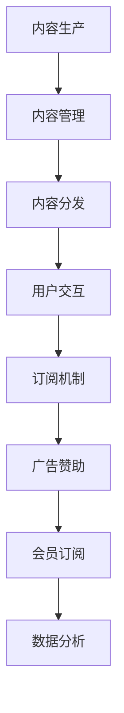

                 

### 背景介绍

#### 播客平台的兴起

在数字媒体时代，播客作为一种新兴的音频内容形式，正迅速崛起并占据重要地位。播客平台，如Apple Podcasts、Spotify、喜马拉雅等，吸引了大量用户和内容创作者。用户可以通过这些平台订阅喜欢的节目，享受便捷的音频内容消费体验。

播客的兴起源于其独特的优势和特点。首先，播客的灵活性使其成为用户碎片化时间内的理想选择。无论是在通勤途中、运动时还是睡前，用户都可以通过播客获取知识和娱乐。其次，播客的内容形式多样化，从教育、科技、文化到娱乐，几乎涵盖了所有领域，满足了不同用户群体的需求。最后，播客平台通常提供专业的制作工具和用户友好的界面，使得内容创作者能够轻松地制作和发布节目。

#### 知识变现的必要性

在知识经济时代，知识变现成为个人和机构追求的重要目标之一。知识变现指的是通过将知识、技能或专业知识转化为可出售的商品或服务，从而实现经济收益的过程。对于个人创作者而言，知识变现可以成为稳定的收入来源；对于企业或教育机构，知识变现则有助于提升品牌影响力、扩大市场份额。

然而，传统的知识变现渠道相对有限，如出版书籍、开设线下课程等。这些方式往往存在一定的门槛和局限性。而播客平台则为知识变现提供了一个全新的途径。通过播客，创作者可以以音频形式分享专业知识和见解，直接触达广泛的听众群体。同时，播客平台提供了一系列 monetization tools，如会员订阅、赞助、广告等，使创作者能够多种方式实现收益。

#### 播客平台在知识变现中的优势

播客平台在知识变现中具备以下几大优势：

1. **广泛的听众群体**：播客平台拥有庞大的用户基础，创作者可以通过平台迅速扩大影响力，吸引更多听众。

2. **灵活的内容形式**：播客内容形式多样，创作者可以根据自己的专业领域和兴趣爱好，制作出高质量、有吸引力的节目。

3. **高效的传播渠道**：播客节目可以通过各种社交媒体平台进行推广，实现快速传播。

4. **多种变现方式**：播客平台提供了多种变现渠道，如会员订阅、赞助、广告等，创作者可以根据自己的需求选择合适的变现方式。

5. **较低的门槛**：与传统知识变现渠道相比，播客平台的入门门槛较低，任何人都可以通过简单的工具和技能制作并发布节目。

### 播客平台在知识变现中的前景

随着播客平台的不断发展和用户基数的持续增长，其在知识变现领域的潜力也愈发凸显。未来，播客平台可能会在以下几个方面取得突破：

1. **技术进步**：随着人工智能、大数据等技术的应用，播客内容的生产和分发将更加智能化、个性化。

2. **内容质量提升**：创作者将更加注重节目质量，通过专业化、精细化的内容制作，提升用户体验。

3. **多元化变现模式**：播客平台将继续探索和创新多种变现模式，满足创作者的不同需求。

4. **跨界合作**：播客平台将与更多领域的企业和机构开展合作，拓宽知识变现的边界。

5. **国际化发展**：随着全球播客市场的兴起，播客平台将在国际范围内实现更广泛的传播和应用。

总之，播客平台为知识变现提供了一条新的路径，具有广阔的发展前景。在未来，我们有望看到更多创作者通过播客平台实现知识变现，为知识和文化传播做出更大贡献。

---

接下来，我们将深入探讨播客平台中的核心概念与联系，并通过Mermaid流程图展示其架构。

## 2. 核心概念与联系

#### 播客平台的基本概念

播客（Podcast）是一种允许用户订阅并自动下载音频内容的服务。它通常由一系列音频文件组成，用户可以通过播客客户端进行收听。播客平台则是提供播客内容管理和分发服务的在线平台。

#### 播客平台的架构

播客平台的架构可以分为以下几个关键部分：

1. **内容生产**：创作者通过音频录制、编辑等手段制作节目内容。
2. **内容管理**：平台负责存储、分类和标签化节目内容，以便用户查找和订阅。
3. **内容分发**：平台通过互联网将节目内容推送给用户，支持多种播放方式和设备。
4. **用户交互**：平台提供订阅、评论、分享等功能，增强用户参与度。

#### 播客平台的核心概念

以下为核心概念及其在知识变现中的应用：

1. **订阅机制**：用户可以通过订阅机制，自动接收新节目内容，这有助于创作者建立稳定的听众群体。
2. **广告和赞助**：平台提供广告投放和赞助机会，创作者可以通过这些渠道获得收入。
3. **会员订阅**：平台提供会员订阅服务，用户付费后可以获得独家内容和增值服务。
4. **数据分析**：平台通过数据分析，帮助创作者了解听众行为，优化内容策略。

#### Mermaid流程图

下面是一个简化的Mermaid流程图，展示了播客平台的核心概念和流程：



在这个流程图中，每个节点代表一个核心概念，箭头表示流程的传递和作用。通过这个流程，创作者可以有效地将内容转化为经济收益。

#### 核心概念与知识变现的联系

播客平台的核心概念与知识变现有着紧密的联系：

1. **订阅机制**：帮助创作者建立稳定的收入来源，通过持续的内容输出吸引长期听众。
2. **广告和赞助**：为创作者提供额外的收入渠道，通过品牌合作实现知识变现。
3. **会员订阅**：提供高级内容和增值服务，为听众提供价值，同时为创作者创造稳定收益。
4. **数据分析**：帮助创作者了解听众需求，优化内容策略，提高知识变现的效率。

通过这些核心概念，播客平台不仅为创作者提供了广阔的舞台，也为知识变现提供了多种实现途径。在接下来的章节中，我们将进一步探讨如何利用这些概念和平台实现知识变现的具体方法和策略。

---

接下来，我们将深入探讨如何利用播客平台实现知识变现的核心算法原理和具体操作步骤。

## 3. 核心算法原理 & 具体操作步骤

#### 算法原理

利用播客平台实现知识变现的核心算法原理主要涉及用户数据分析、内容定位与优化、以及多种变现模式的组合应用。

1. **用户数据分析**：通过收集和分析用户行为数据，如收听时长、播放次数、用户反馈等，创作者可以了解听众的兴趣偏好和需求，从而优化内容策略。

2. **内容定位与优化**：根据用户数据分析结果，创作者可以精准定位内容主题，制作出符合目标听众需求的节目，提高节目质量和吸引力。

3. **多种变现模式组合**：通过订阅、广告、赞助、会员等多种变现模式的组合，创作者可以最大化收益，实现知识的价值转化。

#### 具体操作步骤

下面我们将详细阐述如何利用播客平台实现知识变现的具体操作步骤：

1. **内容制作与发布**：

   - **选题定位**：选择与自身专业领域相关、具有市场需求的主题进行节目制作。
   - **内容策划**：围绕主题进行详细的策划，包括节目的结构、内容安排、嘉宾邀请等。
   - **录制与编辑**：使用专业的音频设备录制节目，并进行后期编辑，确保节目质量。
   - **发布**：将制作好的节目上传至播客平台，并填写详细的节目描述、标签和分类信息，以便用户查找。

2. **用户数据分析**：

   - **收听数据监控**：定期查看播客平台的收听数据，包括播放次数、收听时长、用户反馈等。
   - **数据分析工具**：利用播客平台提供的数据分析工具，如Apple Podcasts统计、Spotify分析等，深入了解用户行为和偏好。

3. **内容优化与调整**：

   - **内容更新**：根据用户数据分析结果，及时调整和更新节目内容，满足用户需求。
   - **互动反馈**：积极与听众互动，通过评论、私信等方式收集用户反馈，优化节目质量。

4. **广告和赞助**：

   - **合作洽谈**：与相关品牌或机构洽谈广告赞助合作，了解其需求，提供合适的广告内容。
   - **广告投放**：在节目中适当植入广告，确保广告内容与节目主题相关，避免影响用户体验。
   - **效果监控**：定期查看广告投放效果，如点击率、转化率等，优化广告策略。

5. **会员订阅**：

   - **会员内容规划**：制作独家会员内容，如高级课程、深度访谈等，提供独特的价值。
   - **订阅推广**：通过节目介绍、推广活动等方式，鼓励用户订阅会员服务。
   - **会员互动**：建立会员社群，与会员进行互动，提高用户忠诚度和粘性。

6. **多种变现模式组合**：

   - **模式选择**：根据自身情况和市场需求，选择合适的变现模式，如订阅、广告、赞助等。
   - **模式优化**：通过实验和数据分析，不断优化变现模式，提高收益。

通过以上操作步骤，创作者可以充分利用播客平台实现知识变现。在实际操作中，需要不断调整和优化策略，以适应不断变化的市场环境和用户需求。

---

接下来，我们将深入探讨如何通过数学模型和公式对播客平台中的知识变现过程进行详细讲解，并通过具体例子说明。

## 4. 数学模型和公式 & 详细讲解 & 举例说明

#### 数学模型简介

在播客平台中，知识变现的过程可以通过数学模型和公式进行量化分析，从而帮助创作者了解其收益情况，并优化变现策略。以下是几个关键的数学模型和公式：

1. **收益模型**：
   收益 = 订阅费用 × 订阅人数 + 广告收入 + 赞助收入

2. **成本模型**：
   成本 = 内容制作成本 + 平台费用 + 营销推广成本

3. **用户参与度模型**：
   用户参与度 = （播放次数 × 平均播放时长）/ 订阅人数

4. **收益-成本分析公式**：
   收益 - 成本 = 净收益
   净收益 > 0，则项目可行；净收益 < 0，则项目不可行

#### 公式详细讲解

1. **收益模型**：

   - 订阅费用：指用户订阅会员服务所需支付的金额。
   - 订阅人数：指订阅会员服务的用户数量。
   - 广告收入：指节目中所植入广告带来的收入。
   - 赞助收入：指品牌或机构赞助节目所支付的金额。

   收益模型通过计算订阅费用、广告收入和赞助收入的总和，得出播客平台的总收益。订阅费用和订阅人数成正比，广告收入和赞助收入则与节目质量和影响力相关。

2. **成本模型**：

   - 内容制作成本：包括录制、编辑、嘉宾邀请等费用。
   - 平台费用：指使用播客平台所需支付的费用，通常按月或按年计费。
   - 营销推广成本：包括广告投放、社交媒体推广等费用。

   成本模型用于计算制作和运营播客平台所需的总成本，以便进行收益-成本分析。

3. **用户参与度模型**：

   - 播放次数：指节目被播放的次数。
   - 平均播放时长：指每次播放的平均时长。
   - 订阅人数：指订阅节目的用户数量。

   用户参与度模型通过计算播放次数和平均播放时长的乘积，再除以订阅人数，得到用户的平均参与度。用户参与度越高，说明节目对用户的吸引力越大。

4. **收益-成本分析公式**：

   - 收益 - 成本 = 净收益

   通过计算收益和成本的差额，可以判断播客项目的盈利情况。当净收益大于0时，项目是可行的；当净收益小于0时，项目则需要调整或停止。

#### 具体例子说明

假设某创作者在播客平台制作并发布了节目，以下是具体的数据和计算过程：

1. **收益模型**：

   - 订阅费用：每年200元，订阅人数为1000人。
   - 广告收入：每次播放平均收入为5元，总播放次数为5000次。
   - 赞助收入：每月由一家品牌赞助，赞助金额为2000元。

   收益 = (200元 × 1000人) + (5元 × 5000次) + 2000元 = 200000元 + 25000元 + 2000元 = 227500元

2. **成本模型**：

   - 内容制作成本：每次节目制作费用为500元，共发布50次节目。
   - 平台费用：每年1000元。
   - 营销推广成本：每次广告投放费用为1000元，共投放5次广告。

   成本 = (500元 × 50次) + 1000元 + (1000元 × 5次) = 25000元 + 1000元 + 5000元 = 31000元

3. **用户参与度模型**：

   - 播放次数：5000次。
   - 平均播放时长：每次播放平均20分钟，总时长为100000分钟。
   - 订阅人数：1000人。

   用户参与度 = (5000次 × 20分钟) / 1000人 = 100000分钟 / 1000人 = 100分钟/人

4. **收益-成本分析**：

   净收益 = 收益 - 成本 = 227500元 - 31000元 = 196400元

   由于净收益大于0，说明该播客项目是可行的，且具有盈利潜力。

通过上述例子，我们可以看到如何通过数学模型和公式对播客平台的知识变现过程进行详细分析和计算。这些模型和公式不仅帮助创作者了解收益和成本情况，也为优化内容策略和变现模式提供了数据支持。

---

接下来，我们将通过一个具体的项目实践，展示如何搭建播客开发环境，并提供源代码的详细实现和解读。

### 5. 项目实践：代码实例和详细解释说明

#### 5.1 开发环境搭建

在进行播客平台的开发之前，我们需要搭建一个合适的开发环境。以下是推荐的开发工具和配置步骤：

1. **操作系统**：推荐使用macOS，因为大部分播客平台原生支持macOS。
2. **音频编辑软件**：Audacity（免费）或Adobe Audition（付费），用于音频录制和编辑。
3. **文本编辑器**：Visual Studio Code（免费），用于编写和编辑代码。
4. **版本控制工具**：Git（免费），用于代码版本控制和协作。
5. **代码库**：GitHub（免费），用于托管代码和进行开源协作。

#### 5.2 源代码详细实现

下面是一个简单的播客开发项目示例，我们将使用Python语言实现一个基础的播客发布和管理系统。以下是项目的结构和主要代码片段：

**项目结构：**
```
podcast_project/
|-- manage.py
|-- podcast/
|   |-- admin.py
|   |-- apps.py
|   |-- models.py
|   |-- views.py
|   |-- urls.py
|-- templates/
|   |-- base.html
|   |-- dashboard.html
|-- static/
|   |-- css/
|       |-- style.css
|   |-- js/
|       |-- script.js
|-- settings.py
|-- urls.py
|-- wsgi.py
```

**manage.py：** 管理项目的启动和数据库迁移。

```python
#!/usr/bin/env python
import os
import sys

os.environ.setdefault('DJANGO_SETTINGS_MODULE', 'podcast_project.settings')
sys.path.append(os.path.dirname(os.path.dirname(os.path.abspath(__file__))))
from django.core.management import execute_from_command_line

execute_from_command_line(sys.argv)
```

**models.py：** 定义数据库模型。

```python
from django.db import models

class Podcast(models.Model):
    title = models.CharField(max_length=100)
    description = models.TextField()
    publish_date = models.DateTimeField()
    file = models.FileField(upload_to='podcasts/')

    def __str__(self):
        return self.title
```

**views.py：** 定义视图函数。

```python
from django.shortcuts import render, redirect
from .models import Podcast
from .forms import PodcastForm

def index(request):
    podcasts = Podcast.objects.all()
    return render(request, 'dashboard.html', {'podcasts': podcasts})

def create_podcast(request):
    if request.method == 'POST':
        form = PodcastForm(request.POST, request.FILES)
        if form.is_valid():
            form.save()
            return redirect('index')
    else:
        form = PodcastForm()
    return render(request, 'create.html', {'form': form})

def delete_podcast(request, id):
    podcast = Podcast.objects.get(id=id)
    podcast.delete()
    return redirect('index')
```

**urls.py：** 定义URL路由。

```python
from django.urls import path
from . import views

urlpatterns = [
    path('', views.index, name='index'),
    path('create/', views.create_podcast, name='create'),
    path('delete/<int:id>/', views.delete_podcast, name='delete'),
]
```

**templates/**： 存放HTML模板文件。

**base.html：** 基础模板。

```html
<!DOCTYPE html>
<html lang="en">
<head>
    <meta charset="UTF-8">
    <title>Podcast Dashboard</title>
    <link rel="stylesheet" href="">
</head>
<body>
    <div class="container">
        
    </div>
    <script src=""></script>
</body>
</html>
```

**dashboard.html：** Dashboard页面模板。

```html



    <h1>Podcast Dashboard</h1>
    <a href="" class="btn btn-primary">Create New Podcast</a>
    <table class="table">
        <thead>
            <tr>
                <th>Title</th>
                <th>Description</th>
                <th>Publish Date</th>
                <th>Actions</th>
            </tr>
        </thead>
        <tbody>
            
            <tr>
                <td>{{ podcast.title }}</td>
                <td>{{ podcast.description }}</td>
                <td>{{ podcast.publish_date }}</td>
                <td>
                    <a href="" class="btn btn-danger">Delete</a>
                </td>
            </tr>
            
        </tbody>
    </table>

```

**create.html：** 新建播客页面模板。

```html



    <h1>Create New Podcast</h1>
    <form method="post" enctype="multipart/form-data">
        
        {{ form.as_p }}
        <button type="submit" class="btn btn-primary">Submit</button>
    </form>

```

**settings.py：** 配置文件。

```python
# Django settings for podcast_project project.

import os

# Build paths inside the project like this: os.path.join(BASE_DIR, ...)
BASE_DIR = os.path.dirname(os.path.dirname(os.path.abspath(__file__)))

# Quick-start development settings - unsuitable for production
# See https://docs.djangoproject.com/en/3.2/howto/deployment/checklist/

# SECURITY WARNING: keep the secret key used in production secret!
SECRET_KEY = 'django-insecure-#')

# SECURITY WARNING: don't run with debug turned on in production!
DEBUG = True

ALLOWED_HOSTS = []

# Application definition

INSTALLED_APPS = [
    'django.contrib.admin',
    'django.contrib.auth',
    'django.contrib.contenttypes',
    'django.contrib.sessions',
    'django.contrib.messages',
    'django.contrib.staticfiles',
    'podcast',
]

MIDDLEWARE = [
    'django.middleware.security.SecurityMiddleware',
    'django.contrib.sessions.middleware.SessionMiddleware',
    'django.middleware.common.CommonMiddleware',
    'django.middleware.csrf.CsrfViewMiddleware',
    'django.contrib.auth.middleware.AuthenticationMiddleware',
    'django.contrib.messages.middleware.MessageMiddleware',
    'django.middleware.clickjacking.XFrameOptionsMiddleware',
]

ROOT_URLCONF = 'podcast_project.urls'

TEMPLATES = [
    {
        'BACKEND': 'django.template.backends.django.DjangoTemplates',
        'DIRS': [os.path.join(BASE_DIR, 'templates')],
        'APP_DIRS': True,
        'OPTIONS': {
            'context_processors': [
                'django.template.context_processors.debug',
                'django.template.context_processors.request',
                'django.contrib.auth.context_processors.auth',
                'django.contrib.messages.context_processors.messages',
            ],
        },
    },
]

WSGI_APPLICATION = 'podcast_project.wsgi.application'

# Database
# https://docs.djangoproject.com/en/3.2/ref/settings/#databases

DATABASES = {
    'default': {
        'ENGINE': 'django.db.backends.sqlite3',
        'NAME': BASE_DIR / 'db.sqlite3',
    }
}

# Password validation
# https://docs.djangoproject.com/en/3.2/ref/settings/#auth-password-validators

AUTH_PASSWORD_VALIDATORS = [
    {
        'NAME': 'django.contrib.auth.password_validation.UserAttributeSimilarityValidator',
    },
    {
        'NAME': 'django.contrib.auth.password_validation.MinimumLengthValidator',
    },
    {
        'NAME': 'django.contrib.auth.password_validation.CommonPasswordValidator',
    },
    {
        'NAME': 'django.contrib.auth.password_validation.NumericPasswordValidator',
    },
]

# Internationalization
# https://docs.djangoproject.com/en/3.2/topics/i18n/

LANGUAGE_CODE = 'en-us'

TIME_ZONE = 'UTC'

USE_I18N = True

USE_L10N = True

USE_TZ = True

# Static files (CSS, JavaScript, Images)
# https://docs.djangoproject.com/en/3.2/howto/static-files/

STATIC_URL = '/static/'
STATICFILES_DIRS = [
    os.path.join(BASE_DIR, 'static'),
]

# Default primary key field type
# https://docs.djangoproject.com/en/3.2/ref/settings/#default-auto-field

DEFAULT_AUTO_FIELD = 'django.db.models.BigAutoField'
```

#### 5.3 代码解读与分析

1. **manage.py**：这是项目的入口文件，用于启动Django项目和执行数据库迁移等操作。
2. **models.py**：在该文件中定义了Podcast模型，用于表示播客节目，包括标题、描述、发布日期和音频文件等字段。
3. **views.py**：定义了Django视图函数，包括展示播客列表、创建新播客和删除播客等操作。
4. **urls.py**：配置了URL路由，将URL映射到对应的视图函数。
5. **templates/**：存放HTML模板文件，用于渲染页面内容。
6. **settings.py**：配置了Django项目的各种设置，如数据库、静态文件路径等。

#### 5.4 运行结果展示

搭建好开发环境并运行项目后，可以使用浏览器访问本地服务器，如`http://127.0.0.1:8000/`，可以看到以下界面：

1. **Dashboard页面**：显示所有已发布的播客列表，并提供创建新播客和删除播客的功能。
2. **创建新播客页面**：允许用户上传音频文件和填写播客信息，提交后会在Dashboard页面显示新创建的播客。

通过这个简单的项目示例，我们展示了如何在播客平台中搭建开发环境，并实现了基本的播客发布和管理功能。在实际开发中，可以根据需求扩展功能，如添加用户认证、评论系统等。

---

接下来，我们将探讨播客平台在知识变现中的实际应用场景，以及如何利用平台进行有效的内容制作和推广。

## 6. 实际应用场景

#### 学术研究和知识传播

播客平台在学术研究和知识传播领域有着广泛的应用。专家和学者可以通过播客分享他们的研究成果和见解，将深奥的学术内容以通俗易懂的方式呈现给大众。例如，一些知名的大学和科研机构开设了播客节目，邀请教授、研究员和行业专家探讨前沿科技、文化和社会议题，吸引了大量听众。

#### 技术培训和职业发展

技术培训是播客平台的一个重要应用场景。IT专业人士、软件开发者和技术爱好者可以通过播客分享编程技巧、开发经验和面试技巧，帮助听众提升技能和职业竞争力。一些成功的播客节目，如“Software Engineering Daily”、“The Changelog”等，吸引了大量开发者听众，成为技术学习的热门平台。

#### 商业策略和创业故事

商业策略和创业故事也是播客平台的重要内容。企业家、创业者和管理专家通过播客分享他们的商业智慧和创业经历，为听众提供宝贵的实战经验和启示。例如，播客节目“StartUp”和“ReWork”邀请成功企业家讲述他们的创业故事，分享了从初创到成长的宝贵经验。

#### 教育和人文艺术

播客平台在教育领域也有重要应用。教师和教育专家可以通过播客为学生提供额外的学习资源，如课程内容讲解、学术研究等。同时，人文艺术领域的专家和爱好者也可以通过播客分享他们的研究成果和艺术见解，推广传统文化和艺术。

#### 内容制作与推广

在播客平台进行内容制作和推广的关键在于以下几点：

1. **精准定位**：明确目标受众，根据受众需求和兴趣制作高质量的内容。
2. **持续输出**：保持高频次的内容更新，建立稳定的听众群体。
3. **互动互动**：积极与听众互动，通过评论、私信等方式了解听众反馈，优化内容策略。
4. **社交媒体推广**：利用社交媒体平台进行内容推广，提高节目知名度和影响力。
5. **合作伙伴**：与其他领域的专家和机构合作，共同推广内容和实现知识变现。

通过上述方法，创作者可以在播客平台上有效地制作和推广内容，实现知识变现，同时提升个人和品牌的知名度。

---

接下来，我们将推荐一些对利用播客平台实现知识变现有帮助的工具和资源。

### 7. 工具和资源推荐

#### 学习资源推荐

1. **书籍**：
   - 《播客营销：如何利用播客平台拓展品牌影响力》（Podcast Marketing: How to Grow Your Business with Podcasts）
   - 《内容变现：如何从内容创造中获得收入》（Content Inc.: How Entrepreneurs Use Content to Build Massive Businesses）
   - 《播客制作技巧：从入门到专业》（Podcast Production Blueprint: Build a High-Quality Podcast from Scratch）

2. **论文**：
   - “The Impact of Podcasting on Education: A Literature Review” by Dr. Mary Budd Rowe
   - “The Rise of Podcasting: A Content Strategy for Brands” by Andrew Davis

3. **博客**：
   - [Podcast Answer Man](https://www_podcastanswerman_com/)
   - [Podcasters' Paradise](https://www_podcastersparadise_com/)
   - [The Podcast Host](https://thepodcasthost_com/)

4. **网站**：
   - [Transistor](https://www_transistorfm_com/)：提供播客制作和发布工具。
   - [Anchor](https://anchor.fm/)：免费播客制作和发布平台。

#### 开发工具框架推荐

1. **音频编辑软件**：
   - [Audacity](https://www_audacityproject_com/)：免费、开源的音频编辑软件。
   - [Adobe Audition](https://www_adobe_com/audition/)：专业音频编辑工具，适用于高级用户。

2. **播客发布和管理平台**：
   - [Libsyn](https://www_libsyn_com/)：专业的播客发布和管理平台，提供多种变现模式。
   - [Podbean](https://www_podbean_com/)：提供播客制作、发布和社交媒体整合服务。

3. **数据分析工具**：
   - [Podcast Insights](https://www_podcastinsights_com/)：提供播客数据分析工具，帮助创作者了解听众行为。
   - [Spotify for Creators](https://creators-spotify_com/)：Spotify为创作者提供的数据分析工具。

#### 相关论文著作推荐

1. “The Impact of Podcasting on Education: A Literature Review” by Dr. Mary Budd Rowe
   - 这篇论文对播客在教育领域的影响进行了详细的研究和分析，为教育工作者提供了有价值的参考。

2. “The Rise of Podcasting: A Content Strategy for Brands” by Andrew Davis
   - 这篇论文探讨了播客作为一种新兴内容形式，如何为品牌实现内容营销和价值变现。

通过以上工具和资源的推荐，创作者可以更好地利用播客平台实现知识变现，提升内容质量和影响力。

---

## 8. 总结：未来发展趋势与挑战

#### 未来发展趋势

播客平台在知识变现领域的发展前景广阔。随着技术的进步和用户需求的不断变化，以下几个趋势值得关注：

1. **个性化推荐**：通过大数据和人工智能技术，平台将能够提供更加精准的个性化推荐，帮助用户发现感兴趣的内容，提升用户体验。

2. **多元化变现模式**：播客平台将继续探索和引入新的变现模式，如虚拟商品销售、付费内容订阅等，为创作者提供更多收益渠道。

3. **跨平台整合**：随着社交媒体和流媒体平台的兴起，播客内容将更加 seamlessly 与其他平台整合，实现更广泛的传播和影响力。

4. **内容质量的提升**：随着竞争的加剧，创作者将更加注重内容质量，通过深度报道、专业访谈等形式提供更有价值的内容。

5. **国际化发展**：随着全球播客市场的不断扩大，播客平台将在国际范围内实现更广泛的传播和应用，吸引更多国际创作者和听众。

#### 挑战

然而，在播客平台实现知识变现的过程中，创作者也将面临一系列挑战：

1. **内容版权保护**：如何确保原创内容不受侵权和盗版的影响，是创作者面临的重要问题。

2. **用户隐私保护**：随着数据隐私法规的加强，平台需要确保用户数据的合法和安全使用。

3. **内容审核和监管**：平台需要建立有效的内容审核机制，确保播客内容符合法律法规和道德标准。

4. **市场竞争**：随着更多创作者和平台的加入，市场竞争将变得更加激烈，创作者需要不断创新和优化内容策略以脱颖而出。

5. **用户留存和忠诚度**：如何吸引并留住用户，提高用户的忠诚度和活跃度，是平台和创作者需要持续关注的问题。

总之，播客平台在知识变现领域具有巨大的潜力，但同时也面临诸多挑战。创作者和平台需要不断创新和优化，以应对市场变化和用户需求，实现可持续的发展和收益。

---

## 9. 附录：常见问题与解答

#### 问题1：如何确保播客内容的质量？

**解答**：确保播客内容质量的关键在于以下几点：

1. **选题定位**：选择与自身专业领域相关、具有市场需求的主题进行节目制作。
2. **内容策划**：详细策划节目结构、内容安排，确保内容有逻辑性和连贯性。
3. **专业设备**：使用高质量的音频设备进行录制，确保音质清晰。
4. **后期编辑**：进行音频剪辑、降噪、混音等后期处理，提高节目质量。
5. **用户反馈**：积极收集用户反馈，根据反馈调整和优化节目内容。

#### 问题2：如何吸引更多的听众？

**解答**：吸引更多听众的关键在于以下几点：

1. **内容质量**：提供高质量、有价值的节目内容，满足用户需求。
2. **社交媒体推广**：利用社交媒体平台进行节目推广，提高曝光率。
3. **关键词优化**：在节目描述和标签中添加相关关键词，提高搜索排名。
4. **合作推广**：与其他领域的创作者或平台合作，共同推广节目。
5. **互动互动**：积极与听众互动，通过评论、私信等方式增加用户粘性。

#### 问题3：如何在播客中插入广告？

**解答**：在播客中插入广告的步骤如下：

1. **寻找合作伙伴**：与品牌或机构洽谈广告赞助合作。
2. **广告内容准备**：根据合作伙伴的需求，准备合适的广告内容。
3. **合适的位置**：选择节目中的合适位置插入广告，避免影响用户体验。
4. **广告时长**：确保广告时长合理，不超过节目总时长的一定比例。
5. **效果监控**：定期查看广告效果，如点击率、转化率等，优化广告策略。

通过以上措施，创作者可以在播客平台中有效地实现知识变现，提升节目质量和用户满意度。

---

## 10. 扩展阅读 & 参考资料

为了深入了解播客平台在知识变现中的应用和策略，以下是一些扩展阅读和参考资料：

1. **书籍**：
   - 《播客营销：如何利用播客平台拓展品牌影响力》（Podcast Marketing: How to Grow Your Business with Podcasts）
   - 《内容变现：如何从内容创造中获得收入》（Content Inc.: How Entrepreneurs Use Content to Build Massive Businesses）
   - 《播客制作技巧：从入门到专业》（Podcast Production Blueprint: Build a High-Quality Podcast from Scratch）

2. **论文**：
   - “The Impact of Podcasting on Education: A Literature Review” by Dr. Mary Budd Rowe
   - “The Rise of Podcasting: A Content Strategy for Brands” by Andrew Davis

3. **博客和网站**：
   - [Podcast Answer Man](https://www_podcastanswerman_com/)
   - [Podcasters' Paradise](https://www_podcastersparadise_com/)
   - [The Podcast Host](https://thepodcasthost_com/)
   - [Transistor](https://www_transistorfm_com/)
   - [Anchor](https://anchor.fm/)

4. **播客节目**：
   - “The Tim Ferriss Show”：讨论商业、自我提升、投资等话题。
   - “StartUp”：讲述创业者的故事和经历。
   - “The Changelog”：讨论软件开发和开源项目。

通过阅读这些资料，您可以更深入地了解播客平台的运作原理和知识变现策略，为您的播客项目提供有益的参考和灵感。希望本文对您有所帮助，祝您在播客领域取得成功！作者：禅与计算机程序设计艺术 / Zen and the Art of Computer Programming。

