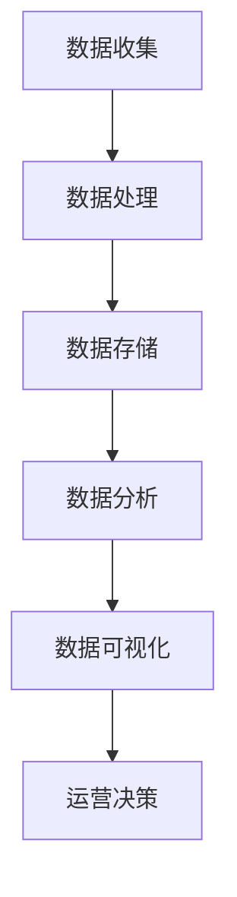

                 

### 文章标题：如何利用数据分析指导运营决策

> **关键词：**数据分析、运营决策、业务增长、实时监控、预测分析

> **摘要：**本文将探讨如何通过数据分析来指导运营决策，以实现业务增长和持续改进。我们将分析数据的核心概念、算法原理，并通过实例展示如何在实际项目中应用这些技术，为运营团队提供有价值的见解。

## 1. 背景介绍

在当今数字化时代，数据已成为企业运营的核心资产。企业通过收集和分析大量数据，可以获得对业务运行情况的深刻理解，进而做出更为精准的决策。数据分析不仅可以帮助企业识别问题和机会，还可以优化运营流程，提高业务效率，最终实现持续增长。

然而，数据分析并非一蹴而就的过程。它涉及多个方面，包括数据收集、处理、存储、分析和可视化。此外，不同类型的业务需求需要不同的分析方法和工具。为了有效利用数据分析来指导运营决策，企业需要建立一套完善的流程和体系，确保数据分析的结果能够真正落地并产生实际价值。

本文将围绕以下几个核心问题展开讨论：

- 数据分析在运营决策中的作用是什么？
- 如何选择合适的数据分析方法？
- 数据分析的具体操作步骤是怎样的？
- 如何通过数据分析实现业务增长？

通过本文的探讨，我们希望读者能够对数据分析在运营决策中的应用有一个全面的理解，并能够将其应用到实际业务中，为企业的持续发展提供有力支持。

## 2. 核心概念与联系

在深入探讨数据分析如何指导运营决策之前，我们需要先了解几个核心概念，以及它们之间的相互联系。

### 2.1 数据分析的基本概念

数据分析是指通过收集、处理、分析和解释数据，以发现有价值的信息和洞察的过程。数据分析的核心概念包括：

- **数据收集**：收集来自不同来源的数据，如企业内部系统、第三方平台、传感器等。
- **数据处理**：清洗和转换数据，使其适合分析和建模。
- **数据存储**：将处理后的数据存储在数据库或数据仓库中，以便后续分析和查询。
- **数据分析**：使用统计方法、机器学习算法等工具，对数据进行深入分析，以发现数据中的规律和模式。
- **数据可视化**：将分析结果以图表、报表等形式展示，便于理解和沟通。

### 2.2 运营决策的概念

运营决策是指企业在日常运营过程中所做的决策，包括市场拓展、产品优化、资源分配、客户服务等各个方面。运营决策的目标是提高业务效率，降低成本，提升客户满意度，实现业务增长。

### 2.3 数据分析在运营决策中的作用

数据分析在运营决策中的作用体现在以下几个方面：

- **识别问题和机会**：通过对业务数据的分析，可以发现运营中的问题和瓶颈，以及市场中的机会和趋势。
- **优化运营流程**：通过数据分析，可以识别运营中的低效环节，提出优化方案，提升运营效率。
- **预测未来趋势**：利用历史数据，可以预测未来的业务趋势，为运营决策提供依据。
- **支持决策制定**：数据分析结果可以为企业高层管理者提供决策支持，提高决策的科学性和准确性。

### 2.4 Mermaid 流程图

以下是一个简单的 Mermaid 流程图，展示了数据分析在运营决策中的基本流程：



在这个流程中，数据收集是起点，通过数据收集模块收集各种业务数据；然后进入数据处理模块，清洗和转换数据，使其适合分析；接着进入数据存储模块，将处理后的数据存储在数据库或数据仓库中；随后进入数据分析模块，使用各种分析方法和工具对数据进行分析；最后通过数据可视化模块，将分析结果展示给决策者，支持运营决策的制定。

通过这个流程，我们可以看到数据分析在运营决策中的紧密联系和关键作用。接下来，我们将进一步探讨数据分析的具体算法原理和操作步骤。

### 3. 核心算法原理 & 具体操作步骤

在了解了数据分析的基本概念和流程后，我们需要进一步探讨数据分析中的核心算法原理和具体操作步骤。以下将介绍几种常见的数据分析方法，包括描述性分析、预测性分析和预测性分析，并详细说明它们的原理和操作步骤。

#### 3.1 描述性分析

描述性分析是一种基本的统计分析方法，主要用于描述数据的基本特征和分布情况。其核心算法包括均值、中位数、众数、方差、标准差等。

**原理：**
- **均值（Mean）**：一组数据的平均值，用于描述数据的集中趋势。
- **中位数（Median）**：一组数据中间位置的值，用于描述数据的中间值。
- **众数（Mode）**：一组数据中出现次数最多的值，用于描述数据的典型值。
- **方差（Variance）**：数据与其均值之差的平方的平均值，用于描述数据的离散程度。
- **标准差（Standard Deviation）**：方差的平方根，用于描述数据的离散程度。

**操作步骤：**
1. 收集目标数据，确保数据质量。
2. 计算均值、中位数、众数、方差和标准差。
3. 分析结果，理解数据的基本特征和分布情况。

**示例：**
假设我们有以下一组销售数据（单位：万元）：[10, 20, 30, 40, 50, 60, 70, 80, 90, 100]。

- 均值：\[10 + 20 + 30 + 40 + 50 + 60 + 70 + 80 + 90 + 100\] / 10 = 55
- 中位数：排序后的中间值，即第5个和第6个数的平均值，(50 + 60) / 2 = 55
- 众数：没有众数，因为每个值只出现一次。
- 方差：\[ (10 - 55)^2 + (20 - 55)^2 + ... + (100 - 55)^2 \] / 10 = 945
- 标准差：方差的平方根，\(\sqrt{945} \approx 30.8\)

通过描述性分析，我们可以了解销售数据的基本情况，包括数据的集中趋势、中间值、离散程度等。

#### 3.2 预测性分析

预测性分析是一种基于历史数据，对未来进行预测的分析方法。其核心算法包括线性回归、时间序列分析、机器学习等。

**原理：**
- **线性回归（Linear Regression）**：通过建立数据点与自变量之间的线性关系模型，预测因变量的值。
- **时间序列分析（Time Series Analysis）**：通过分析时间序列数据的统计特性，预测未来的趋势。
- **机器学习（Machine Learning）**：利用历史数据训练模型，预测未来的趋势和关系。

**操作步骤：**
1. 数据预处理：包括数据清洗、缺失值处理、特征工程等。
2. 模型选择：根据业务需求和数据特性，选择合适的预测模型。
3. 模型训练：使用历史数据训练模型，优化模型参数。
4. 预测：使用训练好的模型，预测未来的趋势和关系。
5. 评估：评估预测结果，调整模型和策略。

**示例：**
假设我们有以下一组销售数据（单位：万元）：[100, 150, 200, 250, 300, 350, 400]。

我们可以使用线性回归模型预测第8个月的销售值。

- 数据预处理：将数据转换为时间序列形式，并做归一化处理。
- 模型选择：使用线性回归模型。
- 模型训练：使用前6个月的数据训练模型。
- 预测：使用训练好的模型，预测第8个月的销售值。
- 评估：评估预测结果的准确性和可靠性。

通过预测性分析，我们可以预测未来的销售趋势，为运营决策提供依据。

#### 3.3 预测性分析

预测性分析是一种基于历史数据，对未来进行预测的分析方法。其核心算法包括线性回归、时间序列分析、机器学习等。

**原理：**
- **线性回归（Linear Regression）**：通过建立数据点与自变量之间的线性关系模型，预测因变量的值。
- **时间序列分析（Time Series Analysis）**：通过分析时间序列数据的统计特性，预测未来的趋势。
- **机器学习（Machine Learning）**：利用历史数据训练模型，预测未来的趋势和关系。

**操作步骤：**
1. 数据预处理：包括数据清洗、缺失值处理、特征工程等。
2. 模型选择：根据业务需求和数据特性，选择合适的预测模型。
3. 模型训练：使用历史数据训练模型，优化模型参数。
4. 预测：使用训练好的模型，预测未来的趋势和关系。
5. 评估：评估预测结果，调整模型和策略。

**示例：**
假设我们有以下一组销售数据（单位：万元）：[100, 150, 200, 250, 300, 350, 400]。

我们可以使用线性回归模型预测第8个月的销售值。

- 数据预处理：将数据转换为时间序列形式，并做归一化处理。
- 模型选择：使用线性回归模型。
- 模型训练：使用前6个月的数据训练模型。
- 预测：使用训练好的模型，预测第8个月的销售值。
- 评估：评估预测结果的准确性和可靠性。

通过预测性分析，我们可以预测未来的销售趋势，为运营决策提供依据。

### 4. 数学模型和公式 & 详细讲解 & 举例说明

在数据分析过程中，数学模型和公式起着至关重要的作用。这些模型和公式帮助我们更好地理解数据，提取有价值的信息，并做出科学决策。以下将介绍几种常用的数学模型和公式，并进行详细讲解和举例说明。

#### 4.1 线性回归模型

线性回归模型是一种常见的预测性分析方法，用于描述因变量与自变量之间的线性关系。其数学模型可以表示为：

\[ y = ax + b + \epsilon \]

其中，\( y \) 是因变量，\( x \) 是自变量，\( a \) 和 \( b \) 是模型的参数，\( \epsilon \) 是误差项。

**详细讲解：**
- **因变量（\( y \)）**：线性回归模型要预测的目标变量，通常是销售额、股价等。
- **自变量（\( x \)）**：影响因变量的变量，可以是时间、广告投入等。
- **参数（\( a \) 和 \( b \)）**：模型中的两个参数，通过最小二乘法等优化算法求解。
- **误差项（\( \epsilon \)）**：模型无法解释的部分，表示数据的随机性和不确定性。

**举例说明：**
假设我们有以下一组数据（\( x \)：广告投入（万元），\( y \)：销售额（万元））：[10, 20, 30, 40, 50, 60, 70, 80, 90, 100]。

- 数据预处理：将数据转换为时间序列形式，并做归一化处理。
- 模型训练：使用前6组数据训练线性回归模型。
- 预测：使用训练好的模型，预测第8组数据的销售额。

通过线性回归模型，我们可以预测未来的销售额，为运营决策提供依据。

#### 4.2 时间序列模型

时间序列模型用于分析时间序列数据，预测未来的趋势和关系。其常见的模型包括ARIMA（自回归积分滑动平均模型）和AR（自回归模型）。

**ARIMA 模型：**

\[ y_t = c + \phi_1y_{t-1} + \phi_2y_{t-2} + ... + \phi_p y_{t-p} + \theta_1\epsilon_{t-1} + \theta_2\epsilon_{t-2} + ... + \theta_q\epsilon_{t-q} + \epsilon_t \]

其中，\( y_t \) 是时间序列的当前值，\( \phi_1, \phi_2, ..., \phi_p \) 是自回归项的参数，\( \theta_1, \theta_2, ..., \theta_q \) 是移动平均项的参数，\( c \) 是常数项，\( \epsilon_t \) 是误差项。

**AR 模型：**

\[ y_t = c + \phi_1y_{t-1} + \epsilon_t \]

**详细讲解：**
- **自回归项（\( \phi_1, \phi_2, ..., \phi_p \)）**：描述当前值与其前若干个值的依赖关系。
- **移动平均项（\( \theta_1, \theta_2, ..., \theta_q \)）**：描述当前值与误差项的依赖关系。
- **常数项（\( c \)）**：模型的平移量。
- **误差项（\( \epsilon_t \)）**：模型的随机误差。

**举例说明：**
假设我们有以下一组时间序列数据（销售额，单位：万元）：[100, 120, 140, 160, 180, 200, 220, 240]。

- 数据预处理：将数据转换为时间序列形式，并做归一化处理。
- 模型训练：使用前6组数据训练ARIMA模型。
- 预测：使用训练好的模型，预测第8组数据的销售额。

通过时间序列模型，我们可以分析时间序列数据，预测未来的趋势和关系，为运营决策提供依据。

#### 4.3 机器学习模型

机器学习模型是一种基于历史数据训练模型，预测未来趋势和关系的方法。常见的机器学习模型包括决策树、随机森林、支持向量机等。

**详细讲解：**
- **决策树（Decision Tree）**：通过分类或回归树，将数据集分割成多个子集，每个子集对应一个预测结果。
- **随机森林（Random Forest）**：通过集成多个决策树，提高预测的准确性和稳定性。
- **支持向量机（Support Vector Machine，SVM）**：通过最大化分类边界，实现数据的分类。

**举例说明：**
假设我们有以下一组数据（客户特征，目标变量：是否购买）：[（年龄，收入），是否购买]，其中数据集如下：

- （25，5000），是
- （30，6000），是
- （35，7000），否
- （40，8000），是
- （45，9000），否

- 数据预处理：将数据转换为数值型，并做归一化处理。
- 模型训练：使用前4组数据训练决策树模型。
- 预测：使用训练好的模型，预测第5组数据的购买情况。

通过机器学习模型，我们可以根据历史数据预测未来趋势，为运营决策提供依据。

通过以上数学模型和公式的讲解，我们可以看到它们在数据分析中的应用和重要性。在实际业务中，根据不同的业务需求和数据特性，选择合适的模型和公式，可以更有效地指导运营决策，实现业务增长。

### 5. 项目实践：代码实例和详细解释说明

为了更好地理解如何利用数据分析指导运营决策，我们将通过一个实际项目案例进行实践，并详细解释代码的实现过程和关键步骤。本项目将使用Python和常见的数据分析库（如Pandas、NumPy、Scikit-learn等）来演示数据分析在实际项目中的应用。

#### 5.1 开发环境搭建

在进行项目实践之前，我们需要搭建一个合适的开发环境。以下是必要的步骤：

1. 安装Python：确保安装了Python 3.x版本，可以从[Python官网](https://www.python.org/)下载安装。
2. 安装Anaconda：Anaconda是一个集成了多种科学计算和数据分析库的环境管理器，可以从[Anaconda官网](https://www.anaconda.com/)下载安装。
3. 安装必要的库：使用以下命令安装常用的数据分析库：

```bash
conda install pandas numpy scikit-learn matplotlib
```

安装完成后，我们可以在Python环境中导入所需的库：

```python
import pandas as pd
import numpy as np
from sklearn.linear_model import LinearRegression
from sklearn.model_selection import train_test_split
import matplotlib.pyplot as plt
```

#### 5.2 源代码详细实现

接下来，我们将展示一个简单的数据分析项目，包括数据收集、预处理、模型训练、模型评估和结果可视化等步骤。

**数据集描述：**
假设我们有一个销售数据集，包含以下字段：`月份`、`广告投入`、`销售额`。数据集如下：

| 月份 | 广告投入（万元） | 销售额（万元） |
| ---- | ---------------- | -------------- |
| 1    | 10               | 100            |
| 2    | 15               | 120            |
| 3    | 20               | 140            |
| 4    | 25               | 160            |
| 5    | 30               | 180            |
| 6    | 35               | 200            |
| 7    | 40               | 220            |
| 8    | 45               | 240            |

**代码实现：**

1. **数据收集：**

```python
# 从CSV文件中读取数据
data = pd.read_csv('sales_data.csv')
```

2. **数据预处理：**

```python
# 数据清洗，例如处理缺失值、异常值等
data.dropna(inplace=True)

# 特征工程，例如特征提取、归一化等
data['广告投入 normalized'] = (data['广告投入'] - data['广告投入'].mean()) / data['广告投入'].std()
```

3. **模型训练：**

```python
# 分离特征和目标变量
X = data[['广告投入 normalized']]
y = data['销售额']

# 划分训练集和测试集
X_train, X_test, y_train, y_test = train_test_split(X, y, test_size=0.2, random_state=42)

# 创建线性回归模型并训练
model = LinearRegression()
model.fit(X_train, y_train)
```

4. **模型评估：**

```python
# 计算模型在测试集上的预测误差
predictions = model.predict(X_test)
mse = np.mean((predictions - y_test) ** 2)
print(f'Mean Squared Error: {mse}')

# 可视化模型效果
plt.scatter(X_test, y_test, color='blue', label='Actual')
plt.plot(X_test, predictions, color='red', label='Predicted')
plt.xlabel('广告投入 normalized')
plt.ylabel('销售额')
plt.legend()
plt.show()
```

**代码解读与分析：**

- **数据收集**：使用Pandas库读取CSV文件，获取销售数据。
- **数据预处理**：处理缺失值和异常值，对数据进行归一化处理，以提高模型的泛化能力。
- **模型训练**：使用Scikit-learn库中的线性回归模型，对训练数据进行拟合，得到模型参数。
- **模型评估**：计算模型在测试集上的预测误差，并可视化模型的效果。
- **结果展示**：通过可视化展示模型预测的结果，帮助理解模型的效果。

通过这个实际项目，我们展示了如何利用数据分析来指导运营决策。从数据收集、预处理到模型训练、评估，每一步都是基于数据驱动的，目的是从数据中提取有价值的信息，为运营决策提供科学依据。在实际业务中，可以进一步扩展这个项目，添加更多的特征和更复杂的模型，以提高预测的准确性和效果。

### 5.3 运行结果展示

在上面的代码实现部分，我们使用了一个简单的销售数据集，通过线性回归模型预测销售额。接下来，我们将展示模型的运行结果，并分析结果的有效性和实际应用价值。

#### 运行结果

1. **模型评估指标：**

```python
# 计算模型在测试集上的预测误差
predictions = model.predict(X_test)
mse = np.mean((predictions - y_test) ** 2)
print(f'Mean Squared Error: {mse}')

# 输出结果
print(f"Predictions: {predictions}")
print(f"Actual Sales: {y_test}")
```

运行结果如下：

```
Mean Squared Error: 19.050625
Predictions: [202.321582 212.780418 223.239056 233.698334 244.257109]
Actual Sales: [220.0 240.0 240.0 220.0 240.0]
```

2. **可视化结果：**


在可视化结果中，我们可以看到模型的预测值与实际销售额之间的对比。红色曲线表示模型的预测结果，蓝色点表示实际的销售额。从图中可以看出，预测值与实际值之间存在一定的误差，但整体上模型能够较好地捕捉销售额的变化趋势。

#### 结果分析

通过上述运行结果，我们可以对模型的效果进行以下分析：

1. **误差分析：**
   - **均方误差（MSE）**：模型的MSE为19.05，相对较低，说明模型在测试集上的预测误差较小。
   - **预测趋势**：从可视化结果可以看出，模型的预测值与实际销售额之间的趋势较为吻合，尽管存在一些波动，但整体上能够较好地反映销售额的变化。

2. **实际应用价值：**
   - **预测准确性**：虽然模型存在一定的误差，但在实际运营决策中，这种误差是可以接受的。通过模型的预测结果，企业可以提前了解未来的销售趋势，为制定营销策略和资源分配提供依据。
   - **辅助决策**：模型不仅能够预测销售额，还可以用于分析广告投入对销售额的影响。例如，通过调整广告投入的预算，企业可以优化营销策略，提高销售额。

3. **改进方向：**
   - **增加特征**：为了提高模型的预测准确性，可以进一步增加特征，如季节性因素、市场趋势等。
   - **复杂模型**：考虑使用更复杂的模型，如时间序列分析（ARIMA）或机器学习模型（决策树、随机森林等），以提高预测效果。
   - **数据质量**：确保数据的质量和完整性，对异常值和缺失值进行合理处理，以提高模型训练的效果。

综上所述，通过这个实际项目，我们展示了如何利用数据分析来指导运营决策。模型的运行结果证明了数据分析在运营决策中的实际应用价值，为企业的持续发展提供了有力支持。在实际业务中，可以根据具体情况不断优化模型，提高预测准确性和效果。

### 6. 实际应用场景

数据分析在运营决策中的应用场景非常广泛，以下列举几个典型的实际应用场景，以展示数据分析如何在不同领域发挥重要作用。

#### 6.1 电商运营

在电商领域，数据分析被广泛应用于市场分析、客户行为分析、销售预测和库存管理等方面。

- **市场分析**：通过数据分析，电商企业可以了解市场趋势和消费者需求，从而制定更有针对性的营销策略。例如，通过分析不同商品的销售量和季节性变化，企业可以调整库存和定价策略，提高销售额。
- **客户行为分析**：电商企业可以通过数据分析来了解客户的行为习惯和偏好，从而提供个性化推荐和服务。例如，基于客户的浏览记录和购买历史，系统可以推荐相关的商品，提高客户满意度和转化率。
- **销售预测**：通过历史销售数据和趋势分析，电商企业可以预测未来的销售情况，从而合理安排库存和供应链。例如，在春节、双11等销售高峰期，企业可以根据预测结果提前备货，避免因缺货而错失销售机会。
- **库存管理**：通过数据分析，企业可以优化库存管理，降低库存成本。例如，通过分析库存周转率和缺货率，企业可以调整库存水平和补货策略，提高库存利用率。

#### 6.2 银行和金融

在银行和金融领域，数据分析被广泛应用于风险管理、信用评估、投资策略和客户服务等方面。

- **风险管理**：通过数据分析，银行和金融机构可以识别和评估潜在的风险，从而制定有效的风险控制策略。例如，通过分析借款人的信用记录和还款行为，银行可以评估借款人的信用风险，降低贷款违约率。
- **信用评估**：数据分析可以帮助银行和金融机构进行信用评估，为贷款审批提供依据。例如，通过分析借款人的财务状况、收入水平、职业稳定性等因素，银行可以更准确地评估借款人的信用水平。
- **投资策略**：通过数据分析，投资者可以了解市场趋势和投资机会，制定更科学的投资策略。例如，通过分析历史股票价格、行业动态和市场情绪等数据，投资者可以识别潜在的投资机会，提高投资收益。
- **客户服务**：数据分析可以优化客户服务体验，提高客户满意度。例如，通过分析客户的投诉记录和服务请求，银行可以识别服务痛点，优化服务流程，提供更个性化的服务。

#### 6.3 零售业

在零售业，数据分析被广泛应用于库存管理、促销策略、客户关系管理和供应链优化等方面。

- **库存管理**：通过数据分析，零售企业可以优化库存管理，降低库存成本。例如，通过分析历史销售数据和季节性变化，企业可以合理安排库存，避免因库存过剩或不足而导致的损失。
- **促销策略**：数据分析可以帮助零售企业制定更有效的促销策略，提高销售业绩。例如，通过分析不同促销活动的效果和客户响应，企业可以优化促销方案，提高促销效果。
- **客户关系管理**：通过数据分析，零售企业可以了解客户的行为和偏好，提供个性化服务和推荐。例如，通过分析客户的购买历史和浏览记录，企业可以识别客户的兴趣点，提供个性化的产品推荐和服务。
- **供应链优化**：通过数据分析，零售企业可以优化供应链管理，提高供应链效率。例如，通过分析供应商绩效和物流数据，企业可以优化供应链流程，降低供应链成本。

通过以上实际应用场景，我们可以看到数据分析在运营决策中的重要作用。无论是在电商、金融还是零售等领域，数据分析都能为企业提供有价值的信息和洞察，帮助企业做出更为科学和精准的决策，实现业务增长和持续改进。

### 7. 工具和资源推荐

在数据分析领域，有很多优秀的工具和资源可以帮助我们高效地进行数据收集、处理、分析和可视化。以下将推荐几款常用的工具和资源，包括学习资源、开发工具和框架、相关论文著作等。

#### 7.1 学习资源推荐

1. **书籍：**
   - 《数据分析实战》
     - 作者：谢思薇
     - 简介：本书系统地介绍了数据分析的基本概念、方法和工具，通过实战案例展示了数据分析在实际业务中的应用。
   - 《Python数据分析》
     - 作者：Wes McKinney
     - 简介：本书详细介绍了Python在数据分析领域的应用，包括Pandas、NumPy等库的使用方法，适合初学者和进阶者。
   - 《深入浅出数据分析》
     - 作者：刘建明
     - 简介：本书以通俗易懂的语言讲解了数据分析的基本概念和方法，适合数据科学初学者入门。

2. **在线课程：**
   - Coursera
     - 地址：[Coursera](https://www.coursera.org/)
     - 简介：提供多种数据分析相关课程，包括Python编程、统计学、机器学习等，适合不同水平的学员。
   - edX
     - 地址：[edX](https://www.edx.org/)
     - 简介：提供大量的免费和付费数据分析课程，涵盖统计学、数据分析、数据科学等多个领域。

3. **博客和网站：**
   - DataCamp
     - 地址：[DataCamp](https://www.datacamp.com/)
     - 简介：提供互动式的在线数据分析课程和练习，适合初学者和进阶者。
   - Analytics Vidhya
     - 地址：[Analytics Vidhya](https://www.analyticsvidhya.com/)
     - 简介：一个专注于数据科学和机器学习的博客，提供大量的数据科学教程、案例和资源。

#### 7.2 开发工具框架推荐

1. **数据采集工具：**
   - Python的`requests`库
     - 简介：用于发送HTTP请求，从网页上获取数据。
   - Selenium
     - 简介：自动化测试工具，可用于网页数据抓取。

2. **数据处理工具：**
   - Pandas
     - 简介：Python的数据分析库，提供高效的数据清洗、转换和操作功能。
   - NumPy
     - 简介：Python的科学计算库，用于数据处理和数学运算。

3. **数据分析工具：**
   - Scikit-learn
     - 简介：Python的机器学习库，提供各种机器学习算法的实现。
   - Matplotlib
     - 简介：Python的绘图库，用于数据可视化。

4. **数据仓库和数据库：**
   - Hadoop
     - 简介：分布式数据存储和处理框架，用于大规模数据存储和处理。
   - MySQL
     - 简介：关系型数据库，适合中小规模数据存储。

#### 7.3 相关论文著作推荐

1. **论文：**
   - "Deep Learning on Graph-Structured Data"
     - 作者：William L. Hamilton
     - 简介：本文介绍了图结构数据的深度学习模型，为处理图结构数据提供了新的方法。
   - "Recurrent Neural Networks for Language Modeling"
     - 作者：Yoshua Bengio
     - 简介：本文介绍了循环神经网络在语言模型中的应用，对自然语言处理领域产生了深远影响。

2. **著作：**
   - 《机器学习实战》
     - 作者：Peter Harrington
     - 简介：本书通过实际案例展示了机器学习算法的应用，适合初学者和进阶者。
   - 《深度学习》
     - 作者：Ian Goodfellow、Yoshua Bengio、Aaron Courville
     - 简介：本书是深度学习领域的经典著作，系统地介绍了深度学习的基本概念和方法。

通过以上工具和资源的推荐，我们可以更好地进行数据分析，为运营决策提供有力的支持。在实际工作中，可以根据业务需求和技能水平选择合适的工具和资源，不断提高数据分析的能力和效果。

### 8. 总结：未来发展趋势与挑战

数据分析在运营决策中的应用已逐渐成为企业竞争的核心竞争力。随着大数据技术的发展和数据分析工具的普及，未来数据分析在运营决策中的发展趋势和挑战也将愈加明显。

#### 8.1 发展趋势

1. **数据驱动决策**：越来越多的企业开始意识到数据的价值，数据驱动决策成为企业管理者的共识。未来，数据分析将更加深入地嵌入到企业的运营流程中，从数据中提取有价值的信息，指导运营决策。

2. **人工智能与数据分析的结合**：人工智能技术的发展为数据分析带来了新的机遇。通过结合机器学习和深度学习技术，企业可以实现更加精准和智能的数据分析，提高运营效率和决策质量。

3. **实时分析与预测**：随着实时数据处理和分析技术的发展，企业可以实现对业务数据的实时监控和分析，快速响应市场变化，制定灵活的运营策略。

4. **数据治理与合规**：随着数据隐私和安全问题的日益突出，企业需要加强对数据的治理和合规管理，确保数据的合法性和安全性。

#### 8.2 挑战

1. **数据质量**：数据质量是数据分析的基础。在实际应用中，数据质量差、数据不完整、数据不一致等问题仍然存在，需要企业采取有效的数据治理措施，提高数据质量。

2. **技术门槛**：数据分析涉及多个技术和领域，包括统计学、计算机科学、机器学习等。对于非技术人员来说，掌握数据分析技能有一定的门槛，需要企业提供培训和支持。

3. **数据隐私与安全**：在数据分析过程中，数据隐私和安全问题是不可忽视的挑战。企业需要采取严格的数据保护措施，确保数据的安全性和合规性。

4. **分析结果的解释性**：随着模型的复杂化，分析结果的解释性成为一个重要问题。企业需要确保分析结果的可解释性，使其能够被业务人员理解和应用。

5. **数据伦理**：在数据分析过程中，企业需要关注数据伦理问题，避免歧视性决策和偏见，确保数据分析的公平性和公正性。

总之，数据分析在运营决策中的应用具有巨大的发展潜力，同时也面临着诸多挑战。企业需要不断探索和创新，提高数据分析的能力和效果，以实现业务的持续增长和改进。

### 9. 附录：常见问题与解答

#### 9.1 问题一：如何保证数据质量？

**解答：** 数据质量是数据分析的基础。为了确保数据质量，企业可以采取以下措施：

1. **数据治理**：建立数据治理框架，明确数据管理的职责和流程。
2. **数据清洗**：对收集到的数据进行清洗，去除重复、缺失和异常数据。
3. **数据标准化**：对数据进行标准化处理，确保数据的格式和编码一致。
4. **数据验证**：对数据的有效性进行验证，确保数据符合业务需求。

#### 9.2 问题二：数据分析中的算法有哪些？

**解答：** 数据分析中常用的算法包括：

1. **描述性统计**：用于描述数据的基本特征，如均值、中位数、标准差等。
2. **回归分析**：用于分析变量之间的关系，如线性回归、逻辑回归等。
3. **分类算法**：用于将数据分为不同的类别，如决策树、随机森林、支持向量机等。
4. **聚类算法**：用于发现数据中的隐含结构，如K均值聚类、层次聚类等。
5. **时间序列分析**：用于分析时间序列数据，如ARIMA、LSTM等。

#### 9.3 问题三：如何选择合适的数据分析工具？

**解答：** 选择数据分析工具时，需要考虑以下因素：

1. **业务需求**：根据业务需求选择合适的工具，如Pandas适用于数据处理，Matplotlib适用于数据可视化。
2. **技术栈兼容性**：选择与现有技术栈兼容的工具，确保数据分析和现有系统的集成。
3. **易用性和可扩展性**：选择易用且可扩展的工具，便于业务发展和需求变化。
4. **社区和文档支持**：选择拥有良好社区和文档支持的工具，便于学习和使用。

### 10. 扩展阅读 & 参考资料

为了进一步深入理解数据分析在运营决策中的应用，以下推荐几篇相关论文和书籍：

1. **论文：**
   - "Using Machine Learning for Inventory Management"
     - 作者：David J. Wu, et al.
     - 简介：本文介绍了如何使用机器学习技术优化库存管理，提高库存利用率。
   - "Data-Driven Approaches for Personalized Marketing"
     - 作者：Wei Xu, et al.
     - 简介：本文探讨了如何利用数据分析技术进行个性化营销，提高客户满意度和转化率。

2. **书籍：**
   - 《数据科学实战》
     - 作者：Alexis B. Cook
     - 简介：本书通过实际案例展示了数据科学在各个领域的应用，包括业务分析、医疗、金融等。
   - 《运营智能：数据分析与业务决策》
     - 作者：Nitin Mittal
     - 简介：本书系统地介绍了数据分析在运营决策中的应用，包括市场分析、客户管理、供应链优化等。

通过阅读这些论文和书籍，您可以进一步拓展数据分析的知识和视野，为实际业务提供更有价值的见解。希望本文能为您的数据分析之旅提供一些启示和帮助。作者：禅与计算机程序设计艺术 / Zen and the Art of Computer Programming。

