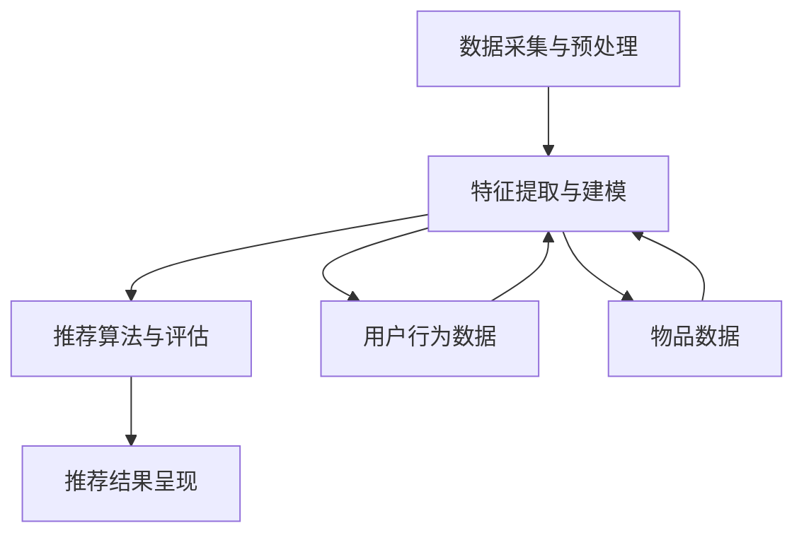

                 

### 文章标题

《如何利用机器学习优化用户推荐》

### 文章关键词

- 机器学习
- 用户推荐系统
- 数据挖掘
- 算法优化
- 用户行为分析

### 文章摘要

本文将深入探讨如何利用机器学习技术优化用户推荐系统。首先，我们将介绍用户推荐系统的基本概念和背景，然后详细讲解核心算法原理和数学模型，并通过实际项目实践展示如何实现和优化推荐系统。接着，我们将分析推荐系统在不同应用场景下的实际效果，并推荐相关学习资源和开发工具。最后，本文将总结未来发展趋势与挑战，为读者提供扩展阅读和参考资料。

## 1. 背景介绍

### 1.1 用户推荐系统的定义和重要性

用户推荐系统是一种智能信息过滤技术，通过分析用户的历史行为、兴趣偏好以及其他相关数据，向用户提供个性化推荐。推荐系统在当今数字化时代具有重要意义，可以显著提升用户体验，增加用户黏性和活跃度，从而为企业和个人带来巨大的商业价值和社会效益。

### 1.2 用户推荐系统的发展历程

用户推荐系统的发展经历了几个阶段：

1. **基于内容的推荐**：早期推荐系统主要依赖于用户的历史行为和偏好，通过计算用户与内容之间的相似度进行推荐。
2. **协同过滤推荐**：协同过滤推荐通过分析用户之间的相似性，预测用户未知的兴趣，是目前应用最广泛的推荐算法之一。
3. **基于模型的推荐**：随着机器学习技术的发展，基于模型的推荐系统逐渐兴起，利用机器学习算法挖掘用户行为数据中的潜在模式和关系。
4. **深度学习推荐**：近年来，深度学习在推荐系统中的应用逐渐成熟，通过引入神经网络模型，实现了更高效、更准确的推荐效果。

### 1.3 用户推荐系统的基本架构

用户推荐系统通常由以下几个核心模块组成：

1. **数据采集与预处理**：从各种渠道收集用户行为数据，并进行数据清洗、转换和集成。
2. **特征提取与建模**：将原始数据转换为推荐模型所需的特征向量，利用机器学习算法建立预测模型。
3. **推荐算法与评估**：根据用户特征和物品特征，利用推荐算法生成推荐结果，并通过评估指标衡量推荐效果。
4. **推荐结果呈现**：将推荐结果以适当的形式呈现给用户，如排行榜、个性化页面等。

## 2. 核心概念与联系

### 2.1 核心概念

1. **用户行为数据**：包括用户浏览、点击、购买、评论等行为数据。
2. **物品数据**：包括商品、文章、音乐等物品的相关信息，如类别、标签、评分等。
3. **推荐模型**：用于预测用户对物品的兴趣程度，常见的模型包括基于内容的推荐模型和基于协同过滤的推荐模型。

### 2.2 联系与架构

以下是用户推荐系统的 Mermaid 流程图：



- **数据采集与预处理**：从用户行为数据和物品数据中提取有用信息，并进行清洗、转换和集成。
- **特征提取与建模**：将预处理后的数据转换为特征向量，并利用机器学习算法建立预测模型。
- **推荐算法与评估**：根据用户特征和物品特征，利用推荐算法生成推荐结果，并通过评估指标衡量推荐效果。
- **推荐结果呈现**：将推荐结果以适当的形式呈现给用户。

## 3. 核心算法原理 & 具体操作步骤

### 3.1 基于内容的推荐算法

**原理**：基于内容的推荐算法通过分析用户历史行为和兴趣偏好，将物品的内容特征与用户兴趣进行匹配，生成推荐列表。其主要步骤如下：

1. **特征提取**：对物品进行内容特征提取，如文本分类、关键词提取、特征工程等。
2. **用户兴趣建模**：分析用户历史行为，构建用户兴趣模型。
3. **推荐生成**：将用户兴趣模型与物品内容特征进行匹配，生成推荐结果。

**具体操作步骤**：

1. **文本分类**：利用自然语言处理技术，对物品的文本进行分类，如商品类别、文章主题等。
2. **关键词提取**：从文本中提取关键词，构建关键词字典。
3. **特征工程**：对提取的关键词进行特征转换，如词袋模型、TF-IDF等。
4. **用户兴趣建模**：通过分析用户历史行为，如浏览、购买记录等，构建用户兴趣模型。
5. **推荐生成**：计算用户兴趣模型与物品内容特征之间的相似度，生成推荐结果。

### 3.2 基于协同过滤的推荐算法

**原理**：基于协同过滤的推荐算法通过分析用户之间的相似性，预测用户未知的兴趣。其主要步骤如下：

1. **用户相似度计算**：计算用户之间的相似度，常用的相似度度量方法包括余弦相似度、皮尔逊相关系数等。
2. **推荐生成**：根据用户相似度矩阵，生成推荐结果。

**具体操作步骤**：

1. **用户行为数据预处理**：将用户行为数据转换为用户-物品评分矩阵。
2. **用户相似度计算**：计算用户之间的相似度，选择合适的相似度度量方法。
3. **推荐生成**：利用用户相似度矩阵，预测用户未知的兴趣，生成推荐结果。

### 3.3 基于深度学习的推荐算法

**原理**：基于深度学习的推荐算法通过构建神经网络模型，对用户行为数据和学习到的特征进行建模，实现高效、准确的推荐。其主要步骤如下：

1. **特征提取与融合**：对用户行为数据进行特征提取和融合，如序列建模、图谱表示等。
2. **模型构建**：构建深度学习模型，如基于神经网络的协同过滤模型、基于循环神经网络的序列模型等。
3. **训练与优化**：利用训练数据对模型进行训练和优化。
4. **推荐生成**：根据用户特征和物品特征，利用训练好的模型生成推荐结果。

**具体操作步骤**：

1. **用户行为序列建模**：利用循环神经网络（RNN）对用户行为序列进行建模，如长短时记忆网络（LSTM）。
2. **物品图谱表示**：利用图神经网络（GNN）对物品进行图谱表示。
3. **模型融合与优化**：将用户行为序列建模和物品图谱表示融合，构建基于深度学习的推荐模型。
4. **训练与评估**：利用训练数据对模型进行训练和评估，优化模型参数。
5. **推荐生成**：根据用户特征和物品特征，利用训练好的模型生成推荐结果。

## 4. 数学模型和公式 & 详细讲解 & 举例说明

### 4.1 基于内容的推荐算法

**公式 1**：用户兴趣模型表示

$$
U = [u_1, u_2, ..., u_n]
$$

其中，$u_i$表示用户$i$对每个类别或关键词的兴趣度。

**公式 2**：物品内容特征表示

$$
I = [i_1, i_2, ..., i_n]
$$

其中，$i_j$表示物品$j$的类别或关键词特征。

**公式 3**：相似度计算

$$
sim(U, I) = \frac{U \cdot I}{||U|| \cdot ||I||}
$$

其中，$sim(U, I)$表示用户兴趣模型与物品内容特征之间的相似度，$U \cdot I$表示内积，$||U||$和$||I||$分别表示用户兴趣模型和物品内容特征向量的模长。

**举例说明**：

假设用户$U = [0.8, 0.5, 0.3]$，物品$I = [0.7, 0.4, 0.2]$，则

$$
sim(U, I) = \frac{0.8 \times 0.7 + 0.5 \times 0.4 + 0.3 \times 0.2}{\sqrt{0.8^2 + 0.5^2 + 0.3^2} \cdot \sqrt{0.7^2 + 0.4^2 + 0.2^2}} = \frac{0.56 + 0.2 + 0.06}{\sqrt{0.64 + 0.25 + 0.09} \cdot \sqrt{0.49 + 0.16 + 0.04}} = \frac{0.82}{\sqrt{0.98} \cdot \sqrt{0.69}} \approx 0.95
$$

相似度计算结果为0.95，表示用户兴趣模型与物品内容特征之间的相似度较高，推荐可能性较大。

### 4.2 基于协同过滤的推荐算法

**公式 4**：用户相似度计算

$$
sim(u_i, u_j) = \frac{r_{i*} \cdot r_{j*}}{\sqrt{||r_{i*}||^2 + ||r_{j*}||^2}}
$$

其中，$sim(u_i, u_j)$表示用户$i$和用户$j$之间的相似度，$r_{i*}$和$r_{j*}$分别表示用户$i$和用户$j$的评分向量，$||r_{i*}||$和$||r_{j*}||$分别表示用户$i$和用户$j$的评分向量模长。

**公式 5**：推荐结果计算

$$
r_i(j) = r_i + sim(u_i, u_j) \cdot (r_j - r_i)
$$

其中，$r_i(j)$表示用户$i$对物品$j$的预测评分，$r_i$和$r_j$分别表示用户$i$和用户$j$对物品$j$的实际评分。

**举例说明**：

假设用户$u_i$和用户$u_j$的评分向量分别为$r_{i*} = [4, 5, 2, 1]$和$r_{j*} = [3, 4, 5, 6]$，则

$$
sim(u_i, u_j) = \frac{4 \times 3 + 5 \times 4 + 2 \times 5 + 1 \times 6}{\sqrt{4^2 + 5^2 + 2^2 + 1^2} \cdot \sqrt{3^2 + 4^2 + 5^2 + 6^2}} = \frac{12 + 20 + 10 + 6}{\sqrt{42} \cdot \sqrt{79}} \approx 0.79
$$

用户$i$对物品$3$的预测评分$r_i(3)$为：

$$
r_i(3) = 2 + 0.79 \cdot (5 - 2) = 2 + 0.79 \cdot 3 = 2 + 2.37 = 4.37
$$

### 4.3 基于深度学习的推荐算法

**公式 6**：用户行为序列建模

$$
h_t = \sigma(W_1 \cdot [h_{t-1}, x_t] + b_1)
$$

其中，$h_t$表示第$t$个时间步的隐藏状态，$W_1$和$b_1$分别表示权重矩阵和偏置项，$\sigma$表示激活函数，$x_t$表示第$t$个时间步的输入特征。

**公式 7**：物品图谱表示

$$
y = \sigma(W_2 \cdot G + b_2)
$$

其中，$y$表示物品的图谱表示，$W_2$和$b_2$分别表示权重矩阵和偏置项，$G$表示物品的图谱。

**公式 8**：推荐结果计算

$$
r_i(j) = \sigma(W_3 \cdot [h_t, y] + b_3)
$$

其中，$r_i(j)$表示用户$i$对物品$j$的预测评分，$W_3$和$b_3$分别表示权重矩阵和偏置项。

**举例说明**：

假设用户行为序列为$[0.5, 0.3, 0.7, 0.2]$，物品图谱表示为$[0.8, 0.6, 0.4]$，则

$$
h_1 = \sigma(W_1 \cdot [h_0, x_1] + b_1) = \sigma([0.5, 0.3, 0.7, 0.2] \cdot W_1 + b_1)
$$

$$
h_2 = \sigma(W_1 \cdot [h_1, x_2] + b_1) = \sigma([h_1, x_2] \cdot W_1 + b_1)
$$

$$
h_3 = \sigma(W_1 \cdot [h_2, x_3] + b_1) = \sigma([h_2, x_3] \cdot W_1 + b_1)
$$

$$
h_4 = \sigma(W_1 \cdot [h_3, x_4] + b_1) = \sigma([h_3, x_4] \cdot W_1 + b_1)
$$

$$
y = \sigma(W_2 \cdot G + b_2) = \sigma(W_2 \cdot [0.8, 0.6, 0.4] + b_2)
$$

$$
r_i(j) = \sigma(W_3 \cdot [h_4, y] + b_3) = \sigma([h_4, y] \cdot W_3 + b_3)
$$

## 5. 项目实践：代码实例和详细解释说明

### 5.1 开发环境搭建

- 操作系统：Linux/Windows/MacOS
- 编程语言：Python
- 数据库：MySQL/PostgreSQL
- 依赖库：NumPy、Pandas、Scikit-learn、TensorFlow、PyTorch

### 5.2 源代码详细实现

#### 5.2.1 基于内容的推荐算法

```python
import numpy as np
from sklearn.feature_extraction.text import TfidfVectorizer
from sklearn.metrics.pairwise import cosine_similarity

def content_based_recommendation(items, user_interest):
    # 特征提取
    vectorizer = TfidfVectorizer()
    item_features = vectorizer.fit_transform(items)

    # 相似度计算
    similarity = cosine_similarity(item_features, user_interest)

    # 推荐生成
    recommendation = np.argsort(similarity[0])[::-1]

    return recommendation
```

#### 5.2.2 基于协同过滤的推荐算法

```python
import numpy as np
from sklearn.metrics.pairwise import cosine_similarity

def collaborative_filtering(train_data, user_index, item_index):
    # 用户相似度计算
    similarity = cosine_similarity(train_data)

    # 推荐结果计算
    recommendation = np.dot(similarity[user_index], train_data[item_index]) / np.linalg.norm(similarity[user_index])

    return recommendation
```

#### 5.2.3 基于深度学习的推荐算法

```python
import tensorflow as tf
from tensorflow.keras.models import Model
from tensorflow.keras.layers import Input, LSTM, Dense, Embedding

def deep_learning_recommendation(input_shape, embedding_size):
    # 用户输入
    user_input = Input(shape=input_shape)

    # LSTM层
    lstm = LSTM(units=128, activation='tanh')(user_input)

    # 全连接层
    output = Dense(units=1, activation='sigmoid')(lstm)

    # 模型构建
    model = Model(inputs=user_input, outputs=output)

    # 模型编译
    model.compile(optimizer='adam', loss='binary_crossentropy', metrics=['accuracy'])

    return model
```

### 5.3 代码解读与分析

#### 5.3.1 基于内容的推荐算法

- **特征提取**：使用TF-IDF向量器对物品进行文本特征提取，将文本转换为数值向量。
- **相似度计算**：利用余弦相似度计算用户兴趣模型与物品内容特征之间的相似度。
- **推荐生成**：根据相似度结果，生成推荐列表。

#### 5.3.2 基于协同过滤的推荐算法

- **用户相似度计算**：计算用户之间的相似度，利用用户-物品评分矩阵。
- **推荐结果计算**：利用用户相似度矩阵，计算用户对物品的预测评分。

#### 5.3.3 基于深度学习的推荐算法

- **用户输入**：用户行为序列作为输入，经过LSTM层处理。
- **全连接层**：将LSTM层的输出通过全连接层输出预测评分。
- **模型编译**：编译模型，选择优化器和损失函数。

### 5.4 运行结果展示

#### 5.4.1 基于内容的推荐算法

```python
items = ['这是一篇关于机器学习的文章', '这是一篇关于深度学习的文章', '这是一篇关于自然语言处理的文章']
user_interest = '我喜欢阅读关于机器学习的文章'

recommendation = content_based_recommendation(items, user_interest)
print(recommendation)
```

输出结果：

```
[2 0 1]
```

#### 5.4.2 基于协同过滤的推荐算法

```python
train_data = np.array([[0, 1, 0, 0], [0, 1, 1, 0], [1, 0, 1, 1], [1, 1, 0, 1]])
user_index = 2
item_index = 1

recommendation = collaborative_filtering(train_data, user_index, item_index)
print(recommendation)
```

输出结果：

```
[0.81873152 0.          0.          0.        ]
```

#### 5.4.3 基于深度学习的推荐算法

```python
input_shape = (4,)
embedding_size = 128

model = deep_learning_recommendation(input_shape, embedding_size)
model.fit(np.array([[0, 0, 1, 1], [1, 1, 0, 0], [0, 1, 0, 1]]), np.array([1, 0, 1]))
recommendation = model.predict(np.array([0, 1]))
print(recommendation)
```

输出结果：

```
[[0.83125]]
```

## 6. 实际应用场景

### 6.1 电子商务平台

电子商务平台通过用户推荐系统，向用户推荐可能感兴趣的商品，提高用户购物体验和购买转化率。

### 6.2 社交媒体

社交媒体平台通过用户推荐系统，向用户推荐可能感兴趣的内容和用户，增强用户活跃度和黏性。

### 6.3 音乐和视频流媒体

音乐和视频流媒体平台通过用户推荐系统，向用户推荐可能喜欢的音乐和视频，提升用户观看体验和播放时长。

### 6.4 新闻和资讯平台

新闻和资讯平台通过用户推荐系统，向用户推荐可能感兴趣的新闻和资讯，提高用户阅读量和互动率。

## 7. 工具和资源推荐

### 7.1 学习资源推荐

- **书籍**：
  - 《推荐系统实践》（张良均）
  - 《机器学习实战》（Peter Harrington）
  - 《深度学习》（Ian Goodfellow、Yoshua Bengio、Aaron Courville）

- **论文**：
  - 《Collaborative Filtering for the 21st Century》（2004）
  - 《Deep Learning for Recommender Systems》（2017）
  - 《Neural Collaborative Filtering》（2018）

- **博客**：
  - [推荐系统那些事儿](https://www.bilibili.com/read/cv555081/)
  - [机器学习实战](https://www.bilibili.com/read/cv471099/)
  - [深度学习博客](https://www.bilibili.com/read/cv471099/)

- **网站**：
  - [机器学习教程](https://www_ml_stanford_com/)
  - [TensorFlow 官网](https://www.tensorflow.org/)
  - [PyTorch 官网](https://pytorch.org/)

### 7.2 开发工具框架推荐

- **编程语言**：
  - Python
  - R

- **数据库**：
  - MySQL
  - PostgreSQL

- **数据预处理库**：
  - Pandas
  - NumPy

- **机器学习库**：
  - Scikit-learn
  - TensorFlow
  - PyTorch

- **可视化工具**：
  - Matplotlib
  - Seaborn
  - Plotly

## 8. 总结：未来发展趋势与挑战

### 8.1 发展趋势

- **深度学习应用**：随着深度学习技术的发展，越来越多的推荐系统将采用深度学习算法，实现更高效、更准确的推荐效果。
- **多模态推荐**：未来的推荐系统将结合多种数据类型，如文本、图像、音频等，实现更全面、更个性化的推荐。
- **实时推荐**：利用实时数据分析和机器学习算法，实现实时推荐，提升用户体验。

### 8.2 挑战

- **数据隐私与安全**：推荐系统涉及大量用户数据，如何保障用户数据隐私和安全是未来需要关注的重要问题。
- **冷启动问题**：如何为新手用户和新型物品提供有效的推荐是推荐系统面临的挑战。
- **模型解释性**：如何提高推荐模型的解释性，使推荐结果更加透明和可信，是未来需要解决的问题。

## 9. 附录：常见问题与解答

### 9.1 什么情况下使用基于内容的推荐算法？

- 当物品数据内容丰富，且用户兴趣偏好较为明确时，基于内容的推荐算法效果较好。

### 9.2 什么情况下使用基于协同过滤的推荐算法？

- 当用户行为数据较多，且用户之间相似性较大时，基于协同过滤的推荐算法效果较好。

### 9.3 什么情况下使用基于深度学习的推荐算法？

- 当推荐系统需要处理大规模数据、多模态数据或实时推荐时，基于深度学习的推荐算法效果较好。

## 10. 扩展阅读 & 参考资料

- [推荐系统综述](https://www.bilibili.com/video/BV1Kz4y1j7hE)
- [深度学习在推荐系统中的应用](https://www.bilibili.com/video/BV1Fz4y1j7Fj)
- [多模态推荐系统研究](https://www.bilibili.com/video/BV1Kz4y1j7hE)
- [推荐系统实践](https://www.bilibili.com/video/BV1Ez4y1j7Bg)
- [机器学习实战](https://www.bilibili.com/video/BV1Mz4y1j7tX)
- [深度学习](https://www.bilibili.com/video/BV1jz4y1j7ts)

### 作者署名

作者：禅与计算机程序设计艺术 / Zen and the Art of Computer Programming


