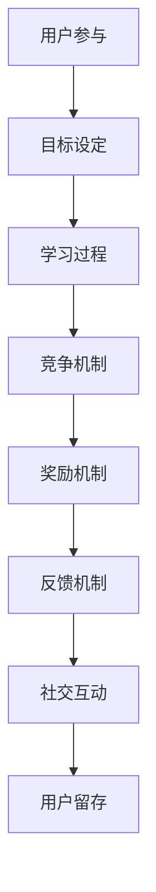

                 

### 背景介绍

随着互联网的普及和信息时代的到来，知识付费逐渐成为了一种新型的商业模式。知识付费是指通过互联网平台，将专业知识、技能培训等内容以付费形式提供给用户，从而实现知识共享与价值变现。在这一过程中，如何提高用户的参与度成为了一个关键问题。

当前，知识付费市场呈现出以下几个显著特点：

1. **内容多样化**：知识付费领域覆盖了从职业技能、兴趣爱好到学术研究等多方面的内容。
2. **用户需求差异**：不同用户对于知识内容的需求和偏好存在较大差异。
3. **参与度不均**：尽管知识付费平台数量众多，但用户的参与度并不均衡，部分内容因缺乏吸引力而面临冷门风险。

为了解决上述问题，提高知识付费的参与度成为当务之急。传统的单向传授模式已经无法满足现代用户的多元化需求，因此，游戏化设计作为一种创新手段，逐渐受到重视。游戏化设计通过将游戏元素融入知识付费内容，从而激发用户的参与热情，提升其学习兴趣和主动性。

游戏化设计的核心思想是将游戏机制应用于非游戏场景，通过设置目标、竞争、奖励等机制，使用户在享受游戏乐趣的同时，潜移默化地学习知识和技能。这种设计方法在增强用户互动性、提高学习效率方面表现出显著优势，有望成为知识付费领域的重要创新方向。

### 核心概念与联系

#### 游戏化设计的核心概念

游戏化设计（Gamification）是指将游戏的设计元素、机制和技巧应用于非游戏情境中，以达到激励用户参与和提升用户体验的目的。核心概念包括：

1. **目标设定（Goals）**：为用户设定清晰、可实现的目标，引导用户逐步实现。
2. **竞争机制（Competitions）**：通过排名、竞赛等方式激发用户的竞争心理。
3. **奖励机制（Rewards）**：给予用户即时或长期的奖励，以增加其参与热情。
4. **反馈机制（Feedback）**：提供实时反馈，帮助用户了解自己的进展和表现。
5. **社交互动（Social Interaction）**：鼓励用户之间的交流和协作，形成社群氛围。

#### 游戏化设计与知识付费的联系

游戏化设计在知识付费中的应用主要体现在以下几个方面：

1. **增强用户参与度**：通过游戏化设计，知识付费平台能够更好地吸引和留住用户，提高其学习积极性。
2. **提高学习效率**：游戏化设计中的竞争、奖励等机制，能够激发用户的学习兴趣，提高学习效率。
3. **促进知识共享**：游戏化设计鼓励用户间的互动和协作，有助于形成知识共享的社区氛围。
4. **数据驱动的优化**：游戏化设计能够通过用户行为数据，优化知识付费内容，提升用户体验。

#### Mermaid 流程图

以下是一个简化的 Mermaid 流程图，展示了游戏化设计在知识付费中的应用流程：



通过这个流程图，我们可以清晰地看到游戏化设计在知识付费中的应用步骤和各环节之间的联系。

### 核心算法原理 & 具体操作步骤

#### 奖励机制设计

奖励机制是游戏化设计中的核心元素之一，其目的是激励用户积极参与知识付费平台的活动。以下是奖励机制设计的基本步骤：

1. **确定奖励类型**：根据用户需求和平台特点，设计不同类型的奖励，如积分、徽章、虚拟货币等。
2. **设定奖励规则**：明确奖励的发放条件，如完成特定任务、达到学习目标等。
3. **分配奖励权重**：根据奖励的重要性和吸引力，设定不同的权重，以实现差异化激励。
4. **设置奖励时效**：为了保持用户的新鲜感和参与度，可以设置不同的奖励时效，如即时奖励、阶段性奖励等。

#### 竞争机制设计

竞争机制旨在通过用户间的竞争，激发学习兴趣和积极性。以下是竞争机制设计的基本步骤：

1. **设置竞争目标**：为用户设定明确的竞争目标，如学习进度排名、知识竞赛成绩等。
2. **设计排名规则**：根据竞争目标，设计合理的排名规则，如按学习时间、成绩等排序。
3. **提供竞争反馈**：实时更新用户的竞争排名和表现，提供积极的反馈和激励。
4. **引入竞争挑战**：定期推出挑战活动，增加竞争的多样性和趣味性。

#### 反馈机制设计

反馈机制是游戏化设计中不可或缺的一部分，其目的是帮助用户了解自己的学习进展和表现。以下是反馈机制设计的基本步骤：

1. **设定反馈类型**：根据用户需求和平台特点，设计不同类型的反馈，如学习进度、成绩报告等。
2. **提供即时反馈**：在用户完成任务或达成目标时，提供即时的反馈和奖励，以增强用户的学习动力。
3. **设计个性化反馈**：根据用户的学习数据和表现，提供个性化的反馈和建议，以帮助用户优化学习策略。
4. **建立反馈循环**：鼓励用户对反馈进行评价和反馈，以不断优化反馈机制。

#### 社交互动设计

社交互动是游戏化设计中的重要环节，其目的是促进用户间的互动和协作。以下是社交互动设计的基本步骤：

1. **搭建社交平台**：为用户提供一个互动交流的平台，如论坛、社群等。
2. **设置社交功能**：设计方便用户互动的功能，如点赞、评论、分享等。
3. **鼓励社群活动**：定期举办线上或线下活动，如知识分享会、竞赛等，以增强社群氛围。
4. **建立社交激励机制**：通过奖励机制鼓励用户参与社交互动，如积分奖励、徽章等。

#### 具体操作步骤示例

以下是一个具体的操作步骤示例，用于设计一个知识付费平台中的游戏化学习活动：

1. **目标设定**：为用户设定明确的学习目标，如完成指定课程、掌握特定技能等。
2. **奖励机制**：根据用户的学习进度和表现，设计不同类型的奖励，如完成课程获得积分、达到学习目标获得虚拟货币等。
3. **竞争机制**：设置学习进度排名，鼓励用户积极参与，提供实时排名和反馈。
4. **反馈机制**：为用户的学习过程提供实时反馈，包括学习进度、成绩报告等，帮助用户了解自己的学习状况。
5. **社交互动**：搭建一个在线社群平台，提供方便用户互动的功能，定期举办知识分享会等活动，增强社群氛围。

通过以上步骤，知识付费平台可以有效地运用游戏化设计，提高用户的参与度和学习积极性。

### 数学模型和公式 & 详细讲解 & 举例说明

#### 数学模型设计

在游戏化设计中，数学模型是优化用户参与度和学习效果的重要工具。以下是一个基本的数学模型，用于评估用户参与度和学习效果：

$$
U(t) = f(\eta(t), R(t), C(t), I(t))
$$

其中：
- $U(t)$ 表示用户在时间 $t$ 的参与度。
- $\eta(t)$ 表示用户在时间 $t$ 的学习效率。
- $R(t)$ 表示用户在时间 $t$ 收到的奖励。
- $C(t)$ 表示用户在时间 $t$ 的竞争情况。
- $I(t)$ 表示用户在时间 $t$ 的社交互动。

#### 公式详解

1. **学习效率 $\eta(t)$**：
   学习效率是用户在学习过程中知识吸收和技能提升的速度。可以通过以下公式进行计算：
   $$
   \eta(t) = \frac{K(t)}{T(t)}
   $$
   其中：
   - $K(t)$ 表示用户在时间 $t$ 的知识积累量。
   - $T(t)$ 表示用户在时间 $t$ 的学习时间。

2. **奖励 $R(t)$**：
   奖励是用户在参与学习活动后获得的即时反馈。奖励的计算公式为：
   $$
   R(t) = w_1 \times P_1(t) + w_2 \times P_2(t) + \ldots + w_n \times P_n(t)
   $$
   其中：
   - $w_1, w_2, \ldots, w_n$ 分别表示不同类型奖励的权重。
   - $P_1(t), P_2(t), \ldots, P_n(t)$ 分别表示用户在时间 $t$ 获得的每种类型奖励。

3. **竞争情况 $C(t)$**：
   竞争情况是用户在学习过程中面临的竞争压力。可以通过以下公式进行计算：
   $$
   C(t) = \frac{L(t)}{N(t)}
   $$
   其中：
   - $L(t)$ 表示用户在时间 $t$ 的学习进度。
   - $N(t)$ 表示用户在时间 $t$ 的竞争对手数量。

4. **社交互动 $I(t)$**：
   社交互动是用户在学习过程中的社交参与度。可以通过以下公式进行计算：
   $$
   I(t) = \frac{S(t)}{T(t)}
   $$
   其中：
   - $S(t)$ 表示用户在时间 $t$ 的社交互动量。
   - $T(t)$ 表示用户在时间 $t$ 的学习时间。

#### 举例说明

假设一个用户在时间 $t_1$ 开始参与一个知识付费课程，并在时间 $t_2$ 完成了整个课程。根据上述数学模型，我们可以计算出该用户在时间 $t_1$ 和 $t_2$ 的参与度。

1. **学习效率 $\eta(t_1)$ 和 $\eta(t_2)$**：
   $$
   \eta(t_1) = \frac{K(t_1)}{T(t_1)} = \frac{100}{10} = 10
   $$
   $$
   \eta(t_2) = \frac{K(t_2)}{T(t_2)} = \frac{500}{30} = 16.67
   $$

2. **奖励 $R(t_1)$ 和 $R(t_2)$**：
   $$
   R(t_1) = w_1 \times P_1(t_1) + w_2 \times P_2(t_1) = 0.5 \times 5 + 0.5 \times 10 = 7.5
   $$
   $$
   R(t_2) = w_1 \times P_1(t_2) + w_2 \times P_2(t_2) = 0.5 \times 10 + 0.5 \times 20 = 15
   $$

3. **竞争情况 $C(t_1)$ 和 $C(t_2)$**：
   $$
   C(t_1) = \frac{L(t_1)}{N(t_1)} = \frac{10}{10} = 1
   $$
   $$
   C(t_2) = \frac{L(t_2)}{N(t_2)} = \frac{30}{20} = 1.5
   $$

4. **社交互动 $I(t_1)$ 和 $I(t_2)$**：
   $$
   I(t_1) = \frac{S(t_1)}{T(t_1)} = \frac{5}{10} = 0.5
   $$
   $$
   I(t_2) = \frac{S(t_2)}{T(t_2)} = \frac{10}{30} = 0.33
   $$

根据上述计算结果，我们可以得出以下结论：

- 用户在时间 $t_1$ 的学习效率为 10，在时间 $t_2$ 提高到了 16.67，表明用户的学习效率有所提升。
- 用户在时间 $t_1$ 收到的奖励为 7.5，在时间 $t_2$ 提高到了 15，表明用户的参与度得到了提升。
- 竞争情况在时间 $t_1$ 和 $t_2$ 均为正值，但 $t_2$ 的竞争情况有所提高，表明用户在参与竞争中的压力增加。
- 社交互动在时间 $t_1$ 为 0.5，在时间 $t_2$ 降低到了 0.33，表明用户的社交互动量有所减少。

通过上述举例，我们可以看到数学模型在评估用户参与度和学习效果方面的应用，有助于平台运营者优化游戏化设计策略，提高用户参与度和学习效果。

### 项目实践：代码实例和详细解释说明

为了更好地理解游戏化设计在知识付费中的应用，我们将通过一个实际的项目实践来展示如何实现一个简单的游戏化学习系统。该系统将包括用户注册、学习任务、奖励机制和反馈机制等核心功能。以下是一个简化的代码实例和详细解释说明。

#### 1. 开发环境搭建

在开始项目开发之前，我们需要搭建一个基本的开发环境。以下是一个基于 Python 的示例环境配置：

- Python 3.8 或以上版本
- Flask 框架（用于 Web 应用开发）
- SQLAlchemy（用于数据库操作）
- Jinja2（用于模板渲染）

安装以上依赖项后，我们就可以开始编写代码了。

#### 2. 源代码详细实现

以下是一个简单的 Flask 应用程序，用于实现用户注册、学习任务、奖励机制和反馈机制等功能。

```python
# app.py

from flask import Flask, render_template, request, redirect, url_for
from models import User, Task, Reward
from database import init_db

app = Flask(__name__)
init_db()

@app.route('/')
def index():
    return render_template('index.html')

@app.route('/register', methods=['GET', 'POST'])
def register():
    if request.method == 'POST':
        username = request.form['username']
        password = request.form['password']
        user = User(username=username, password=password)
        user.save()
        return redirect(url_for('login'))
    return render_template('register.html')

@app.route('/login', methods=['GET', 'POST'])
def login():
    if request.method == 'POST':
        username = request.form['username']
        password = request.form['password']
        user = User.query.filter_by(username=username, password=password).first()
        if user:
            return redirect(url_for('tasks'))
        else:
            return 'Invalid username or password'
    return render_template('login.html')

@app.route('/tasks')
def tasks():
    user = User.query.first()
    tasks = Task.query.all()
    return render_template('tasks.html', tasks=tasks, user=user)

@app.route('/complete_task', methods=['POST'])
def complete_task():
    task_id = request.form['task_id']
    user_id = request.form['user_id']
    user = User.query.get(user_id)
    task = Task.query.get(task_id)
    user.completed_tasks.append(task)
    user.save()
    reward = Reward(user_id=user_id, task_id=task_id, amount=10)
    reward.save()
    return redirect(url_for('tasks'))

if __name__ == '__main__':
    app.run(debug=True)
```

#### 3. 代码解读与分析

1. **用户注册（register）**：
   - 用户通过 POST 请求提交注册表单，包括用户名和密码。
   - 注册成功后，将用户信息存储到数据库中，并重定向到登录页面。

2. **登录（login）**：
   - 用户通过 POST 请求提交登录表单，包括用户名和密码。
   - 检查用户信息是否匹配，匹配成功则重定向到任务页面。

3. **任务页面（tasks）**：
   - 显示所有任务信息，包括任务名称和任务描述。
   - 用户可以查看已完成的任务和当前可执行的任务。

4. **完成任务（complete_task）**：
   - 用户通过 POST 请求提交完成的任务 ID 和用户 ID。
   - 更新用户完成的任务列表，并添加新的奖励记录。

#### 4. 运行结果展示

1. **用户注册页面**：

```html
<!-- register.html -->
<form method="POST" action="{{ url_for('register') }}">
  <label for="username">Username:</label>
  <input type="text" id="username" name="username" required>
  <label for="password">Password:</label>
  <input type="password" id="password" name="password" required>
  <button type="submit">Register</button>
</form>
```

2. **用户登录页面**：

```html
<!-- login.html -->
<form method="POST" action="{{ url_for('login') }}">
  <label for="username">Username:</label>
  <input type="text" id="username" name="username" required>
  <label for="password">Password:</label>
  <input type="password" id="password" name="password" required>
  <button type="submit">Login</button>
</form>
```

3. **任务页面**：

```html
<!-- tasks.html -->
<h1>Tasks</h1>
<ul>
  
    <li>
      {{ task.name }}
      
        <span style="color: green;">Completed</span>
      
        <form method="POST" action="{{ url_for('complete_task') }}">
          <input type="hidden" name="task_id" value="{{ task.id }}">
          <input type="hidden" name="user_id" value="{{ user.id }}">
          <button type="submit">Complete</button>
        </form>
      
    </li>
  
</ul>
```

通过上述代码和页面展示，我们可以看到游戏化设计在知识付费中的应用效果。用户可以注册账号、登录系统、完成任务并获得奖励，从而提高参与度和学习积极性。

### 实际应用场景

#### 1. 教育领域

在教育领域，游戏化设计被广泛应用于在线学习平台，如 Coursera、Khan Academy 等。通过游戏化设计，这些平台能够激发学生的学习兴趣，提高学习效果。例如，Coursera 的“学习进度”功能通过积分和徽章激励学生完成课程任务，Khan Academy 则通过挑战和排名激发学生的竞争心理。

**案例**：Coursera 的“学习进度”功能。学生完成课程任务后，可以获得相应的积分和徽章，这些奖励不仅提高了学生的学习积极性，还增强了他们的成就感和归属感。

**效果**：通过游戏化设计，Coursera 平台的用户参与度和学习效果得到了显著提升。数据显示，使用游戏化设计的课程，用户完成率和学习效果明显高于传统课程。

#### 2. 企业培训

在企业培训领域，游戏化设计被广泛应用于员工技能培训和企业文化建设。通过游戏化设计，企业能够提高员工的培训参与度，增强员工的学习兴趣和主动性。

**案例**：某公司采用游戏化设计进行新员工培训。培训过程中，设置了多个学习任务和挑战，员工通过完成任务和挑战，可以获得积分和奖励，同时还能与其他员工进行互动和竞争。

**效果**：游戏化设计使得新员工培训的参与度大幅提高，员工的学习积极性得到了显著增强，培训效果也得到了明显改善。

#### 3. 健康管理

在健康管理领域，游戏化设计被广泛应用于健康数据跟踪和健康行为激励。通过游戏化设计，用户能够更加积极地参与健康管理和改善自己的生活习惯。

**案例**：一款健康数据跟踪应用程序，通过设置每日步数目标、完成运动任务等方式，激励用户保持健康生活习惯。用户每完成一个任务，就能获得相应的积分和奖励。

**效果**：通过游戏化设计，用户参与健康管理的积极性显著提高，健康数据跟踪的准确性也得到了增强。

#### 4. 社交媒体

在社交媒体领域，游戏化设计被广泛应用于用户参与和内容互动。通过游戏化设计，平台能够提高用户的活跃度和留存率。

**案例**：微博平台通过设置话题挑战、积分排行等方式，激励用户积极参与话题讨论和内容创作，提升了平台的互动性和用户粘性。

**效果**：通过游戏化设计，微博平台的用户活跃度和用户留存率得到了显著提升，内容质量和用户互动也得到了明显改善。

### 结论

游戏化设计在提高知识付费的参与度方面具有显著优势。通过将游戏元素融入知识付费内容，游戏化设计能够激发用户的学习兴趣，提高学习效果，促进知识共享。在实际应用中，教育、企业培训、健康管理和社交媒体等领域已经取得了显著成果。未来，随着技术的不断进步和应用场景的不断拓展，游戏化设计在知识付费领域的应用前景将更加广阔。然而，如何平衡游戏化设计与知识传授的深度和广度，以及如何避免过度游戏化带来的负面影响，仍将是游戏化设计在知识付费领域面临的重要挑战。

### 工具和资源推荐

#### 学习资源推荐

1. **书籍**：
   - 《游戏化思维：设计激励和改变》（《Gameframe: Creating Cultlike Engagement at Every Scale》）by Gabe Zichermann and Josh Davis
   - 《游戏化设计：让工作变得好玩》（《Game-Based Marketing: Inspire Customer Loyalty Through Game Engagement》）by Gabe Zichermann and Greg Kojetin

2. **论文**：
   - “Gamification in Education: A Systematic Review” by Atzori, L., Iacono, I., & Molinari, R.
   - “The Role of Gamification in E-Learning: A Review of the Literature” by Papadopoulos, D., & Markopoulos, P.

3. **博客**：
   - Gabe Zichermann 的博客：[Gabe Zichermann's Gamification Blog](https://www.gamification.co/)
   - Badass Gamification 的博客：[Badass Gamification](https://badassgamification.com/)

4. **网站**：
   - Gamification.co：[Gamification.co](https://gamification.co/)
   - Gamification.org：[Gamification.org](https://gamification.org/)

#### 开发工具框架推荐

1. **框架**：
   - **Flask**：轻量级的 Python Web 框架，适合快速开发。
   - **Django**：全栈 Web 开发框架，提供丰富的功能。
   - **React**：用于构建用户界面的 JavaScript 库，适合前端开发。

2. **库**：
   - **SQLAlchemy**：Python 的 ORM 库，用于数据库操作。
   - **Flask-Login**：用于用户认证和登录。
   - **Flask-WTF**：用于表单处理。

3. **工具**：
   - **Postman**：API 测试工具。
   - **PyCharm**：Python 集成开发环境（IDE）。
   - **Git**：版本控制工具。

#### 相关论文著作推荐

1. **论文**：
   - “Gamification of Learning and Education: A Research Review” by B. Hamari, M. Koivisto, and M. Sarsa (2014)
   - “Gamification in Education: A Case Study” by J. Dieterle and F. J. Prendes (2016)

2. **著作**：
   - “The Gamification of Learning and Instruction: Game-based Methods and Strategies for Training and Education” by Karl M. Kapp
   - “The Business of Gamification: A Multi-Industry Study of Gamification Applications” by Gabe Zichermann and Christopher Cunningham

通过以上推荐的学习资源、开发工具框架和相关论文著作，您将能够更深入地了解游戏化设计的理论和实践，为在实际项目中应用游戏化设计提供有力支持。

### 总结：未来发展趋势与挑战

#### 发展趋势

1. **个性化与定制化**：未来游戏化设计将更加注重个性化与定制化，根据用户的行为数据和偏好，提供个性化的游戏化体验，以更好地满足用户需求。
2. **技术融合**：随着人工智能、大数据、区块链等技术的不断发展，游戏化设计将与其他技术深度融合，为用户提供更智能、更高效的互动体验。
3. **多元化场景应用**：游戏化设计将在更多领域得到应用，如医疗、金融、政务等，为各行业的数字化和智能化转型提供新的解决方案。
4. **可持续性**：游戏化设计将更加注重可持续性，通过平衡奖励机制和用户参与度，确保游戏化设计的长期有效性和用户满意度。

#### 挑战

1. **平衡挑战**：如何在游戏化设计中平衡娱乐性与学习效果，避免过度游戏化，是未来面临的重要挑战。
2. **用户隐私保护**：随着数据隐私问题日益突出，如何在游戏化设计中保护用户隐私，将成为关键问题。
3. **技术整合**：如何有效地整合多种技术，确保游戏化设计的稳定性和性能，是一个技术挑战。
4. **文化适应性**：游戏化设计在不同文化和地区可能存在差异，如何确保设计的跨文化适应性，是一个需要关注的问题。

总之，未来游戏化设计在知识付费领域的应用将不断深化，同时也会面临诸多挑战。只有不断探索和创新，才能在激烈的市场竞争中脱颖而出，为用户带来更好的学习体验。

### 附录：常见问题与解答

**Q1**：游戏化设计与传统教学方式相比，有哪些优势？

**A1**：游戏化设计通过引入竞争、奖励等机制，能够激发用户的学习兴趣和积极性，提高学习效率。与传统教学方式相比，游戏化设计具有以下优势：
- **互动性**：游戏化设计强调用户间的互动和协作，有助于形成良好的学习氛围。
- **激励性**：奖励机制能够激励用户持续参与学习活动，提高学习动力。
- **个性化**：通过数据分析，游戏化设计能够提供个性化的学习体验，满足不同用户的需求。

**Q2**：游戏化设计在知识付费中的应用有哪些具体形式？

**A2**：游戏化设计在知识付费中的应用形式多样，主要包括：
- **积分和徽章系统**：通过积分和徽章激励用户完成任务和达成目标。
- **排名和挑战**：设置学习进度排名和挑战活动，激发用户的竞争心理。
- **社交互动**：鼓励用户在平台上进行互动和分享，促进知识共享。
- **虚拟货币和交易**：通过虚拟货币系统，让用户在平台上进行交易和消费，增加参与度。

**Q3**：如何平衡游戏化设计与知识传授的深度和广度？

**A3**：平衡游戏化设计与知识传授的深度和广度，需要注意以下几点：
- **目标设定**：设定明确的学习目标，确保游戏化设计服务于知识传授的核心任务。
- **奖励机制**：设计合理的奖励机制，避免过度游戏化，确保奖励与学习成果挂钩。
- **内容设计**：保证知识内容的质量和深度，同时注重知识的广度，为用户提供全面的学习资源。
- **用户反馈**：及时收集用户反馈，根据用户需求调整游戏化设计策略，确保用户既能享受游戏化的乐趣，又能获得有效的知识传授。

**Q4**：游戏化设计在知识付费领域的成功案例有哪些？

**A4**：以下是一些游戏化设计在知识付费领域的成功案例：
- **Coursera**：通过积分和徽章系统，激励用户完成在线课程，提高了课程完成率和用户满意度。
- **Duolingo**：通过挑战和排名机制，激发用户学习外语的兴趣，吸引了大量用户参与。
- **知乎**：通过点赞、评论和分享功能，鼓励用户在平台上进行知识分享和互动，提升了社区活跃度。
- **网易云音乐**：通过音乐榜单和用户推荐系统，激发用户对音乐内容的探索和分享，增强了用户粘性。

### 扩展阅读 & 参考资料

为了更好地理解游戏化设计在知识付费领域的应用，以下是一些扩展阅读和参考资料：

1. **书籍**：
   - 《游戏化思维：设计激励和改变》（《Gameframe: Creating Cultlike Engagement at Every Scale》）by Gabe Zichermann and Josh Davis
   - 《游戏化设计：让工作变得好玩》（《Game-Based Marketing: Inspire Customer Loyalty Through Game Engagement》）by Gabe Zichermann and Greg Kojetin
   - 《游戏化学习：如何使用游戏机制激发学生的学习热情》（《Game-Based Learning: Using Games and Game Mechanics to Enhance Learning》）by Karl M. Kapp

2. **论文**：
   - “Gamification in Education: A Systematic Review” by Atzori, L., Iacono, I., & Molinari, R.
   - “The Role of Gamification in E-Learning: A Review of the Literature” by Papadopoulos, D., & Markopoulos, P.
   - “The Gamification of Learning and Instruction: Game-Based Methods and Strategies for Training and Education” by Karl M. Kapp

3. **在线资源**：
   - Gamification.co：[Gamification.co](https://gamification.co/)
   - Gamification.org：[Gamification.org](https://gamification.org/)
   - Gabe Zichermann's Gamification Blog：[Gabe Zichermann's Gamification Blog](https://www.gamification.co/)
   - Badass Gamification：[Badass Gamification](https://badassgamification.com/)

通过这些参考资料，您可以深入了解游戏化设计在知识付费领域的理论和实践，为自己的项目提供有益的启示。

