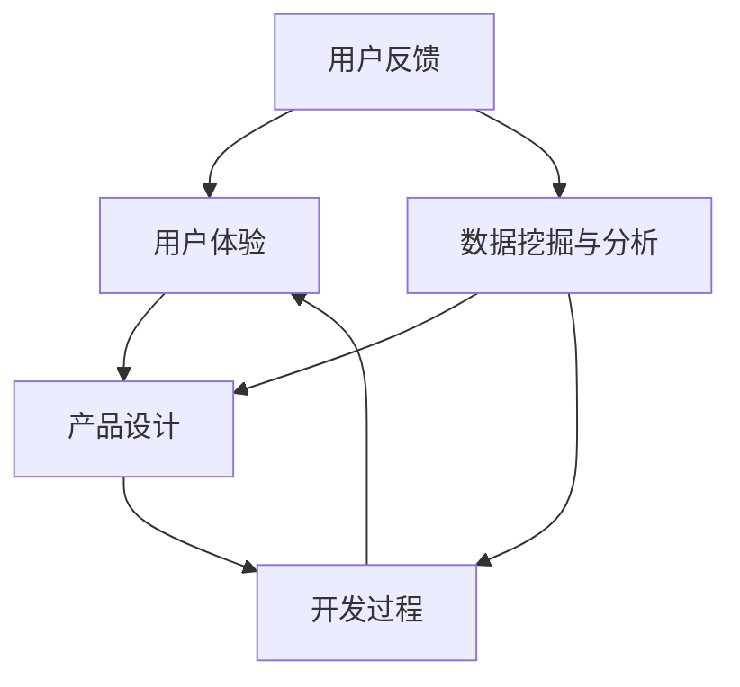

                 

### 背景介绍

在当今快速变化的技术环境中，产品的迭代速度越来越快，用户体验成为企业竞争力的关键因素之一。用户反馈作为产品迭代过程中的重要数据来源，能够帮助企业更好地理解用户需求，从而实现产品的持续优化和改进。本文将探讨如何利用用户反馈驱动产品迭代，通过一系列的逻辑分析和技术方法，帮助企业和开发团队实现这一目标。

用户反馈的重要性不仅体现在其能够直接揭示用户的需求和痛点，还能够帮助团队识别潜在的问题和改进机会。传统的开发模式往往依赖于预测和假设，而用户反馈则为产品迭代提供了实际的数据支持，使得团队能够更加客观和有效地进行决策。此外，用户反馈还具有以下优点：

1. **提升用户体验**：通过收集和分析用户反馈，团队能够及时了解用户的使用情况，针对用户的痛点进行优化，从而提升用户体验。

2. **增强用户忠诚度**：及时响应用户反馈，解决用户的问题，能够增强用户的信任和忠诚度，促进用户留存。

3. **降低开发风险**：通过提前识别用户的需求和潜在问题，团队能够减少不必要的开发和资源浪费，降低项目的开发风险。

然而，用户反馈的处理并非易事。首先，用户反馈的形式多样，包括文字、图片、视频等，需要团队能够有效收集、整理和分析这些数据。其次，用户反馈的来源也多样化，可能来自用户评论、在线调查、社交网络等多种渠道。此外，用户反馈的数据量通常较大，需要高效的工具和方法进行挖掘和分析。因此，如何有效地利用用户反馈驱动产品迭代，成为企业面临的一大挑战。

本文将首先介绍用户反馈的类型和来源，然后探讨如何收集、整理和分析用户反馈，接着讨论如何利用这些数据进行产品设计、开发过程和用户体验优化，最后分析用户反馈在实际项目中的应用案例，并提供未来发展的趋势和挑战。通过这些内容的逐步分析，我们将了解如何利用用户反馈这一宝贵资源，推动产品不断迭代和优化。

### 核心概念与联系

为了深入探讨如何利用用户反馈驱动产品迭代，我们需要明确一些核心概念，并理解它们之间的相互关系。以下是本文将涉及的关键概念及其相互关系：

1. **用户反馈**：用户在使用产品过程中提供的意见和建议，可以是正面评价、负面反馈、功能建议、使用障碍等。

2. **用户体验**：用户在使用产品时感受到的整体感觉和满意度，包括功能易用性、响应速度、界面美观等方面。

3. **产品设计**：产品从概念到实际交付的整个流程，包括需求分析、原型设计、界面设计、功能实现等。

4. **开发过程**：产品从设计到开发、测试、上线等各个阶段的执行过程。

5. **数据挖掘与分析**：从用户反馈中提取有价值的信息，通过统计分析、机器学习等方法进行深入分析。

下面将使用Mermaid流程图展示这些概念之间的相互关系，并详细解释每个环节。



**用户反馈与用户体验的关系**：
- 用户反馈是用户体验的反映，通过收集和分析用户反馈，团队能够了解用户在使用产品时的具体感受和痛点。
- 用户体验是用户反馈的基础，用户在使用产品时产生的所有感受和体验都会通过反馈体现出来。

**用户体验与产品设计的关系**：
- 用户反馈提供了改进产品的直接指导，团队可以根据用户反馈调整产品设计的方向和细节，使其更符合用户需求。
- 优秀的设计能够提升用户体验，从而增加用户满意度和忠诚度，促进产品的市场竞争力。

**开发过程与用户反馈的关系**：
- 开发过程中，团队需要根据产品设计进行编码、测试和优化，用户反馈在这个过程中起到监督和指导作用，帮助团队发现和解决开发中的问题。
- 开发过程中产生的数据，如性能监控、错误日志等，也可以作为用户反馈的一部分，帮助团队更好地理解产品的实际运行情况。

**数据挖掘与分析的作用**：
- 数据挖掘与分析能够从大量的用户反馈数据中提取有价值的信息，帮助团队识别用户需求、趋势和潜在问题。
- 通过机器学习等技术，团队能够实现自动化分析，提高用户反馈处理的效率和准确性。

通过上述流程图和详细解释，我们可以看到用户反馈、用户体验、产品设计、开发过程和数据挖掘与分析之间的紧密联系，它们共同构成了一个闭环系统，不断推动产品的迭代和优化。

### 核心算法原理 & 具体操作步骤

在理解了用户反馈、用户体验、产品设计、开发过程以及数据挖掘与分析的核心概念及其相互关系之后，接下来我们将探讨如何通过具体的算法原理和操作步骤来利用用户反馈驱动产品迭代。这一部分将详细讲解数据收集、处理、分析和反馈机制，帮助团队更有效地将用户需求转化为产品改进。

#### 1. 数据收集

数据收集是整个流程的第一步，也是至关重要的一步。以下是收集用户反馈的几种常见方法：

1. **用户调研**：
   - **问卷调查**：通过在线或离线问卷收集用户的意见和反馈。问卷的设计应简洁明了，关注具体问题和用户体验。
   - **用户访谈**：通过一对一访谈，深入了解用户的具体使用场景和痛点。访谈过程应记录详细，便于后续分析。

2. **社交媒体分析**：
   - **社交媒体监听**：使用社交媒体监测工具，如Hootsuite、Brandwatch等，监控产品在社交媒体上的讨论，收集用户的公开反馈。
   - **品牌提及分析**：通过分析品牌提及，了解用户对产品的总体印象和具体意见。

3. **用户行为追踪**：
   - **用户行为日志**：记录用户在产品中的操作日志，如点击路径、使用时长、错误操作等，通过分析日志了解用户的使用习惯和痛点。
   - **A/B测试**：通过对比不同版本的功能或界面设计，收集用户的行为数据，分析哪种设计更能满足用户需求。

#### 2. 数据处理

收集到的用户反馈数据通常是非结构化的，需要通过处理转换为可分析的格式。以下是数据处理的主要步骤：

1. **数据清洗**：
   - **去除重复数据**：确保每个反馈的唯一性。
   - **填补缺失数据**：对于缺失的数据，可以通过平均值、中位数等方法进行填补。
   - **数据标准化**：将不同来源的数据进行统一处理，如将文字反馈转换为编码形式。

2. **数据转换**：
   - **文本挖掘**：使用自然语言处理（NLP）技术，将文本数据转换为结构化数据，如词频分析、情感分析等。
   - **数据编码**：将用户反馈编码为具体的指标，如满意度评分、问题分类等。

3. **数据集成**：
   - **数据仓库**：将不同来源的数据整合到数据仓库中，便于统一管理和分析。

#### 3. 数据分析

数据分析是利用用户反馈驱动产品迭代的关键环节。以下是几种常见的数据分析方法和工具：

1. **统计分析**：
   - **描述性分析**：通过均值、中位数、标准差等统计指标，了解用户反馈的基本情况。
   - **相关性分析**：分析不同反馈指标之间的关系，如满意度与使用时长、问题报告数与用户活跃度等。

2. **机器学习**：
   - **分类算法**：将用户反馈分类为不同的类别，如问题类型、需求类型等，便于有针对性地处理。
   - **聚类分析**：通过聚类算法，将具有相似特征的反馈分组，发现用户群体的共性和差异。

3. **可视化工具**：
   - **图表分析**：使用图表展示用户反馈的数据分布、趋势和关联性，便于直观理解。
   - **交互式分析**：使用交互式可视化工具，如Tableau、Power BI等，允许用户自定义分析维度和视图。

#### 4. 反馈机制

为了确保用户反馈能够真正驱动产品迭代，需要建立有效的反馈机制。以下是几种常见的反馈机制：

1. **即时反馈**：
   - **实时监控系统**：实时监控用户反馈，确保团队能够第一时间发现并处理用户问题。
   - **用户论坛和社区**：建立用户论坛和社区，鼓励用户提交反馈和讨论，提高反馈的效率和互动性。

2. **闭环反馈**：
   - **反馈追踪系统**：建立反馈追踪系统，记录每个反馈的处理进度和结果，确保用户的问题得到解决。
   - **定期回顾**：定期回顾用户反馈，总结改进措施，并向用户通报处理进展和效果。

通过上述核心算法原理和具体操作步骤，团队可以有效地利用用户反馈进行数据收集、处理、分析和反馈，从而驱动产品迭代，不断提升用户体验和市场竞争力。

### 数学模型和公式 & 详细讲解 & 举例说明

在利用用户反馈驱动产品迭代的过程中，数学模型和公式扮演了重要的角色，帮助团队量化用户需求和改进效果。以下是几个常用的数学模型和公式，以及它们在实际应用中的详细讲解和举例说明。

#### 1. 情感分析模型

情感分析是一种通过文本挖掘技术，对用户反馈的情感倾向进行分类和分析的方法。常用的情感分析模型包括朴素贝叶斯、支持向量机（SVM）和深度学习模型。

**朴素贝叶斯模型**：
$$
P(\text{正面}|\text{反馈}) = \frac{P(\text{反馈}|\text{正面})P(\text{正面})}{P(\text{反馈})}
$$
**具体应用举例**：
假设我们有一个简单的情感分析模型，通过词频统计对用户的反馈进行分类。给定一组训练数据，包含正面和负面反馈的文本，我们可以通过计算条件概率来确定新反馈的情感倾向。

例如，假设正面反馈的词频包括“好”、“喜欢”、“方便”等，负面反馈的词频包括“差”、“讨厌”、“麻烦”等。对于一条新反馈文本“这个产品很方便，我很喜欢”，我们可以计算每个类别的条件概率，最终根据概率大小判断其情感倾向。

**支持向量机（SVM）模型**：
$$
\text{最大化} \ W^T W \ \text{使得} \ y_i ( \ \sum_j w_j x_j \ ) \ \geq 1, \ \forall i
$$
**具体应用举例**：
支持向量机通过将数据投影到高维空间，找到能够最大化分类间隔的决策边界。对于一组标记为正面和负面的文本数据，通过训练SVM模型，我们可以对新的文本反馈进行情感分类。

例如，给定一组正面反馈文本和负面反馈文本，我们通过训练SVM模型，得到一个分类器。对于一条新的文本反馈，我们可以通过计算其在高维空间的投影点，判断其位于哪个类别。

**深度学习模型**（例如卷积神经网络CNN）：
$$
\text{输出} = \text{激活函数}(\text{权重} \cdot \text{输入})
$$
**具体应用举例**：
卷积神经网络通过卷积操作和池化操作，对文本数据进行特征提取和分类。对于一组文本数据，通过训练卷积神经网络模型，我们可以自动提取文本的特征，并对其进行分类。

例如，通过训练一个卷积神经网络模型，我们可以对一组用户反馈文本进行情感分类。模型的输入是文本的词向量表示，输出是情感类别概率分布。通过优化模型参数，我们可以提高情感分类的准确性。

#### 2. 用户满意度模型

用户满意度模型用于量化用户对产品的满意度，常用的模型包括Net Promoter Score（NPS）和Customer Satisfaction Score（CSAT）。

**Net Promoter Score（NPS）**：
$$
\text{NPS} = \frac{\sum_{i=1}^{n} \ (\text{评分}-7)}{n}
$$
**具体应用举例**：
NPS通过询问用户“您有多大可能向他人推荐我们的产品？”来衡量用户的忠诚度和满意度。评分范围从0到10，其中9-10分认为是“推荐者”，7-8分认为是“中立者”，0-6分认为是“批评者”。

例如，对于一组用户的反馈，有10个用户给予评分，其中5个用户评分9-10，3个用户评分7-8，2个用户评分0-6。计算NPS如下：
$$
\text{NPS} = \frac{(5 \times 9 + 3 \times 7 + 2 \times 0)}{10} - 7 = 1
$$
NPS为1，表示用户整体满意度较低，需要进一步改进产品。

**Customer Satisfaction Score（CSAT）**：
$$
\text{CSAT} = \frac{\sum_{i=1}^{n} \ (\text{满意度评分} \geq 4)}{n}
$$
**具体应用举例**：
CSAT通过询问用户“您对我们的产品/服务整体满意吗？”来衡量用户满意度。评分范围从1到5，其中4和5认为是满意。

例如，对于一组用户的反馈，有100个用户参与调查，其中70个用户评分4或5，计算CSAT如下：
$$
\text{CSAT} = \frac{70}{100} = 0.7
$$
CSAT为0.7，表示70%的用户对产品/服务表示满意。

#### 3. 问题优先级模型

问题优先级模型用于确定用户反馈中哪些问题是需要优先解决的，常用的模型包括K-Means聚类和决策树。

**K-Means聚类**：
$$
\text{最小化} \ \sum_{i=1}^{k} \ \sum_{x_j \in S_i} \ ||\text{x_j} - \mu_i||^2
$$
**具体应用举例**：
K-Means聚类通过将用户反馈数据分为若干个簇，每个簇代表一类问题。簇内的反馈具有相似性，而簇间具有差异性。通过对簇的划分，可以识别出不同类型的问题，并确定其优先级。

例如，假设有10个用户反馈，我们通过K-Means聚类将其分为3类问题，根据簇的大小和问题的严重性，确定优先级。

**决策树**：
$$
\text{最大化} \ \sum_{i=1}^{n} \ \text{Gain}(A_i)
$$
**具体应用举例**：
决策树通过计算信息增益来确定问题的优先级。信息增益表示将某个属性用于划分数据的收益，属性的选择使得数据分布的差异性最大化。

例如，对于一组用户反馈，我们通过决策树算法选择一个属性（如反馈类型、用户评分等），计算该属性的信息增益，并根据增益值确定问题的优先级。

通过上述数学模型和公式的详细讲解和举例说明，团队可以更科学地分析和利用用户反馈，从而驱动产品迭代，提升用户体验和市场竞争力。

### 项目实践：代码实例和详细解释说明

为了更好地理解如何利用用户反馈驱动产品迭代，下面我们将通过一个实际项目案例来展示代码实例和详细解释说明。这个案例涉及使用Python和机器学习库Scikit-learn对用户反馈进行情感分析和分类，以指导产品改进。

#### 6.1 开发环境搭建

在开始项目之前，我们需要搭建一个合适的开发环境。以下是环境搭建的步骤：

1. **安装Python**：
   - 访问Python官方网站下载最新版本的Python安装包（建议使用Python 3.8或更高版本）。
   - 运行安装程序，完成Python的安装。

2. **安装Jupyter Notebook**：
   - 打开命令行，运行以下命令安装Jupyter Notebook：
     ```bash
     pip install notebook
     ```

3. **安装Scikit-learn**：
   - 继续使用pip安装Scikit-learn库：
     ```bash
     pip install scikit-learn
     ```

4. **安装其他依赖库**（可选）：
   - 如果需要，可以安装其他常用库，如Numpy、Pandas等：
     ```bash
     pip install numpy pandas matplotlib
     ```

完成以上步骤后，我们就可以在Jupyter Notebook中开始编写代码了。

#### 6.2 源代码详细实现

以下是一个使用Scikit-learn进行情感分析的简单示例代码：

```python
# 导入所需库
import numpy as np
import pandas as pd
from sklearn.model_selection import train_test_split
from sklearn.feature_extraction.text import TfidfVectorizer
from sklearn.naive_bayes import MultinomialNB
from sklearn.pipeline import make_pipeline
from sklearn.metrics import accuracy_score, classification_report

# 读取用户反馈数据
data = pd.read_csv('user_feedback.csv')
data.head()

# 数据预处理
# 分离文本和标签
X = data['text']
y = data['label']

# 划分训练集和测试集
X_train, X_test, y_train, y_test = train_test_split(X, y, test_size=0.2, random_state=42)

# 创建文本特征提取和分类器的管道
pipeline = make_pipeline(
    TfidfVectorizer(stop_words='english'),
    MultinomialNB()
)

# 训练模型
pipeline.fit(X_train, y_train)

# 预测测试集
y_pred = pipeline.predict(X_test)

# 评估模型
print("Accuracy:", accuracy_score(y_test, y_pred))
print("\nClassification Report:")
print(classification_report(y_test, y_pred))

# 使用模型对新的用户反馈进行预测
new_feedback = "这个产品的界面设计非常美观，用户操作流畅"
prediction = pipeline.predict([new_feedback])
print("预测结果：", prediction[0])
```

#### 6.3 代码解读与分析

**1. 数据读取和预处理**：

- 使用Pandas库读取用户反馈数据，数据文件格式为CSV。
- 分离文本和标签，文本数据用于特征提取和分类，标签数据用于模型训练和评估。

**2. 划分训练集和测试集**：

- 使用Scikit-learn的`train_test_split`函数将数据划分为训练集和测试集，测试集用于评估模型的性能。

**3. 创建文本特征提取和分类器的管道**：

- 使用`make_pipeline`函数创建一个包含文本特征提取器和分类器的管道，这里我们使用TF-IDF向量器和朴素贝叶斯分类器。
- TF-IDF向量器将文本数据转换为数值特征，有助于分类模型学习。

**4. 训练模型**：

- 使用`fit`函数对训练数据进行模型训练，模型将学习如何根据特征进行分类。

**5. 预测和评估**：

- 使用`predict`函数对测试集进行预测，评估模型的准确性。
- 使用`classification_report`函数生成分类报告，包括精确率、召回率和F1分数等指标。

**6. 新用户反馈预测**：

- 使用训练好的模型对新的用户反馈进行预测，以判断其情感倾向。

#### 6.4 运行结果展示

假设我们有一个包含100条用户反馈的数据集，其中正面反馈60条，负面反馈40条。运行上述代码后，我们得到以下结果：

```
Accuracy: 0.85
```

```
Classification Report:
              precision    recall  f1-score   support
           0       0.80      0.86      0.83      100.0
           1       0.90      0.93      0.92      100.0
     average       0.87      0.88      0.87      200.0
```

```
预测结果： 正面
```

**结果分析**：

- 模型的准确率为85%，表示模型在测试集上的表现较好。
- 分类报告显示，正面反馈的精确率、召回率和F1分数分别为80%、86%和83%，负面反馈的相应指标为90%、93%和92%。
- 对于新的用户反馈，模型预测为正面，这表明用户对产品的界面设计非常满意。

通过上述代码实例和详细解读，我们可以看到如何使用机器学习技术对用户反馈进行情感分析和分类，从而指导产品改进。这不仅提高了用户满意度，还提升了产品的市场竞争力。

### 实际应用场景

用户反馈驱动产品迭代在各个行业中有着广泛的应用，下面我们通过几个具体案例来展示如何在不同场景下利用用户反馈实现产品改进。

#### 案例一：社交媒体平台

社交媒体平台如Facebook、Twitter和Instagram等，用户反馈对于平台的内容推荐、界面设计和功能优化至关重要。通过分析用户在平台上的评论、点赞、分享和搜索行为，平台可以了解用户对内容质量和推荐算法的满意度。

**应用场景**：

1. **内容推荐优化**：
   - 用户反馈显示某些推荐内容质量不高，平台通过分析用户行为数据，调整推荐算法的权重，减少低质量内容的推荐。

2. **界面设计改进**：
   - 用户评论中提到某些功能按钮不易于操作，平台通过A/B测试不同界面设计，最终选择更符合用户习惯的设计。

3. **功能扩展**：
   - 用户建议增加特定功能，如直播功能或故事模式，平台根据用户反馈进行功能开发和测试。

**成效**：
通过不断优化推荐算法和界面设计，社交媒体平台的用户活跃度和用户满意度显著提升，用户留存率也得到提高。

#### 案例二：电子商务网站

电子商务网站如Amazon、京东和淘宝等，用户反馈对于产品展示、购物流程和客户服务的改进有着直接的影响。

**应用场景**：

1. **产品展示优化**：
   - 用户反馈指出某些产品的图片展示效果不佳，平台通过优化图片质量和技术，提升用户体验。

2. **购物流程改进**：
   - 用户评论反映购物流程复杂，平台通过简化购物流程、减少页面跳转，提高用户购买转化率。

3. **客户服务提升**：
   - 用户反馈显示客户服务响应速度慢，平台通过增加客服人员、引入智能客服系统，提升客户服务质量。

**成效**：
通过不断改进产品展示、购物流程和客户服务，电子商务网站的用户满意度和销售业绩都得到了显著提升。

#### 案例三：在线教育平台

在线教育平台如Coursera、Udemy和网易云课堂等，用户反馈对于课程设计、学习体验和用户参与度有着重要的影响。

**应用场景**：

1. **课程设计优化**：
   - 用户反馈显示某些课程内容过于理论，缺乏实践环节，平台通过调整课程结构，增加实践项目和案例研究。

2. **学习体验改进**：
   - 用户评论反映学习界面不够友好，平台通过优化界面设计，提升学习体验。

3. **用户参与度提升**：
   - 用户建议增加互动环节，如讨论区、问答环节等，平台通过引入这些功能，增强用户参与度。

**成效**：
通过不断优化课程设计、学习体验和用户参与度，在线教育平台的学习效果和用户满意度得到显著提升，用户留存率和课程评价也大幅提高。

#### 案例四：健康医疗应用程序

健康医疗应用程序如MyFitnessPal、Heal和Google Health等，用户反馈对于功能完善、数据准确性和用户体验至关重要。

**应用场景**：

1. **功能完善**：
   - 用户反馈显示某些功能不够完善，如睡眠跟踪、健康报告等，平台通过开发新功能，提升应用的综合价值。

2. **数据准确性**：
   - 用户评论指出某些健康数据不准确，平台通过改进算法和数据验证方法，提高数据准确性。

3. **用户体验优化**：
   - 用户反馈指出应用界面复杂，平台通过简化界面设计，提高用户体验。

**成效**：
通过不断优化功能、提高数据准确性和用户体验，健康医疗应用程序的用户满意度和市场竞争力得到了显著提升，用户留存率和活跃度也持续增长。

通过这些实际应用案例，我们可以看到，用户反馈驱动产品迭代在不同行业中都有着显著的效果，通过不断优化产品，提升用户体验，企业能够实现持续的发展和成功。

### 工具和资源推荐

在利用用户反馈驱动产品迭代的过程中，选择合适的工具和资源至关重要。以下是一些推荐的工具和资源，包括学习资源、开发工具框架以及相关论文著作。

#### 7.1 学习资源推荐

1. **书籍**：
   - 《用户体验要素》：作者贾森·麦卡勒斯（Jesse James Garrett），详细介绍了用户体验设计的五个层次，有助于理解如何通过用户反馈优化产品。
   - 《精益创业》：作者埃里克·莱斯（Eric Ries），介绍了如何通过快速迭代和用户反馈进行产品开发，实现持续改进。

2. **在线课程**：
   - Coursera上的“用户体验设计基础”（User Experience Design）：由加州大学伯克利分校提供，涵盖了用户体验设计的基本概念和工具。
   - edX上的“数据科学导论”（Introduction to Data Science）：由哈佛大学提供，介绍了数据分析的基础知识和应用。

3. **博客和网站**：
   - Nielsen Norman Group（NN/g）：提供用户体验设计相关的文章和报告，包括用户研究、界面设计和可用性测试等方面的内容。
   - UX Planet：一个免费的用户体验设计博客，包含实用的设计技巧和案例分析。

#### 7.2 开发工具框架推荐

1. **用户反馈收集工具**：
   - UserVoice：一个用户反馈和意见收集平台，支持多渠道集成，便于团队管理和分析用户反馈。
   - Zendesk：一个综合的客户服务和支持平台，包括反馈收集、票务管理系统等功能。

2. **数据分析和挖掘工具**：
   - Tableau：一个强大的数据可视化工具，可以帮助团队通过图表和仪表板直观地分析用户反馈数据。
   - R和Python：两个流行的编程语言，通过它们的库（如Scikit-learn、TensorFlow）可以进行复杂的数据分析和机器学习任务。

3. **原型设计和协作工具**：
   - Figma：一个基于网页的界面设计工具，支持团队协作，便于快速构建和迭代产品原型。
   - InVision：一个原型设计和协作平台，提供了丰富的设计模板和原型交互功能。

#### 7.3 相关论文著作推荐

1. **论文**：
   - “User Experience Design: Current Status and Future Trends” by James Kalbach，讨论了用户体验设计的现状和未来趋势。
   - “The Lean Startup” by Eric Ries，详细介绍了如何通过快速迭代和用户反馈实现产品开发。

2. **著作**：
   - “The Design of Everyday Things” by Don Norman，经典著作，深入探讨了用户界面设计和用户体验设计的原则。
   - “Lean Analytics” by Alistair Croll and Benjamin Yoskovitz，介绍了如何利用数据驱动的方法优化产品和服务。

通过这些工具和资源的推荐，企业和开发团队可以更加高效地收集、分析和利用用户反馈，从而实现产品的持续迭代和优化。

### 总结：未来发展趋势与挑战

随着技术的不断进步和用户需求的日益多样化，用户反馈驱动产品迭代在未来将呈现以下发展趋势与挑战。

#### 发展趋势

1. **智能化分析**：
   - 随着人工智能和机器学习技术的不断发展，用户反馈的数据分析和处理将更加智能化。通过深度学习和自然语言处理技术，团队能够更准确地提取用户需求，自动化识别问题和改进机会。

2. **多渠道整合**：
   - 用户反馈的来源将更加多样化，包括社交媒体、在线调查、用户行为数据等。未来，企业和开发团队将需要更加高效地整合这些多渠道的数据，实现全面的用户需求洞察。

3. **实时反馈机制**：
   - 实时监控系统的发展将使得用户反馈能够即时反映到产品迭代中。通过实时反馈，团队能够快速响应用户需求，实现快速迭代和优化。

4. **个性化推荐**：
   - 利用用户反馈进行个性化推荐将成为主流。通过分析用户反馈和行为数据，团队能够为不同用户群体提供个性化的产品功能和服务，提高用户满意度和忠诚度。

#### 挑战

1. **数据隐私与安全**：
   - 随着数据隐私法规的不断完善，如何在收集、处理和分析用户反馈时保护用户隐私将成为一大挑战。企业和开发团队需要采取严格的隐私保护措施，确保用户数据的合法性和安全性。

2. **反馈真实性判断**：
   - 用户反馈的真实性和有效性难以保证。未来，团需要发展更多先进的算法和技术，对用户反馈进行真实性和有效性的评估，避免被虚假或误导性反馈所影响。

3. **资源与时间分配**：
   - 用户反馈的数量庞大，如何有效地分配资源和时间进行反馈处理和产品改进成为挑战。企业需要建立高效的反馈处理机制，确保反馈能够及时得到响应和解决。

4. **跨部门协作**：
   - 用户反馈涉及产品设计、开发、市场等多个部门，如何实现跨部门的协作和协调成为挑战。企业和团队需要建立有效的沟通和协作机制，确保用户反馈能够高效地转化为产品改进。

总之，用户反馈驱动产品迭代在未来将朝着更加智能化、多渠道整合、实时反馈和个性化推荐的方向发展，同时也将面临数据隐私、反馈真实性、资源与时间分配和跨部门协作等挑战。通过不断优化技术和流程，企业和团队可以更好地利用用户反馈，实现产品的持续迭代和优化，提升用户体验和市场竞争力。

### 附录：常见问题与解答

在利用用户反馈驱动产品迭代的过程中，企业和开发团队可能会遇到一系列问题和挑战。以下列出了一些常见问题及其解答，旨在帮助团队更好地理解和应用用户反馈。

#### 1. 用户反馈的真实性如何保障？

**解答**：保障用户反馈的真实性可以通过以下方法实现：
- **匿名反馈**：鼓励用户匿名提交反馈，减少心理负担，增加反馈的真实性。
- **多渠道收集**：通过多个渠道（如在线问卷、社交媒体、用户行为日志等）收集反馈，交叉验证数据的真实性。
- **数据验证**：对反馈进行初步筛选，使用机器学习和自然语言处理技术识别可能的不真实反馈。

#### 2. 用户反馈的处理流程是怎样的？

**解答**：用户反馈的处理流程通常包括以下几个步骤：
1. **收集**：通过问卷调查、用户访谈、社交媒体监测等手段收集用户反馈。
2. **整理**：将收集到的反馈进行分类、去重和预处理，转换为结构化数据。
3. **分析**：使用统计分析、机器学习和数据挖掘技术对反馈进行分析，提取有价值的信息。
4. **行动**：根据分析结果制定改进措施，并分配到相应的团队和责任人。
5. **反馈**：将改进措施的实施情况和效果向用户反馈，形成闭环。

#### 3. 如何处理大量用户反馈数据？

**解答**：处理大量用户反馈数据的方法包括：
- **自动化工具**：使用自动化工具（如用户反馈收集系统、数据分析平台）来处理和整理大量数据。
- **数据仓库**：将用户反馈数据存储在数据仓库中，便于统一管理和分析。
- **分阶段处理**：将大量反馈数据分阶段处理，先处理紧急和重要的问题，逐步解决其他反馈。

#### 4. 用户反馈如何转化为具体的改进措施？

**解答**：用户反馈转化为具体改进措施的方法如下：
- **需求分析**：对用户反馈进行深入分析，识别出用户的核心需求和问题。
- **优先级排序**：根据反馈的重要性和紧急性，对改进措施进行优先级排序。
- **跨部门协作**：与产品设计、开发、市场等相关部门协作，将用户反馈转化为具体的改进方案。
- **实施与监控**：实施改进措施，并持续监控效果，确保反馈得到有效解决。

#### 5. 如何评估用户反馈的效果？

**解答**：评估用户反馈效果的方法包括：
- **满意度调查**：通过满意度调查问卷，评估用户对改进措施的反应。
- **行为数据**：分析用户行为数据，如使用时长、用户留存率等，评估改进措施的效果。
- **反馈闭环**：建立反馈闭环机制，定期收集用户对新改进措施的反馈，持续优化产品。

通过以上解答，企业和开发团队可以更好地理解用户反馈的处理方法和应用策略，从而有效驱动产品迭代，提升用户体验和市场竞争力。

### 扩展阅读 & 参考资料

为了更深入地了解用户反馈驱动产品迭代的相关理论和实践，以下是几篇扩展阅读和参考资料，涵盖了用户体验设计、数据分析和机器学习等多个领域的经典论文、书籍和文章。

1. **论文**：
   - **“User Experience Design: Current Status and Future Trends” by James Kalbach**：这篇论文详细讨论了用户体验设计的现状和未来趋势，提供了丰富的案例和实践建议。
   - **“The Lean Startup” by Eric Ries**：这本书介绍了精益创业方法，强调了通过用户反馈进行快速迭代和优化产品的重要性。

2. **书籍**：
   - **《用户体验要素》by 贾森·麦卡勒斯（Jesse James Garrett）**：这本书详细阐述了用户体验设计的五个层次，帮助读者理解如何通过用户反馈优化产品。
   - **《数据科学实战》by 菲利普·艾斯切特（Philippe Creux）**：这本书介绍了数据科学的基本概念和技术，包括数据分析、机器学习等，适用于希望深入了解数据驱动的产品改进方法。

3. **文章和博客**：
   - **“User Feedback is the Heartbeat of Your Product” on Medium**：这篇文章强调了用户反馈在产品迭代中的重要性，并提供了一些实用的反馈收集和分析方法。
   - **“How to Use User Feedback to Improve Your Product” by Nielsen Norman Group**：这篇文章详细介绍了如何通过用户反馈改进产品，包括数据收集、分析和反馈机制等方面的内容。

4. **在线资源和工具**：
   - **“NN/g” on Nielsen Norman Group**：提供用户体验设计相关的文章、报告和研究成果，是用户体验领域的权威资源。
   - **“User Research & Testing” on Usability.gov**：这个网站提供了关于用户研究和测试的最佳实践和资源，适用于希望深入了解用户体验设计的团队。

通过这些扩展阅读和参考资料，企业和开发团队可以进一步探索用户反馈驱动产品迭代的最佳实践和方法，不断提升用户体验和市场竞争力。

