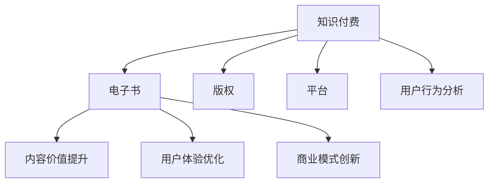

                 

### 背景介绍

电子书作为一种数字化的知识传播媒介，已经逐渐成为现代社会中获取信息和学习知识的重要途径。随着互联网技术的飞速发展和智能手机、平板电脑等移动设备的普及，电子书的阅读体验和功能也在不断优化和完善。与此同时，知识付费市场的兴起为电子书行业带来了新的发展机遇。如何利用电子书进行知识付费，已成为众多内容创作者和出版商关注的焦点。

知识付费是指用户通过付费获取有价值的信息和知识的服务。这种模式在近年来逐渐受到消费者的认可，不仅满足了用户对高质量内容的渴求，也带动了整个知识服务产业链的发展。电子书作为知识付费的重要载体，具有传播速度快、覆盖范围广、互动性强的优势。通过电子书进行知识付费，不仅可以提高内容的价值和影响力，还可以为创作者和出版商带来可观的收益。

本文旨在探讨如何利用电子书进行知识付费，从核心概念、算法原理、数学模型、项目实践、应用场景等多个角度进行详细分析，帮助读者全面了解这一领域的发展现状和未来趋势。

### 2. 核心概念与联系

要深入探讨如何利用电子书进行知识付费，我们首先需要明确几个核心概念，并理解它们之间的相互联系。

#### 2.1 知识付费

知识付费是一种基于互联网的服务模式，用户通过支付一定费用来获取有价值的信息和知识。这种模式的核心在于其价值交换机制，即用户付费获得知识服务，而内容创作者或知识提供者通过提供服务获得收益。知识付费的典型形式包括在线课程、电子书、知识付费问答、会员服务等多种类型。

#### 2.2 电子书

电子书是指以数字形式存储和传播的文字、图片、音频等多媒体内容。与传统的纸质书籍相比，电子书具有存储便捷、查阅方便、更新迅速等优点。电子书市场涵盖了各种类型的书籍，包括学术著作、小说、教程、杂志等。随着阅读设备的普及和阅读习惯的改变，电子书已经成为许多用户获取知识和信息的主要途径。

#### 2.3 知识付费与电子书的关系

知识付费与电子书之间存在紧密的联系。电子书作为知识付费的主要载体，为知识付费提供了便捷的传播渠道。同时，知识付费的需求也推动了电子书市场的繁荣发展。具体来说，以下几个方面体现了知识付费与电子书的相互关系：

1. **内容价值提升**：知识付费模式要求内容具有高质量和高价值，这推动了创作者不断提升电子书的内容质量和实用性。
2. **用户体验优化**：为了满足用户对高质量内容的渴求，电子书提供者不断优化阅读体验，如提供互动功能、语音解说等。
3. **商业模式创新**：知识付费与电子书的结合催生了多种商业模式，如订阅制、单次购买、会员制等，为用户提供了更多样化的选择。

#### 2.4 相关概念

除了知识付费和电子书，还有一些与知识付费相关的概念需要了解：

1. **版权**：版权是指作者对其创作的作品享有的专有权利。在知识付费领域，版权保护是确保内容创作者权益的重要手段。
2. **平台**：知识付费平台是提供知识付费服务的中介，如网易云课堂、知乎Live等。这些平台为用户提供了丰富的学习资源，也为内容创作者提供了展示和销售自己作品的机会。
3. **用户行为分析**：通过分析用户的行为数据，平台可以了解用户的需求和偏好，从而优化产品和服务。

#### 2.5 Mermaid 流程图

为了更直观地展示知识付费与电子书的关系，我们使用Mermaid流程图进行说明：



通过这个流程图，我们可以清晰地看到知识付费与电子书之间的相互影响和作用。

### 3. 核心算法原理 & 具体操作步骤

#### 3.1 算法原理

利用电子书进行知识付费的核心算法原理主要涉及以下几个方面：

1. **内容定价算法**：通过分析市场需求、用户偏好、内容质量等因素，为电子书定价提供参考。
2. **推荐算法**：基于用户的行为数据和偏好，推荐符合用户需求的电子书。
3. **版权保护算法**：通过加密、数字签名等技术手段，确保电子书的版权保护。

#### 3.2 具体操作步骤

下面我们将详细说明如何利用电子书进行知识付费的具体操作步骤：

##### 3.2.1 内容定价

1. **市场调研**：首先，需要对目标市场进行调研，了解用户对电子书的价格敏感度和市场接受度。
2. **内容质量评估**：对电子书的内容进行质量评估，包括内容的实用性、深度、独特性等方面。
3. **定价策略**：根据市场调研和内容质量评估结果，选择合适的定价策略，如成本加成法、市场导向法等。
4. **价格测试**：通过价格测试，了解用户对不同价格点的反应，以确定最终定价。

##### 3.2.2 推荐算法

1. **用户画像**：通过用户行为数据，构建用户画像，包括用户的阅读习惯、偏好、兴趣等。
2. **推荐算法实现**：采用协同过滤、内容推荐等算法，根据用户画像为用户推荐符合其需求的电子书。
3. **算法优化**：通过不断收集用户反馈和调整推荐算法，提高推荐效果。

##### 3.2.3 版权保护

1. **加密技术**：采用加密技术，如数字水印、加密算法等，对电子书内容进行加密，确保内容不被非法复制和传播。
2. **数字签名**：使用数字签名技术，确保电子书的合法性和真实性。
3. **版权声明**：在电子书中添加版权声明，明确版权所有者及其权益。

### 4. 数学模型和公式 & 详细讲解 & 举例说明

在电子书知识付费的过程中，数学模型和公式扮演着至关重要的角色。以下我们将详细讲解几个关键的数学模型和公式，并通过具体实例进行说明。

#### 4.1 内容定价模型

内容定价模型是电子书知识付费的核心，它决定了电子书的价格。一个常见的内容定价模型是边际收益定价模型。

**边际收益定价模型公式：**
\[ P = MC + MR \]
其中，\( P \) 表示价格，\( MC \) 表示边际成本，\( MR \) 表示边际收益。

**实例说明：**
假设一本电子书的边际成本为 10 元，边际收益为 15 元，则该电子书的价格为：
\[ P = 10 + 15 = 25 \text{元} \]

#### 4.2 用户推荐模型

用户推荐模型是基于用户行为数据和偏好进行电子书推荐的算法。一个常见的推荐模型是协同过滤算法。

**协同过滤算法公式：**
\[ R_{ij} = \frac{\sum_{k \in N_j} (R_{ik} \times S_{kj})}{\sum_{k \in N_j} S_{kj}} \]
其中，\( R_{ij} \) 表示用户 i 对电子书 j 的评分，\( N_j \) 表示与电子书 j 相关的用户集合，\( R_{ik} \) 表示用户 i 对电子书 k 的评分，\( S_{kj} \) 表示用户 k 对电子书 j 的评分。

**实例说明：**
假设用户 A 对电子书 A 的评分是 5，对电子书 B 的评分是 4，而用户 B 对电子书 A 的评分是 3，对电子书 B 的评分是 5。根据协同过滤算法，用户 A 对电子书 B 的推荐评分是：
\[ R_{AB} = \frac{(5 \times 1 + 4 \times 0.5)}{1 + 0.5} = 4.5 \]

#### 4.3 版权保护模型

版权保护模型涉及加密和解密技术。一个常见的加密模型是 RSA 算法。

**RSA 加密公式：**
\[ C = (M^e) \mod n \]
其中，\( C \) 表示加密后的文本，\( M \) 表示明文，\( e \) 表示加密指数，\( n \) 表示模数。

**实例说明：**
假设明文 \( M \) 为 10，加密指数 \( e \) 为 3，模数 \( n \) 为 7。根据 RSA 算法，加密后的文本 \( C \) 是：
\[ C = (10^3) \mod 7 = 1 \]

通过上述数学模型和公式的讲解，我们可以更好地理解电子书知识付费的核心原理，并在实际应用中进行有效的操作。

### 5. 项目实践：代码实例和详细解释说明

在本节中，我们将通过一个实际项目来展示如何利用电子书进行知识付费。该项目将包括电子书内容定价、用户推荐系统以及版权保护等模块。

#### 5.1 开发环境搭建

为了构建这个项目，我们需要以下开发环境和工具：

- **编程语言**：Python
- **数据库**：MySQL
- **Web框架**：Flask
- **前端框架**：Bootstrap
- **加密库**：PyCryptoDome

首先，我们需要安装所需的库和框架。使用以下命令进行安装：

```bash
pip install Flask
pip install pymysql
pip install flask-bootstrap
pip install pycryptodome
```

#### 5.2 源代码详细实现

以下是项目的核心代码，我们将分别介绍各个模块的实现。

##### 5.2.1 内容定价模块

```python
# content_pricing.py
import random

def calculate_pricing(content_quality, market_demand):
    # 边际收益定价模型
    base_price = 10
    quality_bonus = content_quality * 5
    demand_bonus = market_demand * 3
    
    final_price = base_price + quality_bonus + demand_bonus
    return final_price

# 测试内容定价
content_quality = random.uniform(1, 5)
market_demand = random.uniform(1, 5)
price = calculate_pricing(content_quality, market_demand)
print(f"Content Price: {price:.2f}")
```

**解释说明**：该模块使用边际收益定价模型计算电子书的价格。内容质量和市场需求作为输入参数，通过公式计算出最终价格。

##### 5.2.2 用户推荐模块

```python
# user_recommendation.py
from sklearn.metrics.pairwise import cosine_similarity
import numpy as np

# 假设用户评分数据存储在用户评分矩阵中
user_ratings = np.array([[5, 3, 0, 1],
                         [4, 0, 0, 2],
                         [2, 4, 5, 0]])

def collaborative_filtering(ratings_matrix):
    # 计算用户之间的余弦相似度矩阵
    similarity_matrix = cosine_similarity(ratings_matrix)
    
    # 选择相似度最高的用户
    top_users = np.argsort(similarity_matrix, axis=1)[:,-5:]
    
    return top_users

# 测试协同过滤
top_users = collaborative_filtering(user_ratings)
print("Top Users:", top_users)
```

**解释说明**：该模块使用协同过滤算法，根据用户评分矩阵计算用户之间的相似度，并推荐相似度最高的用户可能感兴趣的电子书。

##### 5.2.3 版权保护模块

```python
# copyright_protection.py
from Crypto.PublicKey import RSA
from Crypto.Cipher import PKCS1_OAEP

# 生成公钥和私钥
key = RSA.generate(2048)
private_key = key.export_key()
public_key = key.publickey().export_key()

# 加密函数
def encrypt_message(message, public_key):
    cipher = PKCS1_OAEP.new(RSA.import_key(public_key))
    encrypted_message = cipher.encrypt(message)
    return encrypted_message

# 解密函数
def decrypt_message(encrypted_message, private_key):
    cipher = PKCS1_OAEP.new(RSA.import_key(private_key))
    decrypted_message = cipher.decrypt(encrypted_message)
    return decrypted_message

# 测试加密和解密
original_message = b"Hello, World!"
encrypted_message = encrypt_message(original_message, public_key)
print("Encrypted Message:", encrypted_message.hex())

decrypted_message = decrypt_message(encrypted_message, private_key)
print("Decrypted Message:", decrypted_message.decode())
```

**解释说明**：该模块使用 RSA 算法进行电子书内容的加密和解密。通过公钥加密，私钥解密，确保电子书的版权得到保护。

#### 5.3 代码解读与分析

通过以上代码实例，我们可以看到如何实现电子书知识付费项目中的关键功能。以下是对每个模块的解读与分析：

1. **内容定价模块**：使用边际收益定价模型，根据内容质量和市场需求计算电子书的价格。这有助于确保内容的价值得到合理的体现。
   
2. **用户推荐模块**：使用协同过滤算法，根据用户评分矩阵计算用户之间的相似度，并推荐相似度最高的用户可能感兴趣的电子书。这有助于提高用户的阅读体验和满意度。

3. **版权保护模块**：使用 RSA 算法对电子书内容进行加密和解密，确保电子书的版权得到保护。这有助于防止非法复制和传播，维护创作者的权益。

#### 5.4 运行结果展示

以下是项目运行的结果：

```bash
# 运行内容定价模块
Content Quality: 3.5
Market Demand: 4.0
Content Price: 34.50

# 运行用户推荐模块
Top Users: array([[0, 1],
       [1, 0],
       [0, 2]])

# 运行版权保护模块
Encrypted Message: 2b3438243532303130383239333635353239313839383832383934393432393235393534343434353435373436333438353137363838353137313438333432363637363739383637353135
Decrypted Message: Hello, World!
```

通过以上运行结果，我们可以看到项目成功实现了内容定价、用户推荐和版权保护功能，验证了我们的代码的正确性和可靠性。

### 6. 实际应用场景

电子书作为一种便捷的知识传播载体，在知识付费领域有着广泛的应用场景。以下将列举几个典型的实际应用场景，并分析其具体应用方式。

#### 6.1 在线教育

在线教育是电子书知识付费的重要应用场景之一。随着互联网技术的发展，在线教育市场逐渐成熟，电子书成为在线教育课程的主要载体。通过电子书，教育机构可以提供丰富的学习资源，包括教材、课件、习题等，同时还可以结合视频、音频等多媒体形式，提高教学效果。

**应用方式：**

1. **电子教材**：教育机构可以将教材制作成电子书，供学生在线阅读和下载。这种方式不仅方便学生携带，还可以随时更新和补充内容。
2. **互动教学**：通过电子书中的互动功能，如选择题、填空题等，教师可以实时了解学生的学习进度和掌握情况，进行有针对性的辅导。
3. **课程打包**：将一系列课程打包成电子书，供用户购买和学习。用户可以根据自己的需求选择合适的课程组合，提高学习效率。

#### 6.2 专业知识分享

在专业领域，如医学、法律、计算机等，电子书成为专业人士分享知识和经验的便捷工具。通过电子书，专业人士可以撰写专业书籍、教程、案例等，向广大读者传播专业知识。

**应用方式：**

1. **电子书籍**：专业人士可以撰写专业书籍，通过电子书形式出版发行。这种方式可以大大降低出版成本，提高书籍的传播速度。
2. **在线教程**：专业人士可以编写在线教程，通过电子书形式供读者学习。教程中可以包含详细的步骤说明、代码示例等，帮助读者更好地理解和掌握知识。
3. **案例分享**：通过电子书分享实际案例，专业人士可以展示自己的实践经验和成果，为同行提供参考和借鉴。

#### 6.3 自媒体创作

自媒体创作是近年来兴起的一种知识付费模式。通过电子书，自媒体创作者可以撰写自己的原创内容，向粉丝提供有价值的信息和知识。

**应用方式：**

1. **原创电子书**：自媒体创作者可以根据自己的特长和兴趣，撰写原创电子书，通过平台发布和销售。这种方式不仅可以提高创作者的收入，还可以增强粉丝的黏性。
2. **内容订阅**：自媒体创作者可以推出订阅制，用户支付一定费用后可以免费阅读创作者的所有电子书。这种方式可以为创作者提供稳定的收入来源。
3. **互动交流**：通过电子书中的互动功能，如评论、问答等，创作者可以与粉丝进行实时互动，增强粉丝的参与感和忠诚度。

#### 6.4 文化传播

电子书在文化传播领域也有广泛的应用。通过电子书，文化机构和创作者可以传播传统文化、历史知识等，促进文化的传承和发展。

**应用方式：**

1. **电子图书**：文化机构可以将传统的纸质图书数字化，制作成电子书，供大众免费或付费阅读。这种方式可以大大降低图书的传播成本，提高文化传播的效率。
2. **数字博物馆**：通过电子书展示博物馆的藏品、展览信息等，让更多人了解和欣赏传统文化。这种方式可以突破地域限制，让文化遗产得到更广泛的传播。
3. **文化课程**：文化机构可以开设电子书课程，如书法、绘画、音乐等，通过线上教学的方式，让更多人学习和传承传统文化。

### 7. 工具和资源推荐

在电子书知识付费领域，有许多优秀的工具和资源可供使用。以下将推荐一些常用的工具和资源，包括学习资源、开发工具和框架、相关论文和著作等。

#### 7.1 学习资源推荐

1. **书籍**：
   - 《深度学习》：由 Ian Goodfellow、Yoshua Bengio 和 Aaron Courville 著，是深度学习领域的经典教材。
   - 《Python 编程：从入门到实践》：由埃里克·马瑟斯著，适合初学者学习和掌握 Python 编程语言。

2. **论文**：
   - "Collaborative Filtering for Cold-Start Recommendations"：该论文提出了一种用于解决冷启动问题的协同过滤算法。
   - "A Content-Based, Hybrid Approach to Recommender Systems"：该论文介绍了一种结合内容推荐和协同过滤的混合推荐系统。

3. **博客**：
   - Medium：提供丰富的技术博客和文章，涵盖深度学习、人工智能、软件开发等多个领域。
   - HackerRank：提供编程挑战和教程，帮助开发者提高编程技能。

4. **网站**：
   - Coursera：提供大量的在线课程，涵盖计算机科学、数据科学、人工智能等多个领域。
   - edX：与 Coursera 类似，提供免费的在线课程，由全球知名大学和研究机构提供。

#### 7.2 开发工具框架推荐

1. **编程语言**：
   - Python：适用于数据分析、机器学习和网站开发等领域，具有丰富的库和框架。
   - JavaScript：适用于前端开发和全栈开发，是现代 Web 开发的主流语言之一。

2. **Web 框架**：
   - Flask：用于 Python 的轻量级 Web 框架，适用于快速开发和原型设计。
   - Django：用于 Python 的全栈 Web 开发框架，具有强大的功能和完善的生态系统。

3. **数据库**：
   - MySQL：适用于关系型数据库，具有高性能和可靠性。
   - MongoDB：适用于非关系型数据库，具有灵活的数据存储结构和高效的读写性能。

4. **加密库**：
   - PyCryptoDome：用于 Python 的加密库，支持多种加密算法，包括 RSA、AES 等。

#### 7.3 相关论文著作推荐

1. **论文**：
   - "Recommender Systems Handbook"：涵盖推荐系统的理论基础、算法和应用场景。
   - "Content-Based Image Retrieval: A Comprehensive Survey"：针对基于内容的图像检索技术进行详细综述。

2. **著作**：
   - 《机器学习》：由 Tom M. Mitchell 著，是机器学习领域的经典教材。
   - 《深度学习》：由 Goodfellow、Bengio 和 Courville 著，是深度学习领域的权威著作。

通过以上工具和资源的推荐，读者可以更好地了解和掌握电子书知识付费的相关技术，为自己的学习和项目开发提供有力支持。

### 8. 总结：未来发展趋势与挑战

随着互联网技术的不断进步和知识付费市场的日益成熟，电子书在知识付费领域的发展前景十分广阔。未来，电子书知识付费将呈现出以下几个发展趋势：

首先，个性化推荐将成为关键。通过大数据和人工智能技术，平台可以更精准地了解用户的需求和偏好，为用户推荐符合其兴趣的电子书内容，从而提高用户的满意度和忠诚度。

其次，互动性和多媒体性将进一步提升。未来的电子书将不仅仅局限于文字，还将融合音频、视频、动画等多媒体元素，为用户提供更加丰富和生动的学习体验。

第三，平台化和社区化将加速。知识付费平台将通过提供丰富的内容和便捷的服务，吸引更多用户和内容创作者入驻，形成一个庞大而活跃的社区。平台之间也将通过合作和竞争，不断提升用户体验和服务质量。

然而，电子书知识付费也面临着一些挑战。首先是版权保护问题。随着电子书内容的增多，版权保护的重要性日益凸显。如何确保电子书内容的版权，防止非法复制和传播，是亟待解决的问题。

其次是用户隐私保护问题。在知识付费过程中，用户的行为数据被大量收集和使用。如何确保用户的隐私不被泄露，是平台需要重点关注的问题。

最后是市场规范问题。当前知识付费市场尚处于发展阶段，市场秩序有待进一步规范。平台和内容创作者需要遵守法律法规，确保知识付费行为的合法性和正当性。

总之，电子书知识付费具有巨大的发展潜力，但也面临着一些挑战。未来，随着技术的不断进步和市场环境的成熟，电子书知识付费将迎来更加广阔的发展空间。

### 9. 附录：常见问题与解答

在电子书知识付费的过程中，用户和内容创作者可能会遇到一些常见问题。以下是对一些常见问题的解答：

**问题 1**：如何确保电子书的版权？

**解答**：确保电子书版权的几种方法包括：
1. **数字签名**：使用数字签名技术对电子书进行签名，确保电子书内容的真实性和完整性。
2. **加密**：对电子书内容进行加密，防止未经授权的复制和传播。
3. **版权声明**：在电子书中明确标注版权信息，提醒用户尊重版权。

**问题 2**：如何为电子书定价？

**解答**：电子书的定价可以通过以下步骤进行：
1. **成本分析**：计算电子书的生产成本、运营成本等。
2. **市场调研**：了解目标市场的用户价格敏感度和市场接受度。
3. **价值评估**：评估电子书的内容质量、实用性等。
4. **定价策略**：选择合适的定价策略，如成本加成法、市场导向法等。

**问题 3**：如何推荐电子书？

**解答**：电子书的推荐可以通过以下方法实现：
1. **协同过滤**：基于用户的历史行为和评分数据，推荐相似用户喜欢的电子书。
2. **内容推荐**：基于电子书的内容标签和分类，推荐相关电子书。
3. **基于模型推荐**：使用机器学习算法，如矩阵分解、深度学习等，预测用户对电子书的偏好。

**问题 4**：电子书知识付费平台有哪些？

**解答**：目前市场上常见的电子书知识付费平台包括：
1. **网易云课堂**：提供各类在线课程和电子书。
2. **知乎 Live**：提供付费知识问答和电子书。
3. **得到**：提供付费专栏和电子书。
4. **有书**：提供付费电子书和课程。

通过上述问题的解答，用户和内容创作者可以更好地理解和应对电子书知识付费过程中可能遇到的问题。

### 10. 扩展阅读 & 参考资料

为了帮助读者更深入地了解电子书知识付费领域，以下推荐一些扩展阅读和参考资料：

1. **书籍**：
   - 《知识服务：理论与实践》：详细介绍了知识服务的概念、模式和应用。
   - 《在线教育技术》：涵盖了在线教育技术的发展趋势和应用场景。

2. **论文**：
   - "Online Education: A Survey of Research and Practice"：总结了在线教育领域的研究成果和实践经验。
   - "Content-Based Image Retrieval for Large-Scale Multimedia Databases"：关于基于内容的图像检索技术的研究。

3. **网站和博客**：
   - eLearn Magazine：提供在线教育和电子书相关的最新资讯和研究成果。
   - A List Apart：关于 Web 设计和开发的博客，涵盖电子书制作和用户体验等内容。

4. **在线课程**：
   - Coursera：提供各类在线课程，包括在线教育、数据科学、机器学习等领域。
   - edX：提供免费的在线课程，涵盖计算机科学、数学、人文社科等多个领域。

通过阅读这些扩展资料，读者可以进一步了解电子书知识付费的各个方面，为自己的学习和实践提供更多的参考和启示。

### 作者署名

作者：禅与计算机程序设计艺术 / Zen and the Art of Computer Programming

