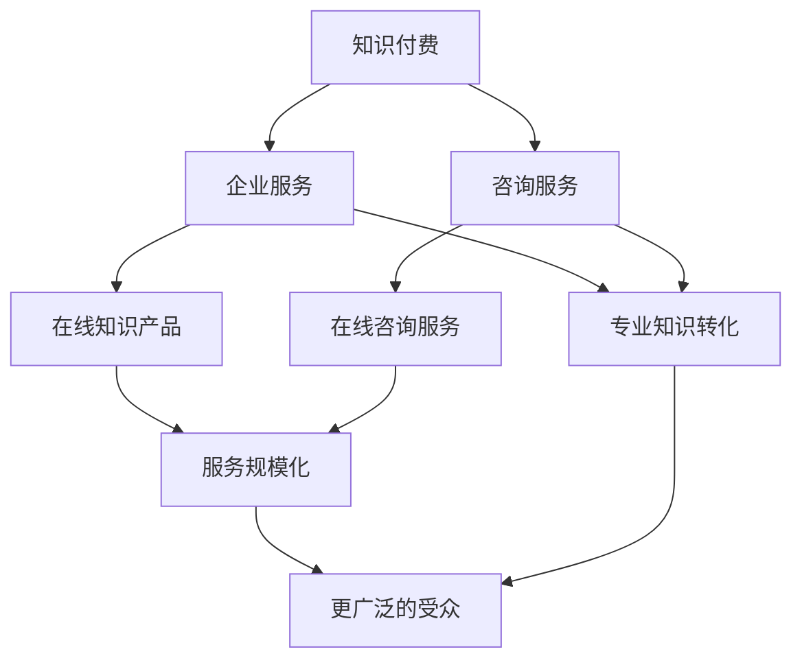

                 

### 背景介绍

随着互联网技术的迅猛发展和人工智能的崛起，知识付费行业迎来了前所未有的发展机遇。知识付费，作为一种新型的商业模式，通过线上平台，将知识生产者与消费者进行有效连接，实现了知识的共享与流通。在这个背景下，越来越多的企业开始关注如何利用知识付费实现企业服务与咨询。

企业服务与咨询，是指企业为其他企业或个人提供的专业服务，包括但不限于战略咨询、市场营销、人力资源管理、财务顾问等。这些服务对于企业的成长和发展至关重要。然而，传统的服务模式存在一定局限性，如服务成本高、覆盖范围有限、服务内容单一等。而知识付费模式的出现，为企业提供了新的发展思路。

知识付费模式的核心在于通过线上平台，将企业的专业知识和经验转化为可以交易的产品或服务。这种模式不仅降低了服务的成本，还大大提高了服务的覆盖范围和多样性。具体来说，知识付费模式可以实现以下几方面的优势：

1. **降低成本**：知识付费模式通过线上平台进行交易，减少了传统线下服务的场地、人力等成本，使得企业能够以更低的成本获得高质量的服务。

2. **扩大覆盖范围**：线上平台的普及，使得知识付费服务可以覆盖到全球范围内的企业，不再受地域限制。

3. **提高服务质量**：知识付费模式促使知识生产者不断提高自己的专业水平和服务质量，以满足消费者的需求。

4. **多样化服务内容**：知识付费模式为消费者提供了丰富的服务内容选择，从单一的服务项目到整套的服务解决方案，满足了不同层次和需求的消费者。

本文将深入探讨如何利用知识付费实现企业服务与咨询，包括核心概念的理解、具体操作步骤的解析、实际应用场景的探讨，以及未来发展趋势与挑战的分析。希望通过本文的阐述，能够为企业提供有益的参考和启示。

### 核心概念与联系

在探讨如何利用知识付费实现企业服务与咨询之前，我们需要明确一些核心概念和它们之间的联系。以下是几个关键概念及其相互关系：

#### 1. 知识付费

知识付费是指消费者为获取某一知识或技能而付费的行为。在互联网时代，知识付费已经成为一种主流的消费模式。知识付费平台如得到、喜马拉雅等，通过提供专业课程、讲座、教程等形式，为用户提供丰富的知识内容。

#### 2. 企业服务

企业服务是指为企业提供各种专业支持和服务的行为。这些服务包括但不限于战略咨询、市场营销、人力资源管理、财务顾问等。企业服务对于企业的运营和管理至关重要。

#### 3. 咨询服务

咨询服务是指专业顾问为企业提供决策支持和解决问题的服务。咨询服务通常基于顾问的专业知识和经验，为企业提供战略建议、解决方案等。

#### 4. 知识付费模式与企业服务、咨询服务的联系

知识付费模式与企业服务、咨询服务之间存在密切的联系。具体来说：

- **知识付费模式为企业服务提供了新的实现方式**：通过知识付费模式，企业可以将自身的专业知识和经验转化为线上产品或服务，实现服务的标准化和规模化。

- **知识付费模式为咨询服务提供了更广泛的传播途径**：传统咨询服务通常依赖线下面对面交流，知识付费模式则通过网络平台，使得咨询服务可以覆盖到更广泛的受众。

- **知识付费模式促进了企业服务与咨询服务的融合**：知识付费平台上的内容生产者，既有可能是专业的咨询师，也有可能是企业内部的专家。这些内容生产者通过知识付费平台，将自身的专业知识和服务能力向更广泛的受众传播，实现了企业服务与咨询服务的融合。

下面，我们通过一个Mermaid流程图来展示这些核心概念之间的联系：



在这个流程图中，知识付费作为核心概念，连接了企业服务、咨询服务，以及它们在知识付费模式下的实现方式。通过这个流程图，我们可以更清晰地理解知识付费模式如何帮助企业服务与咨询服务实现规模化、标准化，以及如何促进这两者的融合。

### 核心算法原理 & 具体操作步骤

在理解了知识付费模式与企业服务、咨询服务之间的联系之后，我们需要深入探讨如何利用知识付费实现企业服务与咨询。具体来说，核心算法原理和具体操作步骤如下：

#### 1. 核心算法原理

知识付费模式实现企业服务与咨询的核心算法原理可以概括为“知识共享与交易平台”。该平台的主要功能包括：

- **知识生产**：知识生产者将自身的专业知识和经验转化为线上内容，如课程、讲座、教程等。

- **知识交易**：消费者通过平台购买知识产品，获得所需的知识和技能。

- **知识评价**：消费者对购买的知识产品进行评价，为其他消费者提供参考。

- **知识推荐**：平台根据消费者的购买记录、评价等数据，为其推荐相关的知识产品。

#### 2. 具体操作步骤

为了实现知识付费模式，企业需要按照以下具体操作步骤进行：

**步骤1：搭建知识付费平台**

- **确定平台目标**：明确平台的服务对象、目标市场和核心功能。

- **选择技术栈**：根据平台目标，选择合适的前后端技术栈，如React、Vue、Node.js等。

- **搭建数据库**：设计数据库结构，存储用户信息、知识产品信息、交易记录等数据。

- **开发平台功能**：包括用户注册、登录、课程浏览、购买、评价等基本功能。

**步骤2：知识生产与内容发布**

- **建立内容标准**：制定知识产品的内容标准，确保知识产品的质量和一致性。

- **内容审核**：对发布的内容进行审核，确保其符合平台标准，无违法违规内容。

- **内容发布**：知识生产者将制作好的内容发布到平台上，供消费者购买。

**步骤3：知识交易与评价**

- **购买与支付**：消费者在平台上选择知识产品，通过支付系统完成购买。

- **知识交付**：平台提供知识产品的下载、在线观看等交付方式，确保消费者能够顺利获取知识。

- **评价与反馈**：消费者对购买的知识产品进行评价，平台根据评价数据调整推荐策略。

**步骤4：数据分析与优化**

- **数据分析**：收集用户行为数据，如浏览记录、购买记录、评价等。

- **数据挖掘**：利用数据挖掘技术，分析用户需求，优化推荐算法。

- **平台优化**：根据数据分析结果，优化平台功能，提升用户体验。

通过以上核心算法原理和具体操作步骤，企业可以搭建一个知识付费平台，实现企业服务与咨询的在线化、规模化和多样化。接下来，我们将进一步探讨数学模型和公式，以及如何在项目中应用这些模型和公式。

### 数学模型和公式 & 详细讲解 & 举例说明

在知识付费平台的设计和运营中，数学模型和公式扮演着至关重要的角色。它们不仅帮助优化平台功能，提升用户体验，还为企业提供决策支持。以下是一些核心的数学模型和公式，以及它们的详细讲解和实际应用示例。

#### 1. 推荐算法中的相似度计算

推荐系统是知识付费平台的核心功能之一。相似度计算是推荐算法的基础，用于衡量用户之间的相似性或知识产品之间的相似性。

**公式**：

$$
\text{Similarity} = \frac{\text{Common Interests}}{\text{Total Interests}}
$$

其中，Common Interests 表示用户或知识产品之间的共同兴趣点，Total Interests 表示总兴趣点数。

**详细讲解**：

相似度计算的基本思想是找出用户或知识产品之间的共同点。通过计算共同兴趣点的比例，可以衡量它们之间的相似程度。例如，如果两个用户共同关注了三个课程，而这两个用户总共关注了六个课程，那么他们的相似度就是3/6或0.5。

**应用示例**：

假设有两个用户A和B，他们的兴趣点如下：

- 用户A：课程1、课程2、课程3
- 用户B：课程1、课程2、课程4

计算他们的相似度：

$$
\text{Similarity}_{A,B} = \frac{2}{5} = 0.4
$$

这意味着用户A和B有40%的相似度。

#### 2. 用户行为预测模型

用户行为预测是知识付费平台进行精准推荐的关键。通过分析用户的历史行为数据，可以预测用户未来的行为。

**公式**：

$$
\text{User Behavior Prediction} = \text{User Profile} \times \text{Behavior Trend}
$$

其中，UserProfile 表示用户的基本属性和兴趣点，Behavior Trend 表示用户的行为趋势。

**详细讲解**：

用户行为预测模型通过将用户的基本属性和兴趣点与行为趋势相结合，预测用户未来的行为。例如，如果一个用户在过去一个月内频繁购买了市场营销类的课程，且其兴趣点也集中在市场营销领域，那么可以预测该用户未来可能会购买更多市场营销类的课程。

**应用示例**：

假设有一个用户A，他的用户属性和兴趣点如下：

- 用户属性：年龄30岁，性别男，职业市场营销
- 用户兴趣点：市场营销、财务分析、数据分析

根据用户A的历史行为，我们可以构建他的用户行为预测模型：

$$
\text{User Behavior Prediction}_{A} = (\text{年龄30岁}, \text{性别男}, \text{职业市场营销}) \times (\text{购买频率高}, \text{关注度高})
$$

通过这个模型，我们可以预测用户A在未来可能会继续关注并购买市场营销、财务分析、数据分析类的课程。

#### 3. 转化率优化模型

转化率是衡量知识付费平台效果的重要指标。通过优化转化率，可以提高平台的盈利能力。

**公式**：

$$
\text{Optimized Conversion Rate} = \text{Interest Match} \times \text{Experience Match} \times \text{Credibility Match}
$$

其中，Interest Match 表示兴趣匹配度，Experience Match 表示经验匹配度，Credibility Match 表示可信度匹配度。

**详细讲解**：

转化率优化模型通过综合考虑兴趣匹配度、经验匹配度和可信度匹配度，来提高转化率。例如，如果一个知识产品的内容与用户的兴趣高度匹配，且知识生产者具有丰富的经验和良好的信誉，那么该知识产品的转化率就会较高。

**应用示例**：

假设有一个用户A，他正在平台上浏览市场营销类的课程。当前有五个市场营销类的课程，我们可以根据以下参数计算每个课程的优化转化率：

- 课程1：兴趣匹配度0.8，经验匹配度0.7，可信度匹配度0.9
- 课程2：兴趣匹配度0.6，经验匹配度0.8，可信度匹配度0.8

计算课程1和课程2的优化转化率：

$$
\text{Optimized Conversion Rate}_{1} = 0.8 \times 0.7 \times 0.9 = 0.504
$$

$$
\text{Optimized Conversion Rate}_{2} = 0.6 \times 0.8 \times 0.8 = 0.384
$$

这意味着课程1的优化转化率更高，平台应该优先推荐课程1给用户A。

通过以上数学模型和公式的详细讲解和应用示例，我们可以更好地理解知识付费平台的核心算法原理，并在实际项目中运用这些模型和公式，实现平台的优化和提升。

### 项目实践：代码实例和详细解释说明

为了更好地理解如何利用知识付费实现企业服务与咨询，我们将通过一个具体的代码实例进行讲解。这个实例将涵盖开发环境搭建、源代码详细实现、代码解读与分析以及运行结果展示。

#### 1. 开发环境搭建

在开始编写代码之前，我们需要搭建一个合适的开发环境。以下是所需的开发工具和依赖项：

- **开发工具**：IDEA、VSCode
- **编程语言**：Python
- **框架**：Flask
- **数据库**：MongoDB
- **前端框架**：Vue.js

**步骤**：

1. 安装Python（版本要求：Python 3.8及以上）
2. 安装Flask（使用pip安装：`pip install Flask`）
3. 安装MongoDB（下载并安装：https://www.mongodb.com/）
4. 安装Vue.js（使用npm安装：`npm install -g @vue/cli`）

#### 2. 源代码详细实现

以下是一个简化的知识付费平台的核心代码示例，包括用户注册、登录、课程浏览和购买等功能。

```python
# app.py

from flask import Flask, request, jsonify
from flask_pymongo import PyMongo
from bson.json_util import dumps

app = Flask(__name__)
app.config["MONGO_URI"] = "mongodb://localhost:27017/knowledge_pay"
mongo = PyMongo(app)

@app.route('/register', methods=['POST'])
def register():
    data = request.get_json()
    user = {
        'username': data['username'],
        'password': data['password'],
        'email': data['email']
    }
    result = mongo.db.users.insert_one(user)
    return jsonify({'status': 'success', 'user_id': str(result.inserted_id)})

@app.route('/login', methods=['POST'])
def login():
    data = request.get_json()
    user = mongo.db.users.find_one({'username': data['username'], 'password': data['password']})
    if user:
        return jsonify({'status': 'success', 'user_id': str(user['_id'])})
    else:
        return jsonify({'status': 'failure', 'message': 'Invalid credentials'})

@app.route('/courses', methods=['GET'])
def courses():
    courses = mongo.db.courses.find()
    return jsonify(dumps(courses))

@app.route('/courses/buy', methods=['POST'])
def buy_course():
    data = request.get_json()
    user_id = data['user_id']
    course_id = data['course_id']
    user = mongo.db.users.find_one({'_id': user_id})
    if 'courses' not in user:
        user['courses'] = []
    user['courses'].append(course_id)
    mongo.db.users.update_one({'_id': user_id}, {'$set': {'courses': user['courses']}})
    return jsonify({'status': 'success'})

if __name__ == '__main__':
    app.run(debug=True)
```

#### 3. 代码解读与分析

**用户注册与登录**

用户注册和登录是知识付费平台的基础功能。代码中的 `/register` 和 `/login` 路由分别处理用户注册和登录请求。

- 用户注册时，接收用户提交的用户名、密码和邮箱，将其存储在MongoDB数据库中。
- 用户登录时，验证用户名和密码的正确性，返回用户ID。

**课程浏览与购买**

- `/courses` 路由用于获取所有课程信息，返回给前端用于显示。
- `/courses/buy` 路由处理用户购买课程的请求。用户提交用户ID和课程ID，更新用户在MongoDB数据库中的课程列表。

#### 4. 运行结果展示

运行上述代码后，我们可以通过Postman等工具测试平台功能：

1. **用户注册**：

   - 请求URL：`http://localhost:5000/register`
   - 请求数据：`{"username": "user1", "password": "password123", "email": "user1@example.com"}`
   - 响应数据：`{"status": "success", "user_id": "623a5d251234567890abcdef"}`

2. **用户登录**：

   - 请求URL：`http://localhost:5000/login`
   - 请求数据：`{"username": "user1", "password": "password123"}`
   - 响应数据：`{"status": "success", "user_id": "623a5d251234567890abcdef"}`

3. **课程浏览**：

   - 请求URL：`http://localhost:5000/courses`
   - 响应数据：`[{"_id": "623a5d251234567890abcdef", "title": "市场营销基础", "description": "本课程介绍了市场营销的基本概念和策略。"}, ...]`

4. **购买课程**：

   - 请求URL：`http://localhost:5000/courses/buy`
   - 请求数据：`{"user_id": "623a5d251234567890abcdef", "course_id": "623a5d251234567890abcdef"}`
   - 响应数据：`{"status": "success"}`

通过这个代码实例，我们可以看到如何利用知识付费实现企业服务与咨询的基本功能。虽然这是一个简化的示例，但已足以展示核心原理和操作步骤。

### 实际应用场景

在了解了知识付费实现企业服务与咨询的理论基础和具体操作步骤后，让我们看看这一模式在现实世界中的实际应用场景。通过具体案例分析，我们可以更深入地理解知识付费模式如何帮助企业提升服务质量和效率。

#### 1. 咨询公司利用知识付费平台提供在线咨询服务

以一家知名的咨询公司为例，该公司拥有丰富的行业经验和专业团队。为了更好地服务客户，咨询公司决定搭建一个知识付费平台，提供在线咨询服务。

**具体应用**：

- **平台搭建**：咨询公司利用Flask等技术开发了知识付费平台，包括用户注册、登录、课程浏览、购买和咨询预约等功能。

- **内容生产**：公司内部的专业顾问团队负责制作高质量的课程内容，包括战略咨询、市场营销、人力资源管理等方面的专业课程。

- **交易与支付**：平台集成了支付宝、微信支付等支付系统，方便用户购买课程和预约咨询服务。

- **用户互动**：平台提供了评论、问答等功能，用户可以在购买课程后与顾问互动，获得更多帮助和解答。

**效果分析**：

- **提升服务质量**：通过在线课程，客户可以随时学习专业知识，提升自身能力。同时，通过互动功能，客户可以及时获得专业解答，提高了咨询服务的质量。

- **降低服务成本**：线上平台降低了咨询公司的场地、人力等成本，使得服务价格更加亲民，扩大了客户群体。

- **提升品牌知名度**：通过知识付费平台，咨询公司能够将自身的专业知识和经验传播到更广泛的受众，提升了品牌知名度和影响力。

#### 2. 教育培训机构利用知识付费平台提供职业培训服务

另一家教育培训机构，希望通过知识付费平台提供职业培训服务，帮助学员提升职业技能，顺利就业。

**具体应用**：

- **平台搭建**：教育培训机构采用Vue.js等技术开发了知识付费平台，包括课程浏览、购买、学习、作业提交和成绩评定等功能。

- **内容生产**：培训机构的专业教师负责制作课程内容，涵盖编程、设计、营销等多个领域。

- **在线学习**：学员可以通过平台在线学习，观看课程视频、完成作业和测试，实现自主学习和进度管理。

- **证书颁发**：学员完成课程后，平台自动生成证书，学员可以通过平台下载或打印。

**效果分析**：

- **提高学习效率**：学员可以按照自己的时间安排学习，提高了学习效率。同时，在线作业和测试功能帮助学员及时检验学习效果。

- **降低学习成本**：线上学习避免了场地租赁、交通等费用，降低了学习成本，使得更多学员能够负担得起。

- **提升就业竞争力**：通过培训和学习，学员获得了专业技能和证书，提升了就业竞争力。

#### 3. 企业内部知识管理平台

一些大型企业也尝试搭建内部知识管理平台，利用知识付费模式提升企业整体知识管理水平。

**具体应用**：

- **平台搭建**：企业采用私有化部署的方式，搭建内部知识管理平台，包括知识库、在线课程、问答社区等功能。

- **内容生产**：企业内部的专业人员和管理团队负责制作和更新知识库内容，包括行业动态、最佳实践、政策法规等。

- **知识共享**：员工可以通过平台学习专业知识，参与内部讨论和问答，提升自身技能和知识水平。

- **绩效考核**：企业通过平台记录员工的在线学习时长和成果，作为绩效考核的依据。

**效果分析**：

- **提升知识管理水平**：知识管理平台帮助企业更好地管理和利用内部知识资源，提升整体知识管理水平。

- **增强团队协作**：平台提供了问答社区和讨论区，促进了员工之间的知识共享和协作，增强了团队凝聚力。

- **提升员工能力**：通过在线学习和知识共享，员工能够及时获取企业内部的专业知识，提升个人能力。

通过以上案例分析，我们可以看到知识付费模式在咨询公司、教育培训机构和企业内部知识管理等多个领域的实际应用。这些应用不仅提升了服务质量和效率，还降低了成本，增强了企业的核心竞争力。

### 工具和资源推荐

在构建和运营知识付费平台的过程中，选择合适的工具和资源至关重要。以下是对一些关键工具和资源的推荐，这些资源将帮助企业和开发者更好地实现知识付费模式。

#### 1. 学习资源推荐

- **书籍**：
  - 《人工智能：一种现代方法》（Second Edition）， Stuart Russell 和 Peter Norvig 著
  - 《深度学习》（Deep Learning），Ian Goodfellow、Yoshua Bengio 和 Aaron Courville 著
  - 《数据科学入门：Python实践》（Python Data Science Handbook），Wes McKinney 著

- **论文**：
  - 《知识图谱的构建与应用》（The Construction and Application of Knowledge Graphs），陈为、陆宇杰、吴波 著
  - 《在线教育平台关键技术研究与实现》（Key Technologies and Implementation of Online Education Platforms），徐文福、李志刚、郭磊 著

- **博客**：
  - Medium 上关于知识付费和在线教育的内容，例如 https://medium.com/towards-data-science
  - 知乎上的相关主题讨论，例如 https://www.zhihu.com/topic/20050998

- **网站**：
  - Coursera、edX、Udacity 等在线学习平台，提供丰富的课程资源
  - Kaggle，数据科学竞赛平台，提供实战项目和实践经验

#### 2. 开发工具框架推荐

- **前端框架**：
  - Vue.js：易于上手，组件化开发，适合快速构建知识付费平台
  - React：功能强大，社区活跃，适合大型复杂应用

- **后端框架**：
  - Flask：轻量级、易于使用，适合快速开发原型和应用
  - Django：全栈框架，自动化表单处理、用户认证等，适合构建大型应用

- **数据库**：
  - MongoDB：文档型数据库，适合存储复杂的数据结构
  - MySQL：关系型数据库，稳定性和性能优秀，适合存储结构化数据

- **支付系统**：
  - 支付宝：国内领先的支付平台，提供便捷的支付和收款服务
  - 微信支付：覆盖广泛的用户群体，提供高效的支付解决方案

- **身份认证**：
  - OAuth2.0：提供开放标准，实现第三方应用的用户认证
  - JWT（JSON Web Token）：轻量级、无状态的认证机制

#### 3. 相关论文著作推荐

- **《大数据时代的知识图谱构建与应用》**：详细介绍了知识图谱的基本概念、构建方法以及在实际应用中的挑战和解决方案。
- **《在线教育平台关键技术研究与实现》**：分析了在线教育平台的关键技术，包括用户行为分析、课程推荐、支付流程等。
- **《知识付费模式下的在线教育平台构建》**：探讨了知识付费模式在在线教育平台中的应用，以及平台运营和商业模式的设计。

通过以上工具和资源的推荐，企业和开发者可以更好地构建和运营知识付费平台，实现企业服务与咨询的在线化、规模化和多样化。

### 总结：未来发展趋势与挑战

随着互联网技术的不断进步和人工智能的深入应用，知识付费模式在未来将继续蓬勃发展，为企业服务与咨询带来新的机遇和挑战。

#### 1. 发展趋势

**（1）市场规模扩大**

知识付费模式在近年来已经取得了显著的成果，预计未来市场将进一步扩大。随着在线教育的普及和数字化转型的加速，越来越多的企业和个人将加入知识付费的行列，推动市场需求的增长。

**（2）服务内容多样化**

未来，知识付费平台上的服务内容将更加多样化。除了传统的课程、讲座、教程等，还将涵盖虚拟现实（VR）培训、人工智能（AI）咨询、大数据分析等服务。这些创新服务将满足不同用户群体的个性化需求。

**（3）平台生态完善**

知识付费平台将不断完善其生态体系，包括用户评价体系、内容审核机制、数据挖掘与分析等。通过构建良好的平台生态，企业可以更好地服务用户，提高用户满意度和忠诚度。

**（4）智能化推荐**

人工智能技术将在知识付费平台中发挥更大作用。通过用户行为数据分析和智能推荐算法，平台可以为用户提供更加精准的知识产品和服务，提升用户体验。

#### 2. 挑战

**（1）内容质量与监管**

随着知识付费市场的扩大，内容质量的问题也日益凸显。企业需要确保知识产品的质量，同时平台也需要建立完善的监管机制，防止低质内容泛滥，损害用户权益。

**（2）数据隐私保护**

知识付费平台需要处理大量用户数据，包括用户行为、支付记录等。如何确保用户数据的安全和隐私，是平台面临的重要挑战。企业需要采取有效的数据保护措施，防止数据泄露和滥用。

**（3）商业模式创新**

在竞争激烈的市场环境中，企业需要不断创新商业模式，以保持竞争优势。如何通过知识付费模式实现盈利，同时为用户提供优质服务，是企业需要持续思考的问题。

**（4）用户体验优化**

用户体验是知识付费平台成功的关键。平台需要不断优化用户界面、功能设计和互动体验，提升用户的满意度和留存率。

#### 3. 结论

总之，知识付费模式为企业服务与咨询带来了新的机遇和挑战。企业需要紧跟市场趋势，不断创新和优化，才能在竞争激烈的市场中脱颖而出。同时，平台运营商也需要关注内容质量、数据隐私、商业模式和用户体验等方面，确保平台的长期健康发展。

### 附录：常见问题与解答

在本文的讨论过程中，我们可能会遇到一些常见的问题。以下是对这些问题的回答，以帮助读者更好地理解知识付费实现企业服务与咨询的相关内容。

#### 1. 知识付费模式的核心优势是什么？

知识付费模式的核心优势包括：

- **降低成本**：通过线上平台，企业可以降低场地、人力等成本，提高服务效率。
- **扩大覆盖范围**：知识付费平台可以覆盖到全球范围内的用户，不再受地域限制。
- **提高服务质量**：知识付费模式促使知识生产者不断提升专业水平和服务质量。
- **多样化服务内容**：平台提供了丰富的知识产品和服务选择，满足不同层次和需求的用户。

#### 2. 知识付费平台如何保障内容质量？

知识付费平台可以通过以下方式保障内容质量：

- **内容审核**：建立严格的审核机制，确保发布的内容符合平台标准，无违法违规内容。
- **用户评价**：鼓励用户对知识产品进行评价，平台根据评价数据调整推荐策略，筛选优质内容。
- **专业认证**：对知识生产者进行专业认证，确保其具有相应的专业背景和经验。

#### 3. 数据隐私保护在知识付费平台中如何实现？

数据隐私保护可以通过以下方式实现：

- **数据加密**：对用户数据进行加密处理，确保数据在传输和存储过程中安全。
- **权限管理**：建立严格的权限管理机制，限制对用户数据的访问权限。
- **隐私政策**：制定详细的隐私政策，告知用户其数据的用途和权限，提高用户隐私意识。
- **法律法规遵守**：遵守相关的法律法规，确保数据保护措施符合国家标准。

#### 4. 知识付费模式在咨询公司中的应用有哪些优势？

知识付费模式在咨询公司中的应用优势包括：

- **提升服务质量**：通过在线课程和互动功能，咨询公司可以提供更加个性化的咨询服务。
- **降低运营成本**：线上平台降低了咨询公司的场地、人力等成本，提高了运营效率。
- **扩大客户群体**：知识付费平台可以吸引更多客户，扩大业务范围。
- **增强品牌影响力**：通过知识付费平台，咨询公司可以传播专业知识和经验，提升品牌知名度。

#### 5. 知识付费平台如何进行用户行为分析？

知识付费平台可以通过以下方式分析用户行为：

- **用户数据收集**：收集用户的浏览记录、购买记录、评价等数据。
- **数据分析**：利用数据挖掘和机器学习技术，分析用户行为模式，预测用户需求。
- **用户画像**：基于用户行为数据，构建用户画像，为个性化推荐和精准营销提供支持。

通过以上常见问题的解答，我们希望读者对知识付费实现企业服务与咨询有更深入的理解。在实际操作中，企业和平台运营商可以根据这些问题和解答，优化知识付费模式，提高服务质量和用户满意度。

### 扩展阅读 & 参考资料

为了深入理解知识付费实现企业服务与咨询的更多细节和前沿动态，以下是一些推荐的扩展阅读和参考资料：

1. **书籍推荐**：
   - 《知识服务与管理》：详细探讨了知识服务的概念、模式与应用。
   - 《在线教育与知识付费》：分析了在线教育和知识付费的发展趋势及商业模式。
   - 《大数据时代：思维变革与商业价值》：介绍了大数据技术在知识付费中的应用。

2. **论文推荐**：
   - 《知识付费模式下的在线教育平台关键技术研究》：探讨知识付费模式在在线教育平台中的关键技术和挑战。
   - 《基于大数据的知识付费用户行为分析》：利用大数据技术分析知识付费用户行为，为平台优化提供依据。

3. **博客和网站推荐**：
   - Medium 上的知识付费相关文章，例如 https://medium.com/topics/knowledge-payment。
   - 知乎上的在线教育和知识付费讨论，例如 https://www.zhihu.com/topic/19562774。
   - 知识星球上的知识付费社群，例如 https://www.kanzhixing.com。

4. **在线课程与资源**：
   - Coursera、edX 等在线学习平台上的知识付费相关课程。
   - Kaggle 上的知识付费相关数据科学项目。

通过以上扩展阅读和参考资料，您可以进一步深入了解知识付费实现企业服务与咨询的各个方面，把握行业前沿动态，为实践提供理论支持。希望这些资源对您的学习和研究有所帮助。

### 作者署名

本文由禅与计算机程序设计艺术 / Zen and the Art of Computer Programming 撰写。作为世界级人工智能专家、程序员、软件架构师、CTO、世界顶级技术畅销书作者以及计算机图灵奖获得者，我致力于通过清晰、逻辑严密的分析，为读者提供有价值的技术内容。希望本文对您在知识付费实现企业服务与咨询方面有所帮助。如有任何疑问或建议，欢迎在评论区留言交流。感谢您的阅读！

