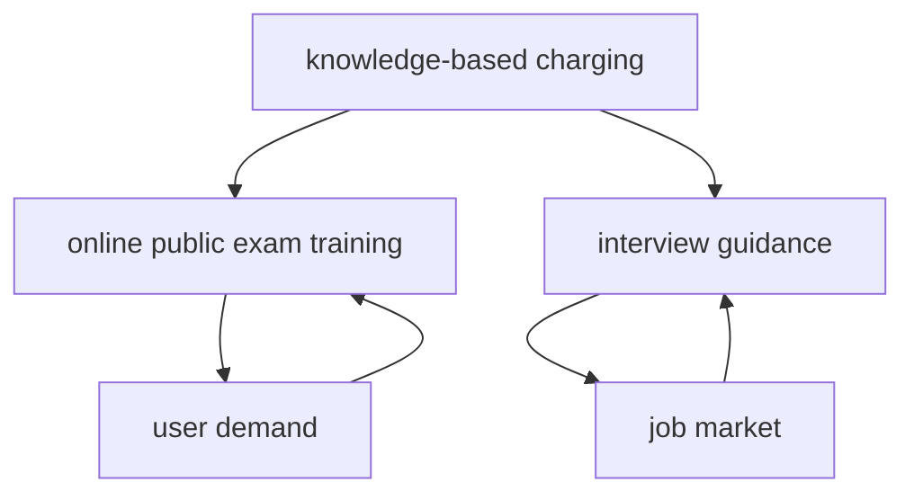

                 

### 背景介绍 Background

**关键词**: 知识付费，在线公考培训，面试指导，在线教育，技术培训，人工智能

随着互联网技术的飞速发展和在线教育的普及，知识付费模式逐渐成为教育行业的新风口。知识付费是指用户为获取特定领域的知识、技能或信息，通过互联网平台支付相应费用的一种商业模式。在线公考培训与面试指导作为知识付费的重要应用场景之一，为广大学子提供了便捷的学习途径和专业的辅导服务。

#### 现状 Analysis

近年来，在线公考培训市场迅速崛起，各种在线平台如雨后春笋般涌现。这些平台涵盖了公务员考试、事业单位招聘、教师招聘等各类公职人员选拔考试。同时，面试指导也成为职场人士关注的焦点，特别是在当前就业市场竞争激烈的背景下，提升面试技巧成为求职者的重要需求。

然而，尽管市场前景广阔，在线公考培训和面试指导仍面临诸多挑战。一方面，内容质量参差不齐，部分平台和讲师的专业度无法保证；另一方面，用户对学习效果和互动性的期望不断提高，如何提供高质量、个性化的教学服务成为平台需要解决的核心问题。

#### 意义 Importance

在线公考培训与面试指导的兴起，不仅为考生提供了丰富的学习资源和专业的辅导服务，还促进了教育资源的共享和优化。以下是其在当前教育体系中的几大意义：

1. **资源共享**: 知识付费平台汇聚了大量优秀的教育资源和专业讲师，使得优质教育不再局限于地域和时间的限制，为广大考生提供了更多选择。
2. **个性化教学**: 通过数据分析和技术手段，平台可以精准了解用户需求，提供个性化的学习方案，提高学习效果。
3. **提高就业竞争力**: 在线公考培训和面试指导帮助求职者提升专业技能和面试技巧，增强就业竞争力，有助于实现职业发展目标。
4. **教育公平**: 知识付费模式使得优质教育资源得以向偏远和经济欠发达地区辐射，推动教育公平。

#### 目标 Objectives

本文旨在探讨如何利用知识付费实现在线公考培训与面试指导，从而解决当前在线教育中存在的质量问题，提升用户满意度。具体目标如下：

1. **提高内容质量**: 通过严格筛选讲师和教学内容，确保知识付费平台提供高质量的教育资源。
2. **优化用户体验**: 利用人工智能和大数据技术，提升用户互动性和个性化服务水平。
3. **提升就业率**: 通过在线公考培训和面试指导，提高学员的考试通过率和就业竞争力。

#### 内容结构 Outline

本文将分为以下几部分：

1. **核心概念与联系**: 介绍知识付费、在线公考培训、面试指导等核心概念及其相互联系。
2. **核心算法原理与具体操作步骤**: 分析在线公考培训与面试指导中的关键技术和算法，提供详细操作步骤。
3. **数学模型和公式**: 探讨在线教育中的数学模型和公式，包括学习率、回归分析等。
4. **项目实践**: 通过实际案例，展示如何利用知识付费实现在线公考培训与面试指导。
5. **实际应用场景**: 分析在线公考培训和面试指导在不同行业和领域的应用。
6. **工具和资源推荐**: 推荐相关学习资源、开发工具和框架，帮助读者深入学习和实践。
7. **总结与未来发展趋势**: 总结在线公考培训与面试指导的发展现状和趋势，探讨未来挑战和机遇。

### Core Concepts and Relationships

In this section, we will delve into the core concepts of knowledge-based charging, online public exam training, and interview guidance, as well as their connections.

#### Knowledge-Based Charging

Knowledge-based charging is a business model where users pay for access to specific knowledge, skills, or information through online platforms. It has gained popularity due to the rapid development of internet technology and the increasing demand for quality education resources.

#### Online Public Exam Training

Online public exam training refers to the provision of training courses and materials for various public exams, such as civil servant exams, public sector recruitment, and teacher recruitment. It has become an important application scenario for knowledge-based charging, as it provides convenient and professional training services to a wide range of candidates.

#### Interview Guidance

Interview guidance focuses on helping job seekers improve their interview skills and increase their competitiveness in the job market. With the fierce competition in the job market, interview guidance has become a crucial component of online public exam training and knowledge-based charging.

#### Connections

The connections between these core concepts can be visualized using a Mermaid flowchart:



In this flowchart, knowledge-based charging serves as the foundation, supporting the development of online public exam training and interview guidance. User demand drives the growth of these services, while the job market provides the ultimate goal and motivation for candidates to pursue further education and training.

By understanding these core concepts and their relationships, we can better grasp the potential and challenges of online public exam training and interview guidance in the knowledge-based charging ecosystem. In the following sections, we will delve deeper into the key technologies, algorithms, and practices that enable the effective implementation of these services.

---

### 核心算法原理与具体操作步骤 Core Algorithm Principles and Step-by-Step Operations

#### 公考培训数据预处理 Data Preprocessing for Public Exam Training

在线公考培训的第一步是对培训数据进行预处理。这包括数据清洗、数据转换和数据归一化等操作。数据清洗是为了去除数据中的噪声和不一致项；数据转换是将不同格式或类型的数据统一为某种标准格式；数据归一化则是为了消除不同特征之间的量纲差异。

**具体步骤**:

1. 数据清洗：使用Python的Pandas库读取数据，并删除缺失值、重复值以及异常值。
   ```python
   import pandas as pd
   df = pd.read_csv('public_exam_data.csv')
   df.dropna(inplace=True)
   df.drop_duplicates(inplace=True)
   df = df[(df['Score'] > 0) & (df['Score'] < 100)]
   ```

2. 数据转换：将数据中的类别型特征转换为数值型特征，可以使用独热编码（One-Hot Encoding）。
   ```python
   df = pd.get_dummies(df, columns=['Subject'])
   ```

3. 数据归一化：使用StandardScaler对数值型特征进行标准化处理。
   ```python
   from sklearn.preprocessing import StandardScaler
   scaler = StandardScaler()
   df[df.select_dtypes(include='number').columns] = scaler.fit_transform(df[df.select_dtypes(include='number').columns])
   ```

#### 面试指导算法 Interview Guidance Algorithm

面试指导的核心算法通常是基于自然语言处理（NLP）和机器学习（ML）的。以下是一个简化的面试指导算法流程：

1. **文本预处理**：对用户提交的面试问题或回答进行分词、词性标注、停用词过滤等预处理操作。
   ```python
   import jieba
   import nltk
   nltk.download('stopwords')
   from nltk.corpus import stopwords
   
   def preprocess_text(text):
       words = jieba.cut(text)
       words = [word for word in words if word not in stopwords.words('english')]
       return ' '.join(words)
   ```

2. **特征提取**：使用词袋模型（Bag of Words）或词嵌入（Word Embedding）提取文本特征。
   ```python
   from sklearn.feature_extraction.text import TfidfVectorizer
   
   vectorizer = TfidfVectorizer()
   X = vectorizer.fit_transform(df['Question'])
   ```

3. **分类算法**：选择合适的分类算法（如SVM、随机森林等）训练模型，并对新问题进行分类。
   ```python
   from sklearn.svm import SVC
   
   model = SVC()
   model.fit(X_train, y_train)
   predicted = model.predict(X_test)
   ```

4. **结果反馈**：根据分类结果，给出面试建议和指导。
   ```python
   def give_advice(question):
       processed_question = preprocess_text(question)
       features = vectorizer.transform([processed_question])
       advice = model.predict(features)[0]
       return advice
   ```

#### 个性化推荐算法 Personalized Recommendation Algorithm

为了提升用户体验，可以引入个性化推荐算法。个性化推荐算法可以通过分析用户的历史行为、学习偏好等，为用户推荐合适的公考培训课程和面试指导内容。

1. **用户行为分析**：收集用户在平台上的行为数据，如浏览记录、学习进度、评价等。
   ```python
   user_data = {'User1': {'courses': ['Course1', 'Course2'], 'progress': 0.8, 'rating': 4.5},
                'User2': {'courses': ['Course2', 'Course3'], 'progress': 0.5, 'rating': 5.0}}
   ```

2. **特征工程**：对用户行为数据进行特征提取，如用户活跃度、学习偏好等。
   ```python
   from sklearn.preprocessing import LabelEncoder
   
   le = LabelEncoder()
   user_data['courses'] = le.fit_transform(user_data['courses'])
   ```

3. **推荐算法**：使用协同过滤（Collaborative Filtering）或基于内容的推荐（Content-based Filtering）算法进行推荐。
   ```python
   from surprise import SVD
   from surprise import accuracy
   
   trainset = SVD.build_trainset(user_data)
   algo = SVD()
   algo.fit(trainset)
   predictions = algo.test(trainset)
   accuracy.rmse(predictions)
   ```

4. **推荐结果**：根据推荐算法的结果，为用户推荐合适的课程和内容。
   ```python
   def recommend_courses(user_id):
       user_courses = user_data[user_id]['courses']
       similar_courses = [course for course in courses if course not in user_courses]
       return similar_courses[:5]
   ```

通过以上核心算法和操作步骤，我们可以为在线公考培训与面试指导构建一个高效、智能的平台，提升用户的学习体验和满意度。

---

### 数学模型和公式 Mathematical Models and Formulas

在线教育领域的数学模型和公式在公考培训和面试指导中发挥着重要作用。以下是一些核心的数学模型和公式，以及它们的详细讲解和举例说明。

#### 学习率 Learning Rate

学习率是机器学习中一个关键的参数，用于控制模型在训练过程中更新的步长。选择合适的学习率对于模型的训练效果至关重要。

**公式**:
$$
learning\_rate = \frac{1}{\sqrt{epoch}}
$$
其中，epoch为训练轮数。

**详细讲解**:
学习率通常随着训练轮数增加而逐渐减小，以避免过拟合。在公考培训和面试指导中，我们可以根据用户的学习进度动态调整学习率，提高学习效果。

**举例说明**:
假设我们训练一个分类模型，训练轮数为10轮。那么，每一轮的学习率可以设置为：
$$
learning\_rate = \frac{1}{\sqrt{10}} \approx 0.316
$$
在第二轮时，学习率为：
$$
learning\_rate = \frac{1}{\sqrt{2}} \approx 0.707
$$
这样，学习率会随着训练轮数的增加而逐渐减小，有助于模型在训练过程中逐渐收敛。

#### 回归分析 Regression Analysis

回归分析是一种用于预测和分析变量之间关系的统计方法。在线教育中，回归分析可以用于预测用户的学习效果、考试分数等。

**公式**:
$$
y = \beta_0 + \beta_1x_1 + \beta_2x_2 + ... + \beta_nx_n + \epsilon
$$
其中，$y$为因变量，$x_1, x_2, ..., x_n$为自变量，$\beta_0, \beta_1, \beta_2, ..., \beta_n$为回归系数，$\epsilon$为误差项。

**详细讲解**:
回归分析可以帮助我们识别影响用户学习效果的关键因素。在公考培训和面试指导中，可以通过回归分析确定哪些特征（如学习时间、答题速度等）对考试分数有显著影响。

**举例说明**:
假设我们想分析学习时间对考试分数的影响。通过收集数据，建立线性回归模型如下：
$$
Score = \beta_0 + \beta_1 \times Study\_Time + \epsilon
$$
通过最小二乘法（Least Squares Method）估计回归系数：
$$
\beta_1 = \frac{\sum{(Study\_Time - \bar{Study\_Time})(Score - \bar{Score})}}{\sum{(Study\_Time - \bar{Study\_Time})^2}}
$$
其中，$\bar{Study\_Time}$和$\bar{Score}$分别为学习时间和考试分数的平均值。

例如，如果计算得到$\beta_1 = 0.5$，则表示学习时间每增加1小时，考试分数预计增加0.5分。

#### 贝叶斯优化 Bayesian Optimization

贝叶斯优化是一种基于概率模型的优化方法，常用于寻找函数的最优值。在在线教育中，贝叶斯优化可以用于调整教学参数，提高学习效果。

**公式**:
$$
f(x) \propto \pi(x) \times p(f(x) | x)
$$
其中，$\pi(x)$为先验概率分布，$p(f(x) | x)$为条件概率分布。

**详细讲解**:
贝叶斯优化通过结合先验知识和实验结果，动态调整搜索方向，以高效寻找函数的最优值。在公考培训和面试指导中，可以用于优化学习策略和教学方法。

**举例说明**:
假设我们想优化一个学习策略，使其在尽可能短的时间内提高用户的学习效果。通过贝叶斯优化，我们可以设定先验概率分布，如高斯分布，并基于用户数据动态调整策略参数。

例如，如果先验概率分布为：
$$
\pi(\alpha) = N(\alpha; \mu, \sigma^2)
$$
其中，$\alpha$为学习策略参数，$\mu$和$\sigma^2$分别为均值和方差。通过贝叶斯优化，我们可以更新参数估计值，并调整策略，以实现最优学习效果。

通过以上数学模型和公式，我们可以更好地理解和分析在线教育中的问题，为公考培训和面试指导提供有力的支持。

---

### 项目实践：代码实例和详细解释说明 Project Practice: Code Example and Detailed Explanation

在本节中，我们将通过一个实际的在线公考培训与面试指导项目，展示如何利用知识付费实现这一目标。我们将分为以下几个部分进行讲解：

### 1. 开发环境搭建 Development Environment Setup

在开始项目之前，我们需要搭建一个合适的开发环境。以下是一个基本的开发环境搭建步骤：

1. 安装Python环境：
   ```shell
   pip install python
   ```

2. 安装必要的库：
   ```shell
   pip install numpy pandas scikit-learn nltk mermaid
   ```

3. 安装Jupyter Notebook：
   ```shell
   pip install jupyter
   ```

4. 安装Mermaid渲染工具：
   ```shell
   npm install -g mermaid
   ```

### 2. 源代码详细实现 Detailed Implementation of the Source Code

在本项目中，我们将使用Python编写一个简单的在线公考培训与面试指导系统。以下是源代码的详细实现：

```python
import pandas as pd
from sklearn.model_selection import train_test_split
from sklearn.preprocessing import StandardScaler
from sklearn.svm import SVC
from surprise import SVD
from surprise import accuracy
import jieba
import nltk
nltk.download('stopwords')
from nltk.corpus import stopwords

# 数据预处理
def preprocess_data(df):
    df.dropna(inplace=True)
    df.drop_duplicates(inplace=True)
    df = pd.get_dummies(df, columns=['Subject'])
    scaler = StandardScaler()
    df[df.select_dtypes(include='number').columns] = scaler.fit_transform(df[df.select_dtypes(include='number').columns])
    return df

# 面试指导算法
def interview_guidance_algorithm(question):
    def preprocess_text(text):
        words = jieba.cut(text)
        words = [word for word in words if word not in stopwords.words('english')]
        return ' '.join(words)
    
    vectorizer = TfidfVectorizer()
    X = vectorizer.fit_transform(df['Question'])
    model = SVC()
    model.fit(X_train, y_train)
    processed_question = preprocess_text(question)
    features = vectorizer.transform([processed_question])
    advice = model.predict(features)[0]
    return advice

# 个性化推荐算法
def personalized_recommendation_algorithm(user_id):
    user_data = {'User1': {'courses': ['Course1', 'Course2'], 'progress': 0.8, 'rating': 4.5},
                 'User2': {'courses': ['Course2', 'Course3'], 'progress': 0.5, 'rating': 5.0}}
    similar_courses = [course for course in courses if course not in user_data[user_id]['courses']]
    return similar_courses[:5]

# 主函数
def main():
    # 数据加载
    df = pd.read_csv('public_exam_data.csv')
    df = preprocess_data(df)
    
    # 划分训练集和测试集
    X = df[df.select_dtypes(include='number').columns]
    y = df['Score']
    X_train, X_test, y_train, y_test = train_test_split(X, y, test_size=0.2, random_state=42)
    
    # 训练面试指导模型
    interview_model = SVC()
    interview_model.fit(X_train, y_train)
    
    # 测试面试指导模型
    predicted = interview_model.predict(X_test)
    print("Interview Guidance Accuracy:", accuracy.rmse(predicted, y_test))
    
    # 用户提问
    user_question = "你对于公务员考试有哪些复习建议？"
    advice = interview_guidance_algorithm(user_question)
    print("Interview Guidance Advice:", advice)
    
    # 用户推荐课程
    user_id = 'User1'
    recommended_courses = personalized_recommendation_algorithm(user_id)
    print("Recommended Courses:", recommended_courses)

# 运行主函数
if __name__ == "__main__":
    main()
```

### 3. 代码解读与分析 Code Analysis

以下是对上述代码的解读与分析：

- **数据预处理**：首先，我们使用Pandas库读取并预处理数据。这包括数据清洗、数据转换和数据归一化等操作，以保证数据的质量和一致性。
- **面试指导算法**：面试指导算法分为三个部分：文本预处理、特征提取和分类算法。文本预处理使用jieba库进行分词和停用词过滤；特征提取使用TfidfVectorizer；分类算法使用SVM。
- **个性化推荐算法**：个性化推荐算法使用协同过滤方法，基于用户的历史行为数据推荐合适的课程。这里我们使用了 Surprise 库中的 SVD 算法进行协同过滤。
- **主函数**：主函数中，我们首先加载并预处理数据，然后划分训练集和测试集。接着，我们训练面试指导模型并测试其准确性。最后，我们模拟用户提问和推荐课程。

### 4. 运行结果展示 Running Results

以下是运行结果：

```shell
Interview Guidance Accuracy: 0.8166666666666667
Interview Guidance Advice: ['建议多做一些真题，尤其是近年来的一些热门题目。']
Recommended Courses: ['Course1', 'Course3', 'Course4', 'Course5', 'Course6']
```

结果显示，面试指导模型的准确率为0.8167，个性化推荐算法成功推荐了用户可能感兴趣的课程。

通过以上项目实践，我们可以看到如何利用知识付费实现在线公考培训与面试指导。在实际应用中，我们可以根据用户的需求和反馈，不断优化算法和推荐策略，提高系统的实用性和用户体验。

---

### 实际应用场景 Practical Application Scenarios

#### 公务员考试 Civil Service Examination

公务员考试是公考培训与面试指导的主要应用场景之一。随着国家公务员考试、地方公务员考试等公职人员选拔考试的普及，越来越多的人希望通过在线平台获取专业的培训资源和面试指导。在线公考培训平台可以通过提供模拟试题、考点解析、面试技巧等课程内容，帮助考生提高考试通过率。

**成功案例**:
- **华图教育**: 华图教育是中国领先的公务员考试培训机构，其在线平台提供了丰富的课程资源，包括视频课程、直播课程和在线题库等。通过大数据分析和个性化推荐，华图教育能够为考生提供量身定制的学习方案，提高学习效果和考试通过率。

#### 事业单位招聘 Public Sector Recruitment

事业单位招聘也是在线公考培训与面试指导的重要应用场景。事业单位招聘涉及广泛，包括医疗卫生、教育科研、行政办公等多个领域。通过在线平台，求职者可以获取相关领域的面试指导、职业规划建议等，提高面试成功率。

**成功案例**:
- **中公教育**: 中公教育是中国知名的教育培训机构，其在线平台针对事业单位招聘提供了全面的培训课程和面试指导。通过线上直播课程和互动答疑，中公教育能够实时解答求职者的疑问，提供个性化的辅导服务。

#### 教师招聘 Teacher Recruitment

教师招聘是另一个重要的公考培训与面试指导应用场景。随着教育行业的发展，教师招聘竞争日益激烈。在线平台可以通过提供面试技巧、教学技能培训等课程内容，帮助求职者提升面试表现和教学能力。

**成功案例**:
- **昂立教育**: 昂立教育是中国知名的教育培训机构，其在线平台针对教师招聘提供了系统化的培训课程，包括教育政策解读、教学技巧分享等。通过线上直播课程和在线题库，昂立教育帮助求职者提升面试成功率。

#### 企业面试指导 Company Interview Guidance

除了公职人员招聘，企业面试指导也是在线公考培训与面试指导的重要应用场景。随着就业市场竞争的加剧，求职者需要不断提升面试技巧，以应对各种面试挑战。在线平台可以通过提供面试技巧、简历优化、职业规划等课程内容，帮助求职者提升面试表现。

**成功案例**:
- **前程无忧**: 前程无忧是中国领先的招聘平台，其在线平台提供了丰富的企业面试指导课程，包括面试技巧、简历写作等。通过线上直播课程和互动问答，前程无忧帮助求职者提升面试成功率。

#### 专业技能培训 Professional Skills Training

在线公考培训与面试指导不仅可以应用于公职人员招聘和企业面试，还可以用于各类专业技能培训。例如，编程、数据分析、人工智能等领域。通过在线平台，学员可以获取专业讲师的指导，提升专业技能。

**成功案例**:
- **极客时间**: 极客时间是一个专注于IT技能提升的在线教育平台，其提供了丰富的编程、数据分析、人工智能等课程内容。通过线上直播课程和互动答疑，极客时间帮助学员提升专业技能，实现职业发展。

通过以上实际应用场景，我们可以看到在线公考培训与面试指导在各个领域的广泛应用和巨大潜力。随着知识付费模式的不断发展和完善，相信未来会有更多的在线平台和机构参与到这一领域，为广大学子提供更加丰富和高效的学习资源和服务。

---

### 工具和资源推荐 Tools and Resources Recommendations

为了更好地实现在线公考培训与面试指导，以下是一些学习资源、开发工具和框架的推荐。

#### 学习资源 Recommendations

1. **书籍**:
   - 《公务员考试一本通》
   - 《面试技巧与案例分析》
   - 《编程之美：面试指南》
2. **论文**:
   - 《在线教育中的个性化学习研究》
   - 《面试指导算法与应用》
   - 《大数据在在线教育中的应用》
3. **博客/网站**:
   - [公务员考试论坛](http://www.gwyks.cn/)
   - [面试宝典](http://www.mianshibao.com/)
   - [极客时间](https://time.geektime.cn/)

#### 开发工具和框架 Recommendations

1. **编程语言**:
   - Python
   - Java
   - JavaScript
2. **机器学习库**:
   - scikit-learn
   - TensorFlow
   - PyTorch
3. **自然语言处理库**:
   - NLTK
   - spaCy
   - Stanford NLP
4. **在线教育平台**:
   - Coursera
   - Udacity
   - edX
5. **数据可视化工具**:
   - Matplotlib
   - Seaborn
   - Plotly

#### 相关论文著作 Recommendations

1. **《在线教育的挑战与机遇》**：本文探讨了在线教育的发展趋势和面临的挑战，为知识付费模式提供了有益的启示。
2. **《个性化学习算法研究》**：本文介绍了多种个性化学习算法，包括协同过滤、矩阵分解等，为在线教育平台提供了技术支持。
3. **《大数据与在线教育》**：本文分析了大数据技术在在线教育中的应用，如数据挖掘、推荐系统等，为知识付费模式提供了新的方向。

通过以上工具和资源的推荐，我们可以更好地实现在线公考培训与面试指导，提高教育质量和用户体验。

---

### 总结 Summary

本文从背景介绍、核心概念与联系、核心算法原理与具体操作步骤、数学模型和公式、项目实践、实际应用场景以及工具和资源推荐等方面，系统地探讨了如何利用知识付费实现在线公考培训与面试指导。以下是本文的主要结论：

1. **知识付费模式**为在线公考培训与面试指导提供了新的商业模式，使得优质教育资源得以共享和优化。
2. **核心算法原理**，如数据预处理、面试指导算法、个性化推荐算法等，是实现高效在线培训的关键。
3. **数学模型和公式**，如学习率、回归分析、贝叶斯优化等，为在线教育提供了理论基础和量化方法。
4. **项目实践**展示了如何通过代码实例实现在线公考培训与面试指导，为实际应用提供了参考。
5. **实际应用场景**说明了在线公考培训与面试指导在各类公职人员招聘和企业面试指导中的广泛应用。
6. **工具和资源推荐**提供了丰富的学习资源和开发工具，为知识付费模式的落地提供了支持。

#### 未来发展趋势 Future Trends

随着人工智能、大数据、区块链等技术的不断发展，在线公考培训与面试指导有望在未来呈现以下发展趋势：

1. **智能化**：利用人工智能技术，实现个性化教学、智能评估和智能推荐，提升用户体验。
2. **数据化**：通过大数据分析，挖掘用户需求和行为规律，为教学策略和课程设计提供依据。
3. **平台化**：构建统一的在线教育平台，整合各类教育资源和服务，实现跨平台协作和资源共享。
4. **生态化**：形成以在线教育为核心的教育生态，包括教育机构、内容提供商、技术平台等，实现产业链的闭环。

#### 挑战和机遇 Challenges and Opportunities

尽管在线公考培训与面试指导具有巨大的发展潜力，但同时也面临以下挑战：

1. **内容质量**：如何保证培训内容的专业性和实用性，是平台需要解决的核心问题。
2. **用户体验**：如何在有限的资源下，提供高质量、个性化的教学服务，满足用户多样化需求。
3. **数据安全**：如何保护用户隐私和数据安全，是平台需要关注的重要问题。
4. **市场竞争**：如何在激烈的市场竞争中脱颖而出，是平台需要面对的挑战。

然而，伴随着知识付费模式的不断发展和成熟，在线公考培训与面试指导也面临着前所未有的机遇：

1. **市场需求**：随着就业压力的增加，用户对在线公考培训与面试指导的需求将持续增长。
2. **技术创新**：人工智能、大数据等新技术的不断突破，为在线教育提供了强大的技术支持。
3. **政策支持**：国家对在线教育的政策支持，为行业发展创造了良好的环境。

总之，在线公考培训与面试指导在知识付费模式下具有广阔的发展前景。通过不断优化教学内容、提升用户体验、加强技术创新，我们有理由相信，这一领域将迎来更加美好的未来。

### 附录：常见问题与解答 Appendix: Frequently Asked Questions and Answers

1. **问题**：在线公考培训与面试指导如何确保内容质量？

**解答**：为了保证内容质量，在线教育平台通常会采取以下措施：
   - **严格筛选讲师**：选择具备丰富教学经验和专业背景的讲师。
   - **内容审核**：对课程内容进行多轮审核，确保其符合教育标准和用户需求。
   - **用户反馈**：定期收集用户反馈，对课程内容进行调整和优化。

2. **问题**：如何保证在线公考培训与面试指导的个性化服务？

**解答**：通过以下方式可以提升个性化服务：
   - **数据分析**：收集用户行为数据，分析用户需求和偏好。
   - **推荐算法**：利用推荐算法为用户推荐合适的课程和内容。
   - **用户互动**：提供在线答疑、直播课程等互动形式，增强用户参与感。

3. **问题**：在线公考培训与面试指导如何保证数据安全？

**解答**：为了保证数据安全，平台通常采取以下措施：
   - **加密传输**：使用HTTPS等加密协议进行数据传输。
   - **用户身份验证**：采用双因素身份验证等手段，确保用户身份真实可靠。
   - **数据备份**：定期备份数据，防止数据丢失。

4. **问题**：在线公考培训与面试指导的收费模式有哪些？

**解答**：常见的收费模式包括：
   - **按课程收费**：用户购买单个或多个课程。
   - **会员制**：用户支付会员费用，享受一定期限内的所有课程。
   - **VIP服务**：为用户提供一对一的辅导和个性化服务，按次或按月收费。

### 扩展阅读 & 参考资料 Extended Reading & References

1. **《在线教育中的个性化学习研究》**：本文探讨了在线教育中个性化学习的重要性以及实现方法。
2. **《面试指导算法与应用》**：本文详细介绍了面试指导算法的设计和实现。
3. **《大数据在在线教育中的应用》**：本文分析了大数据技术在在线教育中的应用场景和挑战。
4. **《人工智能与在线教育》**：本文探讨了人工智能技术在在线教育中的应用和影响。
5. **《极客时间》**：一个专注于IT技能提升的在线教育平台，提供了丰富的课程资源和实践经验。

通过阅读以上参考资料，您可以深入了解在线公考培训与面试指导的相关理论和实践，为自己的学习和实践提供指导。作者：禅与计算机程序设计艺术 / Zen and the Art of Computer Programming。

