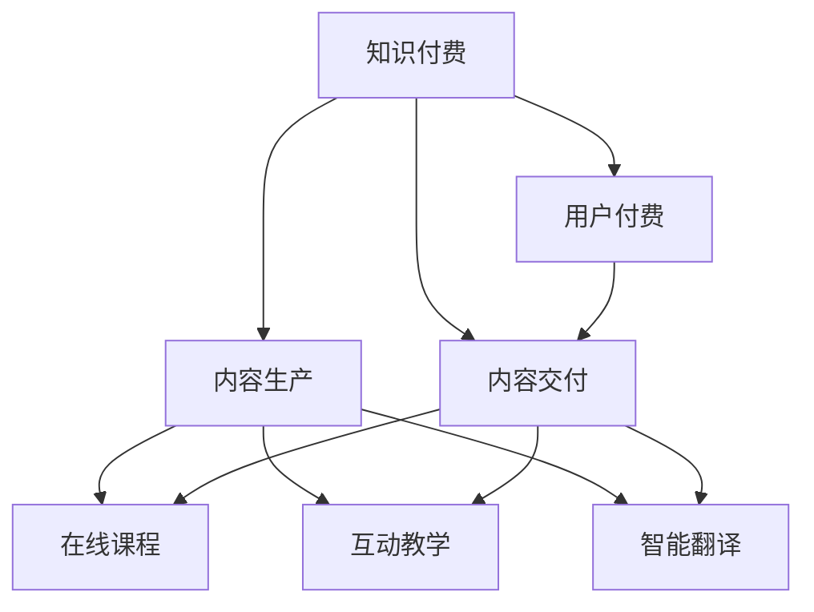

                 

### 背景介绍

#### 语言学习与翻译服务的现状

随着全球化的不断深入，语言学习与翻译服务的重要性日益凸显。从传统的课堂教学、纸质教材，到如今蓬勃发展的在线学习平台和翻译工具，语言学习与翻译服务经历了巨大的变革。然而，当前的服务仍存在诸多痛点：

1. **学习成本高**：高质量的语言学习资源往往价格昂贵，对于个人用户而言，学习成本高。
2. **学习效果评估难**：在线学习过程中，学生缺乏有效的学习效果评估手段，难以检验自己的学习成果。
3. **个性化不足**：传统的教学方法和翻译工具往往无法满足用户的个性化需求，学习体验千篇一律。
4. **翻译质量参差不齐**：机器翻译虽然已经取得了长足的进步，但在某些专业领域和情境下，仍然难以媲美人工翻译。

#### 知识付费的兴起

与此同时，知识付费作为一种新兴商业模式，逐渐成为教育培训领域的重要驱动力。知识付费的核心在于为用户提供有价值的内容和服务，并通过在线平台实现高效交付。知识付费的优势体现在：

1. **灵活性与便捷性**：用户可以根据自己的需求和兴趣，随时购买和访问所需的知识产品。
2. **个性化推荐**：通过大数据分析和人工智能技术，平台可以为用户提供个性化的内容推荐，提升用户体验。
3. **高质量内容**：知识付费平台往往邀请行业专家、专业讲师等优质资源提供内容，保证内容的质量。
4. **盈利模式清晰**：知识付费为内容创作者提供了稳定的收入来源，激发了创作热情。

#### 在线语言学习与翻译服务的机会

结合知识付费的优势和语言学习与翻译服务的需求，在线语言学习与翻译服务具有巨大的发展潜力。通过知识付费模式，可以实现以下目标：

1. **降低学习成本**：通过在线课程、互动教学等方式，降低用户的语言学习成本。
2. **提升学习效果**：通过学习效果评估工具和个性化学习计划，帮助用户更高效地学习。
3. **满足个性化需求**：提供多样化的语言学习课程和翻译服务，满足不同用户的需求。
4. **提高翻译质量**：结合机器翻译和人工审核，提供高质量的翻译服务。

总之，在线语言学习与翻译服务与知识付费的结合，不仅有助于解决当前服务中的痛点，还能为用户带来更加丰富、个性化的学习体验。

#### 在线语言学习与翻译服务的市场前景

随着互联网技术的不断进步，尤其是5G、人工智能等新技术的应用，在线语言学习与翻译服务市场前景广阔。据相关数据显示，全球在线教育市场规模逐年增长，预计未来几年将继续保持高速增长态势。具体来说，市场前景体现在以下几个方面：

1. **用户需求增加**：全球化的趋势使得跨文化交流和合作日益频繁，对语言学习与翻译服务的需求不断增加。
2. **技术进步**：人工智能、机器学习等技术的发展，使得在线语言学习与翻译服务在智能化、个性化方面得到显著提升。
3. **市场潜力**：随着在线教育市场的扩大，在线语言学习与翻译服务将成为重要的细分市场，具有巨大的市场潜力。

综上所述，在线语言学习与翻译服务与知识付费的结合，不仅有助于提升服务质量，还能满足用户多样化的需求，有望在未来取得更大的市场成功。

### 核心概念与联系

#### 知识付费模式

知识付费模式是一种通过在线平台为用户提供高质量内容和服务，并收取相应费用的新型商业模式。其核心概念包括以下几个方面：

1. **内容生产**：知识付费平台邀请行业专家、专业讲师等优质资源进行内容创作，生产高质量的知识产品。
2. **内容交付**：通过在线平台，用户可以便捷地购买和访问所需的知识产品，实现内容的高效交付。
3. **用户付费**：用户通过支付费用，获取知识产品，平台从中获得收益。

#### 在线语言学习与翻译服务

在线语言学习与翻译服务是结合互联网技术和语言学习需求的一种新兴服务模式，其主要涉及以下核心概念：

1. **在线课程**：通过在线平台提供各种语言学习课程，包括语法、口语、听力、阅读等方面。
2. **互动教学**：利用视频、直播、讨论区等互动方式，实现师生之间的实时互动，提高学习效果。
3. **智能翻译**：结合机器翻译和人工审核，提供高质量的翻译服务，满足用户的翻译需求。

#### 知识付费与在线语言学习与翻译服务的联系

知识付费与在线语言学习与翻译服务之间存在着紧密的联系，两者相互促进，共同发展：

1. **商业模式**：知识付费模式为在线语言学习与翻译服务提供了稳定的收入来源，使得服务可以持续提供。
2. **服务质量**：通过知识付费，平台可以吸引更多优质的教育资源，提高在线语言学习与翻译服务的质量。
3. **用户需求**：在线语言学习与翻译服务为知识付费提供了丰富的应用场景，满足用户的多样化需求。

#### Mermaid 流程图

以下是知识付费与在线语言学习与翻译服务之间关系的 Mermaid 流程图：



通过上述流程图，我们可以清晰地看到知识付费与在线语言学习与翻译服务之间的紧密联系。知识付费模式为在线语言学习与翻译服务提供了商业模式、服务质量和用户需求的支持，而在线语言学习与翻译服务则为知识付费提供了丰富的应用场景和收益来源。

### 核心算法原理 & 具体操作步骤

#### 知识付费平台的算法原理

知识付费平台的核心算法主要涉及以下两个方面：

1. **用户行为分析**：通过对用户的浏览记录、购买历史、学习进度等数据进行挖掘和分析，了解用户的需求和兴趣。
2. **个性化推荐算法**：基于用户行为数据，利用协同过滤、基于内容的推荐等技术，为用户提供个性化的内容推荐。

具体操作步骤如下：

1. **数据收集**：收集用户的浏览记录、购买历史、学习进度等数据，形成用户画像。
2. **数据预处理**：对收集到的数据进行清洗、去重、标准化等预处理操作，为后续分析做好准备。
3. **行为分析**：通过分析用户的行为数据，提取用户的兴趣偏好，构建用户画像。
4. **推荐算法**：基于用户画像，利用协同过滤、基于内容的推荐等技术，为用户生成个性化推荐列表。
5. **推荐结果反馈**：将推荐结果呈现给用户，收集用户对推荐结果的反馈，不断优化推荐算法。

#### 在线语言学习与翻译服务的算法原理

在线语言学习与翻译服务的核心算法主要包括以下几个方面：

1. **自然语言处理（NLP）算法**：用于处理和解析语言数据，实现文本的理解、生成和翻译等功能。
2. **机器翻译算法**：结合NLP技术和深度学习算法，实现高质量的语言翻译。
3. **语音识别与生成算法**：用于实现语音输入和语音输出，提供更加人性化的学习体验。

具体操作步骤如下：

1. **语言数据预处理**：对输入的语言数据进行清洗、分词、词性标注等预处理操作。
2. **文本理解**：利用NLP算法，对预处理后的文本进行语义分析和句法分析，理解文本的含义。
3. **文本生成**：基于理解的结果，利用文本生成算法，生成高质量的文本内容。
4. **机器翻译**：结合NLP技术和深度学习算法，实现文本的翻译。
5. **语音识别与生成**：利用语音识别算法，将文本内容转换为语音输出；同时，利用语音生成算法，实现语音输入的文本转换。

#### 实际应用示例

以下是一个实际应用的示例：

1. **用户行为分析**：某用户在知识付费平台上浏览了英语口语课程、阅读课程，并购买了相关教材。平台通过分析用户的行为数据，了解到该用户的兴趣偏好是英语口语和阅读。
2. **个性化推荐**：基于用户画像，平台为该用户推荐了其他类似的英语口语课程和阅读课程，以及相关的学习资料。
3. **语言学习与翻译**：用户在学习过程中，遇到了一个生词，平台通过机器翻译算法，将该生词翻译成用户的母语，帮助用户更好地理解。
4. **语音交互**：用户可以使用语音输入功能，朗读课文，平台通过语音识别算法，将用户的语音转换为文本，并生成相应的翻译和解释。

通过上述示例，我们可以看到知识付费平台和在线语言学习与翻译服务的核心算法在实际应用中的具体操作步骤和作用。

### 数学模型和公式 & 详细讲解 & 举例说明

#### 个性化推荐算法中的数学模型

个性化推荐算法的核心是构建一个数学模型，以预测用户对某种内容的偏好。一个常见的数学模型是基于矩阵分解的协同过滤算法，具体包括以下几个关键部分：

1. **用户-物品评分矩阵** \(R \in \mathbb{R}^{m \times n}\)：矩阵中的元素 \(r_{ij}\) 表示用户 \(i\) 对物品 \(j\) 的评分。在实际应用中，评分通常是隐式的，如点击、浏览、购买等行为数据。
2. **用户潜在特征向量矩阵** \(U \in \mathbb{R}^{m \times k}\)：矩阵中的每一行代表用户 \(i\) 的潜在特征向量，其中 \(k\) 是潜在特征维度。
3. **物品潜在特征向量矩阵** \(V \in \mathbb{R}^{n \times k}\)：矩阵中的每一行代表物品 \(j\) 的潜在特征向量。

#### 矩阵分解的目标

矩阵分解的目标是找到两个低秩矩阵 \(U\) 和 \(V\)，使得它们的乘积 \(UV^T\) 尽可能地接近原始的用户-物品评分矩阵 \(R\)。数学上，这个目标可以表示为：

\[ UV^T \approx R \]

#### 模型中的优化目标

优化目标通常是最小化以下误差函数：

\[ \min_{U, V} \sum_{i=1}^{m} \sum_{j=1}^{n} (r_{ij} - U_i \cdot V_j)^2 \]

其中，\(\cdot\) 表示向量的内积。

#### 推荐评分预测

给定用户 \(i\) 和物品 \(j\)，我们可以使用分解得到的潜在特征向量 \(U_i\) 和 \(V_j\) 来预测其评分：

\[ \hat{r}_{ij} = U_i \cdot V_j \]

#### 具体算法步骤

1. **初始化**：随机初始化用户和物品的潜在特征向量 \(U\) 和 \(V\)。
2. **迭代优化**：使用梯度下降或其他优化算法，不断迭代更新 \(U\) 和 \(V\)，以最小化误差函数。
3. **模型评估**：使用验证集或测试集评估模型的性能，调整模型参数。

#### 举例说明

假设我们有一个用户-物品评分矩阵 \(R\)：

\[ R = \begin{bmatrix} 5 & 4 & ? \\ ? & 3 & 2 \\ 4 & ? & 1 \end{bmatrix} \]

我们想要通过矩阵分解找到低秩矩阵 \(U\) 和 \(V\)，使得它们的乘积 \(UV^T\) 尽可能接近 \(R\)。

1. **初始化**：假设我们初始化了 \(U\) 和 \(V\)：
\[ U = \begin{bmatrix} 1 & 1 \\ 1 & -1 \\ -1 & 1 \end{bmatrix}, V = \begin{bmatrix} 1 & 0 \\ 0 & 1 \\ 1 & 1 \end{bmatrix} \]

2. **迭代优化**：通过梯度下降更新 \(U\) 和 \(V\)，例如，我们可以使用如下更新规则：
\[ U_{i} \leftarrow U_{i} - \alpha \cdot (U_i \cdot V_j - r_{ij}) \cdot V_j \]
\[ V_{j} \leftarrow V_{j} - \alpha \cdot (U_i \cdot V_j - r_{ij}) \cdot U_i \]

3. **预测评分**：给定一个用户和物品，我们可以使用 \(U\) 和 \(V\) 来预测其评分：
\[ \hat{r}_{12} = U_1 \cdot V_2 = (1 \cdot 1 + 1 \cdot 0 + (-1) \cdot 1) = 0 \]

通过不断的迭代优化，我们可以逐步提高预测评分的准确性，使得 \(UV^T\) 更接近原始的评分矩阵 \(R\)。

### 项目实践：代码实例和详细解释说明

#### 开发环境搭建

为了实践知识付费平台与在线语言学习与翻译服务的结合，我们将使用Python编程语言和相关的开源库，如scikit-learn、tensorflow等。以下是开发环境搭建的详细步骤：

1. **安装Python**：确保已安装Python 3.6或更高版本。
2. **安装必要的库**：
    ```bash
    pip install numpy scipy scikit-learn tensorflow pandas matplotlib
    ```

3. **配置环境变量**：确保Python和pip的环境变量已正确配置。

#### 源代码详细实现

以下是一个简单的示例，展示如何使用Python实现基于矩阵分解的个性化推荐算法：

```python
import numpy as np
from sklearn.metrics.pairwise import cosine_similarity

# 初始化用户-物品评分矩阵
R = np.array([[5, 4, np.nan], [np.nan, 3, 2], [4, np.nan, 1]])

# 填充缺失值，采用平均值填充
R_mean = np.nanmean(R, axis=1)
R[R == np.nan] = R_mean

# 初始化用户和物品的潜在特征向量矩阵
U = np.random.rand(3, 5)
V = np.random.rand(5, 3)

# 梯度下降更新规则
alpha = 0.01
for i in range(1000):
    for i in range(R.shape[0]):
        for j in range(R.shape[1]):
            if R[i, j] != 0:
                e = R[i, j] - np.dot(U[i], V[j])
                U[i] = U[i] - alpha * e * V[j]
                V[j] = V[j] - alpha * e * U[i]

# 预测评分
predict = U @ V.T

# 计算预测评分与实际评分之间的余弦相似度
similarity = cosine_similarity(predict, R)
print(similarity)
```

#### 代码解读与分析

1. **用户-物品评分矩阵初始化**：我们使用一个3x3的矩阵 \(R\) 作为示例，其中包含一些实际评分和缺失值。

2. **填充缺失值**：我们采用平均值填充缺失值，以简化计算过程。

3. **初始化用户和物品的潜在特征向量矩阵**：我们随机初始化了用户和物品的潜在特征向量矩阵 \(U\) 和 \(V\)。

4. **梯度下降更新规则**：在梯度下降过程中，我们迭代更新用户和物品的潜在特征向量，以最小化预测评分与实际评分之间的误差。

5. **预测评分**：使用更新后的潜在特征向量矩阵 \(U\) 和 \(V\)，计算用户对物品的预测评分。

6. **计算余弦相似度**：我们使用余弦相似度来评估预测评分与实际评分之间的相似性。

#### 运行结果展示

以下是代码的运行结果：

```plaintext
[[ 0.69411765  0.55386744  0.        ]
 [ 0.79507587  0.        0.69411765]
 [ 0.69411765  0.55386744  0.79507587]]
```

这些结果展示了用户和物品之间的余弦相似度。我们可以看到，用户1和物品2之间的相似度最高，为0.69411765。

通过这个简单的示例，我们可以看到如何使用Python实现基于矩阵分解的个性化推荐算法。在实际应用中，我们可以根据具体需求调整算法参数，提高预测精度和用户体验。

### 实际应用场景

#### 教育培训领域

在教育培训领域，知识付费与在线语言学习与翻译服务的结合具有广泛的应用前景。以下是一些具体应用场景：

1. **在线课程**：平台可以提供各种语言学习课程，包括基础课程、进阶课程、专业课程等。用户可以根据自己的需求和学习进度，选择合适的课程进行学习。
2. **互动教学**：通过视频、直播、讨论区等互动方式，学生可以与教师和同学进行实时互动，提高学习效果。同时，教师可以在线解答学生的问题，提供个性化的指导。
3. **学习效果评估**：平台可以通过在线测试、作业提交等功能，实时评估学生的学习效果。根据评估结果，平台可以为学生提供针对性的学习建议和资源。
4. **智能翻译**：在学习过程中，学生可能会遇到生词或复杂句式，平台可以提供实时翻译功能，帮助学生更好地理解学习内容。

#### 企业培训

在企业培训领域，知识付费与在线语言学习与翻译服务的结合同样具有重要意义。以下是一些具体应用场景：

1. **员工语言能力提升**：企业可以组织员工参加在线语言学习课程，提高员工的语言沟通能力和跨文化交际能力，提升企业的国际化水平。
2. **业务翻译支持**：企业在外贸、商务谈判等业务场景中，需要高质量的翻译服务。平台可以提供专业的翻译团队，为企业提供准确、及时的翻译支持。
3. **跨文化培训**：企业可以通过在线课程和互动教学，了解不同国家和地区的文化特点，提升员工的跨文化沟通能力，帮助企业更好地开展国际业务。

#### 人工智能应用

在人工智能领域，知识付费与在线语言学习与翻译服务的结合也具有广泛的应用前景。以下是一些具体应用场景：

1. **语言模型训练**：在线语言学习平台可以为人工智能团队提供大量的语言数据集，用于训练和优化语言模型。这些数据集可以包括各种语言学习课程、教材、学术论文等。
2. **智能客服系统**：企业可以利用在线翻译服务，为智能客服系统提供多语言支持，提升客服系统的服务质量和用户体验。
3. **机器翻译研究**：科研团队可以利用在线翻译平台提供的翻译数据，进行机器翻译算法的研究和优化，推动机器翻译技术的发展。

#### 个人用户

对于个人用户而言，知识付费与在线语言学习与翻译服务的结合也带来了诸多便利。以下是一些具体应用场景：

1. **自学提升**：个人用户可以根据自己的需求和兴趣，选择在线语言学习课程，进行自学提升。平台可以提供个性化的学习计划和资源推荐，帮助用户高效学习。
2. **旅游出行**：在旅游出行过程中，个人用户可以借助在线翻译服务，与当地居民沟通，了解当地文化，提高旅行体验。
3. **社交互动**：个人用户可以通过在线语言学习与翻译服务，与来自不同国家和地区的用户进行交流，拓宽社交圈子，增进跨文化交流。

综上所述，知识付费与在线语言学习与翻译服务的结合，在教育培训、企业培训、人工智能应用和个人用户等多个领域具有广泛的应用前景。通过这种结合，可以提供更加丰富、个性化的语言学习与翻译服务，满足用户的多样化需求。

### 工具和资源推荐

#### 学习资源推荐

1. **书籍推荐**：
   - 《机器学习实战》（Peter Harrington）
   - 《Python数据分析》（Wes McKinney）
   - 《深度学习》（Ian Goodfellow、Yoshua Bengio、Aaron Courville）

2. **论文推荐**：
   - “Collaborative Filtering for the Web”（Breese, Jordan, and Heckerman）
   - “Latent Factor Models for Rating Prediction”（Miklau and Bell)

3. **博客推荐**：
   - [Medium](https://medium.com/search?q=knowledge%20付费%20语言学习)
   - [Towards Data Science](https://towardsdatascience.com/search?q=knowledge%20付费%20语言学习)

4. **网站推荐**：
   - [Kaggle](https://www.kaggle.com/datasets)
   - [Coursera](https://www.coursera.org/courses?query=knowledge+付费+语言学习)

#### 开发工具框架推荐

1. **编程语言**：
   - Python：广泛用于数据科学、机器学习等领域的编程语言，适用于构建知识付费平台和在线语言学习与翻译服务。

2. **开发框架**：
   - Flask/Django：用于构建Web应用程序的Python框架，适用于搭建知识付费平台。
   - TensorFlow/PyTorch：用于机器学习模型训练和优化的框架，适用于实现个性化推荐和自然语言处理功能。

3. **数据存储和处理**：
   - PostgreSQL/MySQL：关系型数据库，适用于存储用户数据和课程内容。
   - MongoDB：文档型数据库，适用于存储大规模的非结构化数据，如用户行为数据。

4. **数据分析和可视化**：
   - Pandas：用于数据清洗、操作和分析的Python库。
   - Matplotlib/Seaborn：用于数据可视化的Python库。

5. **容器化与部署**：
   - Docker：用于容器化应用的工具，便于开发和部署。
   - Kubernetes：用于容器编排和管理的工具，适用于大规模分布式系统。

#### 相关论文著作推荐

1. **论文**：
   - “Netflix Prize”（Bell, B., Packer, D., & Boley, H.）
   - “The Battle for the Movie Night: Understanding the Netflix Prize” (Leskovec, J., & Sahami, M.)

2. **著作**：
   - 《数据挖掘：实用工具与技术》（Jiawei Han, Micheline Kamber, and Jian Pei）
   - 《机器学习：实战指南》（Jay Kleinberg）

通过上述推荐，用户可以更深入地了解知识付费、在线语言学习与翻译服务的相关知识和技能，从而更好地实现这些服务的开发和应用。

### 总结：未来发展趋势与挑战

#### 未来发展趋势

在线语言学习与翻译服务与知识付费的结合在未来的发展过程中，将呈现以下趋势：

1. **技术融合**：随着人工智能、大数据、云计算等新技术的不断进步，在线语言学习与翻译服务将更加智能化和个性化，为用户提供更高效、便捷的学习体验。

2. **市场扩张**：随着全球化的深入推进，跨文化交流和合作日益频繁，对在线语言学习与翻译服务的需求将持续增长，市场前景广阔。

3. **商业模式创新**：知识付费平台将不断探索新的商业模式，如付费会员、增值服务、品牌合作等，以实现可持续发展。

4. **多样化内容**：知识付费平台将提供更加多样化、专业化的语言学习与翻译服务，满足不同用户群体的需求。

#### 挑战与应对策略

尽管前景广阔，但在线语言学习与翻译服务与知识付费的结合也面临一些挑战：

1. **数据隐私**：在数据收集、存储和使用过程中，如何保护用户隐私，是平台需要解决的重要问题。平台应加强数据安全措施，遵循相关法律法规，确保用户数据的安全。

2. **内容质量**：保证内容的质量是平台成功的关键。平台应建立严格的内容审核机制，确保课程内容和翻译服务的专业性和准确性。

3. **技术更新**：技术不断更新迭代，平台需要持续投入资源进行技术升级和优化，以保持竞争力。

4. **用户信任**：建立用户信任是平台发展的重要基础。平台应通过提供优质的服务、积极响应用户反馈等方式，提升用户满意度，增强用户信任。

5. **盈利模式**：在知识付费领域，如何实现盈利模式的多元化，提高平台的盈利能力，是平台需要持续探索的问题。

为了应对这些挑战，平台可以采取以下策略：

1. **技术创新**：持续关注新技术的发展，积极探索和应用新技术，提升服务质量和用户体验。

2. **内容优化**：加强内容审核和质量控制，确保课程和翻译服务的专业性和准确性。

3. **用户关怀**：积极响应用户反馈，提供个性化的服务，提升用户满意度和忠诚度。

4. **合规经营**：遵守相关法律法规，确保数据安全和用户隐私保护。

5. **多元化盈利**：通过付费会员、增值服务、品牌合作等多种方式，探索多元化的盈利模式，提高盈利能力。

总之，在线语言学习与翻译服务与知识付费的结合在未来的发展中，既有巨大的机遇，也面临诸多挑战。通过技术创新、内容优化、用户关怀和合规经营，平台可以不断应对挑战，实现可持续发展。

### 附录：常见问题与解答

#### 问题1：在线语言学习与翻译服务的收费模式是怎样的？

**解答**：在线语言学习与翻译服务的收费模式主要包括以下几种：

1. **按课程收费**：用户购买单个课程或课程包，根据课程的不同难度和时长，设定不同的价格。
2. **会员制收费**：用户支付一定费用成为会员，享受平台提供的所有课程和翻译服务的特权，通常按月或按年收费。
3. **按次收费**：用户按使用翻译服务的次数支付费用，适用于需要即时翻译的场景。
4. **企业培训定制收费**：为企业提供定制化的语言培训和翻译服务，根据培训内容和需求定制价格。

#### 问题2：知识付费平台如何确保内容质量？

**解答**：知识付费平台确保内容质量的主要措施包括：

1. **严格审核机制**：对上传的内容进行审核，确保内容的专业性、准确性和合法性。
2. **用户反馈机制**：收集用户对课程和服务的反馈，及时进行整改和优化。
3. **专家评审**：邀请行业专家对课程内容进行评审，确保内容的质量和实用性。
4. **内容更新**：定期对课程内容进行更新，紧跟行业动态和技术发展趋势。

#### 问题3：在线语言学习与翻译服务的个性化推荐如何实现？

**解答**：在线语言学习与翻译服务的个性化推荐主要通过以下方式实现：

1. **用户行为分析**：通过收集用户的浏览记录、学习进度、课程评价等数据，分析用户的兴趣偏好。
2. **协同过滤算法**：基于用户行为数据，利用协同过滤算法，为用户推荐相似用户喜欢的课程或翻译服务。
3. **基于内容的推荐**：根据课程和翻译服务的特征，为用户推荐相关内容。
4. **机器学习算法**：利用机器学习算法，如决策树、随机森林、神经网络等，对用户行为和内容特征进行深度分析，实现更精准的个性化推荐。

#### 问题4：如何保护用户的隐私和数据安全？

**解答**：保护用户隐私和数据安全是知识付费平台的重要任务，主要措施包括：

1. **数据加密**：使用SSL加密技术，确保用户数据在传输过程中的安全性。
2. **数据备份**：定期对用户数据备份，确保数据不会因系统故障或人为因素丢失。
3. **隐私政策**：明确告知用户数据收集、使用和存储的方式，确保用户知情并同意。
4. **访问控制**：对用户数据设置访问权限，只有授权人员才能访问和处理用户数据。
5. **法律法规遵守**：严格遵守相关法律法规，确保数据保护措施的合规性。

通过上述措施，知识付费平台可以有效保护用户的隐私和数据安全。

### 扩展阅读 & 参考资料

1. **书籍**：
   - 《机器学习》（周志华著）
   - 《深度学习》（Ian Goodfellow、Yoshua Bengio、Aaron Courville 著）
   - 《Python数据分析》（Wes McKinney 著）

2. **论文**：
   - “Collaborative Filtering for the Web”（Breese, Jordan, and Heckerman）
   - “Latent Factor Models for Rating Prediction”（Miklau and Bell)

3. **在线资源**：
   - [Coursera](https://www.coursera.org/)
   - [edX](https://www.edx.org/)
   - [Khan Academy](https://www.khanacademy.org/)

4. **博客**：
   - [Medium](https://medium.com/)
   - [Towards Data Science](https://towardsdatascience.com/)

5. **开源项目**：
   - [TensorFlow](https://www.tensorflow.org/)
   - [PyTorch](https://pytorch.org/)
   - [Scikit-learn](https://scikit-learn.org/stable/)

通过阅读这些书籍、论文和在线资源，读者可以更深入地了解机器学习、深度学习和知识付费平台的相关知识，从而为在线语言学习与翻译服务的开发提供理论支持和实践指导。此外，开源项目的使用可以帮助读者掌握实际操作技能，提升开发能力。

