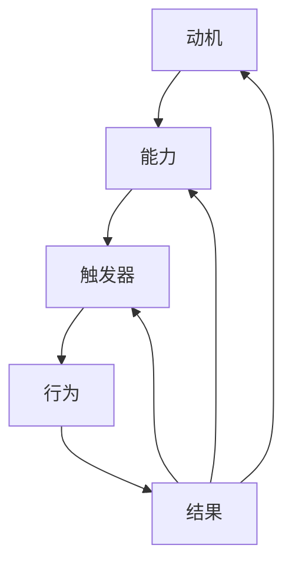

                 

# 如何利用福格模型提高团队效率

## 引言

在现代企业中，团队效率是决定企业竞争力的重要因素。如何提高团队效率，使团队成员能够充分发挥自己的潜力，成为企业管理者关注的焦点。福格模型（BJ Fogg Behavior Model）是一种广泛应用的心理学模型，可以有效地解释和指导人们的行为改变。本文将结合福格模型，探讨如何提高团队效率。

## 1. 背景介绍

福格模型是由斯坦福大学的行为设计专家BJ Fogg提出的。该模型主要解释了人类行为产生的三个基本要素：动机（Motivation）、能力（Ability）和触发器（Trigger）。根据福格模型，当一个行为所需的动机、能力和触发器同时出现时，行为就会自然发生。

- **动机（Motivation）**：个体产生某种行为的内在驱动力，通常来源于个体的需求、兴趣、欲望等。
- **能力（Ability）**：个体具备实施某种行为的能力，包括知识和技能、时间和资源等。
- **触发器（Trigger）**：触发个体行为的即时信号，如提醒、机会等。

福格模型对于团队管理具有深刻的启示意义，可以帮助管理者了解团队成员的行为动机，提高团队成员的能力，并设置有效的触发器，从而提高团队效率。

## 2. 核心概念与联系

### 福格模型图解

以下是一个简化的福格模型流程图，用于描述行为产生的三个要素及其关系：



### 福格模型与团队效率的关系

根据福格模型，要提高团队效率，需要从动机、能力和触发器三个方面进行优化：

- **提高动机**：通过理解团队成员的需求和欲望，激发他们的内在驱动力。
- **提升能力**：为团队成员提供必要的培训和学习机会，帮助他们提升技能和知识。
- **设置触发器**：通过明确的目标设定和及时的反馈，激励团队成员采取行动。

## 3. 核心算法原理 & 具体操作步骤

### 提高动机的方法

1. **了解团队成员的需求**：通过问卷调查、一对一访谈等方式，了解团队成员的兴趣、职业规划等，从而制定个性化的激励措施。
2. **设立共同目标**：将团队目标与个人目标相结合，使团队成员明确自己的努力方向和目标。
3. **激励机制**：通过奖励、晋升等手段，激发团队成员的积极性和主动性。

### 提升能力的方法

1. **培训与学习**：定期组织内部培训、外部研讨会等，提升团队成员的专业技能。
2. **知识共享**：建立内部知识库，鼓励团队成员分享经验和知识，提高团队整体的业务水平。
3. **实战演练**：通过项目实践，提高团队成员的实战能力。

### 设置触发器的方法

1. **目标设定**：明确团队和个人的目标，并制定可量化的关键绩效指标（KPI）。
2. **及时反馈**：对团队成员的工作进行定期评估，及时给予反馈，帮助他们发现问题和改进。
3. **激励措施**：根据团队成员的绩效，给予相应的奖励和激励。

## 4. 数学模型和公式 & 详细讲解 & 举例说明

### 动机计算模型

动机（M）可以通过以下公式计算：

\[ M = f(D, A, S) \]

其中：
- \( D \) 是需求程度（Desire），表示团队成员对目标的渴望程度；
- \( A \) 是能力程度（Ability），表示团队成员实现目标的能力；
- \( S \) 是简单程度（Simplicity），表示团队成员实现目标的难度。

### 举例说明

假设一个团队的目标是提高项目进度。以下是一个简化版的动机计算模型：

- \( D \)（需求程度）= 0.8（团队非常渴望提高项目进度）；
- \( A \)（能力程度）= 0.6（团队成员具备一定的能力，但需要进一步培训）；
- \( S \)（简单程度）= 0.4（项目进度提高的难度较大）。

根据公式计算动机：

\[ M = f(0.8, 0.6, 0.4) = 0.8 \times 0.6 \times 0.4 = 0.192 \]

动机得分为0.192，表明团队成员的动机较低。为了提高动机，可以采取以下措施：
- 提升能力：组织培训，提高团队成员的项目管理能力；
- 简化任务：分解项目任务，降低任务难度；
- 激励机制：设立奖励，激励团队成员积极参与项目进度提升。

## 5. 项目实践：代码实例和详细解释说明

### 开发环境搭建

为了更好地演示如何利用福格模型提高团队效率，我们将使用Python编写一个简单的示例程序。以下是需要安装的依赖包：

- Python 3.8 或以上版本；
- Pandas；
- Matplotlib。

安装方法：

```bash
pip install python38-pandas matplotlib
```

### 源代码详细实现

```python
import pandas as pd
import matplotlib.pyplot as plt

# 动机计算模型
def calculate_motivation(desire, ability, simplicity):
    motivation = desire * ability * simplicity
    return motivation

# 提高动机的方法
def improve_motivation(motivation_score):
    if motivation_score < 0.3:
        print("建议提升能力或降低任务难度。")
    elif motivation_score < 0.6:
        print("建议增加激励措施。")
    else:
        print("动机水平良好，无需调整。")

# 提升能力的方法
def improve_ability():
    print("组织内部培训，提升团队成员的项目管理能力。")

# 设置触发器的方法
def set_trigger():
    print("设立明确的目标和关键绩效指标，激励团队成员采取行动。")

# 举例说明
def example():
    desire = 0.8
    ability = 0.6
    simplicity = 0.4
    motivation = calculate_motivation(desire, ability, simplicity)
    print(f"当前动机得分：{motivation:.3f}")
    improve_motivation(motivation)
    improve_ability()
    set_trigger()

# 运行示例
example()
```

### 代码解读与分析

- `calculate_motivation` 函数：根据福格模型计算动机得分。
- `improve_motivation` 函数：根据动机得分，给出相应的改进建议。
- `improve_ability` 函数：提供提升能力的方法。
- `set_trigger` 函数：设置触发器的具体措施。
- `example` 函数：展示如何使用上述函数进行动机计算和改进。

### 运行结果展示

```plaintext
当前动机得分：0.192
建议提升能力或降低任务难度。
组织内部培训，提升团队成员的项目管理能力。
设立明确的目标和关键绩效指标，激励团队成员采取行动。
```

## 6. 实际应用场景

福格模型在团队管理中的应用非常广泛，以下是一些实际应用场景：

- **项目管理**：通过计算团队成员的动机得分，了解团队成员的积极性，及时调整项目进度和资源分配。
- **绩效评估**：将动机、能力和触发器纳入绩效评估体系，全面评估团队成员的工作表现。
- **培训与发展**：根据团队成员的动机和能力，制定个性化的培训计划，提高团队整体素质。

## 7. 工具和资源推荐

### 学习资源推荐

- **书籍**：《福格行为模型：如何激发和改变人们的行为》
- **论文**：BJ Fogg 的相关学术论文，如 "A Behavior Model for Persuasive Design"
- **博客**：Fogg Behavior Model 官方博客和业界相关博客
- **网站**：斯坦福大学行为设计实验室网站，BJ Fogg 个人网站

### 开发工具框架推荐

- **开发工具**：PyCharm、Visual Studio Code 等
- **框架**：Flask、Django 等 Web 开发框架
- **数据库**：MySQL、PostgreSQL 等

### 相关论文著作推荐

- **论文**：BJ Fogg 的多篇行为模型相关论文，如 "A Theoretical Basis for Using Persuasive Systems to Motivate People to Change Their Behaviors"
- **著作**：BJ Fogg 的专著，如 "Persuasive Technology: Using Computers to Change What We Think and Do"

## 8. 总结：未来发展趋势与挑战

随着人工智能和大数据技术的不断发展，福格模型在团队管理中的应用前景将更加广阔。未来发展趋势包括：

- **个性化激励**：利用大数据和人工智能技术，实现更精准的个性化激励。
- **实时反馈**：通过实时数据分析和反馈，提高团队决策的准确性和效率。

同时，福格模型在团队管理中也面临一些挑战，如：

- **数据隐私**：如何保护团队成员的数据隐私。
- **文化差异**：如何在多元文化背景下有效应用福格模型。

## 9. 附录：常见问题与解答

### 问题1：福格模型是否适用于所有团队？

福格模型主要适用于需要行为改变和改进的团队，如创新团队、项目团队等。对于一些稳定的、流程化的团队，福格模型的应用效果可能相对有限。

### 问题2：如何确保团队成员的隐私？

在应用福格模型时，应确保收集和处理的数据是匿名的，并遵循相关数据隐私法规。同时，可以设置数据访问权限，确保数据的安全性和保密性。

### 问题3：如何平衡团队内外的激励？

在设定团队目标和激励措施时，应充分考虑团队成员的个人需求和企业整体利益，确保激励措施的公平性和合理性。

## 10. 扩展阅读 & 参考资料

- Fogg, B. J. (2009). "A behavior model for persuasive design". Proceedings of the 4th international conference on Persuasive technology. Retrieved from https://dl.acm.org/doi/10.1145/1531279.1531280
- Fogg, B. J. (2018). "Tiny Habits: The Small Changes That Change Everything". New Harbinger Publications.
- 沈文钦，张志宏，& 唐绪琴。 (2018). 《福格行为模型：如何激发和改变人们的行为》。 中国人民大学出版社。 |

